# crates/gcode/src/index/walker

Parent: [[code/modules/crates/gcode/src/index|crates/gcode/src/index]]

## Overview

The walker module owns the policy for turning project files into index inputs. Its core output is `FileClassification`, which distinguishes parsed AST indexing from content-only indexing, while `DiscoveryOptions` controls whether discovery honors `.gitignore` by default . Classification is centralized in `classify_file`: it rejects unsafe text, generated wiki metadata, and generated JavaScript bundles, routes hidden metadata and oversized data-language files to content-only, sends recognized languages to AST indexing, and treats unknown safe text as content-only [crates/gcode/src/index/walker/classification.rs:15-52].

Discovery builds on that classification policy rather than duplicating it. `discover_files_with_options` walks the root with hidden-file and gitignore behavior configured from `DiscoveryOptions`, supplements normal traversal with hidden allowlist matches, then feeds every candidate through `push_classified_file` for deduplication, exclude-pattern handling, and final placement into AST or content-only buckets . Explicit-file classification follows the same path-level rules, adding a visibility check when gitignore handling is enabled before delegating back to `classify_file` [crates/gcode/src/index/walker/classification.rs:56-66].

The supporting files narrow the policy boundaries. `HiddenPathAllowlist` loads default hidden patterns such as `.gobby` plans/wiki markdown and GitHub workflow YAML, merges project configuration, validates and expands patterns, discovers matching hidden files, and checks individual paths . Generated JavaScript detection is isolated in `generated.rs`, where JS-family files are screened by extension, bounded prefix reads, generated-code marker scans, file size, and minification heuristics before classification excludes them . The test module ties these areas together by aggregating classification, discovery, generated, and hidden tests and providing helpers for writing fixtures and comparing relative paths .

## Call Diagram

```mermaid
sequenceDiagram
    participant m_04d3e0ad_4aea_5464_8fbd_8105f151e398 as is_valid_allowlist_pattern &#91;function&#93;
    participant m_04e89974_6865_5e44_9f84_2470487b0f55 as contains_generated_js_marker &#91;function&#93;
    participant m_1227d293_56e1_5c87_85f6_642341778536 as is_hidden_path &#91;function&#93;
    participant m_16cf2279_1d9b_5be4_8298_44ac12773c32 as HiddenPathAllowlist.from_patterns &#91;method&#93;
    participant m_1d62664b_98f9_531f_a9aa_a81238650db4 as is_safe_text_file &#91;function&#93;
    participant m_2b409858_23d3_52c7_8431_b919fcffbd48 as is_generated_js_bundle &#91;function&#93;
    participant m_2b6a5919_acd7_599b_8e25_a5668bbd68c2 as classify_file &#91;function&#93;
    participant m_475c641a_7973_57e4_a3fd_9d7a4fa992a6 as read_file_prefix &#91;function&#93;
    participant m_564c1378_4034_5029_98d6_a99ba06facb5 as HiddenPathAllowlist.load &#91;method&#93;
    participant m_597f0149_1a1c_59d6_ba8f_a47a427f0f7e as expand_zero_depth_globstar &#91;function&#93;
    participant m_83a73907_da7d_5569_90f3_d0d8a76c71ca as looks_minified_js_bundle &#91;function&#93;
    participant m_8d6d0547_e604_5076_858b_fc6889b96385 as push_classified_file &#91;function&#93;
    participant m_9d8a43e3_8601_5f60_884a_8e9bfbfcfd25 as discover_files_with_options &#91;function&#93;
    participant m_9e3f2864_703d_518a_944a_7d2a35ff744b as classify_explicit_file_with_options &#91;function&#93;
    participant m_a436b4d1_f4bf_5bb9_808d_548a0b519cff as HiddenPathAllowlist.discover &#91;method&#93;
    participant m_aaa9b53c_0433_555e_afec_4bdc24232427 as path_has_extension &#91;function&#93;
    participant m_b80b2c1b_627d_5c31_813a_c3b758cf87e9 as explicit_path_visible &#91;function&#93;
    participant m_bedcdc41_d3fd_5edb_9713_09805de2a617 as is_js_family_file &#91;function&#93;
    participant m_ce414d42_18fb_53a0_9266_ab69b2ae3312 as same_existing_path &#91;function&#93;
    participant m_f03ad5be_5b7c_549f_af03_280f872c9c85 as absolute_glob_pattern &#91;function&#93;
    participant m_f931f3c8_31a0_557a_838b_3e606577def8 as discover_files &#91;function&#93;
    participant m_fc1e5b3d_30da_5977_aa73_739a188a2f0d as is_hidden_metadata_content_only &#91;function&#93;
    participant m_fcc61879_e2e0_565d_b48b_66e80ec60933 as read_project_hidden_allowlist &#91;function&#93;
    m_16cf2279_1d9b_5be4_8298_44ac12773c32->>m_04d3e0ad_4aea_5464_8fbd_8105f151e398: calls
    m_16cf2279_1d9b_5be4_8298_44ac12773c32->>m_597f0149_1a1c_59d6_ba8f_a47a427f0f7e: calls
    m_2b409858_23d3_52c7_8431_b919fcffbd48->>m_04e89974_6865_5e44_9f84_2470487b0f55: calls
    m_2b409858_23d3_52c7_8431_b919fcffbd48->>m_475c641a_7973_57e4_a3fd_9d7a4fa992a6: calls
    m_2b409858_23d3_52c7_8431_b919fcffbd48->>m_83a73907_da7d_5569_90f3_d0d8a76c71ca: calls
    m_2b409858_23d3_52c7_8431_b919fcffbd48->>m_bedcdc41_d3fd_5edb_9713_09805de2a617: calls
    m_2b6a5919_acd7_599b_8e25_a5668bbd68c2->>m_1d62664b_98f9_531f_a9aa_a81238650db4: calls
    m_564c1378_4034_5029_98d6_a99ba06facb5->>m_fcc61879_e2e0_565d_b48b_66e80ec60933: calls
    m_9d8a43e3_8601_5f60_884a_8e9bfbfcfd25->>m_8d6d0547_e604_5076_858b_fc6889b96385: calls
    m_9e3f2864_703d_518a_944a_7d2a35ff744b->>m_2b6a5919_acd7_599b_8e25_a5668bbd68c2: calls
    m_9e3f2864_703d_518a_944a_7d2a35ff744b->>m_b80b2c1b_627d_5c31_813a_c3b758cf87e9: calls
    m_a436b4d1_f4bf_5bb9_808d_548a0b519cff->>m_1227d293_56e1_5c87_85f6_642341778536: calls
    m_a436b4d1_f4bf_5bb9_808d_548a0b519cff->>m_f03ad5be_5b7c_549f_af03_280f872c9c85: calls
    m_b80b2c1b_627d_5c31_813a_c3b758cf87e9->>m_ce414d42_18fb_53a0_9266_ab69b2ae3312: calls
    m_f931f3c8_31a0_557a_838b_3e606577def8->>m_9d8a43e3_8601_5f60_884a_8e9bfbfcfd25: calls
    m_fc1e5b3d_30da_5977_aa73_739a188a2f0d->>m_aaa9b53c_0433_555e_afec_4bdc24232427: calls
```

## Files

- [[code/files/crates/gcode/src/index/walker/classification.rs|crates/gcode/src/index/walker/classification.rs]] - This file classifies candidate paths for indexing, separating safe files into AST-backed content or content-only text, while rejecting unsafe, generated, or hidden cases. `classify_file` is the main decision point: it first filters out non-indexable files, then treats hidden metadata, unknown languages, and oversized data-language files as `ContentOnly`, and other detected languages as `Ast`. The other helpers adapt that core logic for explicit requests, boolean indexability checks, content-language naming, visibility checks, path equivalence, and safety validation so discovery and indexing use the same rules.
[crates/gcode/src/index/walker/classification.rs:15-52]
[crates/gcode/src/index/walker/classification.rs:56-66]
[crates/gcode/src/index/walker/classification.rs:69-78]
[crates/gcode/src/index/walker/classification.rs:81-93]
[crates/gcode/src/index/walker/classification.rs:95-111]
- [[code/files/crates/gcode/src/index/walker/discovery.rs|crates/gcode/src/index/walker/discovery.rs]] - This file discovers indexable files under a root path and splits them into two buckets: AST candidates and content-only candidates. `discover_files` is a convenience wrapper that uses default discovery options, while `discover_files_with_options` configures a hidden-file walker with the project size limit and optional gitignore handling, then supplements the walk with hidden-path allowlist entries; both sources feed `push_classified_file`, which deduplicates by canonical path and uses `classify_file` plus exclude patterns to decide whether each path belongs in `candidates`, `content_only`, or neither.
[crates/gcode/src/index/walker/discovery.rs:12-17]
[crates/gcode/src/index/walker/discovery.rs:19-64]
[crates/gcode/src/index/walker/discovery.rs:66-84]
- [[code/files/crates/gcode/src/index/walker/generated.rs|crates/gcode/src/index/walker/generated.rs]] - Helpers for classifying JavaScript-family files as generated bundles during indexing. `is_generated_js_bundle` gates on JS-like extensions, then tries to read the file prefix and metadata; it returns true if the prefix contains common generated-code markers, or for sufficiently large files if the content looks minified. The supporting helpers handle reading a bounded file prefix, checking the extension, scanning the initial bytes for marker phrases, and applying simple minification heuristics based on file size, line length, and line count.
[crates/gcode/src/index/walker/generated.rs:18-38]
[crates/gcode/src/index/walker/generated.rs:40-45]
[crates/gcode/src/index/walker/generated.rs:47-57]
[crates/gcode/src/index/walker/generated.rs:59-65]
[crates/gcode/src/index/walker/generated.rs:67-92]
- [[code/files/crates/gcode/src/index/walker/hidden.rs|crates/gcode/src/index/walker/hidden.rs]] - This file defines the hidden-path allowlist used by the index walker to decide which otherwise hidden files should be included. `HiddenPathAllowlist` loads a default set of glob patterns plus any project overrides from `.gobby/gcode.json`, normalizes and validates them, expands zero-depth globstars, and then can both discover matching hidden files under a root and test whether a specific path matches an allowed hidden-path pattern. The helper functions enforce safe pattern shapes, read project config, and classify special cases like hidden metadata and generated wiki files.
[crates/gcode/src/index/walker/hidden.rs:13-15]
[crates/gcode/src/index/walker/hidden.rs:17-64]
[crates/gcode/src/index/walker/hidden.rs:18-25]
[crates/gcode/src/index/walker/hidden.rs:27-35]
[crates/gcode/src/index/walker/hidden.rs:37-53]
- [[code/files/crates/gcode/src/index/walker/tests.rs|crates/gcode/src/index/walker/tests.rs]] - Test support module for `index::walker` that pulls in the classification, discovery, generated, and hidden test cases and provides two helpers: `write_file` creates a file under a root path after making parent directories, and `rels` converts a list of paths under that root into sorted relative path strings for easy comparison in assertions.
[crates/gcode/src/index/walker/tests.rs:11-17]
[crates/gcode/src/index/walker/tests.rs:19-31]
- [[code/files/crates/gcode/src/index/walker/types.rs|crates/gcode/src/index/walker/types.rs]] - Defines the index walker’s core types: `FileClassification`, an enum for choosing whether a file is indexed as parsed AST or as content only, and `DiscoveryOptions`, a small configuration struct that controls discovery behavior via `respect_gitignore`. The pieces are tied together by `Default` for `DiscoveryOptions`, which enables `.gitignore` handling by default.
[crates/gcode/src/index/walker/types.rs:3-6]
[crates/gcode/src/index/walker/types.rs:9-11]
[crates/gcode/src/index/walker/types.rs:13-19]
[crates/gcode/src/index/walker/types.rs:14-18]

## Components

- `2b6a5919-acd7-599b-8e25-a5668bbd68c2`
- `9e3f2864-703d-518a-944a-7d2a35ff744b`
- `01e57cf4-5711-55ab-8ff5-c0e7e800f88a`
- `44ba0277-d89a-549c-9061-755cf7af4b2a`
- `b80b2c1b-627d-5c31-813a-c3b758cf87e9`
- `ce414d42-18fb-53a0-9266-ab69b2ae3312`
- `1d62664b-98f9-531f-a9aa-a81238650db4`
- `f931f3c8-31a0-557a-838b-3e606577def8`
- `9d8a43e3-8601-5f60-884a-8e9bfbfcfd25`
- `8d6d0547-e604-5076-858b-fc6889b96385`
- `2b409858-23d3-52c7-8431-b919fcffbd48`
- `475c641a-7973-57e4-a3fd-9d7a4fa992a6`
- `bedcdc41-d3fd-5edb-9713-09805de2a617`
- `04e89974-6865-5e44-9f84-2470487b0f55`
- `83a73907-da7d-5569-90f3-d0d8a76c71ca`
- `8c90ddbd-76d1-537e-965e-bfb5b6bad7e7`
- `2f77c030-8d68-5fa6-b774-6455bc1dd62f`
- `564c1378-4034-5029-98d6-a99ba06facb5`
- `16cf2279-1d9b-5be4-8298-44ac12773c32`
- `a436b4d1-f4bf-5bb9-808d-548a0b519cff`
- `e46fdcfb-4ce4-562c-bb65-e7f9d49fd653`
- `fcc61879-e2e0-565d-b48b-66e80ec60933`
- `04d3e0ad-4aea-5464-8fbd-8105f151e398`
- `597f0149-1a1c-59d6-ba8f-a47a427f0f7e`
- `f03ad5be-5b7c-549f-af03-280f872c9c85`
- `1227d293-56e1-5c87-85f6-642341778536`
- `fc1e5b3d-30da-5977-aa73-739a188a2f0d`
- `026d93b6-5269-50a4-8329-f8ef6bcb4cbd`
- `aaa9b53c-0433-555e-afec-4bdc24232427`
- `8cdbdb21-4dad-50df-8229-7384dd4ce8c3`
- `61fa14cb-3e0b-569c-9365-bc120f11dc91`
- `7c87077a-f68d-52c7-bb6f-d5901c757cd2`
- `f06ddb92-61e4-5deb-a6b5-d7cb883a2d84`
- `3b0f5972-0c42-5d06-baeb-0a58e7cde08c`
- `87f2dccf-a964-5cff-b02b-10019a2721f3`

