# crates/gcode/src/projection

Parent: [[code/modules/crates/gcode/src|crates/gcode/src]]

## Overview

The `projection` module synchronizes indexed code data to downstream projection targets, primarily graph and vector stores. Its core logic lives in `sync.rs`, which defines projection target and status types (`ProjectionTarget`, `ProjectionStatus`, `VectorProjectionState`) alongside sync request and reporting structures (`ProjectionSyncRequest`, `ProjectionSyncReport`/`Reports`, `ProjectionSyncStatus`, `ProjectionSyncError`).

It exposes sync entry points—`sync_after_index`, `sync_files_with_state`, `sync_graph_files`/`sync_graph_file`, `sync_vector_files`, and `sync_file`—that propagate code facts to graph and vector projections while tracking per-file synced state (`mark_synced`, `pending_after_code_fact_write`). Reports capture ok, degraded, and error outcomes, with helpers (`typed_projection_error`, `graph_error_kind`, `vector_error_kind`, `vector_lifecycle_from_context`) classifying failures by target.
[crates/gcode/src/projection/sync.rs:11-14]
[crates/gcode/src/projection/sync.rs:17-21]
[crates/gcode/src/projection/sync.rs:24-29]
[crates/gcode/src/projection/sync.rs:33-37]
[crates/gcode/src/projection/sync.rs:40-43]

## Call Diagram

```mermaid
sequenceDiagram
    participant m_16509372_aa0a_5eae_8b43_7d21f610156c as vector_error_kind &#91;function&#93;
    participant m_1e8ab4c9_8d3d_5dbc_bfc2_6622b9957681 as mark_synced &#91;function&#93;
    participant m_1fb25c8d_88c7_5a92_be95_c601568e0423 as sync_after_index &#91;function&#93;
    participant m_269b6103_252d_5ed8_b3f0_59d05722799e as ProjectionSyncReport.degraded_from_error &#91;method&#93;
    participant m_2bb27fdb_99c6_56aa_a764_a6d9fb95c6e0 as sync_files_with_state &#91;function&#93;
    participant m_3e668ccd_fd85_549d_b6ac_f402a11baee1 as sync_graph_file &#91;function&#93;
    participant m_46afde92_9447_539c_b7e3_462d26e8764d as vector_lifecycle_from_context &#91;function&#93;
    participant m_4996d22b_8002_5af6_aceb_07aff60cb48a as sync_state_tracks_projection_success &#91;function&#93;
    participant m_969b0bb3_d2c3_58e5_b07f_1c6092a8213b as typed_projection_error &#91;function&#93;
    participant m_ce1c9ecb_0734_5296_aedb_5d74b16b7c75 as sync_graph_files &#91;function&#93;
    participant m_e75cfd1f_f99e_5003_9de7_4ab35c4dbc1d as sync_vector_files &#91;function&#93;
    m_1fb25c8d_88c7_5a92_be95_c601568e0423->>m_ce1c9ecb_0734_5296_aedb_5d74b16b7c75: calls
    m_1fb25c8d_88c7_5a92_be95_c601568e0423->>m_e75cfd1f_f99e_5003_9de7_4ab35c4dbc1d: calls
    m_269b6103_252d_5ed8_b3f0_59d05722799e->>m_969b0bb3_d2c3_58e5_b07f_1c6092a8213b: calls
    m_2bb27fdb_99c6_56aa_a764_a6d9fb95c6e0->>m_1e8ab4c9_8d3d_5dbc_bfc2_6622b9957681: calls
    m_4996d22b_8002_5af6_aceb_07aff60cb48a->>m_2bb27fdb_99c6_56aa_a764_a6d9fb95c6e0: calls
    m_ce1c9ecb_0734_5296_aedb_5d74b16b7c75->>m_3e668ccd_fd85_549d_b6ac_f402a11baee1: calls
    m_e75cfd1f_f99e_5003_9de7_4ab35c4dbc1d->>m_16509372_aa0a_5eae_8b43_7d21f610156c: calls
    m_e75cfd1f_f99e_5003_9de7_4ab35c4dbc1d->>m_2bb27fdb_99c6_56aa_a764_a6d9fb95c6e0: calls
    m_e75cfd1f_f99e_5003_9de7_4ab35c4dbc1d->>m_46afde92_9447_539c_b7e3_462d26e8764d: calls
```

## Files

- [[code/files/crates/gcode/src/projection/mod.rs|crates/gcode/src/projection/mod.rs]] - `crates/gcode/src/projection/mod.rs` has no indexed API symbols. 
- [[code/files/crates/gcode/src/projection/sync.rs|crates/gcode/src/projection/sync.rs]] - `crates/gcode/src/projection/sync.rs` exposes 26 indexed API symbols.
[crates/gcode/src/projection/sync.rs:11-14]
[crates/gcode/src/projection/sync.rs:17-21]
[crates/gcode/src/projection/sync.rs:24-29]
[crates/gcode/src/projection/sync.rs:33-37]
[crates/gcode/src/projection/sync.rs:40-43]

## Components

- `0c0b8a4d-6a94-5ce6-9a69-a0a30262bbcc`
- `e5c70e76-cf95-5dbc-b40a-d82007b50bec`
- `b447d6c7-91c3-5840-bac3-ced3aeb159ef`
- `5a9822b7-3dd6-5b08-8f9a-28756a55b602`
- `a24abf65-d285-5c46-87e4-43436cfbc0b1`
- `a4f54b72-9fbd-5028-83a0-601dfee3566b`
- `c0831aee-a230-5bee-9213-b41b95d3f0df`
- `7de48d77-64a6-5f5f-a635-5986ca06f1ee`
- `140f6cf2-1cb9-5f69-ae66-c7c2b26a9a22`
- `269b6103-252d-5ed8-b3f0-59d05722799e`
- `dcf6732c-e15c-5b7a-9b17-86f72a875f39`
- `dc2a84bb-c770-572b-bb04-67044649fb2d`
- `1fb25c8d-88c7-5a92-be95-c601568e0423`
- `2bb27fdb-99c6-56aa-a764-a6d9fb95c6e0`
- `ce1c9ecb-0734-5296-aedb-5d74b16b7c75`
- `e75cfd1f-f99e-5003-9de7-4ab35c4dbc1d`
- `3e668ccd-fd85-549d-b6ac-f402a11baee1`
- `3d58588c-b7a5-5459-bf41-e92d1ecd4f40`
- `eda0613d-0503-50c5-a592-c651b382789f`
- `1e8ab4c9-8d3d-5dbc-bfc2-6622b9957681`
- `46afde92-9447-539c-b7e3-462d26e8764d`
- `969b0bb3-d2c3-58e5-b07f-1c6092a8213b`
- `0fe5ae3e-7f0f-55f6-9a41-f29b84034521`
- `16509372-aa0a-5eae-8b43-7d21f610156c`
- `4996d22b-8002-5af6-aceb-07aff60cb48a`
- `37690df0-453d-50e3-91cc-5d75ab647002`

