# crates/gcode/src/search

Parent: [[code/modules/crates/gcode/src|crates/gcode/src]]

## Overview

The search module is the gcode search orchestration layer: it groups PostgreSQL BM25 full-text search, semantic-vector inputs, graph-derived boosts, and Reciprocal Rank Fusion into one search surface, while allowing hybrid callers to degrade when a configured backend is unavailable at query time (crates/gcode/src/search/mod.rs:1-11). Its `fts` submodule is the PostgreSQL-backed lexical layer, keeping the public module name stable while running pg_search BM25 against Gobby’s hub; it exposes content search, symbol search, visible-project variants, counts, graph-symbol resolution, query sanitation, path expansion, and pattern compilation from smaller internal files such as `common`, `content`, `counts`, `graph`, and `symbols` (crates/gcode/src/search/fts.rs:1-32).

The key flow starts with lexical lookup through `fts`, where shared helpers centralize BM25 query sanitation, parameter handling, row-id trust boundaries, reusable symbol filters, path-glob expansion, visible-project file predicates, and ordering strategies. Graph-aware ranking then uses `graph_boost`: it first resolves the query through exact-first visible symbol search, scopes graph access to the resolved symbol’s source project, gathers caller and usage IDs from FalkorDB, and returns a deduplicated ranked boost list; if FalkorDB, a PostgreSQL connection, or a resolved symbol is missing, it returns an empty list so callers can keep lexical results (crates/gcode/src/search/graph_boost.rs:1-47). Related flows expand seed IDs from FTS or semantic search into callee/caller neighborhoods, ranking callees first and deduplicating results for use as another RRF source (crates/gcode/src/search/graph_boost.rs:49-86).

Final result blending is handled by `rrf`, a narrow wrapper around `gobby_core::search::rrf_merge`: callers provide named ranked ID lists such as FTS, semantic, or graph sources, and receive `(symbol_id, combined_score, source_names)` sorted by fused relevance (crates/gcode/src/search/rrf.rs:1-20). Its tests document the expected collaboration contract: single-source ordering is preserved, duplicate IDs accumulate score across sources, source names are deterministic, disjoint sources still merge, and empty inputs are valid edge cases (crates/gcode/src/search/rrf.rs:22-64).
[crates/gcode/src/search/fts/common.rs:16]
[crates/gcode/src/search/fts/content.rs:13-21]
[crates/gcode/src/search/fts/counts.rs:10-66]
[crates/gcode/src/search/fts/graph.rs:16-50]
[crates/gcode/src/search/fts/symbols.rs:15-18]

## Call Diagram

```mermaid
sequenceDiagram
    participant m_03a59319_cb90_5da0_b6da_513367ba0b40 as glob_to_like_prefix &#91;function&#93;
    participant m_06820a48_7d6c_549b_a9e6_b1b1c68426de as query_count &#91;function&#93;
    participant m_0b688623_4f21_5b00_a280_a1d2cbb2d5fb as search_symbols_exact_first &#91;function&#93;
    participant m_0c94647d_0190_534c_ab66_e0696b6a8385 as bm25_score_expression_uses_pdb_score &#91;function&#93;
    participant m_0d0fec52_b764_59a1_8b21_62c58911c683 as count_visible_symbols_by_conditions &#91;function&#93;
    participant m_1622d5fc_3a81_565d_8cfe_6ffabcb12f1f as unique_test_id &#91;function&#93;
    participant m_179dd1c5_b87f_53fc_a90c_763bdd51a20b as search_content &#91;function&#93;
    participant m_1ef9fbbf_bd96_512c_a476_ec5aafe30e6c as OverlayFixtureIds.new &#91;method&#93;
    participant m_20a648c9_6128_5fe2_b489_05e1171388f2 as cleanup_single_project &#91;function&#93;
    participant m_217b7e05_09d4_5acc_b8b3_459b8dcbde29 as cleanup_overlay_visibility_fixture &#91;function&#93;
    participant m_22a35146_0b3d_5a8b_a030_3da3a66883cd as test_merge_single_source &#91;function&#93;
    participant m_23475bad_2efa_5961_a13d_5721256c2451 as count_text_visible &#91;function&#93;
    participant m_239158ff_3daf_584d_b001_791e25c54319 as merge_delegates_to_gobby_core_rrf &#91;function&#93;
    participant m_24e75ff8_ffee_5114_97b1_60fbc8300eea as push_path_filter &#91;function&#93;
    participant m_2b93fd1b_cb44_5f9c_80ff_ccaf43295cba as connect_overlay_visibility_test_db &#91;function&#93;
    participant m_2cd40db1_4e53_5de4_be24_7b59e0b83a43 as graph_expand &#91;function&#93;
    participant m_30d84ae4_7c0c_5f47_a008_8f41fb85f29c as resolve_graph_symbol_by_id_returns_none_for_empty_id &#91;function&#93;
    participant m_3167635d_631c_5707_8b2d_6aa46bf46019 as trusted_row_id &#91;function&#93;
    participant m_33186fc9_8d87_555c_89d0_58c4b6c54b97 as push_param &#91;function&#93;
    participant m_3468182c_fb0e_5b7c_b068_8f2eb57ea954 as content_bm25_order_by_sql &#91;function&#93;
    participant m_36b6335a_ba3c_5adf_bbdd_5cce7c9bf895 as count_content_bm25_visible &#91;function&#93;
    participant m_3d1bee9a_3709_57f9_a28d_e88b9c8785a7 as resolve_graph_symbol_by_id &#91;function&#93;
    participant m_41bebba3_96fa_5b65_bc0c_3f65881e72cf as cleanup_overlay_visibility_projects &#91;function&#93;
    participant m_72fa13bb_eabb_5eb1_b8fe_d7db332ec1b3 as content_hits_from_rows &#91;function&#93;
    participant m_7f8858f7_6495_512a_a587_95d455f4fbbe as search_symbols_by_name &#91;function&#93;
    participant m_842c67f7_b4e2_5d99_8a88_32cad789aa2c as exact_symbol_matches_result &#91;function&#93;
    participant m_8e85ae6a_f520_5f17_afd9_754b8de3432f as count_symbol_file_path_rows &#91;function&#93;
    participant m_930b5993_fb3e_5fb7_8d6c_f60518226697 as path_like_prefixes &#91;function&#93;
    participant m_95df4599_dd9f_564b_83ca_459b096613b2 as param_refs &#91;function&#93;
    participant m_bc13a11f_4797_55ab_96a8_f7c8e4eb57e2 as count_visible_content_by_conditions &#91;function&#93;
    participant m_cdbdd7fb_61d4_5e31_b2bb_b1e42758c75a as graph_expand_grouped &#91;function&#93;
    participant m_d3ee1ca5_ab0b_56bc_931e_148ce45b4a3e as count_symbols_fts_visible &#91;function&#93;
    participant m_ded7d11d_b336_5edf_b8f3_1fbf422eb146 as search_symbols_fts &#91;function&#93;
    participant m_ee7eabc0_8008_50d8_9fde_f2a283bc7fe5 as merge &#91;function&#93;
    m_06820a48_7d6c_549b_a9e6_b1b1c68426de->>m_95df4599_dd9f_564b_83ca_459b096613b2: calls
    m_0b688623_4f21_5b00_a280_a1d2cbb2d5fb->>m_7f8858f7_6495_512a_a587_95d455f4fbbe: calls
    m_0b688623_4f21_5b00_a280_a1d2cbb2d5fb->>m_ded7d11d_b336_5edf_b8f3_1fbf422eb146: calls
    m_0c94647d_0190_534c_ab66_e0696b6a8385->>m_3167635d_631c_5707_8b2d_6aa46bf46019: calls
    m_0d0fec52_b764_59a1_8b21_62c58911c683->>m_8e85ae6a_f520_5f17_afd9_754b8de3432f: calls
    m_179dd1c5_b87f_53fc_a90c_763bdd51a20b->>m_3468182c_fb0e_5b7c_b068_8f2eb57ea954: calls
    m_179dd1c5_b87f_53fc_a90c_763bdd51a20b->>m_72fa13bb_eabb_5eb1_b8fe_d7db332ec1b3: calls
    m_1ef9fbbf_bd96_512c_a476_ec5aafe30e6c->>m_1622d5fc_3a81_565d_8cfe_6ffabcb12f1f: calls
    m_20a648c9_6128_5fe2_b489_05e1171388f2->>m_41bebba3_96fa_5b65_bc0c_3f65881e72cf: calls
    m_217b7e05_09d4_5acc_b8b3_459b8dcbde29->>m_41bebba3_96fa_5b65_bc0c_3f65881e72cf: calls
    m_22a35146_0b3d_5a8b_a030_3da3a66883cd->>m_ee7eabc0_8008_50d8_9fde_f2a283bc7fe5: calls
    m_23475bad_2efa_5961_a13d_5721256c2451->>m_d3ee1ca5_ab0b_56bc_931e_148ce45b4a3e: calls
    m_239158ff_3daf_584d_b001_791e25c54319->>m_ee7eabc0_8008_50d8_9fde_f2a283bc7fe5: calls
    m_24e75ff8_ffee_5114_97b1_60fbc8300eea->>m_03a59319_cb90_5da0_b6da_513367ba0b40: calls
    m_24e75ff8_ffee_5114_97b1_60fbc8300eea->>m_33186fc9_8d87_555c_89d0_58c4b6c54b97: calls
    m_24e75ff8_ffee_5114_97b1_60fbc8300eea->>m_930b5993_fb3e_5fb7_8d6c_f60518226697: calls
    m_2cd40db1_4e53_5de4_be24_7b59e0b83a43->>m_cdbdd7fb_61d4_5e31_b2bb_b1e42758c75a: calls
    m_30d84ae4_7c0c_5f47_a008_8f41fb85f29c->>m_2b93fd1b_cb44_5f9c_80ff_ccaf43295cba: calls
    m_36b6335a_ba3c_5adf_bbdd_5cce7c9bf895->>m_bc13a11f_4797_55ab_96a8_f7c8e4eb57e2: calls
    m_3d1bee9a_3709_57f9_a28d_e88b9c8785a7->>m_842c67f7_b4e2_5d99_8a88_32cad789aa2c: calls
```

## Child Modules

- [[code/modules/crates/gcode/src/search/fts|crates/gcode/src/search/fts]] - The `crates/gcode/src/search/fts` module is the PostgreSQL-backed full-text search layer for gcode, covering symbol lookup, content search, result counting, and graph-symbol resolution. Its shared core in `common.rs` centralizes BM25 query sanitation, safe parameter binding, row-id trust boundaries, reusable symbol filters, path-glob expansion, visible-project file predicates, and ordering strategies for relevance, names, or exact-case priority, so callers build dynamic SQL consistently and safely   .

Search flows split by indexed entity. `content.rs` searches `code_content_chunks`, rejects empty or unsanitizable queries, builds parameterized BM25 conditions for project, language, and path filters, orders by BM25 score, and converts rows into `ContentSearchHit` values with snippets around matched tokens [crates/gcode/src/search/fts/content.rs:13-21] [crates/gcode/src/search/fts/content.rs:24-81]. `symbols.rs` provides ranked FTS, name search, exact-first lookup, and visible variants for `code_symbols`, while `counts.rs` mirrors those filters for counts across symbols and content, falling back to file-path row counting when path filters need post-filtering [crates/gcode/src/search/fts/counts.rs:10-66] [crates/gcode/src/search/fts/counts.rs:69-113].

Graph resolution and tests round out the module. `graph.rs` resolves symbols by id, qualified name, or name, returning a single `ResolvedGraphSymbol` when decisive or deduplicated suggestions when ambiguous [crates/gcode/src/search/fts/graph.rs:16-50] [crates/gcode/src/search/fts/graph.rs:71-78]. `tests.rs` exercises sanitation, glob/path handling, snippet behavior, graph resolution, and database-backed overlay visibility fixtures, giving coverage to both pure SQL-construction helpers and visibility-aware integration paths [crates/gcode/src/search/fts/tests.rs:17-26] .

## Files

- [[code/files/crates/gcode/src/search/fts.rs|crates/gcode/src/search/fts.rs]] - This Rust module implements full-text search functionality using PostgreSQL's pg_search BM25 algorithm. It provides query sanitization and search execution capabilities for Gobby's codebase indexing system. The module exports functions for searching content, symbols, and text with support for visibility filtering, along with utilities for pattern compilation, path filtering, and graph symbol resolution. [crates/gcode/src/search/fts.rs:1-32]
- [[code/files/crates/gcode/src/search/graph_boost.rs|crates/gcode/src/search/graph_boost.rs]] - Provides FalkorDB-backed search boosting for the gcode search pipeline by turning a resolved query or seed symbol set into related symbol IDs from the code graph. `graph_boost` resolves a query through exact-first FTS, then collects deduplicated caller and usage IDs for the matched symbol, while `graph_expand` and `graph_expand_grouped` broaden seed IDs into per-project callee/caller neighborhoods with deduplication. The helper constructors build test `Context` variants with and without graph access, and the tests verify empty fallbacks plus grouped expansion and deduping behavior.
[crates/gcode/src/search/graph_boost.rs:21-47]
[crates/gcode/src/search/graph_boost.rs:55-86]
[crates/gcode/src/search/graph_boost.rs:88-106]
[crates/gcode/src/search/graph_boost.rs:113-127]
[crates/gcode/src/search/graph_boost.rs:129-153]
- [[code/files/crates/gcode/src/search/mod.rs|crates/gcode/src/search/mod.rs]] - Top-level search module for gcode, combining full-text search, semantic vectors, and graph boosting with Reciprocal Rank Fusion. It exposes the FTS, graph_boost, and rrf submodules, and notes that callers may fall back to fewer sources if a configured service is unavailable. [crates/gcode/src/search/mod.rs:1-11]
- [[code/files/crates/gcode/src/search/rrf.rs|crates/gcode/src/search/rrf.rs]] - This file provides a small Reciprocal Rank Fusion wrapper for search results. It defines `MergedResult` as the merged output shape `(symbol_id, combined_score, source_names)` and exposes `merge`, which forwards ranked ID lists from multiple named sources to `gobby_core::search::rrf_merge` and converts the core result into the local tuple form. The test module exercises the behavior end to end: single-source ordering, duplicate IDs accumulating score across sources, deterministic ordering of source names on merged results, disjoint sources, and empty-input edge cases, confirming that the wrapper preserves the core fusion semantics.
[crates/gcode/src/search/rrf.rs:7]
[crates/gcode/src/search/rrf.rs:15-20]
[crates/gcode/src/search/rrf.rs:27-34]
[crates/gcode/src/search/rrf.rs:37-49]
[crates/gcode/src/search/rrf.rs:52-64]

## Components

- `821967f5-60ed-567d-b11d-f9cfb2726a60`
- `2cd40db1-4e53-5de4-be24-7b59e0b83a43`
- `cdbdd7fb-61d4-5e31-b2bb-b1e42758c75a`
- `fce20da6-a98f-553e-bfa7-bec5b8685476`
- `8e07f24c-1345-5ff2-b99b-fa4256b92f7a`
- `d2b29a0f-7fa5-5865-a104-83fe2cdd3eef`
- `8e475747-c493-5cc6-a3e7-f86a684ba506`
- `d0070db0-0756-5591-97c0-c2b4fa4bd3f2`
- `752226a9-8b51-5e80-97ec-354312b73330`
- `4f252f0f-f18a-5b74-97a4-740bcaaa731d`
- `ee7eabc0-8008-50d8-9fde-f2a283bc7fe5`
- `22a35146-0b3d-5a8b-a030-3da3a66883cd`
- `873d4c1e-dd07-58fe-a832-e784dabd9689`
- `58647f00-fd39-5646-bad7-155c0cbd79f2`
- `84046dbc-3560-568e-a490-df5f55d17f96`
- `76109a10-3a96-55e7-bf6b-0ebfdd2fcb4a`
- `8cb6830f-e7a6-5d3f-b87c-ad56c1e35dd1`
- `239158ff-3daf-584d-b001-791e25c54319`

