# crates/gcode/src/search/fts

Parent: [[code/modules/crates/gcode/src/search|crates/gcode/src/search]]

## Overview

This module implements full-text search (FTS) functionality for the GCode crate, primarily leveraging PostgreSQL's FTS engine. It provides core search operations for symbols, file contents, and raw text, featuring BM25 relevance scoring, snippet generation, and advanced path/glob filtering. The module handles query construction, visibility predicates, and graph symbol resolution, while tests.rs contains comprehensive validation and fixture management for search behavior, scoring, and database interactions.
[crates/gcode/src/search/fts/common.rs:16]
[crates/gcode/src/search/fts/common.rs:19-22]
[crates/gcode/src/search/fts/common.rs:25-29]
[crates/gcode/src/search/fts/common.rs:32-36]
[crates/gcode/src/search/fts/common.rs:38-54]
[crates/gcode/src/search/fts/common.rs:39-53]
[crates/gcode/src/search/fts/common.rs:56-59]
[crates/gcode/src/search/fts/common.rs:63-69]
[crates/gcode/src/search/fts/common.rs:71-76]
[crates/gcode/src/search/fts/common.rs:78-86]
[crates/gcode/src/search/fts/common.rs:88-123]
[crates/gcode/src/search/fts/common.rs:126-135]
[crates/gcode/src/search/fts/common.rs:138-148]
[crates/gcode/src/search/fts/common.rs:150-152]
[crates/gcode/src/search/fts/common.rs:154-175]
[crates/gcode/src/search/fts/common.rs:177-184]
[crates/gcode/src/search/fts/common.rs:186-196]
[crates/gcode/src/search/fts/common.rs:198-200]
[crates/gcode/src/search/fts/common.rs:202-233]
[crates/gcode/src/search/fts/common.rs:235-250]
[crates/gcode/src/search/fts/common.rs:252-272]
[crates/gcode/src/search/fts/common.rs:274-291]
[crates/gcode/src/search/fts/common.rs:293-341]
[crates/gcode/src/search/fts/common.rs:348-354]
[crates/gcode/src/search/fts/common.rs:357-362]
[crates/gcode/src/search/fts/content.rs:13-21]
[crates/gcode/src/search/fts/content.rs:24-81]
[crates/gcode/src/search/fts/content.rs:83-138]
[crates/gcode/src/search/fts/content.rs:140-178]
[crates/gcode/src/search/fts/content.rs:180-196]
[crates/gcode/src/search/fts/content.rs:199-202]
[crates/gcode/src/search/fts/content.rs:204-210]
[crates/gcode/src/search/fts/content.rs:212-227]
[crates/gcode/src/search/fts/content.rs:229-244]
[crates/gcode/src/search/fts/content.rs:250-253]
[crates/gcode/src/search/fts/content.rs:256-261]
[crates/gcode/src/search/fts/content.rs:264-269]
[crates/gcode/src/search/fts/counts.rs:10-66]
[crates/gcode/src/search/fts/counts.rs:69-113]
[crates/gcode/src/search/fts/counts.rs:115-146]
[crates/gcode/src/search/fts/counts.rs:148-164]
[crates/gcode/src/search/fts/counts.rs:166-191]
[crates/gcode/src/search/fts/counts.rs:193-243]
[crates/gcode/src/search/fts/counts.rs:245-259]
[crates/gcode/src/search/fts/counts.rs:261-273]
[crates/gcode/src/search/fts/counts.rs:275-294]
[crates/gcode/src/search/fts/counts.rs:296-307]
[crates/gcode/src/search/fts/counts.rs:309-333]
[crates/gcode/src/search/fts/counts.rs:335-359]
[crates/gcode/src/search/fts/counts.rs:366-385]
[crates/gcode/src/search/fts/graph.rs:16-50]
[crates/gcode/src/search/fts/graph.rs:52-55]
[crates/gcode/src/search/fts/graph.rs:57-62]
[crates/gcode/src/search/fts/graph.rs:64-69]
[crates/gcode/src/search/fts/graph.rs:71-78]
[crates/gcode/src/search/fts/graph.rs:80-96]
[crates/gcode/src/search/fts/graph.rs:98-103]
[crates/gcode/src/search/fts/graph.rs:108-147]
[crates/gcode/src/search/fts/symbols.rs:15-18]
[crates/gcode/src/search/fts/symbols.rs:21-26]
[crates/gcode/src/search/fts/symbols.rs:28-33]
[crates/gcode/src/search/fts/symbols.rs:36-73]
[crates/gcode/src/search/fts/symbols.rs:76-112]
[crates/gcode/src/search/fts/symbols.rs:114-190]
[crates/gcode/src/search/fts/symbols.rs:192-225]
[crates/gcode/src/search/fts/symbols.rs:227-260]
[crates/gcode/src/search/fts/symbols.rs:262-337]
[crates/gcode/src/search/fts/symbols.rs:339-371]
[crates/gcode/src/search/fts/symbols.rs:374-386]
[crates/gcode/src/search/fts/symbols.rs:388-401]
[crates/gcode/src/search/fts/tests.rs:17-26]
[crates/gcode/src/search/fts/tests.rs:29-34]
[crates/gcode/src/search/fts/tests.rs:37-43]
[crates/gcode/src/search/fts/tests.rs:46-49]
[crates/gcode/src/search/fts/tests.rs:52-57]
[crates/gcode/src/search/fts/tests.rs:60-72]
[crates/gcode/src/search/fts/tests.rs:75-81]
[crates/gcode/src/search/fts/tests.rs:84-99]
[crates/gcode/src/search/fts/tests.rs:102-133]
[crates/gcode/src/search/fts/tests.rs:136-142]
[crates/gcode/src/search/fts/tests.rs:145-151]
[crates/gcode/src/search/fts/tests.rs:154-166]
[crates/gcode/src/search/fts/tests.rs:173-207]
[crates/gcode/src/search/fts/tests.rs:211-239]
[crates/gcode/src/search/fts/tests.rs:242-257]
[crates/gcode/src/search/fts/tests.rs:260-269]
[crates/gcode/src/search/fts/tests.rs:272-281]
[crates/gcode/src/search/fts/tests.rs:283-302]
[crates/gcode/src/search/fts/tests.rs:304-308]
[crates/gcode/src/search/fts/tests.rs:310-319]
[crates/gcode/src/search/fts/tests.rs:311-318]
[crates/gcode/src/search/fts/tests.rs:321-325]
[crates/gcode/src/search/fts/tests.rs:327-336]
[crates/gcode/src/search/fts/tests.rs:328-335]
[crates/gcode/src/search/fts/tests.rs:338-342]
[crates/gcode/src/search/fts/tests.rs:339-341]
[crates/gcode/src/search/fts/tests.rs:344-347]
[crates/gcode/src/search/fts/tests.rs:349-355]
[crates/gcode/src/search/fts/tests.rs:350-354]
[crates/gcode/src/search/fts/tests.rs:357-360]
[crates/gcode/src/search/fts/tests.rs:362-364]
[crates/gcode/src/search/fts/tests.rs:366-380]
[crates/gcode/src/search/fts/tests.rs:382-470]
[crates/gcode/src/search/fts/tests.rs:472-480]
[crates/gcode/src/search/fts/tests.rs:482-499]
[crates/gcode/src/search/fts/tests.rs:501-514]
[crates/gcode/src/search/fts/tests.rs:516-533]
[crates/gcode/src/search/fts/tests.rs:535-554]

## Call Diagram

```mermaid
sequenceDiagram
    participant m_03a59319_cb90_5da0_b6da_513367ba0b40 as glob_to_like_prefix &#91;function&#93;
    participant m_06820a48_7d6c_549b_a9e6_b1b1c68426de as query_count &#91;function&#93;
    participant m_0b688623_4f21_5b00_a280_a1d2cbb2d5fb as search_symbols_exact_first &#91;function&#93;
    participant m_0c94647d_0190_534c_ab66_e0696b6a8385 as bm25_score_expression_uses_pdb_score &#91;function&#93;
    participant m_0d0fec52_b764_59a1_8b21_62c58911c683 as count_visible_symbols_by_conditions &#91;function&#93;
    participant m_179dd1c5_b87f_53fc_a90c_763bdd51a20b as search_content &#91;function&#93;
    participant m_21f764c8_ccab_5311_975a_c3499cd9be81 as cleanup_overlay_visibility_fixture &#91;function&#93;
    participant m_23475bad_2efa_5961_a13d_5721256c2451 as count_text_visible &#91;function&#93;
    participant m_24e75ff8_ffee_5114_97b1_60fbc8300eea as push_path_filter &#91;function&#93;
    participant m_26e8ab31_86ed_5ca5_b570_56b44149663c as OverlayFixtureCleanup.cleanup &#91;method&#93;
    participant m_3167635d_631c_5707_8b2d_6aa46bf46019 as trusted_row_id &#91;function&#93;
    participant m_33186fc9_8d87_555c_89d0_58c4b6c54b97 as push_param &#91;function&#93;
    participant m_3468182c_fb0e_5b7c_b068_8f2eb57ea954 as content_bm25_order_by_sql &#91;function&#93;
    participant m_36b6335a_ba3c_5adf_bbdd_5cce7c9bf895 as count_content_bm25_visible &#91;function&#93;
    participant m_3d1bee9a_3709_57f9_a28d_e88b9c8785a7 as resolve_graph_symbol_by_id &#91;function&#93;
    participant m_3d569783_3c97_5d1a_add6_1b31103e4190 as search_text &#91;function&#93;
    participant m_4254b793_3d52_581a_8a61_5f0134ac7d20 as cleanup_single_project &#91;function&#93;
    participant m_4caa4356_8cdc_53b0_9188_cb53dd79e859 as count_content_visible &#91;function&#93;
    participant m_54024085_f7fd_576a_b6ed_d61818739cd7 as search_text_visible &#91;function&#93;
    participant m_615c1ea3_a547_58c7_b5f1_bf520f214fec as push_symbol_filters &#91;function&#93;
    participant m_72fa13bb_eabb_5eb1_b8fe_d7db332ec1b3 as content_hits_from_rows &#91;function&#93;
    participant m_7f8858f7_6495_512a_a587_95d455f4fbbe as search_symbols_by_name &#91;function&#93;
    participant m_842c67f7_b4e2_5d99_8a88_32cad789aa2c as exact_symbol_matches_result &#91;function&#93;
    participant m_8d662aa4_aad8_52aa_b186_0cd53d1ddc13 as cleanup_overlay_visibility_projects &#91;function&#93;
    participant m_8e85ae6a_f520_5f17_afd9_754b8de3432f as count_symbol_file_path_rows &#91;function&#93;
    participant m_930b5993_fb3e_5fb7_8d6c_f60518226697 as path_like_prefixes &#91;function&#93;
    participant m_95df4599_dd9f_564b_83ca_459b096613b2 as param_refs &#91;function&#93;
    participant m_bc13a11f_4797_55ab_96a8_f7c8e4eb57e2 as count_visible_content_by_conditions &#91;function&#93;
    participant m_d3ee1ca5_ab0b_56bc_931e_148ce45b4a3e as count_symbols_fts_visible &#91;function&#93;
    participant m_ded7d11d_b336_5edf_b8f3_1fbf422eb146 as search_symbols_fts &#91;function&#93;
    participant m_f4b35aca_bf2c_543e_bf95_11d4a269183c as search_symbols_fts_visible &#91;function&#93;
    m_06820a48_7d6c_549b_a9e6_b1b1c68426de->>m_95df4599_dd9f_564b_83ca_459b096613b2: calls
    m_0b688623_4f21_5b00_a280_a1d2cbb2d5fb->>m_7f8858f7_6495_512a_a587_95d455f4fbbe: calls
    m_0b688623_4f21_5b00_a280_a1d2cbb2d5fb->>m_ded7d11d_b336_5edf_b8f3_1fbf422eb146: calls
    m_0c94647d_0190_534c_ab66_e0696b6a8385->>m_3167635d_631c_5707_8b2d_6aa46bf46019: calls
    m_0d0fec52_b764_59a1_8b21_62c58911c683->>m_8e85ae6a_f520_5f17_afd9_754b8de3432f: calls
    m_179dd1c5_b87f_53fc_a90c_763bdd51a20b->>m_3468182c_fb0e_5b7c_b068_8f2eb57ea954: calls
    m_179dd1c5_b87f_53fc_a90c_763bdd51a20b->>m_72fa13bb_eabb_5eb1_b8fe_d7db332ec1b3: calls
    m_21f764c8_ccab_5311_975a_c3499cd9be81->>m_8d662aa4_aad8_52aa_b186_0cd53d1ddc13: calls
    m_23475bad_2efa_5961_a13d_5721256c2451->>m_d3ee1ca5_ab0b_56bc_931e_148ce45b4a3e: calls
    m_24e75ff8_ffee_5114_97b1_60fbc8300eea->>m_03a59319_cb90_5da0_b6da_513367ba0b40: calls
    m_24e75ff8_ffee_5114_97b1_60fbc8300eea->>m_33186fc9_8d87_555c_89d0_58c4b6c54b97: calls
    m_24e75ff8_ffee_5114_97b1_60fbc8300eea->>m_930b5993_fb3e_5fb7_8d6c_f60518226697: calls
    m_26e8ab31_86ed_5ca5_b570_56b44149663c->>m_8d662aa4_aad8_52aa_b186_0cd53d1ddc13: calls
    m_36b6335a_ba3c_5adf_bbdd_5cce7c9bf895->>m_bc13a11f_4797_55ab_96a8_f7c8e4eb57e2: calls
    m_3d1bee9a_3709_57f9_a28d_e88b9c8785a7->>m_842c67f7_b4e2_5d99_8a88_32cad789aa2c: calls
    m_3d569783_3c97_5d1a_add6_1b31103e4190->>m_ded7d11d_b336_5edf_b8f3_1fbf422eb146: calls
    m_4254b793_3d52_581a_8a61_5f0134ac7d20->>m_8d662aa4_aad8_52aa_b186_0cd53d1ddc13: calls
    m_4caa4356_8cdc_53b0_9188_cb53dd79e859->>m_36b6335a_ba3c_5adf_bbdd_5cce7c9bf895: calls
    m_54024085_f7fd_576a_b6ed_d61818739cd7->>m_f4b35aca_bf2c_543e_bf95_11d4a269183c: calls
    m_615c1ea3_a547_58c7_b5f1_bf520f214fec->>m_24e75ff8_ffee_5114_97b1_60fbc8300eea: calls
```

## Files

- [[code/files/crates/gcode/src/search/fts/common.rs|crates/gcode/src/search/fts/common.rs]] - `crates/gcode/src/search/fts/common.rs` exposes 25 indexed API symbols.
[crates/gcode/src/search/fts/common.rs:16]
[crates/gcode/src/search/fts/common.rs:19-22]
[crates/gcode/src/search/fts/common.rs:25-29]
[crates/gcode/src/search/fts/common.rs:32-36]
[crates/gcode/src/search/fts/common.rs:38-54]
[crates/gcode/src/search/fts/common.rs:39-53]
[crates/gcode/src/search/fts/common.rs:56-59]
[crates/gcode/src/search/fts/common.rs:63-69]
[crates/gcode/src/search/fts/common.rs:71-76]
[crates/gcode/src/search/fts/common.rs:78-86]
[crates/gcode/src/search/fts/common.rs:88-123]
[crates/gcode/src/search/fts/common.rs:126-135]
[crates/gcode/src/search/fts/common.rs:138-148]
[crates/gcode/src/search/fts/common.rs:150-152]
[crates/gcode/src/search/fts/common.rs:154-175]
[crates/gcode/src/search/fts/common.rs:177-184]
[crates/gcode/src/search/fts/common.rs:186-196]
[crates/gcode/src/search/fts/common.rs:198-200]
[crates/gcode/src/search/fts/common.rs:202-233]
[crates/gcode/src/search/fts/common.rs:235-250]
[crates/gcode/src/search/fts/common.rs:252-272]
[crates/gcode/src/search/fts/common.rs:274-291]
[crates/gcode/src/search/fts/common.rs:293-341]
[crates/gcode/src/search/fts/common.rs:348-354]
[crates/gcode/src/search/fts/common.rs:357-362]
- [[code/files/crates/gcode/src/search/fts/content.rs|crates/gcode/src/search/fts/content.rs]] - `crates/gcode/src/search/fts/content.rs` exposes 12 indexed API symbols.
[crates/gcode/src/search/fts/content.rs:13-21]
[crates/gcode/src/search/fts/content.rs:24-81]
[crates/gcode/src/search/fts/content.rs:83-138]
[crates/gcode/src/search/fts/content.rs:140-178]
[crates/gcode/src/search/fts/content.rs:180-196]
[crates/gcode/src/search/fts/content.rs:199-202]
[crates/gcode/src/search/fts/content.rs:204-210]
[crates/gcode/src/search/fts/content.rs:212-227]
[crates/gcode/src/search/fts/content.rs:229-244]
[crates/gcode/src/search/fts/content.rs:250-253]
[crates/gcode/src/search/fts/content.rs:256-261]
[crates/gcode/src/search/fts/content.rs:264-269]
- [[code/files/crates/gcode/src/search/fts/counts.rs|crates/gcode/src/search/fts/counts.rs]] - `crates/gcode/src/search/fts/counts.rs` exposes 13 indexed API symbols.
[crates/gcode/src/search/fts/counts.rs:10-66]
[crates/gcode/src/search/fts/counts.rs:69-113]
[crates/gcode/src/search/fts/counts.rs:115-146]
[crates/gcode/src/search/fts/counts.rs:148-164]
[crates/gcode/src/search/fts/counts.rs:166-191]
[crates/gcode/src/search/fts/counts.rs:193-243]
[crates/gcode/src/search/fts/counts.rs:245-259]
[crates/gcode/src/search/fts/counts.rs:261-273]
[crates/gcode/src/search/fts/counts.rs:275-294]
[crates/gcode/src/search/fts/counts.rs:296-307]
[crates/gcode/src/search/fts/counts.rs:309-333]
[crates/gcode/src/search/fts/counts.rs:335-359]
[crates/gcode/src/search/fts/counts.rs:366-385]
- [[code/files/crates/gcode/src/search/fts/graph.rs|crates/gcode/src/search/fts/graph.rs]] - `crates/gcode/src/search/fts/graph.rs` exposes 8 indexed API symbols.
[crates/gcode/src/search/fts/graph.rs:16-50]
[crates/gcode/src/search/fts/graph.rs:52-55]
[crates/gcode/src/search/fts/graph.rs:57-62]
[crates/gcode/src/search/fts/graph.rs:64-69]
[crates/gcode/src/search/fts/graph.rs:71-78]
[crates/gcode/src/search/fts/graph.rs:80-96]
[crates/gcode/src/search/fts/graph.rs:98-103]
[crates/gcode/src/search/fts/graph.rs:108-147]
- [[code/files/crates/gcode/src/search/fts/symbols.rs|crates/gcode/src/search/fts/symbols.rs]] - `crates/gcode/src/search/fts/symbols.rs` exposes 12 indexed API symbols.
[crates/gcode/src/search/fts/symbols.rs:15-18]
[crates/gcode/src/search/fts/symbols.rs:21-26]
[crates/gcode/src/search/fts/symbols.rs:28-33]
[crates/gcode/src/search/fts/symbols.rs:36-73]
[crates/gcode/src/search/fts/symbols.rs:76-112]
[crates/gcode/src/search/fts/symbols.rs:114-190]
[crates/gcode/src/search/fts/symbols.rs:192-225]
[crates/gcode/src/search/fts/symbols.rs:227-260]
[crates/gcode/src/search/fts/symbols.rs:262-337]
[crates/gcode/src/search/fts/symbols.rs:339-371]
[crates/gcode/src/search/fts/symbols.rs:374-386]
[crates/gcode/src/search/fts/symbols.rs:388-401]
- [[code/files/crates/gcode/src/search/fts/tests.rs|crates/gcode/src/search/fts/tests.rs]] - `crates/gcode/src/search/fts/tests.rs` exposes 38 indexed API symbols.
[crates/gcode/src/search/fts/tests.rs:17-26]
[crates/gcode/src/search/fts/tests.rs:29-34]
[crates/gcode/src/search/fts/tests.rs:37-43]
[crates/gcode/src/search/fts/tests.rs:46-49]
[crates/gcode/src/search/fts/tests.rs:52-57]
[crates/gcode/src/search/fts/tests.rs:60-72]
[crates/gcode/src/search/fts/tests.rs:75-81]
[crates/gcode/src/search/fts/tests.rs:84-99]
[crates/gcode/src/search/fts/tests.rs:102-133]
[crates/gcode/src/search/fts/tests.rs:136-142]
[crates/gcode/src/search/fts/tests.rs:145-151]
[crates/gcode/src/search/fts/tests.rs:154-166]
[crates/gcode/src/search/fts/tests.rs:173-207]
[crates/gcode/src/search/fts/tests.rs:211-239]
[crates/gcode/src/search/fts/tests.rs:242-257]
[crates/gcode/src/search/fts/tests.rs:260-269]
[crates/gcode/src/search/fts/tests.rs:272-281]
[crates/gcode/src/search/fts/tests.rs:283-302]
[crates/gcode/src/search/fts/tests.rs:304-308]
[crates/gcode/src/search/fts/tests.rs:310-319]
[crates/gcode/src/search/fts/tests.rs:311-318]
[crates/gcode/src/search/fts/tests.rs:321-325]
[crates/gcode/src/search/fts/tests.rs:327-336]
[crates/gcode/src/search/fts/tests.rs:328-335]
[crates/gcode/src/search/fts/tests.rs:338-342]
[crates/gcode/src/search/fts/tests.rs:339-341]
[crates/gcode/src/search/fts/tests.rs:344-347]
[crates/gcode/src/search/fts/tests.rs:349-355]
[crates/gcode/src/search/fts/tests.rs:350-354]
[crates/gcode/src/search/fts/tests.rs:357-360]
[crates/gcode/src/search/fts/tests.rs:362-364]
[crates/gcode/src/search/fts/tests.rs:366-380]
[crates/gcode/src/search/fts/tests.rs:382-470]
[crates/gcode/src/search/fts/tests.rs:472-480]
[crates/gcode/src/search/fts/tests.rs:482-499]
[crates/gcode/src/search/fts/tests.rs:501-514]
[crates/gcode/src/search/fts/tests.rs:516-533]
[crates/gcode/src/search/fts/tests.rs:535-554]

## Components

- `875a5446-fa88-50ae-8ce9-ad57a6deeec3`
- `5b940a4c-43f0-5ceb-9f69-bb58acf44bb5`
- `37a9e542-63a5-5f2a-88b9-a8daa24f4685`
- `e6bb7f19-4789-53b7-b4a5-7a3d95651935`
- `875c9f83-ee42-5335-a79a-f943fe8d6f9a`
- `80bd4151-9a3a-5dae-89d9-58ac38cdf4fb`
- `3167635d-631c-5707-8b2d-6aa46bf46019`
- `33186fc9-8d87-555c-89d0-58c4b6c54b97`
- `95df4599-dd9f-564b-83ca-459b096613b2`
- `06820a48-7d6c-549b-a9e6-b1b1c68426de`
- `a0cab5a7-d2d4-5809-9959-3c3e8c5a211f`
- `8ff760fe-39ec-53a5-b358-e26a76e1864a`
- `03a59319-cb90-5da0-b6da-513367ba0b40`
- `434dcd5b-7d2e-58e3-a9ca-16cfcc62b746`
- `b759e95a-8cff-5199-ac82-4dc2ff56645b`
- `bbf9795e-e4aa-5b94-b61c-4c2f44ba6e94`
- `930b5993-fb3e-5fb7-8d6c-f60518226697`
- `6a5ed17f-f567-5446-8471-355288c34719`
- `24e75ff8-ffee-5114-97b1-60fbc8300eea`
- `615c1ea3-a547-58c7-b5f1-bf520f214fec`
- `c748a762-7ce0-5443-819e-c67875245c7d`
- `021bf360-d2b3-5062-a29f-aaba0c00a4fc`
- `f7d875d0-1c61-5191-8ace-0132624e23a2`
- `0c94647d-0190-534c-ab66-e0696b6a8385`
- `627e2f5a-6d72-59b1-b259-70253558829d`
- `3468182c-fb0e-5b7c-b068-8f2eb57ea954`
- `179dd1c5-b87f-53fc-a90c-763bdd51a20b`
- `7446ca66-ab33-5eff-a2b1-e4b2938026a7`
- `4b716707-ac59-56cf-90a8-cd24217c2bf3`
- `72fa13bb-eabb-5eb1-b8fe-d7db332ec1b3`
- `648255b9-169c-51d5-a62f-939415961c7f`
- `579fd432-ba03-56e4-a645-d3e3cc2b7706`
- `cd1e698f-50a5-5e42-a7b8-ead4ee7ccce2`
- `632f29a2-e318-5128-9034-41b5bbff48db`
- `a1573ddd-d8c0-52ea-a258-0425f294c453`
- `68e1dadb-848a-5b23-8adb-ba7424a83bff`
- `758bf97b-7f2d-5b82-953f-9d352043a0d8`
- `96b90155-4bc1-5422-9216-4edffe1168c7`
- `2db20335-3547-5506-bdc9-a382173a22f6`
- `0d0fec52-b764-59a1-8b21-62c58911c683`
- `8e85ae6a-f520-5f17-afd9-754b8de3432f`
- `bd9b91b7-a8f6-5c63-a256-05af4bf9efca`
- `baedf168-7509-5fc4-b62e-47be6ec62ace`
- `d3ee1ca5-ab0b-56bc-931e-148ce45b4a3e`
- `23214880-b18a-5115-928e-c8df175c75cc`
- `bc13a11f-4797-55ab-96a8-f7c8e4eb57e2`
- `36b6335a-ba3c-5adf-bbdd-5cce7c9bf895`
- `23475bad-2efa-5961-a13d-5721256c2451`
- `4caa4356-8cdc-53b0-9188-cb53dd79e859`
- `12d3a313-a917-5b4b-a086-596f05d19f5e`
- `842c67f7-b4e2-5d99-8a88-32cad789aa2c`
- `b4cc47ee-1f6a-5e5a-8441-d13a2e35cd07`
- `0ff8ece5-1205-58ae-905a-49ce8f454e17`
- `d1f8a2d2-61fd-58e2-b068-7689eccb3887`
- `3d1bee9a-3709-57f9-a28d-e88b9c8785a7`
- `a28d9b77-15e0-501a-8023-399c91273ecf`
- `f5aa9fa1-b1c7-562f-9575-b6658bdfd99c`
- `c405005b-f37b-5014-9917-2ce4df0bf22c`
- `f1ba3605-a9dc-5827-b185-e9d8ece938e9`
- `eb9daf75-1417-5e1f-8ef8-a06b2416d482`
- `9bde1975-6a34-5b77-bf7c-19bb8fa029b2`
- `ded7d11d-b336-5edf-b8f3-1fbf422eb146`
- `7f8858f7-6495-512a-a587-95d455f4fbbe`
- `0b688623-4f21-5b00-a280-a1d2cbb2d5fb`
- `f4b35aca-bf2c-543e-bf95-11d4a269183c`
- `7c7b30bd-72c2-5b36-a1d9-f1afbc529baa`
- `ff6f1083-33c6-59d1-9904-3b13f37ac480`
- `ac175e0a-4769-5ecc-a380-df2871381992`
- `3d569783-3c97-5d1a-add6-1b31103e4190`
- `54024085-f7fd-576a-b6ed-d61818739cd7`
- `1622d5fc-3a81-565d-8cfe-6ffabcb12f1f`
- `fd54f990-1b37-5f68-8408-2d3c7269ce30`
- `1f26ce71-11ec-50de-8b43-7b98692770bc`
- `fc44b822-a009-582b-b905-d5529393a1a2`
- `8689ca2e-c1bf-5808-8150-4bf0a6d9dd98`
- `5f195c43-9371-5d02-ba23-e1376bfb3de3`
- `d78afdfa-69fe-5921-a2ef-928494c47574`
- `49cc3e66-1b6d-5f9e-9964-c2c54ab58b80`
- `e294fe66-8239-5cc5-9153-12f7e13f587d`
- `576ff3eb-7797-5edc-ba13-7bdf39b37b5f`
- `78da6b7c-d5ab-5449-a982-91b42784285e`
- `1f5dc90a-1d58-5be8-8c77-426b53c26226`
- `e7a89329-186a-50f7-9f45-834cf3f5d189`
- `70ea9540-7e9c-556b-9125-c0d00efa1945`
- `ac13df70-4a1b-5715-a138-bdff7efaae89`
- `6ce78df0-8b75-58cb-bff6-3a7a8d5c00c2`
- `adece121-7c6d-5c41-b9b1-559f2a896ed3`
- `0e326739-88d8-5971-8ddf-6a59511de529`
- `c2edb10a-2bc8-5649-8aa9-099f0aa14504`
- `b0b511f1-9935-55ea-b891-a5baf8be77f4`
- `f64b55f9-c0e7-5456-ac7e-0ae5d3bc289e`
- `2c07fc55-be3f-569c-91a0-83656dbb6696`
- `673b9448-55d0-5859-a47c-78489448e643`
- `26e8ab31-86ed-5ca5-b570-56b44149663c`
- `7d3cefe4-8506-50e3-8415-87819a836943`
- `069c92e4-0653-554c-96ec-e138369841ac`
- `f8f6acf9-c230-59e0-a228-5dfbc798e605`
- `d4232e2f-aebe-52fb-ac05-20a32531a353`
- `ff80a57a-18f8-59af-b135-0efb3fe1dd44`
- `21f764c8-ccab-5311-975a-c3499cd9be81`
- `4254b793-3d52-581a-8a61-5f0134ac7d20`
- `8d662aa4-aad8-52aa-b186-0cd53d1ddc13`
- `e7450bd9-79a8-5dc2-b73f-4e01dc4cbf3a`
- `9a5ed7b9-87d8-55c9-952f-9be23dd54838`
- `c8eadff2-15a4-5099-b73d-9941c7866c77`
- `0bf71dd4-c8a5-53ab-a576-33893c11c841`
- `1983b58d-145c-5e2a-9bbf-85bdc4b3ddef`
- `ace6cf3e-47ec-5e0f-ba94-e00bc5fabbbb`

