# crates/gcode/src/search/fts

Parent: [[code/modules/crates/gcode/src/search|crates/gcode/src/search]]

## Overview

The `crates/gcode/src/search/fts` module is the PostgreSQL-backed full-text search layer for gcode, covering symbol lookup, content search, result counting, and graph-symbol resolution. Its shared core in `common.rs` centralizes BM25 query sanitation, safe parameter binding, row-id trust boundaries, reusable symbol filters, path-glob expansion, visible-project file predicates, and ordering strategies for relevance, names, or exact-case priority, so callers build dynamic SQL consistently and safely   .

Search flows split by indexed entity. `content.rs` searches `code_content_chunks`, rejects empty or unsanitizable queries, builds parameterized BM25 conditions for project, language, and path filters, orders by BM25 score, and converts rows into `ContentSearchHit` values with snippets around matched tokens [crates/gcode/src/search/fts/content.rs:13-21] [crates/gcode/src/search/fts/content.rs:24-81]. `symbols.rs` provides ranked FTS, name search, exact-first lookup, and visible variants for `code_symbols`, while `counts.rs` mirrors those filters for counts across symbols and content, falling back to file-path row counting when path filters need post-filtering [crates/gcode/src/search/fts/counts.rs:10-66] [crates/gcode/src/search/fts/counts.rs:69-113].

Graph resolution and tests round out the module. `graph.rs` resolves symbols by id, qualified name, or name, returning a single `ResolvedGraphSymbol` when decisive or deduplicated suggestions when ambiguous [crates/gcode/src/search/fts/graph.rs:16-50] [crates/gcode/src/search/fts/graph.rs:71-78]. `tests.rs` exercises sanitation, glob/path handling, snippet behavior, graph resolution, and database-backed overlay visibility fixtures, giving coverage to both pure SQL-construction helpers and visibility-aware integration paths [crates/gcode/src/search/fts/tests.rs:17-26] .

## Call Diagram

```mermaid
sequenceDiagram
    participant m_03a59319_cb90_5da0_b6da_513367ba0b40 as glob_to_like_prefix &#91;function&#93;
    participant m_06820a48_7d6c_549b_a9e6_b1b1c68426de as query_count &#91;function&#93;
    participant m_0b688623_4f21_5b00_a280_a1d2cbb2d5fb as search_symbols_exact_first &#91;function&#93;
    participant m_0c94647d_0190_534c_ab66_e0696b6a8385 as bm25_score_expression_uses_pdb_score &#91;function&#93;
    participant m_0d0fec52_b764_59a1_8b21_62c58911c683 as count_visible_symbols_by_conditions &#91;function&#93;
    participant m_1622d5fc_3a81_565d_8cfe_6ffabcb12f1f as unique_test_id &#91;function&#93;
    participant m_179dd1c5_b87f_53fc_a90c_763bdd51a20b as search_content &#91;function&#93;
    participant m_1ef9fbbf_bd96_512c_a476_ec5aafe30e6c as OverlayFixtureIds.new &#91;method&#93;
    participant m_20a648c9_6128_5fe2_b489_05e1171388f2 as cleanup_single_project &#91;function&#93;
    participant m_217b7e05_09d4_5acc_b8b3_459b8dcbde29 as cleanup_overlay_visibility_fixture &#91;function&#93;
    participant m_23475bad_2efa_5961_a13d_5721256c2451 as count_text_visible &#91;function&#93;
    participant m_24e75ff8_ffee_5114_97b1_60fbc8300eea as push_path_filter &#91;function&#93;
    participant m_2b93fd1b_cb44_5f9c_80ff_ccaf43295cba as connect_overlay_visibility_test_db &#91;function&#93;
    participant m_30d84ae4_7c0c_5f47_a008_8f41fb85f29c as resolve_graph_symbol_by_id_returns_none_for_empty_id &#91;function&#93;
    participant m_3167635d_631c_5707_8b2d_6aa46bf46019 as trusted_row_id &#91;function&#93;
    participant m_33186fc9_8d87_555c_89d0_58c4b6c54b97 as push_param &#91;function&#93;
    participant m_3468182c_fb0e_5b7c_b068_8f2eb57ea954 as content_bm25_order_by_sql &#91;function&#93;
    participant m_36b6335a_ba3c_5adf_bbdd_5cce7c9bf895 as count_content_bm25_visible &#91;function&#93;
    participant m_3d1bee9a_3709_57f9_a28d_e88b9c8785a7 as resolve_graph_symbol_by_id &#91;function&#93;
    participant m_3d569783_3c97_5d1a_add6_1b31103e4190 as search_text &#91;function&#93;
    participant m_41bebba3_96fa_5b65_bc0c_3f65881e72cf as cleanup_overlay_visibility_projects &#91;function&#93;
    participant m_46e6cb58_9078_5398_8946_6ac2285c6879 as OverlayFixtureCleanup.cleanup &#91;method&#93;
    participant m_4caa4356_8cdc_53b0_9188_cb53dd79e859 as count_content_visible &#91;function&#93;
    participant m_72fa13bb_eabb_5eb1_b8fe_d7db332ec1b3 as content_hits_from_rows &#91;function&#93;
    participant m_7f8858f7_6495_512a_a587_95d455f4fbbe as search_symbols_by_name &#91;function&#93;
    participant m_842c67f7_b4e2_5d99_8a88_32cad789aa2c as exact_symbol_matches_result &#91;function&#93;
    participant m_8e85ae6a_f520_5f17_afd9_754b8de3432f as count_symbol_file_path_rows &#91;function&#93;
    participant m_930b5993_fb3e_5fb7_8d6c_f60518226697 as path_like_prefixes &#91;function&#93;
    participant m_95df4599_dd9f_564b_83ca_459b096613b2 as param_refs &#91;function&#93;
    participant m_bc13a11f_4797_55ab_96a8_f7c8e4eb57e2 as count_visible_content_by_conditions &#91;function&#93;
    participant m_d3ee1ca5_ab0b_56bc_931e_148ce45b4a3e as count_symbols_fts_visible &#91;function&#93;
    participant m_ded7d11d_b336_5edf_b8f3_1fbf422eb146 as search_symbols_fts &#91;function&#93;
    m_06820a48_7d6c_549b_a9e6_b1b1c68426de->>m_95df4599_dd9f_564b_83ca_459b096613b2: calls
    m_0b688623_4f21_5b00_a280_a1d2cbb2d5fb->>m_7f8858f7_6495_512a_a587_95d455f4fbbe: calls
    m_0b688623_4f21_5b00_a280_a1d2cbb2d5fb->>m_ded7d11d_b336_5edf_b8f3_1fbf422eb146: calls
    m_0c94647d_0190_534c_ab66_e0696b6a8385->>m_3167635d_631c_5707_8b2d_6aa46bf46019: calls
    m_0d0fec52_b764_59a1_8b21_62c58911c683->>m_8e85ae6a_f520_5f17_afd9_754b8de3432f: calls
    m_179dd1c5_b87f_53fc_a90c_763bdd51a20b->>m_3468182c_fb0e_5b7c_b068_8f2eb57ea954: calls
    m_179dd1c5_b87f_53fc_a90c_763bdd51a20b->>m_72fa13bb_eabb_5eb1_b8fe_d7db332ec1b3: calls
    m_1ef9fbbf_bd96_512c_a476_ec5aafe30e6c->>m_1622d5fc_3a81_565d_8cfe_6ffabcb12f1f: calls
    m_20a648c9_6128_5fe2_b489_05e1171388f2->>m_41bebba3_96fa_5b65_bc0c_3f65881e72cf: calls
    m_217b7e05_09d4_5acc_b8b3_459b8dcbde29->>m_41bebba3_96fa_5b65_bc0c_3f65881e72cf: calls
    m_23475bad_2efa_5961_a13d_5721256c2451->>m_d3ee1ca5_ab0b_56bc_931e_148ce45b4a3e: calls
    m_24e75ff8_ffee_5114_97b1_60fbc8300eea->>m_03a59319_cb90_5da0_b6da_513367ba0b40: calls
    m_24e75ff8_ffee_5114_97b1_60fbc8300eea->>m_33186fc9_8d87_555c_89d0_58c4b6c54b97: calls
    m_24e75ff8_ffee_5114_97b1_60fbc8300eea->>m_930b5993_fb3e_5fb7_8d6c_f60518226697: calls
    m_30d84ae4_7c0c_5f47_a008_8f41fb85f29c->>m_2b93fd1b_cb44_5f9c_80ff_ccaf43295cba: calls
    m_36b6335a_ba3c_5adf_bbdd_5cce7c9bf895->>m_bc13a11f_4797_55ab_96a8_f7c8e4eb57e2: calls
    m_3d1bee9a_3709_57f9_a28d_e88b9c8785a7->>m_842c67f7_b4e2_5d99_8a88_32cad789aa2c: calls
    m_3d569783_3c97_5d1a_add6_1b31103e4190->>m_ded7d11d_b336_5edf_b8f3_1fbf422eb146: calls
    m_46e6cb58_9078_5398_8946_6ac2285c6879->>m_41bebba3_96fa_5b65_bc0c_3f65881e72cf: calls
    m_4caa4356_8cdc_53b0_9188_cb53dd79e859->>m_36b6335a_ba3c_5adf_bbdd_5cce7c9bf895: calls
```

## Files

- [[code/files/crates/gcode/src/search/fts/common.rs|crates/gcode/src/search/fts/common.rs]] - This file provides utilities for full-text search queries against PostgreSQL symbol records. It defines core types like `ResolvedGraphSymbol` and `SymbolFilters`, and exports a central `query_symbols_by_conditions` function that executes parameterized queries with dynamic SQL WHERE/ORDER BY clauses. Supporting functions build SQL fragments: `push_symbol_filters` adds kind/language/path conditions, `push_path_filter` handles glob-pattern matching via SQL LIKE expressions, and `push_visible_project_file_filter` excludes tombstoned files while enforcing project scope visibility. The `SymbolOrder` enum generates ORDER BY clauses for BM25 relevance, lexicographic name ordering, or case-sensitive exact-match prioritization. Helper functions like `push_param`, `param_refs`, and `trusted_row_id` manage parameter binding to prevent SQL injection, while path utilities (`escape_like`, `glob_to_like_prefix`, `expand_paths`, `compile_patterns`) transform glob patterns into SQL-safe prefixes. The module centralizes FTS SQL construction to keep query sanitation consistent across the codebase.
[crates/gcode/src/search/fts/common.rs:16]
[crates/gcode/src/search/fts/common.rs:19-22]
[crates/gcode/src/search/fts/common.rs:25-29]
[crates/gcode/src/search/fts/common.rs:32-36]
[crates/gcode/src/search/fts/common.rs:38-54]
- [[code/files/crates/gcode/src/search/fts/content.rs|crates/gcode/src/search/fts/content.rs]] - This file implements full-text search functionality for code content using PostgreSQL's BM25 algorithm. It provides two primary search functions: search_content searches a specific project's code chunks, while search_content_visible searches content with overlay project support. The search pipeline works by generating parameterized BM25 SQL queries with relevance-based ordering, executing those queries filtered by project ID, language, and file paths, converting database rows into ContentSearchHit objects, and generating text snippets that highlight matching tokens with surrounding context. Helper functions construct SQL query components for BM25 ordering and visible file filtering, tokenize and process query strings, extract context-aware snippets from matched content by finding the first token occurrence and extracting 60 characters of leading context and up to 120 of trailing context, and map character positions during case conversion to support Unicode-aware substring extraction.
[crates/gcode/src/search/fts/content.rs:13-21]
[crates/gcode/src/search/fts/content.rs:24-81]
[crates/gcode/src/search/fts/content.rs:83-138]
[crates/gcode/src/search/fts/content.rs:140-178]
[crates/gcode/src/search/fts/content.rs:180-196]
- [[code/files/crates/gcode/src/search/fts/counts.rs|crates/gcode/src/search/fts/counts.rs]] - This module provides full-text search (BM25) counting functions for a PostgreSQL-backed code search system. It includes core BM25 counting operations (count_text, count_content) that query code_symbols and code_content tables with filters for project ID, language, and file paths. Visibility-aware wrapper functions (count_text_visible, count_content_visible, count_symbols_fts_visible, count_content_bm25_visible) apply project context constraints for access control. Helper utilities manage SQL condition building (push_symbol_filters, push_content_filters), convert glob patterns to PostgreSQL regex expressions (glob_to_pg_regex, push_pg_regex_path_filter), and handle parameterized query construction. Lower-level functions (count_visible_symbols_by_conditions, count_visible_content_by_conditions, count_symbol_file_path_rows) support arbitrary SQL condition application. The functions coordinate to enable filtered, context-aware full-text search counting across indexed code symbols and content chunks using parameterized queries and glob-to-regex path matching.
[crates/gcode/src/search/fts/counts.rs:10-66]
[crates/gcode/src/search/fts/counts.rs:69-113]
[crates/gcode/src/search/fts/counts.rs:115-146]
[crates/gcode/src/search/fts/counts.rs:148-164]
[crates/gcode/src/search/fts/counts.rs:166-191]
- [[code/files/crates/gcode/src/search/fts/graph.rs|crates/gcode/src/search/fts/graph.rs]] - This file implements symbol resolution for graph search in a project: it starts with validated exact-match lookups against `code_symbols` by `id`, `qualified_name`, or `name`, then falls back through candidate handling to either return a single resolved symbol or a set of deduplicated suggestions when the match is ambiguous. The helpers support that flow by safely reading row fields for logging, formatting human-readable suggestion labels, converting `Symbol` records into `ResolvedGraphSymbol` values, and exposing a direct `resolve_graph_symbol_by_id` entry point plus the main cascading `resolve_graph_symbol` resolver.
[crates/gcode/src/search/fts/graph.rs:16-50]
[crates/gcode/src/search/fts/graph.rs:52-55]
[crates/gcode/src/search/fts/graph.rs:57-62]
[crates/gcode/src/search/fts/graph.rs:64-69]
[crates/gcode/src/search/fts/graph.rs:71-78]
- [[code/files/crates/gcode/src/search/fts/symbols.rs|crates/gcode/src/search/fts/symbols.rs]] - This file implements symbol search for the gcode FTS layer, covering both ranked full-text search and fallback name-based lookup against a PostgreSQL-backed code symbol index. It provides visible and non-visible variants, plus an exact-first search strategy that combines exact, prefix, and substring matching while deduplicating and respecting optional filters for kind, language, and file paths.

`VisibleSearchOutcome<T>` is a small wrapper used by the visibility-aware search paths to return results together with a `degraded` flag, and the helper constructors `ok` and `degraded` make it easy for callers to signal whether visibility filtering or other fallback behavior reduced result quality.
[crates/gcode/src/search/fts/symbols.rs:15-18]
[crates/gcode/src/search/fts/symbols.rs:21-26]
[crates/gcode/src/search/fts/symbols.rs:28-33]
[crates/gcode/src/search/fts/symbols.rs:36-73]
[crates/gcode/src/search/fts/symbols.rs:76-112]
- [[code/files/crates/gcode/src/search/fts/tests.rs|crates/gcode/src/search/fts/tests.rs]] - This file contains the unit and integration tests for the `gcode` full-text search and path-matching helpers, plus the PostgreSQL fixture utilities those tests need. The early tests verify query sanitization, glob/path expansion, pattern compilation, symbol/snippet behavior, and graph-symbol resolution, while the later helpers seed and clean up overlay-visibility test data, build temporary project/file/symbol/chunk rows, and construct an overlay-scoped `Context` so the database-backed visibility assertions can run in isolation.
[crates/gcode/src/search/fts/tests.rs:17-26]
[crates/gcode/src/search/fts/tests.rs:29-34]
[crates/gcode/src/search/fts/tests.rs:37-43]
[crates/gcode/src/search/fts/tests.rs:46-49]
[crates/gcode/src/search/fts/tests.rs:52-57]

## Components

- `875a5446-fa88-50ae-8ce9-ad57a6deeec3`
- `5b940a4c-43f0-5ceb-9f69-bb58acf44bb5`
- `37a9e542-63a5-5f2a-88b9-a8daa24f4685`
- `e6bb7f19-4789-53b7-b4a5-7a3d95651935`
- `875c9f83-ee42-5335-a79a-f943fe8d6f9a`
- `80bd4151-9a3a-5dae-89d9-58ac38cdf4fb`
- `3167635d-631c-5707-8b2d-6aa46bf46019`
- `33186fc9-8d87-555c-89d0-58c4b6c54b97`
- `95df4599-dd9f-564b-83ca-459b096613b2`
- `06820a48-7d6c-549b-a9e6-b1b1c68426de`
- `a0cab5a7-d2d4-5809-9959-3c3e8c5a211f`
- `8ff760fe-39ec-53a5-b358-e26a76e1864a`
- `03a59319-cb90-5da0-b6da-513367ba0b40`
- `434dcd5b-7d2e-58e3-a9ca-16cfcc62b746`
- `b759e95a-8cff-5199-ac82-4dc2ff56645b`
- `bbf9795e-e4aa-5b94-b61c-4c2f44ba6e94`
- `930b5993-fb3e-5fb7-8d6c-f60518226697`
- `6a5ed17f-f567-5446-8471-355288c34719`
- `24e75ff8-ffee-5114-97b1-60fbc8300eea`
- `615c1ea3-a547-58c7-b5f1-bf520f214fec`
- `c748a762-7ce0-5443-819e-c67875245c7d`
- `021bf360-d2b3-5062-a29f-aaba0c00a4fc`
- `f7d875d0-1c61-5191-8ace-0132624e23a2`
- `0c94647d-0190-534c-ab66-e0696b6a8385`
- `627e2f5a-6d72-59b1-b259-70253558829d`
- `3468182c-fb0e-5b7c-b068-8f2eb57ea954`
- `179dd1c5-b87f-53fc-a90c-763bdd51a20b`
- `7446ca66-ab33-5eff-a2b1-e4b2938026a7`
- `4b716707-ac59-56cf-90a8-cd24217c2bf3`
- `72fa13bb-eabb-5eb1-b8fe-d7db332ec1b3`
- `648255b9-169c-51d5-a62f-939415961c7f`
- `579fd432-ba03-56e4-a645-d3e3cc2b7706`
- `cd1e698f-50a5-5e42-a7b8-ead4ee7ccce2`
- `632f29a2-e318-5128-9034-41b5bbff48db`
- `a1573ddd-d8c0-52ea-a258-0425f294c453`
- `68e1dadb-848a-5b23-8adb-ba7424a83bff`
- `758bf97b-7f2d-5b82-953f-9d352043a0d8`
- `96b90155-4bc1-5422-9216-4edffe1168c7`
- `2db20335-3547-5506-bdc9-a382173a22f6`
- `0d0fec52-b764-59a1-8b21-62c58911c683`
- `8e85ae6a-f520-5f17-afd9-754b8de3432f`
- `bd9b91b7-a8f6-5c63-a256-05af4bf9efca`
- `baedf168-7509-5fc4-b62e-47be6ec62ace`
- `d3ee1ca5-ab0b-56bc-931e-148ce45b4a3e`
- `23214880-b18a-5115-928e-c8df175c75cc`
- `bc13a11f-4797-55ab-96a8-f7c8e4eb57e2`
- `36b6335a-ba3c-5adf-bbdd-5cce7c9bf895`
- `23475bad-2efa-5961-a13d-5721256c2451`
- `4caa4356-8cdc-53b0-9188-cb53dd79e859`
- `12d3a313-a917-5b4b-a086-596f05d19f5e`
- `842c67f7-b4e2-5d99-8a88-32cad789aa2c`
- `b4cc47ee-1f6a-5e5a-8441-d13a2e35cd07`
- `0ff8ece5-1205-58ae-905a-49ce8f454e17`
- `d1f8a2d2-61fd-58e2-b068-7689eccb3887`
- `3d1bee9a-3709-57f9-a28d-e88b9c8785a7`
- `a28d9b77-15e0-501a-8023-399c91273ecf`
- `f5aa9fa1-b1c7-562f-9575-b6658bdfd99c`
- `c405005b-f37b-5014-9917-2ce4df0bf22c`
- `f1ba3605-a9dc-5827-b185-e9d8ece938e9`
- `eb9daf75-1417-5e1f-8ef8-a06b2416d482`
- `9bde1975-6a34-5b77-bf7c-19bb8fa029b2`
- `ded7d11d-b336-5edf-b8f3-1fbf422eb146`
- `7f8858f7-6495-512a-a587-95d455f4fbbe`
- `0b688623-4f21-5b00-a280-a1d2cbb2d5fb`
- `f4b35aca-bf2c-543e-bf95-11d4a269183c`
- `7c7b30bd-72c2-5b36-a1d9-f1afbc529baa`
- `ff6f1083-33c6-59d1-9904-3b13f37ac480`
- `ac175e0a-4769-5ecc-a380-df2871381992`
- `3d569783-3c97-5d1a-add6-1b31103e4190`
- `54024085-f7fd-576a-b6ed-d61818739cd7`
- `1622d5fc-3a81-565d-8cfe-6ffabcb12f1f`
- `fd54f990-1b37-5f68-8408-2d3c7269ce30`
- `1f26ce71-11ec-50de-8b43-7b98692770bc`
- `fc44b822-a009-582b-b905-d5529393a1a2`
- `8689ca2e-c1bf-5808-8150-4bf0a6d9dd98`
- `5f195c43-9371-5d02-ba23-e1376bfb3de3`
- `d78afdfa-69fe-5921-a2ef-928494c47574`
- `49cc3e66-1b6d-5f9e-9964-c2c54ab58b80`
- `e294fe66-8239-5cc5-9153-12f7e13f587d`
- `576ff3eb-7797-5edc-ba13-7bdf39b37b5f`
- `78da6b7c-d5ab-5449-a982-91b42784285e`
- `1f5dc90a-1d58-5be8-8c77-426b53c26226`
- `95a18355-c18b-5c69-a394-23e780c4de6e`
- `bc44041c-8be3-5fb7-a9d2-d3ec818abf0d`
- `896f406b-7be4-5da6-85a8-4085cc42dc40`
- `30d84ae4-7c0c-5f47-a008-8f41fb85f29c`
- `abdac773-0971-5e6d-b3fc-40716f61a397`
- `2b93fd1b-cb44-5f9c-80ff-ccaf43295cba`
- `f1d2919b-f385-5236-abce-442b1c16ae92`
- `87e24284-9839-52c2-8e5a-37921d934fb4`
- `1ef9fbbf-bd96-512c-a476-ec5aafe30e6c`
- `50604e3e-f024-5af9-a127-2c0ead9ef20d`
- `e883fdff-942e-5381-a8f5-46d1a711aede`
- `46e6cb58-9078-5398-8946-6ac2285c6879`
- `31e2fc31-c40c-5bf1-9bf9-fcfe75b4496d`
- `fcfc117f-effc-5cf1-becf-3f2e75903b65`
- `9c551ca8-6d1f-55a7-892a-3262b1c428e2`
- `7057c908-bfc5-538d-9f58-449e1520909d`
- `a3ac8493-2afd-57e2-bbd0-110b93040a3a`
- `217b7e05-09d4-5acc-b8b3-459b8dcbde29`
- `20a648c9-6128-5fe2-b489-05e1171388f2`
- `41bebba3-96fa-5b65-bc0c-3f65881e72cf`
- `ad84a5d9-b175-5bc3-a1f8-4daec0cc72f5`
- `3ed4b212-bb18-5901-8827-8aa5dfdbe854`
- `9862aa3f-335c-5433-a314-938b02cc821d`
- `1c8fb530-721e-5290-a7c8-66f7feebd56a`
- `3913a027-5b01-5cab-8046-309dd90b2606`
- `01c42c68-8644-50f6-a2cb-96c57ad72f29`

