# crates/gcode/src/setup

Parent: [[code/modules/crates/gcode/src|crates/gcode/src]]

## Overview

The `crates/gcode/src/setup` module owns standalone provisioning for gcode’s PostgreSQL code index. Its contract layer defines the expected schema namespace, tables, required columns, and indexes, while `GcodeStandaloneSetup` turns those contracts into schema-qualified DDL objects for the `pg_search` extension and code-index tables such as indexed projects, files, symbols, chunks, imports, and calls. The DDL path implements the shared `StandaloneSetup` interface, reports created/skipped/failed objects, and limits the declared public objects to the daemon code-index subset rather than broader Gobby storage like config, secrets, migrations, or sync-state tables [crates/gcode/src/setup/ddl.rs:8-10] [crates/gcode/src/setup/ddl.rs:18-279] [crates/gcode/src/setup/tests.rs:12-55].

The main PostgreSQL flow starts in `run_standalone_setup`: it validates the request, opens a transaction, either resets incompatible code-index relations when overwrite is requested or checks compatibility against the existing schema, then calls `setup.create` through a `SetupContext`. Successful reports are committed, while failures clear created/skipped entries before being converted into `StandaloneSetupStatus` with structured failure objects [crates/gcode/src/setup/postgres.rs:12-57] [crates/gcode/src/setup/postgres.rs:59-77]. Identifier helpers keep all generated SQL safe by validating PostgreSQL identifier length and contents, quoting schema and relation names independently, and returning setup errors on invalid input [crates/gcode/src/setup/identifiers.rs:5-15] [crates/gcode/src/setup/identifiers.rs:17-41].

The type layer carries setup input and output state across this flow. `StandaloneSetupRequest` collects standalone mode, database URL, overwrite flag, schema, embedding, FalkorDB, and Qdrant configuration, defaulting the schema from the shared contract; sensitive fields use `Redacted`, which preserves access for provisioning but hides values in debug output and skips selected secrets during JSON serialization [crates/gcode/src/setup/types.rs:5] [crates/gcode/src/setup/types.rs:7-23] [crates/gcode/src/setup/types.rs:8-10] [crates/gcode/src/setup/types.rs:16-18]. The tests tie these pieces together by asserting the standalone object set, core setup trait integration, DDL/catalog contract matching, overwrite/reset SQL allowlisting, request redaction, serialization behavior, identifier edge cases, and destructive-Postgres safeguards [crates/gcode/src/setup/tests.rs:58-84] [crates/gcode/src/setup/tests.rs:87-128] [crates/gcode/src/setup/tests.rs:130-155].

## Call Diagram

```mermaid
sequenceDiagram
    participant m_04f9b064_f6ae_5ba7_983e_1f3fa73ed2e6 as owned_object &#91;function&#93;
    participant m_11681dec_a19e_5e08_b39e_19ee0b3f0498 as run_standalone_setup &#91;function&#93;
    participant m_235f4be8_628e_5fc2_adf5_172e0cc94e9d as incompatible_postgres_code_index_relations &#91;function&#93;
    participant m_40902f66_8497_5989_b560_fdf1f294aa39 as cleanup_code_index_relations &#91;function&#93;
    participant m_43b0536b_6236_5396_828a_d849d6703daa as Redacted.as_deref &#91;method&#93;
    participant m_45d1441b_1225_5a18_987b_bf8deff951da as validate_standalone_request &#91;function&#93;
    participant m_474e86f6_d808_5308_9be4_3ecbdd4d6ea4 as normalized_sql &#91;function&#93;
    participant m_5b29f6f8_b8fb_5aea_9096_ccb9e71da0c1 as overwrite_recreates_incompatible_code_index_and_preserves_sentinel_table &#91;function&#93;
    participant m_67c8249e_ec85_5b2b_b71e_7f1e5073e638 as destructive_postgres_guard_requires_test_database_name &#91;function&#93;
    participant m_77341870_4d98_5e54_be3e_43a1ebabf437 as postgres_overwrite_reset_sql &#91;function&#93;
    participant m_89cace5d_69f7_5df5_a793_f42f65af553c as standalone_setup_status &#91;function&#93;
    participant m_904f2572_f1c8_5101_8733_89e0659c09a4 as destructive_postgres_test_override_enabled &#91;function&#93;
    participant m_97bf37d5_752a_5416_93b2_11b6302a37e6 as relation_kind &#91;function&#93;
    participant m_a3b0568e_44cd_5cc2_a219_b916c0dd8b26 as inspect_table_contract &#91;function&#93;
    participant m_a8708006_b143_57ac_8ea7_a7d766ad09ee as destructive_postgres_test_allowed &#91;function&#93;
    participant m_abcd285d_32d4_5b4a_90d7_7bd3b4d8f080 as GcodeStandaloneSetup.postgres_object_definitions &#91;method&#93;
    participant m_b5b176ea_cc9d_569b_adad_7ab7ebefefe2 as GcodeStandaloneSetup.create &#91;method&#93;
    participant m_c0d54b4e_fe77_5139_b186_661ebd52cf67 as table_columns &#91;function&#93;
    participant m_d80d2822_a0a2_588c_be75_db3e66a9ed5f as standalone_setup_ddl_matches_catalog_contracts &#91;function&#93;
    participant m_da5ff6a6_14ef_5c25_a891_84f4d333e60f as database_url_with_connect_timeout &#91;function&#93;
    participant m_dc7786dc_8f65_54b0_bdc0_a259549f1298 as reset_postgres_code_index &#91;function&#93;
    participant m_e45dd2f8_8bcc_5120_8b51_1a67b7cbc0f0 as Redacted.is_some &#91;method&#93;
    participant m_e574eea3_b6bc_5388_a882_5c5e664ff8d9 as ensure_postgres_code_index_compatible &#91;function&#93;
    participant m_e818b83f_2486_5a5b_b41c_a79fe05cc710 as GcodeStandaloneSetup.qualified &#91;method&#93;
    participant m_ed46b380_73b5_5734_a9de_d3146f45110c as GcodeStandaloneSetup.owned_objects &#91;method&#93;
    participant m_f1d0f16c_4daf_543b_abaf_fcdf4db86dff as execute_postgres_ddl &#91;function&#93;
    participant m_f312243d_71fa_5712_96a3_9cf9f738e90a as inspect_index_contract &#91;function&#93;
    m_04f9b064_f6ae_5ba7_983e_1f3fa73ed2e6->>m_f1d0f16c_4daf_543b_abaf_fcdf4db86dff: calls
    m_11681dec_a19e_5e08_b39e_19ee0b3f0498->>m_45d1441b_1225_5a18_987b_bf8deff951da: calls
    m_11681dec_a19e_5e08_b39e_19ee0b3f0498->>m_89cace5d_69f7_5df5_a793_f42f65af553c: calls
    m_11681dec_a19e_5e08_b39e_19ee0b3f0498->>m_dc7786dc_8f65_54b0_bdc0_a259549f1298: calls
    m_11681dec_a19e_5e08_b39e_19ee0b3f0498->>m_e574eea3_b6bc_5388_a882_5c5e664ff8d9: calls
    m_235f4be8_628e_5fc2_adf5_172e0cc94e9d->>m_a3b0568e_44cd_5cc2_a219_b916c0dd8b26: calls
    m_235f4be8_628e_5fc2_adf5_172e0cc94e9d->>m_f312243d_71fa_5712_96a3_9cf9f738e90a: calls
    m_43b0536b_6236_5396_828a_d849d6703daa->>m_43b0536b_6236_5396_828a_d849d6703daa: calls
    m_5b29f6f8_b8fb_5aea_9096_ccb9e71da0c1->>m_40902f66_8497_5989_b560_fdf1f294aa39: calls
    m_5b29f6f8_b8fb_5aea_9096_ccb9e71da0c1->>m_a8708006_b143_57ac_8ea7_a7d766ad09ee: calls
    m_5b29f6f8_b8fb_5aea_9096_ccb9e71da0c1->>m_da5ff6a6_14ef_5c25_a891_84f4d333e60f: calls
    m_67c8249e_ec85_5b2b_b71e_7f1e5073e638->>m_a8708006_b143_57ac_8ea7_a7d766ad09ee: calls
    m_a3b0568e_44cd_5cc2_a219_b916c0dd8b26->>m_97bf37d5_752a_5416_93b2_11b6302a37e6: calls
    m_a3b0568e_44cd_5cc2_a219_b916c0dd8b26->>m_c0d54b4e_fe77_5139_b186_661ebd52cf67: calls
    m_a8708006_b143_57ac_8ea7_a7d766ad09ee->>m_904f2572_f1c8_5101_8733_89e0659c09a4: calls
    m_abcd285d_32d4_5b4a_90d7_7bd3b4d8f080->>m_e818b83f_2486_5a5b_b41c_a79fe05cc710: calls
    m_b5b176ea_cc9d_569b_adad_7ab7ebefefe2->>m_ed46b380_73b5_5734_a9de_d3146f45110c: calls
    m_d80d2822_a0a2_588c_be75_db3e66a9ed5f->>m_474e86f6_d808_5308_9be4_3ecbdd4d6ea4: calls
    m_dc7786dc_8f65_54b0_bdc0_a259549f1298->>m_77341870_4d98_5e54_be3e_43a1ebabf437: calls
    m_e45dd2f8_8bcc_5120_8b51_1a67b7cbc0f0->>m_e45dd2f8_8bcc_5120_8b51_1a67b7cbc0f0: calls
```

## Files

- [[code/files/crates/gcode/src/setup/contracts.rs|crates/gcode/src/setup/contracts.rs]] - This file defines the static schema contract metadata used by `gcode` setup for the code index database: shared constants like the default schema and namespace, plus `TableContract` and `IndexContract` records that describe the expected tables, their required columns, and related index definitions.

The `TABLE_CONTRACTS` and `INDEX_CONTRACTS` arrays centralize those expectations for all code-indexed relations, and the `code_index_table_names` and `code_index_index_names` helpers expose just the contract names as iterators so other setup or validation code can inspect them without depending on the full contract structs.
[crates/gcode/src/setup/contracts.rs:5-8]
[crates/gcode/src/setup/contracts.rs:10-14]
[crates/gcode/src/setup/contracts.rs:191-193]
[crates/gcode/src/setup/contracts.rs:195-197]
- [[code/files/crates/gcode/src/setup/ddl.rs|crates/gcode/src/setup/ddl.rs]] - This file defines `GcodeStandaloneSetup`, a schema-aware PostgreSQL setup helper for gcode. It builds a list of schema-qualified DDL objects for the `pg_search` extension and the code-indexing tables, wraps them as `OwnedObject`s, and implements `StandaloneSetup` so those objects can be created sequentially with `SetupContext`, producing a `SetupReport` that records successes, failures, and skipped follow-on objects.
[crates/gcode/src/setup/ddl.rs:8-10]
[crates/gcode/src/setup/ddl.rs:13-16]
[crates/gcode/src/setup/ddl.rs:18-279]
[crates/gcode/src/setup/ddl.rs:19-23]
[crates/gcode/src/setup/ddl.rs:25-27]
- [[code/files/crates/gcode/src/setup/identifiers.rs|crates/gcode/src/setup/identifiers.rs]] - This file provides PostgreSQL identifier formatting helpers for setup code. `quote_identifier` sanitizes a single identifier by trimming whitespace, rejecting empty values, NUL bytes, and names over 63 bytes, then escaping internal double quotes and wrapping the result in quotes. `qualified_relation` builds a schema-qualified name by quoting the schema and relation separately and joining them with a dot, so any validation or quoting failure is returned as a `SetupError`.
[crates/gcode/src/setup/identifiers.rs:5-15]
[crates/gcode/src/setup/identifiers.rs:17-41]
- [[code/files/crates/gcode/src/setup/postgres.rs|crates/gcode/src/setup/postgres.rs]] - This file implements PostgreSQL-backed standalone setup for gcode. `run_standalone_setup` validates the request, optionally resets or compatibility-checks the existing code-index schema, runs the setup inside a transaction, and converts the resulting `SetupReport` into a `StandaloneSetupStatus`; the rest of the file is the support layer for that flow, including status mapping, schema-contract inspection, catalog queries for tables and indexes, reset SQL generation, and request validation against the required standalone/public schema.
[crates/gcode/src/setup/postgres.rs:12-57]
[crates/gcode/src/setup/postgres.rs:59-77]
[crates/gcode/src/setup/postgres.rs:85-101]
[crates/gcode/src/setup/postgres.rs:103-114]
[crates/gcode/src/setup/postgres.rs:116-131]
- [[code/files/crates/gcode/src/setup/tests.rs|crates/gcode/src/setup/tests.rs]] - This file is the test suite for `gcode` standalone setup behavior. It checks that `GcodeStandaloneSetup` exposes the right public code-index objects and Postgres-backed contract, that its DDL and overwrite/reset SQL match the expected catalog rules, and that helper functions and request/status types handle identifier limits, timeouts, redaction, serialization, and destructive-Postgres safeguards correctly.
[crates/gcode/src/setup/tests.rs:12-55]
[crates/gcode/src/setup/tests.rs:58-84]
[crates/gcode/src/setup/tests.rs:59]
[crates/gcode/src/setup/tests.rs:87-128]
[crates/gcode/src/setup/tests.rs:130-155]
- [[code/files/crates/gcode/src/setup/types.rs|crates/gcode/src/setup/types.rs]] - This file defines setup-time data types for standalone Gobby provisioning, centered on a `Redacted` newtype that wraps optional secrets and hides their contents in `Debug` output while still allowing basic access and cloning. It then uses that wrapper in `StandaloneSetupRequest`, which collects standalone mode, database, embedding, and FalkorDB/Qdrant configuration, with a constructor that fills defaults like `DEFAULT_SCHEMA` and leaves optional fields unset unless provided. The rest of the file defines status and error structs for reporting provisioning progress and outcomes, including service health, embedding configuration, individual failures, and the overall setup result.
[crates/gcode/src/setup/types.rs:5]
[crates/gcode/src/setup/types.rs:7-23]
[crates/gcode/src/setup/types.rs:8-10]
[crates/gcode/src/setup/types.rs:12-14]
[crates/gcode/src/setup/types.rs:16-18]

## Components

- `9426972f-bf72-59a5-96ad-bafb1885ab42`
- `037b752b-0eb2-5991-a7f3-034ebde7efff`
- `4fdc5ee8-66b7-5b70-b834-9795f392563f`
- `8f2de110-e5a0-5da9-854e-c2a1311ce6aa`
- `9d89a3c7-ff2f-5843-9957-308da7bc90dc`
- `7bf17f1b-e251-5ae1-9785-fb35b7232180`
- `b0770f1a-cb75-5231-9bfd-90d9c2f6cef3`
- `a4642703-80eb-5e5b-aef5-33f2df381ef0`
- `a1fa7ca1-014e-537e-afa0-cd78a8cbb7d8`
- `1ca00410-c8f8-5461-8e55-9ac9cf188575`
- `e818b83f-2486-5a5b-b41c-a79fe05cc710`
- `abcd285d-32d4-5b4a-90d7-7bd3b4d8f080`
- `185f2dd0-8dae-5a46-9624-f2a19d9c5bf2`
- `3d7170f2-8a8f-5942-8751-b187964b3a33`
- `ed46b380-73b5-5734-a9de-d3146f45110c`
- `b5b176ea-cc9d-569b-adad-7ab7ebefefe2`
- `04f9b064-f6ae-5ba7-983e-1f3fa73ed2e6`
- `f1d0f16c-4daf-543b-abaf-fcdf4db86dff`
- `429f260a-6e06-5cd9-9327-4a1010eb26a8`
- `9c35edae-7a37-5e7f-a77f-613d7a1a68a9`
- `11681dec-a19e-5e08-b39e-19ee0b3f0498`
- `89cace5d-69f7-5df5-a793-f42f65af553c`
- `e574eea3-b6bc-5388-a882-5c5e664ff8d9`
- `dc7786dc-8f65-54b0-bdc0-a259549f1298`
- `77341870-4d98-5e54-be3e-43a1ebabf437`
- `235f4be8-628e-5fc2-adf5-172e0cc94e9d`
- `a3b0568e-44cd-5cc2-a219-b916c0dd8b26`
- `f312243d-71fa-5712-96a3-9cf9f738e90a`
- `97bf37d5-752a-5416-93b2-11b6302a37e6`
- `c0d54b4e-fe77-5139-b186-661ebd52cf67`
- `1aa5e932-55e1-536a-99c9-c17d14a1c796`
- `50e1ea5f-6e3b-53e0-84ac-db6ec5a79d96`
- `45d1441b-1225-5a18-987b-bf8deff951da`
- `3f576cbb-ecde-5d08-985b-b905c2f96002`
- `e8cfbbad-619b-5c7f-b1d3-c9cba8e7fd66`
- `75d487dd-bf32-5d1f-a787-f8ac4f48545b`
- `d80d2822-a0a2-588c-be75-db3e66a9ed5f`
- `c44b3dce-b26c-56ac-921a-42ac6f9449e7`
- `474e86f6-d808-5308-9be4-3ecbdd4d6ea4`
- `1b5d92ba-2a26-51ae-9d87-72a0ecb95430`
- `c048fcc8-57a3-52fc-8295-5a4d17d5fb4e`
- `d0c722e3-7152-507e-8f81-3ca442b395dd`
- `e869ee1d-bcec-5c11-bf30-d510b248d4fc`
- `e0e7d9a3-cc81-59af-92b7-5491b8ff5e61`
- `6da7716e-8b9d-55e0-ab45-a98198c520c7`
- `206524a3-7595-54bc-a159-5e8f206b82b0`
- `18c1bda4-b878-5b61-b32d-7d57cd5840aa`
- `cbddf32b-fe2f-5bfb-a80a-61a6c133a5e5`
- `99c06abf-0932-5669-a2fd-10c7075a852b`
- `71b3132f-835a-541a-a5e4-42a0601d3e0f`
- `5b29f6f8-b8fb-5aea-9096-ccb9e71da0c1`
- `a8708006-b143-57ac-8ea7-a7d766ad09ee`
- `904f2572-f1c8-5101-8733-89e0659c09a4`
- `da5ff6a6-14ef-5c25-a891-84f4d333e60f`
- `40902f66-8497-5989-b560-fdf1f294aa39`
- `67c8249e-ec85-5b2b-b71e-7f1e5073e638`
- `4e5cf3ef-d937-5eb7-bfab-2b61c84a53eb`
- `d9102a69-174a-5828-a221-b7ed718b7f84`
- `f0bb5422-09a0-5671-98f6-92353cb94270`
- `fd79f391-2ac6-5180-aa28-de8243988bf8`
- `43b0536b-6236-5396-828a-d849d6703daa`
- `e45dd2f8-8bcc-5120-8b51-1a67b7cbc0f0`
- `0e070884-c0bf-5219-8746-be194be599c9`
- `26444efe-1e2b-54ce-9677-302488bfff9b`
- `20fe4d82-3311-55dd-83d3-882fb96c9499`
- `8e954e72-4a2f-51ff-a5d7-ebc5b2742c2a`
- `0d04daf2-88d7-5f2b-8a4d-b9c48baa59b8`
- `b279bd79-a219-57d7-bc04-36d63f20e8d4`
- `d1b50a04-d183-5657-bca3-fc088ea18258`
- `03d9522b-e35c-5a9b-937c-d28a5ead26ba`
- `5344ab63-d88d-58dc-afb1-b51833e80c6f`
- `6b4c781d-5548-5fc6-8d14-168f099846b9`
- `462ba16e-8a64-5941-b13a-66d999b9f32e`
- `ca7813b7-81f6-53c6-b47b-e7e53068b9e0`
- `a3595622-bce4-5d52-bf8b-84c5862d5553`

