# crates/gcode/src/vector

Parent: [[code/modules/crates/gcode/src|crates/gcode/src]]

## Overview

The vector module is a thin entry point for code-symbol vector functionality: `mod.rs` exposes the `code_symbols` submodule, while `code_symbols.rs` assembles the internal implementation areas for embedding, lifecycle, Qdrant access, repository reads, search, and shared types (`crates/gcode/src/vector/mod.rs:1-2`, `crates/gcode/src/vector/code_symbols.rs:1-6`). Its public surface re-exports embedding backends and helpers, lifecycle orchestration, Qdrant collection and cleanup operations, symbol repository fetches, semantic search APIs, and the request, hit, payload, schema, status, output, and error types consumed by callers (`crates/gcode/src/vector/code_symbols.rs:8-24`).

The main flow starts with repository helpers loading extracted `Symbol` rows for a project or file through a shared predicate-based fetch path, so indexing and lifecycle operations work from consistent symbol inputs (`crates/gcode/src/vector/code_symbols/repository.rs:6-18`, `crates/gcode/src/vector/code_symbols/repository.rs:27-35`, `crates/gcode/src/vector/code_symbols/repository.rs:45-56`). Those symbols are converted into vector text and payload records, embedded by the configured backend, and then managed by `CodeSymbolVectorLifecycle`, which can ensure collections, sync file symbols, rebuild project vectors, clear vectors, and report lifecycle status through the exported lifecycle APIs (`crates/gcode/src/vector/code_symbols.rs:8-15`, `crates/gcode/src/vector/code_symbols/types.rs:7-12`, `crates/gcode/src/vector/code_symbols/types.rs:21-26`).

The submodules collaborate around Qdrant as the vector store: lifecycle code creates or validates collection schema and upserts or deletes points, Qdrant helpers provide naming, search, project/file deletion, orphan cleanup, and prefix cleanup, and search combines query embedding with vector lookup to return structured code-symbol hits (`crates/gcode/src/vector/code_symbols.rs:12-20`). Shared types keep these boundaries explicit by defining search requests and hits, vector payloads derived from symbols with projection metadata, schema descriptors, lifecycle status/output records, and lifecycle errors (`crates/gcode/src/vector/code_symbols/types.rs:7-12`, `crates/gcode/src/vector/code_symbols/types.rs:21-26`).
[crates/gcode/src/vector/code_symbols/embedding.rs:21-23]
[crates/gcode/src/vector/code_symbols/lifecycle.rs:29-37]
[crates/gcode/src/vector/code_symbols/qdrant.rs:21-27]
[crates/gcode/src/vector/code_symbols/repository.rs:6-18]
[crates/gcode/src/vector/code_symbols/search.rs:8-14]

## Call Diagram

```mermaid
sequenceDiagram
    participant m_11d61977_239b_50f6_bf35_94bb6e9f1977 as direct_source_uses_resolved_embedding_config &#91;function&#93;
    participant m_14f1aeb3_0e63_5585_be0e_6155b73488e0 as test_symbol_with_index &#91;function&#93;
    participant m_1e1583c9_745e_5c42_856e_5e1b261b64fd as EmbeddingBackend.new &#91;method&#93;
    participant m_24dee124_d569_52ac_a227_d502192f3000 as fetch_symbols_for_project &#91;function&#93;
    participant m_2c99769c_4862_54e7_8c30_dfffa699cf7b as list_project_vector_file_paths &#91;function&#93;
    participant m_2d5fcd0e_7e48_5b32_92f7_dd6f6121265f as collect_file_paths_from_scroll_page &#91;function&#93;
    participant m_2d629473_f8c0_53a3_9dc5_ee8dd8f143c6 as qdrant_request_for_config &#91;function&#93;
    participant m_2daa5684_3b05_5ba6_b777_674423274d01 as delete_code_symbol_collections_with_prefix &#91;function&#93;
    participant m_2fc6618f_0bf1_5c56_8370_379c9de3e029 as qdrant_http_client &#91;function&#93;
    participant m_35d81eea_765a_5536_863c_8248cc076670 as cleanup_orphan_file_vectors &#91;function&#93;
    participant m_36c0a6fd_6714_55a7_b782_849121b553c1 as test_symbol &#91;function&#93;
    participant m_39317108_df4d_5b14_beaf_e702c0a04cb8 as embedding_source_from_context &#91;function&#93;
    participant m_4823c87d_a6d3_59cf_b6af_37e143e37284 as resolve_embedding_ai_context &#91;function&#93;
    participant m_701ba072_c2f3_5035_8c2f_eca788ac5617 as embedding_source_from_resolved_ai_context &#91;function&#93;
    participant m_7ff829ec_3e2b_5228_9bea_85d06192aa3c as qdrant_delete_timeout &#91;function&#93;
    participant m_907f6d44_8027_5ca2_a6d3_358dc9baa609 as qdrant_http_error &#91;function&#93;
    participant m_90ccda4e_368e_5519_ad73_5916cb2b0908 as delete_qdrant_collection &#91;function&#93;
    participant m_bb5add13_83d0_5d5f_97a5_b318647215f4 as fetch_symbols_where &#91;function&#93;
    participant m_d2946e16_3bb3_54c5_8039_26e48445cc97 as parse_collection_names &#91;function&#93;
    participant m_de7217ce_0632_57fb_9d09_0de63cfa80f2 as delete_file_vectors &#91;function&#93;
    participant m_e84efa11_2d2f_59c6_8703_1e73819a2c05 as collection_name &#91;function&#93;
    participant m_f036e431_77ef_5476_a9a5_af731616f618 as embedding_client &#91;function&#93;
    m_11d61977_239b_50f6_bf35_94bb6e9f1977->>m_701ba072_c2f3_5035_8c2f_eca788ac5617: calls
    m_14f1aeb3_0e63_5585_be0e_6155b73488e0->>m_36c0a6fd_6714_55a7_b782_849121b553c1: calls
    m_1e1583c9_745e_5c42_856e_5e1b261b64fd->>m_f036e431_77ef_5476_a9a5_af731616f618: calls
    m_24dee124_d569_52ac_a227_d502192f3000->>m_bb5add13_83d0_5d5f_97a5_b318647215f4: calls
    m_2c99769c_4862_54e7_8c30_dfffa699cf7b->>m_2d5fcd0e_7e48_5b32_92f7_dd6f6121265f: calls
    m_2c99769c_4862_54e7_8c30_dfffa699cf7b->>m_2d629473_f8c0_53a3_9dc5_ee8dd8f143c6: calls
    m_2c99769c_4862_54e7_8c30_dfffa699cf7b->>m_2fc6618f_0bf1_5c56_8370_379c9de3e029: calls
    m_2c99769c_4862_54e7_8c30_dfffa699cf7b->>m_907f6d44_8027_5ca2_a6d3_358dc9baa609: calls
    m_2c99769c_4862_54e7_8c30_dfffa699cf7b->>m_e84efa11_2d2f_59c6_8703_1e73819a2c05: calls
    m_2daa5684_3b05_5ba6_b777_674423274d01->>m_2d629473_f8c0_53a3_9dc5_ee8dd8f143c6: calls
    m_2daa5684_3b05_5ba6_b777_674423274d01->>m_2fc6618f_0bf1_5c56_8370_379c9de3e029: calls
    m_2daa5684_3b05_5ba6_b777_674423274d01->>m_907f6d44_8027_5ca2_a6d3_358dc9baa609: calls
    m_2daa5684_3b05_5ba6_b777_674423274d01->>m_90ccda4e_368e_5519_ad73_5916cb2b0908: calls
    m_2daa5684_3b05_5ba6_b777_674423274d01->>m_d2946e16_3bb3_54c5_8039_26e48445cc97: calls
    m_2fc6618f_0bf1_5c56_8370_379c9de3e029->>m_7ff829ec_3e2b_5228_9bea_85d06192aa3c: calls
    m_35d81eea_765a_5536_863c_8248cc076670->>m_2c99769c_4862_54e7_8c30_dfffa699cf7b: calls
    m_35d81eea_765a_5536_863c_8248cc076670->>m_de7217ce_0632_57fb_9d09_0de63cfa80f2: calls
    m_35d81eea_765a_5536_863c_8248cc076670->>m_e84efa11_2d2f_59c6_8703_1e73819a2c05: calls
    m_39317108_df4d_5b14_beaf_e702c0a04cb8->>m_4823c87d_a6d3_59cf_b6af_37e143e37284: calls
    m_39317108_df4d_5b14_beaf_e702c0a04cb8->>m_701ba072_c2f3_5035_8c2f_eca788ac5617: calls
```

## Child Modules

- [[code/modules/crates/gcode/src/vector/code_symbols|crates/gcode/src/vector/code_symbols]] - The code_symbols module owns vector indexing and semantic lookup for extracted code symbols. Its shared types define search requests and hits, vector payloads, lifecycle status/output records, schema descriptors, and lifecycle errors, with payloads derived directly from `Symbol` records and enriched with projection metadata for storage (`crates/gcode/src/vector/code_symbols/types.rs:7-12`, `crates/gcode/src/vector/code_symbols/types.rs:26`, `crates/gcode/src/vector/code_symbols/types.rs:21-23`). Repository helpers supply the raw symbols from Postgres for either a project or file, using `SymbolPredicate` and a shared fetch path so lifecycle operations consume consistently ordered symbol rows (`crates/gcode/src/vector/code_symbols/repository.rs:6-18`, `crates/gcode/src/vector/code_symbols/repository.rs:27-35`, `crates/gcode/src/vector/code_symbols/repository.rs:45-56`).

Embedding and lifecycle form the main indexing flow. `embedding.rs` abstracts embedding sources as either daemon-routed AI context or direct embedding config, builds an `EmbeddingBackend`, caches direct HTTP clients, and formats symbols into vector text before embedding (`crates/gcode/src/vector/code_symbols/embedding.rs:21-23`, `crates/gcode/src/vector/code_symbols/embedding.rs:26-29`, `crates/gcode/src/vector/code_symbols/embedding.rs:31-35`, `crates/gcode/src/vector/code_symbols/embedding.rs:37-41`). `lifecycle.rs` then combines project identity, Qdrant config, embedding backend, vector settings, and HTTP client into `CodeSymbolVectorLifecycle`, which validates Qdrant boundaries, computes collection names and schemas, embeds symbols into upsert points, syncs or rebuilds collections, deletes stale vectors, clears project vectors, and reports status/output (`crates/gcode/src/vector/code_symbols/lifecycle.rs:29-37`, `crates/gcode/src/vector/code_symbols/lifecycle.rs:39-43`, `crates/gcode/src/vector/code_symbols/lifecycle.rs:45-56`, `crates/gcode/src/vector/code_symbols/lifecycle.rs:58-376`).

Qdrant-specific behavior is isolated in `qdrant.rs`, which constructs project collection names and paths, owns the shared blocking client, and exposes project, file, orphan cleanup, collection deletion, and vector search helpers while parsing Qdrant responses and producing lifecycle errors (`crates/gcode/src/vector/code_symbols/qdrant.rs:21-27`, `crates/gcode/src/vector/code_symbols/qdrant.rs:29-35`, `crates/gcode/src/vector/code_symbols/qdrant.rs:41-48`, `crates/gcode/src/vector/code_symbols/qdrant.rs:50-58`). Search code wires the read-side flow by validating configuration, embedding the query, deriving the collection name, calling Qdrant vector search, and returning `CodeSymbolVectorSearchHit` results, with a higher-level semantic wrapper that logs or handles degradation by returning an empty result set (`crates/gcode/src/vector/code_symbols/search.rs:8-14`, `crates/gcode/src/vector/code_symbols/search.rs:16-26`, `crates/gcode/src/vector/code_symbols/search.rs:30-58`). Tests are organized around shared fixtures for sample symbols, contexts, and HTTP responses, with focused submodules covering collection, deletion, embedding, payload, scope, and sync behavior (`crates/gcode/src/vector/code_symbols/tests.rs:20-41`, `crates/gcode/src/vector/code_symbols/tests.rs:53-67`, `crates/gcode/src/vector/code_symbols/tests.rs:100-120`).
[crates/gcode/src/vector/code_symbols/embedding.rs:21-23]
[crates/gcode/src/vector/code_symbols/lifecycle.rs:29-37]
[crates/gcode/src/vector/code_symbols/qdrant.rs:21-27]
[crates/gcode/src/vector/code_symbols/repository.rs:6-18]
[crates/gcode/src/vector/code_symbols/search.rs:8-14]

## Files

- [[code/files/crates/gcode/src/vector/code_symbols.rs|crates/gcode/src/vector/code_symbols.rs]] - Re-exports the main vector code-symbol indexing and search APIs for the `gcode` crate, including embedding, lifecycle management, Qdrant-backed vector storage and cleanup, symbol repository access, semantic search, and shared vector/lifecycle types. [crates/gcode/src/vector/code_symbols.rs:1-29]
- [[code/files/crates/gcode/src/vector/mod.rs|crates/gcode/src/vector/mod.rs]] - Declares the `code_symbols` submodule for the `gcode` crate’s `vector` module, serving as the module entry point that exposes vector-related code symbol functionality. [crates/gcode/src/vector/mod.rs:1-2]

