# crates/gcode/src/vector/code_symbols

Parent: [[code/modules/crates/gcode/src/vector|crates/gcode/src/vector]]

## Overview

The code_symbols module owns vector indexing and semantic lookup for extracted code symbols. Its shared types define search requests and hits, vector payloads, lifecycle status/output records, schema descriptors, and lifecycle errors, with payloads derived directly from `Symbol` records and enriched with projection metadata for storage (`crates/gcode/src/vector/code_symbols/types.rs:7-12`, `crates/gcode/src/vector/code_symbols/types.rs:26`, `crates/gcode/src/vector/code_symbols/types.rs:21-23`). Repository helpers supply the raw symbols from Postgres for either a project or file, using `SymbolPredicate` and a shared fetch path so lifecycle operations consume consistently ordered symbol rows (`crates/gcode/src/vector/code_symbols/repository.rs:6-18`, `crates/gcode/src/vector/code_symbols/repository.rs:27-35`, `crates/gcode/src/vector/code_symbols/repository.rs:45-56`).

Embedding and lifecycle form the main indexing flow. `embedding.rs` abstracts embedding sources as either daemon-routed AI context or direct embedding config, builds an `EmbeddingBackend`, caches direct HTTP clients, and formats symbols into vector text before embedding (`crates/gcode/src/vector/code_symbols/embedding.rs:21-23`, `crates/gcode/src/vector/code_symbols/embedding.rs:26-29`, `crates/gcode/src/vector/code_symbols/embedding.rs:31-35`, `crates/gcode/src/vector/code_symbols/embedding.rs:37-41`). `lifecycle.rs` then combines project identity, Qdrant config, embedding backend, vector settings, and HTTP client into `CodeSymbolVectorLifecycle`, which validates Qdrant boundaries, computes collection names and schemas, embeds symbols into upsert points, syncs or rebuilds collections, deletes stale vectors, clears project vectors, and reports status/output (`crates/gcode/src/vector/code_symbols/lifecycle.rs:29-37`, `crates/gcode/src/vector/code_symbols/lifecycle.rs:39-43`, `crates/gcode/src/vector/code_symbols/lifecycle.rs:45-56`, `crates/gcode/src/vector/code_symbols/lifecycle.rs:58-376`).

Qdrant-specific behavior is isolated in `qdrant.rs`, which constructs project collection names and paths, owns the shared blocking client, and exposes project, file, orphan cleanup, collection deletion, and vector search helpers while parsing Qdrant responses and producing lifecycle errors (`crates/gcode/src/vector/code_symbols/qdrant.rs:21-27`, `crates/gcode/src/vector/code_symbols/qdrant.rs:29-35`, `crates/gcode/src/vector/code_symbols/qdrant.rs:41-48`, `crates/gcode/src/vector/code_symbols/qdrant.rs:50-58`). Search code wires the read-side flow by validating configuration, embedding the query, deriving the collection name, calling Qdrant vector search, and returning `CodeSymbolVectorSearchHit` results, with a higher-level semantic wrapper that logs or handles degradation by returning an empty result set (`crates/gcode/src/vector/code_symbols/search.rs:8-14`, `crates/gcode/src/vector/code_symbols/search.rs:16-26`, `crates/gcode/src/vector/code_symbols/search.rs:30-58`). Tests are organized around shared fixtures for sample symbols, contexts, and HTTP responses, with focused submodules covering collection, deletion, embedding, payload, scope, and sync behavior (`crates/gcode/src/vector/code_symbols/tests.rs:20-41`, `crates/gcode/src/vector/code_symbols/tests.rs:53-67`, `crates/gcode/src/vector/code_symbols/tests.rs:100-120`).
[crates/gcode/src/vector/code_symbols/embedding.rs:21-23]
[crates/gcode/src/vector/code_symbols/lifecycle.rs:29-37]
[crates/gcode/src/vector/code_symbols/qdrant.rs:21-27]
[crates/gcode/src/vector/code_symbols/repository.rs:6-18]
[crates/gcode/src/vector/code_symbols/search.rs:8-14]

## Call Diagram

```mermaid
sequenceDiagram
    participant m_11d61977_239b_50f6_bf35_94bb6e9f1977 as direct_source_uses_resolved_embedding_config &#91;function&#93;
    participant m_14f1aeb3_0e63_5585_be0e_6155b73488e0 as test_symbol_with_index &#91;function&#93;
    participant m_1e1583c9_745e_5c42_856e_5e1b261b64fd as EmbeddingBackend.new &#91;method&#93;
    participant m_24dee124_d569_52ac_a227_d502192f3000 as fetch_symbols_for_project &#91;function&#93;
    participant m_2c99769c_4862_54e7_8c30_dfffa699cf7b as list_project_vector_file_paths &#91;function&#93;
    participant m_2d5fcd0e_7e48_5b32_92f7_dd6f6121265f as collect_file_paths_from_scroll_page &#91;function&#93;
    participant m_2d629473_f8c0_53a3_9dc5_ee8dd8f143c6 as qdrant_request_for_config &#91;function&#93;
    participant m_2daa5684_3b05_5ba6_b777_674423274d01 as delete_code_symbol_collections_with_prefix &#91;function&#93;
    participant m_2fc6618f_0bf1_5c56_8370_379c9de3e029 as qdrant_http_client &#91;function&#93;
    participant m_35d81eea_765a_5536_863c_8248cc076670 as cleanup_orphan_file_vectors &#91;function&#93;
    participant m_36c0a6fd_6714_55a7_b782_849121b553c1 as test_symbol &#91;function&#93;
    participant m_39317108_df4d_5b14_beaf_e702c0a04cb8 as embedding_source_from_context &#91;function&#93;
    participant m_4823c87d_a6d3_59cf_b6af_37e143e37284 as resolve_embedding_ai_context &#91;function&#93;
    participant m_701ba072_c2f3_5035_8c2f_eca788ac5617 as embedding_source_from_resolved_ai_context &#91;function&#93;
    participant m_7ff829ec_3e2b_5228_9bea_85d06192aa3c as qdrant_delete_timeout &#91;function&#93;
    participant m_907f6d44_8027_5ca2_a6d3_358dc9baa609 as qdrant_http_error &#91;function&#93;
    participant m_90ccda4e_368e_5519_ad73_5916cb2b0908 as delete_qdrant_collection &#91;function&#93;
    participant m_bb5add13_83d0_5d5f_97a5_b318647215f4 as fetch_symbols_where &#91;function&#93;
    participant m_d2946e16_3bb3_54c5_8039_26e48445cc97 as parse_collection_names &#91;function&#93;
    participant m_de7217ce_0632_57fb_9d09_0de63cfa80f2 as delete_file_vectors &#91;function&#93;
    participant m_e84efa11_2d2f_59c6_8703_1e73819a2c05 as collection_name &#91;function&#93;
    participant m_f036e431_77ef_5476_a9a5_af731616f618 as embedding_client &#91;function&#93;
    m_11d61977_239b_50f6_bf35_94bb6e9f1977->>m_701ba072_c2f3_5035_8c2f_eca788ac5617: calls
    m_14f1aeb3_0e63_5585_be0e_6155b73488e0->>m_36c0a6fd_6714_55a7_b782_849121b553c1: calls
    m_1e1583c9_745e_5c42_856e_5e1b261b64fd->>m_f036e431_77ef_5476_a9a5_af731616f618: calls
    m_24dee124_d569_52ac_a227_d502192f3000->>m_bb5add13_83d0_5d5f_97a5_b318647215f4: calls
    m_2c99769c_4862_54e7_8c30_dfffa699cf7b->>m_2d5fcd0e_7e48_5b32_92f7_dd6f6121265f: calls
    m_2c99769c_4862_54e7_8c30_dfffa699cf7b->>m_2d629473_f8c0_53a3_9dc5_ee8dd8f143c6: calls
    m_2c99769c_4862_54e7_8c30_dfffa699cf7b->>m_2fc6618f_0bf1_5c56_8370_379c9de3e029: calls
    m_2c99769c_4862_54e7_8c30_dfffa699cf7b->>m_907f6d44_8027_5ca2_a6d3_358dc9baa609: calls
    m_2c99769c_4862_54e7_8c30_dfffa699cf7b->>m_e84efa11_2d2f_59c6_8703_1e73819a2c05: calls
    m_2daa5684_3b05_5ba6_b777_674423274d01->>m_2d629473_f8c0_53a3_9dc5_ee8dd8f143c6: calls
    m_2daa5684_3b05_5ba6_b777_674423274d01->>m_2fc6618f_0bf1_5c56_8370_379c9de3e029: calls
    m_2daa5684_3b05_5ba6_b777_674423274d01->>m_907f6d44_8027_5ca2_a6d3_358dc9baa609: calls
    m_2daa5684_3b05_5ba6_b777_674423274d01->>m_90ccda4e_368e_5519_ad73_5916cb2b0908: calls
    m_2daa5684_3b05_5ba6_b777_674423274d01->>m_d2946e16_3bb3_54c5_8039_26e48445cc97: calls
    m_2fc6618f_0bf1_5c56_8370_379c9de3e029->>m_7ff829ec_3e2b_5228_9bea_85d06192aa3c: calls
    m_35d81eea_765a_5536_863c_8248cc076670->>m_2c99769c_4862_54e7_8c30_dfffa699cf7b: calls
    m_35d81eea_765a_5536_863c_8248cc076670->>m_de7217ce_0632_57fb_9d09_0de63cfa80f2: calls
    m_35d81eea_765a_5536_863c_8248cc076670->>m_e84efa11_2d2f_59c6_8703_1e73819a2c05: calls
    m_39317108_df4d_5b14_beaf_e702c0a04cb8->>m_4823c87d_a6d3_59cf_b6af_37e143e37284: calls
    m_39317108_df4d_5b14_beaf_e702c0a04cb8->>m_701ba072_c2f3_5035_8c2f_eca788ac5617: calls
```

## Files

- [[code/files/crates/gcode/src/vector/code_symbols/embedding.rs|crates/gcode/src/vector/code_symbols/embedding.rs]] - This file centralizes embedding setup and execution for vector code symbols. It defines `EmbeddingSource` to represent either a direct embedding configuration or a daemon-backed AI context, and `EmbeddingBackend` to turn that source into text/query embeddings by dispatching to direct HTTP calls or daemon routing, with a cached blocking client for direct requests. It also includes helpers to resolve embedding configuration from context/database sources, format a `Symbol` into embedding text, and test-only source plumbing plus unit tests for routing and config resolution.
[crates/gcode/src/vector/code_symbols/embedding.rs:21-23]
[crates/gcode/src/vector/code_symbols/embedding.rs:26-29]
[crates/gcode/src/vector/code_symbols/embedding.rs:31-35]
[crates/gcode/src/vector/code_symbols/embedding.rs:32-34]
[crates/gcode/src/vector/code_symbols/embedding.rs:37-41]
- [[code/files/crates/gcode/src/vector/code_symbols/lifecycle.rs|crates/gcode/src/vector/code_symbols/lifecycle.rs]] - This file implements the lifecycle controller for per-project code symbol vectors stored in Qdrant. `CodeSymbolVectorLifecycle` owns the project/collection identity, Qdrant config, embedding backend, vector settings, and HTTP client, then uses them to validate Qdrant availability, derive and verify the collection schema, embed symbols into upsert points, sync or rebuild collections by inserting new vectors and deleting stale ones, clear a project’s vectors, and construct status/output records; the small helper functions resolve Qdrant config, build lifecycle status, serialize payloads, and extract point IDs to support those operations.
[crates/gcode/src/vector/code_symbols/lifecycle.rs:29-37]
[crates/gcode/src/vector/code_symbols/lifecycle.rs:39-43]
[crates/gcode/src/vector/code_symbols/lifecycle.rs:45-56]
[crates/gcode/src/vector/code_symbols/lifecycle.rs:58-376]
[crates/gcode/src/vector/code_symbols/lifecycle.rs:59-82]
- [[code/files/crates/gcode/src/vector/code_symbols/qdrant.rs|crates/gcode/src/vector/code_symbols/qdrant.rs]] - This file is the Qdrant integration layer for code-symbol vectors: it defines the project-specific collection naming and path helpers, configures and caches a blocking HTTP client, and provides delete/search/cleanup operations for project collections and file-scoped vectors. Its support functions parse Qdrant JSON responses, build requests and error values, and the test helpers verify the degradation warnings for missing or unreachable Qdrant.
[crates/gcode/src/vector/code_symbols/qdrant.rs:21-27]
[crates/gcode/src/vector/code_symbols/qdrant.rs:29-35]
[crates/gcode/src/vector/code_symbols/qdrant.rs:37-39]
[crates/gcode/src/vector/code_symbols/qdrant.rs:41-48]
[crates/gcode/src/vector/code_symbols/qdrant.rs:50-58]
- [[code/files/crates/gcode/src/vector/code_symbols/repository.rs|crates/gcode/src/vector/code_symbols/repository.rs]] - Provides repository helpers for reading `Symbol` rows from `code_symbols` in Postgres, either for a whole project or a single file. The public entry points build a `SymbolPredicate`, which supplies the appropriate SQL `WHERE` clause and bound parameters, and both route through `fetch_symbols_where` to run the query, map rows into `Symbol` values, and return them ordered by file path, byte offset, and ID.
[crates/gcode/src/vector/code_symbols/repository.rs:6-18]
[crates/gcode/src/vector/code_symbols/repository.rs:20-25]
[crates/gcode/src/vector/code_symbols/repository.rs:27-35]
[crates/gcode/src/vector/code_symbols/repository.rs:38-43]
[crates/gcode/src/vector/code_symbols/repository.rs:45-56]
- [[code/files/crates/gcode/src/vector/code_symbols/search.rs|crates/gcode/src/vector/code_symbols/search.rs]] - This file defines error handling and vector-search entry points for code-symbol lookup. `SearchError` captures missing Qdrant/embedding configuration, query-embedding failure, invalid collection names, and vector search transport failures, and implements `Display` plus `std::error::Error` for user-facing reporting. `search_code_symbols` wires the lookup pipeline together by checking the context, embedding the query, building the Qdrant collection name, running the vector search, and converting raw `(symbol_id, score)` pairs into `CodeSymbolVectorSearchHit` values. `semantic_search` provides a higher-level semantic-search wrapper that returns up to `limit` `(symbol_id, relevance_score)` results and degrades to an empty list when errors are logged or otherwise handled.
[crates/gcode/src/vector/code_symbols/search.rs:8-14]
[crates/gcode/src/vector/code_symbols/search.rs:16-26]
[crates/gcode/src/vector/code_symbols/search.rs:17-25]
[crates/gcode/src/vector/code_symbols/search.rs:28]
[crates/gcode/src/vector/code_symbols/search.rs:30-58]
- [[code/files/crates/gcode/src/vector/code_symbols/tests.rs|crates/gcode/src/vector/code_symbols/tests.rs]] - This file is a test support module for `crates/gcode` code-symbol behavior. It defines reusable fixtures for constructing sample `Symbol` and `Context` values, plus small HTTP test-server helpers for exercising request/response flows, while the submodules (`collection`, `deletion`, `embedding`, `module_scope`, `payload`, `sync`) hold the actual test cases that consume those fixtures.
[crates/gcode/src/vector/code_symbols/tests.rs:20-41]
[crates/gcode/src/vector/code_symbols/tests.rs:43-51]
[crates/gcode/src/vector/code_symbols/tests.rs:53-67]
[crates/gcode/src/vector/code_symbols/tests.rs:69-98]
[crates/gcode/src/vector/code_symbols/tests.rs:100-120]
- [[code/files/crates/gcode/src/vector/code_symbols/types.rs|crates/gcode/src/vector/code_symbols/types.rs]] - Defines the data types used by gcode’s vector-based code-symbol search and indexing workflow: a search request, search hits, the serialized payload sent to vector storage, lifecycle status/output records, collection schema descriptors, and the lifecycle error type. The payload layer is built from `Symbol` via `CodeSymbolVectorPayload::from_symbol`, which copies symbol fields and derives projection/source metadata, while the lifecycle types and `VectorLifecycleError` support reporting and validating collection/index operations.
[crates/gcode/src/vector/code_symbols/types.rs:7-12]
[crates/gcode/src/vector/code_symbols/types.rs:15-18]
[crates/gcode/src/vector/code_symbols/types.rs:20-24]
[crates/gcode/src/vector/code_symbols/types.rs:21-23]
[crates/gcode/src/vector/code_symbols/types.rs:26]

## Components

- `3479b8a3-530f-55b0-a148-2d5196e2fead`
- `16c7b9d8-2dd0-54ab-9ff8-df68956d3555`
- `50ac7fe7-1277-5756-ae69-737e85d9f944`
- `40458da6-e52c-5dd1-bd78-7d075bcdb622`
- `a6a2b4b0-9074-5263-9ad6-45e7a540bdef`
- `7b3bd09e-f7d6-50fe-a24f-565dc0df0de4`
- `f98d857e-5d58-5f52-a11f-10471124b252`
- `ceda3800-7153-533a-b404-f9e10992ca14`
- `1e1583c9-745e-5c42-856e-5e1b261b64fd`
- `e74362f5-35b4-5fed-a03c-ad2f49f90010`
- `1f50a91c-c517-5871-bfc4-868d7dd0ab8f`
- `619f225c-4d00-5abe-9a44-450310d704eb`
- `39317108-df4d-5b14-beaf-e702c0a04cb8`
- `701ba072-c2f3-5035-8c2f-eca788ac5617`
- `7d30df26-d4f3-578a-92f0-ef350b47fe53`
- `4823c87d-a6d3-59cf-b6af-37e143e37284`
- `f036e431-77ef-5476-a9a5-af731616f618`
- `bba395d6-6bd8-519f-8e32-6da5f7352b16`
- `deee3be0-f99f-5e4c-9649-af9fba6c2e1c`
- `7d21b1a4-6053-545a-a2de-a93d090eaae9`
- `5165ad64-d7c1-597b-886d-e745f3894276`
- `5f44552d-f51c-5f1c-9abd-d6cea42e8ac4`
- `4e0145e7-80dd-5d3c-92a2-404922cc9b0b`
- `326ce52f-fd0e-5cca-babf-586d8daae36b`
- `d0dd2dbb-06bf-5257-b6e7-7550d8ff539f`
- `464e0451-985a-5806-84f7-dfa21f2e51f7`
- `e7e59da2-9ce4-5552-85a2-1cd4573c46f2`
- `88f1625e-be18-5e7a-917d-e7f23356d3ae`
- `77a1beba-ba90-5801-bc38-bc65b593932f`
- `3bcab959-8918-5f4b-937b-76e536ef1b3b`
- `b4217f9f-8828-5ea3-a9a2-e95e0bdd8e6b`
- `1a57e3b9-6d82-5299-bdee-469c8d64a6b6`
- `11d61977-239b-50f6-bf35-94bb6e9f1977`
- `0248dc7f-c15d-57e0-b0e5-d01474551f24`
- `d09cbdf3-4bb8-57cf-bde2-ec364e34db0d`
- `453c36c5-c71e-5ea5-ad42-ba8eb1b45dc7`
- `4252d8b2-a42a-528d-86e7-72c0177ae17e`
- `5d17f77c-20fa-579e-9499-a6c89612ae3b`
- `25527c57-d44a-5f35-9c4f-c70d856105f2`
- `743bc508-89a2-559c-8b66-e29afa7f77c7`
- `52aeda26-6804-5faf-89e0-ded9618d7d95`
- `de1b1007-cf93-5a44-b636-9fdc6e8da25a`
- `bdbeae70-257b-5ac4-a4e0-905da7f8af57`
- `6cea2e87-eec6-5287-af1e-b9428af70da1`
- `23282e34-a1e7-5437-9cf9-e52d2d3e6221`
- `2236ba22-7da0-5e9b-852a-657cdbf625de`
- `45b020d7-47a9-5d75-bb8d-b191dd51942d`
- `5d5a0e28-8001-5666-b446-cae92242d292`
- `8cc7a803-e403-5c0c-9921-4b3b53ec1ff3`
- `c65ed172-fac5-5e0e-9ba7-488ec324fca8`
- `e481c014-41cb-5c53-a7e9-4128b0362c7d`
- `de594626-fe18-54e5-81ed-e34d6198b406`
- `a0640a4e-2d32-582c-90fe-3cf870fa0026`
- `8320fb2a-1627-5f5d-854a-7dc3d656afcd`
- `fa63f5e2-5fc6-5644-8e7c-1986aa30319a`
- `9644ea59-e921-5ce7-af06-12ab75c1073e`
- `fbcf6b62-c2a7-52bd-afd3-3fe6073c5f61`
- `ead3513c-5a8d-5e3b-b007-5c58b90cbf24`
- `e84efa11-2d2f-59c6-8703-1e73819a2c05`
- `9dca0307-94e2-5528-abf8-4a118c21f1bc`
- `7ecb9909-1269-5525-bf65-5fc9ce9e0c89`
- `de7217ce-0632-57fb-9d09-0de63cfa80f2`
- `35d81eea-765a-5536-863c-8248cc076670`
- `2c99769c-4862-54e7-8c30-dfffa699cf7b`
- `2d5fcd0e-7e48-5b32-92f7-dd6f6121265f`
- `2daa5684-3b05-5ba6-b777-674423274d01`
- `5964aa3a-e623-5b81-9a2b-bb38e49e752c`
- `dbe28a81-ba92-52e8-8f35-3fc9cd79d10c`
- `9d5637ec-7102-50b7-85f5-cf0314d6fd72`
- `d2946e16-3bb3-54c5-8039-26e48445cc97`
- `144e62b9-f549-58c9-bbd2-bbb2bddd95f6`
- `2fc6618f-0bf1-5c56-8370-379c9de3e029`
- `7ff829ec-3e2b-5228-9bea-85d06192aa3c`
- `2d629473-f8c0-53a3-9dc5-ee8dd8f143c6`
- `90ccda4e-368e-5519-ad73-5916cb2b0908`
- `bae0c82d-87ea-5f64-82ab-374901cd361a`
- `3b498207-df2f-5adc-8763-cf72c81ac6c8`
- `907f6d44-8027-5ca2-a6d3-358dc9baa609`
- `acfc3c97-8a04-5cca-996a-5e2e3f0e0ac6`
- `5b5bf808-2885-5431-a061-3cf0e4c3b813`
- `900254d8-e0ac-5da2-8534-6625be83a1b7`
- `24dee124-d569-52ac-a227-d502192f3000`
- `f099144b-c3ae-5799-bc8d-0636b2b55e49`
- `c547315e-db62-5fc6-a76c-6bd5eec4890b`
- `9da68607-8d69-53d0-9f28-0de943e3f0a5`
- `bb5add13-83d0-5d5f-97a5-b318647215f4`
- `ca2cca63-43fb-5fcd-8465-ad658533af84`
- `8bec6f02-0521-5397-b923-f7c761c22b69`
- `f436a18c-8cf7-5b9e-9e4a-e27b807cf9ab`
- `e966272b-cde9-5967-b74e-45ad9acd3bd8`
- `003db78b-65f7-5705-8c3f-72c5bf727909`
- `9f88a5e7-6c65-506a-b878-616b591cf929`
- `36c0a6fd-6714-55a7-b782-849121b553c1`
- `14f1aeb3-0e63-5585-be0e-6155b73488e0`
- `ea1dbdf2-93c0-5562-842f-5aa83d919331`
- `f09b6ee9-d58c-55ae-ba0b-1612b4eb0a84`
- `55342d89-3342-5d45-9094-0f4e52315b33`
- `9cf0790d-400b-5a4a-a567-b6260929a9b4`
- `65316a17-ce8a-5bd1-8bb5-52c6c17fc461`
- `d204faac-09ef-5bed-965e-eab0f4b4afe7`
- `23cc5ef1-f174-5ba6-b44f-9f594ad9572b`
- `d01e7a34-fc6f-548f-b384-dc4b104e7b55`
- `e22d7e1f-9b3d-5e0b-89be-efee738a3d3d`
- `f8575018-c310-5f4d-b4ba-38068aa239b8`
- `d7067fbf-344d-5eb5-9895-6c0f2093f14b`
- `f219b2fa-d247-5836-ba03-20ae4c78e205`
- `0f7d8ff6-916f-5bcc-b7bc-7cb33636e893`
- `162bae87-0458-53fd-9633-28adf1c39d8b`
- `f2c824d8-ca68-5ca4-a41f-9b46bded1215`
- `282517bd-4ac6-5596-88f4-ab64ab4a668b`
- `af0db07d-8165-585a-be70-2c6c196ae49b`
- `98ee2ca2-7c11-55ca-94c8-fd1a47f3ab2c`
- `498eee69-e61d-5803-b375-f2d9b53e9314`
- `f51a3038-d569-5151-870e-058553cd7d44`
- `afbc5712-8af6-5923-b6b8-d893f06328d9`
- `fb8135a0-996e-5985-8b6d-abbb9be96255`
- `02f21757-ae57-5d06-ac1c-253b029b90b9`

