# crates/gcode/src/vector/code_symbols

Parent: [[code/modules/crates/gcode/src/vector|crates/gcode/src/vector]]

## Overview

This module manages vector embeddings and semantic search for G-code symbols. It provides embedding generation and dimension probing utilities, a comprehensive lifecycle interface for Qdrant collection management and vector synchronization, and a repository/search layer for fetching symbols and executing semantic queries. Core data structures, error types, and extensive integration tests complete the implementation.
[crates/gcode/src/vector/code_symbols/embedding.rs:21-23]
[crates/gcode/src/vector/code_symbols/embedding.rs:26-29]
[crates/gcode/src/vector/code_symbols/embedding.rs:31-35]
[crates/gcode/src/vector/code_symbols/embedding.rs:32-34]
[crates/gcode/src/vector/code_symbols/embedding.rs:37-41]
[crates/gcode/src/vector/code_symbols/embedding.rs:38-40]
[crates/gcode/src/vector/code_symbols/embedding.rs:44-47]
[crates/gcode/src/vector/code_symbols/embedding.rs:49-121]
[crates/gcode/src/vector/code_symbols/embedding.rs:50-64]
[crates/gcode/src/vector/code_symbols/embedding.rs:66-72]
[crates/gcode/src/vector/code_symbols/embedding.rs:74-101]
[crates/gcode/src/vector/code_symbols/embedding.rs:103-120]
[crates/gcode/src/vector/code_symbols/embedding.rs:123-126]
[crates/gcode/src/vector/code_symbols/embedding.rs:128-140]
[crates/gcode/src/vector/code_symbols/embedding.rs:142-145]
[crates/gcode/src/vector/code_symbols/embedding.rs:147-179]
[crates/gcode/src/vector/code_symbols/embedding.rs:181-203]
[crates/gcode/src/vector/code_symbols/embedding.rs:205-223]
[crates/gcode/src/vector/code_symbols/embedding.rs:225-228]
[crates/gcode/src/vector/code_symbols/embedding.rs:230-281]
[crates/gcode/src/vector/code_symbols/embedding.rs:283-306]
[crates/gcode/src/vector/code_symbols/embedding.rs:308-338]
[crates/gcode/src/vector/code_symbols/embedding.rs:340-361]
[crates/gcode/src/vector/code_symbols/embedding.rs:363-378]
[crates/gcode/src/vector/code_symbols/embedding.rs:380-411]
[crates/gcode/src/vector/code_symbols/embedding.rs:422-424]
[crates/gcode/src/vector/code_symbols/embedding.rs:426-432]
[crates/gcode/src/vector/code_symbols/embedding.rs:427-431]
[crates/gcode/src/vector/code_symbols/embedding.rs:434-445]
[crates/gcode/src/vector/code_symbols/embedding.rs:435-437]
[crates/gcode/src/vector/code_symbols/embedding.rs:439-444]
[crates/gcode/src/vector/code_symbols/embedding.rs:448-482]
[crates/gcode/src/vector/code_symbols/embedding.rs:485-507]
[crates/gcode/src/vector/code_symbols/embedding.rs:510-533]
[crates/gcode/src/vector/code_symbols/lifecycle.rs:29-37]
[crates/gcode/src/vector/code_symbols/lifecycle.rs:39-43]
[crates/gcode/src/vector/code_symbols/lifecycle.rs:45-56]
[crates/gcode/src/vector/code_symbols/lifecycle.rs:58-376]
[crates/gcode/src/vector/code_symbols/lifecycle.rs:59-82]
[crates/gcode/src/vector/code_symbols/lifecycle.rs:84-86]
[crates/gcode/src/vector/code_symbols/lifecycle.rs:88-98]
[crates/gcode/src/vector/code_symbols/lifecycle.rs:100-118]
[crates/gcode/src/vector/code_symbols/lifecycle.rs:120-141]
[crates/gcode/src/vector/code_symbols/lifecycle.rs:143-160]
[crates/gcode/src/vector/code_symbols/lifecycle.rs:162-182]
[crates/gcode/src/vector/code_symbols/lifecycle.rs:184-201]
[crates/gcode/src/vector/code_symbols/lifecycle.rs:203-205]
[crates/gcode/src/vector/code_symbols/lifecycle.rs:207-217]
[crates/gcode/src/vector/code_symbols/lifecycle.rs:219-240]
[crates/gcode/src/vector/code_symbols/lifecycle.rs:242-261]
[crates/gcode/src/vector/code_symbols/lifecycle.rs:263-282]
[crates/gcode/src/vector/code_symbols/lifecycle.rs:284-292]
[crates/gcode/src/vector/code_symbols/lifecycle.rs:294-307]
[crates/gcode/src/vector/code_symbols/lifecycle.rs:309-326]
[crates/gcode/src/vector/code_symbols/lifecycle.rs:328-367]
[crates/gcode/src/vector/code_symbols/lifecycle.rs:369-375]
[crates/gcode/src/vector/code_symbols/lifecycle.rs:378-389]
[crates/gcode/src/vector/code_symbols/lifecycle.rs:391-393]
[crates/gcode/src/vector/code_symbols/qdrant.rs:17-23]
[crates/gcode/src/vector/code_symbols/qdrant.rs:25-27]
[crates/gcode/src/vector/code_symbols/qdrant.rs:29-36]
[crates/gcode/src/vector/code_symbols/qdrant.rs:38-46]
[crates/gcode/src/vector/code_symbols/qdrant.rs:48-75]
[crates/gcode/src/vector/code_symbols/qdrant.rs:77-95]
[crates/gcode/src/vector/code_symbols/qdrant.rs:97-108]
[crates/gcode/src/vector/code_symbols/qdrant.rs:110-125]
[crates/gcode/src/vector/code_symbols/qdrant.rs:127-136]
[crates/gcode/src/vector/code_symbols/qdrant.rs:138-148]
[crates/gcode/src/vector/code_symbols/qdrant.rs:150-157]
[crates/gcode/src/vector/code_symbols/qdrant.rs:159-178]
[crates/gcode/src/vector/code_symbols/qdrant.rs:180-201]
[crates/gcode/src/vector/code_symbols/qdrant.rs:203-211]
[crates/gcode/src/vector/code_symbols/qdrant.rs:213-283]
[crates/gcode/src/vector/code_symbols/qdrant.rs:285-295]
[crates/gcode/src/vector/code_symbols/repository.rs:6-18]
[crates/gcode/src/vector/code_symbols/repository.rs:20-25]
[crates/gcode/src/vector/code_symbols/repository.rs:27-35]
[crates/gcode/src/vector/code_symbols/repository.rs:38-43]
[crates/gcode/src/vector/code_symbols/repository.rs:45-56]
[crates/gcode/src/vector/code_symbols/repository.rs:59-77]
[crates/gcode/src/vector/code_symbols/search.rs:8-14]
[crates/gcode/src/vector/code_symbols/search.rs:16-26]
[crates/gcode/src/vector/code_symbols/search.rs:17-25]
[crates/gcode/src/vector/code_symbols/search.rs:28]
[crates/gcode/src/vector/code_symbols/search.rs:30-58]
[crates/gcode/src/vector/code_symbols/search.rs:63-81]
[crates/gcode/src/vector/code_symbols/tests.rs:13-34]
[crates/gcode/src/vector/code_symbols/tests.rs:36-44]
[crates/gcode/src/vector/code_symbols/tests.rs:47-74]
[crates/gcode/src/vector/code_symbols/tests.rs:77-86]
[crates/gcode/src/vector/code_symbols/tests.rs:89-94]
[crates/gcode/src/vector/code_symbols/tests.rs:97-102]
[crates/gcode/src/vector/code_symbols/tests.rs:105-117]
[crates/gcode/src/vector/code_symbols/tests.rs:120-137]
[crates/gcode/src/vector/code_symbols/tests.rs:139-153]
[crates/gcode/src/vector/code_symbols/tests.rs:156-167]
[crates/gcode/src/vector/code_symbols/tests.rs:170-184]
[crates/gcode/src/vector/code_symbols/tests.rs:187-236]
[crates/gcode/src/vector/code_symbols/tests.rs:239-256]
[crates/gcode/src/vector/code_symbols/tests.rs:259-321]
[crates/gcode/src/vector/code_symbols/tests.rs:324-364]
[crates/gcode/src/vector/code_symbols/tests.rs:367-390]
[crates/gcode/src/vector/code_symbols/tests.rs:393-422]
[crates/gcode/src/vector/code_symbols/tests.rs:425-463]
[crates/gcode/src/vector/code_symbols/tests.rs:466-512]
[crates/gcode/src/vector/code_symbols/tests.rs:515-580]
[crates/gcode/src/vector/code_symbols/tests.rs:583-653]
[crates/gcode/src/vector/code_symbols/tests.rs:656-703]
[crates/gcode/src/vector/code_symbols/tests.rs:661-696]
[crates/gcode/src/vector/code_symbols/tests.rs:705-762]
[crates/gcode/src/vector/code_symbols/tests.rs:764-783]
[crates/gcode/src/vector/code_symbols/tests.rs:785-796]
[crates/gcode/src/vector/code_symbols/tests.rs:798-803]
[crates/gcode/src/vector/code_symbols/tests.rs:805-819]
[crates/gcode/src/vector/code_symbols/tests.rs:821-838]
[crates/gcode/src/vector/code_symbols/tests.rs:840-849]
[crates/gcode/src/vector/code_symbols/tests.rs:851-859]
[crates/gcode/src/vector/code_symbols/tests.rs:862-873]
[crates/gcode/src/vector/code_symbols/tests.rs:876-884]
[crates/gcode/src/vector/code_symbols/tests.rs:886-915]
[crates/gcode/src/vector/code_symbols/tests.rs:917-937]
[crates/gcode/src/vector/code_symbols/tests.rs:939-979]
[crates/gcode/src/vector/code_symbols/types.rs:7-12]
[crates/gcode/src/vector/code_symbols/types.rs:15-18]
[crates/gcode/src/vector/code_symbols/types.rs:20-24]
[crates/gcode/src/vector/code_symbols/types.rs:21-23]
[crates/gcode/src/vector/code_symbols/types.rs:26]
[crates/gcode/src/vector/code_symbols/types.rs:29-57]
[crates/gcode/src/vector/code_symbols/types.rs:59-96]
[crates/gcode/src/vector/code_symbols/types.rs:60-95]
[crates/gcode/src/vector/code_symbols/types.rs:100-105]
[crates/gcode/src/vector/code_symbols/types.rs:108-112]
[crates/gcode/src/vector/code_symbols/types.rs:115-118]
[crates/gcode/src/vector/code_symbols/types.rs:121-124]
[crates/gcode/src/vector/code_symbols/types.rs:127-137]
[crates/gcode/src/vector/code_symbols/types.rs:140-162]
[crates/gcode/src/vector/code_symbols/types.rs:164-203]
[crates/gcode/src/vector/code_symbols/types.rs:165-202]
[crates/gcode/src/vector/code_symbols/types.rs:205-209]
[crates/gcode/src/vector/code_symbols/types.rs:206-208]
[crates/gcode/src/vector/code_symbols/types.rs:211]

## Call Diagram

```mermaid
sequenceDiagram
    participant m_05ddf195_9e0c_5edd_b7a9_e3c1a56c8c05 as delete_vectors_for_filter_excluding_ids &#91;function&#93;
    participant m_068f6d68_9c77_52ed_b5a6_7f2c8768040e as payloads_carry_provenance_metadata &#91;function&#93;
    participant m_08460f1b_a2ce_5726_9d7f_5b7157cdfc72 as embedding_source_from_context &#91;function&#93;
    participant m_08abaa70_62f0_5531_b9e1_6d5eb0ab736b as char_literal_end &#91;function&#93;
    participant m_0bad8712_4896_5d24_b607_9c25e4d63188 as rust_code_without_comments_and_literals &#91;function&#93;
    participant m_12b82731_a570_5519_941a_7ecf340f9c75 as skip_block_comment &#91;function&#93;
    participant m_1789414f_d055_5920_9aa3_af279ef7de96 as delete_file_vectors_skips_delete_when_count_is_zero &#91;function&#93;
    participant m_2107d03f_8e95_51cc_a7a8_05371b1b45a2 as lifecycle_http_scoped_to_module &#91;function&#93;
    participant m_24dee124_d569_52ac_a227_d502192f3000 as fetch_symbols_for_project &#91;function&#93;
    participant m_2891b793_606c_5557_b81f_6fba2da95d75 as sync_rejects_embedding_vectors_with_wrong_dimension &#91;function&#93;
    participant m_3dd5e950_1424_592b_a552_3fb7a26a9319 as direct_source_uses_resolved_embedding_config &#91;function&#93;
    participant m_4147d05b_fbaf_5cf5_8a4d_b51c92390afe as qdrant_request_for_config &#91;function&#93;
    participant m_426955a5_2426_59da_8fa0_b434bd81198b as embedding_source_from_resolved_ai_context &#91;function&#93;
    participant m_48ecbf3b_6566_53b8_82db_609b6b194775 as embedding_batch_preserves_response_index_order &#91;function&#93;
    participant m_55b43c4d_6aaf_578e_b5ef_eceb572052da as skip_quoted_string &#91;function&#93;
    participant m_6ab7845d_4731_546c_a29b_8405430b3241 as raw_hashes_match &#91;function&#93;
    participant m_79becebc_7348_56eb_b09e_07ea3974921b as spawn_http_responses &#91;function&#93;
    participant m_823584ac_ee4f_5a77_9d40_ad2f95e4988f as test_symbol &#91;function&#93;
    participant m_86e32944_ff07_5f89_aac1_3be7ffc98412 as push_masked &#91;function&#93;
    participant m_9e348111_a612_5af1_97d4_c9447ffde82c as escaped_char_literal_payload_end &#91;function&#93;
    participant m_9e4605d9_be27_5b47_8a88_4057f0b3b8fb as resolve_embedding_ai_context &#91;function&#93;
    participant m_ae80a1c0_b3d5_5643_82c4_37a9507a9d52 as visit &#91;function&#93;
    participant m_bb5add13_83d0_5d5f_97a5_b318647215f4 as fetch_symbols_where &#91;function&#93;
    participant m_e400f9fb_95ef_538b_b177_d5537e1efff6 as parse_points_count &#91;function&#93;
    participant m_ee6101fe_f3f4_543c_9543_67c9ee079fca as qdrant_http_error &#91;function&#93;
    participant m_f3d7949d_38d5_5480_9aed_dbc8c0d1f455 as raw_string_prefix &#91;function&#93;
    m_05ddf195_9e0c_5edd_b7a9_e3c1a56c8c05->>m_4147d05b_fbaf_5cf5_8a4d_b51c92390afe: calls
    m_05ddf195_9e0c_5edd_b7a9_e3c1a56c8c05->>m_e400f9fb_95ef_538b_b177_d5537e1efff6: calls
    m_05ddf195_9e0c_5edd_b7a9_e3c1a56c8c05->>m_ee6101fe_f3f4_543c_9543_67c9ee079fca: calls
    m_068f6d68_9c77_52ed_b5a6_7f2c8768040e->>m_823584ac_ee4f_5a77_9d40_ad2f95e4988f: calls
    m_08460f1b_a2ce_5726_9d7f_5b7157cdfc72->>m_426955a5_2426_59da_8fa0_b434bd81198b: calls
    m_08460f1b_a2ce_5726_9d7f_5b7157cdfc72->>m_9e4605d9_be27_5b47_8a88_4057f0b3b8fb: calls
    m_08abaa70_62f0_5531_b9e1_6d5eb0ab736b->>m_9e348111_a612_5af1_97d4_c9447ffde82c: calls
    m_0bad8712_4896_5d24_b607_9c25e4d63188->>m_08abaa70_62f0_5531_b9e1_6d5eb0ab736b: calls
    m_0bad8712_4896_5d24_b607_9c25e4d63188->>m_12b82731_a570_5519_941a_7ecf340f9c75: calls
    m_0bad8712_4896_5d24_b607_9c25e4d63188->>m_55b43c4d_6aaf_578e_b5ef_eceb572052da: calls
    m_0bad8712_4896_5d24_b607_9c25e4d63188->>m_6ab7845d_4731_546c_a29b_8405430b3241: calls
    m_0bad8712_4896_5d24_b607_9c25e4d63188->>m_86e32944_ff07_5f89_aac1_3be7ffc98412: calls
    m_0bad8712_4896_5d24_b607_9c25e4d63188->>m_f3d7949d_38d5_5480_9aed_dbc8c0d1f455: calls
    m_1789414f_d055_5920_9aa3_af279ef7de96->>m_79becebc_7348_56eb_b09e_07ea3974921b: calls
    m_2107d03f_8e95_51cc_a7a8_05371b1b45a2->>m_ae80a1c0_b3d5_5643_82c4_37a9507a9d52: calls
    m_24dee124_d569_52ac_a227_d502192f3000->>m_bb5add13_83d0_5d5f_97a5_b318647215f4: calls
    m_2891b793_606c_5557_b81f_6fba2da95d75->>m_79becebc_7348_56eb_b09e_07ea3974921b: calls
    m_2891b793_606c_5557_b81f_6fba2da95d75->>m_823584ac_ee4f_5a77_9d40_ad2f95e4988f: calls
    m_3dd5e950_1424_592b_a552_3fb7a26a9319->>m_426955a5_2426_59da_8fa0_b434bd81198b: calls
    m_48ecbf3b_6566_53b8_82db_609b6b194775->>m_79becebc_7348_56eb_b09e_07ea3974921b: calls
```

## Files

- [[code/files/crates/gcode/src/vector/code_symbols/embedding.rs|crates/gcode/src/vector/code_symbols/embedding.rs]] - `crates/gcode/src/vector/code_symbols/embedding.rs` exposes 34 indexed API symbols.
[crates/gcode/src/vector/code_symbols/embedding.rs:21-23]
[crates/gcode/src/vector/code_symbols/embedding.rs:26-29]
[crates/gcode/src/vector/code_symbols/embedding.rs:31-35]
[crates/gcode/src/vector/code_symbols/embedding.rs:32-34]
[crates/gcode/src/vector/code_symbols/embedding.rs:37-41]
[crates/gcode/src/vector/code_symbols/embedding.rs:38-40]
[crates/gcode/src/vector/code_symbols/embedding.rs:44-47]
[crates/gcode/src/vector/code_symbols/embedding.rs:49-121]
[crates/gcode/src/vector/code_symbols/embedding.rs:50-64]
[crates/gcode/src/vector/code_symbols/embedding.rs:66-72]
[crates/gcode/src/vector/code_symbols/embedding.rs:74-101]
[crates/gcode/src/vector/code_symbols/embedding.rs:103-120]
[crates/gcode/src/vector/code_symbols/embedding.rs:123-126]
[crates/gcode/src/vector/code_symbols/embedding.rs:128-140]
[crates/gcode/src/vector/code_symbols/embedding.rs:142-145]
[crates/gcode/src/vector/code_symbols/embedding.rs:147-179]
[crates/gcode/src/vector/code_symbols/embedding.rs:181-203]
[crates/gcode/src/vector/code_symbols/embedding.rs:205-223]
[crates/gcode/src/vector/code_symbols/embedding.rs:225-228]
[crates/gcode/src/vector/code_symbols/embedding.rs:230-281]
[crates/gcode/src/vector/code_symbols/embedding.rs:283-306]
[crates/gcode/src/vector/code_symbols/embedding.rs:308-338]
[crates/gcode/src/vector/code_symbols/embedding.rs:340-361]
[crates/gcode/src/vector/code_symbols/embedding.rs:363-378]
[crates/gcode/src/vector/code_symbols/embedding.rs:380-411]
[crates/gcode/src/vector/code_symbols/embedding.rs:422-424]
[crates/gcode/src/vector/code_symbols/embedding.rs:426-432]
[crates/gcode/src/vector/code_symbols/embedding.rs:427-431]
[crates/gcode/src/vector/code_symbols/embedding.rs:434-445]
[crates/gcode/src/vector/code_symbols/embedding.rs:435-437]
[crates/gcode/src/vector/code_symbols/embedding.rs:439-444]
[crates/gcode/src/vector/code_symbols/embedding.rs:448-482]
[crates/gcode/src/vector/code_symbols/embedding.rs:485-507]
[crates/gcode/src/vector/code_symbols/embedding.rs:510-533]
- [[code/files/crates/gcode/src/vector/code_symbols/lifecycle.rs|crates/gcode/src/vector/code_symbols/lifecycle.rs]] - `crates/gcode/src/vector/code_symbols/lifecycle.rs` exposes 24 indexed API symbols.
[crates/gcode/src/vector/code_symbols/lifecycle.rs:29-37]
[crates/gcode/src/vector/code_symbols/lifecycle.rs:39-43]
[crates/gcode/src/vector/code_symbols/lifecycle.rs:45-56]
[crates/gcode/src/vector/code_symbols/lifecycle.rs:58-376]
[crates/gcode/src/vector/code_symbols/lifecycle.rs:59-82]
[crates/gcode/src/vector/code_symbols/lifecycle.rs:84-86]
[crates/gcode/src/vector/code_symbols/lifecycle.rs:88-98]
[crates/gcode/src/vector/code_symbols/lifecycle.rs:100-118]
[crates/gcode/src/vector/code_symbols/lifecycle.rs:120-141]
[crates/gcode/src/vector/code_symbols/lifecycle.rs:143-160]
[crates/gcode/src/vector/code_symbols/lifecycle.rs:162-182]
[crates/gcode/src/vector/code_symbols/lifecycle.rs:184-201]
[crates/gcode/src/vector/code_symbols/lifecycle.rs:203-205]
[crates/gcode/src/vector/code_symbols/lifecycle.rs:207-217]
[crates/gcode/src/vector/code_symbols/lifecycle.rs:219-240]
[crates/gcode/src/vector/code_symbols/lifecycle.rs:242-261]
[crates/gcode/src/vector/code_symbols/lifecycle.rs:263-282]
[crates/gcode/src/vector/code_symbols/lifecycle.rs:284-292]
[crates/gcode/src/vector/code_symbols/lifecycle.rs:294-307]
[crates/gcode/src/vector/code_symbols/lifecycle.rs:309-326]
[crates/gcode/src/vector/code_symbols/lifecycle.rs:328-367]
[crates/gcode/src/vector/code_symbols/lifecycle.rs:369-375]
[crates/gcode/src/vector/code_symbols/lifecycle.rs:378-389]
[crates/gcode/src/vector/code_symbols/lifecycle.rs:391-393]
- [[code/files/crates/gcode/src/vector/code_symbols/qdrant.rs|crates/gcode/src/vector/code_symbols/qdrant.rs]] - `crates/gcode/src/vector/code_symbols/qdrant.rs` exposes 16 indexed API symbols.
[crates/gcode/src/vector/code_symbols/qdrant.rs:17-23]
[crates/gcode/src/vector/code_symbols/qdrant.rs:25-27]
[crates/gcode/src/vector/code_symbols/qdrant.rs:29-36]
[crates/gcode/src/vector/code_symbols/qdrant.rs:38-46]
[crates/gcode/src/vector/code_symbols/qdrant.rs:48-75]
[crates/gcode/src/vector/code_symbols/qdrant.rs:77-95]
[crates/gcode/src/vector/code_symbols/qdrant.rs:97-108]
[crates/gcode/src/vector/code_symbols/qdrant.rs:110-125]
[crates/gcode/src/vector/code_symbols/qdrant.rs:127-136]
[crates/gcode/src/vector/code_symbols/qdrant.rs:138-148]
[crates/gcode/src/vector/code_symbols/qdrant.rs:150-157]
[crates/gcode/src/vector/code_symbols/qdrant.rs:159-178]
[crates/gcode/src/vector/code_symbols/qdrant.rs:180-201]
[crates/gcode/src/vector/code_symbols/qdrant.rs:203-211]
[crates/gcode/src/vector/code_symbols/qdrant.rs:213-283]
[crates/gcode/src/vector/code_symbols/qdrant.rs:285-295]
- [[code/files/crates/gcode/src/vector/code_symbols/repository.rs|crates/gcode/src/vector/code_symbols/repository.rs]] - `crates/gcode/src/vector/code_symbols/repository.rs` exposes 6 indexed API symbols.
[crates/gcode/src/vector/code_symbols/repository.rs:6-18]
[crates/gcode/src/vector/code_symbols/repository.rs:20-25]
[crates/gcode/src/vector/code_symbols/repository.rs:27-35]
[crates/gcode/src/vector/code_symbols/repository.rs:38-43]
[crates/gcode/src/vector/code_symbols/repository.rs:45-56]
[crates/gcode/src/vector/code_symbols/repository.rs:59-77]
- [[code/files/crates/gcode/src/vector/code_symbols/search.rs|crates/gcode/src/vector/code_symbols/search.rs]] - `crates/gcode/src/vector/code_symbols/search.rs` exposes 6 indexed API symbols.
[crates/gcode/src/vector/code_symbols/search.rs:8-14]
[crates/gcode/src/vector/code_symbols/search.rs:16-26]
[crates/gcode/src/vector/code_symbols/search.rs:17-25]
[crates/gcode/src/vector/code_symbols/search.rs:28]
[crates/gcode/src/vector/code_symbols/search.rs:30-58]
[crates/gcode/src/vector/code_symbols/search.rs:63-81]
- [[code/files/crates/gcode/src/vector/code_symbols/tests.rs|crates/gcode/src/vector/code_symbols/tests.rs]] - `crates/gcode/src/vector/code_symbols/tests.rs` exposes 36 indexed API symbols.
[crates/gcode/src/vector/code_symbols/tests.rs:13-34]
[crates/gcode/src/vector/code_symbols/tests.rs:36-44]
[crates/gcode/src/vector/code_symbols/tests.rs:47-74]
[crates/gcode/src/vector/code_symbols/tests.rs:77-86]
[crates/gcode/src/vector/code_symbols/tests.rs:89-94]
[crates/gcode/src/vector/code_symbols/tests.rs:97-102]
[crates/gcode/src/vector/code_symbols/tests.rs:105-117]
[crates/gcode/src/vector/code_symbols/tests.rs:120-137]
[crates/gcode/src/vector/code_symbols/tests.rs:139-153]
[crates/gcode/src/vector/code_symbols/tests.rs:156-167]
[crates/gcode/src/vector/code_symbols/tests.rs:170-184]
[crates/gcode/src/vector/code_symbols/tests.rs:187-236]
[crates/gcode/src/vector/code_symbols/tests.rs:239-256]
[crates/gcode/src/vector/code_symbols/tests.rs:259-321]
[crates/gcode/src/vector/code_symbols/tests.rs:324-364]
[crates/gcode/src/vector/code_symbols/tests.rs:367-390]
[crates/gcode/src/vector/code_symbols/tests.rs:393-422]
[crates/gcode/src/vector/code_symbols/tests.rs:425-463]
[crates/gcode/src/vector/code_symbols/tests.rs:466-512]
[crates/gcode/src/vector/code_symbols/tests.rs:515-580]
[crates/gcode/src/vector/code_symbols/tests.rs:583-653]
[crates/gcode/src/vector/code_symbols/tests.rs:656-703]
[crates/gcode/src/vector/code_symbols/tests.rs:661-696]
[crates/gcode/src/vector/code_symbols/tests.rs:705-762]
[crates/gcode/src/vector/code_symbols/tests.rs:764-783]
[crates/gcode/src/vector/code_symbols/tests.rs:785-796]
[crates/gcode/src/vector/code_symbols/tests.rs:798-803]
[crates/gcode/src/vector/code_symbols/tests.rs:805-819]
[crates/gcode/src/vector/code_symbols/tests.rs:821-838]
[crates/gcode/src/vector/code_symbols/tests.rs:840-849]
[crates/gcode/src/vector/code_symbols/tests.rs:851-859]
[crates/gcode/src/vector/code_symbols/tests.rs:862-873]
[crates/gcode/src/vector/code_symbols/tests.rs:876-884]
[crates/gcode/src/vector/code_symbols/tests.rs:886-915]
[crates/gcode/src/vector/code_symbols/tests.rs:917-937]
[crates/gcode/src/vector/code_symbols/tests.rs:939-979]
- [[code/files/crates/gcode/src/vector/code_symbols/types.rs|crates/gcode/src/vector/code_symbols/types.rs]] - `crates/gcode/src/vector/code_symbols/types.rs` exposes 19 indexed API symbols.
[crates/gcode/src/vector/code_symbols/types.rs:7-12]
[crates/gcode/src/vector/code_symbols/types.rs:15-18]
[crates/gcode/src/vector/code_symbols/types.rs:20-24]
[crates/gcode/src/vector/code_symbols/types.rs:21-23]
[crates/gcode/src/vector/code_symbols/types.rs:26]
[crates/gcode/src/vector/code_symbols/types.rs:29-57]
[crates/gcode/src/vector/code_symbols/types.rs:59-96]
[crates/gcode/src/vector/code_symbols/types.rs:60-95]
[crates/gcode/src/vector/code_symbols/types.rs:100-105]
[crates/gcode/src/vector/code_symbols/types.rs:108-112]
[crates/gcode/src/vector/code_symbols/types.rs:115-118]
[crates/gcode/src/vector/code_symbols/types.rs:121-124]
[crates/gcode/src/vector/code_symbols/types.rs:127-137]
[crates/gcode/src/vector/code_symbols/types.rs:140-162]
[crates/gcode/src/vector/code_symbols/types.rs:164-203]
[crates/gcode/src/vector/code_symbols/types.rs:165-202]
[crates/gcode/src/vector/code_symbols/types.rs:205-209]
[crates/gcode/src/vector/code_symbols/types.rs:206-208]
[crates/gcode/src/vector/code_symbols/types.rs:211]

## Components

- `589ac3d5-8bb7-5601-b39d-acce0a0e012c`
- `8bc363cb-2547-5104-9236-3db4ab472ad8`
- `3f69da9d-b9f6-5e38-9e7f-ced9cb1cda88`
- `5dd53c6b-6052-5f4f-82f7-01142071d334`
- `f65130d3-6ee2-531a-8aac-de2fcd9075c2`
- `2f34c2e2-2428-5741-8827-efc049c61799`
- `f1753204-5a79-5557-a3d3-609c8c924acd`
- `6bee5b5f-5a52-5685-84c3-07ed7409d707`
- `62a029ed-1334-5022-a439-adf81275c81b`
- `e15ff7dd-f742-55fd-b1d6-d6f50a88546c`
- `d53327a1-d622-5108-b73f-0c32f2cb9941`
- `eaa17429-a1aa-56db-af8f-4638b84af956`
- `08460f1b-a2ce-5726-9d7f-5b7157cdfc72`
- `426955a5-2426-59da-8fa0-b434bd81198b`
- `b3f25608-8bc8-55c3-b74a-fa7cedee6428`
- `9e4605d9-be27-5b47-8a88-4057f0b3b8fb`
- `933da43f-3b6d-50ce-bc47-2ad31809f62c`
- `e796544f-4d6e-503d-95d0-126089233f63`
- `ead5f733-966a-59fe-aa08-684aff4de558`
- `c02b677a-9ae9-5446-b9d5-15e8da244552`
- `9eb26cd4-da4f-5002-850b-3a8ca2daea62`
- `25e19896-ecae-5e6a-8578-4e58ec56a0d1`
- `621907c9-5e94-53ca-983e-168df458329a`
- `e89f6329-c427-58df-b2af-9065e27bed12`
- `87c55fec-dbf9-56e6-b8a4-455a78e9e3e3`
- `5e577ae5-d712-5f8f-b4b3-425bb8d2064c`
- `7f07b8a1-5332-524a-8b52-f1f5a590d87f`
- `5b65687f-95a7-5816-888f-06f8cf1eaa92`
- `e6b0251b-ddca-5c4b-be9b-d6892f6c1800`
- `b83771cb-16c1-5655-ab53-63e9c74752fa`
- `413d22ab-b544-55e9-8772-4f7e56ef77b0`
- `ed7c35dc-09a9-5c86-ac65-7ebe214fd635`
- `86e8fdfe-8ee9-53d5-91e9-1bb0fe1395c3`
- `3dd5e950-1424-592b-a552-3fb7a26a9319`
- `0248dc7f-c15d-57e0-b0e5-d01474551f24`
- `d09cbdf3-4bb8-57cf-bde2-ec364e34db0d`
- `453c36c5-c71e-5ea5-ad42-ba8eb1b45dc7`
- `4252d8b2-a42a-528d-86e7-72c0177ae17e`
- `5d17f77c-20fa-579e-9499-a6c89612ae3b`
- `25527c57-d44a-5f35-9c4f-c70d856105f2`
- `743bc508-89a2-559c-8b66-e29afa7f77c7`
- `52aeda26-6804-5faf-89e0-ded9618d7d95`
- `de1b1007-cf93-5a44-b636-9fdc6e8da25a`
- `bdbeae70-257b-5ac4-a4e0-905da7f8af57`
- `6cea2e87-eec6-5287-af1e-b9428af70da1`
- `23282e34-a1e7-5437-9cf9-e52d2d3e6221`
- `2236ba22-7da0-5e9b-852a-657cdbf625de`
- `45b020d7-47a9-5d75-bb8d-b191dd51942d`
- `5d5a0e28-8001-5666-b446-cae92242d292`
- `8cc7a803-e403-5c0c-9921-4b3b53ec1ff3`
- `c65ed172-fac5-5e0e-9ba7-488ec324fca8`
- `e481c014-41cb-5c53-a7e9-4128b0362c7d`
- `de594626-fe18-54e5-81ed-e34d6198b406`
- `a0640a4e-2d32-582c-90fe-3cf870fa0026`
- `8320fb2a-1627-5f5d-854a-7dc3d656afcd`
- `fa63f5e2-5fc6-5644-8e7c-1986aa30319a`
- `9644ea59-e921-5ce7-af06-12ab75c1073e`
- `fbcf6b62-c2a7-52bd-afd3-3fe6073c5f61`
- `e886a0d1-302c-50be-a33f-22fb7f4245dc`
- `bb3d04bd-e803-5207-a588-d8de469049ab`
- `66c1dc48-35d6-5d59-a76f-88a8bab73f50`
- `af1c9417-c3f5-5b9d-a7ae-a55787d15482`
- `a4f560f1-3e79-5c18-a250-153793614d63`
- `d2719ad0-3758-5c8f-8d95-5fca474142e3`
- `fc175c6b-2b3a-51c7-b146-d3fb86d05750`
- `2f152d5b-5f8f-5868-9890-8b48df0a3248`
- `e400f9fb-95ef-538b-b177-d5537e1efff6`
- `7a7f54d3-51df-5574-8945-c039f98855f7`
- `6f7b3cf7-41ab-52bc-bf8b-27028a5f817a`
- `4147d05b-fbaf-5cf5-8a4d-b51c92390afe`
- `c5ff425d-f22e-59ca-b980-86c24a8a1230`
- `8c491da8-31ae-5891-b0e9-328d53965250`
- `05ddf195-9e0c-5edd-b7a9-e3c1a56c8c05`
- `ee6101fe-f3f4-543c-9543-67c9ee079fca`
- `900254d8-e0ac-5da2-8534-6625be83a1b7`
- `24dee124-d569-52ac-a227-d502192f3000`
- `f099144b-c3ae-5799-bc8d-0636b2b55e49`
- `c547315e-db62-5fc6-a76c-6bd5eec4890b`
- `9da68607-8d69-53d0-9f28-0de943e3f0a5`
- `bb5add13-83d0-5d5f-97a5-b318647215f4`
- `ca2cca63-43fb-5fcd-8465-ad658533af84`
- `8bec6f02-0521-5397-b923-f7c761c22b69`
- `f436a18c-8cf7-5b9e-9e4a-e27b807cf9ab`
- `e966272b-cde9-5967-b74e-45ad9acd3bd8`
- `003db78b-65f7-5705-8c3f-72c5bf727909`
- `9f88a5e7-6c65-506a-b878-616b591cf929`
- `823584ac-ee4f-5a77-9d40-ad2f95e4988f`
- `841f72b8-c37b-537d-b4bf-72b5dcd6200a`
- `068f6d68-9c77-52ed-b5a6-7f2c8768040e`
- `5cd61fde-4f25-538d-a8d6-6a731cc250e8`
- `5a99a779-5a5f-50a7-a62b-10a9ec8f34b4`
- `5fa10b7c-c9c6-55a1-82ef-4bdbca194962`
- `8fb92465-cf49-5c2b-8400-19d03481ca56`
- `5ac3a88a-97d3-5ca4-b111-9e3219618b4b`
- `4f8e0273-2806-55d0-87f7-0d05e528ffd6`
- `39fd0cb7-cb7d-5d4f-9918-a29695748ea9`
- `1d7aafa0-f503-5148-b80d-87451eff57d6`
- `f074ef20-9134-5509-838b-c818ae30f78d`
- `1789414f-d055-5920-9aa3-af279ef7de96`
- `d418eae6-1180-5052-a866-25630ac41c21`
- `f1473993-178f-55f5-b595-de74151e86e2`
- `e9ff2945-0ed0-5145-a451-d587c3de28d0`
- `48ecbf3b-6566-53b8-82db-609b6b194775`
- `2891b793-606c-5557-b81f-6fba2da95d75`
- `86a224ed-2e6d-5335-9a04-abd10fceeb38`
- `8699991b-a612-59c3-9b8c-1d98b6341b1e`
- `925730e4-e2be-5a6c-bdc0-20b950bc4584`
- `2107d03f-8e95-51cc-a7a8-05371b1b45a2`
- `ae80a1c0-b3d5-5643-82c4-37a9507a9d52`
- `0bad8712-4896-5d24-b607-9c25e4d63188`
- `12b82731-a570-5519-941a-7ecf340f9c75`
- `f3d7949d-38d5-5480-9aed-dbc8c0d1f455`
- `6ab7845d-4731-546c-a29b-8405430b3241`
- `55b43c4d-6aaf-578e-b5ef-eceb572052da`
- `08abaa70-62f0-5531-b9e1-6d5eb0ab736b`
- `9e348111-a612-5af1-97d4-c9447ffde82c`
- `86e32944-ff07-5f89-aac1-3be7ffc98412`
- `7a7f8a5c-4e4d-5a10-813c-8c77279400b4`
- `8e923d6c-3d3a-5a11-9c05-a2d76fab923f`
- `79becebc-7348-56eb-b09e-07ea3974921b`
- `d07a9bd3-d653-5094-ab0e-e47c8cf8afe5`
- `714c18ca-f618-5592-895e-7688bcd72223`
- `65316a17-ce8a-5bd1-8bb5-52c6c17fc461`
- `d204faac-09ef-5bed-965e-eab0f4b4afe7`
- `23cc5ef1-f174-5ba6-b44f-9f594ad9572b`
- `d01e7a34-fc6f-548f-b384-dc4b104e7b55`
- `e22d7e1f-9b3d-5e0b-89be-efee738a3d3d`
- `f8575018-c310-5f4d-b4ba-38068aa239b8`
- `d7067fbf-344d-5eb5-9895-6c0f2093f14b`
- `f219b2fa-d247-5836-ba03-20ae4c78e205`
- `0f7d8ff6-916f-5bcc-b7bc-7cb33636e893`
- `162bae87-0458-53fd-9633-28adf1c39d8b`
- `f2c824d8-ca68-5ca4-a41f-9b46bded1215`
- `282517bd-4ac6-5596-88f4-ab64ab4a668b`
- `af0db07d-8165-585a-be70-2c6c196ae49b`
- `98ee2ca2-7c11-55ca-94c8-fd1a47f3ab2c`
- `498eee69-e61d-5803-b375-f2d9b53e9314`
- `f51a3038-d569-5151-870e-058553cd7d44`
- `afbc5712-8af6-5923-b6b8-d893f06328d9`
- `fb8135a0-996e-5985-8b6d-abbb9be96255`
- `02f21757-ae57-5d06-ac1c-253b029b90b9`

