# crates/gcode/src/vector/code_symbols

Parent: [[code/modules/crates/gcode/src/vector|crates/gcode/src/vector]]

## Overview

This module manages the lifecycle, generation, storage, and retrieval of vector embeddings for code symbols. It encapsulates embedding generation via configured backends, orchestrates collection synchronization and vector lifecycles, communicates directly with Qdrant vector stores, queries symbol metadata from the repository, and performs semantic search over codebase symbols.
[crates/gcode/src/vector/code_symbols/embedding.rs:21-23]
[crates/gcode/src/vector/code_symbols/lifecycle.rs:29-37]
[crates/gcode/src/vector/code_symbols/qdrant.rs:18-24]
[crates/gcode/src/vector/code_symbols/repository.rs:6-18]
[crates/gcode/src/vector/code_symbols/search.rs:8-14]

## Call Diagram

```mermaid
sequenceDiagram
    participant m_068f6d68_9c77_52ed_b5a6_7f2c8768040e as payloads_carry_provenance_metadata &#91;function&#93;
    participant m_08abaa70_62f0_5531_b9e1_6d5eb0ab736b as char_literal_end &#91;function&#93;
    participant m_0bad8712_4896_5d24_b607_9c25e4d63188 as rust_code_without_comments_and_literals &#91;function&#93;
    participant m_0e7c1d57_7114_50e2_84a9_1682d3a28e18 as delete_qdrant_collection &#91;function&#93;
    participant m_11d61977_239b_50f6_bf35_94bb6e9f1977 as direct_source_uses_resolved_embedding_config &#91;function&#93;
    participant m_12b82731_a570_5519_941a_7ecf340f9c75 as skip_block_comment &#91;function&#93;
    participant m_1789414f_d055_5920_9aa3_af279ef7de96 as delete_file_vectors_skips_delete_when_count_is_zero &#91;function&#93;
    participant m_1e1583c9_745e_5c42_856e_5e1b261b64fd as EmbeddingBackend.new &#91;method&#93;
    participant m_207703c8_c51f_58dc_a2dd_7cecf74d1cfc as delete_file_vectors &#91;function&#93;
    participant m_2107d03f_8e95_51cc_a7a8_05371b1b45a2 as lifecycle_http_scoped_to_module &#91;function&#93;
    participant m_24dee124_d569_52ac_a227_d502192f3000 as fetch_symbols_for_project &#91;function&#93;
    participant m_2891b793_606c_5557_b81f_6fba2da95d75 as sync_rejects_embedding_vectors_with_wrong_dimension &#91;function&#93;
    participant m_55b43c4d_6aaf_578e_b5ef_eceb572052da as skip_quoted_string &#91;function&#93;
    participant m_6ab7845d_4731_546c_a29b_8405430b3241 as raw_hashes_match &#91;function&#93;
    participant m_701ba072_c2f3_5035_8c2f_eca788ac5617 as embedding_source_from_resolved_ai_context &#91;function&#93;
    participant m_753537a7_c2e6_552d_b8ef_08f7def1f99b as collection_name &#91;function&#93;
    participant m_79becebc_7348_56eb_b09e_07ea3974921b as spawn_http_responses &#91;function&#93;
    participant m_7f9161ad_3ab2_5577_8ac0_3562563d9937 as qdrant_request_for_config &#91;function&#93;
    participant m_823584ac_ee4f_5a77_9d40_ad2f95e4988f as test_symbol &#91;function&#93;
    participant m_86e32944_ff07_5f89_aac1_3be7ffc98412 as push_masked &#91;function&#93;
    participant m_9e348111_a612_5af1_97d4_c9447ffde82c as escaped_char_literal_payload_end &#91;function&#93;
    participant m_ae80a1c0_b3d5_5643_82c4_37a9507a9d52 as visit &#91;function&#93;
    participant m_bb5add13_83d0_5d5f_97a5_b318647215f4 as fetch_symbols_where &#91;function&#93;
    participant m_d1f6ab42_05ef_5849_b9c8_27615e3b516b as collection_path &#91;function&#93;
    participant m_d35c16dd_7eb0_5a67_b10f_6ae70cac681b as qdrant_http_error &#91;function&#93;
    participant m_ec0b0c90_cf56_5a49_bea0_b8c2fabb962a as delete_vectors_for_filter &#91;function&#93;
    participant m_f036e431_77ef_5476_a9a5_af731616f618 as embedding_client &#91;function&#93;
    participant m_f3d7949d_38d5_5480_9aed_dbc8c0d1f455 as raw_string_prefix &#91;function&#93;
    participant m_f9ba033c_f3c6_5bc3_8b1f_e7b40ad825f4 as qdrant_http_client &#91;function&#93;
    m_068f6d68_9c77_52ed_b5a6_7f2c8768040e->>m_823584ac_ee4f_5a77_9d40_ad2f95e4988f: calls
    m_08abaa70_62f0_5531_b9e1_6d5eb0ab736b->>m_9e348111_a612_5af1_97d4_c9447ffde82c: calls
    m_0bad8712_4896_5d24_b607_9c25e4d63188->>m_08abaa70_62f0_5531_b9e1_6d5eb0ab736b: calls
    m_0bad8712_4896_5d24_b607_9c25e4d63188->>m_12b82731_a570_5519_941a_7ecf340f9c75: calls
    m_0bad8712_4896_5d24_b607_9c25e4d63188->>m_55b43c4d_6aaf_578e_b5ef_eceb572052da: calls
    m_0bad8712_4896_5d24_b607_9c25e4d63188->>m_6ab7845d_4731_546c_a29b_8405430b3241: calls
    m_0bad8712_4896_5d24_b607_9c25e4d63188->>m_86e32944_ff07_5f89_aac1_3be7ffc98412: calls
    m_0bad8712_4896_5d24_b607_9c25e4d63188->>m_f3d7949d_38d5_5480_9aed_dbc8c0d1f455: calls
    m_0e7c1d57_7114_50e2_84a9_1682d3a28e18->>m_7f9161ad_3ab2_5577_8ac0_3562563d9937: calls
    m_0e7c1d57_7114_50e2_84a9_1682d3a28e18->>m_d1f6ab42_05ef_5849_b9c8_27615e3b516b: calls
    m_0e7c1d57_7114_50e2_84a9_1682d3a28e18->>m_d35c16dd_7eb0_5a67_b10f_6ae70cac681b: calls
    m_11d61977_239b_50f6_bf35_94bb6e9f1977->>m_701ba072_c2f3_5035_8c2f_eca788ac5617: calls
    m_1789414f_d055_5920_9aa3_af279ef7de96->>m_79becebc_7348_56eb_b09e_07ea3974921b: calls
    m_1e1583c9_745e_5c42_856e_5e1b261b64fd->>m_f036e431_77ef_5476_a9a5_af731616f618: calls
    m_207703c8_c51f_58dc_a2dd_7cecf74d1cfc->>m_753537a7_c2e6_552d_b8ef_08f7def1f99b: calls
    m_207703c8_c51f_58dc_a2dd_7cecf74d1cfc->>m_ec0b0c90_cf56_5a49_bea0_b8c2fabb962a: calls
    m_207703c8_c51f_58dc_a2dd_7cecf74d1cfc->>m_f9ba033c_f3c6_5bc3_8b1f_e7b40ad825f4: calls
    m_2107d03f_8e95_51cc_a7a8_05371b1b45a2->>m_ae80a1c0_b3d5_5643_82c4_37a9507a9d52: calls
    m_24dee124_d569_52ac_a227_d502192f3000->>m_bb5add13_83d0_5d5f_97a5_b318647215f4: calls
    m_2891b793_606c_5557_b81f_6fba2da95d75->>m_79becebc_7348_56eb_b09e_07ea3974921b: calls
```

## Files

- [[code/files/crates/gcode/src/vector/code_symbols/embedding.rs|crates/gcode/src/vector/code_symbols/embedding.rs]] - `crates/gcode/src/vector/code_symbols/embedding.rs` exposes 33 indexed API symbols.
[crates/gcode/src/vector/code_symbols/embedding.rs:21-23]
[crates/gcode/src/vector/code_symbols/embedding.rs:26-29]
[crates/gcode/src/vector/code_symbols/embedding.rs:31-35]
[crates/gcode/src/vector/code_symbols/embedding.rs:32-34]
[crates/gcode/src/vector/code_symbols/embedding.rs:37-41]
- [[code/files/crates/gcode/src/vector/code_symbols/lifecycle.rs|crates/gcode/src/vector/code_symbols/lifecycle.rs]] - `crates/gcode/src/vector/code_symbols/lifecycle.rs` exposes 24 indexed API symbols.
[crates/gcode/src/vector/code_symbols/lifecycle.rs:29-37]
[crates/gcode/src/vector/code_symbols/lifecycle.rs:39-43]
[crates/gcode/src/vector/code_symbols/lifecycle.rs:45-56]
[crates/gcode/src/vector/code_symbols/lifecycle.rs:58-376]
[crates/gcode/src/vector/code_symbols/lifecycle.rs:59-82]
- [[code/files/crates/gcode/src/vector/code_symbols/qdrant.rs|crates/gcode/src/vector/code_symbols/qdrant.rs]] - `crates/gcode/src/vector/code_symbols/qdrant.rs` exposes 19 indexed API symbols.
[crates/gcode/src/vector/code_symbols/qdrant.rs:18-24]
[crates/gcode/src/vector/code_symbols/qdrant.rs:26-28]
[crates/gcode/src/vector/code_symbols/qdrant.rs:30-37]
[crates/gcode/src/vector/code_symbols/qdrant.rs:39-47]
[crates/gcode/src/vector/code_symbols/qdrant.rs:49-76]
- [[code/files/crates/gcode/src/vector/code_symbols/repository.rs|crates/gcode/src/vector/code_symbols/repository.rs]] - `crates/gcode/src/vector/code_symbols/repository.rs` exposes 6 indexed API symbols.
[crates/gcode/src/vector/code_symbols/repository.rs:6-18]
[crates/gcode/src/vector/code_symbols/repository.rs:20-25]
[crates/gcode/src/vector/code_symbols/repository.rs:27-35]
[crates/gcode/src/vector/code_symbols/repository.rs:38-43]
[crates/gcode/src/vector/code_symbols/repository.rs:45-56]
- [[code/files/crates/gcode/src/vector/code_symbols/search.rs|crates/gcode/src/vector/code_symbols/search.rs]] - `crates/gcode/src/vector/code_symbols/search.rs` exposes 6 indexed API symbols.
[crates/gcode/src/vector/code_symbols/search.rs:8-14]
[crates/gcode/src/vector/code_symbols/search.rs:16-26]
[crates/gcode/src/vector/code_symbols/search.rs:17-25]
[crates/gcode/src/vector/code_symbols/search.rs:28]
[crates/gcode/src/vector/code_symbols/search.rs:30-58]
- [[code/files/crates/gcode/src/vector/code_symbols/tests.rs|crates/gcode/src/vector/code_symbols/tests.rs]] - `crates/gcode/src/vector/code_symbols/tests.rs` exposes 36 indexed API symbols.
[crates/gcode/src/vector/code_symbols/tests.rs:13-34]
[crates/gcode/src/vector/code_symbols/tests.rs:36-44]
[crates/gcode/src/vector/code_symbols/tests.rs:47-74]
[crates/gcode/src/vector/code_symbols/tests.rs:77-86]
[crates/gcode/src/vector/code_symbols/tests.rs:89-94]
- [[code/files/crates/gcode/src/vector/code_symbols/types.rs|crates/gcode/src/vector/code_symbols/types.rs]] - `crates/gcode/src/vector/code_symbols/types.rs` exposes 19 indexed API symbols.
[crates/gcode/src/vector/code_symbols/types.rs:7-12]
[crates/gcode/src/vector/code_symbols/types.rs:15-18]
[crates/gcode/src/vector/code_symbols/types.rs:20-24]
[crates/gcode/src/vector/code_symbols/types.rs:21-23]
[crates/gcode/src/vector/code_symbols/types.rs:26]

## Components

- `3479b8a3-530f-55b0-a148-2d5196e2fead`
- `16c7b9d8-2dd0-54ab-9ff8-df68956d3555`
- `50ac7fe7-1277-5756-ae69-737e85d9f944`
- `40458da6-e52c-5dd1-bd78-7d075bcdb622`
- `a6a2b4b0-9074-5263-9ad6-45e7a540bdef`
- `7b3bd09e-f7d6-50fe-a24f-565dc0df0de4`
- `f98d857e-5d58-5f52-a11f-10471124b252`
- `ceda3800-7153-533a-b404-f9e10992ca14`
- `1e1583c9-745e-5c42-856e-5e1b261b64fd`
- `e74362f5-35b4-5fed-a03c-ad2f49f90010`
- `1f50a91c-c517-5871-bfc4-868d7dd0ab8f`
- `619f225c-4d00-5abe-9a44-450310d704eb`
- `39317108-df4d-5b14-beaf-e702c0a04cb8`
- `701ba072-c2f3-5035-8c2f-eca788ac5617`
- `7d30df26-d4f3-578a-92f0-ef350b47fe53`
- `4823c87d-a6d3-59cf-b6af-37e143e37284`
- `f036e431-77ef-5476-a9a5-af731616f618`
- `bba395d6-6bd8-519f-8e32-6da5f7352b16`
- `deee3be0-f99f-5e4c-9649-af9fba6c2e1c`
- `7d21b1a4-6053-545a-a2de-a93d090eaae9`
- `5165ad64-d7c1-597b-886d-e745f3894276`
- `5f44552d-f51c-5f1c-9abd-d6cea42e8ac4`
- `4e0145e7-80dd-5d3c-92a2-404922cc9b0b`
- `326ce52f-fd0e-5cca-babf-586d8daae36b`
- `d0dd2dbb-06bf-5257-b6e7-7550d8ff539f`
- `464e0451-985a-5806-84f7-dfa21f2e51f7`
- `e7e59da2-9ce4-5552-85a2-1cd4573c46f2`
- `88f1625e-be18-5e7a-917d-e7f23356d3ae`
- `77a1beba-ba90-5801-bc38-bc65b593932f`
- `3bcab959-8918-5f4b-937b-76e536ef1b3b`
- `b4217f9f-8828-5ea3-a9a2-e95e0bdd8e6b`
- `1a57e3b9-6d82-5299-bdee-469c8d64a6b6`
- `11d61977-239b-50f6-bf35-94bb6e9f1977`
- `0248dc7f-c15d-57e0-b0e5-d01474551f24`
- `d09cbdf3-4bb8-57cf-bde2-ec364e34db0d`
- `453c36c5-c71e-5ea5-ad42-ba8eb1b45dc7`
- `4252d8b2-a42a-528d-86e7-72c0177ae17e`
- `5d17f77c-20fa-579e-9499-a6c89612ae3b`
- `25527c57-d44a-5f35-9c4f-c70d856105f2`
- `743bc508-89a2-559c-8b66-e29afa7f77c7`
- `52aeda26-6804-5faf-89e0-ded9618d7d95`
- `de1b1007-cf93-5a44-b636-9fdc6e8da25a`
- `bdbeae70-257b-5ac4-a4e0-905da7f8af57`
- `6cea2e87-eec6-5287-af1e-b9428af70da1`
- `23282e34-a1e7-5437-9cf9-e52d2d3e6221`
- `2236ba22-7da0-5e9b-852a-657cdbf625de`
- `45b020d7-47a9-5d75-bb8d-b191dd51942d`
- `5d5a0e28-8001-5666-b446-cae92242d292`
- `8cc7a803-e403-5c0c-9921-4b3b53ec1ff3`
- `c65ed172-fac5-5e0e-9ba7-488ec324fca8`
- `e481c014-41cb-5c53-a7e9-4128b0362c7d`
- `de594626-fe18-54e5-81ed-e34d6198b406`
- `a0640a4e-2d32-582c-90fe-3cf870fa0026`
- `8320fb2a-1627-5f5d-854a-7dc3d656afcd`
- `fa63f5e2-5fc6-5644-8e7c-1986aa30319a`
- `9644ea59-e921-5ce7-af06-12ab75c1073e`
- `fbcf6b62-c2a7-52bd-afd3-3fe6073c5f61`
- `753537a7-c2e6-552d-b8ef-08f7def1f99b`
- `d1f6ab42-05ef-5849-b9c8-27615e3b516b`
- `cfd613b1-9447-5b9e-9dfe-c63f66e3f148`
- `207703c8-c51f-58dc-a2dd-7cecf74d1cfc`
- `576b7d03-3244-54a6-ad82-ad63d740b15c`
- `70028223-97ec-5788-a29d-3fd6171deeea`
- `7f84e19d-1d90-5085-8761-c055f88fa761`
- `0a0b99d3-cc8b-56ca-a68b-3ad40cfcefcb`
- `52077fa3-0b70-5755-99e7-875ea2992569`
- `6e0290ce-9997-5d73-988f-9d8cccd380c7`
- `f9ba033c-f3c6-5bc3-8b1f-e7b40ad825f4`
- `800cebd9-b264-52cb-bd2f-e261d8cb5242`
- `7f9161ad-3ab2-5577-8ac0-3562563d9937`
- `0e7c1d57-7114-50e2-84a9-1682d3a28e18`
- `ec0b0c90-cf56-5a49-bea0-b8c2fabb962a`
- `f7191d77-0ad0-5a2d-bcd0-12dc369404b0`
- `d35c16dd-7eb0-5a67-b10f-6ae70cac681b`
- `73c68735-f143-51ac-88e4-f972c8e48dff`
- `ec0952ba-dfaa-5357-83f0-dddd5c7283cb`
- `900254d8-e0ac-5da2-8534-6625be83a1b7`
- `24dee124-d569-52ac-a227-d502192f3000`
- `f099144b-c3ae-5799-bc8d-0636b2b55e49`
- `c547315e-db62-5fc6-a76c-6bd5eec4890b`
- `9da68607-8d69-53d0-9f28-0de943e3f0a5`
- `bb5add13-83d0-5d5f-97a5-b318647215f4`
- `ca2cca63-43fb-5fcd-8465-ad658533af84`
- `8bec6f02-0521-5397-b923-f7c761c22b69`
- `f436a18c-8cf7-5b9e-9e4a-e27b807cf9ab`
- `e966272b-cde9-5967-b74e-45ad9acd3bd8`
- `003db78b-65f7-5705-8c3f-72c5bf727909`
- `9f88a5e7-6c65-506a-b878-616b591cf929`
- `823584ac-ee4f-5a77-9d40-ad2f95e4988f`
- `841f72b8-c37b-537d-b4bf-72b5dcd6200a`
- `068f6d68-9c77-52ed-b5a6-7f2c8768040e`
- `5cd61fde-4f25-538d-a8d6-6a731cc250e8`
- `5a99a779-5a5f-50a7-a62b-10a9ec8f34b4`
- `5fa10b7c-c9c6-55a1-82ef-4bdbca194962`
- `8fb92465-cf49-5c2b-8400-19d03481ca56`
- `5ac3a88a-97d3-5ca4-b111-9e3219618b4b`
- `4f8e0273-2806-55d0-87f7-0d05e528ffd6`
- `39fd0cb7-cb7d-5d4f-9918-a29695748ea9`
- `1d7aafa0-f503-5148-b80d-87451eff57d6`
- `f074ef20-9134-5509-838b-c818ae30f78d`
- `1789414f-d055-5920-9aa3-af279ef7de96`
- `d418eae6-1180-5052-a866-25630ac41c21`
- `f1473993-178f-55f5-b595-de74151e86e2`
- `e9ff2945-0ed0-5145-a451-d587c3de28d0`
- `48ecbf3b-6566-53b8-82db-609b6b194775`
- `2891b793-606c-5557-b81f-6fba2da95d75`
- `86a224ed-2e6d-5335-9a04-abd10fceeb38`
- `8699991b-a612-59c3-9b8c-1d98b6341b1e`
- `925730e4-e2be-5a6c-bdc0-20b950bc4584`
- `2107d03f-8e95-51cc-a7a8-05371b1b45a2`
- `ae80a1c0-b3d5-5643-82c4-37a9507a9d52`
- `0bad8712-4896-5d24-b607-9c25e4d63188`
- `12b82731-a570-5519-941a-7ecf340f9c75`
- `f3d7949d-38d5-5480-9aed-dbc8c0d1f455`
- `6ab7845d-4731-546c-a29b-8405430b3241`
- `55b43c4d-6aaf-578e-b5ef-eceb572052da`
- `08abaa70-62f0-5531-b9e1-6d5eb0ab736b`
- `9e348111-a612-5af1-97d4-c9447ffde82c`
- `86e32944-ff07-5f89-aac1-3be7ffc98412`
- `7a7f8a5c-4e4d-5a10-813c-8c77279400b4`
- `8e923d6c-3d3a-5a11-9c05-a2d76fab923f`
- `79becebc-7348-56eb-b09e-07ea3974921b`
- `d07a9bd3-d653-5094-ab0e-e47c8cf8afe5`
- `714c18ca-f618-5592-895e-7688bcd72223`
- `65316a17-ce8a-5bd1-8bb5-52c6c17fc461`
- `d204faac-09ef-5bed-965e-eab0f4b4afe7`
- `23cc5ef1-f174-5ba6-b44f-9f594ad9572b`
- `d01e7a34-fc6f-548f-b384-dc4b104e7b55`
- `e22d7e1f-9b3d-5e0b-89be-efee738a3d3d`
- `f8575018-c310-5f4d-b4ba-38068aa239b8`
- `d7067fbf-344d-5eb5-9895-6c0f2093f14b`
- `f219b2fa-d247-5836-ba03-20ae4c78e205`
- `0f7d8ff6-916f-5bcc-b7bc-7cb33636e893`
- `162bae87-0458-53fd-9633-28adf1c39d8b`
- `f2c824d8-ca68-5ca4-a41f-9b46bded1215`
- `282517bd-4ac6-5596-88f4-ab64ab4a668b`
- `af0db07d-8165-585a-be70-2c6c196ae49b`
- `98ee2ca2-7c11-55ca-94c8-fd1a47f3ab2c`
- `498eee69-e61d-5803-b375-f2d9b53e9314`
- `f51a3038-d569-5151-870e-058553cd7d44`
- `afbc5712-8af6-5923-b6b8-d893f06328d9`
- `fb8135a0-996e-5985-8b6d-abbb9be96255`
- `02f21757-ae57-5d06-ac1c-253b029b90b9`

