# crates/gcore

Parent: [[code/modules/crates|crates]]

## Overview

crates/gcore is the shared Rust foundation for Gobby tools, but the top-level module has no direct files of its own. Its implementation is split between assets and source modules: assets package the Docker Compose service stack installed by `gobby install`, while `src` exposes bootstrap, daemon URL discovery, project lookup, layered configuration, CLI contracts, setup/provisioning abstractions, degradation vocabulary, and feature-gated storage/indexing integrations [crates/gcore/src/lib.rs:27-34].

The main runtime flow starts from common state discovery: `gobby_home` resolves `GOBBY_HOME` or falls back to `~/.gobby`, then bootstrap reads `bootstrap.yaml` there and defaults to `127.0.0.1:60887` if the file is missing or invalid [crates/gcore/src/lib.rs:27-34] [crates/gcore/src/bootstrap.rs:33-36] [crates/gcore/src/bootstrap.rs:38-45]. Daemon URL resolution layers environment overrides above that bootstrap endpoint, trims/normalizes URL inputs, and maps wildcard bind hosts back to loopback so clients get a dialable local URL [crates/gcore/src/daemon_url.rs:28-34] [crates/gcore/src/daemon_url.rs:47-59].

The assets child module complements those library contracts by providing the managed local dependencies used by storage, search, and indexing integrations. Its Compose manifest defines profile-driven services for FalkorDB, Qdrant, and Postgres, with FalkorDB offering Redis-compatible persistent graph storage plus password and port configuration, and Qdrant offering local vector search over HTTP/gRPC with persistent storage and health checks [crates/gcore/assets/docker-compose.services.yml:5-28] [crates/gcore/assets/docker-compose.services.yml:30-51]. Together, the source crate resolves configuration and capability routing while the assets module supplies the concrete local services those higher-level flows can provision and validate.

## Call Diagram

```mermaid
sequenceDiagram
    participant m_00cbc729_855d_5862_882b_0eb46c04e2fb as normalize_sslmode_pair &#91;function&#93;
    participant m_03177fc3_a65a_553d_89df_cae5f70ccc6f as probe_daemon_capability_with &#91;function&#93;
    participant m_04f6fb3c_7427_5b7f_a517_ae402df5d8ba as resolve_hub_database_urls &#91;function&#93;
    participant m_05fbd161_d826_560f_aa35_03f822224722 as sslmode_value &#91;function&#93;
    participant m_09f6bb39_7d40_5fc9_b75c_86642c544ea9 as explicit_provider_model_suppresses_profile_override &#91;function&#93;
    participant m_0e53fcb4_e8a7_591d_b886_954df10640cd as TcpDockerHealthChecker.wait_postgres &#91;method&#93;
    participant m_0fa50ba7_0ca4_598a_966c_2b00eaee5f8a as ensure_hub &#91;function&#93;
    participant m_0fcc2a50_b69d_5539_a83c_b340710a09d2 as capability_status_route &#91;function&#93;
    participant m_1046d96e_a58d_5957_928b_7fa50a164102 as parse_daemon_embeddings &#91;function&#93;
    participant m_105fdbc7_4236_5718_a78a_9c5d67ff92d1 as empty_embedding_batch_parses_daemon_model_and_dim &#91;function&#93;
    participant m_1a20a85b_4eb8_5056_8b13_57f778074bd0 as ensure_hub_with_identity &#91;function&#93;
    participant m_2c4f50e8_a084_5f3a_96da_34b5e3586b3c as spawn_server &#91;function&#93;
    participant m_46462147_3f5c_5912_99ef_8aaece7a0c4e as non_empty_trimmed &#91;function&#93;
    participant m_4b57ee25_c217_531b_912e_8d2fec0a4168 as unavailable &#91;function&#93;
    participant m_4dd15874_95ea_5090_a1af_a5a7feee5644 as request_body_json &#91;function&#93;
    participant m_51653529_1ebf_5764_8485_705de7077402 as test_context &#91;function&#93;
    participant m_60722538_2324_5c6e_ac3a_7e80a0c05e72 as normalize_sslmode_token &#91;function&#93;
    participant m_639814da_47a4_528f_9763_5d60e7bbfae9 as write_daemon_files &#91;function&#93;
    participant m_ab081c43_b0e1_5f80_ae69_899d13885151 as wait_for_tcp &#91;function&#93;
    participant m_cc00b96c_d159_59ea_806d_dbe460fe29f5 as resolve_database_url_from_bootstrap_file &#91;function&#93;
    participant m_d05d6301_bbec_50aa_94b7_4887e115e98d as parse_daemon_embedding &#91;function&#93;
    participant m_d406e49b_658d_58a4_a073_ac9929ff28e9 as resolve_database_url_from_gcore_config &#91;function&#93;
    participant m_f475c60b_885a_5c8f_b098_6857aacba69b as temp_home &#91;function&#93;
    participant m_f5b1ae31_d8ba_5980_98a9_a916753b17c8 as status_body_advertises &#91;function&#93;
    participant m_fc924f08_7212_584c_994d_5ec9121f6793 as generate_via_daemon_with_max_tokens &#91;function&#93;
    m_00cbc729_855d_5862_882b_0eb46c04e2fb->>m_60722538_2324_5c6e_ac3a_7e80a0c05e72: calls
    m_03177fc3_a65a_553d_89df_cae5f70ccc6f->>m_0fcc2a50_b69d_5539_a83c_b340710a09d2: calls
    m_03177fc3_a65a_553d_89df_cae5f70ccc6f->>m_4b57ee25_c217_531b_912e_8d2fec0a4168: calls
    m_03177fc3_a65a_553d_89df_cae5f70ccc6f->>m_f5b1ae31_d8ba_5980_98a9_a916753b17c8: calls
    m_04f6fb3c_7427_5b7f_a517_ae402df5d8ba->>m_46462147_3f5c_5912_99ef_8aaece7a0c4e: calls
    m_04f6fb3c_7427_5b7f_a517_ae402df5d8ba->>m_cc00b96c_d159_59ea_806d_dbe460fe29f5: calls
    m_04f6fb3c_7427_5b7f_a517_ae402df5d8ba->>m_d406e49b_658d_58a4_a073_ac9929ff28e9: calls
    m_05fbd161_d826_560f_aa35_03f822224722->>m_60722538_2324_5c6e_ac3a_7e80a0c05e72: calls
    m_09f6bb39_7d40_5fc9_b75c_86642c544ea9->>m_2c4f50e8_a084_5f3a_96da_34b5e3586b3c: calls
    m_09f6bb39_7d40_5fc9_b75c_86642c544ea9->>m_4dd15874_95ea_5090_a1af_a5a7feee5644: calls
    m_09f6bb39_7d40_5fc9_b75c_86642c544ea9->>m_51653529_1ebf_5764_8485_705de7077402: calls
    m_09f6bb39_7d40_5fc9_b75c_86642c544ea9->>m_639814da_47a4_528f_9763_5d60e7bbfae9: calls
    m_09f6bb39_7d40_5fc9_b75c_86642c544ea9->>m_f475c60b_885a_5c8f_b098_6857aacba69b: calls
    m_09f6bb39_7d40_5fc9_b75c_86642c544ea9->>m_fc924f08_7212_584c_994d_5ec9121f6793: calls
    m_0e53fcb4_e8a7_591d_b886_954df10640cd->>m_ab081c43_b0e1_5f80_ae69_899d13885151: calls
    m_0fa50ba7_0ca4_598a_966c_2b00eaee5f8a->>m_1a20a85b_4eb8_5056_8b13_57f778074bd0: calls
    m_1046d96e_a58d_5957_928b_7fa50a164102->>m_d05d6301_bbec_50aa_94b7_4887e115e98d: calls
    m_105fdbc7_4236_5718_a78a_9c5d67ff92d1->>m_2c4f50e8_a084_5f3a_96da_34b5e3586b3c: calls
    m_105fdbc7_4236_5718_a78a_9c5d67ff92d1->>m_4dd15874_95ea_5090_a1af_a5a7feee5644: calls
    m_105fdbc7_4236_5718_a78a_9c5d67ff92d1->>m_51653529_1ebf_5764_8485_705de7077402: calls
```

## Child Modules

- [[code/modules/crates/gcore/assets|crates/gcore/assets]] - The assets module packages the local service dependencies that Gobby installs and manages through Docker Compose. Its main manifest defines a profile-driven service bundle for FalkorDB, Qdrant, and Postgres, with comments indicating that it is “installed via: gobby install” and managed by daemon start/stop through Compose profiles . FalkorDB provides Redis-compatible storage with configurable data and browser ports, password injection through `REDIS_ARGS`, a persistent `/data` volume, and a Redis PING healthcheck [crates/gcore/assets/docker-compose.services.yml:5-28]. Qdrant provides vector search on HTTP and gRPC ports, uses local-only default auth assumptions, persists `/qdrant/storage`, and validates readiness through its `/healthz` endpoint [crates/gcore/assets/docker-compose.services.yml:30-51].

The Postgres service is the most customized flow in the bundle: Compose builds it from the `postgres-pgsearch` asset context, passes `PG_SEARCH_VERSION` and `PG_SEARCH_SHA256` build arguments, tags the resulting image as `gobby-postgres-local:18-pgsearch`, and starts Postgres with `pg_search` and `pgaudit` preloaded [crates/gcore/assets/docker-compose.services.yml:53-75]. The child `postgres-pgsearch` module supplies the version manifest that pins the bundled pg_search release to `0.23.4`, records integrity hashes for verification, and ties the asset to PostgreSQL major version `18` [crates/gcore/assets/postgres-pgsearch/version.json:8].

Together, these files let higher-level install and daemon lifecycle code treat infrastructure as a reproducible local dependency set. The Compose file owns runtime wiring such as ports, environment, restart policy, profiles, healthchecks, and named persistence volumes, while the pg_search asset manifest owns the build-time database extension contract and checksum data needed to produce the customized Postgres image [crates/gcore/assets/docker-compose.services.yml:5-117] [crates/gcore/assets/postgres-pgsearch/version.json:8].
- [[code/modules/crates/gcore/src|crates/gcore/src]] - gcore is the shared foundation crate for Gobby’s Rust tools: it centralizes bootstrap and daemon URL discovery, project lookup, layered configuration, CLI contracts, setup/provisioning abstractions, degradation vocabulary, and feature-gated storage/indexing integrations. Its root exposes these primitives while keeping heavier datastore and indexing integrations behind feature flags, with `gobby_home` providing the common state directory from `GOBBY_HOME` or `~/.gobby` [crates/gcore/src/lib.rs:27-34]. Bootstrap and URL resolution collaborate by reading `bootstrap.yaml` under that home directory, falling back to `127.0.0.1:60887` when missing or invalid, then composing a dialable URL whose environment overrides take precedence and whose wildcard hosts normalize to loopback [crates/gcore/src/bootstrap.rs:33-36] [crates/gcore/src/bootstrap.rs:38-45] [crates/gcore/src/daemon_url.rs:28-34] [crates/gcore/src/daemon_url.rs:47-59].

The AI path is split between a transport-free context layer and feature-gated transport modules. `ai_context` resolves per-capability bindings and tuning from `ConfigSource`, applies command overrides such as `no_ai` or forced routing, clamps concurrency to at least one, and stores the result with a shared limiter and optional project id  . The `ai` child module then collapses those bindings into effective direct, daemon, auto, or off routes, while `ai_types` provides normalized transport-independent outputs for transcription, vision, and text generation, plus token usage and parseable AI errors  [crates/gcore/src/ai_types.rs:38-44].

The datastore and indexing files act as adapter boundaries rather than domain owners. PostgreSQL helpers connect in read-only or read-write modes, read raw config-store values, and run consumer-supplied schema validators without mutating externally managed schemas  . FalkorDB wraps `SyncGraph` in `GraphClient` and `ReadOnlySyncGraph`, leaving Cypher ownership to domain crates while handling connection lifecycle and result parsing  . Qdrant, search, graph analytics, indexing, secrets, setup, and provisioning round this out with typed service boundaries: collection/search/upsert APIs, RRF and BM25 primitives, graph analysis models, parser-agnostic file walking and hash events, secret expansion, reusable validation/setup reports, and standalone Docker-backed service configuration.

