# crates/gcore

Parent: [[code/modules/crates|crates]]

## Overview

crates/gcore is the shared core layer for Gobby’s Rust ecosystem. It has no direct files at the module root, but its src child module exposes bootstrap, daemon URL, project, configuration, AI context/types, setup, degradation, and optional datastore/search/indexing integrations, with heavier backends feature-gated so lighter consumers can depend on the same primitives without pulling in every service integration (crates/gcore/src/lib.rs:27-34).

Its key flows center on stable, transport-neutral contracts. AI context resolution remains config-only while probe-backed routing is left to transport code, AI result and error types normalize transcription, vision, text generation, token usage, and parse failures across transports, and CLI/codewiki contracts provide stable serialized schemas for tools and generated pages (crates/gcore/src/ai_types.rs:9-13) (crates/gcore/src/ai_types.rs:17-26) (crates/gcore/src/ai_types.rs:38-44) (crates/gcore/src/cli_contract.rs:4-12) (crates/gcore/src/codewiki_contract.rs:64-86).

The assets child module complements those Rust primitives by packaging the local service stack needed at runtime. Its Docker Compose assets define FalkorDB, Qdrant, and a custom Postgres image, with profile gating that lets services start individually or through a shared all profile, while FalkorDB and Qdrant use upstream images with configurable ports, persisted volumes, healthchecks, restart policy, and environment-driven defaults (crates/gcore/assets/docker-compose.services.yml:5-117) (crates/gcore/assets/docker-compose.services.yml:6-28). Together, src defines the contracts and runtime boundaries, while assets supplies the concrete local dependencies those contracts can provision and target.
[crates/gcore/src/ai/daemon/transport.rs:8-12]
[crates/gcore/src/ai/daemon/types.rs:4-9]
[crates/gcore/src/cli_contract.rs:4-12]
[crates/gcore/src/codewiki_contract.rs:64-86]
[crates/gcore/src/config/types.rs:5-9]

## Call Diagram

```mermaid
sequenceDiagram
    participant m_00cbc729_855d_5862_882b_0eb46c04e2fb as normalize_sslmode_pair &#91;function&#93;
    participant m_00fcb270_174d_5305_b915_713696c44cd6 as LayeredTestSource.resolve_value &#91;method&#93;
    participant m_03177fc3_a65a_553d_89df_cae5f70ccc6f as probe_daemon_capability_with &#91;function&#93;
    participant m_04f6fb3c_7427_5b7f_a517_ae402df5d8ba as resolve_hub_database_urls &#91;function&#93;
    participant m_05fbd161_d826_560f_aa35_03f822224722 as sslmode_value &#91;function&#93;
    participant m_0e53fcb4_e8a7_591d_b886_954df10640cd as TcpDockerHealthChecker.wait_postgres &#91;method&#93;
    participant m_0f89d0b7_8ab9_5d37_9ce1_1c26fdc370eb as test_context &#91;function&#93;
    participant m_0fa50ba7_0ca4_598a_966c_2b00eaee5f8a as ensure_hub &#91;function&#93;
    participant m_0fcc2a50_b69d_5539_a83c_b340710a09d2 as capability_status_route &#91;function&#93;
    participant m_108599d3_d343_56f4_8e4e_43da727d4e7e as tls_connector_construction_verify_ca_keeps_peer_verification_without_hostname &#91;function&#93;
    participant m_119bed32_45c6_5a8b_8310_640afcd38d33 as StandaloneConfig.get &#91;method&#93;
    participant m_121a4f74_0310_5cc0_9249_4d77f94eca97 as endpoint_to_url &#91;function&#93;
    participant m_122d1e68_9f53_55bf_bb58_95f7ae245556 as reachable_env_database_url_conflicts_with_recorded_hub &#91;function&#93;
    participant m_1338db81_b929_5bef_b2af_e5882ca9b540 as divergent_hubs_surface_conflict &#91;function&#93;
    participant m_13411b3b_9058_531e_ad27_b27d9e85e922 as text_request_body &#91;function&#93;
    participant m_1a20a85b_4eb8_5056_8b13_57f778074bd0 as ensure_hub_with_identity &#91;function&#93;
    participant m_24d98d32_a558_5a78_958e_f80a981a7a0a as tls_connector &#91;function&#93;
    participant m_26a0f0e6_7e8c_5b93_97e1_3a8787a6a30f as binding &#91;function&#93;
    participant m_3a1d922a_7aa6_5d16_8fac_0dd37efa0d4f as write_services_stack &#91;function&#93;
    participant m_43a2555f_0663_593c_a564_0a04e7a891c6 as insert_optional &#91;function&#93;
    participant m_46462147_3f5c_5912_99ef_8aaece7a0c4e as non_empty_trimmed &#91;function&#93;
    participant m_4b57ee25_c217_531b_912e_8d2fec0a4168 as unavailable &#91;function&#93;
    participant m_60722538_2324_5c6e_ac3a_7e80a0c05e72 as normalize_sslmode_token &#91;function&#93;
    participant m_ab081c43_b0e1_5f80_ae69_899d13885151 as wait_for_tcp &#91;function&#93;
    participant m_cc00b96c_d159_59ea_806d_dbe460fe29f5 as resolve_database_url_from_bootstrap_file &#91;function&#93;
    participant m_d406e49b_658d_58a4_a073_ac9929ff28e9 as resolve_database_url_from_gcore_config &#91;function&#93;
    participant m_e6102bbd_d2ea_59e7_8b82_2b6273b47e29 as dial_host &#91;function&#93;
    participant m_e9056a8b_a2e7_5f31_9947_177252a6aa16 as tls_connector_builder &#91;function&#93;
    participant m_ebe764cc_8b41_5a31_a4dc_62b4bfaf59ec as non_empty &#91;function&#93;
    participant m_f5b1ae31_d8ba_5980_98a9_a916753b17c8 as status_body_advertises &#91;function&#93;
    m_00cbc729_855d_5862_882b_0eb46c04e2fb->>m_60722538_2324_5c6e_ac3a_7e80a0c05e72: calls
    m_00fcb270_174d_5305_b915_713696c44cd6->>m_00fcb270_174d_5305_b915_713696c44cd6: calls
    m_03177fc3_a65a_553d_89df_cae5f70ccc6f->>m_0fcc2a50_b69d_5539_a83c_b340710a09d2: calls
    m_03177fc3_a65a_553d_89df_cae5f70ccc6f->>m_4b57ee25_c217_531b_912e_8d2fec0a4168: calls
    m_03177fc3_a65a_553d_89df_cae5f70ccc6f->>m_f5b1ae31_d8ba_5980_98a9_a916753b17c8: calls
    m_04f6fb3c_7427_5b7f_a517_ae402df5d8ba->>m_46462147_3f5c_5912_99ef_8aaece7a0c4e: calls
    m_04f6fb3c_7427_5b7f_a517_ae402df5d8ba->>m_cc00b96c_d159_59ea_806d_dbe460fe29f5: calls
    m_04f6fb3c_7427_5b7f_a517_ae402df5d8ba->>m_d406e49b_658d_58a4_a073_ac9929ff28e9: calls
    m_05fbd161_d826_560f_aa35_03f822224722->>m_60722538_2324_5c6e_ac3a_7e80a0c05e72: calls
    m_0e53fcb4_e8a7_591d_b886_954df10640cd->>m_ab081c43_b0e1_5f80_ae69_899d13885151: calls
    m_0f89d0b7_8ab9_5d37_9ce1_1c26fdc370eb->>m_26a0f0e6_7e8c_5b93_97e1_3a8787a6a30f: calls
    m_0fa50ba7_0ca4_598a_966c_2b00eaee5f8a->>m_1a20a85b_4eb8_5056_8b13_57f778074bd0: calls
    m_108599d3_d343_56f4_8e4e_43da727d4e7e->>m_24d98d32_a558_5a78_958e_f80a981a7a0a: calls
    m_108599d3_d343_56f4_8e4e_43da727d4e7e->>m_e9056a8b_a2e7_5f31_9947_177252a6aa16: calls
    m_119bed32_45c6_5a8b_8310_640afcd38d33->>m_119bed32_45c6_5a8b_8310_640afcd38d33: calls
    m_121a4f74_0310_5cc0_9249_4d77f94eca97->>m_e6102bbd_d2ea_59e7_8b82_2b6273b47e29: calls
    m_122d1e68_9f53_55bf_bb58_95f7ae245556->>m_3a1d922a_7aa6_5d16_8fac_0dd37efa0d4f: calls
    m_1338db81_b929_5bef_b2af_e5882ca9b540->>m_3a1d922a_7aa6_5d16_8fac_0dd37efa0d4f: calls
    m_13411b3b_9058_531e_ad27_b27d9e85e922->>m_43a2555f_0663_593c_a564_0a04e7a891c6: calls
    m_13411b3b_9058_531e_ad27_b27d9e85e922->>m_ebe764cc_8b41_5a31_a4dc_62b4bfaf59ec: calls
```

## Child Modules

- [[code/modules/crates/gcore/assets|crates/gcore/assets]] - The `crates/gcore/assets` module packages the local service assets Gobby needs to install and run its dependency stack. Its Docker Compose file defines services for FalkorDB, Qdrant, and a custom Postgres image, with profile gating so each dependency can be started individually or through the shared `all` profile (`crates/gcore/assets/docker-compose.services.yml:5-117`). FalkorDB and Qdrant use upstream images with configurable host ports, local persistence volumes, healthchecks, restart behavior, and environment-driven defaults (`crates/gcore/assets/docker-compose.services.yml:6-28`).

The main runtime flow is daemon-managed Docker Compose startup and shutdown: services expose local ports, mount named volumes for durable data, report readiness through healthchecks, and stay running with `unless-stopped` restart policy. FalkorDB wires Redis authentication through `REDIS_ARGS` and reuses the same password inside its healthcheck (`crates/gcore/assets/docker-compose.services.yml:11-16`), while Qdrant keeps local auth disabled and exposes HTTP and gRPC ports with a simple health probe (`crates/gcore/assets/docker-compose.services.yml:30-50`). Postgres is built from the bundled `postgres-pgsearch` context, taking `PG_SEARCH_VERSION` and `PG_SEARCH_SHA256` build args before running with `pg_search` and `pgaudit` preloaded (`crates/gcore/assets/docker-compose.services.yml:52-75`).

The child `postgres-pgsearch` module supplies the identity metadata for that custom Postgres build rather than runtime orchestration. Its version manifest pins the packaged extension to `pg_search` `0.23.4`, records top-level and architecture-specific SHA-256 checksums, and targets Postgres major version `18` (`crates/gcore/assets/postgres-pgsearch/version.json:2-9`). Together, the compose asset and manifest keep local infrastructure reproducible: Compose describes how services run, while the Postgres asset manifest constrains the binary extension used by the custom image.
[crates/gcore/assets/docker-compose.services.yml:5-117]
[crates/gcore/assets/postgres-pgsearch/version.json:2]
[crates/gcore/assets/docker-compose.services.yml:6-28]
[crates/gcore/assets/docker-compose.services.yml:7]
[crates/gcore/assets/docker-compose.services.yml:8-10]
- [[code/modules/crates/gcore/src|crates/gcore/src]] - `crates/gcore/src` is the shared primitives layer for Gobby Rust crates: it exposes bootstrap, daemon URL, project, configuration, AI context/types, setup, degradation, and optional datastore/search/indexing integrations while keeping heavier backends feature-gated for lightweight consumers [crates/gcore/src/lib.rs:27-34]. Its core responsibility is to define transport-neutral contracts and boundaries: AI context resolution stays config-only and leaves probe-backed routing to transport code , AI result/error types normalize transcription, vision, text, token usage, and parse failures across transports [crates/gcore/src/ai_types.rs:9-13] [crates/gcore/src/ai_types.rs:17-26] [crates/gcore/src/ai_types.rs:38-44], and CLI/codewiki contracts pin stable serialized schemas for tools and generated pages [crates/gcore/src/cli_contract.rs:4-12] [crates/gcore/src/codewiki_contract.rs:64-86].

The main flows start with resolving runtime authority and configuration. `layered_config` loads the first valid YAML layer from CLI, current project, `GOBBY_HOME`, or none, treating malformed config as an error instead of falling through [crates/gcore/src/layered_config.rs:17-25] [crates/gcore/src/layered_config.rs:32-63]. Project and daemon helpers then discover `.gobby` roots, project IDs, bootstrap endpoints, and dial URLs with environment overrides taking precedence over persisted bootstrap state [crates/gcore/src/project.rs:12-24] [crates/gcore/src/project.rs:28-51] [crates/gcore/src/bootstrap.rs:38-45] [crates/gcore/src/daemon_url.rs:28-34]. AI resolution builds per-capability bindings and tuning, applies command-scoped `no_ai` or forced-route overrides, and clamps concurrency before constructing the shared limiter [crates/gcore/src/ai_context.rs:25-30] [crates/gcore/src/ai_context.rs:32-69].

The files collaborate by keeping shared contracts in `gcore` and pushing domain-specific behavior to consumers or feature modules. Backend adapters such as PostgreSQL, FalkorDB, and Qdrant provide connection, validation, query, collection, and error boundaries without owning higher-level domain schemas  [crates/gcore/src/falkor.rs:28-30] [crates/gcore/src/qdrant.rs:20-36], while setup/degradation types let callers report unavailable services and required objects without treating every partial outage as fatal [crates/gcore/src/setup.rs:11-18] [crates/gcore/src/degradation.rs:12-22]. Analytics and search remain transport-free utilities: graph analysis prepares a graph and combines communities, centrality, bridges, god nodes, unexpected links, and hotspots into one result [crates/gcore/src/graph_analytics.rs:9-13] , while search supplies generic row IDs, BM25 expression formatting, RRF merge output, and query sanitization for consuming crates [crates/gcore/src/search.rs:20] [crates/gcore/src/search.rs:22-36].

