# crates/gcore/src

Parent: [[code/modules/crates/gcore|crates/gcore]]

## Overview

`crates/gcore/src` is the shared primitives layer for Gobby Rust crates: it exposes bootstrap, daemon URL, project, configuration, AI context/types, setup, degradation, and optional datastore/search/indexing integrations while keeping heavier backends feature-gated for lightweight consumers [crates/gcore/src/lib.rs:27-34]. Its core responsibility is to define transport-neutral contracts and boundaries: AI context resolution stays config-only and leaves probe-backed routing to transport code , AI result/error types normalize transcription, vision, text, token usage, and parse failures across transports [crates/gcore/src/ai_types.rs:9-13] [crates/gcore/src/ai_types.rs:17-26] [crates/gcore/src/ai_types.rs:38-44], and CLI/codewiki contracts pin stable serialized schemas for tools and generated pages [crates/gcore/src/cli_contract.rs:4-12] [crates/gcore/src/codewiki_contract.rs:64-86].

The main flows start with resolving runtime authority and configuration. `layered_config` loads the first valid YAML layer from CLI, current project, `GOBBY_HOME`, or none, treating malformed config as an error instead of falling through [crates/gcore/src/layered_config.rs:17-25] [crates/gcore/src/layered_config.rs:32-63]. Project and daemon helpers then discover `.gobby` roots, project IDs, bootstrap endpoints, and dial URLs with environment overrides taking precedence over persisted bootstrap state [crates/gcore/src/project.rs:12-24] [crates/gcore/src/project.rs:28-51] [crates/gcore/src/bootstrap.rs:38-45] [crates/gcore/src/daemon_url.rs:28-34]. AI resolution builds per-capability bindings and tuning, applies command-scoped `no_ai` or forced-route overrides, and clamps concurrency before constructing the shared limiter [crates/gcore/src/ai_context.rs:25-30] [crates/gcore/src/ai_context.rs:32-69].

The files collaborate by keeping shared contracts in `gcore` and pushing domain-specific behavior to consumers or feature modules. Backend adapters such as PostgreSQL, FalkorDB, and Qdrant provide connection, validation, query, collection, and error boundaries without owning higher-level domain schemas  [crates/gcore/src/falkor.rs:28-30] [crates/gcore/src/qdrant.rs:20-36], while setup/degradation types let callers report unavailable services and required objects without treating every partial outage as fatal [crates/gcore/src/setup.rs:11-18] [crates/gcore/src/degradation.rs:12-22]. Analytics and search remain transport-free utilities: graph analysis prepares a graph and combines communities, centrality, bridges, god nodes, unexpected links, and hotspots into one result [crates/gcore/src/graph_analytics.rs:9-13] , while search supplies generic row IDs, BM25 expression formatting, RRF merge output, and query sanitization for consuming crates [crates/gcore/src/search.rs:20] [crates/gcore/src/search.rs:22-36].

## Call Diagram

```mermaid
sequenceDiagram
    participant m_00cbc729_855d_5862_882b_0eb46c04e2fb as normalize_sslmode_pair &#91;function&#93;
    participant m_00fcb270_174d_5305_b915_713696c44cd6 as LayeredTestSource.resolve_value &#91;method&#93;
    participant m_03177fc3_a65a_553d_89df_cae5f70ccc6f as probe_daemon_capability_with &#91;function&#93;
    participant m_04f6fb3c_7427_5b7f_a517_ae402df5d8ba as resolve_hub_database_urls &#91;function&#93;
    participant m_05fbd161_d826_560f_aa35_03f822224722 as sslmode_value &#91;function&#93;
    participant m_0e53fcb4_e8a7_591d_b886_954df10640cd as TcpDockerHealthChecker.wait_postgres &#91;method&#93;
    participant m_0f89d0b7_8ab9_5d37_9ce1_1c26fdc370eb as test_context &#91;function&#93;
    participant m_0fa50ba7_0ca4_598a_966c_2b00eaee5f8a as ensure_hub &#91;function&#93;
    participant m_0fcc2a50_b69d_5539_a83c_b340710a09d2 as capability_status_route &#91;function&#93;
    participant m_108599d3_d343_56f4_8e4e_43da727d4e7e as tls_connector_construction_verify_ca_keeps_peer_verification_without_hostname &#91;function&#93;
    participant m_119bed32_45c6_5a8b_8310_640afcd38d33 as StandaloneConfig.get &#91;method&#93;
    participant m_121a4f74_0310_5cc0_9249_4d77f94eca97 as endpoint_to_url &#91;function&#93;
    participant m_122d1e68_9f53_55bf_bb58_95f7ae245556 as reachable_env_database_url_conflicts_with_recorded_hub &#91;function&#93;
    participant m_1338db81_b929_5bef_b2af_e5882ca9b540 as divergent_hubs_surface_conflict &#91;function&#93;
    participant m_13411b3b_9058_531e_ad27_b27d9e85e922 as text_request_body &#91;function&#93;
    participant m_1a20a85b_4eb8_5056_8b13_57f778074bd0 as ensure_hub_with_identity &#91;function&#93;
    participant m_24d98d32_a558_5a78_958e_f80a981a7a0a as tls_connector &#91;function&#93;
    participant m_26a0f0e6_7e8c_5b93_97e1_3a8787a6a30f as binding &#91;function&#93;
    participant m_3a1d922a_7aa6_5d16_8fac_0dd37efa0d4f as write_services_stack &#91;function&#93;
    participant m_43a2555f_0663_593c_a564_0a04e7a891c6 as insert_optional &#91;function&#93;
    participant m_46462147_3f5c_5912_99ef_8aaece7a0c4e as non_empty_trimmed &#91;function&#93;
    participant m_4b57ee25_c217_531b_912e_8d2fec0a4168 as unavailable &#91;function&#93;
    participant m_60722538_2324_5c6e_ac3a_7e80a0c05e72 as normalize_sslmode_token &#91;function&#93;
    participant m_ab081c43_b0e1_5f80_ae69_899d13885151 as wait_for_tcp &#91;function&#93;
    participant m_cc00b96c_d159_59ea_806d_dbe460fe29f5 as resolve_database_url_from_bootstrap_file &#91;function&#93;
    participant m_d406e49b_658d_58a4_a073_ac9929ff28e9 as resolve_database_url_from_gcore_config &#91;function&#93;
    participant m_e6102bbd_d2ea_59e7_8b82_2b6273b47e29 as dial_host &#91;function&#93;
    participant m_e9056a8b_a2e7_5f31_9947_177252a6aa16 as tls_connector_builder &#91;function&#93;
    participant m_ebe764cc_8b41_5a31_a4dc_62b4bfaf59ec as non_empty &#91;function&#93;
    participant m_f5b1ae31_d8ba_5980_98a9_a916753b17c8 as status_body_advertises &#91;function&#93;
    m_00cbc729_855d_5862_882b_0eb46c04e2fb->>m_60722538_2324_5c6e_ac3a_7e80a0c05e72: calls
    m_00fcb270_174d_5305_b915_713696c44cd6->>m_00fcb270_174d_5305_b915_713696c44cd6: calls
    m_03177fc3_a65a_553d_89df_cae5f70ccc6f->>m_0fcc2a50_b69d_5539_a83c_b340710a09d2: calls
    m_03177fc3_a65a_553d_89df_cae5f70ccc6f->>m_4b57ee25_c217_531b_912e_8d2fec0a4168: calls
    m_03177fc3_a65a_553d_89df_cae5f70ccc6f->>m_f5b1ae31_d8ba_5980_98a9_a916753b17c8: calls
    m_04f6fb3c_7427_5b7f_a517_ae402df5d8ba->>m_46462147_3f5c_5912_99ef_8aaece7a0c4e: calls
    m_04f6fb3c_7427_5b7f_a517_ae402df5d8ba->>m_cc00b96c_d159_59ea_806d_dbe460fe29f5: calls
    m_04f6fb3c_7427_5b7f_a517_ae402df5d8ba->>m_d406e49b_658d_58a4_a073_ac9929ff28e9: calls
    m_05fbd161_d826_560f_aa35_03f822224722->>m_60722538_2324_5c6e_ac3a_7e80a0c05e72: calls
    m_0e53fcb4_e8a7_591d_b886_954df10640cd->>m_ab081c43_b0e1_5f80_ae69_899d13885151: calls
    m_0f89d0b7_8ab9_5d37_9ce1_1c26fdc370eb->>m_26a0f0e6_7e8c_5b93_97e1_3a8787a6a30f: calls
    m_0fa50ba7_0ca4_598a_966c_2b00eaee5f8a->>m_1a20a85b_4eb8_5056_8b13_57f778074bd0: calls
    m_108599d3_d343_56f4_8e4e_43da727d4e7e->>m_24d98d32_a558_5a78_958e_f80a981a7a0a: calls
    m_108599d3_d343_56f4_8e4e_43da727d4e7e->>m_e9056a8b_a2e7_5f31_9947_177252a6aa16: calls
    m_119bed32_45c6_5a8b_8310_640afcd38d33->>m_119bed32_45c6_5a8b_8310_640afcd38d33: calls
    m_121a4f74_0310_5cc0_9249_4d77f94eca97->>m_e6102bbd_d2ea_59e7_8b82_2b6273b47e29: calls
    m_122d1e68_9f53_55bf_bb58_95f7ae245556->>m_3a1d922a_7aa6_5d16_8fac_0dd37efa0d4f: calls
    m_1338db81_b929_5bef_b2af_e5882ca9b540->>m_3a1d922a_7aa6_5d16_8fac_0dd37efa0d4f: calls
    m_13411b3b_9058_531e_ad27_b27d9e85e922->>m_43a2555f_0663_593c_a564_0a04e7a891c6: calls
    m_13411b3b_9058_531e_ad27_b27d9e85e922->>m_ebe764cc_8b41_5a31_a4dc_62b4bfaf59ec: calls
```

## Child Modules

- [[code/modules/crates/gcore/src/ai|crates/gcore/src/ai]] - The `crates/gcore/src/ai` module centralizes gcore’s AI capabilities across direct OpenAI-compatible calls and daemon-backed routes. Its top-level module declares the daemon, embeddings, probe, text, transcription, and vision submodules, defines capability-specific timeout and retry constants, and resolves each `AiCapability` to `Off`, `Direct`, `Daemon`, or `Auto` routing from the current `AiContext`   . In `Auto`, daemon availability is probed first and the module falls back to a configured direct route or `Off`, making routing depend on both local config and live daemon status [crates/gcore/src/ai/mod.rs:50-62]. The shared `AiTransport` layer owns the blocking HTTP client and context-bound helpers for authenticated JSON or multipart requests, timeout selection, retry/backoff, and typed parsing for transcription, vision, and text responses .

Each capability file handles its request shape and response normalization while relying on the shared transport. `text.rs` builds chat-completions requests with optional system prompt, model, and max-token settings, then returns generated text plus model and usage details  . `vision.rs` sends image bytes as an inline base64 data URI in a chat-completions payload, then parses either compact JSON or labeled text into `VisionResult`, preserving raw descriptions when structured parsing fails  [crates/gcore/src/ai/vision.rs:65-90]. `transcription.rs` maps transcribe and translate tasks to their capabilities and `/v1/audio/...` endpoints, builds authenticated multipart uploads, uses the limiter and retry flow, and parses JSON into `TranscriptionResult`  . `embeddings.rs` provides the direct, blocking embeddings path through `embed_one` and `embed_batch`, posting to `{api_base}/embeddings` and validating returned `f32` vectors [crates/gcore/src/ai/embeddings.rs:19-38] .

The daemon and probe submodules provide the local-service collaboration layer. `probe.rs` defines status routes for embed, audio, vision, and text capabilities, aggregates results into `CapabilityProbeReport`, and classifies unavailable daemon capabilities with degradation reasons such as unauthorized, unreachable, missing routes, or invalid status bodies   . The `daemon` module re-exports daemon-backed operations and types for image description, embeddings, generation, and transcription [crates/gcore/src/ai/daemon.rs:1-15]; its child operations select the active context binding, build daemon requests, read the local CLI token, acquire the shared limiter, retry with backoff, and parse JSON into the same typed result structures used by direct routes [crates/gcore/src/ai/daemon/operations.rs:20-72] [crates/gcore/src/ai/daemon/operations.rs:74-112] .
- [[code/modules/crates/gcore/src/config|crates/gcore/src/config]] - The `config` module is the shared configuration-resolution boundary for Gobby Rust crates, keeping the public API small while splitting implementation between `resolve` and `types` (`mod resolve; mod types;`) and re-exporting the contracts and resolver functions that consumers use (`crates/gcore/src/config/mod.rs:1-22`). It also defines the code graph projection’s FalkorDB graph name as `CODE_GRAPH_NAME` and exposes test-only support behind `cfg(test)`, including a shared environment lock and the local tests module (`crates/gcore/src/config/mod.rs:9-31`).

The resolution flow centers on `resolve.rs`: stored values are decoded from config-store JSON or raw strings by `decode_config_value`, then values can be expanded through `${VAR}` and `${VAR:-default}` environment patterns by `resolve_env_pattern` (`crates/gcore/src/config/resolve.rs:1-55`). That layer also owns defaults and keys for common services and behavior, including FalkorDB’s default port, embedding defaults, AI concurrency defaults, and indexing gitignore configuration (`crates/gcore/src/config/resolve.rs:3-8`). Its exported source abstractions and resolver functions let callers resolve FalkorDB, Qdrant, embeddings, indexing, AI routing, capability bindings, and tuning through a consistent `ConfigSource` boundary (`crates/gcore/src/config/mod.rs:12-18`).

The type layer provides the structured outputs that those resolvers populate: connection structs for FalkorDB and Qdrant, embedding endpoint settings, indexing behavior with a default of respecting `.gitignore`, plus AI routing and capability enums with parsing and registry-key helpers (`crates/gcore/src/config/types.rs:1-100`). The test support collaborates with this by isolating environment mutation through `EnvGuard`, capturing warning logs via `TestLogger`, and providing configurable source doubles for raw values, failures, environment expansion, and layered fallback scenarios (`crates/gcore/src/config/tests.rs:5-100`).
[crates/gcore/src/config/mod.rs:1-31]
[crates/gcore/src/config/resolve.rs:11-21]
[crates/gcore/src/config/tests.rs:5-7]
[crates/gcore/src/config/types.rs:5-9]
[crates/gcore/src/config/resolve.rs:24-75]
- [[code/modules/crates/gcore/src/graph_analytics|crates/gcore/src/graph_analytics]] - The `graph_analytics` module is currently centered on a single Leiden implementation that provides a deterministic, std-only weighted community detection kernel over dense integer node IDs. Its graph model normalizes an edge list into sorted adjacency lists, folds duplicate edges, tracks weighted vertex strength, and preserves the invariant that total strength equals twice the graph’s total edge weight; self-loops count once toward total weight and twice toward node strength   [crates/gcore/src/graph_analytics/leiden.rs:42-73].

The main flow follows the three Leiden phases: local moving, refinement to keep communities internally connected, and aggregation, repeating until the graph no longer coarsens . `LeidenGraph` supplies the stable weighted graph representation, `Partition` represents node-to-community assignments, and functions such as `local_moving`, `refine_partition`, `aggregate_graph`, and `renumber_dense` collaborate inside `detect_communities` to build multilevel communities and project the final result back to original nodes [crates/gcore/src/graph_analytics/leiden.rs:32-40] .

The implementation is intentionally reproducible: it avoids RNG and uses ascending, strict-improvement greedy choices with a small gain threshold, plus a maximum aggregation depth as a recursion backstop . Supporting helpers cover dense relabeling, strength and connectivity invariants, modularity calculation, small graph fixtures, and a public `detect` wrapper, while the test suite exercises determinism, edge folding, self-loop handling, aggregation invariants, back-projection, and planted or common graph structures.
- [[code/modules/crates/gcore/src/provisioning|crates/gcore/src/provisioning]] - The provisioning module owns standalone GCore bootstrap and local service setup. It defines daemon-compatible defaults for PostgreSQL, FalkorDB, Qdrant, and embedding providers, embeds the Docker compose and PostgreSQL asset templates, and stores persisted bootstrap state in `gcore.yaml` via `StandaloneConfig` and path helpers for the services directory and compose file . Bootstrap support packages LM Studio or Ollama embedding settings and writes a standalone config containing database, graph, vector, optional embedding, and compose-file references, while YAML flattening converts nested keys into dotted config entries with path-aware validation [crates/gcore/src/provisioning/bootstrap.rs:8-15] [crates/gcore/src/provisioning/bootstrap.rs:17-39] [crates/gcore/src/provisioning/bootstrap.rs:41-71].

The Docker path centers on `DockerServiceOptions`, which carries local ports, hosts, and credentials and derives service URLs such as the default Postgres DSN and Qdrant HTTP endpoint [crates/gcore/src/provisioning/docker.rs:9-18] [crates/gcore/src/provisioning/docker.rs:20-41]. Provisioning then reports generated service assets and startup results, wraps external compose execution behind `CommandRunner`, and uses health-check abstractions to wait for PostgreSQL, Qdrant, and FalkorDB before returning a usable local stack [crates/gcore/src/provisioning/docker.rs:38-40].

Hub provisioning ties those pieces together. `EnsureHubOptions` combines the Gobby home, Docker service options, explicit candidate database URLs, and a flag controlling whether services may be provisioned . `ensure_hub` resolves candidate PostgreSQL URLs from environment, config, and bootstrap sources, checks reachability and hub identity, and either reuses a compatible database or provisions the Docker stack . The tests cover config parsing and writing, service asset generation, hub URL resolution, and Docker orchestration using environment guards and recording test doubles instead of real services .
- [[code/modules/crates/gcore/src/qdrant|crates/gcore/src/qdrant]] - The Qdrant module owns the client-facing conventions around collection identity and the behavior contracts for talking to Qdrant. Its naming layer exposes `CollectionScope` for project, topic, and custom collections, then uses `collection_name` to turn scoped inputs into `{namespace}_project_{id}` or `{namespace}_topic_{name}` while leaving custom names verbatim after validation (crates/gcore/src/qdrant/naming.rs:1-10, crates/gcore/src/qdrant/naming.rs:25-39). Validation is intentionally strict: empty strings, surrounding whitespace, reserved dot segments, ASCII control or whitespace characters, and path-like delimiters are rejected with typed `CollectionNameError` variants (crates/gcore/src/qdrant/naming.rs:12-22, crates/gcore/src/qdrant/naming.rs:42-67).

The test module documents the wider Qdrant client flow: payloads remain opaque JSON across upsert and search requests, search accepts filters, and the client can be driven from the CLI path against mocked HTTP responses (crates/gcore/src/qdrant/tests.rs:10-28, crates/gcore/src/qdrant/tests.rs:55-100). It also defines the degradation boundary for optional Qdrant configuration: missing or absent URLs return default values with `ServiceState::NotConfigured`, configured successful calls report `Available`, and closure errors propagate normally (crates/gcore/src/qdrant/tests.rs:30-53).

Together, the files split responsibilities between small deterministic naming helpers and broader integration-style contract tests. `naming.rs` constrains the collection names that other Qdrant operations can safely consume, while `tests.rs` verifies that search, upsert, collection lifecycle, schema validation, point counts, HTTP error typing, batching, and mocked server helpers behave as expected across the client layer (crates/gcore/src/qdrant/naming.rs:25-67, crates/gcore/src/qdrant/tests.rs:12-30, crates/gcore/src/qdrant/tests.rs:33-59, crates/gcore/src/qdrant/tests.rs:62-99, crates/gcore/src/qdrant/tests.rs:102-128, crates/gcore/src/qdrant/tests.rs:131-161).
[crates/gcore/src/qdrant/naming.rs:3-10]
[crates/gcore/src/qdrant/tests.rs:12-30]
[crates/gcore/src/qdrant/naming.rs:13-22]
[crates/gcore/src/qdrant/naming.rs:25-43]
[crates/gcore/src/qdrant/naming.rs:45-70]

## Files

- [[code/files/crates/gcore/src/ai_context.rs|crates/gcore/src/ai_context.rs]] - `ai_context.rs` defines the shared, transport-free AI configuration layer for gcore. It resolves an `AiContext` from layered config sources, collecting per-capability bindings, tuning, an optional `project_id`, and an `AiLimiter` that clamps concurrency to at least 1; `resolve_with_options` can also force all AI routing off or to a specific route. `AiBindings` provides per-capability lookup, mutation, and bulk routing overrides across the core AI capabilities, while `route` reads the effective routing for a capability. The file also contains config-source adapters for primary, standalone, Postgres, and test-backed resolution, plus an RAII `CurrentDirGuard` and file-writing helper used by tests and config loading.
[crates/gcore/src/ai_context.rs:25-30]
[crates/gcore/src/ai_context.rs:32-69]
[crates/gcore/src/ai_context.rs:34-36]
[crates/gcore/src/ai_context.rs:39-64]
[crates/gcore/src/ai_context.rs:66-68]
- [[code/files/crates/gcore/src/ai_types.rs|crates/gcore/src/ai_types.rs]] - Defines the shared AI data model for gcore: normalized transcription, vision, and text-generation result structs plus token-usage accounting and a transport-neutral `AiError` type. It also includes wire-format counterparts and conversion helpers that deserialize JSON into domain types, convert transcription timestamps from seconds to integer milliseconds with validation, expose status/retry metadata on errors, and provide tests covering token counting and transcription conversion edge cases.
[crates/gcore/src/ai_types.rs:9-13]
[crates/gcore/src/ai_types.rs:17-26]
[crates/gcore/src/ai_types.rs:28-34]
[crates/gcore/src/ai_types.rs:29-33]
[crates/gcore/src/ai_types.rs:38-44]
- [[code/files/crates/gcore/src/bootstrap.rs|crates/gcore/src/bootstrap.rs]] - This file resolves the Gobby daemon bootstrap configuration. It defines `DaemonEndpoint` as the raw host/port advertised by `bootstrap.yaml`, with a default of `127.0.0.1:60887` when config is missing or unusable. `bootstrap_path()` locates `~/.gobby/bootstrap.yaml` or `GOBBY_HOME/bootstrap.yaml`, `read_daemon_endpoint()` uses that path to load the config, and `read_daemon_endpoint_at()` parses YAML into a `DaemonEndpoint` while falling back to defaults on missing files, malformed input, missing fields, or invalid ports. The tests verify all of those fallback and parsing cases, including custom host and port handling and path resolution.
[crates/gcore/src/bootstrap.rs:33-36]
[crates/gcore/src/bootstrap.rs:38-45]
[crates/gcore/src/bootstrap.rs:39-44]
[crates/gcore/src/bootstrap.rs:52-54]
[crates/gcore/src/bootstrap.rs:60-65]
- [[code/files/crates/gcore/src/cli_contract.rs|crates/gcore/src/cli_contract.rs]] - Defines the serializable contract schema for a CLI: `CliContract` describes the overall tool, version, global flags, optional scope, commands, and error codes, while `CommandContract` models each command’s identity, runtime behavior, arguments, outputs, dependencies, and optional multimodal/degradation metadata. The helper impls on `CommandContract`, `FlagContract`, and `PositionalContract` enforce basic invariants and provide builder-style constructors for common flag and positional forms, with `ScopeContract` and `DegradationContract` supplying shared substructures. A test verifies that `CommandContract` serializes into the expected builder-shaped JSON and omits empty optional fields.
[crates/gcore/src/cli_contract.rs:4-12]
[crates/gcore/src/cli_contract.rs:15-30]
[crates/gcore/src/cli_contract.rs:32-52]
[crates/gcore/src/cli_contract.rs:33-51]
[crates/gcore/src/cli_contract.rs:55-58]
- [[code/files/crates/gcore/src/codewiki_contract.rs|crates/gcore/src/codewiki_contract.rs]] - This file defines the shared frontmatter contract for codewiki-generated gwiki pages, keeping the key names, marker values, and a golden page fixture in one place so gcode and gwiki can verify they stay in sync. The constants enumerate the exact YAML fields and marker strings codewiki emits and reads back, while `GOLDEN_PAGE` captures a canonical degraded file page that tests use to pin the emitter/parser behavior and prevent drift between the two crates. [crates/gcore/src/codewiki_contract.rs:64-86]
- [[code/files/crates/gcore/src/daemon_url.rs|crates/gcore/src/daemon_url.rs]] - Resolves the daemon’s dial URL for Gobby binaries, applying a shared precedence order: `GOBBY_DAEMON_URL` first, then `GOBBY_PORT`, then the persisted `bootstrap.yaml` endpoint. `daemon_url` and `daemon_url_at` provide the public entry points, `env_override` normalizes and validates environment overrides, and `endpoint_to_url` plus `dial_host` turn a bootstrap `DaemonEndpoint` into a usable `http://host:port` address by mapping unroutable wildcard hosts to loopback and formatting IPv6 correctly. The test helpers and cases verify the fallback order and host normalization rules.
[crates/gcore/src/daemon_url.rs:28-34]
[crates/gcore/src/daemon_url.rs:40-42]
[crates/gcore/src/daemon_url.rs:47-59]
[crates/gcore/src/daemon_url.rs:61-64]
[crates/gcore/src/daemon_url.rs:72-78]
- [[code/files/crates/gcore/src/degradation.rs|crates/gcore/src/degradation.rs]] - This file defines the shared degradation and error vocabulary for `gcore`: it models service availability (`ServiceState`), structured setup problems (`SetupIssue` and `Guidance`), and fatal core errors (`CoreError`) so callers can represent partial outages without treating every failure as fatal. It also includes database URL redaction helpers used by error serialization and display to strip credentials, queries, fragments, and sensitive keyword-style DSN values, plus `ModalityDegradationReason` and `DegradationKind` enums for stable, serde-compatible degradation codes. The tests verify these contracts stay aligned, especially that serialization, `Display`, availability checks, and URL redaction all preserve the intended semantics.
[crates/gcore/src/degradation.rs:12-22]
[crates/gcore/src/degradation.rs:24-29]
[crates/gcore/src/degradation.rs:26-28]
[crates/gcore/src/degradation.rs:33-40]
[crates/gcore/src/degradation.rs:46-53]
- [[code/files/crates/gcore/src/falkor.rs|crates/gcore/src/falkor.rs]] - `falkor.rs` is the FalkorDB adapter boundary for `gcore`: it builds a blocking `GraphClient` from `FalkorConfig`, wraps the underlying `SyncGraph` in a constrained read-only view when needed, runs Cypher queries, and handles duplicate-index creation and service-state degradation. It also provides identifier/string escaping plus result parsing helpers that convert FalkorDB values into `serde_json::Value` rows, with tests covering connection behavior, token escaping, index-error detection, and live read access.
[crates/gcore/src/falkor.rs:22]
[crates/gcore/src/falkor.rs:28-30]
[crates/gcore/src/falkor.rs:36-38]
[crates/gcore/src/falkor.rs:42-44]
[crates/gcore/src/falkor.rs:47-52]
- [[code/files/crates/gcore/src/graph_analytics.rs|crates/gcore/src/graph_analytics.rs]] - Implements transport-free graph analytics for code and knowledge graphs. It defines the core graph data model (`AnalyticsNode`, `AnalyticsEdge`, `AnalyticsGraph`) plus analysis outputs (`Community`, `CentralityScore`, `Hotspot`, `GraphAnalytics`) and lightweight references (`NodeRef`, `EdgeRef`). The `analyze` entry point normalizes an input graph into a `PreparedGraph`, then combines community detection, degree centrality, articulation/bridge detection, high-degree “god” nodes, cross-community links, and hotspots into one `GraphAnalytics` result. Supporting helpers map edge kinds to weights, compare and weight references, and build a seeded test graph with tests that verify the analysis behavior and empty-graph handling.
[crates/gcore/src/graph_analytics.rs:9-13]
[crates/gcore/src/graph_analytics.rs:21-26]
[crates/gcore/src/graph_analytics.rs:29-32]
[crates/gcore/src/graph_analytics.rs:35-39]
[crates/gcore/src/graph_analytics.rs:42-46]
- [[code/files/crates/gcore/src/indexing.rs|crates/gcore/src/indexing.rs]] - This file defines the generic indexing primitives shared by consumer crates. It provides `WalkerSettings` for configuring an `ignore::WalkBuilder` over a root path with gitignore handling, file-size limits, and extra ignore overrides; SHA-256 helpers for hashing bytes and file contents; and `Chunk`/`ChunkIdentity` types for describing file slices by path and byte range, with `Chunk::identity()` reducing a chunk to its stable locator.

It also includes incremental indexing support via `IndexEvent` and `index_events_from_hashes`, which compares previous and current path-hash maps to classify files as added, changed, unchanged, deleted, or skipped. Supporting helpers like `write_file` and `rels` are used by tests, and the test module verifies walker defaults and ignore behavior, hashing correctness, chunk identity semantics, incremental event classification, and that the indexing feature stays generic without domain parser dependencies.
[crates/gcore/src/indexing.rs:17-26]
[crates/gcore/src/indexing.rs:28-67]
[crates/gcore/src/indexing.rs:30-37]
[crates/gcore/src/indexing.rs:43-46]
[crates/gcore/src/indexing.rs:49-66]
- [[code/files/crates/gcore/src/layered_config.rs|crates/gcore/src/layered_config.rs]] - This file implements layered YAML configuration loading for tool binaries, with precedence from an explicit CLI override to the current directory `.gobby/<tool>.yaml`, then the project root `.gobby` layer, then the `GOBBY_HOME` layer, and finally `None` so callers can use built-in defaults. `LayeredConfigError` distinguishes read failures from YAML parse failures, and the helper functions `try_layer` and `parse` enforce the “first valid layer wins” behavior while treating malformed config as a hard error instead of falling through. The rest of the file is test support and coverage: `CwdGuard` temporarily swaps the working directory and `GOBBY_HOME` for serialized tests, `project_with_config` builds a temp project fixture, and the tests verify each resolution path and failure mode.
[crates/gcore/src/layered_config.rs:17-25]
[crates/gcore/src/layered_config.rs:32-63]
[crates/gcore/src/layered_config.rs:65-70]
[crates/gcore/src/layered_config.rs:72-77]
[crates/gcore/src/layered_config.rs:88-90]
- [[code/files/crates/gcore/src/lib.rs|crates/gcore/src/lib.rs]] - Root library for the Gobby shared primitives crate. It exposes always-available modules for bootstrap, CLI contracts, daemon URLs, project/provisioning, config, AI/context types, backend setup, and related foundation code, while keeping datastore/search/indexing integrations behind feature gates so lightweight consumers avoid extra dependencies. The one utility function, `gobby_home`, resolves the app data directory by preferring `GOBBY_HOME` and otherwise falling back to `~/.gobby`, returning an error if no home directory can be determined. [crates/gcore/src/lib.rs:27-34]
- [[code/files/crates/gcore/src/libpq.rs|crates/gcore/src/libpq.rs]] - This file provides `split_keyword_dsn_tokens`, a small parser for PostgreSQL-style keyword DSN strings. It scans the input once, skipping leading whitespace, then splits on unescaped whitespace that occurs outside single-quoted sections while preserving backslash-escaped characters and quoted spaces. The function returns borrowed `&str` slices into the original URL string, so it can tokenize without allocating new substrings. [crates/gcore/src/libpq.rs:1-39]
- [[code/files/crates/gcore/src/local_backend.rs|crates/gcore/src/local_backend.rs]] - This file implements optional local-backend discovery and probing for the `local-backend` feature. It defines a serializable `Backend` descriptor, then `detect_backend` walks a list in order and returns the first backend that passes `validate_backend`, which builds the probe URL, parses it into an HTTP target, sends a timed GET probe with an optional Bearer token, and accepts only 2xx responses. The supporting `HttpProbeTarget`, authority/URL parsing, status parsing, and probe-request helpers handle HTTP formatting details such as IPv6 bracket syntax, `Host` header construction, and normalizing `url + probe` joins, while the test helpers exercise reachability, header injection, and URL normalization.
[crates/gcore/src/local_backend.rs:14-20]
[crates/gcore/src/local_backend.rs:24-31]
[crates/gcore/src/local_backend.rs:35-68]
[crates/gcore/src/local_backend.rs:72-76]
[crates/gcore/src/local_backend.rs:79-108]
- [[code/files/crates/gcore/src/postgres.rs|crates/gcore/src/postgres.rs]] - This file provides the PostgreSQL adapter boundary for Gobby: it opens read-only or read-write hub connections, reads raw values from `config_store`, and runs caller-supplied schema validation checks without mutating the database. The rest of the module is dedicated to connection policy plumbing, including `sslmode` parsing/normalization, mapping those settings to internal TLS modes, building OpenSSL-backed connectors, and verifying the behavior with tests for schema validation and TLS handling.
[crates/gcore/src/postgres.rs:16-22]
[crates/gcore/src/postgres.rs:25-27]
[crates/gcore/src/postgres.rs:36-45]
[crates/gcore/src/postgres.rs:49-58]
[crates/gcore/src/postgres.rs:66-71]
- [[code/files/crates/gcore/src/project.rs|crates/gcore/src/project.rs]] - This file provides shared, non-mutating helpers for locating a Gobby project root and reading its project ID. `find_project_root` walks upward from a starting path until it finds a `.gobby` directory containing either `project.json` or `gcode.json`, while `read_project_id` prefers `.gobby/project.json` but falls back to `.gobby/gcode.json` when the primary file is missing, unreadable, malformed, or lacks an `id`. The private `read_project_id_from` does the actual UTF-8 JSON parse and `id` extraction, and the tests verify root discovery, non-destructive reads, fallback behavior, and error messaging.
[crates/gcore/src/project.rs:12-24]
[crates/gcore/src/project.rs:28-51]
[crates/gcore/src/project.rs:53-62]
[crates/gcore/src/project.rs:70-89]
[crates/gcore/src/project.rs:92-113]
- [[code/files/crates/gcore/src/qdrant.rs|crates/gcore/src/qdrant.rs]] - This file is the Qdrant adapter boundary for the `gcore` crate, providing typed wrappers around vector collection, search, upsert, and maintenance operations behind the `qdrant` feature. It defines request/response/schema types plus `QdrantError` for HTTP and operation-status failures, then uses small helpers to build encoded collection paths, construct authenticated blocking `reqwest` calls, and format error context. Higher-level functions check whether Qdrant is configured and reachable, ensure collections exist and match the expected schema, read collection metadata and point counts, perform searches and batched upserts, delete by filter, and parse raw JSON responses into the typed structs used by the rest of the crate.
[crates/gcore/src/qdrant.rs:20-36]
[crates/gcore/src/qdrant.rs:38-47]
[crates/gcore/src/qdrant.rs:50-53]
[crates/gcore/src/qdrant.rs:56-59]
[crates/gcore/src/qdrant.rs:63-67]
- [[code/files/crates/gcore/src/search.rs|crates/gcore/src/search.rs]] - Defines generic search and rank-fusion helpers for the `search` feature, keeping domain-specific query logic in consuming crates. It provides a `TrustedRowId` wrapper for SQL-safe, caller-validated row identifiers and a `bm25_score_expr` formatter for building `pdb.score(...)` expressions, along with serde-serializable `SearchResult`, `SourceExplanation`, and `SearchDegradation` types for merged search output and availability metadata. The core `rrf_merge` logic combines per-source ranked IDs with reciprocal rank fusion, deduplicates and orders explanations deterministically, and `sanitize_pg_search_query` normalizes PostgreSQL full-text queries by collapsing whitespace and escaping leading negation. The tests lock down these behaviors, including fusion ordering, serialization, query sanitization rules, and the expected BM25/runtime schema contract.
[crates/gcore/src/search.rs:20]
[crates/gcore/src/search.rs:22-36]
[crates/gcore/src/search.rs:29-31]
[crates/gcore/src/search.rs:33-35]
[crates/gcore/src/search.rs:39-41]
- [[code/files/crates/gcore/src/secrets.rs|crates/gcore/src/secrets.rs]] - Implements Gobby’s secret resolution pipeline: it derives a Fernet key from `~/.gobby/machine_id` and `~/.gobby/.secret_salt`, decrypts `secrets.encrypted_value` rows from Postgres, and expands `$secret:NAME` references inside config strings before resolving environment variables. The helper functions enforce secret-name syntax and reference boundaries so only valid names are accepted and unresolved patterns fail safely, while the tests cover key derivation, decryption round-trips, substitution order, and rejection of invalid or leaky inputs.
[crates/gcore/src/secrets.rs:18-22]
[crates/gcore/src/secrets.rs:24-30]
[crates/gcore/src/secrets.rs:33-63]
[crates/gcore/src/secrets.rs:66-68]
[crates/gcore/src/secrets.rs:70-103]
- [[code/files/crates/gcore/src/setup.rs|crates/gcore/src/setup.rs]] - This file defines the shared setup boundary for attached and standalone setup workflows, separating runtime validation from object creation. It provides the core types for classifying datastores (`StoreKind`), passing optional backend connections into validator callbacks (`ValidationContext`), collecting validation results (`ValidationReport`), and describing consumer-declared required objects via boxed validators (`RequiredObject`/`RequiredValidator`), while the owned-object and setup executor types support the complementary creation path and the tests verify validator behavior and setup guidance.
[crates/gcore/src/setup.rs:11-18]
[crates/gcore/src/setup.rs:26-34]
[crates/gcore/src/setup.rs:38-43]
[crates/gcore/src/setup.rs:45-50]
[crates/gcore/src/setup.rs:47-49]

## Components

- `9cb3af3a-c7c3-5ec7-b482-816bea1f7727`
- `147039af-17e6-5ed4-8147-8d24dfbf4f57`
- `543c6e4c-5951-5f9d-810e-3c9ab1aa0fff`
- `cc539a47-3f27-5fa5-a72a-f327d3a3ce93`
- `05991622-c709-52b7-bfc3-1d680970d380`
- `a81e31b4-fe5b-52e0-be99-d24cc4a5a7ab`
- `acf8fbbc-105a-545c-a2f0-0f8f661e2ba4`
- `62ecfb40-d7fe-5750-a466-153cfb5e3671`
- `5c8f63f4-7954-5438-8450-61873d8e140a`
- `bd7b2126-a8e1-594e-b8d9-41aa41f38490`
- `0b3b383f-beba-5c40-8cb5-833c1cd75da3`
- `f19b04be-248e-5f82-8498-1733cf29a5df`
- `f9cc5895-1a74-5134-9fb9-4c51a62fc5c8`
- `2d3bf6de-7689-5f9c-b32e-7360e08a5d6d`
- `fd8fbf30-3f51-5682-ad2a-e5c6c9364d73`
- `793a6a4c-8a41-5357-b25a-3a9beec0094b`
- `38beadea-7d61-5662-8437-555f650a45e8`
- `45f15780-62dd-5724-a665-062d96156831`
- `248d1930-dae8-524a-855e-5264dfc043c3`
- `6ca4a1fe-457d-54b6-af03-8a95e2b6d03c`
- `0fdaf6ac-9d65-5445-954c-9b5ab5b038ae`
- `2a323b19-8b51-53fa-a59e-a58176f151ad`
- `2ac94163-b6a5-5e17-9138-b75414246fa8`
- `f6f9c561-3a95-50d0-b95a-4dfc766ae401`
- `4932fbaa-a771-518f-840d-f685fc85f165`
- `c180b0b3-532a-5ec9-b690-5e45a322f220`
- `98ea6271-079b-5af6-9b45-4a12bedc3975`
- `bd857dc0-004a-5f25-9b35-ce4ce4178e0c`
- `176c1c0d-5e5b-557d-93ae-becf1053e71a`
- `aa769ac6-1437-5201-8ba0-a1d5e79aecc0`
- `8acc1edc-5ddc-5f41-92c9-1782a15a1de0`
- `268a6175-f9c6-5fc5-8b0d-f65411eb6b4d`
- `4b40c228-dec3-5c7a-9d27-c7d0a2cf85af`
- `a9483997-eb41-52b8-9e2c-f9a44500708a`
- `89914207-4755-5423-a822-a60f147afd5c`
- `ffdffb45-ed2c-5d18-89f6-c0e246792a88`
- `937575ba-b908-5c74-933b-3baa94e944dd`
- `fe0a3f36-4b9f-5a39-a645-fe868e1a10a3`
- `89b3df5c-a3c7-5975-9705-6729a6a4e69c`
- `37b6f051-f2ff-5438-b074-9a3c22d7b0e5`
- `65af52db-c019-5bfd-a82c-00acb6935125`
- `eaa41882-95bb-5e27-9fb5-e41a20d61d52`
- `178051a0-486b-5ac7-a085-cbc0156bc2d6`
- `21bea21d-8323-59b8-86bf-f7744fdc437d`
- `517efd84-6cf4-52c3-85e8-11678e20469e`
- `6fc0dffd-0efb-5912-b786-0604f311b686`
- `63738309-b8d3-550b-94b9-8f85f02b3700`
- `05f7fc79-9613-51e3-aa04-a5c0d9803254`
- `71ac913a-8aa3-5304-93bb-e4fac7206865`
- `b2398108-d4ac-5456-8e11-7ae37442e46b`
- `351b89f0-6c3c-5502-a717-1b7a38ff85ca`
- `4da6442c-3fc5-59c2-9aed-70e443be421b`
- `05dfcbbc-d4af-59c1-a08f-caf2bae73f7a`
- `6c511941-78f7-5c5f-8588-069a8acefbbd`
- `27866de9-c1ed-50ee-8809-1e20bb204db9`
- `4c97e7c9-1600-5df7-a8f3-a658110b6d3f`
- `5a761719-8696-58f9-b8a1-ac4aaa3d9988`
- `83756c15-a24c-5a67-b668-fb0182e0ffd9`
- `97409b44-4b42-5d21-a798-ce9f79c7abf5`
- `b5c62105-1262-551f-8ad7-8f323be1ad70`
- `80b0ae17-e2ed-5a94-a19c-3a67746ddfb0`
- `698c3f61-f5c1-58d5-a04f-da46d1328523`
- `89c925ba-21bc-5291-96c3-2866e4c748ab`
- `8cd50233-8f6d-5df4-82d0-6763a06de334`
- `de346316-e272-5152-a8e9-2ba20c8494dd`
- `c05cad91-d97a-54fe-81bb-fa473765a7d0`
- `08fd4c75-b4c1-5483-83fd-0d8baf82bf70`
- `ec54efe4-4777-50c2-a4f7-83bad9a02209`
- `767d119e-ef07-5ccb-8e0d-c2c3420d048e`
- `57be7c5a-f027-55f2-ace4-659f8eca66d2`
- `c55c9a90-e096-5d32-98f6-39525fb17de0`
- `85f039c8-555b-5bd6-8b01-9203aee145df`
- `02e5bf90-4663-50f9-bda1-83a18d989422`
- `e6ba5478-21f2-58db-9bfa-41fc851035b9`
- `d2c43d85-dc89-5183-98c6-aec5736c146c`
- `425bac43-5b8e-50d6-8947-9ee67e512bb5`
- `8bb157d4-4733-5140-b15c-321579a35a57`
- `f9782744-96f6-5338-9aa3-8844330c805c`
- `519bc810-46e1-54f4-8eea-0130b1e3a76a`
- `f4183060-d268-5580-ac69-cf104078d424`
- `f1c1172a-b6ab-5e6e-994c-9c40b5346e95`
- `4efd76ec-58f5-53dc-a23f-8c0fdc00655b`
- `b2e1a136-d17c-5f12-a2e4-b1a5d626afd3`
- `c6f7a28a-bccc-51c1-81ae-4b895f6424fe`
- `b9d0d0d9-b63c-5882-848d-888cd548f373`
- `9befcacc-a788-5457-a9be-e95a6f5839c9`
- `f36efb4d-7eb2-5b55-9150-836321e5c978`
- `fadd65c0-ae13-5807-8349-2a2801c3c1b0`
- `2d35c8e0-3ba5-5d77-a7c2-043070078e12`
- `af34c24e-05c3-5d08-81c9-e532ffd88ed1`
- `fe414c8f-0bfc-5b1a-a3ff-4aa30a55468e`
- `aaececef-a938-551b-a7e0-0659504380c2`
- `0d66a852-00f2-5126-b9bf-9ae6d278bd0d`
- `5fcc92da-0578-5689-86ac-93a107ba9aac`
- `d09ffb0a-4a4c-5f56-af51-c46401b72e94`
- `d6b96fb3-c10f-56b3-8ba2-0a045a23932a`
- `efd674b1-38b9-5b80-b986-0875efcadf98`
- `610a4538-1324-5f66-9ce5-892278f6f8f2`
- `d4e3f3f0-a3de-5e0e-b1e4-409559260409`
- `dbbb70ea-87b8-55ab-af23-6fd337281af8`
- `a7df87ec-e91f-56c8-840d-43dc5ce7e096`
- `7827e238-c2bc-512c-92dd-5ed2abc9f2ca`
- `934fee25-60ac-5048-8647-330a3ece0252`
- `8897a8b8-99ef-5349-8383-7c57a9c15212`
- `27b1e3b2-01f6-54b4-8843-d91977acab6b`
- `47acf927-699c-5a4b-9f1b-3bb3f648f99f`
- `3eb546a9-9b58-57aa-9246-b3e1e51da162`
- `3e2e5e6b-ceab-58e3-b867-2c38e5a961fd`
- `77c3c182-537d-5b19-a5f5-81dae984c8bf`
- `ea46ff6d-88d1-57ed-ac15-5fba2d00a593`
- `c3b26eba-26b7-5f88-a97e-86c91fff7a89`
- `a1bc4f64-7a5c-5beb-aec8-eaa0abb83786`
- `15e6892c-5428-56cb-9bde-eaba7533a6c2`
- `4e951fc6-cdc9-5aa5-b9ca-92f54b8225ef`
- `22f97c9c-6948-52ff-8ffe-da158404bd06`
- `de617fe1-f5a2-5a5a-8b87-ff13183efa7c`
- `7e5d3f8f-869e-52d6-977c-9c62c6ea6fe7`
- `50591bb6-56a8-5837-8b35-8aed475ce17b`
- `e574f5af-622e-5fbf-8252-3273785fbbd1`
- `5cb5972d-23bd-58cc-a989-0fc613b02a08`
- `8502fb16-e425-59e3-b138-f6da1646a6d3`
- `7c18690f-12d1-553d-a1ee-2cda3f2b9b34`
- `34693950-6f95-523f-8bbc-d7c3ec6a07d4`
- `442bb434-494b-5ca4-ba0c-a79b9442976d`
- `b72631c7-3e9b-5815-b859-d3bedb4e01d9`
- `45311237-6562-5e5e-b7cd-fc12d62a1403`
- `852f8975-80a3-591d-a944-479caef38b7d`
- `ba79c980-4cf3-5050-8cf3-eed853918639`
- `5f0e7662-0700-5b37-a9e2-3416ed890048`
- `1b3f84cf-68d3-5bab-ac56-9dc98ecda6bf`
- `6d9b35ce-2156-5f38-ae7c-e5739e890627`
- `b86c7235-8c21-5567-a01d-9fbce777dd7f`
- `27d3feb9-fb6b-5b7e-8d74-b590d71b2c7d`
- `8ddbe2ee-5a21-5b0a-8e59-86c8777b5f40`
- `3eed10ea-5822-5b40-a1b6-4fca04bc5c29`
- `86d661a6-6ae0-5542-a351-2bea245e09e4`
- `84c3ee7a-ebce-57fa-8129-4974e75bb71c`
- `2034c0e0-3a5c-5d31-a96a-81378d7cdf55`
- `6d23d8c4-47b2-5f1c-bf38-91a4ce2951db`
- `376e382f-fedf-50fc-a11e-d1880ed2c134`
- `eac0dcf4-bc91-5b2b-8051-b45827c22cc4`
- `4b4280ad-68b4-539e-b649-a6aa4c237983`
- `572e29ca-57c6-5191-a6cf-038fbe0b7b1d`
- `326f3e81-0586-5929-9847-dea92091ab82`
- `cfcb2d54-4c9f-567e-837e-c03378a2f53d`
- `4ace3e35-0f9e-51b8-8d62-264fbaac264d`
- `121a4f74-0310-5cc0-9249-4d77f94eca97`
- `e6102bbd-d2ea-59e7-8b82-2b6273b47e29`
- `36ad539e-894c-5ed2-939b-1c78d64c3302`
- `852e94ac-199c-5a57-a199-c97c9d5865f4`
- `2dfaca7b-c395-5429-9c23-f68a9bc89d7f`
- `9b0f11b9-b1d9-5abc-b3e0-f7c906b13ef7`
- `f319eed9-b5ef-512f-a08d-0beace3700db`
- `e1dee3b2-12bd-5639-980f-5619a68bbc06`
- `1e3f7ed5-12fb-507b-b07a-4517266efa47`
- `a116da61-3342-523d-ad1c-e4a7627ac8f5`
- `d54a7599-b7c1-5a37-8535-f76fbe9f75e1`
- `d081cffc-518e-5684-ab97-23ebb4152bee`
- `fd901039-e803-5509-9664-2392f6c61fbf`
- `421354aa-d3e4-5ebf-a8e7-e836d53d7653`
- `faad7146-3356-5d8c-8e49-a228d9fd4393`
- `4c0aa8b1-cbbf-57e9-a614-b07e61161cd3`
- `22349b45-d22c-5dd3-b804-8ed299221aed`
- `2462c7a5-a92b-5d45-bb86-ccbb27e05a60`
- `95ee6ca7-e36c-5f41-ae66-9a2da2f4b117`
- `84d5aeb3-ab3a-538b-a53b-c2135b216a08`
- `57eb0d59-a536-5452-a7eb-89d4eaa7bb85`
- `80052eba-9f9e-5043-b0dc-de0259d30bea`
- `8923218a-870e-5580-bd10-10129700ae85`
- `502a1e5f-8d2b-5de4-b015-739c996efa2e`
- `824828a9-f529-5938-a6fb-f1096a58df3f`
- `ac093e1c-83dd-5b93-b9de-ab2f86bb3aa7`
- `3b74c48b-25b7-5f9a-81c4-6dd15a5b1dd1`
- `088bd219-2f55-5dfe-b778-09063412d1a5`
- `4f844584-7387-5be0-b95e-03067fcfd534`
- `2be1386a-d5e8-5450-bd48-5feba555328c`
- `ce5eba83-0696-5fe0-8425-73f501e55583`
- `74268ee9-36a9-5c0f-b98b-386a83a28296`
- `5b166686-41ff-5c30-b3b4-efd7f247b450`
- `9484d2ed-60df-5db2-a853-b7316c893e0d`
- `bbd1eb1b-d7d6-51a3-ad88-37192672bf26`
- `69100e53-e4da-5896-9f33-a6a92a9ab764`
- `8f583f2d-b6ba-5503-8bb6-f3f7e91c33bf`
- `1fd4d940-c539-59e8-9946-20e7d509753b`
- `237f0958-7c8f-5408-b14f-d63e87601a19`
- `e9d03dce-181c-50df-9924-9ab3fe0b21ad`
- `cd52699d-7b01-54a5-b28f-ae85df71557a`
- `0ecd9258-5686-5f79-8b28-d1c5b0e7f20b`
- `5e0bb07b-f3a8-5356-a139-ddd3927c0050`
- `477e66b5-c265-548c-b467-99fbb35a63e1`
- `fb007b8f-24a5-57ab-b2ba-99e41c9cff4a`
- `ddecdd14-f7af-5ba6-9d22-6ddf3c0d2c77`
- `f4e633f0-32d2-5fc8-83f6-0106a502b4ab`
- `9bf0e7c7-1034-5c48-836e-6bb38716fda8`
- `efd14ba7-7c17-55ec-bdcb-e7840247bf4f`
- `582b6b7e-b027-5022-84a3-92dfde87ef7e`
- `1a19a2a6-e709-5c01-8767-c1366d26dbb2`
- `3aae9263-ea31-5917-af73-cad6e901017c`
- `74dd2788-abdb-583e-aac7-8857dac16aaa`
- `815ad20e-7797-54ff-8c1f-bf82d998b8e7`
- `24f592ae-9d81-5897-9473-33adbf0eae06`
- `3b06c437-f062-561f-ac4d-d990fe9bf83b`
- `50ebdc15-2314-5020-a5f3-7f84c604bb0c`
- `1acf7309-ad18-5cf0-9b13-120dfc89cebf`
- `47de66f2-e1b0-5fd3-9c5d-8f7a084c805e`
- `d5d955fc-7aff-57d3-90ab-12bac2bc18c8`
- `9bf38797-80d2-5f84-888d-d043c5325f79`
- `6bed3401-ecfd-5004-8256-6bcb44d92857`
- `58efabc6-0026-58d1-a463-b176831fbd17`
- `c8b1088c-9625-520a-9e77-7508ff837fc3`
- `880a393e-fd24-5cd9-b561-aec6fc7b843e`
- `6af0b9da-5a9e-5d03-998b-fb76a35ffd42`
- `e6987e14-c9a1-52c4-8b30-4c748985e3ba`
- `b8b28536-da74-5a0e-bd44-3587bd136a92`
- `d57ac864-29ed-5a52-878d-dde86c6ab1d7`
- `642bd3d3-baea-5129-995d-712111ef62ae`
- `6deda299-f372-52f7-a747-a26ff569d896`
- `1bc452ad-d5e3-5238-91e4-07cae0cbe6d3`
- `5e0cf63a-589e-50e3-9bb9-42837c1eedc7`
- `6eb388ec-c0a7-5a5a-a5e8-030d4384bf53`
- `d11e1b70-fe8d-5c7a-98a1-af504b477f43`
- `d5f16621-8500-5034-953c-5f704ffcd800`
- `1c408331-ae69-5696-86a8-675523a6795d`
- `71827d8a-5c74-5403-a858-97ca13253f48`
- `98d3e18b-1132-5441-8b1c-637cfc53bf18`
- `f24c9da2-6f9f-59e6-acb3-846de6988f49`
- `ff6bff83-9b95-5659-8303-4621c59922ad`
- `35b571b4-8fcb-5b27-9e9b-037ae3c50996`
- `6f3d1805-00e5-51a3-be16-cbfc63427445`
- `82a41ccd-56af-58db-97d1-6eddb45c6604`
- `9c2c7e3e-044d-5250-9b3a-86f053f32ffa`
- `693d78b7-ac94-56cb-a23a-3998508db90b`
- `9c078bda-644e-5951-a52d-07481e385f08`
- `24f1352d-2038-5bf9-b7bc-dfef25743902`
- `3b687583-dd6b-523d-b7b4-6117a5ac9de5`
- `36111feb-be2f-5e91-9445-a0c841b6fbaa`
- `90354b31-e48b-54e0-afc2-250bbd650897`
- `ea991c5f-08fe-50ff-90ff-a6088c580e44`
- `acb4db68-fb8d-5850-ad86-a1e1e2a2e661`
- `f9ffbd77-582f-5028-adad-0cbe1fab8419`
- `2b234826-9765-550d-ac74-98871171dedb`
- `99ec7137-9c5a-5c59-9c03-10ee27e32d04`
- `e375b350-005c-5aa8-9fe6-99b5a5f017c2`
- `c8b3c92b-8d3e-5f8d-9e50-d859ab4d156d`
- `db4fdfff-9f45-5b09-8edc-1697d8776568`
- `56e27dc2-9f4d-54b5-9d35-cb85f6c23add`
- `5522b0f0-648c-5d2d-8287-16bd0ced6cd3`
- `695ff75f-453b-5b22-923d-43c9827b7f9f`
- `95554fea-f1c8-5ea9-953b-0df9dcbd30d1`
- `26bda180-baaa-50c6-b44d-d2b3f356e29b`
- `e0f1139d-88df-53f0-8dbd-c60492ba6709`
- `26d97f79-c73e-5731-9dee-94fd8150a390`
- `7fe49062-e349-5a75-9cd1-ab45ff873c5b`
- `d7ac6eae-f122-5d46-bb09-757ed4e27fc5`
- `0ffb7807-7c0e-5e36-9781-3c849bf9f7be`
- `4ceaa24c-a90c-5d5d-a607-fed9f6f177b1`
- `78390e00-a4c3-5fac-b1e5-3cc759cbab8e`
- `0485182d-7291-583d-9864-ae3dc9c71bd9`
- `4da4f9c9-1b93-5b1d-bffa-bed6859dd496`
- `f33f529e-e4f0-5a7c-b476-38a8f44172be`
- `a6f6b0b5-d5f6-5a0d-8f9c-6a02925bc490`
- `4b89220e-2803-5a21-a2f6-26b1965fa989`
- `57151e9e-9cbc-5484-8590-89f234d7c844`
- `46e65fe0-99fb-577f-b50a-241d678809d0`
- `82a71d0e-03fc-5256-9ea8-1c7e691a0f15`
- `8372bebf-462b-5e98-bdd3-3ed294996e6a`
- `2e1d95e8-6fd6-5a1c-aa3a-d9474098f71a`
- `dfefadbc-11dc-59f6-86e6-e78bc25da18c`
- `297a8e4d-3893-5dca-ae2c-8983b5b652b3`
- `87060161-3797-5fa6-b869-c81e67502166`
- `1e1eb17c-1931-5fa1-972d-f9b766c180e1`
- `d0415050-086b-5c9a-b45d-8c7f82c0fcdb`
- `484caab4-bda1-53de-bb73-87861d7350b1`
- `3922fe6c-53b6-5fc9-b554-c3c2248f7ce9`
- `bee59801-0d74-5edb-9b50-eac220a2c961`
- `d98ee6aa-4176-5971-9f2f-de9e01146477`
- `b48e4cbd-3e62-50a9-be6e-7e6ea6150141`
- `722eefa1-f7d5-53ca-86ab-a6d0c7606e94`
- `f69d1a62-483c-58ba-9826-1fe15b24d0b5`
- `77f14ccb-049e-53a7-aa41-95d26b40abe8`
- `94506992-63e1-50a6-b802-633fa6f08c89`
- `c9b117ed-05c4-53ff-b782-d2c4c3c96d59`
- `f259a385-2032-59df-abb9-ac95bf371b87`
- `ad7d1b2a-187b-590b-a832-119eaa9372ef`
- `c78ce928-4414-5fa0-be75-751a9945e86f`
- `cf8a898f-e136-533c-9721-241d2271ef1a`
- `d8a93f4e-b76c-59fc-a0f7-8171553d88d7`
- `70d29247-cb4d-53e1-ae9b-d230f8bda947`
- `954a572c-1219-5119-abd3-44448c837e78`
- `4e3d269b-9244-5350-b1a4-400734e840c0`
- `862a9fa5-3e27-5f91-a7d1-3c465fb8ea2f`
- `254ee22a-2aec-5b12-b01f-9872b169c884`
- `d6e6c1d9-ae9d-59e5-8177-7dd20ad91e38`
- `f6e045b2-fdfd-581b-8540-aed0dd17346f`
- `7acf7378-5def-5411-87fb-4e445795a57d`
- `3ce806e5-889d-5e80-a76b-99d11d4adac5`
- `f728bec2-7b3b-5d60-8951-0780c34210c4`
- `7be10c65-7ad1-53f1-b7f7-51baa21a6df7`
- `820514e7-917e-52ce-b2ae-db0371ba575e`
- `8f764ab9-4f93-51a5-b42d-1c8faa786352`
- `b9767dd0-2887-52cc-af09-dd7c52656aa0`
- `f37b7e76-f148-5739-9adb-5976aa54b8c8`
- `9ad11345-29ca-5198-aa47-24c51bc78687`
- `382ceeec-3b43-5f45-9eae-bf4815126a8a`
- `c65da890-ac6a-57f9-a6b8-f62e6fe0da03`
- `fd969576-6782-5812-b427-df729e9faad0`
- `de49af97-73c1-5891-a322-f7916f51412c`
- `5c31baf3-943e-5e41-9d9e-6c892ac2b1c3`
- `b99604bd-179d-5cdc-bd71-067b39970c27`
- `d9d89016-4c48-520c-8c0c-a2b5e3736fea`
- `6142d51d-673b-59e4-be7f-69c10ca830a3`
- `d52f5265-5eb9-5ed3-bed8-cec69fbda34f`
- `eead3423-e4f6-5825-9daa-b098e6d2698b`
- `65b13197-c879-59bc-b136-bce5f2a62693`
- `6332435c-cf0f-5ff3-8e1e-bb5464bd91e4`
- `e6dfb3b6-2641-5cd5-9200-96defea0bed2`
- `f4444839-818e-5c0b-beef-022c9512dbf7`
- `2e706e4c-3689-5e20-897f-2ea49a6e83be`
- `586c4d6b-bcec-5b11-8167-8c04a7f2a097`
- `683b647c-1560-5e38-949d-48979b60d5e7`
- `b70fcb44-0f5f-5a98-a1b0-50ff49d6a6c2`
- `430735e1-76cc-50e4-9f33-8b6374ac965a`
- `14dd5100-7de6-5292-aadf-eeca2d17b0e4`
- `c76347f6-5a06-5af8-b7f0-36d94f8afca6`
- `50724927-249f-5a03-ab6c-cc6500644c3a`
- `05fbd161-d826-560f-aa35-03f822224722`
- `a19b38b6-426a-5ea6-8cf3-cfa3cce073b8`
- `00cbc729-855d-5862-882b-0eb46c04e2fb`
- `60722538-2324-5c6e-ac3a-7e80a0c05e72`
- `6b39d83c-06d5-5b12-8356-5f1f9b4ba984`
- `e482cc23-b738-5542-8a7c-ad624745e4e9`
- `dc78e9bb-bf75-5a1d-8203-5a87a3821b00`
- `2d7a72ba-1185-54d9-915d-bdba018f903f`
- `91dd195a-47a6-54d4-a099-3060e15d1b01`
- `019bd66d-3126-54f9-9d64-182c4e4d3e6d`
- `c60078dd-8934-563c-b320-1d7bc970b981`
- `536c462c-7a6c-5015-80c1-7f5d62ec4065`
- `74047f41-7a4f-5368-a889-9c50a3f6f4d6`
- `a6f3f2ae-7d4d-564f-8b70-00c5b95336c7`
- `24d98d32-a558-5a78-958e-f80a981a7a0a`
- `e9056a8b-a2e7-5f31-9947-177252a6aa16`
- `2114f89b-0f4f-50de-a6fb-c12ff92b3522`
- `a0101ac9-c087-5188-a4dd-9520d70f81c4`
- `9973ea29-fcaf-53e7-9636-7b2a8ff42cae`
- `de0e8b90-1c62-54f9-a294-b8fa7fb5d4b9`
- `21c1fd46-c1e5-5055-9930-2e6e0f37b10c`
- `7e15a212-70e7-595a-8be9-2bfbcb15b436`
- `108599d3-d343-56f4-8e4e-43da727d4e7e`
- `f8bbb66d-bddc-5792-a149-6ce0e370fc79`
- `773fd042-0667-51b8-acdf-645b26e780e1`
- `ca892579-e399-5e47-aef7-91b3d9aab129`
- `f0c8cb4c-fdc0-5645-939f-bc32e6b32c19`
- `299860f6-1f8f-50b3-bda9-35a3313f3900`
- `c2929b1f-653d-5e4a-8126-5f28cc30ea15`
- `d0809951-b630-5b2d-a3ee-782cea3cec3e`
- `6512e3bc-709d-5ab1-8555-d9f748341576`
- `c32b60f5-9fe4-562a-9c5b-295b5354f930`
- `3f3afd3e-537e-5fcb-964f-b3a60a899679`
- `7d4a78a8-4438-5abc-a6c6-ffb413778e35`
- `5fd996e9-13db-517c-a396-4c0aae591934`
- `bc76d138-f73c-5e57-aba4-3c1d9ecfd1e3`
- `bfbb25c4-dcc0-5b12-ba37-42bbab0865dc`
- `57b6ea02-c93e-5ba1-a297-c1af14e7905f`
- `ee391642-4147-521c-9f58-2ddb154fc0ea`
- `0ffa9e1d-4d91-50ec-994c-aef48b1afee7`
- `3bd05d55-ab7b-57d2-bb59-626ed5cbf5eb`
- `1a52c591-a1fa-5d33-8c12-709397c534c8`
- `cc4647c8-5e89-5221-a607-5b436d87e860`
- `575a8256-c7ee-5f35-9251-ee8e3b2dff42`
- `898a6dea-8e4c-57a8-8927-6e64a1e06d02`
- `e1385733-65fd-528d-8b34-542fb5578a46`
- `f22fc1a8-5ade-5c22-988b-f80c33c8c727`
- `46cb1da9-3c87-5897-a6b2-04309e65f043`
- `fafaf2db-6f62-51b9-8b67-a75a5fe70e8d`
- `b878d1da-4449-5395-8926-bf473388fc3e`
- `5b639239-8eba-5689-998b-f2355c3c1895`
- `46cbcd63-6d33-5c5b-87f3-4e831d555001`
- `51e8a4ce-e4b8-5d60-8c7e-fec53098919d`
- `32a245e8-0f61-5285-b0fc-ca38839285bb`
- `2a169f39-ad73-5773-a5bf-d680f1f3feef`
- `27b50f1b-ae00-5982-978d-eca8816a11c0`
- `1ab72e09-39eb-5a1c-acec-66859cfaacb3`
- `e4f9501e-2b35-5186-aed5-8e884b87dc2e`
- `e4c63f0a-3aaa-5ef7-848a-40b219355e07`
- `96933fff-5ceb-591e-8409-26a1f62ca292`
- `c9231c8f-47c4-5b83-9240-60a2baa6af00`
- `cc110399-83e9-5b80-ab46-6acc305b7b03`
- `6b6d7ea6-1665-54ad-92d3-cda4fb74a9a2`
- `42f399c8-050e-5e50-aeba-252cf6f1cdde`
- `456a4229-469f-5475-8609-d5513a22647f`
- `60276e52-789e-5944-b65e-7c61c8db4d41`
- `743dd9ed-014e-5ce0-b05d-3888f89cdd3c`
- `38438a32-6f57-5afc-bf99-9e50787dad03`
- `f52f7839-76db-5945-999b-b9fef1946bd5`
- `2c2fdb79-fed4-58c4-8187-878f382b6d5e`
- `d6f78ad9-e0bf-5b96-a950-a9f97036120f`
- `a1d5a6ae-42e4-56b3-b81a-7d3bdd3b2bf7`
- `96857ca0-6f76-5496-9eb4-81d73f3b65f7`
- `bfde36af-4923-5ee3-af74-234f6dc84eac`
- `6d6b8f24-6495-547f-9c9c-645a6b0c585f`
- `64ba3101-6054-5019-aea8-991bafda14ae`
- `95de4f15-d0e3-5f5e-a7a1-9ff724b6af17`
- `ae95463b-3662-5869-af9f-449ad5887356`
- `09043369-2eb3-5cc2-828f-584a26f092db`
- `bba02767-4c01-5ab6-8106-c9efaa1ec621`
- `602ec722-2326-5d08-83fc-4f46d6138d51`
- `3d3ccd99-88a8-5033-a967-2d314c63eddc`
- `d27d6f75-48dc-5c42-b6f8-3b36f07931f3`
- `7c286602-bbb0-5486-a35a-49857a22112d`
- `95eeb62b-f968-5aae-b360-ead5d87344d9`
- `da9acaf6-5ba9-5254-9fcf-d03ebfb6f27e`
- `4c2ad425-e562-5cbb-9572-167e1914c509`
- `b6aa360b-c040-5c50-8df9-f543a569651a`
- `124f314a-6603-58c5-b50a-26eb9091bf96`
- `08f331af-3c82-5b3d-b068-b1987c1781c1`
- `73bf51e4-8223-5bd6-892d-c6b608a7059a`
- `bca2441f-146f-54f0-9b89-77d8617ae743`
- `f0a1c24b-8fc2-56c4-bf4d-fe25b05e38c6`
- `efa12bf0-5ede-59e6-a7d6-6a315cfe1fa2`
- `ee583bf2-89f6-5bd1-9173-b76369d88dd7`
- `be3ebac1-8051-5932-ad76-b3c42f241a31`
- `48896a36-b577-53dd-acca-5c5fe5a26a90`
- `3a90a7df-fe6f-5672-9d59-3b959ad176f6`
- `a9a8791d-6db2-5bc9-a479-a093eb09a60b`
- `46d2c9b6-f385-523d-a945-dc55f6588372`
- `327a9d10-72e5-5cab-bf62-8e4fd242473f`
- `49c284eb-6fdd-56b4-bd2b-5630f419cec9`
- `6c449785-7f46-589a-92d8-84f3d1666d9f`
- `3fdf848d-2957-50c0-9afe-cc4a454a753e`
- `0310c686-fbdc-5058-b3f7-12cb1ed5910b`
- `d9a5cd90-d44a-54d2-9b97-a434ad020217`
- `ecd78645-0e4d-53b0-84e7-b3a31816a2ac`
- `7597c836-a220-5fc7-aa50-b6a68a0ade40`
- `cb47481d-b34b-5970-8443-d3a9143e461b`
- `5b518140-09bb-5d08-971a-3ffe22b99866`
- `78fb8755-58dd-56c9-84a6-289624818116`
- `6ffd4a9f-58eb-5bbc-aeba-b16a8d6b5d66`
- `26143e4a-9dac-5e5e-97f9-14f699054c8c`
- `a3a2fa08-8b1d-5e57-b3a0-67814a636dd5`
- `7b8aab67-a177-56c7-897c-63ebd1fab2a8`
- `32c3250f-f9a2-5036-824b-12661a9f5554`
- `88bed2da-bb74-544f-9e8e-79fc5578c318`
- `15f62e3d-9367-54f4-a452-60e6e264fbae`
- `0566ffe3-2482-5410-a138-ec404aa3230e`
- `3167f988-403b-524f-9808-ebee76bbbe87`
- `20d53cf5-1b03-5d8d-9378-5d7a34f36526`
- `6cbd6b81-6d40-57e4-91f4-eb68afdda3ee`
- `798d588e-dc8d-58d3-9c4c-1888611c85c7`
- `ab2c15de-0fae-50c3-afc1-2cbc08baaa0e`
- `3e0dbd62-89b3-5db5-9657-1579b8fb35eb`
- `b5aeeba6-b19c-5e06-a297-6d97945ace49`
- `6c64f7a1-d575-565a-ac5c-7260412a63e8`
- `d8b0c79c-8ad3-5c0b-87b3-e7b435e41ffe`

