# crates/gcore/src

Parent: [[code/modules/crates/gcore|crates/gcore]]

## Overview

gcore is the shared foundation crate for Gobby’s Rust tools: it centralizes bootstrap and daemon URL discovery, project lookup, layered configuration, CLI contracts, setup/provisioning abstractions, degradation vocabulary, and feature-gated storage/indexing integrations. Its root exposes these primitives while keeping heavier datastore and indexing integrations behind feature flags, with `gobby_home` providing the common state directory from `GOBBY_HOME` or `~/.gobby` [crates/gcore/src/lib.rs:27-34]. Bootstrap and URL resolution collaborate by reading `bootstrap.yaml` under that home directory, falling back to `127.0.0.1:60887` when missing or invalid, then composing a dialable URL whose environment overrides take precedence and whose wildcard hosts normalize to loopback [crates/gcore/src/bootstrap.rs:33-36] [crates/gcore/src/bootstrap.rs:38-45] [crates/gcore/src/daemon_url.rs:28-34] [crates/gcore/src/daemon_url.rs:47-59].

The AI path is split between a transport-free context layer and feature-gated transport modules. `ai_context` resolves per-capability bindings and tuning from `ConfigSource`, applies command overrides such as `no_ai` or forced routing, clamps concurrency to at least one, and stores the result with a shared limiter and optional project id  . The `ai` child module then collapses those bindings into effective direct, daemon, auto, or off routes, while `ai_types` provides normalized transport-independent outputs for transcription, vision, and text generation, plus token usage and parseable AI errors  [crates/gcore/src/ai_types.rs:38-44].

The datastore and indexing files act as adapter boundaries rather than domain owners. PostgreSQL helpers connect in read-only or read-write modes, read raw config-store values, and run consumer-supplied schema validators without mutating externally managed schemas  . FalkorDB wraps `SyncGraph` in `GraphClient` and `ReadOnlySyncGraph`, leaving Cypher ownership to domain crates while handling connection lifecycle and result parsing  . Qdrant, search, graph analytics, indexing, secrets, setup, and provisioning round this out with typed service boundaries: collection/search/upsert APIs, RRF and BM25 primitives, graph analysis models, parser-agnostic file walking and hash events, secret expansion, reusable validation/setup reports, and standalone Docker-backed service configuration.

## Call Diagram

```mermaid
sequenceDiagram
    participant m_00cbc729_855d_5862_882b_0eb46c04e2fb as normalize_sslmode_pair &#91;function&#93;
    participant m_03177fc3_a65a_553d_89df_cae5f70ccc6f as probe_daemon_capability_with &#91;function&#93;
    participant m_04f6fb3c_7427_5b7f_a517_ae402df5d8ba as resolve_hub_database_urls &#91;function&#93;
    participant m_05fbd161_d826_560f_aa35_03f822224722 as sslmode_value &#91;function&#93;
    participant m_09f6bb39_7d40_5fc9_b75c_86642c544ea9 as explicit_provider_model_suppresses_profile_override &#91;function&#93;
    participant m_0e53fcb4_e8a7_591d_b886_954df10640cd as TcpDockerHealthChecker.wait_postgres &#91;method&#93;
    participant m_0fa50ba7_0ca4_598a_966c_2b00eaee5f8a as ensure_hub &#91;function&#93;
    participant m_0fcc2a50_b69d_5539_a83c_b340710a09d2 as capability_status_route &#91;function&#93;
    participant m_1046d96e_a58d_5957_928b_7fa50a164102 as parse_daemon_embeddings &#91;function&#93;
    participant m_105fdbc7_4236_5718_a78a_9c5d67ff92d1 as empty_embedding_batch_parses_daemon_model_and_dim &#91;function&#93;
    participant m_1a20a85b_4eb8_5056_8b13_57f778074bd0 as ensure_hub_with_identity &#91;function&#93;
    participant m_2c4f50e8_a084_5f3a_96da_34b5e3586b3c as spawn_server &#91;function&#93;
    participant m_46462147_3f5c_5912_99ef_8aaece7a0c4e as non_empty_trimmed &#91;function&#93;
    participant m_4b57ee25_c217_531b_912e_8d2fec0a4168 as unavailable &#91;function&#93;
    participant m_4dd15874_95ea_5090_a1af_a5a7feee5644 as request_body_json &#91;function&#93;
    participant m_51653529_1ebf_5764_8485_705de7077402 as test_context &#91;function&#93;
    participant m_60722538_2324_5c6e_ac3a_7e80a0c05e72 as normalize_sslmode_token &#91;function&#93;
    participant m_639814da_47a4_528f_9763_5d60e7bbfae9 as write_daemon_files &#91;function&#93;
    participant m_ab081c43_b0e1_5f80_ae69_899d13885151 as wait_for_tcp &#91;function&#93;
    participant m_cc00b96c_d159_59ea_806d_dbe460fe29f5 as resolve_database_url_from_bootstrap_file &#91;function&#93;
    participant m_d05d6301_bbec_50aa_94b7_4887e115e98d as parse_daemon_embedding &#91;function&#93;
    participant m_d406e49b_658d_58a4_a073_ac9929ff28e9 as resolve_database_url_from_gcore_config &#91;function&#93;
    participant m_f475c60b_885a_5c8f_b098_6857aacba69b as temp_home &#91;function&#93;
    participant m_f5b1ae31_d8ba_5980_98a9_a916753b17c8 as status_body_advertises &#91;function&#93;
    participant m_fc924f08_7212_584c_994d_5ec9121f6793 as generate_via_daemon_with_max_tokens &#91;function&#93;
    m_00cbc729_855d_5862_882b_0eb46c04e2fb->>m_60722538_2324_5c6e_ac3a_7e80a0c05e72: calls
    m_03177fc3_a65a_553d_89df_cae5f70ccc6f->>m_0fcc2a50_b69d_5539_a83c_b340710a09d2: calls
    m_03177fc3_a65a_553d_89df_cae5f70ccc6f->>m_4b57ee25_c217_531b_912e_8d2fec0a4168: calls
    m_03177fc3_a65a_553d_89df_cae5f70ccc6f->>m_f5b1ae31_d8ba_5980_98a9_a916753b17c8: calls
    m_04f6fb3c_7427_5b7f_a517_ae402df5d8ba->>m_46462147_3f5c_5912_99ef_8aaece7a0c4e: calls
    m_04f6fb3c_7427_5b7f_a517_ae402df5d8ba->>m_cc00b96c_d159_59ea_806d_dbe460fe29f5: calls
    m_04f6fb3c_7427_5b7f_a517_ae402df5d8ba->>m_d406e49b_658d_58a4_a073_ac9929ff28e9: calls
    m_05fbd161_d826_560f_aa35_03f822224722->>m_60722538_2324_5c6e_ac3a_7e80a0c05e72: calls
    m_09f6bb39_7d40_5fc9_b75c_86642c544ea9->>m_2c4f50e8_a084_5f3a_96da_34b5e3586b3c: calls
    m_09f6bb39_7d40_5fc9_b75c_86642c544ea9->>m_4dd15874_95ea_5090_a1af_a5a7feee5644: calls
    m_09f6bb39_7d40_5fc9_b75c_86642c544ea9->>m_51653529_1ebf_5764_8485_705de7077402: calls
    m_09f6bb39_7d40_5fc9_b75c_86642c544ea9->>m_639814da_47a4_528f_9763_5d60e7bbfae9: calls
    m_09f6bb39_7d40_5fc9_b75c_86642c544ea9->>m_f475c60b_885a_5c8f_b098_6857aacba69b: calls
    m_09f6bb39_7d40_5fc9_b75c_86642c544ea9->>m_fc924f08_7212_584c_994d_5ec9121f6793: calls
    m_0e53fcb4_e8a7_591d_b886_954df10640cd->>m_ab081c43_b0e1_5f80_ae69_899d13885151: calls
    m_0fa50ba7_0ca4_598a_966c_2b00eaee5f8a->>m_1a20a85b_4eb8_5056_8b13_57f778074bd0: calls
    m_1046d96e_a58d_5957_928b_7fa50a164102->>m_d05d6301_bbec_50aa_94b7_4887e115e98d: calls
    m_105fdbc7_4236_5718_a78a_9c5d67ff92d1->>m_2c4f50e8_a084_5f3a_96da_34b5e3586b3c: calls
    m_105fdbc7_4236_5718_a78a_9c5d67ff92d1->>m_4dd15874_95ea_5090_a1af_a5a7feee5644: calls
    m_105fdbc7_4236_5718_a78a_9c5d67ff92d1->>m_51653529_1ebf_5764_8485_705de7077402: calls
```

## Child Modules

- [[code/modules/crates/gcore/src/ai|crates/gcore/src/ai]] - The `crates/gcore/src/ai` module is the AI transport and routing layer for `gcore`. Its root module exposes the daemon, direct embeddings, probing, text, transcription, and vision submodules, while `effective_route` resolves each capability from `AiContext`: explicit `Off`, `Direct`, and `Daemon` bindings are honored, and `Auto` probes daemon availability before falling back to a configured direct route or `Off`  . It also centralizes shared transport concerns such as capability-specific timeouts, retry limits, and backoff constants for generation, vision, embeddings, and speech-to-text paths .

The daemon path adapts local Gobby daemon APIs into typed AI results. `daemon.rs` defines daemon endpoint paths for voice transcription, vision extraction, text generation, and embeddings, reads the local CLI token, builds authenticated multipart or JSON requests, applies the context limiter, retries with backoff, and parses daemon replies into transcription, vision, text, or embedding outputs   . Direct provider flows use the shared `AiTransport`: text generation builds chat-completions payloads with optional system context, model, and max-token limits, then normalizes returned content and usage; vision sends a base64 data URI plus a structured extraction prompt and parses JSON, delimited, or plain text responses; transcription switches between transcribe and translate tasks using a task enum that owns the operation name, capability, and endpoint path   .

Capability probing ties the router and daemon transport together. `probe.rs` maps each `AiCapability` to a daemon status endpoint, probes those routes with a short timeout, and records either availability or structured degradation reasons such as unauthorized, unreachable, not advertised, or invalid status body   . The direct embeddings client fills the non-daemon embedding path by posting OpenAI-compatible `/embeddings` requests for single or batched inputs, preserving response order and rejecting malformed, missing, duplicate, or failed responses before returning `Vec<f32>` vectors [crates/gcore/src/ai/embeddings.rs:19-38] .
- [[code/modules/crates/gcore/src/config|crates/gcore/src/config]] - The config module is the shared public boundary for lightweight configuration contracts used across Gobby Rust crates. Its `mod.rs` keeps the surface small by wiring together `resolve` and `types`, exporting the code graph name constant, resolver APIs, config source abstractions, and core config/capability types from one place [crates/gcore/src/config/mod.rs:1-31]. The type layer defines the data carried through the rest of the system: FalkorDB, Qdrant, embedding, and indexing configs, plus AI routing and capability enums with parsing and stable key accessors so registry, lookup, and runtime behavior use the same vocabulary .

Resolution flows are centralized in `resolve.rs`. It starts with decoding persisted config-store values, then resolves `${VAR}` and `${VAR:-default}` environment patterns, and builds on `ConfigSource`, `LayeredConfigSource`, and `EnvOnlySource` to support different precedence strategies . Domain-specific resolvers compose those primitives into FalkorDB, Qdrant, embedding, indexing, AI tuning, routing, boolean, port, and non-empty-value outputs, with defaults such as the FalkorDB port, embedding model, embedding timeout, and indexing gitignore behavior defined alongside the resolver code .

The tests collaborate with both layers by exercising the public config boundary through synthetic sources and guarded process-environment mutation. `tests.rs` installs a scoped warning logger, serializes environment changes through `EnvGuard`, and covers precedence, secret resolution, provider and binding behavior, indexing defaults, fallback handling, and guardrails around embedding-key literals . Together, the module’s files separate stable configuration shapes from resolution mechanics while keeping test-only synchronization and regression coverage local to the module [crates/gcore/src/config/mod.rs:24-31] .
- [[code/modules/crates/gcore/src/provisioning|crates/gcore/src/provisioning]] - The provisioning module owns standalone local-service setup for gcore: it bundles Docker service templates and default connection settings, manages `gcore.yaml`, and exposes paths for config, services, and compose assets. Its root module defines the service filenames, default PostgreSQL, FalkorDB, Qdrant, and embedding constants, embeds the compose and PostgreSQL asset templates, and centers configuration around `StandaloneConfig`, a dotted-key string map used for reading, writing, resolving, and mutating persisted bootstrap values. This matches the module comment that runtime callers copy bundled assets into `~/.gobby/services`, start daemon-equivalent profiles, and persist daemon-style bootstrap keys in `gcore.yaml`   .

The main flows split between bootstrap generation, Docker provisioning, and hub selection. Bootstrap code builds a standalone config from database, service, compose-file, and optional embedding inputs, with preset embedding providers for LM Studio and Ollama and YAML flattening helpers for converting nested config into dotted-path values [crates/gcore/src/provisioning/bootstrap.rs:8-15] [crates/gcore/src/provisioning/bootstrap.rs:17-39] [crates/gcore/src/provisioning/bootstrap.rs:41-71]. Docker provisioning starts from `DockerServiceOptions`, whose defaults derive local ports, hosts, passwords, and URLs, then prepares service assets, constructs a compose command through the `CommandRunner` abstraction, starts containers, and reports assets and health-check outcomes  . Hub provisioning coordinates those pieces by collecting candidate database URLs, probing reachable PostgreSQL identity when possible, and invoking Docker provisioning only when no verified hub can be reused  .

The tests document how the files collaborate: `EnvGuard` serializes and clears the relevant Gobby environment variables, `write_services_stack` fabricates a services directory and compose file, and the config tests verify flat and nested YAML keys both resolve to dotted `StandaloneConfig` entries  . Later tests, per the supplied summaries, cover serialization edge cases, embedding API key persistence, compose-template lookup, Docker asset preparation with mocked command and health runners, and hub behavior for reuse, provisioning, conflict reporting, and insufficient identity privilege.
- [[code/modules/crates/gcore/src/qdrant|crates/gcore/src/qdrant]] - The `crates/gcore/src/qdrant` module covers Qdrant collection naming and the integration behavior expected around search, upsert, lifecycle, schema, and degradation paths. Its naming surface lets callers choose project-scoped, topic-scoped, or verbatim custom collection names through `CollectionScope`, with `collection_name` applying namespace prefixes for scoped collections and preserving custom names after validation  [crates/gcore/src/qdrant/naming.rs:25-43]. Validation rejects empty names, reserved `.`/`..`, surrounding whitespace, ASCII control or whitespace characters, and path-like separators such as `/`, `\`, and `:`; those failures are represented by typed `CollectionNameError` variants [crates/gcore/src/qdrant/naming.rs:13-22] [crates/gcore/src/qdrant/naming.rs:45-70].

The test coverage describes the broader integration contract around those helpers and the Qdrant HTTP layer. Request payloads remain opaque JSON maps for upsert and filters for search, preserving caller-provided fields instead of imposing a fixed schema [crates/gcore/src/qdrant/tests.rs:12-30]. Configuration is mediated through `with_qdrant`, which returns fallback values with `ServiceState::NotConfigured` when no usable Qdrant URL is present, marks the service available when configured, and propagates closure failures unchanged [crates/gcore/src/qdrant/tests.rs:33-59]. The CLI search path uses a mocked Qdrant response to verify dispatch against the expected HTTP contract, including result IDs, scores, payloads, and API-key configuration [crates/gcore/src/qdrant/tests.rs:62-99].

Together, the files split responsibilities between a small, deterministic naming module and an integration test module that anchors the behavior of the surrounding Qdrant client API. The naming functions protect collection boundaries before callers reach Qdrant, while tests exercise the flows that consume those names and request types: search composition, batched upserts, completed-operation checks, typed HTTP error mapping, schema validation, collection lifecycle cleanup, and point counts through mocked HTTP endpoints .

## Files

- [[code/files/crates/gcore/src/ai_context.rs|crates/gcore/src/ai_context.rs]] - This file defines the transport-free AI context layer for gcore: it resolves per-capability AI bindings and tuning from layered config sources, applies command-scoped overrides like `no_ai` or forced routing, and packages the result into an `AiContext` with a shared concurrency limiter and optional `project_id` scope.

The core pieces work together as follows: `AiBindings` loads and manages bindings for each `AiCapability`, `AiContextOptions` controls override behavior, and `AiLimiter`/`AiPermit` enforce runtime concurrency. The file also includes config-source adapters for primary, standalone, and Postgres-backed resolution, plus test-only helpers and guards for exercising config lookup and filesystem-dependent behavior.
[crates/gcore/src/ai_context.rs:25-30]
[crates/gcore/src/ai_context.rs:32-69]
[crates/gcore/src/ai_context.rs:34-36]
[crates/gcore/src/ai_context.rs:39-64]
[crates/gcore/src/ai_context.rs:66-68]
- [[code/files/crates/gcore/src/ai_types.rs|crates/gcore/src/ai_types.rs]] - Defines shared AI result and error types for gcore. It models normalized transcription output, vision analysis output, and text-generation output, plus token-usage accounting, and provides `from_wire_json` helpers to deserialize transport-specific JSON into these domain structs. The file also defines `AiError` constructors and accessors for capability, configuration, transport, rate-limit, HTTP-status, and parse failures, along with conversion helpers that normalize transcription segment timestamps from floating-point seconds into validated integer milliseconds.
[crates/gcore/src/ai_types.rs:9-13]
[crates/gcore/src/ai_types.rs:17-26]
[crates/gcore/src/ai_types.rs:28-34]
[crates/gcore/src/ai_types.rs:29-33]
[crates/gcore/src/ai_types.rs:38-44]
- [[code/files/crates/gcore/src/bootstrap.rs|crates/gcore/src/bootstrap.rs]] - This file resolves Gobby’s bootstrap configuration and turns it into a daemon endpoint. It defines `DaemonEndpoint` as the raw advertised host and port, with a `Default` that falls back to `127.0.0.1:60887`. `bootstrap_path()` builds `bootstrap.yaml` under `GOBBY_HOME` or `~/.gobby`, and `read_daemon_endpoint()` uses that path to load the endpoint, returning defaults whenever the file is missing, unreadable, malformed, or incomplete. `read_daemon_endpoint_at()` does the YAML parsing and field extraction, while the tests verify the fallback behavior and that custom host/port values and `GOBBY_HOME` resolution are handled correctly.
[crates/gcore/src/bootstrap.rs:33-36]
[crates/gcore/src/bootstrap.rs:38-45]
[crates/gcore/src/bootstrap.rs:39-44]
[crates/gcore/src/bootstrap.rs:52-54]
[crates/gcore/src/bootstrap.rs:60-65]
- [[code/files/crates/gcore/src/cli_contract.rs|crates/gcore/src/cli_contract.rs]] - This file defines the serializable data model for a CLI contract: a top-level `CliContract` that describes a tool, its version, summary, global flags, scope, commands, and error codes, plus nested contract types for commands, flags, positionals, scope, and degradation metadata. `CommandContract::new` provides a validated base builder with empty defaults, and the `FlagContract` and `PositionalContract` helper constructors encode common CLI argument shapes while serde skip rules omit empty optional fields; the included test verifies that command contracts serialize to the expected builder-shaped JSON and leave out empty optional sections.
[crates/gcore/src/cli_contract.rs:4-12]
[crates/gcore/src/cli_contract.rs:15-30]
[crates/gcore/src/cli_contract.rs:32-52]
[crates/gcore/src/cli_contract.rs:33-51]
[crates/gcore/src/cli_contract.rs:55-58]
- [[code/files/crates/gcore/src/codewiki_contract.rs|crates/gcore/src/codewiki_contract.rs]] - Defines the shared frontmatter contract for `codewiki`-generated wiki vault pages: the canonical keys and marker values that gcode writes and gwiki reads, plus a golden page fixture that freezes the expected degraded-page output. The test ties the fixture to the contract by asserting the golden page includes every required key and marker value, preventing producer/consumer drift. [crates/gcore/src/codewiki_contract.rs:64-86]
- [[code/files/crates/gcore/src/daemon_url.rs|crates/gcore/src/daemon_url.rs]] - Resolves the dialable daemon URL for all Gobby binaries. `daemon_url` applies the shared precedence rules, using `GOBBY_DAEMON_URL` first, then `GOBBY_PORT`, and finally the advertised endpoint from `bootstrap.yaml`; `daemon_url_at` does the same for an explicit bootstrap path without env overrides. The helper functions implement the contract: `env_override` trims and validates env values, normalizes a URL override by removing trailing slashes, and turns a valid port into a loopback `http://127.0.0.1:<port>` URL; `endpoint_to_url` and `dial_host` convert a raw daemon endpoint into a connectable URL, including bracketed IPv6 handling and normalization of wildcard listen addresses like `0.0.0.0` and `::` to loopback. The remaining functions are tests that verify the default fallback, host normalization, URL composition, and that env overrides win or are ignored as intended.
[crates/gcore/src/daemon_url.rs:28-34]
[crates/gcore/src/daemon_url.rs:40-42]
[crates/gcore/src/daemon_url.rs:47-59]
[crates/gcore/src/daemon_url.rs:61-64]
[crates/gcore/src/daemon_url.rs:72-78]
- [[code/files/crates/gcore/src/degradation.rs|crates/gcore/src/degradation.rs]] - This file defines the shared degradation and error vocabulary for `gcore`: service availability states, setup diagnostics, and fatal core errors that let callers distinguish partial availability from real failures. `ServiceState`, `SetupIssue`, and `Guidance` model service health and actionable remediation, while `CoreError` captures invalid config, hub conflicts, missing services, and related fatal conditions.

It also includes redaction helpers for database URLs so sensitive credentials are stripped before serialization or display, including support for both URL-style and keyword-style DSNs. `ModalityDegradationReason` and `DegradationKind` provide stable, serde-friendly markers for degradation categories, and the tests enforce that serialization, `Display`, and redaction behavior stay consistent.
[crates/gcore/src/degradation.rs:12-22]
[crates/gcore/src/degradation.rs:24-29]
[crates/gcore/src/degradation.rs:26-28]
[crates/gcore/src/degradation.rs:33-40]
[crates/gcore/src/degradation.rs:46-53]
- [[code/files/crates/gcore/src/falkor.rs|crates/gcore/src/falkor.rs]] - This file defines the FalkorDB adapter boundary for `gcore`: it wraps a blocking `SyncGraph` in `GraphClient`, provides a constrained `ReadOnlySyncGraph` for read-only access, and exposes helpers to build clients from config, run Cypher queries, parse results into `Row` maps, and manage exact node indexes. It also centralizes identifier and string escaping plus error classification so duplicate-index failures can be suppressed safely, and includes degradation helpers that return `ServiceState`-tagged defaults when FalkorDB is unavailable or unconfigured.
[crates/gcore/src/falkor.rs:22]
[crates/gcore/src/falkor.rs:28-30]
[crates/gcore/src/falkor.rs:36-38]
[crates/gcore/src/falkor.rs:42-44]
[crates/gcore/src/falkor.rs:47-52]
- [[code/files/crates/gcore/src/graph_analytics.rs|crates/gcore/src/graph_analytics.rs]] - This file provides transport-free graph analytics for code and knowledge graphs. It defines the lightweight data model for nodes, edges, communities, centrality scores, hotspots, and the aggregate `GraphAnalytics` result, then exposes `analyze` as the entry point that runs the full pipeline.

The implementation centers on `PreparedGraph`, which converts the input graph into indexed, weight-aware forms and computes each metric: centrality, bridge nodes and bridge edges, communities with bridges removed, “god nodes,” unexpected links, and hotspots. `BridgeSearch` supports the bridge-discovery pass, while helper functions such as `compare_edge_ref`, `weight_for`, and `seeded_graph` back the scoring and test coverage.
[crates/gcore/src/graph_analytics.rs:7-11]
[crates/gcore/src/graph_analytics.rs:14-18]
[crates/gcore/src/graph_analytics.rs:21-24]
[crates/gcore/src/graph_analytics.rs:27-31]
[crates/gcore/src/graph_analytics.rs:34-38]
- [[code/files/crates/gcore/src/indexing.rs|crates/gcore/src/indexing.rs]] - Generic indexing utilities shared by consumer crates. It defines `WalkerSettings` to configure an `ignore::WalkBuilder` with gitignore handling, file-size limits, and extra ignore patterns; hashing helpers for file content and whole files to drive incremental change detection; `Chunk` and `ChunkIdentity` to represent indexed file slices and their stable identity; and `IndexEvent` plus `index_events_from_hashes` to classify hash differences into indexing actions. The remaining helpers write indexed file output, build relationship data, and the tests verify the defaults, hashing behavior, opaque chunk metadata, identity rules, incremental event coverage, and that the feature stays parser-agnostic.
[crates/gcore/src/indexing.rs:17-26]
[crates/gcore/src/indexing.rs:28-67]
[crates/gcore/src/indexing.rs:30-37]
[crates/gcore/src/indexing.rs:43-46]
[crates/gcore/src/indexing.rs:49-66]
- [[code/files/crates/gcore/src/layered_config.rs|crates/gcore/src/layered_config.rs]] - This file implements layered YAML configuration loading for tool binaries, with a strict precedence order: explicit CLI override, current-directory `.gobby/<tool>.yaml`, project-root `.gobby/<tool>.yaml`, then `<gobby_home>/<tool>.yaml`, otherwise `None` so callers can use built-in defaults. `load_layered_yaml` drives that search, `try_layer` handles per-path read-and-parse attempts while skipping missing files, and `parse` turns YAML into a generic deserialized type while preserving file-path context on errors.

`LayeredConfigError` distinguishes read failures from parse failures, and the test-only `CwdGuard` plus `project_with_config` helpers set up isolated filesystem state and environment for exercising resolution behavior. The tests verify the key contracts: project-root discovery from subdirectories, current-directory precedence without a project marker, CLI override dominance, errors for unreadable overrides and malformed YAML, fallback to `GOBBY_HOME`, and `None` when no layer exists.
[crates/gcore/src/layered_config.rs:17-25]
[crates/gcore/src/layered_config.rs:32-63]
[crates/gcore/src/layered_config.rs:65-70]
[crates/gcore/src/layered_config.rs:72-77]
[crates/gcore/src/layered_config.rs:88-90]
- [[code/files/crates/gcore/src/lib.rs|crates/gcore/src/lib.rs]] - Shared foundation crate for Gobby CLI tools. It exposes the always-available primitives for bootstrap, CLI contracts, daemon URLs, project handling, provisioning, config, and local backend/setup logic, while keeping heavier datastore and indexing integrations behind feature flags. The one concrete utility here is `gobby_home`, which resolves the Gobby home directory by honoring `GOBBY_HOME` first and otherwise falling back to `~/.gobby`, so the rest of the crate can share a consistent state location. [crates/gcore/src/lib.rs:27-34]
- [[code/files/crates/gcore/src/libpq.rs|crates/gcore/src/libpq.rs]] - This file provides a single helper for parsing libpq-style keyword DSN strings into whitespace-separated tokens while respecting quoting and escaping. `split_keyword_dsn_tokens` scans the input by character index, skips leading whitespace, tracks whether it is inside single quotes, honors backslash escapes, and only splits on whitespace when not quoted. It returns string slices into the original DSN so callers can process the parsed tokens without allocating new substrings. [crates/gcore/src/libpq.rs:1-39]
- [[code/files/crates/gcore/src/local_backend.rs|crates/gcore/src/local_backend.rs]] - Implements feature-gated local backend discovery and health checking. `Backend` is the deserialized config for a candidate backend, and `detect_backend` walks a list in order, returning the first clone that passes `validate_backend`. Validation turns the backend’s probe path into a URL, parses it as an HTTP target, sends a bounded TCP probe with the trimmed auth token and timeout, and accepts only 2xx responses while tracing failures. The supporting helpers handle URL authority parsing, request construction, status parsing, probe URL formatting, and reusable reachable/unreachable backend predicates used by the detection tests.
[crates/gcore/src/local_backend.rs:14-20]
[crates/gcore/src/local_backend.rs:24-31]
[crates/gcore/src/local_backend.rs:35-68]
[crates/gcore/src/local_backend.rs:72-76]
[crates/gcore/src/local_backend.rs:79-108]
- [[code/files/crates/gcore/src/postgres.rs|crates/gcore/src/postgres.rs]] - Postgres adapter boundary and hub connection helpers for the `postgres` feature. The file provides read-only and read-write connection entry points, config value lookup from `config_store`, and a small `SchemaCheck` result type plus validator plumbing for checking externally managed schemas without mutating them. It also normalizes `sslmode` handling from URLs or libpq DSNs, maps that policy into TLS connector modes, and builds PostgreSQL clients with the appropriate OpenSSL verification and hostname-check behavior.
[crates/gcore/src/postgres.rs:16-22]
[crates/gcore/src/postgres.rs:25-27]
[crates/gcore/src/postgres.rs:36-45]
[crates/gcore/src/postgres.rs:49-58]
[crates/gcore/src/postgres.rs:66-71]
- [[code/files/crates/gcore/src/project.rs|crates/gcore/src/project.rs]] - This file provides non-mutating helpers for locating a Gobby project and reading its project ID. `find_project_root` walks upward from a starting path until it finds a `.gobby` directory containing either `project.json` or `gcode.json`, while `read_project_id` prefers `.gobby/project.json` and falls back to `.gobby/gcode.json` for standalone code-index roots. The private `read_project_id_from` handles the shared file read, JSON parse, and `"id"` extraction logic, and the tests verify that lookup is non-destructive, that fallback to `gcode.json` works when needed, and that error messages mention the missing `id` field clearly.
[crates/gcore/src/project.rs:12-24]
[crates/gcore/src/project.rs:28-51]
[crates/gcore/src/project.rs:53-62]
[crates/gcore/src/project.rs:70-89]
[crates/gcore/src/project.rs:92-113]
- [[code/files/crates/gcore/src/qdrant.rs|crates/gcore/src/qdrant.rs]] - This file defines the Qdrant adapter boundary for vector storage and search behind the `qdrant` feature, with a 5-second request timeout and a default upsert batch size. It centers on typed error handling in `QdrantError`, schema/request/result structs for collection management, upserts, and search, and helper functions that build Qdrant request paths, send HTTP calls, and parse responses into those domain types. The collection helpers validate or create compatible vector collections, while the upsert helpers support single and batched writes and the search helpers return parsed hits; together they turn raw Qdrant HTTP/API behavior into a small, typed service layer with degraded-service handling for unreachable or missing vector backends.
[crates/gcore/src/qdrant.rs:20-36]
[crates/gcore/src/qdrant.rs:38-47]
[crates/gcore/src/qdrant.rs:50-53]
[crates/gcore/src/qdrant.rs:56-59]
[crates/gcore/src/qdrant.rs:63-67]
- [[code/files/crates/gcore/src/search.rs|crates/gcore/src/search.rs]] - This file defines the shared search primitives used by the `search` feature: a trusted wrapper for SQL row identifiers, helpers for building BM25 score expressions, result and explanation structs for fused search output, and a degradation record for missing sources. It also implements Reciprocal Rank Fusion and Postgres search-query sanitization, with tests that verify RRF preserves metadata, deduplicates and orders sources deterministically, BM25 wiring matches the runtime schema, and sanitized queries follow the project’s rules.
[crates/gcore/src/search.rs:20]
[crates/gcore/src/search.rs:22-36]
[crates/gcore/src/search.rs:29-31]
[crates/gcore/src/search.rs:33-35]
[crates/gcore/src/search.rs:39-41]
- [[code/files/crates/gcore/src/secrets.rs|crates/gcore/src/secrets.rs]] - This file implements Gobby’s secret resolution pipeline. It derives a Fernet key from the local machine ID and salt with PBKDF2-HMAC-SHA256, decrypts encrypted secret values, and looks up named secrets from the PostgreSQL `secrets` table before decrypting them. It also resolves configuration strings by expanding `$secret:NAME` placeholders first, then environment-variable patterns, and rejects any unresolved references.

The helper functions support that flow: `validate_secret_name` and the boundary/character predicates enforce safe secret names and placeholder parsing, while `resolve_config_value_with` drives substitution using a caller-provided secret resolver. The test functions cover deterministic key derivation, salt sensitivity, Fernet round-trips, secret and environment expansion behavior, unresolved-reference errors, and protection against leaking secret values in error messages.
[crates/gcore/src/secrets.rs:18-22]
[crates/gcore/src/secrets.rs:24-30]
[crates/gcore/src/secrets.rs:33-63]
[crates/gcore/src/secrets.rs:66-68]
[crates/gcore/src/secrets.rs:70-103]
- [[code/files/crates/gcore/src/setup.rs|crates/gcore/src/setup.rs]] - This file defines the shared setup boundary for gobby: it classifies setup resources by `StoreKind`, provides validation and setup contexts that carry optional datastore/config handles, and wraps validation results in `ValidationReport` with an `is_healthy` check. It also defines the callback types and object descriptors for consumer-supplied validation and creation (`RequiredValidator`, `RequiredObject`, `AttachedValidator`, `OwnedObject`, `SetupPostgresExecutor`, `StandaloneSetup`, `SetupError`, `SetupReport`), so attached-mode checks and standalone provisioning can share the same setup abstractions. The included tests verify runtime validation guidance, mutable-context access inside validator closures, and creator closures executing without moving shared ownership.
[crates/gcore/src/setup.rs:11-18]
[crates/gcore/src/setup.rs:26-34]
[crates/gcore/src/setup.rs:38-43]
[crates/gcore/src/setup.rs:45-50]
[crates/gcore/src/setup.rs:47-49]

## Components

- `9cb3af3a-c7c3-5ec7-b482-816bea1f7727`
- `147039af-17e6-5ed4-8147-8d24dfbf4f57`
- `543c6e4c-5951-5f9d-810e-3c9ab1aa0fff`
- `cc539a47-3f27-5fa5-a72a-f327d3a3ce93`
- `05991622-c709-52b7-bfc3-1d680970d380`
- `a81e31b4-fe5b-52e0-be99-d24cc4a5a7ab`
- `acf8fbbc-105a-545c-a2f0-0f8f661e2ba4`
- `62ecfb40-d7fe-5750-a466-153cfb5e3671`
- `5c8f63f4-7954-5438-8450-61873d8e140a`
- `bd7b2126-a8e1-594e-b8d9-41aa41f38490`
- `0b3b383f-beba-5c40-8cb5-833c1cd75da3`
- `f19b04be-248e-5f82-8498-1733cf29a5df`
- `f9cc5895-1a74-5134-9fb9-4c51a62fc5c8`
- `2d3bf6de-7689-5f9c-b32e-7360e08a5d6d`
- `fd8fbf30-3f51-5682-ad2a-e5c6c9364d73`
- `793a6a4c-8a41-5357-b25a-3a9beec0094b`
- `38beadea-7d61-5662-8437-555f650a45e8`
- `45f15780-62dd-5724-a665-062d96156831`
- `248d1930-dae8-524a-855e-5264dfc043c3`
- `6ca4a1fe-457d-54b6-af03-8a95e2b6d03c`
- `0fdaf6ac-9d65-5445-954c-9b5ab5b038ae`
- `2a323b19-8b51-53fa-a59e-a58176f151ad`
- `2ac94163-b6a5-5e17-9138-b75414246fa8`
- `f6f9c561-3a95-50d0-b95a-4dfc766ae401`
- `4932fbaa-a771-518f-840d-f685fc85f165`
- `c180b0b3-532a-5ec9-b690-5e45a322f220`
- `98ea6271-079b-5af6-9b45-4a12bedc3975`
- `bd857dc0-004a-5f25-9b35-ce4ce4178e0c`
- `176c1c0d-5e5b-557d-93ae-becf1053e71a`
- `aa769ac6-1437-5201-8ba0-a1d5e79aecc0`
- `8acc1edc-5ddc-5f41-92c9-1782a15a1de0`
- `268a6175-f9c6-5fc5-8b0d-f65411eb6b4d`
- `4b40c228-dec3-5c7a-9d27-c7d0a2cf85af`
- `a9483997-eb41-52b8-9e2c-f9a44500708a`
- `89914207-4755-5423-a822-a60f147afd5c`
- `ffdffb45-ed2c-5d18-89f6-c0e246792a88`
- `937575ba-b908-5c74-933b-3baa94e944dd`
- `fe0a3f36-4b9f-5a39-a645-fe868e1a10a3`
- `89b3df5c-a3c7-5975-9705-6729a6a4e69c`
- `37b6f051-f2ff-5438-b074-9a3c22d7b0e5`
- `65af52db-c019-5bfd-a82c-00acb6935125`
- `eaa41882-95bb-5e27-9fb5-e41a20d61d52`
- `178051a0-486b-5ac7-a085-cbc0156bc2d6`
- `21bea21d-8323-59b8-86bf-f7744fdc437d`
- `517efd84-6cf4-52c3-85e8-11678e20469e`
- `6fc0dffd-0efb-5912-b786-0604f311b686`
- `63738309-b8d3-550b-94b9-8f85f02b3700`
- `05f7fc79-9613-51e3-aa04-a5c0d9803254`
- `71ac913a-8aa3-5304-93bb-e4fac7206865`
- `b2398108-d4ac-5456-8e11-7ae37442e46b`
- `351b89f0-6c3c-5502-a717-1b7a38ff85ca`
- `4da6442c-3fc5-59c2-9aed-70e443be421b`
- `05dfcbbc-d4af-59c1-a08f-caf2bae73f7a`
- `6c511941-78f7-5c5f-8588-069a8acefbbd`
- `27866de9-c1ed-50ee-8809-1e20bb204db9`
- `4c97e7c9-1600-5df7-a8f3-a658110b6d3f`
- `5a761719-8696-58f9-b8a1-ac4aaa3d9988`
- `83756c15-a24c-5a67-b668-fb0182e0ffd9`
- `97409b44-4b42-5d21-a798-ce9f79c7abf5`
- `b5c62105-1262-551f-8ad7-8f323be1ad70`
- `80b0ae17-e2ed-5a94-a19c-3a67746ddfb0`
- `698c3f61-f5c1-58d5-a04f-da46d1328523`
- `89c925ba-21bc-5291-96c3-2866e4c748ab`
- `8cd50233-8f6d-5df4-82d0-6763a06de334`
- `de346316-e272-5152-a8e9-2ba20c8494dd`
- `c05cad91-d97a-54fe-81bb-fa473765a7d0`
- `08fd4c75-b4c1-5483-83fd-0d8baf82bf70`
- `ec54efe4-4777-50c2-a4f7-83bad9a02209`
- `767d119e-ef07-5ccb-8e0d-c2c3420d048e`
- `57be7c5a-f027-55f2-ace4-659f8eca66d2`
- `c55c9a90-e096-5d32-98f6-39525fb17de0`
- `85f039c8-555b-5bd6-8b01-9203aee145df`
- `02e5bf90-4663-50f9-bda1-83a18d989422`
- `e6ba5478-21f2-58db-9bfa-41fc851035b9`
- `d2c43d85-dc89-5183-98c6-aec5736c146c`
- `425bac43-5b8e-50d6-8947-9ee67e512bb5`
- `8bb157d4-4733-5140-b15c-321579a35a57`
- `f9782744-96f6-5338-9aa3-8844330c805c`
- `519bc810-46e1-54f4-8eea-0130b1e3a76a`
- `f4183060-d268-5580-ac69-cf104078d424`
- `f1c1172a-b6ab-5e6e-994c-9c40b5346e95`
- `4efd76ec-58f5-53dc-a23f-8c0fdc00655b`
- `b2e1a136-d17c-5f12-a2e4-b1a5d626afd3`
- `c6f7a28a-bccc-51c1-81ae-4b895f6424fe`
- `b9d0d0d9-b63c-5882-848d-888cd548f373`
- `9befcacc-a788-5457-a9be-e95a6f5839c9`
- `f36efb4d-7eb2-5b55-9150-836321e5c978`
- `fadd65c0-ae13-5807-8349-2a2801c3c1b0`
- `2d35c8e0-3ba5-5d77-a7c2-043070078e12`
- `af34c24e-05c3-5d08-81c9-e532ffd88ed1`
- `fe414c8f-0bfc-5b1a-a3ff-4aa30a55468e`
- `aaececef-a938-551b-a7e0-0659504380c2`
- `0d66a852-00f2-5126-b9bf-9ae6d278bd0d`
- `5fcc92da-0578-5689-86ac-93a107ba9aac`
- `d09ffb0a-4a4c-5f56-af51-c46401b72e94`
- `d6b96fb3-c10f-56b3-8ba2-0a045a23932a`
- `efd674b1-38b9-5b80-b986-0875efcadf98`
- `610a4538-1324-5f66-9ce5-892278f6f8f2`
- `d4e3f3f0-a3de-5e0e-b1e4-409559260409`
- `dbbb70ea-87b8-55ab-af23-6fd337281af8`
- `a7df87ec-e91f-56c8-840d-43dc5ce7e096`
- `7827e238-c2bc-512c-92dd-5ed2abc9f2ca`
- `934fee25-60ac-5048-8647-330a3ece0252`
- `8897a8b8-99ef-5349-8383-7c57a9c15212`
- `27b1e3b2-01f6-54b4-8843-d91977acab6b`
- `47acf927-699c-5a4b-9f1b-3bb3f648f99f`
- `3eb546a9-9b58-57aa-9246-b3e1e51da162`
- `3e2e5e6b-ceab-58e3-b867-2c38e5a961fd`
- `77c3c182-537d-5b19-a5f5-81dae984c8bf`
- `ea46ff6d-88d1-57ed-ac15-5fba2d00a593`
- `c3b26eba-26b7-5f88-a97e-86c91fff7a89`
- `a1bc4f64-7a5c-5beb-aec8-eaa0abb83786`
- `15e6892c-5428-56cb-9bde-eaba7533a6c2`
- `4e951fc6-cdc9-5aa5-b9ca-92f54b8225ef`
- `22f97c9c-6948-52ff-8ffe-da158404bd06`
- `de617fe1-f5a2-5a5a-8b87-ff13183efa7c`
- `7e5d3f8f-869e-52d6-977c-9c62c6ea6fe7`
- `50591bb6-56a8-5837-8b35-8aed475ce17b`
- `e574f5af-622e-5fbf-8252-3273785fbbd1`
- `5cb5972d-23bd-58cc-a989-0fc613b02a08`
- `8502fb16-e425-59e3-b138-f6da1646a6d3`
- `7c18690f-12d1-553d-a1ee-2cda3f2b9b34`
- `34693950-6f95-523f-8bbc-d7c3ec6a07d4`
- `442bb434-494b-5ca4-ba0c-a79b9442976d`
- `b72631c7-3e9b-5815-b859-d3bedb4e01d9`
- `45311237-6562-5e5e-b7cd-fc12d62a1403`
- `852f8975-80a3-591d-a944-479caef38b7d`
- `ba79c980-4cf3-5050-8cf3-eed853918639`
- `5f0e7662-0700-5b37-a9e2-3416ed890048`
- `1b3f84cf-68d3-5bab-ac56-9dc98ecda6bf`
- `6d9b35ce-2156-5f38-ae7c-e5739e890627`
- `b86c7235-8c21-5567-a01d-9fbce777dd7f`
- `27d3feb9-fb6b-5b7e-8d74-b590d71b2c7d`
- `8ddbe2ee-5a21-5b0a-8e59-86c8777b5f40`
- `3eed10ea-5822-5b40-a1b6-4fca04bc5c29`
- `86d661a6-6ae0-5542-a351-2bea245e09e4`
- `84c3ee7a-ebce-57fa-8129-4974e75bb71c`
- `2034c0e0-3a5c-5d31-a96a-81378d7cdf55`
- `6d23d8c4-47b2-5f1c-bf38-91a4ce2951db`
- `376e382f-fedf-50fc-a11e-d1880ed2c134`
- `eac0dcf4-bc91-5b2b-8051-b45827c22cc4`
- `4b4280ad-68b4-539e-b649-a6aa4c237983`
- `572e29ca-57c6-5191-a6cf-038fbe0b7b1d`
- `326f3e81-0586-5929-9847-dea92091ab82`
- `cfcb2d54-4c9f-567e-837e-c03378a2f53d`
- `4ace3e35-0f9e-51b8-8d62-264fbaac264d`
- `121a4f74-0310-5cc0-9249-4d77f94eca97`
- `e6102bbd-d2ea-59e7-8b82-2b6273b47e29`
- `36ad539e-894c-5ed2-939b-1c78d64c3302`
- `852e94ac-199c-5a57-a199-c97c9d5865f4`
- `2dfaca7b-c395-5429-9c23-f68a9bc89d7f`
- `9b0f11b9-b1d9-5abc-b3e0-f7c906b13ef7`
- `f319eed9-b5ef-512f-a08d-0beace3700db`
- `e1dee3b2-12bd-5639-980f-5619a68bbc06`
- `1e3f7ed5-12fb-507b-b07a-4517266efa47`
- `a116da61-3342-523d-ad1c-e4a7627ac8f5`
- `d54a7599-b7c1-5a37-8535-f76fbe9f75e1`
- `d081cffc-518e-5684-ab97-23ebb4152bee`
- `fd901039-e803-5509-9664-2392f6c61fbf`
- `421354aa-d3e4-5ebf-a8e7-e836d53d7653`
- `faad7146-3356-5d8c-8e49-a228d9fd4393`
- `4c0aa8b1-cbbf-57e9-a614-b07e61161cd3`
- `22349b45-d22c-5dd3-b804-8ed299221aed`
- `2462c7a5-a92b-5d45-bb86-ccbb27e05a60`
- `95ee6ca7-e36c-5f41-ae66-9a2da2f4b117`
- `84d5aeb3-ab3a-538b-a53b-c2135b216a08`
- `57eb0d59-a536-5452-a7eb-89d4eaa7bb85`
- `80052eba-9f9e-5043-b0dc-de0259d30bea`
- `8923218a-870e-5580-bd10-10129700ae85`
- `502a1e5f-8d2b-5de4-b015-739c996efa2e`
- `824828a9-f529-5938-a6fb-f1096a58df3f`
- `ac093e1c-83dd-5b93-b9de-ab2f86bb3aa7`
- `3b74c48b-25b7-5f9a-81c4-6dd15a5b1dd1`
- `088bd219-2f55-5dfe-b778-09063412d1a5`
- `4f844584-7387-5be0-b95e-03067fcfd534`
- `2be1386a-d5e8-5450-bd48-5feba555328c`
- `ce5eba83-0696-5fe0-8425-73f501e55583`
- `74268ee9-36a9-5c0f-b98b-386a83a28296`
- `5b166686-41ff-5c30-b3b4-efd7f247b450`
- `9484d2ed-60df-5db2-a853-b7316c893e0d`
- `bbd1eb1b-d7d6-51a3-ad88-37192672bf26`
- `69100e53-e4da-5896-9f33-a6a92a9ab764`
- `8f583f2d-b6ba-5503-8bb6-f3f7e91c33bf`
- `1fd4d940-c539-59e8-9946-20e7d509753b`
- `237f0958-7c8f-5408-b14f-d63e87601a19`
- `e9d03dce-181c-50df-9924-9ab3fe0b21ad`
- `cd52699d-7b01-54a5-b28f-ae85df71557a`
- `0ecd9258-5686-5f79-8b28-d1c5b0e7f20b`
- `5e0bb07b-f3a8-5356-a139-ddd3927c0050`
- `477e66b5-c265-548c-b467-99fbb35a63e1`
- `fb007b8f-24a5-57ab-b2ba-99e41c9cff4a`
- `ddecdd14-f7af-5ba6-9d22-6ddf3c0d2c77`
- `f4e633f0-32d2-5fc8-83f6-0106a502b4ab`
- `9bf0e7c7-1034-5c48-836e-6bb38716fda8`
- `efd14ba7-7c17-55ec-bdcb-e7840247bf4f`
- `582b6b7e-b027-5022-84a3-92dfde87ef7e`
- `1a19a2a6-e709-5c01-8767-c1366d26dbb2`
- `3aae9263-ea31-5917-af73-cad6e901017c`
- `74dd2788-abdb-583e-aac7-8857dac16aaa`
- `815ad20e-7797-54ff-8c1f-bf82d998b8e7`
- `24f592ae-9d81-5897-9473-33adbf0eae06`
- `3b06c437-f062-561f-ac4d-d990fe9bf83b`
- `50ebdc15-2314-5020-a5f3-7f84c604bb0c`
- `1acf7309-ad18-5cf0-9b13-120dfc89cebf`
- `47de66f2-e1b0-5fd3-9c5d-8f7a084c805e`
- `d5d955fc-7aff-57d3-90ab-12bac2bc18c8`
- `9bf38797-80d2-5f84-888d-d043c5325f79`
- `6bed3401-ecfd-5004-8256-6bcb44d92857`
- `58efabc6-0026-58d1-a463-b176831fbd17`
- `c8b1088c-9625-520a-9e77-7508ff837fc3`
- `880a393e-fd24-5cd9-b561-aec6fc7b843e`
- `6af0b9da-5a9e-5d03-998b-fb76a35ffd42`
- `e6987e14-c9a1-52c4-8b30-4c748985e3ba`
- `b8b28536-da74-5a0e-bd44-3587bd136a92`
- `d57ac864-29ed-5a52-878d-dde86c6ab1d7`
- `642bd3d3-baea-5129-995d-712111ef62ae`
- `6deda299-f372-52f7-a747-a26ff569d896`
- `1bc452ad-d5e3-5238-91e4-07cae0cbe6d3`
- `3f45be99-f663-502f-9aca-7f7ed8a9c5b3`
- `e7a03d44-3e53-50d5-a12d-76a59159e7ef`
- `30b8c60a-ec5a-59d5-a6f7-cb6c6b59ffe7`
- `f2e4de63-6edd-5ac2-b59d-f29b5473d7b1`
- `91cb98ba-cc6d-5991-af6d-5f77a315a950`
- `fbefcd01-841e-56f0-87a9-bd526cb71031`
- `a9f11f30-a26b-594f-b069-ed65f209697d`
- `4ff88788-2d80-546d-b0c9-079022bc6ce9`
- `8c8d1383-2a90-5bf8-956b-016261a6cdd2`
- `71ffb821-56d0-5a6f-b3d6-61672244c7ac`
- `f93223b1-65fc-5675-ac15-96824f28af75`
- `bbf51435-6f8a-560f-a315-f61acd3c2e9d`
- `8a58a122-7814-5037-88b2-9970b61d294f`
- `fbc2e7fc-9c99-5c91-bf8a-50a6a3a84876`
- `6e001d5e-3b64-5d8b-9d3b-70ef1322b49d`
- `8f674ffe-5f30-5aa4-857e-433c4e8ad8bb`
- `2931f514-8861-54bf-893d-6014ed8ad249`
- `1aec6ffd-90e9-5301-a4aa-e13742cb5930`
- `889e5085-aae6-5dc1-836a-3a7ea9b24de3`
- `6d11d325-9ae1-5bd2-9c65-6221702da6d3`
- `29ea3e94-9809-5fdd-9e9e-a24a7e67ddc3`
- `d2ba720b-0648-541d-9030-cf0a293c7a9f`
- `dd1a1ecd-3a8f-55cb-8cad-35ebc7adc8fa`
- `8f53bf1c-cd4d-5535-9d15-dc4b497d3b7b`
- `4cd8ea08-ad33-5eb7-8547-db19dffc6cec`
- `b25514e8-1cf3-5564-9e8f-369a7f7b5109`
- `b95ab736-c23f-591f-a1c8-f23803b50934`
- `0780a2e0-f4c7-5366-98ee-b5902f20803c`
- `92034e6b-ffa5-5ec8-b302-1968c61f4a39`
- `2170090c-35df-57e1-b0b0-b83a0d1a23c6`
- `a7c67947-c722-52a7-bf17-255c8508b132`
- `d7ac6eae-f122-5d46-bb09-757ed4e27fc5`
- `0ffb7807-7c0e-5e36-9781-3c849bf9f7be`
- `4ceaa24c-a90c-5d5d-a607-fed9f6f177b1`
- `78390e00-a4c3-5fac-b1e5-3cc759cbab8e`
- `0485182d-7291-583d-9864-ae3dc9c71bd9`
- `4da4f9c9-1b93-5b1d-bffa-bed6859dd496`
- `f33f529e-e4f0-5a7c-b476-38a8f44172be`
- `a6f6b0b5-d5f6-5a0d-8f9c-6a02925bc490`
- `4b89220e-2803-5a21-a2f6-26b1965fa989`
- `57151e9e-9cbc-5484-8590-89f234d7c844`
- `46e65fe0-99fb-577f-b50a-241d678809d0`
- `82a71d0e-03fc-5256-9ea8-1c7e691a0f15`
- `8372bebf-462b-5e98-bdd3-3ed294996e6a`
- `2e1d95e8-6fd6-5a1c-aa3a-d9474098f71a`
- `dfefadbc-11dc-59f6-86e6-e78bc25da18c`
- `297a8e4d-3893-5dca-ae2c-8983b5b652b3`
- `87060161-3797-5fa6-b869-c81e67502166`
- `1e1eb17c-1931-5fa1-972d-f9b766c180e1`
- `d0415050-086b-5c9a-b45d-8c7f82c0fcdb`
- `484caab4-bda1-53de-bb73-87861d7350b1`
- `3922fe6c-53b6-5fc9-b554-c3c2248f7ce9`
- `bee59801-0d74-5edb-9b50-eac220a2c961`
- `d98ee6aa-4176-5971-9f2f-de9e01146477`
- `b48e4cbd-3e62-50a9-be6e-7e6ea6150141`
- `722eefa1-f7d5-53ca-86ab-a6d0c7606e94`
- `f69d1a62-483c-58ba-9826-1fe15b24d0b5`
- `77f14ccb-049e-53a7-aa41-95d26b40abe8`
- `94506992-63e1-50a6-b802-633fa6f08c89`
- `c9b117ed-05c4-53ff-b782-d2c4c3c96d59`
- `f259a385-2032-59df-abb9-ac95bf371b87`
- `ad7d1b2a-187b-590b-a832-119eaa9372ef`
- `c78ce928-4414-5fa0-be75-751a9945e86f`
- `cf8a898f-e136-533c-9721-241d2271ef1a`
- `d8a93f4e-b76c-59fc-a0f7-8171553d88d7`
- `70d29247-cb4d-53e1-ae9b-d230f8bda947`
- `954a572c-1219-5119-abd3-44448c837e78`
- `4e3d269b-9244-5350-b1a4-400734e840c0`
- `862a9fa5-3e27-5f91-a7d1-3c465fb8ea2f`
- `254ee22a-2aec-5b12-b01f-9872b169c884`
- `d6e6c1d9-ae9d-59e5-8177-7dd20ad91e38`
- `f6e045b2-fdfd-581b-8540-aed0dd17346f`
- `7acf7378-5def-5411-87fb-4e445795a57d`
- `3ce806e5-889d-5e80-a76b-99d11d4adac5`
- `f728bec2-7b3b-5d60-8951-0780c34210c4`
- `7be10c65-7ad1-53f1-b7f7-51baa21a6df7`
- `820514e7-917e-52ce-b2ae-db0371ba575e`
- `8f764ab9-4f93-51a5-b42d-1c8faa786352`
- `b9767dd0-2887-52cc-af09-dd7c52656aa0`
- `f37b7e76-f148-5739-9adb-5976aa54b8c8`
- `9ad11345-29ca-5198-aa47-24c51bc78687`
- `382ceeec-3b43-5f45-9eae-bf4815126a8a`
- `c65da890-ac6a-57f9-a6b8-f62e6fe0da03`
- `fd969576-6782-5812-b427-df729e9faad0`
- `de49af97-73c1-5891-a322-f7916f51412c`
- `5c31baf3-943e-5e41-9d9e-6c892ac2b1c3`
- `b99604bd-179d-5cdc-bd71-067b39970c27`
- `d9d89016-4c48-520c-8c0c-a2b5e3736fea`
- `6142d51d-673b-59e4-be7f-69c10ca830a3`
- `d52f5265-5eb9-5ed3-bed8-cec69fbda34f`
- `eead3423-e4f6-5825-9daa-b098e6d2698b`
- `65b13197-c879-59bc-b136-bce5f2a62693`
- `6332435c-cf0f-5ff3-8e1e-bb5464bd91e4`
- `e6dfb3b6-2641-5cd5-9200-96defea0bed2`
- `f4444839-818e-5c0b-beef-022c9512dbf7`
- `2e706e4c-3689-5e20-897f-2ea49a6e83be`
- `586c4d6b-bcec-5b11-8167-8c04a7f2a097`
- `683b647c-1560-5e38-949d-48979b60d5e7`
- `b70fcb44-0f5f-5a98-a1b0-50ff49d6a6c2`
- `430735e1-76cc-50e4-9f33-8b6374ac965a`
- `14dd5100-7de6-5292-aadf-eeca2d17b0e4`
- `c76347f6-5a06-5af8-b7f0-36d94f8afca6`
- `50724927-249f-5a03-ab6c-cc6500644c3a`
- `05fbd161-d826-560f-aa35-03f822224722`
- `a19b38b6-426a-5ea6-8cf3-cfa3cce073b8`
- `00cbc729-855d-5862-882b-0eb46c04e2fb`
- `60722538-2324-5c6e-ac3a-7e80a0c05e72`
- `6b39d83c-06d5-5b12-8356-5f1f9b4ba984`
- `e482cc23-b738-5542-8a7c-ad624745e4e9`
- `dc78e9bb-bf75-5a1d-8203-5a87a3821b00`
- `2d7a72ba-1185-54d9-915d-bdba018f903f`
- `91dd195a-47a6-54d4-a099-3060e15d1b01`
- `019bd66d-3126-54f9-9d64-182c4e4d3e6d`
- `c60078dd-8934-563c-b320-1d7bc970b981`
- `536c462c-7a6c-5015-80c1-7f5d62ec4065`
- `74047f41-7a4f-5368-a889-9c50a3f6f4d6`
- `a6f3f2ae-7d4d-564f-8b70-00c5b95336c7`
- `24d98d32-a558-5a78-958e-f80a981a7a0a`
- `e9056a8b-a2e7-5f31-9947-177252a6aa16`
- `2114f89b-0f4f-50de-a6fb-c12ff92b3522`
- `a0101ac9-c087-5188-a4dd-9520d70f81c4`
- `9973ea29-fcaf-53e7-9636-7b2a8ff42cae`
- `de0e8b90-1c62-54f9-a294-b8fa7fb5d4b9`
- `21c1fd46-c1e5-5055-9930-2e6e0f37b10c`
- `7e15a212-70e7-595a-8be9-2bfbcb15b436`
- `108599d3-d343-56f4-8e4e-43da727d4e7e`
- `f8bbb66d-bddc-5792-a149-6ce0e370fc79`
- `773fd042-0667-51b8-acdf-645b26e780e1`
- `ca892579-e399-5e47-aef7-91b3d9aab129`
- `f0c8cb4c-fdc0-5645-939f-bc32e6b32c19`
- `299860f6-1f8f-50b3-bda9-35a3313f3900`
- `c2929b1f-653d-5e4a-8126-5f28cc30ea15`
- `d0809951-b630-5b2d-a3ee-782cea3cec3e`
- `6512e3bc-709d-5ab1-8555-d9f748341576`
- `c32b60f5-9fe4-562a-9c5b-295b5354f930`
- `3f3afd3e-537e-5fcb-964f-b3a60a899679`
- `7d4a78a8-4438-5abc-a6c6-ffb413778e35`
- `5fd996e9-13db-517c-a396-4c0aae591934`
- `bc76d138-f73c-5e57-aba4-3c1d9ecfd1e3`
- `bfbb25c4-dcc0-5b12-ba37-42bbab0865dc`
- `57b6ea02-c93e-5ba1-a297-c1af14e7905f`
- `ee391642-4147-521c-9f58-2ddb154fc0ea`
- `0ffa9e1d-4d91-50ec-994c-aef48b1afee7`
- `3bd05d55-ab7b-57d2-bb59-626ed5cbf5eb`
- `1a52c591-a1fa-5d33-8c12-709397c534c8`
- `cc4647c8-5e89-5221-a607-5b436d87e860`
- `575a8256-c7ee-5f35-9251-ee8e3b2dff42`
- `898a6dea-8e4c-57a8-8927-6e64a1e06d02`
- `e1385733-65fd-528d-8b34-542fb5578a46`
- `f22fc1a8-5ade-5c22-988b-f80c33c8c727`
- `46cb1da9-3c87-5897-a6b2-04309e65f043`
- `fafaf2db-6f62-51b9-8b67-a75a5fe70e8d`
- `b878d1da-4449-5395-8926-bf473388fc3e`
- `5b639239-8eba-5689-998b-f2355c3c1895`
- `46cbcd63-6d33-5c5b-87f3-4e831d555001`
- `51e8a4ce-e4b8-5d60-8c7e-fec53098919d`
- `32a245e8-0f61-5285-b0fc-ca38839285bb`
- `2a169f39-ad73-5773-a5bf-d680f1f3feef`
- `27b50f1b-ae00-5982-978d-eca8816a11c0`
- `1ab72e09-39eb-5a1c-acec-66859cfaacb3`
- `e4f9501e-2b35-5186-aed5-8e884b87dc2e`
- `e4c63f0a-3aaa-5ef7-848a-40b219355e07`
- `96933fff-5ceb-591e-8409-26a1f62ca292`
- `c9231c8f-47c4-5b83-9240-60a2baa6af00`
- `cc110399-83e9-5b80-ab46-6acc305b7b03`
- `6b6d7ea6-1665-54ad-92d3-cda4fb74a9a2`
- `42f399c8-050e-5e50-aeba-252cf6f1cdde`
- `456a4229-469f-5475-8609-d5513a22647f`
- `60276e52-789e-5944-b65e-7c61c8db4d41`
- `743dd9ed-014e-5ce0-b05d-3888f89cdd3c`
- `38438a32-6f57-5afc-bf99-9e50787dad03`
- `f52f7839-76db-5945-999b-b9fef1946bd5`
- `2c2fdb79-fed4-58c4-8187-878f382b6d5e`
- `d6f78ad9-e0bf-5b96-a950-a9f97036120f`
- `a1d5a6ae-42e4-56b3-b81a-7d3bdd3b2bf7`
- `96857ca0-6f76-5496-9eb4-81d73f3b65f7`
- `bfde36af-4923-5ee3-af74-234f6dc84eac`
- `6d6b8f24-6495-547f-9c9c-645a6b0c585f`
- `64ba3101-6054-5019-aea8-991bafda14ae`
- `95de4f15-d0e3-5f5e-a7a1-9ff724b6af17`
- `ae95463b-3662-5869-af9f-449ad5887356`
- `09043369-2eb3-5cc2-828f-584a26f092db`
- `bba02767-4c01-5ab6-8106-c9efaa1ec621`
- `602ec722-2326-5d08-83fc-4f46d6138d51`
- `3d3ccd99-88a8-5033-a967-2d314c63eddc`
- `d27d6f75-48dc-5c42-b6f8-3b36f07931f3`
- `7c286602-bbb0-5486-a35a-49857a22112d`
- `95eeb62b-f968-5aae-b360-ead5d87344d9`
- `da9acaf6-5ba9-5254-9fcf-d03ebfb6f27e`
- `4c2ad425-e562-5cbb-9572-167e1914c509`
- `b6aa360b-c040-5c50-8df9-f543a569651a`
- `124f314a-6603-58c5-b50a-26eb9091bf96`
- `08f331af-3c82-5b3d-b068-b1987c1781c1`
- `73bf51e4-8223-5bd6-892d-c6b608a7059a`
- `bca2441f-146f-54f0-9b89-77d8617ae743`
- `f0a1c24b-8fc2-56c4-bf4d-fe25b05e38c6`
- `efa12bf0-5ede-59e6-a7d6-6a315cfe1fa2`
- `ee583bf2-89f6-5bd1-9173-b76369d88dd7`
- `be3ebac1-8051-5932-ad76-b3c42f241a31`
- `48896a36-b577-53dd-acca-5c5fe5a26a90`
- `3a90a7df-fe6f-5672-9d59-3b959ad176f6`
- `a9a8791d-6db2-5bc9-a479-a093eb09a60b`
- `46d2c9b6-f385-523d-a945-dc55f6588372`
- `327a9d10-72e5-5cab-bf62-8e4fd242473f`
- `49c284eb-6fdd-56b4-bd2b-5630f419cec9`
- `6c449785-7f46-589a-92d8-84f3d1666d9f`
- `3fdf848d-2957-50c0-9afe-cc4a454a753e`
- `0310c686-fbdc-5058-b3f7-12cb1ed5910b`
- `d9a5cd90-d44a-54d2-9b97-a434ad020217`
- `ecd78645-0e4d-53b0-84e7-b3a31816a2ac`
- `7597c836-a220-5fc7-aa50-b6a68a0ade40`
- `cb47481d-b34b-5970-8443-d3a9143e461b`
- `5b518140-09bb-5d08-971a-3ffe22b99866`
- `78fb8755-58dd-56c9-84a6-289624818116`
- `6ffd4a9f-58eb-5bbc-aeba-b16a8d6b5d66`
- `26143e4a-9dac-5e5e-97f9-14f699054c8c`
- `a3a2fa08-8b1d-5e57-b3a0-67814a636dd5`
- `7b8aab67-a177-56c7-897c-63ebd1fab2a8`
- `32c3250f-f9a2-5036-824b-12661a9f5554`
- `88bed2da-bb74-544f-9e8e-79fc5578c318`
- `15f62e3d-9367-54f4-a452-60e6e264fbae`
- `0566ffe3-2482-5410-a138-ec404aa3230e`
- `3167f988-403b-524f-9808-ebee76bbbe87`
- `20d53cf5-1b03-5d8d-9378-5d7a34f36526`
- `6cbd6b81-6d40-57e4-91f4-eb68afdda3ee`
- `798d588e-dc8d-58d3-9c4c-1888611c85c7`
- `ab2c15de-0fae-50c3-afc1-2cbc08baaa0e`
- `3e0dbd62-89b3-5db5-9657-1579b8fb35eb`
- `b5aeeba6-b19c-5e06-a297-6d97945ace49`
- `6c64f7a1-d575-565a-ac5c-7260412a63e8`
- `d8b0c79c-8ad3-5c0b-87b3-e7b435e41ffe`

