# crates/gcore/src/ai

Parent: [[code/modules/crates/gcore/src|crates/gcore/src]]

## Overview

The `crates/gcore/src/ai` module centralizes gcore’s AI capabilities across direct OpenAI-compatible calls and daemon-backed routes. Its top-level module declares the daemon, embeddings, probe, text, transcription, and vision submodules, defines capability-specific timeout and retry constants, and resolves each `AiCapability` to `Off`, `Direct`, `Daemon`, or `Auto` routing from the current `AiContext`   . In `Auto`, daemon availability is probed first and the module falls back to a configured direct route or `Off`, making routing depend on both local config and live daemon status [crates/gcore/src/ai/mod.rs:50-62]. The shared `AiTransport` layer owns the blocking HTTP client and context-bound helpers for authenticated JSON or multipart requests, timeout selection, retry/backoff, and typed parsing for transcription, vision, and text responses .

Each capability file handles its request shape and response normalization while relying on the shared transport. `text.rs` builds chat-completions requests with optional system prompt, model, and max-token settings, then returns generated text plus model and usage details  . `vision.rs` sends image bytes as an inline base64 data URI in a chat-completions payload, then parses either compact JSON or labeled text into `VisionResult`, preserving raw descriptions when structured parsing fails  [crates/gcore/src/ai/vision.rs:65-90]. `transcription.rs` maps transcribe and translate tasks to their capabilities and `/v1/audio/...` endpoints, builds authenticated multipart uploads, uses the limiter and retry flow, and parses JSON into `TranscriptionResult`  . `embeddings.rs` provides the direct, blocking embeddings path through `embed_one` and `embed_batch`, posting to `{api_base}/embeddings` and validating returned `f32` vectors [crates/gcore/src/ai/embeddings.rs:19-38] .

The daemon and probe submodules provide the local-service collaboration layer. `probe.rs` defines status routes for embed, audio, vision, and text capabilities, aggregates results into `CapabilityProbeReport`, and classifies unavailable daemon capabilities with degradation reasons such as unauthorized, unreachable, missing routes, or invalid status bodies   . The `daemon` module re-exports daemon-backed operations and types for image description, embeddings, generation, and transcription [crates/gcore/src/ai/daemon.rs:1-15]; its child operations select the active context binding, build daemon requests, read the local CLI token, acquire the shared limiter, retry with backoff, and parse JSON into the same typed result structures used by direct routes [crates/gcore/src/ai/daemon/operations.rs:20-72] [crates/gcore/src/ai/daemon/operations.rs:74-112] .

## Call Diagram

```mermaid
sequenceDiagram
    participant m_03177fc3_a65a_553d_89df_cae5f70ccc6f as probe_daemon_capability_with &#91;function&#93;
    participant m_0f89d0b7_8ab9_5d37_9ce1_1c26fdc370eb as test_context &#91;function&#93;
    participant m_0fcc2a50_b69d_5539_a83c_b340710a09d2 as capability_status_route &#91;function&#93;
    participant m_13411b3b_9058_531e_ad27_b27d9e85e922 as text_request_body &#91;function&#93;
    participant m_13e8b8b5_4f2e_53a2_8766_fca00c5d8a3d as status_route_is_availability_truth &#91;function&#93;
    participant m_143aa9a9_113a_58d6_8646_298ca7675e6d as retry_caps_at_two &#91;function&#93;
    participant m_19bdcb6c_45a0_5843_b12d_1977dbf80453 as parse_daemon_embeddings &#91;function&#93;
    participant m_1c37eb23_5d40_580d_ad00_0bc37f768176 as retry_honors_retry_after_before_exponential_backoff &#91;function&#93;
    participant m_26a0f0e6_7e8c_5b93_97e1_3a8787a6a30f as binding &#91;function&#93;
    participant m_294ff439_365a_561b_a659_4850992be683 as post_multipart &#91;function&#93;
    participant m_2ad058a8_82bf_5c5c_beac_802c8ecb5b06 as wire_multipart_filename_and_auth &#91;function&#93;
    participant m_2bc2f797_0568_50c2_98cc_d7612ccd729d as probe_daemon_capability &#91;function&#93;
    participant m_43a2555f_0663_593c_a564_0a04e7a891c6 as insert_optional &#91;function&#93;
    participant m_4844d745_aade_55a0_a2a0_6b5c9b9632ca as embed_batch_rejects_vector_count_mismatch &#91;function&#93;
    participant m_4ac9e6c1_3dd5_5bde_8acc_ae6b49965dac as auto_uses_explicit_direct_config_when_daemon_unavailable &#91;function&#93;
    participant m_4b57ee25_c217_531b_912e_8d2fec0a4168 as unavailable &#91;function&#93;
    participant m_546e5000_7aaf_5018_91d1_86626b20c60a as binding &#91;function&#93;
    participant m_67450992_5bcf_5e64_bd07_1d21ee408767 as probe_daemon_capability_at &#91;function&#93;
    participant m_7cfc1bed_9dcb_5632_9987_bb6a565ab7b0 as test_context &#91;function&#93;
    participant m_7d800a4d_337f_5319_a8e0_bc737aaa1510 as parse_daemon_embedding &#91;function&#93;
    participant m_94e6bc19_a8a2_5e4c_bd8a_da355a23f463 as retry_with_backoff &#91;function&#93;
    participant m_a229a57c_576d_5fb5_b2ef_097bdaa08ad7 as transcribe &#91;function&#93;
    participant m_a3239c25_8ddc_538e_baa3_ece77b66908c as parse_json_response &#91;function&#93;
    participant m_ba5055d0_6975_5a42_8852_37f2289afaf1 as config &#91;function&#93;
    participant m_cc963b53_c2ac_5943_8e93_686cbc5e9e52 as probe_daemon_capabilities_with &#91;function&#93;
    participant m_e33b4635_422b_5e37_9fec_12eebb60586f as spawn_server &#91;function&#93;
    participant m_ebe764cc_8b41_5a31_a4dc_62b4bfaf59ec as non_empty &#91;function&#93;
    participant m_f5b1ae31_d8ba_5980_98a9_a916753b17c8 as status_body_advertises &#91;function&#93;
    participant m_f7e5c845_5e5c_59a6_820d_36a4bfd3a762 as embed_batch &#91;function&#93;
    m_03177fc3_a65a_553d_89df_cae5f70ccc6f->>m_0fcc2a50_b69d_5539_a83c_b340710a09d2: calls
    m_03177fc3_a65a_553d_89df_cae5f70ccc6f->>m_4b57ee25_c217_531b_912e_8d2fec0a4168: calls
    m_03177fc3_a65a_553d_89df_cae5f70ccc6f->>m_f5b1ae31_d8ba_5980_98a9_a916753b17c8: calls
    m_0f89d0b7_8ab9_5d37_9ce1_1c26fdc370eb->>m_26a0f0e6_7e8c_5b93_97e1_3a8787a6a30f: calls
    m_13411b3b_9058_531e_ad27_b27d9e85e922->>m_43a2555f_0663_593c_a564_0a04e7a891c6: calls
    m_13411b3b_9058_531e_ad27_b27d9e85e922->>m_ebe764cc_8b41_5a31_a4dc_62b4bfaf59ec: calls
    m_13e8b8b5_4f2e_53a2_8766_fca00c5d8a3d->>m_cc963b53_c2ac_5943_8e93_686cbc5e9e52: calls
    m_143aa9a9_113a_58d6_8646_298ca7675e6d->>m_94e6bc19_a8a2_5e4c_bd8a_da355a23f463: calls
    m_19bdcb6c_45a0_5843_b12d_1977dbf80453->>m_7d800a4d_337f_5319_a8e0_bc737aaa1510: calls
    m_1c37eb23_5d40_580d_ad00_0bc37f768176->>m_94e6bc19_a8a2_5e4c_bd8a_da355a23f463: calls
    m_294ff439_365a_561b_a659_4850992be683->>m_94e6bc19_a8a2_5e4c_bd8a_da355a23f463: calls
    m_294ff439_365a_561b_a659_4850992be683->>m_a3239c25_8ddc_538e_baa3_ece77b66908c: calls
    m_2ad058a8_82bf_5c5c_beac_802c8ecb5b06->>m_7cfc1bed_9dcb_5632_9987_bb6a565ab7b0: calls
    m_2ad058a8_82bf_5c5c_beac_802c8ecb5b06->>m_a229a57c_576d_5fb5_b2ef_097bdaa08ad7: calls
    m_2ad058a8_82bf_5c5c_beac_802c8ecb5b06->>m_e33b4635_422b_5e37_9fec_12eebb60586f: calls
    m_2bc2f797_0568_50c2_98cc_d7612ccd729d->>m_67450992_5bcf_5e64_bd07_1d21ee408767: calls
    m_43a2555f_0663_593c_a564_0a04e7a891c6->>m_ebe764cc_8b41_5a31_a4dc_62b4bfaf59ec: calls
    m_4844d745_aade_55a0_a2a0_6b5c9b9632ca->>m_ba5055d0_6975_5a42_8852_37f2289afaf1: calls
    m_4844d745_aade_55a0_a2a0_6b5c9b9632ca->>m_f7e5c845_5e5c_59a6_820d_36a4bfd3a762: calls
    m_4ac9e6c1_3dd5_5bde_8acc_ae6b49965dac->>m_546e5000_7aaf_5018_91d1_86626b20c60a: calls
```

## Child Modules

- [[code/modules/crates/gcore/src/ai/daemon|crates/gcore/src/ai/daemon]] - The daemon AI module is the HTTP-backed implementation layer for core AI capabilities: audio transcription/translation, vision extraction, text generation, and embeddings. Its operation functions select the active `AiContext` binding, build the daemon request, read the local CLI token, acquire the shared limiter permit, retry the daemon call with backoff, and parse the JSON response into typed results such as `TranscriptionResult`, `VisionResult`, `TextResult`, or `DaemonEmbeddingResult` [crates/gcore/src/ai/daemon/operations.rs:20-72] [crates/gcore/src/ai/daemon/operations.rs:74-112] [crates/gcore/src/ai/daemon/operations.rs:125-163] [crates/gcore/src/ai/daemon/operations.rs:165-199]. Transport concerns are kept separate: the module constructs a blocking `reqwest` client, joins daemon paths onto the configured daemon base URL, reads `.gobby/local_cli_token`, rejects missing or empty tokens as not-configured errors, and adds the token as `X-Gobby-Local-Token` .

Request construction is centralized in helpers that enforce daemon-specific input rules before anything is sent. Audio requests are limited to transcription and translation capabilities, uploaded bytes are wrapped as a single multipart `file` part with checked length and MIME parsing, and optional multipart text fields are only attached when non-empty . Text and embedding JSON bodies similarly normalize optional provider, model, project, and tuning inputs, with text generation applying the default `feature_low` profile only when neither provider nor model is set . Shared types carry these cross-file contracts: `DaemonTranscriptionOptions` bundles capability and optional language/target/prompt settings, while `DaemonEmbeddingResult` returns vectors with their model and dimensionality .

Response parsing completes the flow by validating daemon output instead of passing raw JSON upward. Transcription responses delegate to the wire-format parser, while embedding responses require top-level `model`, `dim`, and `embeddings`, verify that the number of returned vectors matches the input count, and convert each numeric array into a dimension-checked `Vec<f32>` . The test support file mirrors those boundaries with mock JSON servers, HTTP request inspectors, temporary home/bootstrap/token setup, minimal daemon-routed `AiContext` and `CapabilityBinding` builders, plus an `EnvGuard` that restores daemon-related environment variables after tests mutate them  .

## Files

- [[code/files/crates/gcore/src/ai/daemon.rs|crates/gcore/src/ai/daemon.rs]] - Defines the AI daemon module by wiring together request/response/transport/type submodules and re-exporting the main daemon-backed operations for image description, embedding, generation, and transcription, along with related daemon result/options types. [crates/gcore/src/ai/daemon.rs:1-15]
- [[code/files/crates/gcore/src/ai/embeddings.rs|crates/gcore/src/ai/embeddings.rs]] - Blocking OpenAI-compatible embeddings client for direct, non-daemon routes. It provides `embed_one` and `embed_batch` to POST text inputs to `{api_base}/embeddings` with the configured model, timeout, and optional bearer auth, then parse and validate the returned embedding vectors into `f32` results. Shared helpers handle request sending and embedding parsing, while `config` supplies the fixed default embedding settings and the tests cover request shape, ordering, empty batches, and parse/error handling.
[crates/gcore/src/ai/embeddings.rs:19-38]
[crates/gcore/src/ai/embeddings.rs:42-92]
[crates/gcore/src/ai/embeddings.rs:94-105]
[crates/gcore/src/ai/embeddings.rs:107-133]
[crates/gcore/src/ai/embeddings.rs:140-148]
- [[code/files/crates/gcore/src/ai/mod.rs|crates/gcore/src/ai/mod.rs]] - Central AI support module for `gcore`: it resolves the effective route for each `AiCapability`, choosing between `Off`, `Direct`, `Daemon`, or `Auto` based on the current `AiContext`, daemon probing, and whether a direct `api_base` is configured. It also defines `AiTransport`, which owns a `reqwest` client plus a borrowed context, and uses shared helpers to build authenticated JSON or multipart requests, apply capability-specific timeouts, send them with retry/backoff, and parse responses into the typed transcription, vision, or text results. The remaining helpers handle URL normalization, API-key injection, retryability and `Retry-After` parsing, plus test coverage for routing, timeout, and retry behavior.
[crates/gcore/src/ai/mod.rs:31-35]
[crates/gcore/src/ai/mod.rs:37-48]
[crates/gcore/src/ai/mod.rs:50-62]
[crates/gcore/src/ai/mod.rs:64-76]
[crates/gcore/src/ai/mod.rs:79-82]
- [[code/files/crates/gcore/src/ai/probe.rs|crates/gcore/src/ai/probe.rs]] - This file probes a daemon’s AI capability endpoints and turns the HTTP results into structured availability reports. It defines the status-route mapping for each `AiCapability`, a `CapabilityProbeReport` that aggregates per-capability results, and degradation metadata that explains why a capability is unavailable. The probing flow uses a transport abstraction, with `UreqProbeTransport` handling real HTTP requests and `FakeTransport` supporting tests, while helper logic such as `status_body_advertises`, `bool_at_path`, and `unavailable` interprets status JSON and classifies failures like missing routes, unauthorized responses, invalid bodies, or unreachable services.
[crates/gcore/src/ai/probe.rs:20-23]
[crates/gcore/src/ai/probe.rs:26-34]
[crates/gcore/src/ai/probe.rs:37-42]
[crates/gcore/src/ai/probe.rs:45-50]
[crates/gcore/src/ai/probe.rs:53-56]
- [[code/files/crates/gcore/src/ai/text.rs|crates/gcore/src/ai/text.rs]] - This file provides the text-generation client for AI capabilities: `generate_text` is a convenience wrapper over `generate_text_with_max_tokens`, which builds a chat-completions request from the AI context, sends it through the transport, and returns the generated text, model name, and token usage in a `TextResult`. The helper functions assemble the JSON body with optional system prompt, model, and max token limit, normalize usage fields from provider-specific response shapes, and the test helpers plus unit tests verify request construction, authentication, response parsing, and max-token forwarding.
[crates/gcore/src/ai/text.rs:9-15]
[crates/gcore/src/ai/text.rs:17-35]
[crates/gcore/src/ai/text.rs:37-67]
[crates/gcore/src/ai/text.rs:69-87]
[crates/gcore/src/ai/text.rs:98-120]
- [[code/files/crates/gcore/src/ai/transcription.rs|crates/gcore/src/ai/transcription.rs]] - This file implements audio transcription/translation request handling for the AI layer. `TranscriptionTask` maps the two task variants to their API string labels, required `AiCapability`, and endpoint paths, while `transcribe` uses that mapping to resolve the configured base URL, build an authenticated multipart upload, rate-limit and retry the HTTP call, and turn the JSON response into a `TranscriptionResult` or `AiError`. The remaining helpers support request construction and tests by validating endpoint wiring, multipart metadata, headers, and the test AI context/binding setup.
[crates/gcore/src/ai/transcription.rs:11-14]
[crates/gcore/src/ai/transcription.rs:16-37]
[crates/gcore/src/ai/transcription.rs:17-22]
[crates/gcore/src/ai/transcription.rs:24-29]
[crates/gcore/src/ai/transcription.rs:31-36]
- [[code/files/crates/gcore/src/ai/vision.rs|crates/gcore/src/ai/vision.rs]] - This file implements the vision-extraction path for AI image descriptions: `describe_image` builds a chat-completions request from image bytes and MIME type, sends it through the AI transport, and turns the response into a `VisionResult`. The helper functions assemble the JSON payload with an inline base64 data URI, then parse model output either as compact JSON or as a simple labeled text block, with fallbacks that preserve the raw description when structured parsing fails. The small `Section` enum and section-label/text-cleaning helpers support the delimited-text parser, and the tests verify request construction, header/body handling, and the different parsing edge cases.
[crates/gcore/src/ai/vision.rs:14-17]
[crates/gcore/src/ai/vision.rs:19-35]
[crates/gcore/src/ai/vision.rs:37-63]
[crates/gcore/src/ai/vision.rs:65-90]
[crates/gcore/src/ai/vision.rs:92-104]

## Components

- `d0d7979c-9bb2-539d-a1d3-3ad97583ebbe`
- `f7e5c845-5e5c-59a6-820d-36a4bfd3a762`
- `f4099757-dc15-5968-bc5d-0c7bb369416e`
- `32bf8302-449f-5124-9a03-b41911acec6d`
- `ba5055d0-6975-5a42-8852-37f2289afaf1`
- `e925bbea-0fa5-56d0-86c5-1e79377b9acb`
- `7728919a-760a-5f6d-aef9-1115c53a5c71`
- `962aace2-4f44-5772-a035-4b7c1ead8018`
- `4844d745-aade-55a0-a2a0-6b5c9b9632ca`
- `87ec6256-1a32-5ca8-8f70-fdcb63101747`
- `6eee425b-26f1-5709-b431-c9a62443ea63`
- `e87f7552-91a0-5a49-916c-d67be76ff322`
- `7f89060f-a6e2-567f-8875-ecc1d63bb8f0`
- `ba15d92b-546d-5fba-84af-962924e83744`
- `d748e96c-668a-5e85-a419-39df03dc7534`
- `5c23eaa1-07fb-5c1a-b22f-d4490145b0b7`
- `180a310a-8d01-53ee-a9ae-ed6f8f7e7f27`
- `f2706583-a628-5ffe-966d-bd49cec75939`
- `e082eff8-11d3-57f6-b9a8-701d46711e66`
- `294ff439-365a-561b-a659-4850992be683`
- `f34172c1-25a5-5f04-9884-382b86cdd0a5`
- `586d5323-0a44-5219-9128-f5131b14fbab`
- `0a3c1953-81c4-5755-a522-8fafb180f32c`
- `89ec5e8e-cd53-5e8a-b9d2-5e35a45f196c`
- `8b11e1be-5b59-539e-a4f6-f0d507fa3768`
- `7b88d6da-e416-571d-acf7-30f2983a0213`
- `288cea22-62db-5cd7-8d81-47a5b927d621`
- `94e6bc19-a8a2-5e4c-bd8a-da355a23f463`
- `0034cc07-303d-5381-9144-11591a1833d4`
- `b973fc1b-5383-5f7b-9b52-cb80df401c30`
- `20c216cb-9f02-5325-9bf3-d1ed06dd6f91`
- `a3239c25-8ddc-538e-baa3-ece77b66908c`
- `0fa3fced-36c4-59d0-b42d-7123046d90d7`
- `c1ba8fce-c141-5eec-abad-7f6c7b720f3d`
- `72821b0b-9b72-5d9e-a06c-956a8bfae21d`
- `b08e9691-7526-5f85-a51a-d8034d39322f`
- `99b40713-77a1-523b-8538-bc4a91de2f8e`
- `a58e079f-24c0-5e54-8ab1-4b06408a953d`
- `ce22a089-c955-53d2-b87b-77c57900350c`
- `143aa9a9-113a-58d6-8646-298ca7675e6d`
- `1c37eb23-5d40-580d-ad00-0bc37f768176`
- `c42531d7-b6b0-5b1a-8489-bba7f9608c68`
- `eb4791f6-4ac7-5942-9f69-327dde783e18`
- `b1b17622-92e4-58d1-b212-b6035106f379`
- `ab19bf8e-6883-5513-9091-b66a14a42988`
- `da14e39f-b323-51c7-afff-c507513a5b0c`
- `d0e67e30-a452-5c3a-98b2-37b54b69188e`
- `4ac9e6c1-3dd5-5bde-8acc-ae6b49965dac`
- `546e5000-7aaf-5018-91d1-86626b20c60a`
- `a6fd6091-6989-5495-bbf4-ee3bbfb68060`
- `26985c38-c0bb-55ac-9844-7f8dfa3af22b`
- `da7befb9-65bc-521f-af9a-28f36d32ff24`
- `22a523c4-daff-5e38-92eb-055ecbbfbfd9`
- `61d12cc3-d985-5a84-aa90-3d38dc8b4ef6`
- `14ae42c2-3f1c-5a18-a330-a7e6af0ee76e`
- `2519e391-063d-5f42-ba3e-64fcd9ac3574`
- `0fcc2a50-b69d-5539-a83c-b340710a09d2`
- `2bc2f797-0568-50c2-98cc-d7612ccd729d`
- `67450992-5bcf-5e64-bd07-1d21ee408767`
- `be1b5939-6f20-500f-b1a7-355d28015624`
- `5212eb3d-e62d-5c65-acde-2be543bfa4aa`
- `cc963b53-c2ac-5943-8e93-686cbc5e9e52`
- `03177fc3-a65a-553d-89df-cae5f70ccc6f`
- `f5b1ae31-d8ba-5980-98a9-a916753b17c8`
- `e651da20-dce3-5f23-8047-6e4f41b1dd2b`
- `4b57ee25-c217-531b-912e-8d2fec0a4168`
- `58f0d3fc-0fc7-50cd-b064-27617a4f5433`
- `219ed1ce-997d-57ba-95e4-c6e4c95a2190`
- `59dbc989-926e-5cd4-847a-ecb79baf5046`
- `2b1eb3a2-0cf5-5e23-ab32-f73ceb2693b4`
- `d0b58e63-6901-5d95-9134-2178335f8a3c`
- `c5eca7e7-9a74-504b-8447-f0c88b2290a4`
- `3cb85e98-2b51-569e-a47d-a6a3871814f7`
- `42a1d57f-97eb-5e5b-b52e-da0a2c5d568a`
- `817339ec-ff78-5493-af0d-ceab2c6faea8`
- `7f899121-46ec-53c4-9e93-48e13f5464a5`
- `a82ce35f-4497-5861-b38e-82e45de66830`
- `13e8b8b5-4f2e-53a2-8766-fca00c5d8a3d`
- `f56b5cb2-c56f-5de2-a35a-83eac89520ea`
- `686ee12e-8441-55d0-96d8-74c4e0d6f57f`
- `4f66b2af-08b9-539e-9c65-0ed291a7e9ac`
- `9354b95d-3554-5531-a95c-560505fe603d`
- `9e6dc112-f5f8-5e7d-b310-e7497215dfc4`
- `8a9f4c08-2405-5339-bdb0-a96c7d0e2ec8`
- `f9a32cf9-4865-5138-a433-c0f172863579`
- `7b004b07-cf59-5266-9ea7-80d74e487ca4`
- `c387c64f-53bb-5033-b20e-064f3d54844e`
- `178cb967-e3e0-51d3-9c54-c26a6c9b6b7e`
- `bd3408f4-9a83-5a88-9272-ec3b99641133`
- `5492543a-95a9-5200-bf21-1bddf5f8a06e`
- `f19aff3c-9f59-5289-8e66-e53454a81e6f`
- `92f24c15-e2d7-500e-91ce-03b2f5dacbc8`
- `2f8cf29c-4c28-556f-bac8-6f97f18f2929`
- `c0da1480-fcf6-59e5-9ed1-064a2011ccb8`
- `f138a8a7-4e65-545b-a963-ce997bf8ffde`
- `2d31804d-32b8-59c4-aad6-972384818f52`
- `ad36e36d-7b45-52a7-9aa4-4e08f2e3344c`
- `fbac3b0b-9e0f-510f-9fe6-4659a3d98cf0`
- `2774e0de-7150-5384-8c38-f6b5754db9dd`
- `681da7cf-e4a4-585f-9d2b-447a0325f4ff`
- `a229a57c-576d-5fb5-b2ef-097bdaa08ad7`
- `13438c66-b78b-5d57-b362-796b20d701d3`
- `9273aba4-408f-5e69-ada2-d90694cb3dda`
- `916ed16f-6c97-580d-927c-1f9c9c38530d`
- `2ad058a8-82bf-5c5c-beac-802c8ecb5b06`
- `e33b4635-422b-5e37-9fec-12eebb60586f`
- `f90102be-9d77-5eaf-a26b-b640da9b3891`
- `7cfc1bed-9dcb-5632-9987-bb6a565ab7b0`
- `ac0ebe19-faba-55c3-b5a0-6ad6eb79c1be`
- `5a39d581-a2c4-5414-b1fe-fa055ed01e26`
- `da280306-74aa-54d8-a56a-bc9f19ff9a9d`
- `8573a93a-a983-5869-8ee6-0e70c43302b7`
- `7670963e-2e4b-52fa-af31-078c4f7320bb`
- `7e24670a-7ed6-5793-a947-7b97283d512e`
- `bb746a09-7b5c-584a-bd28-525ac6a598e4`
- `35c80297-49e7-5e66-9f40-a5cfd322b377`
- `eaf22cda-d802-5c87-8320-da8bf0a3e9bd`
- `187d6eec-5ed7-5079-8f91-59dca52e6761`
- `98af5984-bc13-50fc-8075-266e6169d90a`
- `c5125678-2df4-5bbf-b65a-2e9b46a9de54`
- `68e90422-1644-5453-b932-7a013349ed27`
- `add5d0e2-954d-5f0c-a54c-25917626e112`
- `3ad0205a-e7d7-51da-9e36-c4c467003126`
- `ca792c6f-b010-5711-9d72-fe94dda683f5`
- `98467993-79b7-59ed-aef8-bd1899fc8bad`
- `567bf261-a3d2-5e8d-a35b-38c1f624a7a8`
- `fcf5de2c-4dc1-5a01-871a-1991d0fd599b`

