# crates/gcore/src/ai

Parent: [[code/modules/crates/gcore/src|crates/gcore/src]]

## Overview

The ai module provides a unified, capability-aware interface for interacting with AI backends, primarily a local daemon. It abstracts network communication through AiTransport, which handles JSON and multipart request construction, API key injection, automatic retries with exponential backoff, and dynamic routing between direct API calls and the local daemon. The module is organized by capability: transcription.rs handles audio-to-text conversion, vision.rs manages image description and analysis, text.rs covers generative text and embeddings, and daemon.rs implements the core client logic for request routing and response parsing. probe.rs supplies backend health and capability detection via LocalBackendProbe and CapabilityProbeReport. Public APIs expose high-level functions like generate_via_daemon, transcribe_via_daemon, and describe_image_via_daemon, while test utilities such as FakeTransport, EnvGuard, and test_context ensure reliable integration testing.
[crates/gcore/src/ai/daemon.rs:19-24]
[crates/gcore/src/ai/daemon.rs:27-31]
[crates/gcore/src/ai/daemon.rs:34-41]
[crates/gcore/src/ai/daemon.rs:44-96]
[crates/gcore/src/ai/daemon.rs:98-136]
[crates/gcore/src/ai/daemon.rs:138-144]
[crates/gcore/src/ai/daemon.rs:146-182]
[crates/gcore/src/ai/daemon.rs:184-218]
[crates/gcore/src/ai/daemon.rs:220-228]
[crates/gcore/src/ai/daemon.rs:230-232]
[crates/gcore/src/ai/daemon.rs:234-241]
[crates/gcore/src/ai/daemon.rs:243-259]
[crates/gcore/src/ai/daemon.rs:261-263]
[crates/gcore/src/ai/daemon.rs:265-267]
[crates/gcore/src/ai/daemon.rs:269-289]
[crates/gcore/src/ai/daemon.rs:291-300]
[crates/gcore/src/ai/daemon.rs:302-328]
[crates/gcore/src/ai/daemon.rs:330-347]
[crates/gcore/src/ai/daemon.rs:349-353]
[crates/gcore/src/ai/daemon.rs:355-357]
[crates/gcore/src/ai/daemon.rs:359-361]
[crates/gcore/src/ai/daemon.rs:363-399]
[crates/gcore/src/ai/daemon.rs:401-420]
[crates/gcore/src/ai/daemon.rs:434-476]
[crates/gcore/src/ai/daemon.rs:479-498]
[crates/gcore/src/ai/daemon.rs:501-524]
[crates/gcore/src/ai/daemon.rs:527-557]
[crates/gcore/src/ai/daemon.rs:560-575]
[crates/gcore/src/ai/daemon.rs:578-613]
[crates/gcore/src/ai/daemon.rs:616-669]
[crates/gcore/src/ai/daemon.rs:671-680]
[crates/gcore/src/ai/daemon.rs:682-685]
[crates/gcore/src/ai/daemon.rs:687-694]
[crates/gcore/src/ai/daemon.rs:696-698]
[crates/gcore/src/ai/daemon.rs:700-702]
[crates/gcore/src/ai/daemon.rs:704-713]
[crates/gcore/src/ai/daemon.rs:715-732]
[crates/gcore/src/ai/daemon.rs:734-746]
[crates/gcore/src/ai/daemon.rs:748-752]
[crates/gcore/src/ai/daemon.rs:754-772]
[crates/gcore/src/ai/daemon.rs:755-771]
[crates/gcore/src/ai/daemon.rs:774-790]
[crates/gcore/src/ai/daemon.rs:775-789]
[crates/gcore/src/ai/mod.rs:30-34]
[crates/gcore/src/ai/mod.rs:36-47]
[crates/gcore/src/ai/mod.rs:49-61]
[crates/gcore/src/ai/mod.rs:63-75]
[crates/gcore/src/ai/mod.rs:78-81]
[crates/gcore/src/ai/mod.rs:84-88]
[crates/gcore/src/ai/mod.rs:90-107]
[crates/gcore/src/ai/mod.rs:109-134]
[crates/gcore/src/ai/mod.rs:136-141]
[crates/gcore/src/ai/mod.rs:143-145]
[crates/gcore/src/ai/mod.rs:147-149]
[crates/gcore/src/ai/mod.rs:151-168]
[crates/gcore/src/ai/mod.rs:170-200]
[crates/gcore/src/ai/mod.rs:203-208]
[crates/gcore/src/ai/mod.rs:210-217]
[crates/gcore/src/ai/mod.rs:219-234]
[crates/gcore/src/ai/mod.rs:236-247]
[crates/gcore/src/ai/mod.rs:249-257]
[crates/gcore/src/ai/mod.rs:259-261]
[crates/gcore/src/ai/mod.rs:263-296]
[crates/gcore/src/ai/mod.rs:298-309]
[crates/gcore/src/ai/mod.rs:311-317]
[crates/gcore/src/ai/mod.rs:319-321]
[crates/gcore/src/ai/mod.rs:323-341]
[crates/gcore/src/ai/mod.rs:343-346]
[crates/gcore/src/ai/mod.rs:348-358]
[crates/gcore/src/ai/mod.rs:360-366]
[crates/gcore/src/ai/mod.rs:369-373]
[crates/gcore/src/ai/mod.rs:375-392]
[crates/gcore/src/ai/mod.rs:401-417]
[crates/gcore/src/ai/mod.rs:420-442]
[crates/gcore/src/ai/mod.rs:445-458]
[crates/gcore/src/ai/mod.rs:461-465]
[crates/gcore/src/ai/mod.rs:468-475]
[crates/gcore/src/ai/mod.rs:478-491]
[crates/gcore/src/ai/mod.rs:494-514]
[crates/gcore/src/ai/mod.rs:517-556]
[crates/gcore/src/ai/mod.rs:559-594]
[crates/gcore/src/ai/mod.rs:597-627]
[crates/gcore/src/ai/mod.rs:629-641]
[crates/gcore/src/ai/probe.rs:20-23]
[crates/gcore/src/ai/probe.rs:26-34]
[crates/gcore/src/ai/probe.rs:37-42]
[crates/gcore/src/ai/probe.rs:45-50]
[crates/gcore/src/ai/probe.rs:53-56]
[crates/gcore/src/ai/probe.rs:58-64]
[crates/gcore/src/ai/probe.rs:59-63]
[crates/gcore/src/ai/probe.rs:66-78]
[crates/gcore/src/ai/probe.rs:80-82]
[crates/gcore/src/ai/probe.rs:84-89]
[crates/gcore/src/ai/probe.rs:91-93]
[crates/gcore/src/ai/probe.rs:95-97]
[crates/gcore/src/ai/probe.rs:99-110]
[crates/gcore/src/ai/probe.rs:112-176]
[crates/gcore/src/ai/probe.rs:178-241]
[crates/gcore/src/ai/probe.rs:243-247]
[crates/gcore/src/ai/probe.rs:249-267]
[crates/gcore/src/ai/probe.rs:270-273]
[crates/gcore/src/ai/probe.rs:275-277]
[crates/gcore/src/ai/probe.rs:279]
[crates/gcore/src/ai/probe.rs:281-296]
[crates/gcore/src/ai/probe.rs:282-295]
[crates/gcore/src/ai/probe.rs:305-357]
[crates/gcore/src/ai/probe.rs:360-373]
[crates/gcore/src/ai/probe.rs:376-385]
[crates/gcore/src/ai/probe.rs:388-414]
[crates/gcore/src/ai/probe.rs:417-440]
[crates/gcore/src/ai/probe.rs:443-469]
[crates/gcore/src/ai/probe.rs:471-474]
[crates/gcore/src/ai/probe.rs:476-489]
[crates/gcore/src/ai/probe.rs:477-484]
[crates/gcore/src/ai/probe.rs:486-488]
[crates/gcore/src/ai/probe.rs:491-504]
[crates/gcore/src/ai/probe.rs:492-503]
[crates/gcore/src/ai/text.rs:9-15]
[crates/gcore/src/ai/text.rs:17-35]
[crates/gcore/src/ai/text.rs:37-67]
[crates/gcore/src/ai/text.rs:69-87]
[crates/gcore/src/ai/text.rs:98-120]
[crates/gcore/src/ai/text.rs:123-134]
[crates/gcore/src/ai/text.rs:136-138]
[crates/gcore/src/ai/text.rs:140-143]
[crates/gcore/src/ai/text.rs:145-152]
[crates/gcore/src/ai/text.rs:154-171]
[crates/gcore/src/ai/text.rs:173-185]
[crates/gcore/src/ai/transcription.rs:11-14]
[crates/gcore/src/ai/transcription.rs:16-37]
[crates/gcore/src/ai/transcription.rs:17-22]
[crates/gcore/src/ai/transcription.rs:24-29]
[crates/gcore/src/ai/transcription.rs:31-36]
[crates/gcore/src/ai/transcription.rs:39-73]
[crates/gcore/src/ai/transcription.rs:75-99]
[crates/gcore/src/ai/transcription.rs:101-142]
[crates/gcore/src/ai/transcription.rs:152-178]
[crates/gcore/src/ai/transcription.rs:181-201]
[crates/gcore/src/ai/transcription.rs:203-205]
[crates/gcore/src/ai/transcription.rs:207-214]
[crates/gcore/src/ai/transcription.rs:216-233]
[crates/gcore/src/ai/transcription.rs:235-247]
[crates/gcore/src/ai/vision.rs:14-17]
[crates/gcore/src/ai/vision.rs:19-35]
[crates/gcore/src/ai/vision.rs:37-63]
[crates/gcore/src/ai/vision.rs:65-90]
[crates/gcore/src/ai/vision.rs:92-104]
[crates/gcore/src/ai/vision.rs:94-98]
[crates/gcore/src/ai/vision.rs:106-121]
[crates/gcore/src/ai/vision.rs:123-156]
[crates/gcore/src/ai/vision.rs:158-173]
[crates/gcore/src/ai/vision.rs:175-179]
[crates/gcore/src/ai/vision.rs:190-222]
[crates/gcore/src/ai/vision.rs:225-234]
[crates/gcore/src/ai/vision.rs:237-246]
[crates/gcore/src/ai/vision.rs:248-250]
[crates/gcore/src/ai/vision.rs:252-255]
[crates/gcore/src/ai/vision.rs:257-264]
[crates/gcore/src/ai/vision.rs:266-283]
[crates/gcore/src/ai/vision.rs:285-297]

## Call Diagram

```mermaid
sequenceDiagram
    participant m_0018671e_1bf6_5f64_84e3_f7bb31b64397 as post_multipart &#91;function&#93;
    participant m_03177fc3_a65a_553d_89df_cae5f70ccc6f as probe_daemon_capability_with &#91;function&#93;
    participant m_0b7b4c60_9dbe_535b_b313_6855a30cf7aa as probe_local_backend &#91;function&#93;
    participant m_0fcc2a50_b69d_5539_a83c_b340710a09d2 as capability_status_route &#91;function&#93;
    participant m_1011bfa8_deef_5104_ae3c_083e282f55a3 as effective_route_explicit_routing_modes_are_forced &#91;function&#93;
    participant m_10fd6471_8d82_556b_8c85_9ddf3ce3e87a as auto_uses_explicit_direct_config_when_daemon_unavailable &#91;function&#93;
    participant m_1773b764_40c3_5031_bc41_8eec30a55647 as unavailable &#91;function&#93;
    participant m_19efb58c_dd7a_55cc_83c9_b1e0384c6368 as status_route_is_availability_truth &#91;function&#93;
    participant m_1d1d0d89_a9c1_582f_ab80_915b25aefa53 as effective_route &#91;function&#93;
    participant m_2568d186_e75e_51e8_bb50_fec97cb2314e as attachments_not_vision_extraction &#91;function&#93;
    participant m_2ad058a8_82bf_5c5c_beac_802c8ecb5b06 as wire_multipart_filename_and_auth &#91;function&#93;
    participant m_2b002f39_70c7_5bf2_add4_86a4bd0e9fcc as binding &#91;function&#93;
    participant m_2bc2f797_0568_50c2_98cc_d7612ccd729d as probe_daemon_capability &#91;function&#93;
    participant m_2ececf02_86d2_579e_b67f_be87fe34be70 as retry_with_backoff &#91;function&#93;
    participant m_315ab23c_ff83_542a_9b02_0656f56433e5 as probe_local_backend_returns_non_success_status &#91;function&#93;
    participant m_34320345_b5bd_5cd4_9357_206596a243b5 as UreqProbeTransport.status &#91;method&#93;
    participant m_3526895d_859c_5328_b6ef_569fef946184 as embed_via_daemon &#91;function&#93;
    participant m_3a24eb1f_2505_5cff_ae38_1a88866babce as daemon_client &#91;function&#93;
    participant m_4aafb767_2df1_5255_b317_edad37548cfa as parse_daemon_embeddings &#91;function&#93;
    participant m_549f2359_b022_5a51_a0ab_e035a28c2c36 as retry_delay &#91;function&#93;
    participant m_5c0027dc_e773_510c_bec6_1de51bd6ce96 as is_retryable &#91;function&#93;
    participant m_67450992_5bcf_5e64_bd07_1d21ee408767 as probe_daemon_capability_at &#91;function&#93;
    participant m_7cfc1bed_9dcb_5632_9987_bb6a565ab7b0 as test_context &#91;function&#93;
    participant m_a229a57c_576d_5fb5_b2ef_097bdaa08ad7 as transcribe &#91;function&#93;
    participant m_b34e7711_5869_55b9_9575_b7d62dbeb638 as effective_route_with_probe &#91;function&#93;
    participant m_cc963b53_c2ac_5943_8e93_686cbc5e9e52 as probe_daemon_capabilities_with &#91;function&#93;
    participant m_d666aa1a_0c17_5bfd_9dd4_6edb842360e5 as parse_json_response &#91;function&#93;
    participant m_e33b4635_422b_5e37_9fec_12eebb60586f as spawn_server &#91;function&#93;
    participant m_f5b1ae31_d8ba_5980_98a9_a916753b17c8 as status_body_advertises &#91;function&#93;
    m_0018671e_1bf6_5f64_84e3_f7bb31b64397->>m_2ececf02_86d2_579e_b67f_be87fe34be70: calls
    m_0018671e_1bf6_5f64_84e3_f7bb31b64397->>m_d666aa1a_0c17_5bfd_9dd4_6edb842360e5: calls
    m_03177fc3_a65a_553d_89df_cae5f70ccc6f->>m_0fcc2a50_b69d_5539_a83c_b340710a09d2: calls
    m_03177fc3_a65a_553d_89df_cae5f70ccc6f->>m_1773b764_40c3_5031_bc41_8eec30a55647: calls
    m_03177fc3_a65a_553d_89df_cae5f70ccc6f->>m_f5b1ae31_d8ba_5980_98a9_a916753b17c8: calls
    m_1011bfa8_deef_5104_ae3c_083e282f55a3->>m_2b002f39_70c7_5bf2_add4_86a4bd0e9fcc: calls
    m_10fd6471_8d82_556b_8c85_9ddf3ce3e87a->>m_2b002f39_70c7_5bf2_add4_86a4bd0e9fcc: calls
    m_19efb58c_dd7a_55cc_83c9_b1e0384c6368->>m_cc963b53_c2ac_5943_8e93_686cbc5e9e52: calls
    m_1d1d0d89_a9c1_582f_ab80_915b25aefa53->>m_b34e7711_5869_55b9_9575_b7d62dbeb638: calls
    m_2568d186_e75e_51e8_bb50_fec97cb2314e->>m_cc963b53_c2ac_5943_8e93_686cbc5e9e52: calls
    m_2ad058a8_82bf_5c5c_beac_802c8ecb5b06->>m_7cfc1bed_9dcb_5632_9987_bb6a565ab7b0: calls
    m_2ad058a8_82bf_5c5c_beac_802c8ecb5b06->>m_a229a57c_576d_5fb5_b2ef_097bdaa08ad7: calls
    m_2ad058a8_82bf_5c5c_beac_802c8ecb5b06->>m_e33b4635_422b_5e37_9fec_12eebb60586f: calls
    m_2bc2f797_0568_50c2_98cc_d7612ccd729d->>m_67450992_5bcf_5e64_bd07_1d21ee408767: calls
    m_2ececf02_86d2_579e_b67f_be87fe34be70->>m_549f2359_b022_5a51_a0ab_e035a28c2c36: calls
    m_2ececf02_86d2_579e_b67f_be87fe34be70->>m_5c0027dc_e773_510c_bec6_1de51bd6ce96: calls
    m_315ab23c_ff83_542a_9b02_0656f56433e5->>m_0b7b4c60_9dbe_535b_b313_6855a30cf7aa: calls
    m_34320345_b5bd_5cd4_9357_206596a243b5->>m_34320345_b5bd_5cd4_9357_206596a243b5: calls
    m_3526895d_859c_5328_b6ef_569fef946184->>m_3a24eb1f_2505_5cff_ae38_1a88866babce: calls
    m_3526895d_859c_5328_b6ef_569fef946184->>m_4aafb767_2df1_5255_b317_edad37548cfa: calls
```

## Files

- [[code/files/crates/gcore/src/ai/daemon.rs|crates/gcore/src/ai/daemon.rs]] - `crates/gcore/src/ai/daemon.rs` exposes 43 indexed API symbols.
[crates/gcore/src/ai/daemon.rs:19-24]
[crates/gcore/src/ai/daemon.rs:27-31]
[crates/gcore/src/ai/daemon.rs:34-41]
[crates/gcore/src/ai/daemon.rs:44-96]
[crates/gcore/src/ai/daemon.rs:98-136]
[crates/gcore/src/ai/daemon.rs:138-144]
[crates/gcore/src/ai/daemon.rs:146-182]
[crates/gcore/src/ai/daemon.rs:184-218]
[crates/gcore/src/ai/daemon.rs:220-228]
[crates/gcore/src/ai/daemon.rs:230-232]
[crates/gcore/src/ai/daemon.rs:234-241]
[crates/gcore/src/ai/daemon.rs:243-259]
[crates/gcore/src/ai/daemon.rs:261-263]
[crates/gcore/src/ai/daemon.rs:265-267]
[crates/gcore/src/ai/daemon.rs:269-289]
[crates/gcore/src/ai/daemon.rs:291-300]
[crates/gcore/src/ai/daemon.rs:302-328]
[crates/gcore/src/ai/daemon.rs:330-347]
[crates/gcore/src/ai/daemon.rs:349-353]
[crates/gcore/src/ai/daemon.rs:355-357]
[crates/gcore/src/ai/daemon.rs:359-361]
[crates/gcore/src/ai/daemon.rs:363-399]
[crates/gcore/src/ai/daemon.rs:401-420]
[crates/gcore/src/ai/daemon.rs:434-476]
[crates/gcore/src/ai/daemon.rs:479-498]
[crates/gcore/src/ai/daemon.rs:501-524]
[crates/gcore/src/ai/daemon.rs:527-557]
[crates/gcore/src/ai/daemon.rs:560-575]
[crates/gcore/src/ai/daemon.rs:578-613]
[crates/gcore/src/ai/daemon.rs:616-669]
[crates/gcore/src/ai/daemon.rs:671-680]
[crates/gcore/src/ai/daemon.rs:682-685]
[crates/gcore/src/ai/daemon.rs:687-694]
[crates/gcore/src/ai/daemon.rs:696-698]
[crates/gcore/src/ai/daemon.rs:700-702]
[crates/gcore/src/ai/daemon.rs:704-713]
[crates/gcore/src/ai/daemon.rs:715-732]
[crates/gcore/src/ai/daemon.rs:734-746]
[crates/gcore/src/ai/daemon.rs:748-752]
[crates/gcore/src/ai/daemon.rs:754-772]
[crates/gcore/src/ai/daemon.rs:755-771]
[crates/gcore/src/ai/daemon.rs:774-790]
[crates/gcore/src/ai/daemon.rs:775-789]
- [[code/files/crates/gcore/src/ai/mod.rs|crates/gcore/src/ai/mod.rs]] - `crates/gcore/src/ai/mod.rs` exposes 40 indexed API symbols.
[crates/gcore/src/ai/mod.rs:30-34]
[crates/gcore/src/ai/mod.rs:36-47]
[crates/gcore/src/ai/mod.rs:49-61]
[crates/gcore/src/ai/mod.rs:63-75]
[crates/gcore/src/ai/mod.rs:78-81]
[crates/gcore/src/ai/mod.rs:84-88]
[crates/gcore/src/ai/mod.rs:90-107]
[crates/gcore/src/ai/mod.rs:109-134]
[crates/gcore/src/ai/mod.rs:136-141]
[crates/gcore/src/ai/mod.rs:143-145]
[crates/gcore/src/ai/mod.rs:147-149]
[crates/gcore/src/ai/mod.rs:151-168]
[crates/gcore/src/ai/mod.rs:170-200]
[crates/gcore/src/ai/mod.rs:203-208]
[crates/gcore/src/ai/mod.rs:210-217]
[crates/gcore/src/ai/mod.rs:219-234]
[crates/gcore/src/ai/mod.rs:236-247]
[crates/gcore/src/ai/mod.rs:249-257]
[crates/gcore/src/ai/mod.rs:259-261]
[crates/gcore/src/ai/mod.rs:263-296]
[crates/gcore/src/ai/mod.rs:298-309]
[crates/gcore/src/ai/mod.rs:311-317]
[crates/gcore/src/ai/mod.rs:319-321]
[crates/gcore/src/ai/mod.rs:323-341]
[crates/gcore/src/ai/mod.rs:343-346]
[crates/gcore/src/ai/mod.rs:348-358]
[crates/gcore/src/ai/mod.rs:360-366]
[crates/gcore/src/ai/mod.rs:369-373]
[crates/gcore/src/ai/mod.rs:375-392]
[crates/gcore/src/ai/mod.rs:401-417]
[crates/gcore/src/ai/mod.rs:420-442]
[crates/gcore/src/ai/mod.rs:445-458]
[crates/gcore/src/ai/mod.rs:461-465]
[crates/gcore/src/ai/mod.rs:468-475]
[crates/gcore/src/ai/mod.rs:478-491]
[crates/gcore/src/ai/mod.rs:494-514]
[crates/gcore/src/ai/mod.rs:517-556]
[crates/gcore/src/ai/mod.rs:559-594]
[crates/gcore/src/ai/mod.rs:597-627]
[crates/gcore/src/ai/mod.rs:629-641]
- [[code/files/crates/gcore/src/ai/probe.rs|crates/gcore/src/ai/probe.rs]] - `crates/gcore/src/ai/probe.rs` exposes 34 indexed API symbols.
[crates/gcore/src/ai/probe.rs:20-23]
[crates/gcore/src/ai/probe.rs:26-34]
[crates/gcore/src/ai/probe.rs:37-42]
[crates/gcore/src/ai/probe.rs:45-50]
[crates/gcore/src/ai/probe.rs:53-56]
[crates/gcore/src/ai/probe.rs:58-64]
[crates/gcore/src/ai/probe.rs:59-63]
[crates/gcore/src/ai/probe.rs:66-78]
[crates/gcore/src/ai/probe.rs:80-82]
[crates/gcore/src/ai/probe.rs:84-89]
[crates/gcore/src/ai/probe.rs:91-93]
[crates/gcore/src/ai/probe.rs:95-97]
[crates/gcore/src/ai/probe.rs:99-110]
[crates/gcore/src/ai/probe.rs:112-176]
[crates/gcore/src/ai/probe.rs:178-241]
[crates/gcore/src/ai/probe.rs:243-247]
[crates/gcore/src/ai/probe.rs:249-267]
[crates/gcore/src/ai/probe.rs:270-273]
[crates/gcore/src/ai/probe.rs:275-277]
[crates/gcore/src/ai/probe.rs:279]
[crates/gcore/src/ai/probe.rs:281-296]
[crates/gcore/src/ai/probe.rs:282-295]
[crates/gcore/src/ai/probe.rs:305-357]
[crates/gcore/src/ai/probe.rs:360-373]
[crates/gcore/src/ai/probe.rs:376-385]
[crates/gcore/src/ai/probe.rs:388-414]
[crates/gcore/src/ai/probe.rs:417-440]
[crates/gcore/src/ai/probe.rs:443-469]
[crates/gcore/src/ai/probe.rs:471-474]
[crates/gcore/src/ai/probe.rs:476-489]
[crates/gcore/src/ai/probe.rs:477-484]
[crates/gcore/src/ai/probe.rs:486-488]
[crates/gcore/src/ai/probe.rs:491-504]
[crates/gcore/src/ai/probe.rs:492-503]
- [[code/files/crates/gcore/src/ai/text.rs|crates/gcore/src/ai/text.rs]] - `crates/gcore/src/ai/text.rs` exposes 11 indexed API symbols.
[crates/gcore/src/ai/text.rs:9-15]
[crates/gcore/src/ai/text.rs:17-35]
[crates/gcore/src/ai/text.rs:37-67]
[crates/gcore/src/ai/text.rs:69-87]
[crates/gcore/src/ai/text.rs:98-120]
[crates/gcore/src/ai/text.rs:123-134]
[crates/gcore/src/ai/text.rs:136-138]
[crates/gcore/src/ai/text.rs:140-143]
[crates/gcore/src/ai/text.rs:145-152]
[crates/gcore/src/ai/text.rs:154-171]
[crates/gcore/src/ai/text.rs:173-185]
- [[code/files/crates/gcore/src/ai/transcription.rs|crates/gcore/src/ai/transcription.rs]] - `crates/gcore/src/ai/transcription.rs` exposes 14 indexed API symbols.
[crates/gcore/src/ai/transcription.rs:11-14]
[crates/gcore/src/ai/transcription.rs:16-37]
[crates/gcore/src/ai/transcription.rs:17-22]
[crates/gcore/src/ai/transcription.rs:24-29]
[crates/gcore/src/ai/transcription.rs:31-36]
[crates/gcore/src/ai/transcription.rs:39-73]
[crates/gcore/src/ai/transcription.rs:75-99]
[crates/gcore/src/ai/transcription.rs:101-142]
[crates/gcore/src/ai/transcription.rs:152-178]
[crates/gcore/src/ai/transcription.rs:181-201]
[crates/gcore/src/ai/transcription.rs:203-205]
[crates/gcore/src/ai/transcription.rs:207-214]
[crates/gcore/src/ai/transcription.rs:216-233]
[crates/gcore/src/ai/transcription.rs:235-247]
- [[code/files/crates/gcore/src/ai/vision.rs|crates/gcore/src/ai/vision.rs]] - `crates/gcore/src/ai/vision.rs` exposes 18 indexed API symbols.
[crates/gcore/src/ai/vision.rs:14-17]
[crates/gcore/src/ai/vision.rs:19-35]
[crates/gcore/src/ai/vision.rs:37-63]
[crates/gcore/src/ai/vision.rs:65-90]
[crates/gcore/src/ai/vision.rs:92-104]
[crates/gcore/src/ai/vision.rs:94-98]
[crates/gcore/src/ai/vision.rs:106-121]
[crates/gcore/src/ai/vision.rs:123-156]
[crates/gcore/src/ai/vision.rs:158-173]
[crates/gcore/src/ai/vision.rs:175-179]
[crates/gcore/src/ai/vision.rs:190-222]
[crates/gcore/src/ai/vision.rs:225-234]
[crates/gcore/src/ai/vision.rs:237-246]
[crates/gcore/src/ai/vision.rs:248-250]
[crates/gcore/src/ai/vision.rs:252-255]
[crates/gcore/src/ai/vision.rs:257-264]
[crates/gcore/src/ai/vision.rs:266-283]
[crates/gcore/src/ai/vision.rs:285-297]

## Components

- `fe2b6abe-325a-5b65-987c-5494d8de2245`
- `37bfcc0e-6619-5f90-91f9-c3910c81e82d`
- `9e9d7634-b2f2-5ee0-8608-cf9c74922d62`
- `e9f2ba09-f1c6-5a87-8884-c48c0e955a54`
- `3994d8af-6946-5c94-9d15-b13a669b4205`
- `79897c3c-a54c-5605-9155-ac311297092d`
- `3f45b81c-0951-5f57-8d45-9e4a1276ddf2`
- `3526895d-859c-5328-b6ef-569fef946184`
- `c3eba19e-42d0-5597-8d4c-644cb58cae9b`
- `3a24eb1f-2505-5cff-ae38-1a88866babce`
- `bc0aa047-7c5d-5e9a-9938-acadbfa97052`
- `f6f0dbb6-a46b-5409-b0af-80fbc9103cec`
- `328bc6eb-e69e-5474-9f95-7138431d1665`
- `6c29c9c5-2279-5fc1-8fb0-e2500c002df1`
- `6080a26b-883f-532b-9d65-b65b3be9d218`
- `780a20b2-6f5b-5337-b7bf-72c071631734`
- `8a588c16-d832-57de-9691-5816e93fae72`
- `b65bdf95-a9ed-5b6a-a33b-4d99f9e4278f`
- `a19f020c-d220-54da-99f9-afeeb54c1342`
- `ad792195-1f0c-5559-9ebf-c769b243ae60`
- `bafc93db-852a-587b-b31f-117952db8ccb`
- `4aafb767-2df1-5255-b317-edad37548cfa`
- `1362a5e4-16f5-5b00-a5a9-fd49ec6a33ad`
- `515fde76-98f9-5ccc-8ded-8fc760dc28a7`
- `752be597-f39c-5187-9000-d58905b8999d`
- `82d933c1-771d-540c-bed3-6bcc72f65285`
- `4570471a-1365-545e-8338-f96d03f70cdb`
- `e845b126-23d0-5180-9f73-7582127824b8`
- `519ac86b-b526-51df-b44e-13aa7ffc3a00`
- `54747dea-6c1f-584c-9b75-989999d0464f`
- `991056ae-0645-5186-8531-889917f3822b`
- `8a44f93d-9168-534b-81ef-1b7e36a71c0e`
- `0951ee8f-98e4-54fa-8548-9cf1ac9d5618`
- `809125d7-a003-5136-a8e7-202b8df30bc6`
- `0930b312-5e74-5f6b-8222-0e1c06508a09`
- `06b7e826-cd57-5666-b3b1-d0e1a4446c66`
- `a4682bde-8ea5-5d2a-992a-ac1e753ef63a`
- `09f2f431-b6fb-5f13-937a-6c4bd6124f01`
- `ef133a3a-d68c-5aa0-a1e0-12fbd5e81ab2`
- `a09ba8aa-052f-579a-8e41-720d9e7dfb84`
- `2f2c7d00-f02d-54c9-81ee-055a895b99f8`
- `43309968-dd25-5d9a-b0dc-c2513386d1a7`
- `7201fe37-20de-54a7-b273-e5bb33b032c2`
- `1d1d0d89-a9c1-582f-ab80-915b25aefa53`
- `b34e7711-5869-55b9-9575-b7d62dbeb638`
- `7ac3caa0-64bd-538f-8655-a126bcd11d99`
- `4fe7c3e2-223b-50d7-868c-4bf6f663463c`
- `d26b891b-cc06-5b8e-a3f5-e5d84ef97d54`
- `53688775-43ae-55f0-9379-44144f5a3e94`
- `55fbf56f-d8bf-52eb-b025-9c2029036720`
- `0018671e-1bf6-5f64-84e3-f7bb31b64397`
- `d8d288d4-ac54-592b-b459-e12733229ca5`
- `a9b615d0-68d2-5f7d-b273-bd171f254ad9`
- `31ac76f5-4048-5ca7-9c40-dc4a762b811c`
- `7f405bcf-9303-57e0-8b4b-22d3b7063db7`
- `5ad14028-eee9-5187-89d7-98bbd4d0e30b`
- `a434752b-eb5e-5871-9705-8047e358b820`
- `0b788c42-cd46-5e53-8d5c-0b0373e3225a`
- `2ececf02-86d2-579e-b67f-be87fe34be70`
- `5c0027dc-e773-510c-bec6-1de51bd6ce96`
- `549f2359-b022-5a51-a0ab-e035a28c2c36`
- `cfc58b79-32d9-579f-8e5e-8840dbb4bfce`
- `d666aa1a-0c17-5bfd-9dd4-6edb842360e5`
- `61e1ad83-2dfc-58ad-a003-8329aafadb01`
- `fdc7c636-2564-53dd-b089-69877ef97366`
- `6e566e2d-75e8-5a93-b76b-12a99507dffb`
- `69420957-e9b4-548b-b149-3316b92e9d97`
- `08c141ca-1096-56e0-b4de-4f51ca7190d0`
- `874e9aed-f4e4-5dc3-9867-e66130320bc9`
- `05de862b-e895-5ee5-8bd7-675205da4d77`
- `35f30b57-9fc0-5191-8c8f-7d924d51b9d7`
- `0b7b4c60-9dbe-535b-b313-6855a30cf7aa`
- `fd54f973-0ccf-5052-8bb7-13ec1b0e427d`
- `e2312c8c-82f5-59f1-ad18-47afef870497`
- `55f30a2a-202b-5b93-bb53-b330f90b6f81`
- `fc1cad30-445e-5c46-a8a5-d40f72b2032a`
- `cee3a472-d975-5a4f-81ac-4ca2bd989ce6`
- `2323068f-992f-5061-95b0-59abc52266be`
- `315ab23c-ff83-542a-9b02-0656f56433e5`
- `d2217cf5-e110-5896-aaf9-b1149f3596d9`
- `1011bfa8-deef-5104-ae3c-083e282f55a3`
- `10fd6471-8d82-556b-8c85-9ddf3ce3e87a`
- `2b002f39-70c7-5bf2-add4-86a4bd0e9fcc`
- `a6fd6091-6989-5495-bbf4-ee3bbfb68060`
- `26985c38-c0bb-55ac-9844-7f8dfa3af22b`
- `da7befb9-65bc-521f-af9a-28f36d32ff24`
- `22a523c4-daff-5e38-92eb-055ecbbfbfd9`
- `61d12cc3-d985-5a84-aa90-3d38dc8b4ef6`
- `14ae42c2-3f1c-5a18-a330-a7e6af0ee76e`
- `2519e391-063d-5f42-ba3e-64fcd9ac3574`
- `0fcc2a50-b69d-5539-a83c-b340710a09d2`
- `2bc2f797-0568-50c2-98cc-d7612ccd729d`
- `67450992-5bcf-5e64-bd07-1d21ee408767`
- `be1b5939-6f20-500f-b1a7-355d28015624`
- `5212eb3d-e62d-5c65-acde-2be543bfa4aa`
- `cc963b53-c2ac-5943-8e93-686cbc5e9e52`
- `03177fc3-a65a-553d-89df-cae5f70ccc6f`
- `f5b1ae31-d8ba-5980-98a9-a916753b17c8`
- `e651da20-dce3-5f23-8047-6e4f41b1dd2b`
- `1773b764-40c3-5031-bc41-8eec30a55647`
- `b8503ae3-4511-5e9f-92c5-c40e78936c18`
- `2e67506d-8aa0-5282-9a99-cafe0120aa32`
- `6e6e06ef-5d21-59b5-98bb-8bf0e7c72299`
- `4b122fbf-e5e0-5079-81b7-5c0b6e0a716c`
- `34320345-b5bd-5cd4-9357-206596a243b5`
- `9094e2f0-81d5-59c4-bec5-b6de50710418`
- `17450391-4823-58da-b847-830179c792c7`
- `c60e79a2-ddbc-5e01-97fc-78af67af3ff4`
- `2568d186-e75e-51e8-bb50-fec97cb2314e`
- `d57bfaef-f55f-52b5-9130-581d6a79473e`
- `19efb58c-dd7a-55cc-83c9-b1e0384c6368`
- `5aaa5543-44d1-553f-8e2f-0add59eb95b3`
- `043ed49a-9ad6-5f7e-a66a-775b6f76d306`
- `6accea45-f966-539e-8359-ec68f0d1cf55`
- `ca1163f2-2a07-544b-a54e-82a12d0b3b7e`
- `17bf429d-4020-5f53-b6a7-08543074c90c`
- `cf0ef9f3-2bc8-5b8d-9507-f3c9a36a6e9e`
- `f9a32cf9-4865-5138-a433-c0f172863579`
- `7b004b07-cf59-5266-9ea7-80d74e487ca4`
- `c387c64f-53bb-5033-b20e-064f3d54844e`
- `178cb967-e3e0-51d3-9c54-c26a6c9b6b7e`
- `bd3408f4-9a83-5a88-9272-ec3b99641133`
- `5492543a-95a9-5200-bf21-1bddf5f8a06e`
- `f19aff3c-9f59-5289-8e66-e53454a81e6f`
- `92f24c15-e2d7-500e-91ce-03b2f5dacbc8`
- `2f8cf29c-4c28-556f-bac8-6f97f18f2929`
- `c0da1480-fcf6-59e5-9ed1-064a2011ccb8`
- `f138a8a7-4e65-545b-a963-ce997bf8ffde`
- `2d31804d-32b8-59c4-aad6-972384818f52`
- `ad36e36d-7b45-52a7-9aa4-4e08f2e3344c`
- `fbac3b0b-9e0f-510f-9fe6-4659a3d98cf0`
- `2774e0de-7150-5384-8c38-f6b5754db9dd`
- `681da7cf-e4a4-585f-9d2b-447a0325f4ff`
- `a229a57c-576d-5fb5-b2ef-097bdaa08ad7`
- `13438c66-b78b-5d57-b362-796b20d701d3`
- `9273aba4-408f-5e69-ada2-d90694cb3dda`
- `916ed16f-6c97-580d-927c-1f9c9c38530d`
- `2ad058a8-82bf-5c5c-beac-802c8ecb5b06`
- `e33b4635-422b-5e37-9fec-12eebb60586f`
- `f90102be-9d77-5eaf-a26b-b640da9b3891`
- `7cfc1bed-9dcb-5632-9987-bb6a565ab7b0`
- `ac0ebe19-faba-55c3-b5a0-6ad6eb79c1be`
- `5a39d581-a2c4-5414-b1fe-fa055ed01e26`
- `da280306-74aa-54d8-a56a-bc9f19ff9a9d`
- `8573a93a-a983-5869-8ee6-0e70c43302b7`
- `7670963e-2e4b-52fa-af31-078c4f7320bb`
- `7e24670a-7ed6-5793-a947-7b97283d512e`
- `bb746a09-7b5c-584a-bd28-525ac6a598e4`
- `35c80297-49e7-5e66-9f40-a5cfd322b377`
- `eaf22cda-d802-5c87-8320-da8bf0a3e9bd`
- `187d6eec-5ed7-5079-8f91-59dca52e6761`
- `98af5984-bc13-50fc-8075-266e6169d90a`
- `c5125678-2df4-5bbf-b65a-2e9b46a9de54`
- `68e90422-1644-5453-b932-7a013349ed27`
- `add5d0e2-954d-5f0c-a54c-25917626e112`
- `3ad0205a-e7d7-51da-9e36-c4c467003126`
- `ca792c6f-b010-5711-9d72-fe94dda683f5`
- `98467993-79b7-59ed-aef8-bd1899fc8bad`
- `567bf261-a3d2-5e8d-a35b-38c1f624a7a8`
- `fcf5de2c-4dc1-5a01-871a-1991d0fd599b`

