# crates/gcore/src/ai

Parent: [[code/modules/crates/gcore/src|crates/gcore/src]]

## Overview

The `ai` module provides gcore's unified AI capability layer, supporting text generation, embeddings, vision/image description, and audio transcription across two execution paths: a local Gobby daemon and direct provider (OpenAI-compatible) endpoints.

`mod.rs` defines the routing core, computing the effective route per capability based on configured routing modes (auto, daemon, direct, off) and live daemon availability, with fallback logic between daemon and direct backends. `daemon.rs` implements daemon-based calls—building multipart and JSON requests with local CLI token auth, resolving the daemon URL/home, and parsing transcription and embedding responses. `probe.rs` handles capability discovery, probing the daemon's status endpoint to determine which capabilities (text, vision, audio, embeddings) are available or degraded, abstracted over a pluggable probe transport.

The remaining files implement the direct provider path: a shared `AiTransport` (in mod.rs) handles JSON/multipart POSTs with API-key auth, capability-specific timeouts, and exponential backoff retry honoring Retry-After headers. `text.rs`, `vision.rs`, and `transcription.rs` build chat-completion and multipart requests and parse responses, with vision supporting delimited/JSON-fenced structured section extraction and transcription distinguishing transcribe vs. translate tasks.

The module is extensively unit-tested with fake transports, spawned test servers, and environment guards covering routing precedence, retry behavior, multipart wiring, token handling, and response parsing edge cases.
[crates/gcore/src/ai/daemon.rs:19-24]
[crates/gcore/src/ai/mod.rs:30-34]
[crates/gcore/src/ai/probe.rs:20-23]
[crates/gcore/src/ai/text.rs:9-15]
[crates/gcore/src/ai/transcription.rs:11-14]

## Call Diagram

```mermaid
sequenceDiagram
    participant m_0018671e_1bf6_5f64_84e3_f7bb31b64397 as post_multipart &#91;function&#93;
    participant m_03177fc3_a65a_553d_89df_cae5f70ccc6f as probe_daemon_capability_with &#91;function&#93;
    participant m_06ae781a_755e_5cba_91c7_bc6d7f03b6f9 as forwards_provider_model_and_optional_project_id &#91;function&#93;
    participant m_0fcc2a50_b69d_5539_a83c_b340710a09d2 as capability_status_route &#91;function&#93;
    participant m_1011bfa8_deef_5104_ae3c_083e282f55a3 as effective_route_explicit_routing_modes_are_forced &#91;function&#93;
    participant m_10fd6471_8d82_556b_8c85_9ddf3ce3e87a as auto_uses_explicit_direct_config_when_daemon_unavailable &#91;function&#93;
    participant m_13e8b8b5_4f2e_53a2_8766_fca00c5d8a3d as status_route_is_availability_truth &#91;function&#93;
    participant m_1552c005_f9c6_5d08_8268_e85f725b3228 as explicit_provider_model_suppresses_profile_override &#91;function&#93;
    participant m_1dee5433_2483_5385_b504_76e3e2db6cff as write_daemon_files &#91;function&#93;
    participant m_2b002f39_70c7_5bf2_add4_86a4bd0e9fcc as binding &#91;function&#93;
    participant m_2ececf02_86d2_579e_b67f_be87fe34be70 as retry_with_backoff &#91;function&#93;
    participant m_3ee0fb4d_cf88_5f67_8ee6_7afe5c56ce51 as spawn_server &#91;function&#93;
    participant m_4a81b62f_3833_566d_81d1_43cf40f800c6 as test_context &#91;function&#93;
    participant m_4b57ee25_c217_531b_912e_8d2fec0a4168 as unavailable &#91;function&#93;
    participant m_79897c3c_a54c_5605_9155_ac311297092d as generate_via_daemon &#91;function&#93;
    participant m_cc963b53_c2ac_5943_8e93_686cbc5e9e52 as probe_daemon_capabilities_with &#91;function&#93;
    participant m_d6439506_5ad9_5288_83c2_debaf42a28a3 as generate_via_daemon_with_max_tokens &#91;function&#93;
    participant m_d666aa1a_0c17_5bfd_9dd4_6edb842360e5 as parse_json_response &#91;function&#93;
    participant m_e3dfbd16_cdf8_5be4_b660_24d14f42f06f as request_body_json &#91;function&#93;
    participant m_f55ca630_86e7_5f15_9bd9_2bec3a37af6e as temp_home &#91;function&#93;
    participant m_f5b1ae31_d8ba_5980_98a9_a916753b17c8 as status_body_advertises &#91;function&#93;
    m_0018671e_1bf6_5f64_84e3_f7bb31b64397->>m_2ececf02_86d2_579e_b67f_be87fe34be70: calls
    m_0018671e_1bf6_5f64_84e3_f7bb31b64397->>m_d666aa1a_0c17_5bfd_9dd4_6edb842360e5: calls
    m_03177fc3_a65a_553d_89df_cae5f70ccc6f->>m_0fcc2a50_b69d_5539_a83c_b340710a09d2: calls
    m_03177fc3_a65a_553d_89df_cae5f70ccc6f->>m_4b57ee25_c217_531b_912e_8d2fec0a4168: calls
    m_03177fc3_a65a_553d_89df_cae5f70ccc6f->>m_f5b1ae31_d8ba_5980_98a9_a916753b17c8: calls
    m_06ae781a_755e_5cba_91c7_bc6d7f03b6f9->>m_1dee5433_2483_5385_b504_76e3e2db6cff: calls
    m_06ae781a_755e_5cba_91c7_bc6d7f03b6f9->>m_3ee0fb4d_cf88_5f67_8ee6_7afe5c56ce51: calls
    m_06ae781a_755e_5cba_91c7_bc6d7f03b6f9->>m_4a81b62f_3833_566d_81d1_43cf40f800c6: calls
    m_06ae781a_755e_5cba_91c7_bc6d7f03b6f9->>m_79897c3c_a54c_5605_9155_ac311297092d: calls
    m_06ae781a_755e_5cba_91c7_bc6d7f03b6f9->>m_d6439506_5ad9_5288_83c2_debaf42a28a3: calls
    m_06ae781a_755e_5cba_91c7_bc6d7f03b6f9->>m_e3dfbd16_cdf8_5be4_b660_24d14f42f06f: calls
    m_06ae781a_755e_5cba_91c7_bc6d7f03b6f9->>m_f55ca630_86e7_5f15_9bd9_2bec3a37af6e: calls
    m_1011bfa8_deef_5104_ae3c_083e282f55a3->>m_2b002f39_70c7_5bf2_add4_86a4bd0e9fcc: calls
    m_10fd6471_8d82_556b_8c85_9ddf3ce3e87a->>m_2b002f39_70c7_5bf2_add4_86a4bd0e9fcc: calls
    m_13e8b8b5_4f2e_53a2_8766_fca00c5d8a3d->>m_cc963b53_c2ac_5943_8e93_686cbc5e9e52: calls
    m_1552c005_f9c6_5d08_8268_e85f725b3228->>m_1dee5433_2483_5385_b504_76e3e2db6cff: calls
    m_1552c005_f9c6_5d08_8268_e85f725b3228->>m_3ee0fb4d_cf88_5f67_8ee6_7afe5c56ce51: calls
    m_1552c005_f9c6_5d08_8268_e85f725b3228->>m_4a81b62f_3833_566d_81d1_43cf40f800c6: calls
    m_1552c005_f9c6_5d08_8268_e85f725b3228->>m_d6439506_5ad9_5288_83c2_debaf42a28a3: calls
    m_1552c005_f9c6_5d08_8268_e85f725b3228->>m_e3dfbd16_cdf8_5be4_b660_24d14f42f06f: calls
```

## Files

- [[code/files/crates/gcore/src/ai/daemon.rs|crates/gcore/src/ai/daemon.rs]] - `crates/gcore/src/ai/daemon.rs` exposes 46 indexed API symbols.
[crates/gcore/src/ai/daemon.rs:19-24]
[crates/gcore/src/ai/daemon.rs:27-31]
[crates/gcore/src/ai/daemon.rs:34-41]
[crates/gcore/src/ai/daemon.rs:44-96]
[crates/gcore/src/ai/daemon.rs:98-136]
- [[code/files/crates/gcore/src/ai/mod.rs|crates/gcore/src/ai/mod.rs]] - `crates/gcore/src/ai/mod.rs` exposes 40 indexed API symbols.
[crates/gcore/src/ai/mod.rs:30-34]
[crates/gcore/src/ai/mod.rs:36-47]
[crates/gcore/src/ai/mod.rs:49-61]
[crates/gcore/src/ai/mod.rs:63-75]
[crates/gcore/src/ai/mod.rs:78-81]
- [[code/files/crates/gcore/src/ai/probe.rs|crates/gcore/src/ai/probe.rs]] - `crates/gcore/src/ai/probe.rs` exposes 35 indexed API symbols.
[crates/gcore/src/ai/probe.rs:20-23]
[crates/gcore/src/ai/probe.rs:26-34]
[crates/gcore/src/ai/probe.rs:37-42]
[crates/gcore/src/ai/probe.rs:45-50]
[crates/gcore/src/ai/probe.rs:53-56]
- [[code/files/crates/gcore/src/ai/text.rs|crates/gcore/src/ai/text.rs]] - `crates/gcore/src/ai/text.rs` exposes 11 indexed API symbols.
[crates/gcore/src/ai/text.rs:9-15]
[crates/gcore/src/ai/text.rs:17-35]
[crates/gcore/src/ai/text.rs:37-67]
[crates/gcore/src/ai/text.rs:69-87]
[crates/gcore/src/ai/text.rs:98-120]
- [[code/files/crates/gcore/src/ai/transcription.rs|crates/gcore/src/ai/transcription.rs]] - `crates/gcore/src/ai/transcription.rs` exposes 14 indexed API symbols.
[crates/gcore/src/ai/transcription.rs:11-14]
[crates/gcore/src/ai/transcription.rs:16-37]
[crates/gcore/src/ai/transcription.rs:17-22]
[crates/gcore/src/ai/transcription.rs:24-29]
[crates/gcore/src/ai/transcription.rs:31-36]
- [[code/files/crates/gcore/src/ai/vision.rs|crates/gcore/src/ai/vision.rs]] - `crates/gcore/src/ai/vision.rs` exposes 18 indexed API symbols.
[crates/gcore/src/ai/vision.rs:14-17]
[crates/gcore/src/ai/vision.rs:19-35]
[crates/gcore/src/ai/vision.rs:37-63]
[crates/gcore/src/ai/vision.rs:65-90]
[crates/gcore/src/ai/vision.rs:92-104]

## Components

- `fe2b6abe-325a-5b65-987c-5494d8de2245`
- `37bfcc0e-6619-5f90-91f9-c3910c81e82d`
- `9e9d7634-b2f2-5ee0-8608-cf9c74922d62`
- `e9f2ba09-f1c6-5a87-8884-c48c0e955a54`
- `3994d8af-6946-5c94-9d15-b13a669b4205`
- `79897c3c-a54c-5605-9155-ac311297092d`
- `d6439506-5ad9-5288-83c2-debaf42a28a3`
- `1e34ffe6-d101-5f82-b5c5-984af336254c`
- `49b51891-f2c1-5926-b509-c693f53b8a61`
- `7237a9f5-0474-58d5-8bf0-2c5a05cc84c5`
- `76288d26-6ac2-5efa-aa96-267bf0b370a8`
- `2e8672fc-9c21-56b7-8c7d-e17398fda00c`
- `e43a0c36-a77a-5ab1-a03e-9ba813eeffd0`
- `a128c39c-e06a-5b0e-b5b3-1cbdff58789d`
- `1075be87-707c-5178-bd57-2a28d62792b8`
- `ee0128da-3cb5-5062-8ae1-42fbddb251a2`
- `c7682195-e6b0-5b60-8d93-a0d95f733ade`
- `663b2e9b-4244-5dde-9077-b046bff7b9a3`
- `9f79bb23-320f-59e8-b1a6-eff4aa6975d3`
- `d2a39e0d-8b83-54cc-8ace-34ac7bca077f`
- `5e832e72-f128-522e-81c7-2de834bd28f7`
- `59b84bce-b665-5e2a-8c1a-16d3c4f5c116`
- `1fe73f28-18c0-5b8a-9efe-f34fc5195ca2`
- `06ae781a-755e-5cba-91c7-bc6d7f03b6f9`
- `25ace869-f350-5741-90d1-780bfbd4ebdb`
- `60199882-318a-56a5-b95e-94c939721c74`
- `f0317802-7c2c-501e-a32c-fae0e4ac4319`
- `1552c005-f9c6-5d08-8268-e85f725b3228`
- `efbe8daf-cbdb-565d-a7b4-803f757a246d`
- `1f82c016-7c22-5126-b0da-eeaa124c98ce`
- `c1572ec6-d65c-5f2e-ae7c-fcbaf5e91616`
- `77dc010b-5748-5e32-97ac-8498c025bc45`
- `45772243-03b3-5bbe-83f8-489df9b21bf3`
- `3ee0fb4d-cf88-5f67-8ee6-7afe5c56ce51`
- `e3dfbd16-cdf8-5be4-b660-24d14f42f06f`
- `5f2f41f1-d0cd-59c0-aa0b-93c76d74e556`
- `c30127c5-f3fb-50a8-941b-41db8bc5e751`
- `f55ca630-86e7-5f15-9bd9-2bec3a37af6e`
- `1dee5433-2483-5385-b504-76e3e2db6cff`
- `4a81b62f-3833-566d-81d1-43cf40f800c6`
- `a029f3b4-0b70-5089-8806-0d05dfc85f37`
- `fe0cc51a-d67a-5ad6-9585-0b7fbd72902b`
- `c7f9c022-d9dc-50e9-9c11-27a0c2d33317`
- `c57a679a-8970-537f-9c79-8ece6cc60f43`
- `73378adb-e8da-5688-a669-fe3364b7332d`
- `d810ca29-9acb-5157-b0b6-dd1962a9c696`
- `1d1d0d89-a9c1-582f-ab80-915b25aefa53`
- `b34e7711-5869-55b9-9575-b7d62dbeb638`
- `7ac3caa0-64bd-538f-8655-a126bcd11d99`
- `4fe7c3e2-223b-50d7-868c-4bf6f663463c`
- `d26b891b-cc06-5b8e-a3f5-e5d84ef97d54`
- `53688775-43ae-55f0-9379-44144f5a3e94`
- `55fbf56f-d8bf-52eb-b025-9c2029036720`
- `0018671e-1bf6-5f64-84e3-f7bb31b64397`
- `d8d288d4-ac54-592b-b459-e12733229ca5`
- `a9b615d0-68d2-5f7d-b273-bd171f254ad9`
- `31ac76f5-4048-5ca7-9c40-dc4a762b811c`
- `7f405bcf-9303-57e0-8b4b-22d3b7063db7`
- `5ad14028-eee9-5187-89d7-98bbd4d0e30b`
- `a434752b-eb5e-5871-9705-8047e358b820`
- `0b788c42-cd46-5e53-8d5c-0b0373e3225a`
- `2ececf02-86d2-579e-b67f-be87fe34be70`
- `5c0027dc-e773-510c-bec6-1de51bd6ce96`
- `549f2359-b022-5a51-a0ab-e035a28c2c36`
- `cfc58b79-32d9-579f-8e5e-8840dbb4bfce`
- `d666aa1a-0c17-5bfd-9dd4-6edb842360e5`
- `61e1ad83-2dfc-58ad-a003-8329aafadb01`
- `fdc7c636-2564-53dd-b089-69877ef97366`
- `6e566e2d-75e8-5a93-b76b-12a99507dffb`
- `69420957-e9b4-548b-b149-3316b92e9d97`
- `08c141ca-1096-56e0-b4de-4f51ca7190d0`
- `874e9aed-f4e4-5dc3-9867-e66130320bc9`
- `05de862b-e895-5ee5-8bd7-675205da4d77`
- `35f30b57-9fc0-5191-8c8f-7d924d51b9d7`
- `0b7b4c60-9dbe-535b-b313-6855a30cf7aa`
- `fd54f973-0ccf-5052-8bb7-13ec1b0e427d`
- `e2312c8c-82f5-59f1-ad18-47afef870497`
- `55f30a2a-202b-5b93-bb53-b330f90b6f81`
- `fc1cad30-445e-5c46-a8a5-d40f72b2032a`
- `cee3a472-d975-5a4f-81ac-4ca2bd989ce6`
- `2323068f-992f-5061-95b0-59abc52266be`
- `315ab23c-ff83-542a-9b02-0656f56433e5`
- `d2217cf5-e110-5896-aaf9-b1149f3596d9`
- `1011bfa8-deef-5104-ae3c-083e282f55a3`
- `10fd6471-8d82-556b-8c85-9ddf3ce3e87a`
- `2b002f39-70c7-5bf2-add4-86a4bd0e9fcc`
- `a6fd6091-6989-5495-bbf4-ee3bbfb68060`
- `26985c38-c0bb-55ac-9844-7f8dfa3af22b`
- `da7befb9-65bc-521f-af9a-28f36d32ff24`
- `22a523c4-daff-5e38-92eb-055ecbbfbfd9`
- `61d12cc3-d985-5a84-aa90-3d38dc8b4ef6`
- `14ae42c2-3f1c-5a18-a330-a7e6af0ee76e`
- `2519e391-063d-5f42-ba3e-64fcd9ac3574`
- `0fcc2a50-b69d-5539-a83c-b340710a09d2`
- `2bc2f797-0568-50c2-98cc-d7612ccd729d`
- `67450992-5bcf-5e64-bd07-1d21ee408767`
- `be1b5939-6f20-500f-b1a7-355d28015624`
- `5212eb3d-e62d-5c65-acde-2be543bfa4aa`
- `cc963b53-c2ac-5943-8e93-686cbc5e9e52`
- `03177fc3-a65a-553d-89df-cae5f70ccc6f`
- `f5b1ae31-d8ba-5980-98a9-a916753b17c8`
- `e651da20-dce3-5f23-8047-6e4f41b1dd2b`
- `4b57ee25-c217-531b-912e-8d2fec0a4168`
- `58f0d3fc-0fc7-50cd-b064-27617a4f5433`
- `219ed1ce-997d-57ba-95e4-c6e4c95a2190`
- `59dbc989-926e-5cd4-847a-ecb79baf5046`
- `2b1eb3a2-0cf5-5e23-ab32-f73ceb2693b4`
- `d0b58e63-6901-5d95-9134-2178335f8a3c`
- `c5eca7e7-9a74-504b-8447-f0c88b2290a4`
- `3cb85e98-2b51-569e-a47d-a6a3871814f7`
- `42a1d57f-97eb-5e5b-b52e-da0a2c5d568a`
- `817339ec-ff78-5493-af0d-ceab2c6faea8`
- `7f899121-46ec-53c4-9e93-48e13f5464a5`
- `a82ce35f-4497-5861-b38e-82e45de66830`
- `13e8b8b5-4f2e-53a2-8766-fca00c5d8a3d`
- `f56b5cb2-c56f-5de2-a35a-83eac89520ea`
- `686ee12e-8441-55d0-96d8-74c4e0d6f57f`
- `4f66b2af-08b9-539e-9c65-0ed291a7e9ac`
- `9354b95d-3554-5531-a95c-560505fe603d`
- `9e6dc112-f5f8-5e7d-b310-e7497215dfc4`
- `8a9f4c08-2405-5339-bdb0-a96c7d0e2ec8`
- `f9a32cf9-4865-5138-a433-c0f172863579`
- `7b004b07-cf59-5266-9ea7-80d74e487ca4`
- `c387c64f-53bb-5033-b20e-064f3d54844e`
- `178cb967-e3e0-51d3-9c54-c26a6c9b6b7e`
- `bd3408f4-9a83-5a88-9272-ec3b99641133`
- `5492543a-95a9-5200-bf21-1bddf5f8a06e`
- `f19aff3c-9f59-5289-8e66-e53454a81e6f`
- `92f24c15-e2d7-500e-91ce-03b2f5dacbc8`
- `2f8cf29c-4c28-556f-bac8-6f97f18f2929`
- `c0da1480-fcf6-59e5-9ed1-064a2011ccb8`
- `f138a8a7-4e65-545b-a963-ce997bf8ffde`
- `2d31804d-32b8-59c4-aad6-972384818f52`
- `ad36e36d-7b45-52a7-9aa4-4e08f2e3344c`
- `fbac3b0b-9e0f-510f-9fe6-4659a3d98cf0`
- `2774e0de-7150-5384-8c38-f6b5754db9dd`
- `681da7cf-e4a4-585f-9d2b-447a0325f4ff`
- `a229a57c-576d-5fb5-b2ef-097bdaa08ad7`
- `13438c66-b78b-5d57-b362-796b20d701d3`
- `9273aba4-408f-5e69-ada2-d90694cb3dda`
- `916ed16f-6c97-580d-927c-1f9c9c38530d`
- `2ad058a8-82bf-5c5c-beac-802c8ecb5b06`
- `e33b4635-422b-5e37-9fec-12eebb60586f`
- `f90102be-9d77-5eaf-a26b-b640da9b3891`
- `7cfc1bed-9dcb-5632-9987-bb6a565ab7b0`
- `ac0ebe19-faba-55c3-b5a0-6ad6eb79c1be`
- `5a39d581-a2c4-5414-b1fe-fa055ed01e26`
- `da280306-74aa-54d8-a56a-bc9f19ff9a9d`
- `8573a93a-a983-5869-8ee6-0e70c43302b7`
- `7670963e-2e4b-52fa-af31-078c4f7320bb`
- `7e24670a-7ed6-5793-a947-7b97283d512e`
- `bb746a09-7b5c-584a-bd28-525ac6a598e4`
- `35c80297-49e7-5e66-9f40-a5cfd322b377`
- `eaf22cda-d802-5c87-8320-da8bf0a3e9bd`
- `187d6eec-5ed7-5079-8f91-59dca52e6761`
- `98af5984-bc13-50fc-8075-266e6169d90a`
- `c5125678-2df4-5bbf-b65a-2e9b46a9de54`
- `68e90422-1644-5453-b932-7a013349ed27`
- `add5d0e2-954d-5f0c-a54c-25917626e112`
- `3ad0205a-e7d7-51da-9e36-c4c467003126`
- `ca792c6f-b010-5711-9d72-fe94dda683f5`
- `98467993-79b7-59ed-aef8-bd1899fc8bad`
- `567bf261-a3d2-5e8d-a35b-38c1f624a7a8`
- `fcf5de2c-4dc1-5a01-871a-1991d0fd599b`

