# crates/gcore/src/ai/daemon

Parent: [[code/modules/crates/gcore/src/ai|crates/gcore/src/ai]]

## Overview

The daemon AI module is the HTTP-backed implementation layer for core AI capabilities: audio transcription/translation, vision extraction, text generation, and embeddings. Its operation functions select the active `AiContext` binding, build the daemon request, read the local CLI token, acquire the shared limiter permit, retry the daemon call with backoff, and parse the JSON response into typed results such as `TranscriptionResult`, `VisionResult`, `TextResult`, or `DaemonEmbeddingResult` [crates/gcore/src/ai/daemon/operations.rs:20-72] [crates/gcore/src/ai/daemon/operations.rs:74-112] [crates/gcore/src/ai/daemon/operations.rs:125-163] [crates/gcore/src/ai/daemon/operations.rs:165-199]. Transport concerns are kept separate: the module constructs a blocking `reqwest` client, joins daemon paths onto the configured daemon base URL, reads `.gobby/local_cli_token`, rejects missing or empty tokens as not-configured errors, and adds the token as `X-Gobby-Local-Token` .

Request construction is centralized in helpers that enforce daemon-specific input rules before anything is sent. Audio requests are limited to transcription and translation capabilities, uploaded bytes are wrapped as a single multipart `file` part with checked length and MIME parsing, and optional multipart text fields are only attached when non-empty . Text and embedding JSON bodies similarly normalize optional provider, model, project, and tuning inputs, with text generation applying the default `feature_low` profile only when neither provider nor model is set . Shared types carry these cross-file contracts: `DaemonTranscriptionOptions` bundles capability and optional language/target/prompt settings, while `DaemonEmbeddingResult` returns vectors with their model and dimensionality .

Response parsing completes the flow by validating daemon output instead of passing raw JSON upward. Transcription responses delegate to the wire-format parser, while embedding responses require top-level `model`, `dim`, and `embeddings`, verify that the number of returned vectors matches the input count, and convert each numeric array into a dimension-checked `Vec<f32>` . The test support file mirrors those boundaries with mock JSON servers, HTTP request inspectors, temporary home/bootstrap/token setup, minimal daemon-routed `AiContext` and `CapabilityBinding` builders, plus an `EnvGuard` that restores daemon-related environment variables after tests mutate them  .

## Call Diagram

```mermaid
sequenceDiagram
    participant m_0f89d0b7_8ab9_5d37_9ce1_1c26fdc370eb as test_context &#91;function&#93;
    participant m_12983cec_4752_53d4_ae32_e2d1183ddbae as gobby_home &#91;function&#93;
    participant m_13411b3b_9058_531e_ad27_b27d9e85e922 as text_request_body &#91;function&#93;
    participant m_19bdcb6c_45a0_5843_b12d_1977dbf80453 as parse_daemon_embeddings &#91;function&#93;
    participant m_26a0f0e6_7e8c_5b93_97e1_3a8787a6a30f as binding &#91;function&#93;
    participant m_43a2555f_0663_593c_a564_0a04e7a891c6 as insert_optional &#91;function&#93;
    participant m_7d800a4d_337f_5319_a8e0_bc737aaa1510 as parse_daemon_embedding &#91;function&#93;
    participant m_818e2b7b_c3ac_52fe_94c0_0a274f64f495 as add_optional_text &#91;function&#93;
    participant m_902072cf_7f4a_56f8_b1be_98b746c3e0c8 as read_local_cli_token &#91;function&#93;
    participant m_b31d70ad_af61_55f9_8d05_95f978bbac2a as generate_via_daemon &#91;function&#93;
    participant m_d0f0c56e_87d9_5ed4_bb4a_75194e163426 as generate_via_daemon_with_max_tokens &#91;function&#93;
    participant m_ebe764cc_8b41_5a31_a4dc_62b4bfaf59ec as non_empty &#91;function&#93;
    participant m_fb05eb92_1d9f_5ad6_9d35_33dfd0d3ddc8 as embeddings_request_body &#91;function&#93;
    m_0f89d0b7_8ab9_5d37_9ce1_1c26fdc370eb->>m_26a0f0e6_7e8c_5b93_97e1_3a8787a6a30f: calls
    m_13411b3b_9058_531e_ad27_b27d9e85e922->>m_43a2555f_0663_593c_a564_0a04e7a891c6: calls
    m_13411b3b_9058_531e_ad27_b27d9e85e922->>m_ebe764cc_8b41_5a31_a4dc_62b4bfaf59ec: calls
    m_19bdcb6c_45a0_5843_b12d_1977dbf80453->>m_7d800a4d_337f_5319_a8e0_bc737aaa1510: calls
    m_43a2555f_0663_593c_a564_0a04e7a891c6->>m_ebe764cc_8b41_5a31_a4dc_62b4bfaf59ec: calls
    m_818e2b7b_c3ac_52fe_94c0_0a274f64f495->>m_ebe764cc_8b41_5a31_a4dc_62b4bfaf59ec: calls
    m_902072cf_7f4a_56f8_b1be_98b746c3e0c8->>m_12983cec_4752_53d4_ae32_e2d1183ddbae: calls
    m_b31d70ad_af61_55f9_8d05_95f978bbac2a->>m_d0f0c56e_87d9_5ed4_bb4a_75194e163426: calls
    m_fb05eb92_1d9f_5ad6_9d35_33dfd0d3ddc8->>m_43a2555f_0663_593c_a564_0a04e7a891c6: calls
```

## Files

- [[code/files/crates/gcore/src/ai/daemon/operations.rs|crates/gcore/src/ai/daemon/operations.rs]] - Provides daemon-backed AI operations for transcription, vision description, text generation, and embeddings. Each function builds a request from the active AI context and binding, attaches the local CLI token, acquires the shared rate-limit permit, retries the HTTP call with backoff, and parses the daemon’s JSON response into the corresponding result type. The generation helpers are split into a convenience wrapper and a max-token variant, while the other functions handle file/image uploads or embedding payloads with capability- and model-specific options.
[crates/gcore/src/ai/daemon/operations.rs:20-72]
[crates/gcore/src/ai/daemon/operations.rs:74-112]
[crates/gcore/src/ai/daemon/operations.rs:114-120]
[crates/gcore/src/ai/daemon/operations.rs:125-163]
[crates/gcore/src/ai/daemon/operations.rs:165-199]
- [[code/files/crates/gcore/src/ai/daemon/request.rs|crates/gcore/src/ai/daemon/request.rs]] - This file provides request-building helpers for the AI daemon. It validates that only audio transcription and translation capabilities are accepted for voice work, wraps raw bytes into a single-file multipart upload with MIME and size checks, and conditionally adds non-empty text fields to multipart forms. It also assembles JSON bodies for text generation and embeddings requests, normalizing optional inputs, trimming empties, and applying a default generation profile only when provider and model are both absent.
[crates/gcore/src/ai/daemon/request.rs:11-19]
[crates/gcore/src/ai/daemon/request.rs:21-41]
[crates/gcore/src/ai/daemon/request.rs:43-52]
[crates/gcore/src/ai/daemon/request.rs:54-79]
[crates/gcore/src/ai/daemon/request.rs:81-98]
- [[code/files/crates/gcore/src/ai/daemon/response.rs|crates/gcore/src/ai/daemon/response.rs]] - Parses JSON responses from the AI daemon into strongly typed results. It forwards transcription payloads to `TranscriptionResult::from_wire_json`, and for embeddings it validates the top-level `model`, `dim`, and `embeddings` fields, checks the number of returned vectors matches the number of inputs, and converts each embedding array into a `Vec<f32>` with dimension and type validation before building `DaemonEmbeddingResult`.
[crates/gcore/src/ai/daemon/response.rs:7-9]
[crates/gcore/src/ai/daemon/response.rs:11-47]
[crates/gcore/src/ai/daemon/response.rs:49-68]
- [[code/files/crates/gcore/src/ai/daemon/tests.rs|crates/gcore/src/ai/daemon/tests.rs]] - Test support for the AI daemon, with helper functions that spawn a mock JSON server, parse and inspect HTTP requests, create temporary home directories, write daemon bootstrap/token files, and build a minimal `AiContext`/daemon `CapabilityBinding` for tests. It also defines `EnvGuard`, a mutex-protected RAII guard that snapshots and restores `HOME`, `GOBBY_HOME`, `GOBBY_DAEMON_URL`, and `GOBBY_PORT` so daemon tests can mutate environment state safely without leaking across cases.
[crates/gcore/src/ai/daemon/tests.rs:15-24]
[crates/gcore/src/ai/daemon/tests.rs:26-29]
[crates/gcore/src/ai/daemon/tests.rs:31-38]
[crates/gcore/src/ai/daemon/tests.rs:40-42]
[crates/gcore/src/ai/daemon/tests.rs:44-46]
- [[code/files/crates/gcore/src/ai/daemon/transport.rs|crates/gcore/src/ai/daemon/transport.rs]] - Provides the transport helpers for talking to the AI daemon over HTTP. It builds a default `reqwest` blocking client, constructs daemon URLs by joining the configured base daemon URL with a request path, reads and validates the local CLI token from `gobby_home()/local_cli_token`, converts home-directory and request setup failures into `AiError::not_configured`, and attaches the token to outgoing requests via the `X-Gobby-Local-Token` header.
[crates/gcore/src/ai/daemon/transport.rs:8-12]
[crates/gcore/src/ai/daemon/transport.rs:14-20]
[crates/gcore/src/ai/daemon/transport.rs:22-38]
[crates/gcore/src/ai/daemon/transport.rs:40-42]
[crates/gcore/src/ai/daemon/transport.rs:44-46]
- [[code/files/crates/gcore/src/ai/daemon/types.rs|crates/gcore/src/ai/daemon/types.rs]] - Defines shared daemon AI data types: `DaemonTranscriptionOptions` packages an `AiCapability` with optional borrowed language, target-language, and prompt fields for transcription requests, and its `Default` impl selects `AudioTranscribe` with no extra text parameters. `DaemonEmbeddingResult` holds embedding batches along with the model name and vector dimensionality, so the daemon can return structured embedding outputs.
[crates/gcore/src/ai/daemon/types.rs:4-9]
[crates/gcore/src/ai/daemon/types.rs:12-16]
[crates/gcore/src/ai/daemon/types.rs:19-26]

## Components

- `d0c884c3-2413-5359-8687-746b3c4ea4f0`
- `319b3f75-14cc-571b-9975-5a387539338f`
- `b31d70ad-af61-55f9-8d05-95f978bbac2a`
- `d0f0c56e-87d9-5ed4-bb4a-75194e163426`
- `9d5431ab-69e6-5fa2-8a27-24da33201ad1`
- `2552589b-3ac5-5914-aa53-f5bed9b6574b`
- `74be47d1-89fd-5916-b38c-000ddc18bcd7`
- `818e2b7b-c3ac-52fe-94c0-0a274f64f495`
- `13411b3b-9058-531e-ad27-b27d9e85e922`
- `fb05eb92-1d9f-5ad6-9d35-33dfd0d3ddc8`
- `43a2555f-0663-593c-a564-0a04e7a891c6`
- `ebe764cc-8b41-5a31-a4dc-62b4bfaf59ec`
- `7dd0f73d-1187-5b41-a71c-eaee2dc16c71`
- `19bdcb6c-45a0-5843-b12d-1977dbf80453`
- `7d800a4d-337f-5319-a8e0-bc737aaa1510`
- `e45aa30d-af73-57f2-933f-7137f2dc251e`
- `1bd5e7cb-09cb-5caa-8f69-d63bf9995f1f`
- `38fc88f5-dd60-5bd7-84d1-d0bd22ee3f63`
- `db496884-0fb3-5980-aa7e-21f56ea4066c`
- `b4856859-5788-53d4-bade-e10f071785ad`
- `609f8827-fe70-5a28-b7eb-d108e9ac597b`
- `0f89d0b7-8ab9-5d37-9ce1-1c26fdc370eb`
- `26a0f0e6-7e8c-5b93-97e1-3a8787a6a30f`
- `e66f9531-5f14-596b-9b71-79667a322946`
- `468f210a-4ca9-5f2e-8c14-1e7324a73f74`
- `e071fd20-a387-530c-a03d-fa49be13d022`
- `1888ca68-cddb-5ec6-a4fd-e2b3f1498abb`
- `f1f018d4-5cd5-54f5-95e8-899673f18b1e`
- `f64a51c8-7a4f-57ab-a1f5-31b0ee0b3bbd`
- `7e526542-d67a-54ff-8d22-549373bc2421`
- `902072cf-7f4a-56f8-b1be-98b746c3e0c8`
- `12983cec-4752-53d4-ae32-e2d1183ddbae`
- `b56e9dc5-9017-5773-b34f-97d6c29d98bf`
- `13725456-b5c6-537d-8349-0f3c9903d6b7`
- `6ebbca9e-23bb-56f8-abca-2ebba5e8fba6`
- `cd56bd49-5236-58a0-83a2-239967ee67e6`

