# crates/gcore/src/config

Parent: [[code/modules/crates/gcore/src|crates/gcore/src]]

## Overview

The `config` module is the shared configuration-resolution boundary for Gobby Rust crates, keeping the public API small while splitting implementation between `resolve` and `types` (`mod resolve; mod types;`) and re-exporting the contracts and resolver functions that consumers use (`crates/gcore/src/config/mod.rs:1-22`). It also defines the code graph projection’s FalkorDB graph name as `CODE_GRAPH_NAME` and exposes test-only support behind `cfg(test)`, including a shared environment lock and the local tests module (`crates/gcore/src/config/mod.rs:9-31`).

The resolution flow centers on `resolve.rs`: stored values are decoded from config-store JSON or raw strings by `decode_config_value`, then values can be expanded through `${VAR}` and `${VAR:-default}` environment patterns by `resolve_env_pattern` (`crates/gcore/src/config/resolve.rs:1-55`). That layer also owns defaults and keys for common services and behavior, including FalkorDB’s default port, embedding defaults, AI concurrency defaults, and indexing gitignore configuration (`crates/gcore/src/config/resolve.rs:3-8`). Its exported source abstractions and resolver functions let callers resolve FalkorDB, Qdrant, embeddings, indexing, AI routing, capability bindings, and tuning through a consistent `ConfigSource` boundary (`crates/gcore/src/config/mod.rs:12-18`).

The type layer provides the structured outputs that those resolvers populate: connection structs for FalkorDB and Qdrant, embedding endpoint settings, indexing behavior with a default of respecting `.gitignore`, plus AI routing and capability enums with parsing and registry-key helpers (`crates/gcore/src/config/types.rs:1-100`). The test support collaborates with this by isolating environment mutation through `EnvGuard`, capturing warning logs via `TestLogger`, and providing configurable source doubles for raw values, failures, environment expansion, and layered fallback scenarios (`crates/gcore/src/config/tests.rs:5-100`).
[crates/gcore/src/config/mod.rs:1-31]
[crates/gcore/src/config/resolve.rs:11-21]
[crates/gcore/src/config/tests.rs:5-7]
[crates/gcore/src/config/types.rs:5-9]
[crates/gcore/src/config/resolve.rs:24-75]

## Call Diagram

```mermaid
sequenceDiagram
    participant m_00fcb270_174d_5305_b915_713696c44cd6 as LayeredTestSource.resolve_value &#91;method&#93;
    participant m_11c3db29_aa2f_5ead_b590_5910bec9a60f as resolve_env_pattern &#91;function&#93;
    participant m_13f38e22_9d9a_57a3_89d3_2f989bfdb0f4 as resolve_ai_routing_value &#91;function&#93;
    participant m_14cccc07_ab22_586d_a781_25e8e5a06368 as resolve_config_bool &#91;function&#93;
    participant m_2a6506bc_efa8_518e_ac69_1e0f2a843422 as resolve_audio_translate_binding &#91;function&#93;
    participant m_2bb025b8_4abf_5fa6_a6d7_5b2576cf5075 as LayeredTestSource.config_value &#91;method&#93;
    participant m_2d9eb742_31dc_56dd_8c20_300921ca0ef4 as resolve_setting &#91;function&#93;
    participant m_366ad0f3_2c32_55e3_a73a_fdb15e5d0453 as resolve_falkordb_config &#91;function&#93;
    participant m_39f129c8_ad2a_5d0e_b063_4c83cfd3d696 as EnvOnlySource.resolve_value &#91;method&#93;
    participant m_4674d845_e391_5592_a870_9070ea857dff as resolve_ai_config_value &#91;function&#93;
    participant m_4ab9066e_593c_5a15_b28f_d5a743794205 as resolve_ai_non_empty &#91;function&#93;
    participant m_54e03bdf_1d5c_5ee0_ad31_8a48ae38e23e as resolve_base_capability_binding &#91;function&#93;
    participant m_5c02df42_a074_586e_a3ea_3a0cbeeb0846 as TestLogger.records &#91;method&#93;
    participant m_7fa9defe_5db2_597d_9306_e12694bd1135 as resolve_embedding_config &#91;function&#93;
    participant m_822f8c58_c511_5bc1_a03b_7b3ec0156fdc as resolve_value &#91;function&#93;
    participant m_92582fd3_ff7d_5d8e_9422_a7a90d1604f2 as TestLogger.clear &#91;method&#93;
    participant m_961fbc47_ebad_5d6a_8a8c_34548ce70129 as TestLogger.lock_records &#91;method&#93;
    participant m_a1ac57e7_05f8_5c88_b49f_f87951768859 as resolve_port &#91;function&#93;
    participant m_a6037978_5cab_5516_be3c_0317da28cd45 as resolve_non_empty &#91;function&#93;
    participant m_a968f527_6082_5f78_8b77_eb5ff2928b18 as contains_unresolved_env_pattern &#91;function&#93;
    participant m_bf5dbd32_f12c_528b_827c_fd424b368a09 as resolve_setting_from_keys &#91;function&#93;
    participant m_cbc0cd4c_3885_56e1_ba7a_082d5b0f85c9 as parse_config_bool_or_default &#91;function&#93;
    participant m_d0c81530_58eb_5982_b298_44b2d00bceab as resolve_capability_routing &#91;function&#93;
    participant m_ee2c53d8_7d50_5a28_99f6_2994874d9877 as resolve_embedding_config_resolution &#91;function&#93;
    m_00fcb270_174d_5305_b915_713696c44cd6->>m_00fcb270_174d_5305_b915_713696c44cd6: calls
    m_13f38e22_9d9a_57a3_89d3_2f989bfdb0f4->>m_4674d845_e391_5592_a870_9070ea857dff: calls
    m_14cccc07_ab22_586d_a781_25e8e5a06368->>m_a6037978_5cab_5516_be3c_0317da28cd45: calls
    m_14cccc07_ab22_586d_a781_25e8e5a06368->>m_cbc0cd4c_3885_56e1_ba7a_082d5b0f85c9: calls
    m_2a6506bc_efa8_518e_ac69_1e0f2a843422->>m_13f38e22_9d9a_57a3_89d3_2f989bfdb0f4: calls
    m_2a6506bc_efa8_518e_ac69_1e0f2a843422->>m_4674d845_e391_5592_a870_9070ea857dff: calls
    m_2a6506bc_efa8_518e_ac69_1e0f2a843422->>m_54e03bdf_1d5c_5ee0_ad31_8a48ae38e23e: calls
    m_2bb025b8_4abf_5fa6_a6d7_5b2576cf5075->>m_2bb025b8_4abf_5fa6_a6d7_5b2576cf5075: calls
    m_2d9eb742_31dc_56dd_8c20_300921ca0ef4->>m_bf5dbd32_f12c_528b_827c_fd424b368a09: calls
    m_366ad0f3_2c32_55e3_a73a_fdb15e5d0453->>m_2d9eb742_31dc_56dd_8c20_300921ca0ef4: calls
    m_366ad0f3_2c32_55e3_a73a_fdb15e5d0453->>m_a1ac57e7_05f8_5c88_b49f_f87951768859: calls
    m_39f129c8_ad2a_5d0e_b063_4c83cfd3d696->>m_11c3db29_aa2f_5ead_b590_5910bec9a60f: calls
    m_4674d845_e391_5592_a870_9070ea857dff->>m_4ab9066e_593c_5a15_b28f_d5a743794205: calls
    m_4ab9066e_593c_5a15_b28f_d5a743794205->>m_a968f527_6082_5f78_8b77_eb5ff2928b18: calls
    m_54e03bdf_1d5c_5ee0_ad31_8a48ae38e23e->>m_4674d845_e391_5592_a870_9070ea857dff: calls
    m_54e03bdf_1d5c_5ee0_ad31_8a48ae38e23e->>m_d0c81530_58eb_5982_b298_44b2d00bceab: calls
    m_5c02df42_a074_586e_a3ea_3a0cbeeb0846->>m_961fbc47_ebad_5d6a_8a8c_34548ce70129: calls
    m_7fa9defe_5db2_597d_9306_e12694bd1135->>m_ee2c53d8_7d50_5a28_99f6_2994874d9877: calls
    m_822f8c58_c511_5bc1_a03b_7b3ec0156fdc->>m_11c3db29_aa2f_5ead_b590_5910bec9a60f: calls
    m_92582fd3_ff7d_5d8e_9422_a7a90d1604f2->>m_92582fd3_ff7d_5d8e_9422_a7a90d1604f2: calls
```

## Files

- [[code/files/crates/gcore/src/config/mod.rs|crates/gcore/src/config/mod.rs]] - Public configuration boundary for shared Gobby Rust crates, exposing the core config-resolution API, shared config types, and the `CODE_GRAPH_NAME` constant for the code graph projection. It also wires in test support and keeps the lower-level resolution/type details split into `resolve` and `types` modules. [crates/gcore/src/config/mod.rs:1-31]
- [[code/files/crates/gcore/src/config/resolve.rs|crates/gcore/src/config/resolve.rs]] - This file implements the configuration resolution layer for the gcore crate. It provides helpers to decode stored config values, expand `${VAR}` and `${VAR:-default}` environment placeholders, and normalize common inputs such as booleans, ports, and non-empty strings. It also defines `LayeredConfigSource` for querying a primary source with fallback, plus `EnvOnlySource` for environment-only resolution.

On top of those primitives, the file assembles concrete app configs: FalkorDB and Qdrant connection settings, embedding and indexing config, and AI capability routing/binding/tuning. The resolver functions compose environment lookup, config-source lookup, defaults, and validation so higher-level callers can obtain typed config objects or `None` when required inputs cannot be resolved.
[crates/gcore/src/config/resolve.rs:11-21]
[crates/gcore/src/config/resolve.rs:24-75]
[crates/gcore/src/config/resolve.rs:78-84]
[crates/gcore/src/config/resolve.rs:87-90]
[crates/gcore/src/config/resolve.rs:93-95]
- [[code/files/crates/gcore/src/config/tests.rs|crates/gcore/src/config/tests.rs]] - This file provides test-only helpers for the config system: a thread-safe in-memory logger for capturing warning logs, an `EnvGuard` that serializes and resets process-environment mutations during tests, and several `ConfigSource` test doubles. `TestSource`, `FailingResolveSource`, and `LayeredTestSource` let tests exercise config lookup and value-resolution behavior under different scenarios, including raw-value decoding, forced resolution failures, environment-pattern expansion, and store-over-YAML fallback.
[crates/gcore/src/config/tests.rs:5-7]
[crates/gcore/src/config/tests.rs:14-28]
[crates/gcore/src/config/tests.rs:15-17]
[crates/gcore/src/config/tests.rs:19-21]
[crates/gcore/src/config/tests.rs:23-27]
- [[code/files/crates/gcore/src/config/types.rs|crates/gcore/src/config/types.rs]] - This file defines the core configuration and parsing types used by `gcore` for service connections, indexing behavior, and AI feature routing. It groups plain config structs for FalkorDB, Qdrant, embeddings, indexing, capability bindings, tuning, and embedding resolution, then adds the `AiRouting` and `AiCapability` enums plus their `FromStr`, displayable error types, and string/registry key accessors so config values can be parsed from text and mapped consistently to the daemon’s expected identifiers.
[crates/gcore/src/config/types.rs:5-9]
[crates/gcore/src/config/types.rs:15-18]
[crates/gcore/src/config/types.rs:22-28]
[crates/gcore/src/config/types.rs:32-34]
[crates/gcore/src/config/types.rs:36-42]

## Components

- `80f412d7-fdce-5e09-9bb6-e594f1bfa53b`
- `11c3db29-aa2f-5ead-b590-5910bec9a60f`
- `9069fc78-5045-51b0-8451-2486189e8dcd`
- `d7517547-edfe-50e0-8dff-30d6aadcc687`
- `7a9108ed-1fa2-52aa-aa9d-19ca17600742`
- `83cc4770-9b91-5e73-8b1f-92360c580a51`
- `822f8c58-c511-5bc1-a03b-7b3ec0156fdc`
- `0ec7e5ae-6a70-505f-a6ce-69091b5ab153`
- `aaba9585-98c6-53ee-825d-db0c27a3faf6`
- `3d23ffbe-8cb0-5f0f-b9cd-8f153f36af7c`
- `39f129c8-ad2a-5d0e-b063-4c83cfd3d696`
- `366ad0f3-2c32-55e3-a73a-fdb15e5d0453`
- `c5451f83-1ad9-5238-b232-b10f06122b01`
- `7fa9defe-5db2-597d-9306-e12694bd1135`
- `de1c5e68-9cbe-5715-ac48-cfb1b31f2a40`
- `ee2c53d8-7d50-5a28-99f6-2994874d9877`
- `a98c8b97-e183-51de-b323-af60a89ce1de`
- `a7032c76-16a5-549a-b010-7e16cd88ad4b`
- `d0c81530-58eb-5982-b298-44b2d00bceab`
- `cb75b67a-2194-5bcc-9517-4e525b8720d5`
- `e25c29fa-fd54-59c8-a411-512026cff2ba`
- `54e03bdf-1d5c-5ee0-ad31-8a48ae38e23e`
- `2a6506bc-efa8-518e-ac69-1e0f2a843422`
- `13f38e22-9d9a-57a3-89d3-2f989bfdb0f4`
- `4674d845-e391-5592-a870-9070ea857dff`
- `14cccc07-ab22-586d-a781-25e8e5a06368`
- `cbc0cd4c-3885-56e1-ba7a-082d5b0f85c9`
- `4ab9066e-593c-5a15-b28f-d5a743794205`
- `a968f527-6082-5f78-8b77-eb5ff2928b18`
- `2d9eb742-31dc-56dd-8c20-300921ca0ef4`
- `bf5dbd32-f12c-528b-827c-fd424b368a09`
- `a1ac57e7-05f8-5c88-b49f-f87951768859`
- `a6037978-5cab-5516-be3c-0317da28cd45`
- `04692329-272a-5687-88a9-ddfd0dc4383d`
- `54cb1441-fd79-5d32-aeab-e474b688fac6`
- `26a009a1-ea36-55a2-9d5c-d45d24de5fc5`
- `92582fd3-ff7d-5d8e-9422-a7a90d1604f2`
- `5c02df42-a074-586e-a3ea-3a0cbeeb0846`
- `961fbc47-ebad-5d6a-8a8c-34548ce70129`
- `14aa471a-2c1f-5692-afbc-7d1461c6002c`
- `d1e1448c-9382-5b69-8362-44c6fd5766ad`
- `ac99cd84-a06a-546e-8814-3a2f3e441fb4`
- `2cb144b2-df30-5d8e-bbe9-a1cf1038ef41`
- `4eb74720-221b-5075-82f6-089342a162b3`
- `2ceee697-a9c3-5817-99b5-b62aef1c2bad`
- `d39ee767-212c-5b32-8548-c470e9e0013e`
- `e074357c-ef01-58c1-a8c0-3acf3ee71e7f`
- `60cb3fb2-36c2-55f4-8334-dadb66dd4fcf`
- `76d236dd-4b18-597b-9762-6cd1a648b42d`
- `5fc47acb-0eea-5662-88fa-c02432721afc`
- `2db841ce-8b56-5272-b030-fe174f4a797e`
- `8cf2cea3-ba6a-5a53-8d6e-f63a464ac9c3`
- `6610c6db-c6f0-5e0b-9e7d-fc4b8fc17331`
- `28f1b392-b583-5f76-9047-c0569952cb2c`
- `75d2732f-f203-5bf4-8e38-7dfddb316728`
- `68c7f910-0c67-57e0-8771-fe2361abfa6e`
- `b7dd7640-4901-5a4e-b6de-eeca84269c62`
- `a37d2b42-e464-5a39-8980-2b8a3884868c`
- `f503cb76-08ae-5f84-9f98-e75ac6b41b55`
- `55b7ce1a-101c-588a-a083-327e4233b30d`
- `dc5edda0-e798-5cbc-89ae-69ccca023e87`
- `7b277258-d066-5b2a-a258-737bbba93a1e`
- `71538b30-8720-5dd7-81ba-eb60ef17fbf2`
- `baba1a5e-e35b-54d6-b801-da11796794db`
- `0eee1644-d484-5829-ac94-ae4b3168f183`
- `511441cb-a8ec-509a-9663-ce6fbf00a112`
- `93165376-8483-50e7-a129-13e47a69ec2e`
- `16289731-b9ae-51a5-9c96-5f2b50280b84`
- `2bb025b8-4abf-5fa6-a6d7-5b2576cf5075`
- `00fcb270-174d-5305-b915-713696c44cd6`
- `736ce4a7-4629-5373-bc2b-b2c36becd71b`
- `fc7a5920-d5d5-58ac-a945-c323e994251f`
- `f374024a-0997-5ef7-810d-8916ebd8d208`
- `16c45d21-a0dd-5fb7-87a7-b17c1834e03c`
- `3509b2e1-9de9-5823-a6d3-cbb5696b1b44`
- `4eb5e272-cfb6-56b0-bf09-ceb356573f71`
- `b4f8f770-1392-531d-8bc3-49a4ee59902a`
- `f2f8b33e-f912-5db4-b466-97d2f13d26eb`
- `fe3adb64-e209-5a8f-b4aa-ded7b01b0c08`
- `2fad0433-78ee-59fe-9daa-f2d966723554`
- `90aa6511-4a89-56c4-945c-1208e5d7cb67`
- `e4a1042b-6543-513d-a4be-6cae210cf50e`
- `82c103f5-dd4f-5e8e-bc16-3440aa58178a`
- `365633d0-03de-5cf7-b986-4712654447a4`
- `8907d6e7-70ee-5b09-a19f-6d4e0a7e181a`
- `3d8cbb54-ca64-5431-bb90-5387a2c692cd`
- `f282c058-038c-5c02-b323-fccc5a777bce`
- `f007f2ff-02e3-534e-9cd2-09f92e645d9f`
- `f9713eca-251c-5621-b6d1-6cdd7bb97ea2`
- `9331c5a8-4e36-5ec4-a247-b5c07c35386c`
- `7f6ea463-d7f3-5f8d-9dc0-8345e27d34be`
- `37af91b0-3bcf-5d14-bc69-c53123301de2`
- `d6e1d6cb-a5b2-582e-a796-cecf6422d39e`
- `c053b35d-09db-52dc-9c64-0204193469e8`
- `61be36a5-74b0-5809-8482-9dff4ac4d5da`
- `97b86455-4c15-5557-afe7-963929758678`
- `4009ca21-e70b-5d60-a9a4-768c7b1be355`
- `b3237e2d-25d4-5d18-be6d-7d7fec522ea1`
- `3168049f-315f-5cff-801d-791e64be55f9`
- `f11d1a81-7818-55d1-bdff-af482ee4c29c`
- `f00d9a1e-0c98-5942-a4d6-0efdd2365944`
- `fb194676-f6c9-5a57-8e6a-1a97918a9f1e`
- `70929152-450c-5c61-8d30-840f62da781c`
- `b1442cb5-c8ef-5a26-ac20-09358ef34b57`
- `3697426f-39d3-5a7a-9354-fd78aa859aa2`

