# crates/gcore/src/config

Parent: [[code/modules/crates/gcore/src|crates/gcore/src]]

## Overview

The config module is the shared public boundary for lightweight configuration contracts used across Gobby Rust crates. Its `mod.rs` keeps the surface small by wiring together `resolve` and `types`, exporting the code graph name constant, resolver APIs, config source abstractions, and core config/capability types from one place [crates/gcore/src/config/mod.rs:1-31]. The type layer defines the data carried through the rest of the system: FalkorDB, Qdrant, embedding, and indexing configs, plus AI routing and capability enums with parsing and stable key accessors so registry, lookup, and runtime behavior use the same vocabulary .

Resolution flows are centralized in `resolve.rs`. It starts with decoding persisted config-store values, then resolves `${VAR}` and `${VAR:-default}` environment patterns, and builds on `ConfigSource`, `LayeredConfigSource`, and `EnvOnlySource` to support different precedence strategies . Domain-specific resolvers compose those primitives into FalkorDB, Qdrant, embedding, indexing, AI tuning, routing, boolean, port, and non-empty-value outputs, with defaults such as the FalkorDB port, embedding model, embedding timeout, and indexing gitignore behavior defined alongside the resolver code .

The tests collaborate with both layers by exercising the public config boundary through synthetic sources and guarded process-environment mutation. `tests.rs` installs a scoped warning logger, serializes environment changes through `EnvGuard`, and covers precedence, secret resolution, provider and binding behavior, indexing defaults, fallback handling, and guardrails around embedding-key literals . Together, the module’s files separate stable configuration shapes from resolution mechanics while keeping test-only synchronization and regression coverage local to the module [crates/gcore/src/config/mod.rs:24-31] .

## Call Diagram

```mermaid
sequenceDiagram
    participant m_11c3db29_aa2f_5ead_b590_5910bec9a60f as resolve_env_pattern &#91;function&#93;
    participant m_13f38e22_9d9a_57a3_89d3_2f989bfdb0f4 as resolve_ai_routing_value &#91;function&#93;
    participant m_14cccc07_ab22_586d_a781_25e8e5a06368 as resolve_config_bool &#91;function&#93;
    participant m_2a6506bc_efa8_518e_ac69_1e0f2a843422 as resolve_audio_translate_binding &#91;function&#93;
    participant m_2d9eb742_31dc_56dd_8c20_300921ca0ef4 as resolve_setting &#91;function&#93;
    participant m_366ad0f3_2c32_55e3_a73a_fdb15e5d0453 as resolve_falkordb_config &#91;function&#93;
    participant m_39f129c8_ad2a_5d0e_b063_4c83cfd3d696 as EnvOnlySource.resolve_value &#91;method&#93;
    participant m_4674d845_e391_5592_a870_9070ea857dff as resolve_ai_config_value &#91;function&#93;
    participant m_4ab9066e_593c_5a15_b28f_d5a743794205 as resolve_ai_non_empty &#91;function&#93;
    participant m_537799b6_2939_5c8a_b20f_a6708b34fb38 as LayeredTestSource.resolve_value &#91;method&#93;
    participant m_54e03bdf_1d5c_5ee0_ad31_8a48ae38e23e as resolve_base_capability_binding &#91;function&#93;
    participant m_5b30a7db_885c_5d9e_9b40_d2499f57be1b as embedding_key_literal_offenders &#91;function&#93;
    participant m_6149a2e8_c16b_571f_b4c0_28b00184f091 as LayeredTestSource.config_value &#91;method&#93;
    participant m_7bddeb55_9613_5bce_aea2_5d167790d438 as invalid_falkordb_env_port_warns_and_uses_default &#91;function&#93;
    participant m_7fa9defe_5db2_597d_9306_e12694bd1135 as resolve_embedding_config &#91;function&#93;
    participant m_822f8c58_c511_5bc1_a03b_7b3ec0156fdc as resolve_value &#91;function&#93;
    participant m_9afb3cb7_af9d_583f_8413_782bd5b6d27f as capture_warn_logs &#91;function&#93;
    participant m_a1ac57e7_05f8_5c88_b49f_f87951768859 as resolve_port &#91;function&#93;
    participant m_a6037978_5cab_5516_be3c_0317da28cd45 as resolve_non_empty &#91;function&#93;
    participant m_a968f527_6082_5f78_8b77_eb5ff2928b18 as contains_unresolved_env_pattern &#91;function&#93;
    participant m_bf5dbd32_f12c_528b_827c_fd424b368a09 as resolve_setting_from_keys &#91;function&#93;
    participant m_cbc0cd4c_3885_56e1_ba7a_082d5b0f85c9 as parse_config_bool_or_default &#91;function&#93;
    participant m_d0c81530_58eb_5982_b298_44b2d00bceab as resolve_capability_routing &#91;function&#93;
    participant m_ee2c53d8_7d50_5a28_99f6_2994874d9877 as resolve_embedding_config_resolution &#91;function&#93;
    participant m_f118dfcd_e0a9_5405_b69e_56a3521a2a85 as visit_embedding_key_literal_sources &#91;function&#93;
    m_13f38e22_9d9a_57a3_89d3_2f989bfdb0f4->>m_4674d845_e391_5592_a870_9070ea857dff: calls
    m_14cccc07_ab22_586d_a781_25e8e5a06368->>m_a6037978_5cab_5516_be3c_0317da28cd45: calls
    m_14cccc07_ab22_586d_a781_25e8e5a06368->>m_cbc0cd4c_3885_56e1_ba7a_082d5b0f85c9: calls
    m_2a6506bc_efa8_518e_ac69_1e0f2a843422->>m_13f38e22_9d9a_57a3_89d3_2f989bfdb0f4: calls
    m_2a6506bc_efa8_518e_ac69_1e0f2a843422->>m_4674d845_e391_5592_a870_9070ea857dff: calls
    m_2a6506bc_efa8_518e_ac69_1e0f2a843422->>m_54e03bdf_1d5c_5ee0_ad31_8a48ae38e23e: calls
    m_2d9eb742_31dc_56dd_8c20_300921ca0ef4->>m_bf5dbd32_f12c_528b_827c_fd424b368a09: calls
    m_366ad0f3_2c32_55e3_a73a_fdb15e5d0453->>m_2d9eb742_31dc_56dd_8c20_300921ca0ef4: calls
    m_366ad0f3_2c32_55e3_a73a_fdb15e5d0453->>m_a1ac57e7_05f8_5c88_b49f_f87951768859: calls
    m_39f129c8_ad2a_5d0e_b063_4c83cfd3d696->>m_11c3db29_aa2f_5ead_b590_5910bec9a60f: calls
    m_4674d845_e391_5592_a870_9070ea857dff->>m_4ab9066e_593c_5a15_b28f_d5a743794205: calls
    m_4ab9066e_593c_5a15_b28f_d5a743794205->>m_a968f527_6082_5f78_8b77_eb5ff2928b18: calls
    m_537799b6_2939_5c8a_b20f_a6708b34fb38->>m_537799b6_2939_5c8a_b20f_a6708b34fb38: calls
    m_54e03bdf_1d5c_5ee0_ad31_8a48ae38e23e->>m_4674d845_e391_5592_a870_9070ea857dff: calls
    m_54e03bdf_1d5c_5ee0_ad31_8a48ae38e23e->>m_d0c81530_58eb_5982_b298_44b2d00bceab: calls
    m_5b30a7db_885c_5d9e_9b40_d2499f57be1b->>m_f118dfcd_e0a9_5405_b69e_56a3521a2a85: calls
    m_6149a2e8_c16b_571f_b4c0_28b00184f091->>m_6149a2e8_c16b_571f_b4c0_28b00184f091: calls
    m_7bddeb55_9613_5bce_aea2_5d167790d438->>m_9afb3cb7_af9d_583f_8413_782bd5b6d27f: calls
    m_7fa9defe_5db2_597d_9306_e12694bd1135->>m_ee2c53d8_7d50_5a28_99f6_2994874d9877: calls
    m_822f8c58_c511_5bc1_a03b_7b3ec0156fdc->>m_11c3db29_aa2f_5ead_b590_5910bec9a60f: calls
```

## Files

- [[code/files/crates/gcore/src/config/mod.rs|crates/gcore/src/config/mod.rs]] - Public configuration boundary for shared Gobby Rust crates, defining the code graph name constant and re-exporting config resolution helpers and core config types; it also includes test-only env locking and the module test suite. [crates/gcore/src/config/mod.rs:1-31]
- [[code/files/crates/gcore/src/config/resolve.rs|crates/gcore/src/config/resolve.rs]] - This file centralizes config resolution for the gcore crate: it decodes persisted config values, expands `${VAR}` and `${VAR:-default}` environment references, and provides a layered `ConfigSource` abstraction plus an `EnvOnlySource` for reading settings through different source strategies. On top of that, it defines a family of focused resolvers for specific domains like FalkorDB, Qdrant, embeddings, indexing, AI tuning, routing, booleans, ports, and non-empty values, with small helpers such as `env_value`, `resolve_setting`, and `resolve_setting_from_keys` composing those rules into final config outputs.
[crates/gcore/src/config/resolve.rs:11-21]
[crates/gcore/src/config/resolve.rs:24-75]
[crates/gcore/src/config/resolve.rs:78-84]
[crates/gcore/src/config/resolve.rs:87-90]
[crates/gcore/src/config/resolve.rs:93-95]
- [[code/files/crates/gcore/src/config/tests.rs|crates/gcore/src/config/tests.rs]] - Test support and regression coverage for `gcore` config resolution. The file defines a scoped test logger and environment guard to serialize log capture and process-env mutation, then uses a set of synthetic config source types to exercise decoding, layered precedence, secret handling, provider/binding resolution, indexing defaults, timeout and port fallback behavior, and guardrails around embedding-key literals and other config invariants.
[crates/gcore/src/config/tests.rs:9-11]
[crates/gcore/src/config/tests.rs:18-32]
[crates/gcore/src/config/tests.rs:19-21]
[crates/gcore/src/config/tests.rs:23-25]
[crates/gcore/src/config/tests.rs:27-31]
- [[code/files/crates/gcore/src/config/types.rs|crates/gcore/src/config/types.rs]] - Defines the core configuration and capability types used by gcore’s AI, indexing, and vector-store integrations. It provides simple config structs for FalkorDB, Qdrant, embedding endpoints, and indexing defaults, plus routing and capability enums that parse from strings and expose stable string/key accessors for registry and config lookup. It also includes error types, capability bindings, AI tuning metadata, and embedding resolution support so the surrounding code can map capabilities to providers, transport settings, and runtime behavior consistently.
[crates/gcore/src/config/types.rs:5-9]
[crates/gcore/src/config/types.rs:15-18]
[crates/gcore/src/config/types.rs:22-28]
[crates/gcore/src/config/types.rs:32-34]
[crates/gcore/src/config/types.rs:36-42]

## Components

- `80f412d7-fdce-5e09-9bb6-e594f1bfa53b`
- `11c3db29-aa2f-5ead-b590-5910bec9a60f`
- `9069fc78-5045-51b0-8451-2486189e8dcd`
- `d7517547-edfe-50e0-8dff-30d6aadcc687`
- `7a9108ed-1fa2-52aa-aa9d-19ca17600742`
- `83cc4770-9b91-5e73-8b1f-92360c580a51`
- `822f8c58-c511-5bc1-a03b-7b3ec0156fdc`
- `0ec7e5ae-6a70-505f-a6ce-69091b5ab153`
- `aaba9585-98c6-53ee-825d-db0c27a3faf6`
- `3d23ffbe-8cb0-5f0f-b9cd-8f153f36af7c`
- `39f129c8-ad2a-5d0e-b063-4c83cfd3d696`
- `366ad0f3-2c32-55e3-a73a-fdb15e5d0453`
- `c5451f83-1ad9-5238-b232-b10f06122b01`
- `7fa9defe-5db2-597d-9306-e12694bd1135`
- `de1c5e68-9cbe-5715-ac48-cfb1b31f2a40`
- `ee2c53d8-7d50-5a28-99f6-2994874d9877`
- `a98c8b97-e183-51de-b323-af60a89ce1de`
- `a7032c76-16a5-549a-b010-7e16cd88ad4b`
- `d0c81530-58eb-5982-b298-44b2d00bceab`
- `cb75b67a-2194-5bcc-9517-4e525b8720d5`
- `e25c29fa-fd54-59c8-a411-512026cff2ba`
- `54e03bdf-1d5c-5ee0-ad31-8a48ae38e23e`
- `2a6506bc-efa8-518e-ac69-1e0f2a843422`
- `13f38e22-9d9a-57a3-89d3-2f989bfdb0f4`
- `4674d845-e391-5592-a870-9070ea857dff`
- `14cccc07-ab22-586d-a781-25e8e5a06368`
- `cbc0cd4c-3885-56e1-ba7a-082d5b0f85c9`
- `4ab9066e-593c-5a15-b28f-d5a743794205`
- `a968f527-6082-5f78-8b77-eb5ff2928b18`
- `2d9eb742-31dc-56dd-8c20-300921ca0ef4`
- `bf5dbd32-f12c-528b-827c-fd424b368a09`
- `a1ac57e7-05f8-5c88-b49f-f87951768859`
- `a6037978-5cab-5516-be3c-0317da28cd45`
- `04692329-272a-5687-88a9-ddfd0dc4383d`
- `c6608879-91b7-59a8-b87f-393b1aca3409`
- `8c866678-f093-54ad-9f0a-523a56432fd0`
- `f76d8bf9-4941-5a68-b0be-dbfd82a0a280`
- `88033199-9635-501a-b60b-41dbf139198a`
- `149d6f67-d154-522d-8e7a-5716aeeb1b5d`
- `eb0599f8-f1ff-528c-926f-9232d0d735cd`
- `8ed6ecd6-f22c-580f-874b-e3bcf160ab8d`
- `aa2f610a-8798-5914-8718-4f62f0c4a2ed`
- `48b4c3ec-817f-57f3-9478-6501fde0e177`
- `9afb3cb7-af9d-583f-8413-782bd5b6d27f`
- `5bfc5976-f0c7-5ca6-875b-2db4817aa0e8`
- `e9e71913-8b7b-5a96-a53d-fb7d98780fa5`
- `c1589b58-8ca9-5b48-89af-00cf741da03a`
- `053ca163-d04c-57f8-8413-3067c34a51bf`
- `53b5b036-c780-525c-934b-d5edabf80ce1`
- `7b9ba7d8-a3ac-56e8-a74f-332a78e426a7`
- `6cd124f7-104b-525e-b91a-f252cc61b7fe`
- `1fa29209-71ea-59b1-8d6d-4f4fa2242cef`
- `efa6addc-f756-5ee6-b3b4-b4c13ecc74d3`
- `50a363f5-45f3-5d29-b556-0367a85e1291`
- `b87d2174-c756-5567-b199-72de5b523383`
- `3166418c-0383-5c9f-adca-152968296895`
- `280a02cd-9864-559c-a164-485b88c588f7`
- `fd5bfb0b-eb42-5975-a296-4a4542d87d2b`
- `1b794323-c871-5c2c-9437-f7199757e5b1`
- `99925ad4-d6e8-5583-bea0-5a99f17a5454`
- `c06a152a-b0f9-512f-bba0-2a036b32ed69`
- `20997998-9323-569c-9adc-fa823ca57732`
- `8ce8b1f3-aafb-54de-829f-8a7c4e255b18`
- `b037e392-ea50-531e-8d6c-abedb3dbbf42`
- `0f1eb28f-f6bc-573c-ac58-930d1d42d772`
- `6274565c-eea1-5e6b-91a9-95a5d7b3731d`
- `015bfb93-f08b-5f77-9d04-b072cc42870d`
- `9e46a021-5b82-58f8-a988-44a9747183b0`
- `6149a2e8-c16b-571f-b4c0-28b00184f091`
- `537799b6-2939-5c8a-b20f-a6708b34fb38`
- `5caed760-45b7-5c79-941c-07aa657a42f5`
- `a8f2b3d9-622c-5aef-9e93-75eeab43d049`
- `5ac932a2-cfbd-5a7e-ad21-93f1c7741323`
- `7bddeb55-9613-5bce-aea2-5d167790d438`
- `b94499a7-5112-5a5c-b962-36bb65933d75`
- `08a57d4d-55f9-5c69-ba6e-bb737a5659b6`
- `7677ab5d-c8d3-5a3c-9d4b-daeaa8b8bac9`
- `dc57054c-f20b-5431-8218-e7c39be48d91`
- `e80715ea-108e-5ac6-8f07-830145d8dd2f`
- `ba6e780c-c934-5c65-b773-529ae87498fc`
- `fdf9ed99-fbe5-5b24-a905-c91d23f8d226`
- `8cca7e89-f20c-5c27-bc0a-e47f450e8d85`
- `a1382c50-267b-5b59-9339-19bb690e9a2d`
- `5731ad81-b70d-5ab1-a2dd-a5fdd68ba8b9`
- `91fd27d1-77eb-5a9f-a48f-8476086f6256`
- `19948084-6df7-5692-89e7-cff890714ea3`
- `6e0a3ce1-8844-5fec-85f6-7f2af2da3621`
- `0b5d8a51-3dd4-5b2d-8fd0-25f6e5b23f49`
- `42484ead-2278-5c3a-9398-f7f301d589a1`
- `2aa42f07-6a21-5dda-91f2-7be940d955e8`
- `31f2745b-f769-5a30-8d6e-a6e29f2fa6c7`
- `8f1eb36d-3c95-587f-90e8-2d8e6c2ab410`
- `c9f5316a-8809-5c0f-9e4b-baf241ed10aa`
- `c3c5851c-4b46-5530-8a35-bbc45e33713f`
- `be20d032-4775-5051-b22b-1247033beeef`
- `04de7a50-e8bc-5e3c-b712-312bc022ec3a`
- `a109f996-3d4b-5146-8ec0-026e602791a1`
- `476b7034-a9e5-559b-9d16-d8dba1d97ccd`
- `28942051-9200-5839-b0db-36d179763cf5`
- `f5e1695d-a5a6-50c3-ab24-c15ba49dea36`
- `a4a84557-884f-51a0-ad4a-36e290b0919c`
- `da0bc2cc-9af4-508e-bca4-f4d20d072a24`
- `b573aca6-59d7-5961-a3c0-ceeba62bad2d`
- `5b30a7db-885c-5d9e-9b40-d2499f57be1b`
- `f118dfcd-e0a9-5405-b69e-56a3521a2a85`
- `7102c073-7bed-5102-a2ee-76313ec1db35`
- `2ba4c6c2-3e29-50d2-810e-6b9a7bc29798`
- `520e62d1-44c7-5820-94fd-e8322cfa1450`
- `736ce4a7-4629-5373-bc2b-b2c36becd71b`
- `fc7a5920-d5d5-58ac-a945-c323e994251f`
- `f374024a-0997-5ef7-810d-8916ebd8d208`
- `16c45d21-a0dd-5fb7-87a7-b17c1834e03c`
- `3509b2e1-9de9-5823-a6d3-cbb5696b1b44`
- `4eb5e272-cfb6-56b0-bf09-ceb356573f71`
- `b4f8f770-1392-531d-8bc3-49a4ee59902a`
- `f2f8b33e-f912-5db4-b466-97d2f13d26eb`
- `fe3adb64-e209-5a8f-b4aa-ded7b01b0c08`
- `2fad0433-78ee-59fe-9daa-f2d966723554`
- `90aa6511-4a89-56c4-945c-1208e5d7cb67`
- `e4a1042b-6543-513d-a4be-6cae210cf50e`
- `82c103f5-dd4f-5e8e-bc16-3440aa58178a`
- `365633d0-03de-5cf7-b986-4712654447a4`
- `8907d6e7-70ee-5b09-a19f-6d4e0a7e181a`
- `3d8cbb54-ca64-5431-bb90-5387a2c692cd`
- `f282c058-038c-5c02-b323-fccc5a777bce`
- `f007f2ff-02e3-534e-9cd2-09f92e645d9f`
- `f9713eca-251c-5621-b6d1-6cdd7bb97ea2`
- `9331c5a8-4e36-5ec4-a247-b5c07c35386c`
- `7f6ea463-d7f3-5f8d-9dc0-8345e27d34be`
- `37af91b0-3bcf-5d14-bc69-c53123301de2`
- `d6e1d6cb-a5b2-582e-a796-cecf6422d39e`
- `c053b35d-09db-52dc-9c64-0204193469e8`
- `61be36a5-74b0-5809-8482-9dff4ac4d5da`
- `97b86455-4c15-5557-afe7-963929758678`
- `4009ca21-e70b-5d60-a9a4-768c7b1be355`
- `b3237e2d-25d4-5d18-be6d-7d7fec522ea1`
- `3168049f-315f-5cff-801d-791e64be55f9`
- `f11d1a81-7818-55d1-bdff-af482ee4c29c`
- `f00d9a1e-0c98-5942-a4d6-0efdd2365944`
- `fb194676-f6c9-5a57-8e6a-1a97918a9f1e`
- `70929152-450c-5c61-8d30-840f62da781c`
- `b1442cb5-c8ef-5a26-ac20-09358ef34b57`
- `3697426f-39d3-5a7a-9354-fd78aa859aa2`

