# crates/gcore/src/config

Parent: [[code/modules/crates/gcore/src|crates/gcore/src]]

## Overview

This module provides a unified configuration resolution and type system for the application, specializing in AI infrastructure, vector databases, and indexing settings. It defines strongly-typed configuration structs for FalkorDB, Qdrant, embeddings, indexing, and AI routing/capabilities. The resolution layer enables multi-source configuration merging through `ConfigSource` and `LayeredConfigSource` abstractions, with built-in environment variable handling, secret pattern detection, and deterministic precedence rules. Utility functions and guards manage parsing, validation, and environment state, while dedicated resolvers transform raw inputs into domain-specific configuration objects. Comprehensive testing utilities like `TestSource` and `LayeredTestSource` ensure reliable validation of resolution order and fallback behavior.
[crates/gcore/src/config/resolve.rs:11-21]
[crates/gcore/src/config/resolve.rs:24-75]
[crates/gcore/src/config/resolve.rs:78-84]
[crates/gcore/src/config/resolve.rs:87-90]
[crates/gcore/src/config/resolve.rs:93-95]
[crates/gcore/src/config/resolve.rs:103-112]
[crates/gcore/src/config/resolve.rs:114-126]
[crates/gcore/src/config/resolve.rs:130]
[crates/gcore/src/config/resolve.rs:132-143]
[crates/gcore/src/config/resolve.rs:133-135]
[crates/gcore/src/config/resolve.rs:137-142]
[crates/gcore/src/config/resolve.rs:146-165]
[crates/gcore/src/config/resolve.rs:168-174]
[crates/gcore/src/config/resolve.rs:177-179]
[crates/gcore/src/config/resolve.rs:182-189]
[crates/gcore/src/config/resolve.rs:192-202]
[crates/gcore/src/config/resolve.rs:205-240]
[crates/gcore/src/config/resolve.rs:242-244]
[crates/gcore/src/config/resolve.rs:247-254]
[crates/gcore/src/config/resolve.rs:257-265]
[crates/gcore/src/config/resolve.rs:268-279]
[crates/gcore/src/config/resolve.rs:281-311]
[crates/gcore/src/config/resolve.rs:313-334]
[crates/gcore/src/config/resolve.rs:336-338]
[crates/gcore/src/config/resolve.rs:340-343]
[crates/gcore/src/config/resolve.rs:345-354]
[crates/gcore/src/config/resolve.rs:356-362]
[crates/gcore/src/config/resolve.rs:369-378]
[crates/gcore/src/config/resolve.rs:380-382]
[crates/gcore/src/config/resolve.rs:384-390]
[crates/gcore/src/config/resolve.rs:392-409]
[crates/gcore/src/config/resolve.rs:411-424]
[crates/gcore/src/config/resolve.rs:426-434]
[crates/gcore/src/config/resolve.rs:436-440]
[crates/gcore/src/config/tests.rs:9-11]
[crates/gcore/src/config/tests.rs:13-46]
[crates/gcore/src/config/tests.rs:14-22]
[crates/gcore/src/config/tests.rs:24-40]
[crates/gcore/src/config/tests.rs:42-45]
[crates/gcore/src/config/tests.rs:48-52]
[crates/gcore/src/config/tests.rs:49-51]
[crates/gcore/src/config/tests.rs:55-58]
[crates/gcore/src/config/tests.rs:60-80]
[crates/gcore/src/config/tests.rs:61-69]
[crates/gcore/src/config/tests.rs:71-79]
[crates/gcore/src/config/tests.rs:82-94]
[crates/gcore/src/config/tests.rs:83-85]
[crates/gcore/src/config/tests.rs:87-93]
[crates/gcore/src/config/tests.rs:97-100]
[crates/gcore/src/config/tests.rs:102-112]
[crates/gcore/src/config/tests.rs:103-111]
[crates/gcore/src/config/tests.rs:114-124]
[crates/gcore/src/config/tests.rs:115-119]
[crates/gcore/src/config/tests.rs:121-123]
[crates/gcore/src/config/tests.rs:127-147]
[crates/gcore/src/config/tests.rs:150-171]
[crates/gcore/src/config/tests.rs:174-198]
[crates/gcore/src/config/tests.rs:201-214]
[crates/gcore/src/config/tests.rs:217-233]
[crates/gcore/src/config/tests.rs:236-245]
[crates/gcore/src/config/tests.rs:248-283]
[crates/gcore/src/config/tests.rs:286-349]
[crates/gcore/src/config/tests.rs:352-390]
[crates/gcore/src/config/tests.rs:393-432]
[crates/gcore/src/config/tests.rs:435-454]
[crates/gcore/src/config/tests.rs:457-503]
[crates/gcore/src/config/tests.rs:460-463]
[crates/gcore/src/config/tests.rs:465-467]
[crates/gcore/src/config/tests.rs:470-472]
[crates/gcore/src/config/tests.rs:474-477]
[crates/gcore/src/config/tests.rs:506-532]
[crates/gcore/src/config/tests.rs:535-581]
[crates/gcore/src/config/tests.rs:584-591]
[crates/gcore/src/config/tests.rs:594-607]
[crates/gcore/src/config/tests.rs:610-623]
[crates/gcore/src/config/tests.rs:626-637]
[crates/gcore/src/config/tests.rs:640-651]
[crates/gcore/src/config/tests.rs:654-666]
[crates/gcore/src/config/tests.rs:669-682]
[crates/gcore/src/config/tests.rs:685-694]
[crates/gcore/src/config/tests.rs:697-704]
[crates/gcore/src/config/tests.rs:707-720]
[crates/gcore/src/config/tests.rs:723-737]
[crates/gcore/src/config/tests.rs:739-745]
[crates/gcore/src/config/tests.rs:747-751]
[crates/gcore/src/config/tests.rs:753-785]
[crates/gcore/src/config/tests.rs:787-801]
[crates/gcore/src/config/tests.rs:803-816]
[crates/gcore/src/config/tests.rs:818-823]
[crates/gcore/src/config/types.rs:5-9]
[crates/gcore/src/config/types.rs:15-18]
[crates/gcore/src/config/types.rs:22-28]
[crates/gcore/src/config/types.rs:32-34]
[crates/gcore/src/config/types.rs:36-42]
[crates/gcore/src/config/types.rs:37-41]
[crates/gcore/src/config/types.rs:46-52]
[crates/gcore/src/config/types.rs:54-68]
[crates/gcore/src/config/types.rs:55]
[crates/gcore/src/config/types.rs:57-67]
[crates/gcore/src/config/types.rs:71-73]
[crates/gcore/src/config/types.rs:75-79]
[crates/gcore/src/config/types.rs:76-78]
[crates/gcore/src/config/types.rs:81]
[crates/gcore/src/config/types.rs:85-91]
[crates/gcore/src/config/types.rs:93-173]
[crates/gcore/src/config/types.rs:94-102]
[crates/gcore/src/config/types.rs:104-112]
[crates/gcore/src/config/types.rs:114-122]
[crates/gcore/src/config/types.rs:124-132]
[crates/gcore/src/config/types.rs:134-142]
[crates/gcore/src/config/types.rs:144-152]
[crates/gcore/src/config/types.rs:154-162]
[crates/gcore/src/config/types.rs:164-172]
[crates/gcore/src/config/types.rs:175-190]
[crates/gcore/src/config/types.rs:176]
[crates/gcore/src/config/types.rs:178-189]
[crates/gcore/src/config/types.rs:193-195]
[crates/gcore/src/config/types.rs:197-201]
[crates/gcore/src/config/types.rs:198-200]
[crates/gcore/src/config/types.rs:203]
[crates/gcore/src/config/types.rs:207-217]
[crates/gcore/src/config/types.rs:221-224]
[crates/gcore/src/config/types.rs:333-335]
[crates/gcore/src/config/types.rs:339-342]

## Call Diagram

```mermaid
sequenceDiagram
    participant m_06b30412_0b2e_5b9f_8660_a0444aa2310f as resolve_embedding_config_from_binding &#91;function&#93;
    participant m_0ac82da3_352e_529e_b72a_eafc3fe62b4f as LayeredTestSource.resolve_value &#91;method&#93;
    participant m_0c1f7b1f_c5fc_5053_b5f3_ccabc3b20108 as env_value &#91;function&#93;
    participant m_0ea3610b_cac0_5a01_a4a0_27cd9bdc1b88 as embedding_keys_centralized &#91;function&#93;
    participant m_0fefcdb8_95f2_5150_a95f_d30d7e78031e as resolve_setting &#91;function&#93;
    participant m_12931e0c_462f_5095_bbc7_8fd2fda9dec9 as resolve_ai_routing_value &#91;function&#93;
    participant m_1d217bb5_9ac2_56de_bcab_a264e783cd63 as visit_embedding_key_literal_sources &#91;function&#93;
    participant m_1f696bdf_92a9_545b_8c9a_5f000c04a75b as resolve_ai_non_empty &#91;function&#93;
    participant m_221e2b27_32cb_5904_9c9e_0e6dc8a55f48 as resolve_value &#91;function&#93;
    participant m_2eda9199_61a3_5764_9294_9e869157122f as resolve_env_pattern &#91;function&#93;
    participant m_3b0cfcc9_418e_5055_ae12_653fa5aa1cff as resolve_base_capability_binding &#91;function&#93;
    participant m_3c66acc0_d9db_59f8_8af7_3ae03c40492e as resolve_ai_config_value &#91;function&#93;
    participant m_42dd7972_f22b_5f2a_a11a_66606aa1e7eb as embedding_key_literal_offenders &#91;function&#93;
    participant m_5110e6d1_3413_58e8_9aee_637b5bed6fbc as parse_config_bool &#91;function&#93;
    participant m_5206d024_3dbb_5113_b4af_df387497e91d as resolve_indexing_config &#91;function&#93;
    participant m_57af8444_c204_5b4c_859d_deb4343c1417 as resolve_config_bool &#91;function&#93;
    participant m_63246edd_b9f1_5f9e_9678_b546fb24f84b as resolve_capability_routing &#91;function&#93;
    participant m_877c7430_b815_5bb2_974c_d977b7e21c34 as workspace_root &#91;function&#93;
    participant m_a3232009_02b4_52e7_adcb_72013005173c as guarded_embedding_keys &#91;function&#93;
    participant m_afbdd894_250e_5062_b969_fe6c296e3e6f as contains_unresolved_env_pattern &#91;function&#93;
    participant m_b4da3b77_7c97_51a8_83cd_2241a6be9a29 as embedding_key_literal_allowed_path &#91;function&#93;
    participant m_bd74d970_71d0_50ad_bf8d_8774f182ed4b as should_skip_embedding_key_scan_dir &#91;function&#93;
    participant m_f572b7cb_acd5_5a5d_8d3d_f503dfa2609f as resolve_embedding_setting &#91;function&#93;
    participant m_f72d24ab_e4fc_5c74_ad8f_4a648deca386 as resolve_setting_from_keys &#91;function&#93;
    m_06b30412_0b2e_5b9f_8660_a0444aa2310f->>m_f572b7cb_acd5_5a5d_8d3d_f503dfa2609f: calls
    m_0ac82da3_352e_529e_b72a_eafc3fe62b4f->>m_0ac82da3_352e_529e_b72a_eafc3fe62b4f: calls
    m_0ea3610b_cac0_5a01_a4a0_27cd9bdc1b88->>m_42dd7972_f22b_5f2a_a11a_66606aa1e7eb: calls
    m_0ea3610b_cac0_5a01_a4a0_27cd9bdc1b88->>m_877c7430_b815_5bb2_974c_d977b7e21c34: calls
    m_0fefcdb8_95f2_5150_a95f_d30d7e78031e->>m_f72d24ab_e4fc_5c74_ad8f_4a648deca386: calls
    m_12931e0c_462f_5095_bbc7_8fd2fda9dec9->>m_3c66acc0_d9db_59f8_8af7_3ae03c40492e: calls
    m_1d217bb5_9ac2_56de_bcab_a264e783cd63->>m_1d217bb5_9ac2_56de_bcab_a264e783cd63: calls
    m_1d217bb5_9ac2_56de_bcab_a264e783cd63->>m_a3232009_02b4_52e7_adcb_72013005173c: calls
    m_1d217bb5_9ac2_56de_bcab_a264e783cd63->>m_b4da3b77_7c97_51a8_83cd_2241a6be9a29: calls
    m_1d217bb5_9ac2_56de_bcab_a264e783cd63->>m_bd74d970_71d0_50ad_bf8d_8774f182ed4b: calls
    m_1f696bdf_92a9_545b_8c9a_5f000c04a75b->>m_afbdd894_250e_5062_b969_fe6c296e3e6f: calls
    m_221e2b27_32cb_5904_9c9e_0e6dc8a55f48->>m_2eda9199_61a3_5764_9294_9e869157122f: calls
    m_3b0cfcc9_418e_5055_ae12_653fa5aa1cff->>m_3c66acc0_d9db_59f8_8af7_3ae03c40492e: calls
    m_3b0cfcc9_418e_5055_ae12_653fa5aa1cff->>m_63246edd_b9f1_5f9e_9678_b546fb24f84b: calls
    m_3c66acc0_d9db_59f8_8af7_3ae03c40492e->>m_1f696bdf_92a9_545b_8c9a_5f000c04a75b: calls
    m_42dd7972_f22b_5f2a_a11a_66606aa1e7eb->>m_1d217bb5_9ac2_56de_bcab_a264e783cd63: calls
    m_5206d024_3dbb_5113_b4af_df387497e91d->>m_0c1f7b1f_c5fc_5053_b5f3_ccabc3b20108: calls
    m_5206d024_3dbb_5113_b4af_df387497e91d->>m_5110e6d1_3413_58e8_9aee_637b5bed6fbc: calls
    m_5206d024_3dbb_5113_b4af_df387497e91d->>m_57af8444_c204_5b4c_859d_deb4343c1417: calls
    m_57af8444_c204_5b4c_859d_deb4343c1417->>m_5110e6d1_3413_58e8_9aee_637b5bed6fbc: calls
```

## Files

- [[code/files/crates/gcore/src/config/mod.rs|crates/gcore/src/config/mod.rs]] - `crates/gcore/src/config/mod.rs` has no indexed API symbols.
- [[code/files/crates/gcore/src/config/resolve.rs|crates/gcore/src/config/resolve.rs]] - `crates/gcore/src/config/resolve.rs` exposes 34 indexed API symbols.
[crates/gcore/src/config/resolve.rs:11-21]
[crates/gcore/src/config/resolve.rs:24-75]
[crates/gcore/src/config/resolve.rs:78-84]
[crates/gcore/src/config/resolve.rs:87-90]
[crates/gcore/src/config/resolve.rs:93-95]
[crates/gcore/src/config/resolve.rs:103-112]
[crates/gcore/src/config/resolve.rs:114-126]
[crates/gcore/src/config/resolve.rs:130]
[crates/gcore/src/config/resolve.rs:132-143]
[crates/gcore/src/config/resolve.rs:133-135]
[crates/gcore/src/config/resolve.rs:137-142]
[crates/gcore/src/config/resolve.rs:146-165]
[crates/gcore/src/config/resolve.rs:168-174]
[crates/gcore/src/config/resolve.rs:177-179]
[crates/gcore/src/config/resolve.rs:182-189]
[crates/gcore/src/config/resolve.rs:192-202]
[crates/gcore/src/config/resolve.rs:205-240]
[crates/gcore/src/config/resolve.rs:242-244]
[crates/gcore/src/config/resolve.rs:247-254]
[crates/gcore/src/config/resolve.rs:257-265]
[crates/gcore/src/config/resolve.rs:268-279]
[crates/gcore/src/config/resolve.rs:281-311]
[crates/gcore/src/config/resolve.rs:313-334]
[crates/gcore/src/config/resolve.rs:336-338]
[crates/gcore/src/config/resolve.rs:340-343]
[crates/gcore/src/config/resolve.rs:345-354]
[crates/gcore/src/config/resolve.rs:356-362]
[crates/gcore/src/config/resolve.rs:369-378]
[crates/gcore/src/config/resolve.rs:380-382]
[crates/gcore/src/config/resolve.rs:384-390]
[crates/gcore/src/config/resolve.rs:392-409]
[crates/gcore/src/config/resolve.rs:411-424]
[crates/gcore/src/config/resolve.rs:426-434]
[crates/gcore/src/config/resolve.rs:436-440]
- [[code/files/crates/gcore/src/config/tests.rs|crates/gcore/src/config/tests.rs]] - `crates/gcore/src/config/tests.rs` exposes 55 indexed API symbols.
[crates/gcore/src/config/tests.rs:9-11]
[crates/gcore/src/config/tests.rs:13-46]
[crates/gcore/src/config/tests.rs:14-22]
[crates/gcore/src/config/tests.rs:24-40]
[crates/gcore/src/config/tests.rs:42-45]
[crates/gcore/src/config/tests.rs:48-52]
[crates/gcore/src/config/tests.rs:49-51]
[crates/gcore/src/config/tests.rs:55-58]
[crates/gcore/src/config/tests.rs:60-80]
[crates/gcore/src/config/tests.rs:61-69]
[crates/gcore/src/config/tests.rs:71-79]
[crates/gcore/src/config/tests.rs:82-94]
[crates/gcore/src/config/tests.rs:83-85]
[crates/gcore/src/config/tests.rs:87-93]
[crates/gcore/src/config/tests.rs:97-100]
[crates/gcore/src/config/tests.rs:102-112]
[crates/gcore/src/config/tests.rs:103-111]
[crates/gcore/src/config/tests.rs:114-124]
[crates/gcore/src/config/tests.rs:115-119]
[crates/gcore/src/config/tests.rs:121-123]
[crates/gcore/src/config/tests.rs:127-147]
[crates/gcore/src/config/tests.rs:150-171]
[crates/gcore/src/config/tests.rs:174-198]
[crates/gcore/src/config/tests.rs:201-214]
[crates/gcore/src/config/tests.rs:217-233]
[crates/gcore/src/config/tests.rs:236-245]
[crates/gcore/src/config/tests.rs:248-283]
[crates/gcore/src/config/tests.rs:286-349]
[crates/gcore/src/config/tests.rs:352-390]
[crates/gcore/src/config/tests.rs:393-432]
[crates/gcore/src/config/tests.rs:435-454]
[crates/gcore/src/config/tests.rs:457-503]
[crates/gcore/src/config/tests.rs:460-463]
[crates/gcore/src/config/tests.rs:465-467]
[crates/gcore/src/config/tests.rs:470-472]
[crates/gcore/src/config/tests.rs:474-477]
[crates/gcore/src/config/tests.rs:506-532]
[crates/gcore/src/config/tests.rs:535-581]
[crates/gcore/src/config/tests.rs:584-591]
[crates/gcore/src/config/tests.rs:594-607]
[crates/gcore/src/config/tests.rs:610-623]
[crates/gcore/src/config/tests.rs:626-637]
[crates/gcore/src/config/tests.rs:640-651]
[crates/gcore/src/config/tests.rs:654-666]
[crates/gcore/src/config/tests.rs:669-682]
[crates/gcore/src/config/tests.rs:685-694]
[crates/gcore/src/config/tests.rs:697-704]
[crates/gcore/src/config/tests.rs:707-720]
[crates/gcore/src/config/tests.rs:723-737]
[crates/gcore/src/config/tests.rs:739-745]
[crates/gcore/src/config/tests.rs:747-751]
[crates/gcore/src/config/tests.rs:753-785]
[crates/gcore/src/config/tests.rs:787-801]
[crates/gcore/src/config/tests.rs:803-816]
[crates/gcore/src/config/tests.rs:818-823]
- [[code/files/crates/gcore/src/config/types.rs|crates/gcore/src/config/types.rs]] - `crates/gcore/src/config/types.rs` exposes 35 indexed API symbols.
[crates/gcore/src/config/types.rs:5-9]
[crates/gcore/src/config/types.rs:15-18]
[crates/gcore/src/config/types.rs:22-28]
[crates/gcore/src/config/types.rs:32-34]
[crates/gcore/src/config/types.rs:36-42]
[crates/gcore/src/config/types.rs:37-41]
[crates/gcore/src/config/types.rs:46-52]
[crates/gcore/src/config/types.rs:54-68]
[crates/gcore/src/config/types.rs:55]
[crates/gcore/src/config/types.rs:57-67]
[crates/gcore/src/config/types.rs:71-73]
[crates/gcore/src/config/types.rs:75-79]
[crates/gcore/src/config/types.rs:76-78]
[crates/gcore/src/config/types.rs:81]
[crates/gcore/src/config/types.rs:85-91]
[crates/gcore/src/config/types.rs:93-173]
[crates/gcore/src/config/types.rs:94-102]
[crates/gcore/src/config/types.rs:104-112]
[crates/gcore/src/config/types.rs:114-122]
[crates/gcore/src/config/types.rs:124-132]
[crates/gcore/src/config/types.rs:134-142]
[crates/gcore/src/config/types.rs:144-152]
[crates/gcore/src/config/types.rs:154-162]
[crates/gcore/src/config/types.rs:164-172]
[crates/gcore/src/config/types.rs:175-190]
[crates/gcore/src/config/types.rs:176]
[crates/gcore/src/config/types.rs:178-189]
[crates/gcore/src/config/types.rs:193-195]
[crates/gcore/src/config/types.rs:197-201]
[crates/gcore/src/config/types.rs:198-200]
[crates/gcore/src/config/types.rs:203]
[crates/gcore/src/config/types.rs:207-217]
[crates/gcore/src/config/types.rs:221-224]
[crates/gcore/src/config/types.rs:333-335]
[crates/gcore/src/config/types.rs:339-342]

## Components

- `ffda9bee-e2b2-5a85-b8a5-d5264597bd68`
- `2eda9199-61a3-5764-9294-9e869157122f`
- `e7391422-76ef-5e5a-b8d7-8f4df7c06fc3`
- `f22fd710-7880-5444-9a95-6558552726d1`
- `37e2770b-91b5-5149-8ae1-24ee33aae643`
- `316b2ec9-f98f-577b-8d0c-0cb02419883e`
- `221e2b27-32cb-5904-9c9e-0e6dc8a55f48`
- `65f10da6-91d2-5593-aea8-550ca546d25b`
- `46035bd8-d162-5096-9c80-2317202dbf62`
- `4ebcad6c-2c5b-5f22-9bbe-7bb0f8b2e4f7`
- `64d4252b-1d29-5401-8681-9e1152c1d2be`
- `bbbae36a-fe46-5a54-9443-eead6e94fcb3`
- `6701da20-752e-51c7-a0d9-f8b8018f0974`
- `e96c2ca2-f13e-5ad1-b605-b8894857bd55`
- `5206d024-3dbb-5113-b4af-df387497e91d`
- `bf8edc06-b676-5f07-b47f-e21a3ac320ea`
- `06b30412-0b2e-5b9f-8660-a0444aa2310f`
- `f572b7cb-acd5-5a5d-8d3d-f503dfa2609f`
- `63246edd-b9f1-5f9e-9678-b546fb24f84b`
- `e0d2b5dd-c7ad-55a9-b05d-bdd549988304`
- `c6a274d4-e7d3-5445-a13a-9e70ee4bf709`
- `3b0cfcc9-418e-5055-ae12-653fa5aa1cff`
- `b82d91ed-83b2-5ace-b350-6ed0b8f4adb9`
- `12931e0c-462f-5095-bbc7-8fd2fda9dec9`
- `3c66acc0-d9db-59f8-8af7-3ae03c40492e`
- `57af8444-c204-5b4c-859d-deb4343c1417`
- `5110e6d1-3413-58e8-9aee-637b5bed6fbc`
- `1f696bdf-92a9-545b-8c9a-5f000c04a75b`
- `afbdd894-250e-5062-b969-fe6c296e3e6f`
- `0fefcdb8-95f2-5150-a95f-d30d7e78031e`
- `f72d24ab-e4fc-5c74-ad8f-4a648deca386`
- `61e891a9-f25b-5ab1-b1af-924a75937a93`
- `5d88a0e6-c857-5d5f-9d29-574d8ea33182`
- `0c1f7b1f-c5fc-5053-b5f3-ccabc3b20108`
- `ef444484-34ea-5170-9692-eddddedf6460`
- `b585f13b-f2ab-5999-bf55-7f529fbfafd8`
- `b62a0a81-968e-5638-b37d-abde4cefa3f7`
- `add3df9a-f8ed-52ea-b180-7b2faa014bc4`
- `d382a718-822b-5e88-96eb-95611f34726d`
- `55a71c6c-a975-5a91-952f-fd7f1aa88758`
- `3968e493-1d09-549a-83f6-957bbd60c116`
- `e9879d69-8f78-5a07-869f-8c881f5bd36a`
- `d46d5e44-781c-567f-b681-fe7059da3d52`
- `7300b3ec-2393-5ea9-9cd5-f5beda7bf370`
- `cce70d73-b73e-50da-9e17-9e0677ca4878`
- `879e0d30-2f80-56ff-8171-81f1dc5ccfa4`
- `39e3a968-6915-58f5-a405-993c48659131`
- `e17af976-5e01-5716-91d2-776d87bd1337`
- `2bced4c3-5e99-53d1-b342-a752584f2761`
- `c05d8ebc-2b28-5237-bcdc-1717935f00a2`
- `8971caec-bdb9-5812-bde9-ad1e0256dfca`
- `2f2177f3-2ae6-5c42-97b2-1195eedd26e6`
- `d8219a4b-d03c-5a20-9ab6-be6466b6789f`
- `0ac82da3-352e-529e-b72a-eafc3fe62b4f`
- `1f1a7ef1-c32d-5adb-81f0-d6c0a6f7b6c5`
- `00b5b10e-5f0a-5867-bfe0-20cc21a1a70b`
- `05539274-fbce-5648-91ab-59b8775615ca`
- `80ae4828-86d5-5f88-87d0-6a75aa6115bd`
- `42bbe21d-52aa-5c3b-800a-b1d17c635175`
- `b0de14b9-7736-5faa-a8e3-c5f2359c0abb`
- `5cae22b6-6918-5636-bfd6-5ec031b80b1d`
- `718c8037-c4dd-5673-a6b2-ca416ec86251`
- `6214eb88-4815-573b-af05-c325a972c13d`
- `809be329-defb-593c-87e7-2ea2ab90e668`
- `3ac92eb8-44c5-552e-af0d-dac21b9ba243`
- `6b26470f-54ec-587e-adc0-24a9ab08fce6`
- `3a7ef1e2-cb9e-5dea-8697-731a8044fa80`
- `016ee5eb-6e8d-5b20-86d8-9a8fdf76b40e`
- `89751ca0-43c0-50d4-a30d-8a3b8e357af1`
- `0e4a7332-e185-5fdc-bd4f-21dc20706b51`
- `848bda4f-bb6d-5432-8ac7-10f3f8e03b82`
- `d7f87632-88d9-5a9a-a113-20d1af6eb783`
- `b7708c71-803e-5394-bc95-7b1def78bb54`
- `b4fa9117-df84-5e31-925e-a44fe837d0f3`
- `adfd41c4-b829-5e8e-b1ae-13d96ace768d`
- `942160b4-160b-5e44-9a64-d372d8cd3663`
- `6eded8c3-d320-5ff4-b7db-4c2f3040a9dc`
- `83122745-0c10-58cb-8338-2bb63103fcd6`
- `009f0543-6f3d-53bd-b217-d516483d1c71`
- `c9868cd1-9065-54b8-a401-a1ae1ab25657`
- `c6934c2f-d645-5322-b938-1a32c95a4c19`
- `0ea3610b-cac0-5a01-a4a0-27cd9bdc1b88`
- `fc5b0bbb-6978-5404-841d-738615745688`
- `877c7430-b815-5bb2-974c-d977b7e21c34`
- `42dd7972-f22b-5f2a-a11a-66606aa1e7eb`
- `1d217bb5-9ac2-56de-bcab-a264e783cd63`
- `bd74d970-71d0-50ad-bf8d-8774f182ed4b`
- `a3232009-02b4-52e7-adcb-72013005173c`
- `b4da3b77-7c97-51a8-83cd-2241a6be9a29`
- `736ce4a7-4629-5373-bc2b-b2c36becd71b`
- `fc7a5920-d5d5-58ac-a945-c323e994251f`
- `f374024a-0997-5ef7-810d-8916ebd8d208`
- `16c45d21-a0dd-5fb7-87a7-b17c1834e03c`
- `3509b2e1-9de9-5823-a6d3-cbb5696b1b44`
- `4eb5e272-cfb6-56b0-bf09-ceb356573f71`
- `b4f8f770-1392-531d-8bc3-49a4ee59902a`
- `f2f8b33e-f912-5db4-b466-97d2f13d26eb`
- `fe3adb64-e209-5a8f-b4aa-ded7b01b0c08`
- `2fad0433-78ee-59fe-9daa-f2d966723554`
- `90aa6511-4a89-56c4-945c-1208e5d7cb67`
- `e4a1042b-6543-513d-a4be-6cae210cf50e`
- `82c103f5-dd4f-5e8e-bc16-3440aa58178a`
- `365633d0-03de-5cf7-b986-4712654447a4`
- `8907d6e7-70ee-5b09-a19f-6d4e0a7e181a`
- `3d8cbb54-ca64-5431-bb90-5387a2c692cd`
- `f282c058-038c-5c02-b323-fccc5a777bce`
- `f007f2ff-02e3-534e-9cd2-09f92e645d9f`
- `f9713eca-251c-5621-b6d1-6cdd7bb97ea2`
- `9331c5a8-4e36-5ec4-a247-b5c07c35386c`
- `7f6ea463-d7f3-5f8d-9dc0-8345e27d34be`
- `37af91b0-3bcf-5d14-bc69-c53123301de2`
- `d6e1d6cb-a5b2-582e-a796-cecf6422d39e`
- `c053b35d-09db-52dc-9c64-0204193469e8`
- `61be36a5-74b0-5809-8482-9dff4ac4d5da`
- `97b86455-4c15-5557-afe7-963929758678`
- `4009ca21-e70b-5d60-a9a4-768c7b1be355`
- `b3237e2d-25d4-5d18-be6d-7d7fec522ea1`
- `3168049f-315f-5cff-801d-791e64be55f9`
- `f11d1a81-7818-55d1-bdff-af482ee4c29c`
- `f00d9a1e-0c98-5942-a4d6-0efdd2365944`
- `fb194676-f6c9-5a57-8e6a-1a97918a9f1e`
- `5a5fea50-8a6f-512e-8f6e-eddda9c59729`
- `fe99384d-d935-5080-8016-eaa02b31c6c0`
- `a153795a-9d8a-5ee4-b397-8b8bf85d6a6d`

