# crates/gcore/src/graph_analytics

Parent: [[code/modules/crates/gcore/src|crates/gcore/src]]

## Overview

The `graph_analytics` module is currently centered on a single Leiden implementation that provides a deterministic, std-only weighted community detection kernel over dense integer node IDs. Its graph model normalizes an edge list into sorted adjacency lists, folds duplicate edges, tracks weighted vertex strength, and preserves the invariant that total strength equals twice the graph’s total edge weight; self-loops count once toward total weight and twice toward node strength   [crates/gcore/src/graph_analytics/leiden.rs:42-73].

The main flow follows the three Leiden phases: local moving, refinement to keep communities internally connected, and aggregation, repeating until the graph no longer coarsens . `LeidenGraph` supplies the stable weighted graph representation, `Partition` represents node-to-community assignments, and functions such as `local_moving`, `refine_partition`, `aggregate_graph`, and `renumber_dense` collaborate inside `detect_communities` to build multilevel communities and project the final result back to original nodes [crates/gcore/src/graph_analytics/leiden.rs:32-40] .

The implementation is intentionally reproducible: it avoids RNG and uses ascending, strict-improvement greedy choices with a small gain threshold, plus a maximum aggregation depth as a recursion backstop . Supporting helpers cover dense relabeling, strength and connectivity invariants, modularity calculation, small graph fixtures, and a public `detect` wrapper, while the test suite exercises determinism, edge folding, self-loop handling, aggregation invariants, back-projection, and planted or common graph structures.

## Call Diagram

```mermaid
sequenceDiagram
    participant m_12d86f44_35c2_51ae_b36b_c9c1a5ae1d2a as refine_partition &#91;function&#93;
    participant m_200af774_19be_56fd_8aa9_3a17f1b3f1bb as two_cliques_recover_planted_partition &#91;function&#93;
    participant m_2821e810_6c51_51b4_8e72_c3feb213af96 as assert_communities_connected &#91;function&#93;
    participant m_2fab2cc4_53d1_5076_b9f7_288dc29122a7 as karate_club &#91;function&#93;
    participant m_3b7c21d5_e08d_520f_b749_9d3ae3b27d0b as local_moving_isolates_over_merged_self_loop_cluster &#91;function&#93;
    participant m_3c96c976_85dc_5748_89cf_bcbd5ac3c002 as community_count &#91;function&#93;
    participant m_4535eb12_f6b7_5d2e_8d63_d063cd6e4584 as detect_communities &#91;function&#93;
    participant m_54b8068d_72a1_512f_af6d_8e19373284aa as four_node_path_is_not_all_singletons &#91;function&#93;
    participant m_61001f47_e176_536a_a16e_7ea1abdd711f as weighting_pulls_a_node_toward_the_heavier_community &#91;function&#93;
    participant m_61113965_d0f0_5af3_8a18_56325eef6861 as zachary_karate_club_finds_modular_structure &#91;function&#93;
    participant m_658a288a_b7aa_5c96_aa07_de491b140bd7 as duplicate_and_reciprocal_edges_fold_by_summation &#91;function&#93;
    participant m_6f44fe09_f769_585a_b174_5415aed620d6 as aggregate_graph &#91;function&#93;
    participant m_7905ccbd_d341_593c_a127_451a77d48598 as detect &#91;function&#93;
    participant m_a6bce990_bca1_5c57_834b_1d34fa579e66 as clique &#91;function&#93;
    participant m_b27da28d_3b74_59d6_8b19_af94d7f78a34 as modularity &#91;function&#93;
    participant m_b50cc58d_7bde_5717_80c2_9bf5f38f4909 as local_moving &#91;function&#93;
    participant m_cf630d00_8c2b_5921_ba5d_2ae128308e55 as dense_relabel &#91;function&#93;
    participant m_d398ad74_115f_5304_be52_3e8f0809aeff as renumber_dense &#91;function&#93;
    participant m_e28ea454_4ce0_5805_8a3e_b3bcc8d103a4 as assert_strength_invariant &#91;function&#93;
    m_200af774_19be_56fd_8aa9_3a17f1b3f1bb->>m_2821e810_6c51_51b4_8e72_c3feb213af96: calls
    m_200af774_19be_56fd_8aa9_3a17f1b3f1bb->>m_7905ccbd_d341_593c_a127_451a77d48598: calls
    m_200af774_19be_56fd_8aa9_3a17f1b3f1bb->>m_a6bce990_bca1_5c57_834b_1d34fa579e66: calls
    m_3b7c21d5_e08d_520f_b749_9d3ae3b27d0b->>m_b50cc58d_7bde_5717_80c2_9bf5f38f4909: calls
    m_4535eb12_f6b7_5d2e_8d63_d063cd6e4584->>m_12d86f44_35c2_51ae_b36b_c9c1a5ae1d2a: calls
    m_4535eb12_f6b7_5d2e_8d63_d063cd6e4584->>m_6f44fe09_f769_585a_b174_5415aed620d6: calls
    m_4535eb12_f6b7_5d2e_8d63_d063cd6e4584->>m_b50cc58d_7bde_5717_80c2_9bf5f38f4909: calls
    m_4535eb12_f6b7_5d2e_8d63_d063cd6e4584->>m_cf630d00_8c2b_5921_ba5d_2ae128308e55: calls
    m_54b8068d_72a1_512f_af6d_8e19373284aa->>m_2821e810_6c51_51b4_8e72_c3feb213af96: calls
    m_54b8068d_72a1_512f_af6d_8e19373284aa->>m_7905ccbd_d341_593c_a127_451a77d48598: calls
    m_61001f47_e176_536a_a16e_7ea1abdd711f->>m_2821e810_6c51_51b4_8e72_c3feb213af96: calls
    m_61001f47_e176_536a_a16e_7ea1abdd711f->>m_7905ccbd_d341_593c_a127_451a77d48598: calls
    m_61001f47_e176_536a_a16e_7ea1abdd711f->>m_a6bce990_bca1_5c57_834b_1d34fa579e66: calls
    m_61113965_d0f0_5af3_8a18_56325eef6861->>m_2821e810_6c51_51b4_8e72_c3feb213af96: calls
    m_61113965_d0f0_5af3_8a18_56325eef6861->>m_2fab2cc4_53d1_5076_b9f7_288dc29122a7: calls
    m_61113965_d0f0_5af3_8a18_56325eef6861->>m_3c96c976_85dc_5748_89cf_bcbd5ac3c002: calls
    m_61113965_d0f0_5af3_8a18_56325eef6861->>m_4535eb12_f6b7_5d2e_8d63_d063cd6e4584: calls
    m_61113965_d0f0_5af3_8a18_56325eef6861->>m_b27da28d_3b74_59d6_8b19_af94d7f78a34: calls
    m_658a288a_b7aa_5c96_aa07_de491b140bd7->>m_e28ea454_4ce0_5805_8a3e_b3bcc8d103a4: calls
    m_6f44fe09_f769_585a_b174_5415aed620d6->>m_d398ad74_115f_5304_be52_3e8f0809aeff: calls
```

## Files

- [[code/files/crates/gcore/src/graph_analytics/leiden.rs|crates/gcore/src/graph_analytics/leiden.rs]] - Implements a std-only, deterministic weighted Leiden community detection kernel over dense integer node IDs. It defines `LeidenGraph` to normalize an edge list into sorted weighted adjacency lists while tracking vertex strength and total weight, then uses `Partition` plus `local_moving`, `refine_partition`, `aggregate_graph`, and `renumber_dense` to run the multilevel Leiden loop in `detect_communities` and project the final communities back to original nodes. The rest of the file provides helpers for relabeling, invariant and connectivity checks, small graph generators and modularity calculation, a `detect` wrapper, and a broad test suite validating correctness, determinism, and behavior on common graph shapes.
[crates/gcore/src/graph_analytics/leiden.rs:32-40]
[crates/gcore/src/graph_analytics/leiden.rs:42-73]
[crates/gcore/src/graph_analytics/leiden.rs:45-72]
[crates/gcore/src/graph_analytics/leiden.rs:76-79]
[crates/gcore/src/graph_analytics/leiden.rs:81-88]

## Components

- `10643e1f-8b4d-56c2-aaea-dc0eaa6d8e5e`
- `a7a73fcf-600a-5987-b123-0f897b163552`
- `410fc44c-6256-5066-80df-c92a0c639154`
- `506327f8-24b0-5bc9-879a-9d1f4cca002e`
- `98e0e768-8420-5bb1-8a65-535eef2facdd`
- `fb6d3f00-1b33-5485-abb9-094d865bd8cb`
- `b50cc58d-7bde-5717-80c2-9bf5f38f4909`
- `12d86f44-35c2-51ae-b36b-c9c1a5ae1d2a`
- `6f44fe09-f769-585a-b174-5415aed620d6`
- `d398ad74-115f-5304-be52-3e8f0809aeff`
- `4535eb12-f6b7-5d2e-8d63-d063cd6e4584`
- `cf630d00-8c2b-5921-ba5d-2ae128308e55`
- `e28ea454-4ce0-5805-8a3e-b3bcc8d103a4`
- `2821e810-6c51-51b4-8e72-c3feb213af96`
- `7905ccbd-d341-593c-a127-451a77d48598`
- `3c96c976-85dc-5748-89cf-bcbd5ac3c002`
- `934c4817-4219-5e6a-8b98-de861315c1c7`
- `a6bce990-bca1-5c57-834b-1d34fa579e66`
- `b27da28d-3b74-59d6-8b19-af94d7f78a34`
- `2fab2cc4-53d1-5076-b9f7-288dc29122a7`
- `ac0269bb-7340-5c54-9781-a4cc7753027e`
- `d816f36f-3c38-58cd-9f06-8d267c842951`
- `200af774-19be-56fd-8aa9-3a17f1b3f1bb`
- `d7228d7e-0019-53b4-99dd-028f7fe3da64`
- `0616e115-9e4a-5b18-8a41-c7f7b55ee2d3`
- `a6114e85-5b9f-597f-b0d4-5d3ef34b0533`
- `785d4f2f-645d-51c9-8d70-450b92137e53`
- `54b8068d-72a1-512f-af6d-8e19373284aa`
- `658a288a-b7aa-5c96-aa07-de491b140bd7`
- `ddffa4a5-5ab0-55d0-993d-ea15e3378265`
- `7f48bedc-dd6c-5654-9099-9998037e18f9`
- `f7164a8a-c560-54fc-aaed-e554d7b38fe2`
- `a0cb0d70-b7a5-5d0d-93c8-0580a8ee1673`
- `95235403-b02d-5a67-a3a2-cad45699f713`
- `61001f47-e176-536a-a16e-7ea1abdd711f`
- `3b7c21d5-e08d-520f-b749-9d3ae3b27d0b`
- `61113965-d0f0-5af3-8a18-56325eef6861`
- `ce1a46e9-bec0-5a2b-8fd9-22ff4c3ce0cf`

