# crates/gcore/src/provisioning

Parent: [[code/modules/crates/gcore/src|crates/gcore/src]]

## Overview

The provisioning module owns standalone GCore bootstrap and local service setup. It defines daemon-compatible defaults for PostgreSQL, FalkorDB, Qdrant, and embedding providers, embeds the Docker compose and PostgreSQL asset templates, and stores persisted bootstrap state in `gcore.yaml` via `StandaloneConfig` and path helpers for the services directory and compose file . Bootstrap support packages LM Studio or Ollama embedding settings and writes a standalone config containing database, graph, vector, optional embedding, and compose-file references, while YAML flattening converts nested keys into dotted config entries with path-aware validation [crates/gcore/src/provisioning/bootstrap.rs:8-15] [crates/gcore/src/provisioning/bootstrap.rs:17-39] [crates/gcore/src/provisioning/bootstrap.rs:41-71].

The Docker path centers on `DockerServiceOptions`, which carries local ports, hosts, and credentials and derives service URLs such as the default Postgres DSN and Qdrant HTTP endpoint [crates/gcore/src/provisioning/docker.rs:9-18] [crates/gcore/src/provisioning/docker.rs:20-41]. Provisioning then reports generated service assets and startup results, wraps external compose execution behind `CommandRunner`, and uses health-check abstractions to wait for PostgreSQL, Qdrant, and FalkorDB before returning a usable local stack [crates/gcore/src/provisioning/docker.rs:38-40].

Hub provisioning ties those pieces together. `EnsureHubOptions` combines the Gobby home, Docker service options, explicit candidate database URLs, and a flag controlling whether services may be provisioned . `ensure_hub` resolves candidate PostgreSQL URLs from environment, config, and bootstrap sources, checks reachability and hub identity, and either reuses a compatible database or provisions the Docker stack . The tests cover config parsing and writing, service asset generation, hub URL resolution, and Docker orchestration using environment guards and recording test doubles instead of real services .

## Call Diagram

```mermaid
sequenceDiagram
    participant m_04f6fb3c_7427_5b7f_a517_ae402df5d8ba as resolve_hub_database_urls &#91;function&#93;
    participant m_0e53fcb4_e8a7_591d_b886_954df10640cd as TcpDockerHealthChecker.wait_postgres &#91;method&#93;
    participant m_0fa50ba7_0ca4_598a_966c_2b00eaee5f8a as ensure_hub &#91;function&#93;
    participant m_119bed32_45c6_5a8b_8310_640afcd38d33 as StandaloneConfig.get &#91;method&#93;
    participant m_122d1e68_9f53_55bf_bb58_95f7ae245556 as reachable_env_database_url_conflicts_with_recorded_hub &#91;function&#93;
    participant m_1338db81_b929_5bef_b2af_e5882ca9b540 as divergent_hubs_surface_conflict &#91;function&#93;
    participant m_1519ba59_ea5b_516e_812a_fb74f776f9c9 as probe_postgres_hub_identity &#91;function&#93;
    participant m_169802bc_2973_56aa_bed5_90b6c77c4103 as flatten_yaml_depth_errors_include_current_path &#91;function&#93;
    participant m_17e612db_e581_53f1_9eac_d24f61c63ba1 as pgsearch_manifest &#91;function&#93;
    participant m_1964c870_6a37_573f_9583_1560dcc57bc9 as compose_file_path &#91;function&#93;
    participant m_1a20a85b_4eb8_5056_8b13_57f778074bd0 as ensure_hub_with_identity &#91;function&#93;
    participant m_1ccefbb2_ca3c_5ca6_833d_c98a19282c95 as flatten_yaml_value &#91;function&#93;
    participant m_2ae59e9c_e6ed_5cc1_9ce8_a68a1f32b04d as flatten_yaml_errors_include_root_path &#91;function&#93;
    participant m_36beb4a9_afde_5e15_a2a0_80d26c2d66a8 as make_executable &#91;function&#93;
    participant m_38cb7d20_0e5a_5cea_87fd_749e2c07c27f as insufficient_privilege &#91;function&#93;
    participant m_3a1d922a_7aa6_5d16_8fac_0dd37efa0d4f as write_services_stack &#91;function&#93;
    participant m_3adcedf6_7f24_51bb_81a4_636a6584ac36 as prepare_service_assets &#91;function&#93;
    participant m_3ccfc221_2f8d_5fc2_91a7_9cdcf8d11205 as flatten &#91;function&#93;
    participant m_44358839_5fea_545c_8dc1_0d43b24c979d as update_env_file &#91;function&#93;
    participant m_46462147_3f5c_5912_99ef_8aaece7a0c4e as non_empty_trimmed &#91;function&#93;
    participant m_8ae72d07_80e4_57e0_aedb_ff948457a460 as debian_arch &#91;function&#93;
    participant m_a1348283_dc8a_59cf_9288_0522b82186be as flatten_yaml_value_at_depth &#91;function&#93;
    participant m_ab081c43_b0e1_5f80_ae69_899d13885151 as wait_for_tcp &#91;function&#93;
    participant m_cc00b96c_d159_59ea_806d_dbe460fe29f5 as resolve_database_url_from_bootstrap_file &#91;function&#93;
    participant m_d406e49b_658d_58a4_a073_ac9929ff28e9 as resolve_database_url_from_gcore_config &#91;function&#93;
    participant m_f27d3644_1a61_5b9e_8a46_ad64583cc1b5 as resolve_recorded_hub_database_url &#91;function&#93;
    participant m_f92f258e_5bed_5927_aaca_0ee3c0ce93bd as services_dir &#91;function&#93;
    m_04f6fb3c_7427_5b7f_a517_ae402df5d8ba->>m_46462147_3f5c_5912_99ef_8aaece7a0c4e: calls
    m_04f6fb3c_7427_5b7f_a517_ae402df5d8ba->>m_cc00b96c_d159_59ea_806d_dbe460fe29f5: calls
    m_04f6fb3c_7427_5b7f_a517_ae402df5d8ba->>m_d406e49b_658d_58a4_a073_ac9929ff28e9: calls
    m_0e53fcb4_e8a7_591d_b886_954df10640cd->>m_ab081c43_b0e1_5f80_ae69_899d13885151: calls
    m_0fa50ba7_0ca4_598a_966c_2b00eaee5f8a->>m_1a20a85b_4eb8_5056_8b13_57f778074bd0: calls
    m_119bed32_45c6_5a8b_8310_640afcd38d33->>m_119bed32_45c6_5a8b_8310_640afcd38d33: calls
    m_122d1e68_9f53_55bf_bb58_95f7ae245556->>m_3a1d922a_7aa6_5d16_8fac_0dd37efa0d4f: calls
    m_1338db81_b929_5bef_b2af_e5882ca9b540->>m_3a1d922a_7aa6_5d16_8fac_0dd37efa0d4f: calls
    m_1519ba59_ea5b_516e_812a_fb74f776f9c9->>m_38cb7d20_0e5a_5cea_87fd_749e2c07c27f: calls
    m_169802bc_2973_56aa_bed5_90b6c77c4103->>m_3ccfc221_2f8d_5fc2_91a7_9cdcf8d11205: calls
    m_17e612db_e581_53f1_9eac_d24f61c63ba1->>m_8ae72d07_80e4_57e0_aedb_ff948457a460: calls
    m_1964c870_6a37_573f_9583_1560dcc57bc9->>m_f92f258e_5bed_5927_aaca_0ee3c0ce93bd: calls
    m_1a20a85b_4eb8_5056_8b13_57f778074bd0->>m_04f6fb3c_7427_5b7f_a517_ae402df5d8ba: calls
    m_1a20a85b_4eb8_5056_8b13_57f778074bd0->>m_f27d3644_1a61_5b9e_8a46_ad64583cc1b5: calls
    m_1ccefbb2_ca3c_5ca6_833d_c98a19282c95->>m_a1348283_dc8a_59cf_9288_0522b82186be: calls
    m_2ae59e9c_e6ed_5cc1_9ce8_a68a1f32b04d->>m_3ccfc221_2f8d_5fc2_91a7_9cdcf8d11205: calls
    m_3adcedf6_7f24_51bb_81a4_636a6584ac36->>m_17e612db_e581_53f1_9eac_d24f61c63ba1: calls
    m_3adcedf6_7f24_51bb_81a4_636a6584ac36->>m_36beb4a9_afde_5e15_a2a0_80d26c2d66a8: calls
    m_3adcedf6_7f24_51bb_81a4_636a6584ac36->>m_44358839_5fea_545c_8dc1_0d43b24c979d: calls
    m_3ccfc221_2f8d_5fc2_91a7_9cdcf8d11205->>m_1ccefbb2_ca3c_5ca6_833d_c98a19282c95: calls
```

## Files

- [[code/files/crates/gcore/src/provisioning/bootstrap.rs|crates/gcore/src/provisioning/bootstrap.rs]] - Defines bootstrap helpers for provisioning standalone configuration and embedding defaults. `EmbeddingBootstrap` packages embedding provider settings for LM Studio or Ollama, and its constructors fill in the provider, API base, model, vector dimension, and leave optional query prefix and API key unset. `write_standalone_bootstrap` builds a `StandaloneConfig` with Postgres, FalkorDB, and Qdrant connection values, optionally adds embedding fields and a compose-file reference, then writes the result to disk. The YAML flattening helpers parse and recursively convert YAML into dotted `BTreeMap<String, String>` entries, handling scalars, nulls, path-aware errors, and depth limits, while the tests verify those error paths include the relevant key locations.
[crates/gcore/src/provisioning/bootstrap.rs:8-15]
[crates/gcore/src/provisioning/bootstrap.rs:17-39]
[crates/gcore/src/provisioning/bootstrap.rs:18-27]
[crates/gcore/src/provisioning/bootstrap.rs:29-38]
[crates/gcore/src/provisioning/bootstrap.rs:41-71]
- [[code/files/crates/gcore/src/provisioning/docker.rs|crates/gcore/src/provisioning/docker.rs]] - This file provisions a Docker-backed service stack for Gobby by defining the service configuration, command execution abstraction, health-check logic, and the orchestration flow that writes required assets, runs `docker-compose`, and waits for PostgreSQL, Qdrant, and FalkorDB to become ready. `DockerServiceOptions` carries ports, hosts, and credentials plus helpers for service URLs; `ServiceAssetReport` and `DockerProvisioningReport` describe the generated files and startup results; `CommandSpec`/`CommandOutput` with `CommandRunner` and `RealCommandRunner` wrap external process execution; `TcpDockerHealthChecker` polls TCP or Qdrant HTTP health endpoints; and helper functions build manifests, normalize architecture names, update env files, retry readiness checks, and make scripts executable.
[crates/gcore/src/provisioning/docker.rs:9-18]
[crates/gcore/src/provisioning/docker.rs:20-41]
[crates/gcore/src/provisioning/docker.rs:21-32]
[crates/gcore/src/provisioning/docker.rs:34-36]
[crates/gcore/src/provisioning/docker.rs:38-40]
- [[code/files/crates/gcore/src/provisioning/hub.rs|crates/gcore/src/provisioning/hub.rs]] - This file coordinates hub provisioning and database selection for gobby-core. It defines `EnsureHubOptions` and `HubIdentity`/related result types to carry hub config and identity/probe state, then provides `ensure_hub` and `ensure_hub_with_identity` as the main orchestration entry points: they gather candidate PostgreSQL URLs from environment, gcore config, and bootstrap data, validate them with reachability and identity probes, and optionally provision Docker services. The helper functions support that flow by formatting redacted DSNs, extracting and normalizing URLs from config sources, checking database reachability, and probing or stubbing PostgreSQL identity depending on build support.
[crates/gcore/src/provisioning/hub.rs:4-9]
[crates/gcore/src/provisioning/hub.rs:11-20]
[crates/gcore/src/provisioning/hub.rs:12-19]
[crates/gcore/src/provisioning/hub.rs:23-26]
[crates/gcore/src/provisioning/hub.rs:28-35]
- [[code/files/crates/gcore/src/provisioning/mod.rs|crates/gcore/src/provisioning/mod.rs]] - This module defines the standalone provisioning layer for GCore: it packages bootstrap and Docker service config defaults, filesystem path helpers, and nested YAML key insertion so runtime callers can mirror the daemon’s service layout and persist bootstrap state in `gcore.yaml`.

Its main type, `StandaloneConfig`, is a thin `BTreeMap<String, String>` wrapper that can load and save YAML, expose simple key accessors, and satisfy `ConfigSource` by returning stored values and resolving environment patterns while rejecting `$secret:` references because secret lookup requires the daemon-backed store.
[crates/gcore/src/provisioning/mod.rs:53-55]
[crates/gcore/src/provisioning/mod.rs:57-115]
[crates/gcore/src/provisioning/mod.rs:58-60]
[crates/gcore/src/provisioning/mod.rs:62-64]
[crates/gcore/src/provisioning/mod.rs:66-75]
- [[code/files/crates/gcore/src/provisioning/tests.rs|crates/gcore/src/provisioning/tests.rs]] - Test module for `gcore` provisioning that exercises `StandaloneConfig` YAML parsing/writing, service-stack file generation, hub/database URL resolution, and Docker provisioning behavior. It uses `EnvGuard` to serialize and clear test environment state, plus lightweight test doubles like `RecordingRunner` and `RecordingHealth` to verify command execution and health-check calls without running real services.
[crates/gcore/src/provisioning/tests.rs:5-7]
[crates/gcore/src/provisioning/tests.rs:9-35]
[crates/gcore/src/provisioning/tests.rs:10-18]
[crates/gcore/src/provisioning/tests.rs:20-34]
[crates/gcore/src/provisioning/tests.rs:37-41]

## Components

- `ce7a2576-2387-5908-bd7e-91e53a45cee2`
- `133e5dd4-9e1c-508d-a82f-729df9762ad2`
- `d1bb0d95-437a-5706-bf65-662048c0daad`
- `aee67858-80b9-56dc-ba8d-328a24fdeedd`
- `ebfc045b-4665-5ba1-91e4-778295c338e2`
- `1ccefbb2-ca3c-5ca6-833d-c98a19282c95`
- `a1348283-dc8a-59cf-9288-0522b82186be`
- `44bb07b6-d8c5-5ede-9be5-5e625897bfc0`
- `24805972-4d28-5219-9f55-874ee066e02d`
- `3ccfc221-2f8d-5fc2-91a7-9cdcf8d11205`
- `2ae59e9c-e6ed-5cc1-9ce8-a68a1f32b04d`
- `8432da91-dbad-578c-a4fc-57321bab0941`
- `7b896b56-2854-5931-abec-22ddb683f82f`
- `169802bc-2973-56aa-bed5-90b6c77c4103`
- `058087a3-9962-5e44-a6be-506dda77aae3`
- `a573e0bd-f68f-55ab-86a9-e1d89bbd844d`
- `d300ea36-004e-5579-9b5d-79d454d396ed`
- `f939c597-f88a-56e6-8c06-2bfb4e5ff7c0`
- `870f641e-2314-58c6-aef3-55e022cb19bf`
- `b391095b-1212-57a2-8309-707c0a07df16`
- `a58a620b-bd7b-524a-aa2c-4b080a0d9296`
- `bb1a4995-86d9-5bc9-b0b1-5145bb3d7cfd`
- `a4ec36de-2f88-594f-81e3-049788542be7`
- `6bf7d150-1d16-5452-bc2c-2c6f74305480`
- `c078847c-c3b9-566a-9e45-9a7b785a3782`
- `759cd91b-a62d-5242-b0c1-9ce9249443cd`
- `7f5b61ef-3bca-581b-8de1-bebc361641c0`
- `356a8faf-cf84-57fd-b125-1b8843f52650`
- `56773d94-cdfa-5e0f-9072-7f5b640367fb`
- `43b398d5-932b-5a88-a36b-1477de95a809`
- `b4cf94b7-7f25-5111-94f2-60496b945a63`
- `b90275cc-1e4a-5733-ac7b-19a8b8a8ea52`
- `0e53fcb4-e8a7-591d-b886-954df10640cd`
- `47b37107-0c4b-5b85-bfb4-ae85292c8050`
- `90e58149-3764-5732-922f-a70c1a0eb734`
- `defc89f1-d9e0-53e3-a5dd-f183f30807e9`
- `58066265-375c-54d2-ab57-80956ffdefa4`
- `3adcedf6-7f24-51bb-81a4-636a6584ac36`
- `aa6292cb-da15-5f26-ab6b-b728ee107fdd`
- `0202b323-b704-58d2-b097-604a0a40daed`
- `f8ee2cd2-bea4-5ce1-ade9-3cdf513573e8`
- `17e612db-e581-53f1-9eac-d24f61c63ba1`
- `8ae72d07-80e4-57e0-aedb-ff948457a460`
- `44358839-5fea-545c-8dc1-0d43b24c979d`
- `3c8ce0f4-e3cc-5bb0-be35-d05bb58dcf0a`
- `ab081c43-b0e1-5f80-ae69-899d13885151`
- `9271fb32-7e22-563f-8933-994fb05aeea5`
- `36beb4a9-afde-5e15-a2a0-80d26c2d66a8`
- `7751c0be-7f2d-58fc-94b9-35fc101e2af6`
- `e5abcf74-d0f4-581b-a681-547b1b8fabcd`
- `9e324f77-80a7-5ec4-833b-98e50caac48d`
- `7ab65b74-081e-5228-9689-f084439be5d6`
- `c9e62f4c-1fcb-51a0-b3dd-053375420b9d`
- `96f0de14-d7d2-5daa-a460-09ac19092930`
- `0ad02dfc-1d6d-56f8-a76f-830cfdc2f7fc`
- `6827e75f-b20a-5f87-9354-8119b11785e1`
- `60d1616f-3bb4-5d1e-81eb-dcdaa4b69c39`
- `0fa50ba7-0ca4-598a-966c-2b00eaee5f8a`
- `bf134ad9-1612-5787-810c-cccc5ca7577c`
- `1a20a85b-4eb8-5056-8b13-57f778074bd0`
- `f27d3644-1a61-5b9e-8a46-ad64583cc1b5`
- `07c374c8-4a5e-559f-b908-12259969db93`
- `1519ba59-ea5b-516e-812a-fb74f776f9c9`
- `38cb7d20-0e5a-5cea-87fd-749e2c07c27f`
- `43a85461-3db0-58b9-93f4-668f24423701`
- `de73d338-72ba-5eff-8852-5d62328c2233`
- `cf7cbf50-3223-53cb-9747-d42aaabb8091`
- `04f6fb3c-7427-5b7f-a517-ae402df5d8ba`
- `d406e49b-658d-58a4-a073-ac9929ff28e9`
- `0fdb8183-1058-5fcc-b004-b405b8078378`
- `cc00b96c-d159-59ea-806d-dbe460fe29f5`
- `46462147-3f5c-5912-99ef-8aaece7a0c4e`
- `91f4d94b-f570-5148-b91c-daa3e21427fe`
- `048545f2-e259-5919-86eb-1cb59fe0e036`
- `5ca78e2d-a136-5487-affc-5329c3623ad3`
- `1f5ca7c9-ef07-5084-928b-3324f656a231`
- `802640ac-0e89-5daa-a220-3a04d2f0db1b`
- `89374ad3-9649-53cd-8fcb-fd84a891d058`
- `30681f49-c1c0-561e-a4dd-1b17ca4a8c53`
- `1e3dd01d-7223-5091-a7c1-76ef5be762e1`
- `7f881cf6-e384-552c-abd8-6cd0cc741b9a`
- `cd9bf7e3-f931-5f61-9904-6ced0a386b4a`
- `7fa37a8d-eb13-5be2-81be-baf81efa9f27`
- `119bed32-45c6-5a8b-8310-640afcd38d33`
- `f21affb5-8aab-5672-8df6-e980c928b8c1`
- `ea8d9cb4-617c-5d11-ae78-7d5a62f81a55`
- `45520a0c-b9fb-5383-b9e5-d76b1fec7ede`
- `19b7cefa-43a1-5a5a-b137-40f6193495a3`
- `02012a38-ee0b-5a25-841d-e860c20b1997`
- `a2d4a263-83ad-56e5-9fd6-5bcd5d14faa0`
- `d4e2f27a-7a74-5f36-a68e-05f7aac1312e`
- `f92f258e-5bed-5927-aaca-0ee3c0ce93bd`
- `1964c870-6a37-573f-9583-1560dcc57bc9`
- `100785e8-61c1-56f0-9381-f3a833e8ba46`
- `cce66a54-a2c1-5378-a4e3-f1aef76ddca9`
- `f41e7ea1-921f-52b4-a0dc-5013570db309`
- `b7e17b70-74b9-5491-b283-50ea559f94cb`
- `7ae5b255-1e13-58bb-901d-e7ef3140c18e`
- `614c9763-f589-52a4-bd68-add3498fa73f`
- `5a80db9e-185c-5aa1-a48c-ceddef5c8931`
- `3e4594fc-d49c-5097-98e5-d6b94b3563fc`
- `0974fba8-549c-5e67-89e3-a96aa4b0a85b`
- `3a1d922a-7aa6-5d16-8fac-0dd37efa0d4f`
- `b9b78d7c-f07d-5dc0-a3be-b52f209d0ec0`
- `5d45c5e8-3bff-5c62-830b-3ff091b09a6e`
- `1699fd95-ad46-5689-bff9-aa5cca8e0a8b`
- `7c652d9e-4a71-5a2a-b05d-214a91ab41d7`
- `08edb6a0-ef56-5e70-9b3a-c5a2072fb88b`
- `85ce0cde-8638-52c4-9ff2-4324a52c8dbf`
- `02d36e64-3cc4-57e0-8b53-7e27a2553e3a`
- `1b7c546a-12f8-5ecb-a470-5ce04e7a23f4`
- `b232f77c-a4a1-5ab1-97c1-e3a2fb8460c1`
- `3a7415ac-6858-5a36-b732-c949a24dfdcd`
- `4853a3ec-ba61-5749-900e-e2ad10fd4e7f`
- `f6dd3942-d35e-5d68-9b78-55b4f99fe8d7`
- `915f3380-7591-5c82-bde6-5930ae99baf8`
- `17377349-05ed-545a-9b06-b98f1b77be7c`
- `5dbf8bcd-4b1c-5bc9-a3ad-307efd38562f`
- `b78921e7-974d-5d13-ad98-3943cfcf01ca`
- `652ae96a-9b4f-55ea-a182-452ddd5c21c1`
- `1338db81-b929-5bef-b2af-e5882ca9b540`
- `122d1e68-9f53-55bf-bb58-95f7ae245556`
- `cc17301f-6090-555d-add2-05fbb4f4eba7`
- `ec073f27-5326-59df-a1b3-a66f8b320666`
- `8cad3bf0-c0a0-5a79-ada6-fac6b75f26fb`
- `868167a9-a37c-50cf-b117-de8f01284e96`
- `8b94b08a-fa6a-524e-81c5-fa86f58416e0`
- `f2b79fc9-ee48-5da8-a800-a5f6d82c53b5`
- `49da4686-4620-5469-85be-189fa47401aa`
- `7d639a82-9fa8-5b15-9384-8cb01d8cbd11`
- `c31d5f15-20cc-5a90-b7d3-7f85ee167dc7`
- `b42a70bf-34bd-52f9-945f-f79636e6624a`

