# crates/gcore/src/qdrant

Parent: [[code/modules/crates/gcore/src|crates/gcore/src]]

## Overview

The Qdrant module owns the client-facing conventions around collection identity and the behavior contracts for talking to Qdrant. Its naming layer exposes `CollectionScope` for project, topic, and custom collections, then uses `collection_name` to turn scoped inputs into `{namespace}_project_{id}` or `{namespace}_topic_{name}` while leaving custom names verbatim after validation (crates/gcore/src/qdrant/naming.rs:1-10, crates/gcore/src/qdrant/naming.rs:25-39). Validation is intentionally strict: empty strings, surrounding whitespace, reserved dot segments, ASCII control or whitespace characters, and path-like delimiters are rejected with typed `CollectionNameError` variants (crates/gcore/src/qdrant/naming.rs:12-22, crates/gcore/src/qdrant/naming.rs:42-67).

The test module documents the wider Qdrant client flow: payloads remain opaque JSON across upsert and search requests, search accepts filters, and the client can be driven from the CLI path against mocked HTTP responses (crates/gcore/src/qdrant/tests.rs:10-28, crates/gcore/src/qdrant/tests.rs:55-100). It also defines the degradation boundary for optional Qdrant configuration: missing or absent URLs return default values with `ServiceState::NotConfigured`, configured successful calls report `Available`, and closure errors propagate normally (crates/gcore/src/qdrant/tests.rs:30-53).

Together, the files split responsibilities between small deterministic naming helpers and broader integration-style contract tests. `naming.rs` constrains the collection names that other Qdrant operations can safely consume, while `tests.rs` verifies that search, upsert, collection lifecycle, schema validation, point counts, HTTP error typing, batching, and mocked server helpers behave as expected across the client layer (crates/gcore/src/qdrant/naming.rs:25-67, crates/gcore/src/qdrant/tests.rs:12-30, crates/gcore/src/qdrant/tests.rs:33-59, crates/gcore/src/qdrant/tests.rs:62-99, crates/gcore/src/qdrant/tests.rs:102-128, crates/gcore/src/qdrant/tests.rs:131-161).
[crates/gcore/src/qdrant/naming.rs:3-10]
[crates/gcore/src/qdrant/tests.rs:12-30]
[crates/gcore/src/qdrant/naming.rs:13-22]
[crates/gcore/src/qdrant/naming.rs:25-43]
[crates/gcore/src/qdrant/naming.rs:45-70]

## Call Diagram

```mermaid
sequenceDiagram
    participant m_147cebfa_0217_5938_87b2_c119945fc554 as validate_collection_name_component &#91;function&#93;
    participant m_3015a1c8_f157_5eb2_a87b_fb6490ab6851 as collection_lifecycle_ensures_schema_and_deletes_filtered_points &#91;function&#93;
    participant m_31cabca6_dbe6_580b_9a4e_bc76bb061c08 as sync_search_from_cli_path &#91;function&#93;
    participant m_4e562e15_2142_5340_8584_8872887efeaf as spawn_qdrant_responses &#91;function&#93;
    participant m_53fee626_a49b_55dd_ba91_975c899bcdde as upsert_rejects_non_completed_qdrant_operation &#91;function&#93;
    participant m_704b9e85_52a6_5bb2_ac95_ce0749de0ef1 as collection_name &#91;function&#93;
    participant m_9076148c_352b_5a2d_bfa7_0da5b765f8ff as with_qdrant_search_composition &#91;function&#93;
    participant m_a4ad68c8_4467_56bb_864c_0dda2557516d as qdrant_http_failures_are_typed_errors &#91;function&#93;
    participant m_a9d0d29a_dfde_5112_b26b_9b3361c0843c as collection_point_count_reads_collection_info &#91;function&#93;
    participant m_ae324ee7_57ba_5837_afc5_8b3ea14a82d4 as upsert_batched_splits_points_by_batch_size &#91;function&#93;
    participant m_ae7b5f11_863c_5d7f_910f_ae6e6ffb5009 as qdrant_single_state_boundary &#91;function&#93;
    participant m_bd76bbfb_0dd3_5bed_8c52_cb5f2c1775e2 as upsert_requires_completed_qdrant_operation &#91;function&#93;
    participant m_c59eca72_ba1e_5e48_b120_c59e976d98f1 as spawn_qdrant_response &#91;function&#93;
    m_3015a1c8_f157_5eb2_a87b_fb6490ab6851->>m_c59eca72_ba1e_5e48_b120_c59e976d98f1: calls
    m_31cabca6_dbe6_580b_9a4e_bc76bb061c08->>m_c59eca72_ba1e_5e48_b120_c59e976d98f1: calls
    m_53fee626_a49b_55dd_ba91_975c899bcdde->>m_c59eca72_ba1e_5e48_b120_c59e976d98f1: calls
    m_704b9e85_52a6_5bb2_ac95_ce0749de0ef1->>m_147cebfa_0217_5938_87b2_c119945fc554: calls
    m_9076148c_352b_5a2d_bfa7_0da5b765f8ff->>m_c59eca72_ba1e_5e48_b120_c59e976d98f1: calls
    m_a4ad68c8_4467_56bb_864c_0dda2557516d->>m_c59eca72_ba1e_5e48_b120_c59e976d98f1: calls
    m_a9d0d29a_dfde_5112_b26b_9b3361c0843c->>m_c59eca72_ba1e_5e48_b120_c59e976d98f1: calls
    m_ae324ee7_57ba_5837_afc5_8b3ea14a82d4->>m_4e562e15_2142_5340_8584_8872887efeaf: calls
    m_ae7b5f11_863c_5d7f_910f_ae6e6ffb5009->>m_c59eca72_ba1e_5e48_b120_c59e976d98f1: calls
    m_bd76bbfb_0dd3_5bed_8c52_cb5f2c1775e2->>m_c59eca72_ba1e_5e48_b120_c59e976d98f1: calls
```

## Files

- [[code/files/crates/gcore/src/qdrant/naming.rs|crates/gcore/src/qdrant/naming.rs]] - This file defines Qdrant collection naming helpers: `CollectionScope` models whether a collection name is per-project, per-topic, or custom, and `CollectionNameError` describes why a name is invalid. `collection_name` turns a namespace plus scope into the final collection name, prefixing project/topic scopes with `{namespace}_project_{id}` or `{namespace}_topic_{name}` and leaving custom names unchanged after validation. `validate_collection_name_component` enforces the naming rules by rejecting empty, whitespace-surrounded, reserved dot-segment, control/whitespace, and path-like or delimiter-containing strings. The tests cover the expected formatting for each scope and the invalid-name cases for both custom and scoped components.
[crates/gcore/src/qdrant/naming.rs:3-10]
[crates/gcore/src/qdrant/naming.rs:13-22]
[crates/gcore/src/qdrant/naming.rs:25-43]
[crates/gcore/src/qdrant/naming.rs:45-70]
[crates/gcore/src/qdrant/naming.rs:77-90]
- [[code/files/crates/gcore/src/qdrant/tests.rs|crates/gcore/src/qdrant/tests.rs]] - Test module for the Qdrant client layer. It exercises the request/response and degradation contracts around search, upsert, collection management, error typing, schema validation, and point-count parsing, and includes local test-server helpers that spin up mocked Qdrant HTTP responses for those cases.
[crates/gcore/src/qdrant/tests.rs:12-30]
[crates/gcore/src/qdrant/tests.rs:33-59]
[crates/gcore/src/qdrant/tests.rs:62-99]
[crates/gcore/src/qdrant/tests.rs:102-128]
[crates/gcore/src/qdrant/tests.rs:131-161]

## Components

- `abbe32ae-0e46-50b7-b285-ac9fa5e9e8e6`
- `92855afa-85af-5755-85c0-f142ec859337`
- `704b9e85-52a6-5bb2-ac95-ce0749de0ef1`
- `147cebfa-0217-5938-87b2-c119945fc554`
- `02838fe0-8c43-5772-b63c-885d64cd7fa2`
- `76dec9cd-2130-5608-8118-f71981da2842`
- `4ce082ce-edc0-5bef-af16-a94cfb768f53`
- `fdec4d4e-02b7-5962-980d-d73a15f5d363`
- `e21d7f59-75e8-5680-8551-5e8d6aa293ec`
- `31cabca6-dbe6-580b-9a4e-bc76bb061c08`
- `9076148c-352b-5a2d-bfa7-0da5b765f8ff`
- `bd76bbfb-0dd3-5bed-8c52-cb5f2c1775e2`
- `ae324ee7-57ba-5837-afc5-8b3ea14a82d4`
- `53fee626-a49b-55dd-ba91-975c899bcdde`
- `ae7b5f11-863c-5d7f-910f-ae6e6ffb5009`
- `a4ad68c8-4467-56bb-864c-0dda2557516d`
- `6a91fc46-49fa-5e6c-b115-9dabe3c153c7`
- `ee35f9a2-79e8-5b90-bbc0-7ef8b981570d`
- `3015a1c8-f157-5eb2-a87b-fb6490ab6851`
- `a9d0d29a-dfde-5112-b26b-9b3361c0843c`
- `c59eca72-ba1e-5e48-b120-c59e976d98f1`
- `4e562e15-2142-5340-8584-8872887efeaf`

