# crates/ghook

Parent: [[code/modules/crates|crates]]

## Overview

The `crates/ghook` module is the hook-side bridge between supported host CLIs and Gobby’s daemon pipeline. Its source submodule parses invocations, identifies the host CLI, reports diagnostics, stamps runtime metadata, and executes owned hook calls; `main` routes parsed arguments into version, diagnostics, or owned-execution paths, with argument validation failures returning usage-style exit code 2 [crates/ghook/src/main.rs:40-63] [crates/ghook/src/main.rs:65-81]. The parsed `Args` carry the mode, CLI name, hook type, diagnostics flag, runtime stamp, and optional detachment settings that drive those flows [crates/ghook/src/args.rs:9-33].

Host-specific behavior is concentrated behind `CliConfig`, which normalizes CLI names into canonical sources, critical-hook policy, and malformed-JSON exit-code behavior [crates/ghook/src/cli_config.rs:11-18] [crates/ghook/src/cli_config.rs:20-61]. Source detection adds Claude-only override handling, while detachment support provides best-effort process or session separation without changing the hook’s control flow [crates/ghook/src/source.rs:3-14] [crates/ghook/src/detach.rs:23-44]. The broader source submodule also builds daemon dispatch envelopes, captures terminal context for eligible hooks, handles statusline forwarding, enqueues durable inbox records, and maps daemon success or failure responses back into hook actions.

The `schemas` child module defines the external data contracts that make those flows stable for downstream consumers. One draft-07 schema validates `ghook --diagnose` output as a fixed-version object with required diagnostic fields, no extra top-level properties, and version 2 install-provenance additions. The other schema defines the v1 inbox envelope written by ghook for later daemon replay, also with required fields and `additionalProperties: false`, aligning the CLI dispatch path with the durable daemon-facing format.

## Call Diagram

```mermaid
sequenceDiagram
    participant m_00c45c9b_0377_5f2c_b12f_360c8d9afc3b as marker_accepts_fresh_allowed_intents &#91;function&#93;
    participant m_00e9dfcb_4c8a_5ce3_9fb1_8c1101e1e67b as compile_v2_schema &#91;function&#93;
    participant m_01ba2b47_3993_5e79_a5c4_b1d9417b1295 as action_from_success_claude_stop_with_permission_deny_no_exit_two &#91;function&#93;
    participant m_032ab45d_17a0_5053_a16d_21bf4a58cdb3 as capture &#91;function&#93;
    participant m_03ff381b_511e_56de_96af_0cb6557a25d5 as unknown_cli_marked_not_recognized &#91;function&#93;
    participant m_0897e27e_b9c0_58f8_8cfd_fe2c0131f65a as parse_tmux_socket_path &#91;function&#93;
    participant m_0a673d02_fe70_5e9d_97c3_8401533286eb as SourceEnvGuard.new &#91;method&#93;
    participant m_0ebbc49b_d873_572f_b040_a9df9661de4d as action_from_failure_blocks_critical_hooks &#91;function&#93;
    participant m_1037de6b_5f5f_50b7_861d_9f1d9a9a8ffa as install_provenance_absent_when_no_sidecar &#91;function&#93;
    participant m_122bbc33_3e69_5b6e_8aef_f4faf1b67741 as posts_statusline_payload_to_daemon_endpoint &#91;function&#93;
    participant m_14ae6661_fb9d_5b9e_95dd_ffd3a5d7a474 as droid_session_start_is_recognized_noncritical_with_terminal_context_enabled &#91;function&#93;
    participant m_23646fad_b5d5_5ed2_aa07_56333505a4a7 as diagnose_output_for_unknown_cli_validates &#91;function&#93;
    participant m_271dfe9e_f471_5360_abc1_ec4df58efec4 as statusline_post_honors_gobby_daemon_url_override &#91;function&#93;
    participant m_2ab1c8cb_1a26_526b_97e2_c3ced80e7439 as codex_pre_tool_use_noncritical_without_terminal_context &#91;function&#93;
    participant m_2e89661f_cc0d_5e6c_a0a0_8d2b5c0a111e as build_context &#91;function&#93;
    participant m_2f2bbcab_d802_53cd_a5ff_3df416ab975e as dispatch_envelope_omits_terminal_context_for_tool_hooks &#91;function&#93;
    participant m_4e51d57c_e47d_5e20_9b1a_797318e05011 as handle &#91;function&#93;
    participant m_6162c40d_ddf8_5812_bd34_5902c76f6b62 as assert_validates &#91;function&#93;
    participant m_70194d1e_f9d9_5d3f_a7f0_91efdfaf18a8 as tty_name_or_null &#91;function&#93;
    participant m_7943af65_4575_5a6f_9788_0a7d2baa60b5 as action_from_success_response &#91;function&#93;
    participant m_8ad675ee_8102_5b17_9be0_596b651dfb2d as read_install_provenance &#91;function&#93;
    participant m_97af9d03_cbf7_57d6_9a35_24425c730f05 as clear_source_env &#91;function&#93;
    participant m_9a03c200_a64a_5b13_8149_3aad1b137c89 as parent_pid_or_null &#91;function&#93;
    participant m_a992c00e_a5b1_52d1_95fe_4a2da82f0ca7 as diagnose &#91;function&#93;
    participant m_b790b565_784f_5385_819b_858e1b4a29e2 as write_marker &#91;function&#93;
    participant m_ba1c1670_6c09_5a0f_9888_a0b28c8418bb as is_valid_tmux_pane &#91;function&#93;
    participant m_cedf4a3a_8ca0_5584_98f4_a65a36cf6613 as build_dispatch_envelope &#91;function&#93;
    participant m_e54362c6_30f4_5525_be69_4cd83ede2126 as handle_with &#91;function&#93;
    participant m_f3e134e5_9f40_5b9e_80cc_5c148e09d975 as action_from_failure &#91;function&#93;
    participant m_fb84c468_93b9_5ab0_8408_49a199163341 as env_or_null &#91;function&#93;
    m_00c45c9b_0377_5f2c_b12f_360c8d9afc3b->>m_b790b565_784f_5385_819b_858e1b4a29e2: calls
    m_01ba2b47_3993_5e79_a5c4_b1d9417b1295->>m_7943af65_4575_5a6f_9788_0a7d2baa60b5: calls
    m_032ab45d_17a0_5053_a16d_21bf4a58cdb3->>m_2e89661f_cc0d_5e6c_a0a0_8d2b5c0a111e: calls
    m_03ff381b_511e_56de_96af_0cb6557a25d5->>m_a992c00e_a5b1_52d1_95fe_4a2da82f0ca7: calls
    m_0a673d02_fe70_5e9d_97c3_8401533286eb->>m_97af9d03_cbf7_57d6_9a35_24425c730f05: calls
    m_0ebbc49b_d873_572f_b040_a9df9661de4d->>m_f3e134e5_9f40_5b9e_80cc_5c148e09d975: calls
    m_1037de6b_5f5f_50b7_861d_9f1d9a9a8ffa->>m_8ad675ee_8102_5b17_9be0_596b651dfb2d: calls
    m_122bbc33_3e69_5b6e_8aef_f4faf1b67741->>m_e54362c6_30f4_5525_be69_4cd83ede2126: calls
    m_14ae6661_fb9d_5b9e_95dd_ffd3a5d7a474->>m_a992c00e_a5b1_52d1_95fe_4a2da82f0ca7: calls
    m_23646fad_b5d5_5ed2_aa07_56333505a4a7->>m_00e9dfcb_4c8a_5ce3_9fb1_8c1101e1e67b: calls
    m_23646fad_b5d5_5ed2_aa07_56333505a4a7->>m_6162c40d_ddf8_5812_bd34_5902c76f6b62: calls
    m_23646fad_b5d5_5ed2_aa07_56333505a4a7->>m_a992c00e_a5b1_52d1_95fe_4a2da82f0ca7: calls
    m_271dfe9e_f471_5360_abc1_ec4df58efec4->>m_4e51d57c_e47d_5e20_9b1a_797318e05011: calls
    m_2ab1c8cb_1a26_526b_97e2_c3ced80e7439->>m_a992c00e_a5b1_52d1_95fe_4a2da82f0ca7: calls
    m_2e89661f_cc0d_5e6c_a0a0_8d2b5c0a111e->>m_0897e27e_b9c0_58f8_8cfd_fe2c0131f65a: calls
    m_2e89661f_cc0d_5e6c_a0a0_8d2b5c0a111e->>m_70194d1e_f9d9_5d3f_a7f0_91efdfaf18a8: calls
    m_2e89661f_cc0d_5e6c_a0a0_8d2b5c0a111e->>m_9a03c200_a64a_5b13_8149_3aad1b137c89: calls
    m_2e89661f_cc0d_5e6c_a0a0_8d2b5c0a111e->>m_ba1c1670_6c09_5a0f_9888_a0b28c8418bb: calls
    m_2e89661f_cc0d_5e6c_a0a0_8d2b5c0a111e->>m_fb84c468_93b9_5ab0_8408_49a199163341: calls
    m_2f2bbcab_d802_53cd_a5ff_3df416ab975e->>m_cedf4a3a_8ca0_5584_98f4_a65a36cf6613: calls
```

## Child Modules

- [[code/modules/crates/ghook/schemas|crates/ghook/schemas]] - The `crates/ghook/schemas` module owns the JSON Schema contracts for ghook’s externally consumed structured data. One schema validates `ghook --diagnose` output as a draft-07 object with fixed metadata, required diagnostic fields, and no extra top-level properties, with version 2 explicitly adding install provenance while preserving the v1 field set . The other schema defines the v1 inbox envelope written by ghook for later daemon replay, likewise as a fixed-version object with required fields and `additionalProperties: false` .

The diagnostic flow captures runtime and configuration state for a host CLI invocation: ghook version, CLI name, hook type, criticality, terminal-context status, daemon URL/host/port, and whether the CLI was recognized are mandatory, while source, project context, terminal preview, and install provenance are nullable optional properties [crates/ghook/schemas/diagnose-output.v2.schema.json:21-79]. The port is constrained to the valid TCP range, required strings have minimum lengths, and install provenance is read from a sidecar when present, allowing consumers to distinguish known installer sources from unknown or absent metadata [crates/ghook/schemas/diagnose-output.v2.schema.json:47-78].

The inbox envelope flow preserves hook input for deferred processing: ghook records when the envelope was enqueued, whether failure should be critical to the host CLI, the hook type, the original stdin payload, the source CLI identifier, and headers mirroring the daemon request [crates/ghook/schemas/inbox-envelope.v1.schema.json:20-48]. The schema also standardizes optional project and session header names while allowing other non-empty string header values, so the daemon drain worker can replay envelopes with the same metadata shape ghook would have sent directly [crates/ghook/schemas/inbox-envelope.v1.schema.json:49-63].
- [[code/modules/crates/ghook/src|crates/ghook/src]] - The `ghook` module is the CLI-side hook bridge for Gobby: it parses invocation mode, recognizes host CLIs, diagnoses what a hook would do, and dispatches owned hook calls into a durable daemon-facing envelope. `main` routes parsed arguments to version stamping, diagnostics, or owned execution, with validation failures returning usage-style exit code 2; `Args` supplies the mode, CLI name, hook type, diagnostics, runtime stamp, and optional detachment settings that drive those paths. [crates/ghook/src/main.rs:40-63] [crates/ghook/src/main.rs:65-81] [crates/ghook/src/args.rs:9-33] Host-specific behavior is centralized in `CliConfig`, which maps CLI names to canonical sources, critical hooks, and malformed-JSON exit codes, while `source` adds Claude-only source overrides and `detach` offers best-effort process/session detachment without affecting control flow. [crates/ghook/src/cli_config.rs:11-18] [crates/ghook/src/cli_config.rs:20-61] [crates/ghook/src/source.rs:3-14] [crates/ghook/src/detach.rs:23-44]

The normal dispatch flow is enqueue-first. `run_gobby_owned` validates the CLI and hook type, honors disabled-hooks and planned-shutdown gates, handles Claude statusline as a separate path, then gathers stdin and project context to build an `Envelope`. [crates/ghook/src/dispatch.rs:16-179] [crates/ghook/src/envelope.rs:24-32] `build_dispatch_envelope` enriches the envelope with headers and terminal/session context when available, using `terminal_context` only for session-start hooks and preserving existing terminal context in the input. [crates/ghook/src/dispatch.rs:185-213] [crates/ghook/src/terminal_context.rs:18-23] [crates/ghook/src/terminal_context.rs:25-32] [crates/ghook/src/terminal_context.rs:34-65] Transport then writes the envelope atomically to `~/.gobby/hooks/inbox`, posts it to `/api/hooks/execute`, deletes it only after a 2xx response, and otherwise leaves it for replay; malformed stdin can be quarantined with payload and metadata.  [crates/ghook/src/transport.rs:31-36] [crates/ghook/src/transport.rs:40-45] 

Result handling is split between live daemon responses and host-facing hook behavior. `action` converts successful daemon JSON and transport failures into `HookAction` values, using source-specific handling for Claude, Droid, blocked decisions, critical hooks, stderr, JSON stdout, and exit codes.  [crates/ghook/src/action.rs:36-100] Planned shutdown handling narrows suppression to `Stop` hooks during fresh shutdown markers when the daemon is unreachable, including post-enqueue suppression for connect and timeout races.   The diagnostic, runtime, statusline, JSON truthiness, and output helpers round out the module: diagnostics emit schema-shaped introspection without network I/O, runtime stamping records schema and ghook version, statusline best-effort posts session payloads while preserving downstream stdout and success exits, `json_value` mirrors dispatcher truthiness, and `output` provides fire-and-forget stdout/stderr writes. [crates/ghook/src/diagnose.rs:15-32] [crates/ghook/src/diagnose.rs:72-120] [crates/ghook/src/runtime.rs:4-16]   [crates/ghook/src/json_value.rs:3-20] 

