# crates/ghook

Parent: [[code/modules/crates|crates]]

## Overview

crates/ghook is organized as a Rust hook-dispatcher crate plus schema contracts for the data it exchanges with the rest of Gobby. Its schemas define strict draft-07 JSON interfaces for diagnostic output and queued inbox envelopes, using object validation and `additionalProperties: false` so external surfaces stay predictable and reject unknown fields [crates/ghook/schemas/diagnose-output.v2.schema.json:19] [crates/ghook/schemas/inbox-envelope.v1.schema.json:16].

The implementation side, under crates/ghook/src, is responsible for sandbox-tolerant hook dispatch across supported host CLIs. Its main path handles owned hook dispatch, diagnostics, and version stamping; for normal dispatch it builds and enqueues an envelope, then attempts a daemon POST while preserving each host CLI’s stdout, stderr, and exit-code protocol. CLI-specific policy is concentrated in `cli_config`, which recognizes hosts, selects fallback behavior, and determines which hooks fail closed [crates/ghook/src/cli_config.rs:20-61].

The remaining source modules support that flow by resolving where a hook came from, normalizing dispatcher semantics, and keeping console I/O best-effort. `source` detects the dispatch source, `json_value` mirrors Python-style truthiness used by the dispatcher, and `output` handles stdout and stderr writes without making reporting failures dominate hook behavior [crates/ghook/src/source.rs] [crates/ghook/src/json_value.rs:3-20]. Together, the schemas, envelope queueing, daemon delivery, diagnostics, and CLI policy modules form a boundary layer between external coding tools and Gobby’s daemon.

## Call Diagram

```mermaid
sequenceDiagram
    participant m_00c45c9b_0377_5f2c_b12f_360c8d9afc3b as marker_accepts_fresh_allowed_intents &#91;function&#93;
    participant m_00e9dfcb_4c8a_5ce3_9fb1_8c1101e1e67b as compile_v2_schema &#91;function&#93;
    participant m_032ab45d_17a0_5053_a16d_21bf4a58cdb3 as capture &#91;function&#93;
    participant m_03ff381b_511e_56de_96af_0cb6557a25d5 as unknown_cli_marked_not_recognized &#91;function&#93;
    participant m_094be0ed_401a_5f46_9e62_a10b029f7c39 as action_from_success_response &#91;function&#93;
    participant m_0a673d02_fe70_5e9d_97c3_8401533286eb as SourceEnvGuard.new &#91;method&#93;
    participant m_0be42067_4564_5016_b8ad_82238c6b08cb as dispatch_envelope_injects_valid_tmux_pane_for_session_start &#91;function&#93;
    participant m_0d89e513_ac43_50de_a5a4_d4fdd54101ea as with_tmux_env &#91;function&#93;
    participant m_0e95b086_3657_5dd3_82a6_4b6591f5b018 as action_from_failure_returns_stderr_for_droid_transport_errors &#91;function&#93;
    participant m_1037de6b_5f5f_50b7_861d_9f1d9a9a8ffa as install_provenance_absent_when_no_sidecar &#91;function&#93;
    participant m_11ef1c20_6ac4_5c90_82fd_b8ed5c6e2dd2 as action_from_success_treats_codex_pretool_deny_as_json_block &#91;function&#93;
    participant m_122bbc33_3e69_5b6e_8aef_f4faf1b67741 as posts_statusline_payload_to_daemon_endpoint &#91;function&#93;
    participant m_14ae6661_fb9d_5b9e_95dd_ffd3a5d7a474 as droid_session_start_is_recognized_noncritical_with_terminal_context_enabled &#91;function&#93;
    participant m_18168f09_19dd_51df_a93c_0d919181cb35 as main &#91;function&#93;
    participant m_23646fad_b5d5_5ed2_aa07_56333505a4a7 as diagnose_output_for_unknown_cli_validates &#91;function&#93;
    participant m_2e89661f_cc0d_5e6c_a0a0_8d2b5c0a111e as build_context &#91;function&#93;
    participant m_4fa09064_905f_5260_a275_4a70fd4ea731 as extract_reason &#91;function&#93;
    participant m_528d15bd_7d26_5e92_8a1d_9898be9c4048 as action_from_droid_success &#91;function&#93;
    participant m_568e6201_8996_51fe_80e1_fd4a9426321f as is_blocked &#91;function&#93;
    participant m_6162c40d_ddf8_5812_bd34_5902c76f6b62 as assert_validates &#91;function&#93;
    participant m_8574adfe_9f39_5b74_82f7_ad71301bd635 as write_runtime_stamp &#91;function&#93;
    participant m_8ad675ee_8102_5b17_9be0_596b651dfb2d as read_install_provenance &#91;function&#93;
    participant m_97af9d03_cbf7_57d6_9a35_24425c730f05 as clear_source_env &#91;function&#93;
    participant m_a7cdbeb5_469f_58f0_9dc7_5f4cc7a9b8ea as run_diagnose &#91;function&#93;
    participant m_a992c00e_a5b1_52d1_95fe_4a2da82f0ca7 as diagnose &#91;function&#93;
    participant m_b790b565_784f_5385_819b_858e1b4a29e2 as write_marker &#91;function&#93;
    participant m_bd3daea7_e3c6_5498_87b0_2b83a2eec2af as action_from_failure &#91;function&#93;
    participant m_beb7d475_755e_535a_943d_7f52fdafdee3 as run_gobby_owned &#91;function&#93;
    participant m_dfe102a7_844a_58d7_a61a_2ddfd8af78c5 as build_dispatch_envelope &#91;function&#93;
    participant m_e54362c6_30f4_5525_be69_4cd83ede2126 as handle_with &#91;function&#93;
    m_00c45c9b_0377_5f2c_b12f_360c8d9afc3b->>m_b790b565_784f_5385_819b_858e1b4a29e2: calls
    m_032ab45d_17a0_5053_a16d_21bf4a58cdb3->>m_2e89661f_cc0d_5e6c_a0a0_8d2b5c0a111e: calls
    m_03ff381b_511e_56de_96af_0cb6557a25d5->>m_a992c00e_a5b1_52d1_95fe_4a2da82f0ca7: calls
    m_094be0ed_401a_5f46_9e62_a10b029f7c39->>m_4fa09064_905f_5260_a275_4a70fd4ea731: calls
    m_094be0ed_401a_5f46_9e62_a10b029f7c39->>m_528d15bd_7d26_5e92_8a1d_9898be9c4048: calls
    m_094be0ed_401a_5f46_9e62_a10b029f7c39->>m_568e6201_8996_51fe_80e1_fd4a9426321f: calls
    m_0a673d02_fe70_5e9d_97c3_8401533286eb->>m_97af9d03_cbf7_57d6_9a35_24425c730f05: calls
    m_0be42067_4564_5016_b8ad_82238c6b08cb->>m_0d89e513_ac43_50de_a5a4_d4fdd54101ea: calls
    m_0be42067_4564_5016_b8ad_82238c6b08cb->>m_dfe102a7_844a_58d7_a61a_2ddfd8af78c5: calls
    m_0e95b086_3657_5dd3_82a6_4b6591f5b018->>m_bd3daea7_e3c6_5498_87b0_2b83a2eec2af: calls
    m_1037de6b_5f5f_50b7_861d_9f1d9a9a8ffa->>m_8ad675ee_8102_5b17_9be0_596b651dfb2d: calls
    m_11ef1c20_6ac4_5c90_82fd_b8ed5c6e2dd2->>m_094be0ed_401a_5f46_9e62_a10b029f7c39: calls
    m_122bbc33_3e69_5b6e_8aef_f4faf1b67741->>m_e54362c6_30f4_5525_be69_4cd83ede2126: calls
    m_14ae6661_fb9d_5b9e_95dd_ffd3a5d7a474->>m_a992c00e_a5b1_52d1_95fe_4a2da82f0ca7: calls
    m_18168f09_19dd_51df_a93c_0d919181cb35->>m_8574adfe_9f39_5b74_82f7_ad71301bd635: calls
    m_18168f09_19dd_51df_a93c_0d919181cb35->>m_a7cdbeb5_469f_58f0_9dc7_5f4cc7a9b8ea: calls
    m_18168f09_19dd_51df_a93c_0d919181cb35->>m_beb7d475_755e_535a_943d_7f52fdafdee3: calls
    m_23646fad_b5d5_5ed2_aa07_56333505a4a7->>m_00e9dfcb_4c8a_5ce3_9fb1_8c1101e1e67b: calls
    m_23646fad_b5d5_5ed2_aa07_56333505a4a7->>m_6162c40d_ddf8_5812_bd34_5902c76f6b62: calls
    m_23646fad_b5d5_5ed2_aa07_56333505a4a7->>m_a992c00e_a5b1_52d1_95fe_4a2da82f0ca7: calls
```

## Child Modules

- [[code/modules/crates/ghook/schemas|crates/ghook/schemas]] - The `crates/ghook/schemas` module defines the strict JSON contracts for ghook’s external diagnostic and queueing surfaces. Both schemas use draft-07 JSON Schema identifiers and object-level validation, with `additionalProperties: false` to keep emitted data predictable and reject unknown fields  [crates/ghook/schemas/diagnose-output.v2.schema.json:19]  [crates/ghook/schemas/inbox-envelope.v1.schema.json:16].

The diagnose schema covers `ghook --diagnose --cli=<c> --type=<t>` output, requiring versioned metadata about the ghook binary, selected CLI and hook type, criticality, terminal-context state, daemon URL/host/port, and CLI recognition [crates/ghook/schemas/diagnose-output.v2.schema.json:4] [crates/ghook/schemas/diagnose-output.v2.schema.json:7]. Version 2 keeps the v1 fields unchanged while adding install provenance through nullable `install_method` and `install_source_url`, sourced from sidecar metadata next to the binary when available [crates/ghook/schemas/diagnose-output.v2.schema.json:5] [crates/ghook/schemas/diagnose-output.v2.schema.json:68] [crates/ghook/schemas/diagnose-output.v2.schema.json:72].

The inbox envelope schema describes the files ghook writes to `~/.gobby/hooks/inbox/` for later replay by the daemon drain worker [crates/ghook/schemas/inbox-envelope.v1.schema.json:4]. Its flow centers on a versioned envelope containing enqueue time, critical flag, hook type, original stdin payload, source CLI, and daemon-style headers [crates/ghook/schemas/inbox-envelope.v1.schema.json:7]. Header validation allows arbitrary non-empty string headers while explicitly documenting optional Gobby project and session IDs, letting ghook persist the same routing context that would be sent directly to the daemon [crates/ghook/schemas/inbox-envelope.v1.schema.json:43] [crates/ghook/schemas/inbox-envelope.v1.schema.json:51].
- [[code/modules/crates/ghook/src|crates/ghook/src]] - The `crates/ghook/src` module is the Rust implementation of `ghook`, Gobby’s sandbox-tolerant hook dispatcher. Its entry point supports normal owned hook dispatch, diagnostics, and version stamping, with the normal path enqueueing an envelope before attempting a daemon POST while preserving each host CLI’s stdout, stderr, and exit-code protocol . CLI-specific behavior is centralized in `cli_config`, which recognizes supported hosts, chooses fallback dispatch settings, and marks which hooks fail closed; `source` resolves the dispatch source, `json_value` mirrors Python-style truthiness for dispatcher semantics, and `output` provides best-effort console writes [crates/ghook/src/cli_config.rs:20-61] [crates/ghook/src/source.rs] [crates/ghook/src/json_value.rs:3-20] .

The core dispatch flow starts in `main`, parses `--gobby-owned`, `--diagnose`, `--version`, CLI name, hook type, and optional detachment flags, then routes to the appropriate execution path . Normal dispatch builds a versioned `Envelope` containing hook metadata, criticality, source, raw input JSON, ordered headers, and enqueue time, optionally enriches session-start input with terminal context, and sends it through the enqueue-first transport   . The transport writes lexicographically sortable inbox files atomically under `~/.gobby/hooks/inbox/`, posts to `/api/hooks/execute`, deletes successful deliveries, and leaves or quarantines failed/malformed envelopes so the daemon can replay them later  .

Several supporting paths keep hook behavior resilient around special cases. `diagnose` emits a schema-versioned, network-free JSON report about the current invocation, daemon context, CLI recognition, terminal-context eligibility, and install provenance sidecar metadata [crates/ghook/src/diagnose.rs:15-32] [crates/ghook/src/diagnose.rs:72-120]. `planned_shutdown` prevents intentional daemon stop or restart windows from blocking Stop hooks by detecting fresh shutdown markers, probing daemon health, and deleting queued stop envelopes only for connection or timeout races  . `statusline` is a separate Claude-only path because Claude consumes statusline stdout directly: it extracts and posts session status payloads best-effort, forwards optional downstream stdout byte-for-byte, and times out or terminates lingering downstream work without surfacing daemon transport failures as hook errors  .

