# crates/ghook/src

Parent: [[code/modules/crates/ghook|crates/ghook]]

## Overview

The `crates/ghook/src` module implements ghook, the hook-dispatch CLI that bridges agent tooling (Claude, Codex, Droid, Gemini) to the gobby daemon. It parses incoming hook payloads, wraps them in versioned envelopes (`envelope.rs`), and dispatches them to the daemon over HTTP, translating daemon responses into hook actions—including continue, JSON blocks, and exit-two behavior—via `main.rs`.

Key responsibilities are spread across focused submodules:
- `cli_config.rs` — per-CLI configuration, including which hooks are "critical" for fail-closed handling.
- `transport.rs` — envelope enqueueing to an inbox, atomic writes, daemon POST with cleanup, transport-error classification, and quarantine of malformed payloads.
- `planned_shutdown.rs` — shutdown-marker freshness logic and daemon-reachability probing to suppress dispatch during planned shutdowns.
- `terminal_context.rs` — capture and injection of terminal/tmux context (pane validation, TTY, PIDs) into session-start envelopes.
- `statusline.rs` — Claude statusline hook handling with best-effort daemon posting and downstream forwarding.
- `diagnose.rs` — self-diagnostic output (v2 schema) reporting CLI recognition and install provenance.
- `detach.rs` — process detachment for background operation.

The module emphasizes resilient, fail-safe dispatch (env-based disabling, failure suppression, critical-vs-noncritical fallbacks) and is extensively covered by inline unit and golden-fixture tests validating envelope serialization, schema conformance, and action derivation across CLI variants.
[crates/ghook/src/cli_config.rs:11-18]
[crates/ghook/src/detach.rs:23-43]
[crates/ghook/src/diagnose.rs:15-32]
[crates/ghook/src/envelope.rs:24-32]
[crates/ghook/src/main.rs:38-42]

## Call Diagram

```mermaid
sequenceDiagram
    participant m_00e9dfcb_4c8a_5ce3_9fb1_8c1101e1e67b as compile_v2_schema &#91;function&#93;
    participant m_02fe120f_bbe6_5058_8da4_83f7270fb883 as dispatch_envelope_omits_terminal_context_for_tool_hooks &#91;function&#93;
    participant m_032ab45d_17a0_5053_a16d_21bf4a58cdb3 as capture &#91;function&#93;
    participant m_03ff381b_511e_56de_96af_0cb6557a25d5 as unknown_cli_marked_not_recognized &#91;function&#93;
    participant m_043503d8_8428_5b6f_96e3_e9b560a59add as action_from_success_claude_continue_false_without_reason_does_not_exit_two &#91;function&#93;
    participant m_0b6ddeff_5237_5374_b110_0e230f57d481 as downstream_timeout_returns_before_six_seconds &#91;function&#93;
    participant m_0db3487f_e809_5e04_ae32_d1667ef5597a as quarantine_malformed_at &#91;function&#93;
    participant m_0f786741_84f9_57f5_b8f5_0cfe84ea4db4 as action_from_failure_treats_timeout_like_python &#91;function&#93;
    participant m_1037de6b_5f5f_50b7_861d_9f1d9a9a8ffa as install_provenance_absent_when_no_sidecar &#91;function&#93;
    participant m_11c12b39_7c36_5880_ae5a_6d032193d9a3 as action_from_success_forwards_sessionstart_context_json &#91;function&#93;
    participant m_145db008_637c_502d_8768_904b7dd210a5 as with_tmux_env &#91;function&#93;
    participant m_14ae6661_fb9d_5b9e_95dd_ffd3a5d7a474 as droid_session_start_is_recognized_noncritical_with_terminal_context_enabled &#91;function&#93;
    participant m_19ce34aa_ebab_52d6_9269_cf71840f9cc0 as should_skip_dispatch_with &#91;function&#93;
    participant m_1e5814c8_dc8c_5c92_b42c_d9dc9cd4701a as marker_accepts_allowed_source_prefixes &#91;function&#93;
    participant m_205aef13_ce50_5aed_bbb2_909865a58378 as action_from_success_claude_stop_with_permission_deny_no_exit_two &#91;function&#93;
    participant m_23646fad_b5d5_5ed2_aa07_56333505a4a7 as diagnose_output_for_unknown_cli_validates &#91;function&#93;
    participant m_248f4cae_e108_54d3_b664_5de59bf05c6e as action_from_failure_returns_json_for_noncritical_hooks &#91;function&#93;
    participant m_2ab1c8cb_1a26_526b_97e2_c3ced80e7439 as codex_pre_tool_use_noncritical_without_terminal_context &#91;function&#93;
    participant m_2e89661f_cc0d_5e6c_a0a0_8d2b5c0a111e as build_context &#91;function&#93;
    participant m_49bff09d_bc80_5330_8686_0613201dd747 as atomic_write &#91;function&#93;
    participant m_5d7d6430_4f84_58f4_8d70_13674ca7526d as write_marker &#91;function&#93;
    participant m_6162c40d_ddf8_5812_bd34_5902c76f6b62 as assert_validates &#91;function&#93;
    participant m_6ea37017_9105_5175_909e_08e70807c6ec as action_from_failure &#91;function&#93;
    participant m_72a4f88b_5c0e_50d6_8329_951cb386f035 as is_stop_hook &#91;function&#93;
    participant m_8ad675ee_8102_5b17_9be0_596b651dfb2d as read_install_provenance &#91;function&#93;
    participant m_a992c00e_a5b1_52d1_95fe_4a2da82f0ca7 as diagnose &#91;function&#93;
    participant m_a9fac95f_a9f0_58ec_8c35_6a786112a062 as action_from_success_response &#91;function&#93;
    participant m_be182237_20f0_51c1_b2bf_0e056dc95225 as ts13 &#91;function&#93;
    participant m_c643761b_bc69_5517_86cd_0c5f27aa1a43 as build_dispatch_envelope &#91;function&#93;
    participant m_c716be06_8973_5a77_9c3f_04bb18b56d1a as handle_with &#91;function&#93;
    m_02fe120f_bbe6_5058_8da4_83f7270fb883->>m_145db008_637c_502d_8768_904b7dd210a5: calls
    m_02fe120f_bbe6_5058_8da4_83f7270fb883->>m_c643761b_bc69_5517_86cd_0c5f27aa1a43: calls
    m_032ab45d_17a0_5053_a16d_21bf4a58cdb3->>m_2e89661f_cc0d_5e6c_a0a0_8d2b5c0a111e: calls
    m_03ff381b_511e_56de_96af_0cb6557a25d5->>m_a992c00e_a5b1_52d1_95fe_4a2da82f0ca7: calls
    m_043503d8_8428_5b6f_96e3_e9b560a59add->>m_a9fac95f_a9f0_58ec_8c35_6a786112a062: calls
    m_0b6ddeff_5237_5374_b110_0e230f57d481->>m_c716be06_8973_5a77_9c3f_04bb18b56d1a: calls
    m_0db3487f_e809_5e04_ae32_d1667ef5597a->>m_49bff09d_bc80_5330_8686_0613201dd747: calls
    m_0db3487f_e809_5e04_ae32_d1667ef5597a->>m_be182237_20f0_51c1_b2bf_0e056dc95225: calls
    m_0f786741_84f9_57f5_b8f5_0cfe84ea4db4->>m_6ea37017_9105_5175_909e_08e70807c6ec: calls
    m_1037de6b_5f5f_50b7_861d_9f1d9a9a8ffa->>m_8ad675ee_8102_5b17_9be0_596b651dfb2d: calls
    m_11c12b39_7c36_5880_ae5a_6d032193d9a3->>m_a9fac95f_a9f0_58ec_8c35_6a786112a062: calls
    m_14ae6661_fb9d_5b9e_95dd_ffd3a5d7a474->>m_a992c00e_a5b1_52d1_95fe_4a2da82f0ca7: calls
    m_19ce34aa_ebab_52d6_9269_cf71840f9cc0->>m_72a4f88b_5c0e_50d6_8329_951cb386f035: calls
    m_1e5814c8_dc8c_5c92_b42c_d9dc9cd4701a->>m_5d7d6430_4f84_58f4_8d70_13674ca7526d: calls
    m_205aef13_ce50_5aed_bbb2_909865a58378->>m_a9fac95f_a9f0_58ec_8c35_6a786112a062: calls
    m_23646fad_b5d5_5ed2_aa07_56333505a4a7->>m_00e9dfcb_4c8a_5ce3_9fb1_8c1101e1e67b: calls
    m_23646fad_b5d5_5ed2_aa07_56333505a4a7->>m_6162c40d_ddf8_5812_bd34_5902c76f6b62: calls
    m_23646fad_b5d5_5ed2_aa07_56333505a4a7->>m_a992c00e_a5b1_52d1_95fe_4a2da82f0ca7: calls
    m_248f4cae_e108_54d3_b664_5de59bf05c6e->>m_6ea37017_9105_5175_909e_08e70807c6ec: calls
    m_2ab1c8cb_1a26_526b_97e2_c3ced80e7439->>m_a992c00e_a5b1_52d1_95fe_4a2da82f0ca7: calls
```

## Files

- [[code/files/crates/ghook/src/cli_config.rs|crates/ghook/src/cli_config.rs]] - `crates/ghook/src/cli_config.rs` exposes 12 indexed API symbols.
[crates/ghook/src/cli_config.rs:11-18]
[crates/ghook/src/cli_config.rs:20-61]
[crates/ghook/src/cli_config.rs:21-52]
[crates/ghook/src/cli_config.rs:54-56]
[crates/ghook/src/cli_config.rs:58-60]
- [[code/files/crates/ghook/src/detach.rs|crates/ghook/src/detach.rs]] - `crates/ghook/src/detach.rs` exposes 1 indexed API symbol. [crates/ghook/src/detach.rs:23-43]
- [[code/files/crates/ghook/src/diagnose.rs|crates/ghook/src/diagnose.rs]] - `crates/ghook/src/diagnose.rs` exposes 18 indexed API symbols.
[crates/ghook/src/diagnose.rs:15-32]
[crates/ghook/src/diagnose.rs:42-45]
[crates/ghook/src/diagnose.rs:51-60]
[crates/ghook/src/diagnose.rs:62-70]
[crates/ghook/src/diagnose.rs:72-120]
- [[code/files/crates/ghook/src/envelope.rs|crates/ghook/src/envelope.rs]] - `crates/ghook/src/envelope.rs` exposes 9 indexed API symbols.
[crates/ghook/src/envelope.rs:24-32]
[crates/ghook/src/envelope.rs:34-52]
[crates/ghook/src/envelope.rs:35-51]
[crates/ghook/src/envelope.rs:59-70]
[crates/ghook/src/envelope.rs:73-84]
- [[code/files/crates/ghook/src/main.rs|crates/ghook/src/main.rs]] - `crates/ghook/src/main.rs` exposes 39 indexed API symbols.
[crates/ghook/src/main.rs:38-42]
[crates/ghook/src/main.rs:50-74]
[crates/ghook/src/main.rs:76-99]
[crates/ghook/src/main.rs:101-117]
[crates/ghook/src/main.rs:119-259]
- [[code/files/crates/ghook/src/planned_shutdown.rs|crates/ghook/src/planned_shutdown.rs]] - `crates/ghook/src/planned_shutdown.rs` exposes 34 indexed API symbols.
[crates/ghook/src/planned_shutdown.rs:21-27]
[crates/ghook/src/planned_shutdown.rs:29-37]
[crates/ghook/src/planned_shutdown.rs:39-50]
[crates/ghook/src/planned_shutdown.rs:52-56]
[crates/ghook/src/planned_shutdown.rs:58-63]
- [[code/files/crates/ghook/src/statusline.rs|crates/ghook/src/statusline.rs]] - `crates/ghook/src/statusline.rs` exposes 18 indexed API symbols.
[crates/ghook/src/statusline.rs:21-23]
[crates/ghook/src/statusline.rs:25-31]
[crates/ghook/src/statusline.rs:33-63]
[crates/ghook/src/statusline.rs:65-100]
[crates/ghook/src/statusline.rs:102-115]
- [[code/files/crates/ghook/src/terminal_context.rs|crates/ghook/src/terminal_context.rs]] - `crates/ghook/src/terminal_context.rs` exposes 17 indexed API symbols.
[crates/ghook/src/terminal_context.rs:18-23]
[crates/ghook/src/terminal_context.rs:25-32]
[crates/ghook/src/terminal_context.rs:34-65]
[crates/ghook/src/terminal_context.rs:71-77]
[crates/ghook/src/terminal_context.rs:79-84]
- [[code/files/crates/ghook/src/transport.rs|crates/ghook/src/transport.rs]] - `crates/ghook/src/transport.rs` exposes 23 indexed API symbols.
[crates/ghook/src/transport.rs:30-35]
[crates/ghook/src/transport.rs:39-44]
[crates/ghook/src/transport.rs:48-54]
[crates/ghook/src/transport.rs:57-60]
[crates/ghook/src/transport.rs:63-65]

## Components

- `dfe7d451-73f4-539e-9b59-32c8c9291990`
- `8ee0a776-cf79-5255-b0fd-2f7f365b159d`
- `c38c936b-fd31-5b98-9447-8cbc0e7c09af`
- `3c9c2a2b-aa89-5b2d-ab2e-bca9790720db`
- `f811c999-8711-59d2-8518-96c9feb5c664`
- `f40c9f23-98da-522f-8c45-ca809b03e638`
- `943c844b-abc9-5669-93e6-7a2ccd3c947a`
- `1c881534-3659-5877-b67f-17bb4ac95d39`
- `4f9d118c-758a-5611-9b5e-6736994333ce`
- `c23e955a-627c-536c-a068-42631db416c2`
- `f8ca49f8-6f88-5ec9-8719-55a412bf2ebc`
- `bc5df029-37ae-5c56-a2c3-f5e9984de2d9`
- `ad9a59f4-3cd2-52d5-8dc9-1447563bcc66`
- `ea8d006f-58de-5e56-9585-3e3626837766`
- `066e347c-e0f8-580e-859e-f0d06f843f57`
- `8ad675ee-8102-5b17-9be0-596b651dfb2d`
- `fc376df5-19c5-581d-b3d2-f09e12350b71`
- `a992c00e-a5b1-52d1-95fe-4a2da82f0ca7`
- `03ff381b-511e-56de-96af-0cb6557a25d5`
- `eccb2c13-3f5c-5c7c-a63e-4c670079d299`
- `2ab1c8cb-1a26-526b-97e2-c3ced80e7439`
- `14ae6661-fb9d-5b9e-95dd-ffd3a5d7a474`
- `00e9dfcb-4c8a-5ce3-9fb1-8c1101e1e67b`
- `6162c40d-ddf8-5812-bd34-5902c76f6b62`
- `a10ccd0d-dda9-53a5-b2a8-1c6acc8d7481`
- `23646fad-b5d5-5ed2-aa07-56333505a4a7`
- `b48a5f81-4b1e-50c4-a3c6-bd5a56e6adaf`
- `1037de6b-5f5f-50b7-861d-9f1d9a9a8ffa`
- `e7a32469-b625-5e77-a884-390c699de709`
- `68f07533-2835-53d4-ae83-6b840dffd509`
- `99ed98ac-6741-5da6-b9d6-23c91e3b0c19`
- `134b0274-548a-57f1-a2ae-2e1ade34d42b`
- `a20c2033-1b4a-5cbf-a028-ad84070bc7c9`
- `e9dd6b5a-9f95-533d-9247-b9d353b78915`
- `fba1baf1-58c9-5e8e-bea3-2f6922eb5a59`
- `69839c0d-7b5b-53c8-b485-7e62790725d5`
- `e08d73f1-796c-53fe-8bf3-1d8ace9895f5`
- `b5f5f2dd-0b5a-5f09-8e6f-39d40a4f98fc`
- `829b6804-81c4-5be6-b434-5246a5915eac`
- `2361477e-62f9-5d3e-bb73-98b600aea6fa`
- `621b3717-b526-5256-b568-1fe551b4cc35`
- `fd4cad88-5526-5a34-aeda-24b4397cbc24`
- `938b2354-40c9-5831-b1ef-55074d23b6dc`
- `0c1a1e6c-7edb-5845-a6f1-14169f776367`
- `eb63dfc4-2dcb-576f-82c0-777e7a3b8df5`
- `56d0517b-3b9f-5ecd-b481-815b11372cd1`
- `03a51f93-89d4-54da-96d6-45db1bcc2dc7`
- `c643761b-bc69-5517-86cd-0c5f27aa1a43`
- `310d3663-4164-5dbe-bb05-79931467c260`
- `14279e14-6377-5c12-b42f-e25a648a2f3d`
- `a9fac95f-a9f0-58ec-8c35-6a786112a062`
- `e575a823-1f9b-53c9-a297-1b995e22151e`
- `6ea37017-9105-5175-909e-08e70807c6ec`
- `a340b258-6c6d-57b4-814c-77096f5a1ec6`
- `86105f7e-8f0d-51e3-9bb5-9397b02be28d`
- `50e3aebd-d3e2-5d93-b997-d5898f82a59b`
- `b36f51c1-d253-57a3-9e4d-1d657a376c42`
- `145db008-637c-502d-8768-904b7dd210a5`
- `311d2266-9504-5fdd-a07a-05a6b773ff4b`
- `02fe120f-bbe6-5058-8da4-83f7270fb883`
- `52733481-aeac-51c2-b59f-41bdd673a847`
- `11c12b39-7c36-5880-ae5a-6d032193d9a3`
- `88f07f01-1c68-5207-bbb4-84ca9b0cd0f2`
- `62c41969-5376-57de-9f0f-b89df3b921fb`
- `ad4cea8f-4c11-5546-962b-18aa80dd45db`
- `c9cbc63e-d037-5daf-9add-0d07a149bb56`
- `70959c9c-3990-551b-ada0-21bb3f2c5db0`
- `64a0ed27-aa71-549c-b4b7-1831867f6be3`
- `205aef13-ce50-5aed-bbb2-909865a58378`
- `043503d8-8428-5b6f-96e3-e9b560a59add`
- `7408971b-126e-5740-af8a-3e2ca9513b4e`
- `a5ac24a2-fb0b-50b7-8285-42f35daf096e`
- `ae46af86-f0c8-5ba0-9273-2e40676812aa`
- `248f4cae-e108-54d3-b664-5de59bf05c6e`
- `0f786741-84f9-57f5-b8f5-0cfe84ea4db4`
- `6c5919b0-f639-5e4e-b974-b4c7b0039f4e`
- `ddb4aa4b-6a10-571a-9144-ba099470899d`
- `86f7722c-f5bd-5494-b665-6e3583e145f5`
- `cdf4abcc-14c2-5bdf-ab47-85be2998ac0b`
- `e42c0c01-e1ab-56b4-87ca-42cd184ae834`
- `d541982c-6ef2-56ed-b584-df8bb74dd5a1`
- `bac9852f-aa0b-5b74-89e7-c73228eb2ae4`
- `2b905a18-67ff-557f-82e8-63ba7d88d93d`
- `3827b39c-3cbf-5927-87f0-148c3420e136`
- `72a4f88b-5c0e-50d6-8329-951cb386f035`
- `19ce34aa-ebab-52d6-9269-cf71840f9cc0`
- `b13c2607-d734-59a0-a3e0-c2bb5a614908`
- `ed0d7e53-8e8b-5d63-8fe8-6b00ed2cda4c`
- `645cffad-4fb0-5bb7-9f67-682094a0bcb3`
- `fdae92cd-6617-5035-8b64-a39633b6f82b`
- `6d9b49fb-d93c-5fb3-b15a-eb82046eb984`
- `dc459c52-db04-520e-8a7c-033dd68fb39b`
- `30fc2555-a324-5ad7-a6cd-073de8005d59`
- `75e46e71-1e00-5214-9cf5-282c2ffb2783`
- `95d30a44-53bb-57e5-aed0-9e697ecc1166`
- `18cc0f42-0eca-56e4-99fb-a04df18dcd71`
- `775d79fa-4724-52c1-b5af-c91a715d231e`
- `67b324d0-657a-5bb8-b348-38eeab4501ec`
- `a2669e91-e8ba-5cb1-bbf6-9c154007fb4a`
- `5d7d6430-4f84-58f4-8d70-13674ca7526d`
- `733a2a04-d346-5365-86f6-171ac7396983`
- `f003c293-a9d0-5d06-94f4-83dc6e772fa8`
- `1e5814c8-dc8c-5c92-b42c-d9dc9cd4701a`
- `7e132ff3-7d41-5018-a8be-7fe6bb4e25cf`
- `c0e83281-e423-5bac-adbc-ae250d922082`
- `366e42af-980f-5b67-b281-13355ffcd4e0`
- `6d2e8e43-9e71-511d-a45f-eb4a5ada2e25`
- `0ca341ce-ab00-5703-9dcd-1fc994600bc1`
- `449a9c3e-0594-53f7-b3df-7be89b810128`
- `93017a05-b596-5dca-abed-8edb8698c68b`
- `87758fbe-1dc1-5838-82ac-d56671b8d346`
- `8a8e0b91-aed5-5088-982f-988a7945bf7c`
- `7583de8d-714b-5e8c-a51f-f8f88f8fde83`
- `c86d2f6b-5515-5743-b08b-d9d2e3b61de3`
- `f34e8831-6c29-5cc7-b206-1f7145e32db1`
- `c716be06-8973-5a77-9c3f-04bb18b56d1a`
- `b2fff304-4d67-5c5e-9a9c-d7b28b247e89`
- `bb0f9094-20a7-56b8-a842-d9aa79367388`
- `efd40423-19fa-51cd-b821-f5d4ac126fa9`
- `e6350b14-b8f1-5d41-8650-8a0bcc0d4e27`
- `eff88548-f744-5010-a18d-685cf0a2b5f8`
- `e9d171c7-d04b-54e2-8579-4003deb4a67c`
- `8ef4d920-11b6-52d1-a1cd-e7ffa9737cc2`
- `afdebd6b-cdb6-5532-a5ea-7abc0ecee51c`
- `6a903184-0148-5a84-a0ca-fe4decb59eb3`
- `0b85c3d4-8668-5075-9015-6b01e23eb192`
- `19e06d55-2033-57e4-88db-c47e61f80e05`
- `73c893e2-a9a8-5ae2-b5b7-389f29b9d17c`
- `e0adf029-e6a7-557a-9778-da87cd6b6591`
- `2f4590de-7f5c-58eb-b7ab-cc8ec1b0cb39`
- `0b6ddeff-5237-5374-b110-0e230f57d481`
- `032ab45d-17a0-5053-a16d-21bf4a58cdb3`
- `4be0ac35-4a63-5eaf-9eb8-f26f60ede61d`
- `2e89661f-cc0d-5e6c-a0a0-8d2b5c0a111e`
- `d242772e-aa15-5f25-88e4-a6d95061eebd`
- `fb84c468-93b9-5ab0-8408-49a199163341`
- `9a03c200-a64a-5b13-8149-3aad1b137c89`
- `70194d1e-f9d9-5d3f-a7f0-91efdfaf18a8`
- `ba1c1670-6c09-5a0f-9888-a0b28c8418bb`
- `0897e27e-b9c0-58f8-8cfd-fe2c0131f65a`
- `d065c630-b5fd-56ab-81b2-6976a000ef19`
- `50b499f0-980b-5ef0-b787-91b728960634`
- `33abafd6-98c6-5317-a520-c2a754c02cb9`
- `7c984ae4-de71-5f3b-89a9-07defc4ae74a`
- `4447068e-b3cc-512a-88ff-2405163f28d6`
- `f629e177-1cde-5057-b69c-4f3032b9864a`
- `8d707487-2178-5ece-8d22-7bd6cd8e886f`
- `c8c3ae50-4e71-5ac5-b79c-8f3f4caa9b4b`
- `38278f8f-3021-5bd9-8ed4-1f1387e2a390`
- `32df425a-3c69-555c-ae3e-5bd748c44be0`
- `bef39da5-469f-5842-844b-f79c0a36424c`
- `e9c9467c-3919-5ae6-a767-25f37486596a`
- `e30f98d5-dc3f-5260-b87a-b1f3d6c21c01`
- `be182237-20f0-51c1-b2bf-0e056dc95225`
- `b8998a77-d05c-5c56-aaa3-0935481e7673`
- `49bff09d-bc80-5330-8686-0613201dd747`
- `2fac1832-5b2f-5dd0-84ab-3d93aac08250`
- `5d8fb49f-6dc3-5cca-9131-8f4261403cc5`
- `50593f01-6912-515a-b617-06d70e91b067`
- `57ed436a-45e3-5078-b368-7f0dc18ee728`
- `0db3487f-e809-5e04-ae32-d1667ef5597a`
- `d39b7862-21d6-558f-9857-a24f36805ba8`
- `c09fdab3-394e-53cf-898d-ed135e57e61e`
- `1370c7e3-5e85-52e2-a8ff-92d4aef7c330`
- `4cc397ae-18b1-5e5f-9882-a97fa76e6b8c`
- `df821fda-6169-52e1-a191-2eb3dbc89baa`
- `483e7067-05ae-587c-a968-e41f0b49966c`
- `c0610617-b66f-5776-958f-59a401d6f8bb`
- `3db7c052-d1e7-5e52-82a7-0f4b05967021`
- `59f76343-6d99-550b-9247-2d45a5e29323`
- `d906a088-ddc9-574a-8f53-12ca2bacbb63`

