# crates/ghook/src

Parent: [[code/modules/crates/ghook|crates/ghook]]

## Overview

The crates/ghook/src module implements a resilient Rust-based sidecar utility that intercepts, validates, and dispatches CLI tool-use and session-lifecycle hooks to the central Gobby daemon.

Key Capabilities:
- CLI Configuration & Detection (cli_config, source): Maps critical/non-critical hooks and detects environment-derived client sources (such as Claude, Droid, and Codex).
- Context & Envelope Management (envelope, terminal_context, json_value): Encapsulates hook payloads in validated envelopes while injecting TMUX pane and terminal context.
- High-Reliability Transport & Queueing (transport, planned_shutdown, detach): Guarantees reliable delivery via atomic file-based queuing (inbox/quarantine) and suppresses dispatches during planned daemon shutdowns.
- Execution Control & Diagnostics (main, diagnose, statusline, output): Routes hook actions (allow, block, or specific exit-codes), validates installation provenance, and processes real-time status-line feeds.
[crates/ghook/src/cli_config.rs:11-18]
[crates/ghook/src/detach.rs:23-43]
[crates/ghook/src/diagnose.rs:15-32]
[crates/ghook/src/envelope.rs:24-32]
[crates/ghook/src/json_value.rs:3-20]

## Call Diagram

```mermaid
sequenceDiagram
    participant m_00c45c9b_0377_5f2c_b12f_360c8d9afc3b as marker_accepts_fresh_allowed_intents &#91;function&#93;
    participant m_00c5f153_9c2c_56fc_979f_9a99a53fbe15 as action_from_success_claude_continue_false_without_reason_does_not_exit_two &#91;function&#93;
    participant m_00e9dfcb_4c8a_5ce3_9fb1_8c1101e1e67b as compile_v2_schema &#91;function&#93;
    participant m_032ab45d_17a0_5053_a16d_21bf4a58cdb3 as capture &#91;function&#93;
    participant m_03ff381b_511e_56de_96af_0cb6557a25d5 as unknown_cli_marked_not_recognized &#91;function&#93;
    participant m_097bff57_1207_5c8f_8998_0a73eb840ae8 as dispatch_envelope_nulls_tmux_fields_for_missing_or_invalid_tmux_pane &#91;function&#93;
    participant m_0a673d02_fe70_5e9d_97c3_8401533286eb as SourceEnvGuard.new &#91;method&#93;
    participant m_0ef43db4_c8e2_5ba0_97fd_b8c92d8e432d as dispatch_envelope_injects_valid_tmux_pane_for_session_start &#91;function&#93;
    participant m_1037de6b_5f5f_50b7_861d_9f1d9a9a8ffa as install_provenance_absent_when_no_sidecar &#91;function&#93;
    participant m_122bbc33_3e69_5b6e_8aef_f4faf1b67741 as posts_statusline_payload_to_daemon_endpoint &#91;function&#93;
    participant m_14ae6661_fb9d_5b9e_95dd_ffd3a5d7a474 as droid_session_start_is_recognized_noncritical_with_terminal_context_enabled &#91;function&#93;
    participant m_18168f09_19dd_51df_a93c_0d919181cb35 as main &#91;function&#93;
    participant m_23646fad_b5d5_5ed2_aa07_56333505a4a7 as diagnose_output_for_unknown_cli_validates &#91;function&#93;
    participant m_271dfe9e_f471_5360_abc1_ec4df58efec4 as statusline_post_honors_gobby_daemon_url_override &#91;function&#93;
    participant m_28ed3bc1_d502_5e4f_86c3_35da4990e90b as with_tmux_env &#91;function&#93;
    participant m_2ab1c8cb_1a26_526b_97e2_c3ced80e7439 as codex_pre_tool_use_noncritical_without_terminal_context &#91;function&#93;
    participant m_2e89661f_cc0d_5e6c_a0a0_8d2b5c0a111e as build_context &#91;function&#93;
    participant m_4e51d57c_e47d_5e20_9b1a_797318e05011 as handle &#91;function&#93;
    participant m_6162c40d_ddf8_5812_bd34_5902c76f6b62 as assert_validates &#91;function&#93;
    participant m_7bc923b0_648a_5ef1_a7d8_92e8050e90db as action_from_success_response &#91;function&#93;
    participant m_81abe270_a6b5_564e_8a5f_3493c0488684 as build_dispatch_envelope &#91;function&#93;
    participant m_8ad675ee_8102_5b17_9be0_596b651dfb2d as read_install_provenance &#91;function&#93;
    participant m_8eb8af78_9ba0_5380_9259_bb31386939fd as write_runtime_stamp &#91;function&#93;
    participant m_97af9d03_cbf7_57d6_9a35_24425c730f05 as clear_source_env &#91;function&#93;
    participant m_a7cdbeb5_469f_58f0_9dc7_5f4cc7a9b8ea as run_diagnose &#91;function&#93;
    participant m_a992c00e_a5b1_52d1_95fe_4a2da82f0ca7 as diagnose &#91;function&#93;
    participant m_b790b565_784f_5385_819b_858e1b4a29e2 as write_marker &#91;function&#93;
    participant m_c6003e4b_082c_5bc3_b50c_64efd6160f60 as run_gobby_owned &#91;function&#93;
    participant m_e54362c6_30f4_5525_be69_4cd83ede2126 as handle_with &#91;function&#93;
    m_00c45c9b_0377_5f2c_b12f_360c8d9afc3b->>m_b790b565_784f_5385_819b_858e1b4a29e2: calls
    m_00c5f153_9c2c_56fc_979f_9a99a53fbe15->>m_7bc923b0_648a_5ef1_a7d8_92e8050e90db: calls
    m_032ab45d_17a0_5053_a16d_21bf4a58cdb3->>m_2e89661f_cc0d_5e6c_a0a0_8d2b5c0a111e: calls
    m_03ff381b_511e_56de_96af_0cb6557a25d5->>m_a992c00e_a5b1_52d1_95fe_4a2da82f0ca7: calls
    m_097bff57_1207_5c8f_8998_0a73eb840ae8->>m_28ed3bc1_d502_5e4f_86c3_35da4990e90b: calls
    m_097bff57_1207_5c8f_8998_0a73eb840ae8->>m_81abe270_a6b5_564e_8a5f_3493c0488684: calls
    m_0a673d02_fe70_5e9d_97c3_8401533286eb->>m_97af9d03_cbf7_57d6_9a35_24425c730f05: calls
    m_0ef43db4_c8e2_5ba0_97fd_b8c92d8e432d->>m_28ed3bc1_d502_5e4f_86c3_35da4990e90b: calls
    m_0ef43db4_c8e2_5ba0_97fd_b8c92d8e432d->>m_81abe270_a6b5_564e_8a5f_3493c0488684: calls
    m_1037de6b_5f5f_50b7_861d_9f1d9a9a8ffa->>m_8ad675ee_8102_5b17_9be0_596b651dfb2d: calls
    m_122bbc33_3e69_5b6e_8aef_f4faf1b67741->>m_e54362c6_30f4_5525_be69_4cd83ede2126: calls
    m_14ae6661_fb9d_5b9e_95dd_ffd3a5d7a474->>m_a992c00e_a5b1_52d1_95fe_4a2da82f0ca7: calls
    m_18168f09_19dd_51df_a93c_0d919181cb35->>m_8eb8af78_9ba0_5380_9259_bb31386939fd: calls
    m_18168f09_19dd_51df_a93c_0d919181cb35->>m_a7cdbeb5_469f_58f0_9dc7_5f4cc7a9b8ea: calls
    m_18168f09_19dd_51df_a93c_0d919181cb35->>m_c6003e4b_082c_5bc3_b50c_64efd6160f60: calls
    m_23646fad_b5d5_5ed2_aa07_56333505a4a7->>m_00e9dfcb_4c8a_5ce3_9fb1_8c1101e1e67b: calls
    m_23646fad_b5d5_5ed2_aa07_56333505a4a7->>m_6162c40d_ddf8_5812_bd34_5902c76f6b62: calls
    m_23646fad_b5d5_5ed2_aa07_56333505a4a7->>m_a992c00e_a5b1_52d1_95fe_4a2da82f0ca7: calls
    m_271dfe9e_f471_5360_abc1_ec4df58efec4->>m_4e51d57c_e47d_5e20_9b1a_797318e05011: calls
    m_2ab1c8cb_1a26_526b_97e2_c3ced80e7439->>m_a992c00e_a5b1_52d1_95fe_4a2da82f0ca7: calls
```

## Files

- [[code/files/crates/ghook/src/cli_config.rs|crates/ghook/src/cli_config.rs]] - `crates/ghook/src/cli_config.rs` exposes 12 indexed API symbols.
[crates/ghook/src/cli_config.rs:11-18]
[crates/ghook/src/cli_config.rs:20-61]
[crates/ghook/src/cli_config.rs:21-52]
[crates/ghook/src/cli_config.rs:54-56]
[crates/ghook/src/cli_config.rs:58-60]
- [[code/files/crates/ghook/src/detach.rs|crates/ghook/src/detach.rs]] - `crates/ghook/src/detach.rs` exposes 1 indexed API symbol. [crates/ghook/src/detach.rs:23-43]
- [[code/files/crates/ghook/src/diagnose.rs|crates/ghook/src/diagnose.rs]] - `crates/ghook/src/diagnose.rs` exposes 18 indexed API symbols.
[crates/ghook/src/diagnose.rs:15-32]
[crates/ghook/src/diagnose.rs:42-45]
[crates/ghook/src/diagnose.rs:51-60]
[crates/ghook/src/diagnose.rs:62-70]
[crates/ghook/src/diagnose.rs:72-120]
- [[code/files/crates/ghook/src/envelope.rs|crates/ghook/src/envelope.rs]] - `crates/ghook/src/envelope.rs` exposes 9 indexed API symbols.
[crates/ghook/src/envelope.rs:24-32]
[crates/ghook/src/envelope.rs:34-52]
[crates/ghook/src/envelope.rs:35-51]
[crates/ghook/src/envelope.rs:59-70]
[crates/ghook/src/envelope.rs:73-84]
- [[code/files/crates/ghook/src/json_value.rs|crates/ghook/src/json_value.rs]] - `crates/ghook/src/json_value.rs` exposes 2 indexed API symbols.
[crates/ghook/src/json_value.rs:3-20]
[crates/ghook/src/json_value.rs:28-52]
- [[code/files/crates/ghook/src/main.rs|crates/ghook/src/main.rs]] - `crates/ghook/src/main.rs` exposes 37 indexed API symbols.
[crates/ghook/src/main.rs:45-49]
[crates/ghook/src/main.rs:57-81]
[crates/ghook/src/main.rs:83-106]
[crates/ghook/src/main.rs:108-124]
[crates/ghook/src/main.rs:126-289]
- [[code/files/crates/ghook/src/output.rs|crates/ghook/src/output.rs]] - `crates/ghook/src/output.rs` exposes 2 indexed API symbols.
[crates/ghook/src/output.rs:3-5]
[crates/ghook/src/output.rs:7-9]
- [[code/files/crates/ghook/src/planned_shutdown.rs|crates/ghook/src/planned_shutdown.rs]] - `crates/ghook/src/planned_shutdown.rs` exposes 31 indexed API symbols.
[crates/ghook/src/planned_shutdown.rs:21-27]
[crates/ghook/src/planned_shutdown.rs:29-37]
[crates/ghook/src/planned_shutdown.rs:39-50]
[crates/ghook/src/planned_shutdown.rs:52-54]
[crates/ghook/src/planned_shutdown.rs:56-62]
- [[code/files/crates/ghook/src/source.rs|crates/ghook/src/source.rs]] - `crates/ghook/src/source.rs` exposes 9 indexed API symbols.
[crates/ghook/src/source.rs:3-14]
[crates/ghook/src/source.rs:20-27]
[crates/ghook/src/source.rs:29-35]
[crates/ghook/src/source.rs:37]
[crates/ghook/src/source.rs:39-44]
- [[code/files/crates/ghook/src/statusline.rs|crates/ghook/src/statusline.rs]] - `crates/ghook/src/statusline.rs` exposes 22 indexed API symbols.
[crates/ghook/src/statusline.rs:25-27]
[crates/ghook/src/statusline.rs:29-35]
[crates/ghook/src/statusline.rs:37-67]
[crates/ghook/src/statusline.rs:69-104]
[crates/ghook/src/statusline.rs:106-119]
- [[code/files/crates/ghook/src/terminal_context.rs|crates/ghook/src/terminal_context.rs]] - `crates/ghook/src/terminal_context.rs` exposes 17 indexed API symbols.
[crates/ghook/src/terminal_context.rs:18-23]
[crates/ghook/src/terminal_context.rs:25-32]
[crates/ghook/src/terminal_context.rs:34-65]
[crates/ghook/src/terminal_context.rs:71-77]
[crates/ghook/src/terminal_context.rs:79-84]
- [[code/files/crates/ghook/src/transport.rs|crates/ghook/src/transport.rs]] - `crates/ghook/src/transport.rs` exposes 23 indexed API symbols.
[crates/ghook/src/transport.rs:31-36]
[crates/ghook/src/transport.rs:40-45]
[crates/ghook/src/transport.rs:49-55]
[crates/ghook/src/transport.rs:58-60]
[crates/ghook/src/transport.rs:63-65]

## Components

- `dfe7d451-73f4-539e-9b59-32c8c9291990`
- `8ee0a776-cf79-5255-b0fd-2f7f365b159d`
- `c38c936b-fd31-5b98-9447-8cbc0e7c09af`
- `3c9c2a2b-aa89-5b2d-ab2e-bca9790720db`
- `f811c999-8711-59d2-8518-96c9feb5c664`
- `f40c9f23-98da-522f-8c45-ca809b03e638`
- `943c844b-abc9-5669-93e6-7a2ccd3c947a`
- `1c881534-3659-5877-b67f-17bb4ac95d39`
- `4f9d118c-758a-5611-9b5e-6736994333ce`
- `c23e955a-627c-536c-a068-42631db416c2`
- `f8ca49f8-6f88-5ec9-8719-55a412bf2ebc`
- `bc5df029-37ae-5c56-a2c3-f5e9984de2d9`
- `ad9a59f4-3cd2-52d5-8dc9-1447563bcc66`
- `ea8d006f-58de-5e56-9585-3e3626837766`
- `066e347c-e0f8-580e-859e-f0d06f843f57`
- `8ad675ee-8102-5b17-9be0-596b651dfb2d`
- `fc376df5-19c5-581d-b3d2-f09e12350b71`
- `a992c00e-a5b1-52d1-95fe-4a2da82f0ca7`
- `03ff381b-511e-56de-96af-0cb6557a25d5`
- `eccb2c13-3f5c-5c7c-a63e-4c670079d299`
- `2ab1c8cb-1a26-526b-97e2-c3ced80e7439`
- `14ae6661-fb9d-5b9e-95dd-ffd3a5d7a474`
- `00e9dfcb-4c8a-5ce3-9fb1-8c1101e1e67b`
- `6162c40d-ddf8-5812-bd34-5902c76f6b62`
- `a10ccd0d-dda9-53a5-b2a8-1c6acc8d7481`
- `23646fad-b5d5-5ed2-aa07-56333505a4a7`
- `b48a5f81-4b1e-50c4-a3c6-bd5a56e6adaf`
- `1037de6b-5f5f-50b7-861d-9f1d9a9a8ffa`
- `e7a32469-b625-5e77-a884-390c699de709`
- `68f07533-2835-53d4-ae83-6b840dffd509`
- `99ed98ac-6741-5da6-b9d6-23c91e3b0c19`
- `134b0274-548a-57f1-a2ae-2e1ade34d42b`
- `a20c2033-1b4a-5cbf-a028-ad84070bc7c9`
- `e9dd6b5a-9f95-533d-9247-b9d353b78915`
- `fba1baf1-58c9-5e8e-bea3-2f6922eb5a59`
- `69839c0d-7b5b-53c8-b485-7e62790725d5`
- `e08d73f1-796c-53fe-8bf3-1d8ace9895f5`
- `b5f5f2dd-0b5a-5f09-8e6f-39d40a4f98fc`
- `829b6804-81c4-5be6-b434-5246a5915eac`
- `2361477e-62f9-5d3e-bb73-98b600aea6fa`
- `5d14c0ef-39c5-5653-9867-265c50d0ac2b`
- `ff170581-95ff-5889-acf6-7e3482709df8`
- `b7deea92-b69e-59db-b0f9-aa74c3168cf2`
- `6aae9f18-b7ef-5eef-b421-a457b7ea5592`
- `18168f09-19dd-51df-a93c-0d919181cb35`
- `a7cdbeb5-469f-58f0-9dc7-5f4cc7a9b8ea`
- `c6003e4b-082c-5bc3-b50c-64efd6160f60`
- `3cd667d6-af11-5d99-ac5f-ea3c1428080e`
- `f1d23afb-d11b-58d8-b164-792b4be9e3f0`
- `81abe270-a6b5-564e-8a5f-3493c0488684`
- `78c5e172-6548-5c83-89ec-babdf0ae6618`
- `7bc923b0-648a-5ef1-a7d8-92e8050e90db`
- `7c600128-f2e8-5b0d-bc49-719f2707b958`
- `f557d416-7896-54a3-bb7e-eeb234f11ba0`
- `0e8fcaab-3029-5db8-b659-74d952fc6699`
- `b3f37854-7e1d-58e2-b717-80d127e732f4`
- `8eb8af78-9ba0-5380-9259-bb31386939fd`
- `28ed3bc1-d502-5e4f-86c3-35da4990e90b`
- `0ef43db4-c8e2-5ba0-97fd-b8c92d8e432d`
- `de1fbc6b-8bdf-5eb0-9645-1e6b00d62370`
- `097bff57-1207-5c8f-8998-0a73eb840ae8`
- `50718e31-2e10-5ee3-a281-0dd4e9f891b9`
- `a3b57140-e96a-5a48-859c-30363bdf7774`
- `a5d84a8a-b133-5da7-9011-c1a73acc3f8a`
- `a273a2c4-e22f-5d4c-93c3-cf32660743d1`
- `5e09f940-fd41-596e-b679-e0c0e03ec591`
- `3bc38d23-725d-53ec-af28-b26995e83717`
- `4b488b1f-5617-5f1e-87f8-92e3dd3d35b7`
- `6ed23c5f-4a01-5e74-99d5-57bcbb565750`
- `00c5f153-9c2c-56fc-979f-9a99a53fbe15`
- `edc2b916-083b-5bdb-a6ac-32fa81db9d72`
- `de65aea7-54d9-577b-a6b2-a51e5bd422cf`
- `71752248-8bf5-5c9c-bbe4-51353d6b010a`
- `f400851f-9095-5f48-814d-2f6055123c6d`
- `e36c40a4-a579-5a44-852d-9d1c411eecc3`
- `589f7555-91ba-55fd-ab93-f5c80507857a`
- `92a4c9ca-3cd2-5360-b9d2-e03f5917449d`
- `75293c20-7800-58c1-bd4a-29b484058eb7`
- `feddd93c-bed0-50e0-8ffd-4128c2677d50`
- `677ea6dd-6742-544e-9bff-64bd94b6a6b1`
- `0a198369-26e3-55ef-a139-d04ae0c5fa76`
- `e42c0c01-e1ab-56b4-87ca-42cd184ae834`
- `480a97fa-f382-56de-81d6-231456e02757`
- `915605ab-403f-5ea7-919f-0d8b79d6bfdc`
- `8ede0f52-e4f0-5d0b-b223-36bd5ea11bb2`
- `f74d3a29-061a-5f08-a9ba-0d9e26b44077`
- `85b48489-0263-565e-bf19-5a18845e3c2d`
- `fd6c5466-4319-59b8-b435-fd161c8b2405`
- `ccb6214b-2a4e-5530-8a2b-9302a356ea6f`
- `b3c3b5d5-6d52-5c9e-91f7-aa4dfaa3b406`
- `05688997-63c0-5bf0-9083-978328be448d`
- `7a9b0033-3751-5d7e-9d9e-5665b2b2f174`
- `fea7a275-648e-59e3-a686-39b888fc347c`
- `933ab78d-939e-52d0-983c-8e96010de45e`
- `fbf08e40-b0bd-5487-8b9d-5305c01947b5`
- `76bb012b-1464-5bec-b7e2-edf391fe3245`
- `aa1adcdc-a165-5be2-9dbb-a77535328a6a`
- `4c480cc4-6019-53b3-94ee-887000152de5`
- `34768c55-e686-5b08-adf7-aff1710edf15`
- `b790b565-784f-5385-819b-858e1b4a29e2`
- `d476cae5-ff6f-533a-89f8-0243ac580704`
- `00c45c9b-0377-5f2c-b12f-360c8d9afc3b`
- `d1dd9125-6864-56f1-8c1e-591cbfa00739`
- `802d8af0-fd5f-5b8d-bf55-0390ca79e58a`
- `ed9a3e23-bd1a-5304-a8c2-6f0f950b52b2`
- `b577a8e8-f1b6-529d-8a11-72c75c04442b`
- `2ae06111-955d-5553-ae00-03de7532c146`
- `3e883e54-ca3d-5068-a0b0-6f68e377453f`
- `f43f8514-eb6e-5720-bc7d-240d40a86ae2`
- `a6e7ff0c-3d6c-5139-9be1-d9e3b7673cdc`
- `c17e17be-8228-5d89-99cf-f00b69e83031`
- `3f702f5f-5ce6-5a7b-b47b-8ed9c339a049`
- `32182b88-ac1b-5a85-8084-efc7eee1e0c3`
- `97af9d03-cbf7-57d6-9a35-24425c730f05`
- `7dd4ad00-7abe-5ed9-b923-e7646a56aca6`
- `8cc10a88-b936-5ef0-a760-b71a29f4875b`
- `e8eeea64-a990-57d2-85f5-0f49fd22ed66`
- `0a673d02-fe70-5e9d-97c3-8401533286eb`
- `9fe91193-cc60-5991-8139-693d88119cc8`
- `a19d35be-177c-59aa-aebe-fb5e0bccc023`
- `9e829fba-d764-5165-bdfa-83cff325db90`
- `98676496-c1ef-5e62-abc3-2f6fc510fe89`
- `4e51d57c-e47d-5e20-9b1a-797318e05011`
- `e54362c6-30f4-5525-be69-4cd83ede2126`
- `1882ec9f-4e36-53f4-8a85-0c963aecb5d2`
- `64d25050-ccb7-542a-b7ed-11466794a09d`
- `e9041adc-57e0-5c61-abfa-09da545cfb15`
- `a7f90096-675f-571f-aa5d-17a83ae432b4`
- `c351cb94-5e68-5bd1-a037-d29a05326bb1`
- `e15fa213-5637-5db1-ac26-36f0a4297e0e`
- `6d0eb7ae-9c75-53bc-a774-7f796ccc373d`
- `87a58021-b993-5d39-a0e8-807db949e60c`
- `d16adccf-b71e-51da-97ab-a58600962b23`
- `9dba13dd-a22d-57dd-b8a5-3170edbc2eba`
- `db5c0de8-9839-514c-a360-ff8080d86db9`
- `56fd7a3f-2596-5a55-8c97-fe480a524e27`
- `f97e1ca5-361f-52f8-ae46-40bd7f64464d`
- `122bbc33-3e69-5b6e-8aef-f4faf1b67741`
- `271dfe9e-f471-5360-abc1-ec4df58efec4`
- `35e38e77-8f95-5c4a-8954-a88f78b669b9`
- `d26f134a-9fb4-5e18-b6c6-c8879a1dd32e`
- `895005c4-92ea-51d5-bf58-1e4ed0df9f23`
- `c510a3d0-3fd9-5ee1-8a95-e2b3c4523b86`
- `032ab45d-17a0-5053-a16d-21bf4a58cdb3`
- `4be0ac35-4a63-5eaf-9eb8-f26f60ede61d`
- `2e89661f-cc0d-5e6c-a0a0-8d2b5c0a111e`
- `d242772e-aa15-5f25-88e4-a6d95061eebd`
- `fb84c468-93b9-5ab0-8408-49a199163341`
- `9a03c200-a64a-5b13-8149-3aad1b137c89`
- `70194d1e-f9d9-5d3f-a7f0-91efdfaf18a8`
- `ba1c1670-6c09-5a0f-9888-a0b28c8418bb`
- `0897e27e-b9c0-58f8-8cfd-fe2c0131f65a`
- `d065c630-b5fd-56ab-81b2-6976a000ef19`
- `50b499f0-980b-5ef0-b787-91b728960634`
- `33abafd6-98c6-5317-a520-c2a754c02cb9`
- `7c984ae4-de71-5f3b-89a9-07defc4ae74a`
- `4447068e-b3cc-512a-88ff-2405163f28d6`
- `f629e177-1cde-5057-b69c-4f3032b9864a`
- `8d707487-2178-5ece-8d22-7bd6cd8e886f`
- `c8c3ae50-4e71-5ac5-b79c-8f3f4caa9b4b`
- `e7612d20-b3e0-50e1-a2b4-6e0c0d469eeb`
- `635a2244-471a-578e-9431-93796af5a5e6`
- `fa9467a0-9921-538e-9ec3-9369b2376355`
- `337d52ed-6f16-5d5e-94ad-35a16cc183d4`
- `93cab374-71c7-5c68-b724-03dd57695d10`
- `14549333-a1e5-5a38-976d-6535683526f7`
- `f8be23e4-18cd-503a-8b93-098037bc2130`
- `eaac2601-001e-5287-8c77-829087ecf84b`
- `6b11eb8c-bf8a-56d0-9e90-68449253a47a`
- `4d3ecd62-3b6c-5674-ae84-3d766ad79d69`
- `e58a7860-6a72-5954-a5c8-645a64bc7581`
- `36a2f566-753b-51b7-bb72-507b303b984a`
- `8ccef319-bc5e-5ef7-bd04-a2d1e5b39563`
- `3f58ad50-ce04-5837-8138-d0c2fadd711a`
- `3bbefc82-9169-5a99-878b-abfaec512d8a`
- `6e376850-c377-5833-bbc5-e3762b9e6922`
- `95ba8874-a2df-5675-8004-9ade63a041ff`
- `f513006f-b922-5b80-a39e-51e07d4a26b8`
- `450dc9d4-6e70-57cd-b566-b7e4d5ac9030`
- `4adfa98a-3583-511e-90ce-99668ccedfc8`
- `ff6541be-441d-5821-a3bf-1ebf8f60f50d`
- `50a4ebc4-a089-5f1d-9955-f2da9deda388`
- `a1fa1f5d-8e49-5552-b64d-3aa8a5efb504`

