# crates/gloc

Parent: [[code/modules/crates|crates]]

## Overview

The `crates/gloc` module provides the default configuration surface for `gloc`, a launcher that auto-detects a local LLM backend and transfers control to a supported AI CLI. Its built-in YAML defines the configuration precedence, where explicit config paths, project config, global config, and built-in defaults are tried in order with no merging . It also owns runtime defaults for backend probing and model preparation, including a 500 ms probe timeout, automatic model loading, and disabled automatic Ollama pulls [crates/gloc/config.yaml:11-14].

The main flow is driven by configuration-backed resolution: probe the listed backends in priority order, choose the first responding backend, resolve the requested client, resolve aliases before passing a model onward, optionally prepare the model, then exec into the selected CLI. The default backend list prefers LM Studio at `http://localhost:1234` before Ollama at `http://localhost:11434`, with each backend defining its probe path and auth token . The Rust source module implements the launcher around these concepts, exposing CLI options for client, backend, model, URL override, config path, status/init/dump modes, and passthrough arguments, then sequencing config loading, backend/client/model resolution, status reporting, readiness checks, and execution handoff [crates/gloc/src/main.rs:16-52] [crates/gloc/src/main.rs:54-100].

The files collaborate by keeping policy and defaults in `config.yaml` while `crates/gloc/src` turns those settings into execution behavior. Client definitions map supported tools to binaries, environment templates, model flags, defaults, and extra arguments: Claude receives Anthropic-style environment variables and Codex receives OpenAI-style variables plus `--provider openai` defaults . The configuration layer also supplies shorthand aliases such as `qwen` and `glm`, which are resolved before execution so user-facing model names stay concise while backend-facing names remain explicit .

## Call Diagram

```mermaid
sequenceDiagram
    participant m_0de5951d_2ed3_58aa_905b_800fd4e0804b as Settings.default &#91;method&#93;
    participant m_123761e3_1ee3_58ad_9298_11ac7b82103f as default_probe_timeout_ms &#91;function&#93;
    participant m_1550bb68_f95d_5cf7_9a78_634164f14e23 as ensure_model_ready &#91;function&#93;
    participant m_1a718268_cb56_5f8f_9339_ce52e89cb9c9 as test_build_args_with_model &#91;function&#93;
    participant m_1e60195b_5788_5f91_b6e2_6d960a13ecfb as test_build_args_codex_with_defaults &#91;function&#93;
    participant m_2679f7d7_f4bb_5c79_a06e_537fc750cf7c as main &#91;function&#93;
    participant m_2e3be105_cdbe_547f_90a6_bbe2885de96b as ollama_pull_model &#91;function&#93;
    participant m_35e60a15_0461_5842_8f99_d112b9e7f80e as handle_init &#91;function&#93;
    participant m_3be65073_d21a_506e_b864_3d6c82092932 as test_build_env_claude &#91;function&#93;
    participant m_3ef29eda_b6d2_5dbe_b208_162ea81f5f20 as build_args &#91;function&#93;
    participant m_40a6142a_2255_5000_b2bc_ed6d91bd0a5f as test_resolve_template_model &#91;function&#93;
    participant m_44053d16_a034_5247_9e93_82f38395b494 as exec_client &#91;function&#93;
    participant m_44b0a98a_f234_5970_930e_8d6b63632257 as resolve_template &#91;function&#93;
    participant m_54307264_6cff_5244_af17_1dbc2b3602dd as auto_export_config &#91;function&#93;
    participant m_5f667291_dbf4_517d_a474_fdd7b7d4dfce as build_env &#91;function&#93;
    participant m_65a042fe_e2ee_5878_9e01_26b1c2f0a546 as resolve_client &#91;function&#93;
    participant m_89009b7e_536e_522d_a4a2_2cefee9baad0 as default_auto_load &#91;function&#93;
    participant m_890d349c_d19a_5229_83bd_f48033ddab58 as test_codex_client &#91;function&#93;
    participant m_a3d5db2c_8890_5b16_90da_6767d68c5e42 as resolve_model &#91;function&#93;
    participant m_b32f228a_fea3_57c7_bbaf_095136afd61e as test_claude_client &#91;function&#93;
    participant m_c0d554a5_0ee5_5ddb_bae2_cc4021fb3ed0 as test_backend &#91;function&#93;
    participant m_c3153167_82c9_5ef3_a9f2_0b33df034b8c as ollama_check_model &#91;function&#93;
    participant m_c6062f0e_c3d4_5982_80a3_b19a5c29b2f9 as print_status &#91;function&#93;
    participant m_cd57587b_8493_53ba_bd7d_73e123d81762 as ollama_warmup_model &#91;function&#93;
    participant m_dfb631c4_7c31_59e2_b1f4_fc716efe1cbd as resolve_backend &#91;function&#93;
    m_0de5951d_2ed3_58aa_905b_800fd4e0804b->>m_123761e3_1ee3_58ad_9298_11ac7b82103f: calls
    m_0de5951d_2ed3_58aa_905b_800fd4e0804b->>m_89009b7e_536e_522d_a4a2_2cefee9baad0: calls
    m_1550bb68_f95d_5cf7_9a78_634164f14e23->>m_2e3be105_cdbe_547f_90a6_bbe2885de96b: calls
    m_1550bb68_f95d_5cf7_9a78_634164f14e23->>m_c3153167_82c9_5ef3_a9f2_0b33df034b8c: calls
    m_1550bb68_f95d_5cf7_9a78_634164f14e23->>m_cd57587b_8493_53ba_bd7d_73e123d81762: calls
    m_1a718268_cb56_5f8f_9339_ce52e89cb9c9->>m_3ef29eda_b6d2_5dbe_b208_162ea81f5f20: calls
    m_1a718268_cb56_5f8f_9339_ce52e89cb9c9->>m_b32f228a_fea3_57c7_bbaf_095136afd61e: calls
    m_1e60195b_5788_5f91_b6e2_6d960a13ecfb->>m_3ef29eda_b6d2_5dbe_b208_162ea81f5f20: calls
    m_1e60195b_5788_5f91_b6e2_6d960a13ecfb->>m_890d349c_d19a_5229_83bd_f48033ddab58: calls
    m_2679f7d7_f4bb_5c79_a06e_537fc750cf7c->>m_35e60a15_0461_5842_8f99_d112b9e7f80e: calls
    m_2679f7d7_f4bb_5c79_a06e_537fc750cf7c->>m_54307264_6cff_5244_af17_1dbc2b3602dd: calls
    m_2679f7d7_f4bb_5c79_a06e_537fc750cf7c->>m_65a042fe_e2ee_5878_9e01_26b1c2f0a546: calls
    m_2679f7d7_f4bb_5c79_a06e_537fc750cf7c->>m_a3d5db2c_8890_5b16_90da_6767d68c5e42: calls
    m_2679f7d7_f4bb_5c79_a06e_537fc750cf7c->>m_c6062f0e_c3d4_5982_80a3_b19a5c29b2f9: calls
    m_2679f7d7_f4bb_5c79_a06e_537fc750cf7c->>m_dfb631c4_7c31_59e2_b1f4_fc716efe1cbd: calls
    m_3be65073_d21a_506e_b864_3d6c82092932->>m_5f667291_dbf4_517d_a474_fdd7b7d4dfce: calls
    m_3be65073_d21a_506e_b864_3d6c82092932->>m_b32f228a_fea3_57c7_bbaf_095136afd61e: calls
    m_3be65073_d21a_506e_b864_3d6c82092932->>m_c0d554a5_0ee5_5ddb_bae2_cc4021fb3ed0: calls
    m_40a6142a_2255_5000_b2bc_ed6d91bd0a5f->>m_44b0a98a_f234_5970_930e_8d6b63632257: calls
    m_44053d16_a034_5247_9e93_82f38395b494->>m_3ef29eda_b6d2_5dbe_b208_162ea81f5f20: calls
```

## Child Modules

- [[code/modules/crates/gloc/src|crates/gloc/src]] - The `crates/gloc/src` module implements the `gloc` launcher: it loads configuration, resolves a backend/client/model combination, prepares local model availability, then transfers control to the selected AI CLI tool. The CLI surface in `main.rs` accepts client, backend, model, URL override, config path, status/init/dump modes, and passthrough arguments, then sequences early exits, config loading/export, backend and client resolution, alias-aware model resolution, status printing, readiness checks, and execution handoff [crates/gloc/src/main.rs:16-52] [crates/gloc/src/main.rs:54-100]. Configuration is owned by `config.rs`, where `Config` groups settings, backend definitions, named clients, and aliases, with defaults for probe timeout, auto-load, and auto-pull behavior .

Backend readiness is isolated in `backend.rs`. `ensure_model_ready` deliberately no-ops for non-Ollama backends, while Ollama follows a check, optional pull, and optional warmup flow controlled by `Settings`; failures are represented as `ModelError` variants for missing models, pull failures, warmup failures, and network errors  . This keeps model lifecycle policy separate from CLI orchestration, so `main.rs` only has to call readiness after resolving the active backend and model [crates/gloc/src/main.rs:84-100].

Process launch concerns live in `exec.rs`. It builds the child environment by applying `default_env` first and allowing explicit client env values to override it, resolving templates against the selected backend and model . It then assembles arguments from the model flag, client default args, and passthrough CLI args , provides `PATH` lookup for binaries , and finally executes the configured client, replacing the current process on Unix or spawning and exiting with the child status elsewhere .

## Files

- [[code/files/crates/gloc/config.yaml|crates/gloc/config.yaml]] - This file defines the built-in default `gloc` configuration: global settings, backend discovery, client launch templates, and model aliases. The `settings` block tunes probing and pull behavior, `backends` lists local LLM servers to probe in priority order, `clients` maps supported CLIs (`claude` and `codex`) to their binaries, environment variables, model flags, and defaults, and `aliases` provides shorthand model names that resolve before execution.
[crates/gloc/config.yaml:11-17]
[crates/gloc/config.yaml:12]
[crates/gloc/config.yaml:13]
[crates/gloc/config.yaml:14]
[crates/gloc/config.yaml:18-30]

## Components

- `fca2a16f-84a6-52a6-a2da-6c1b375d372f`
- `04b11aa3-1b5b-545f-a800-7ecbf30988bb`
- `313132e9-8044-58d9-bb7e-81d4c6902638`
- `475d66fe-76c2-557d-8431-f8e87ce9a610`
- `7e6d23f7-5cf0-58a8-bfdf-bec89f7d7722`
- `b914bfb4-16c7-5836-b2e2-051eebd5c8ab`
- `c2e39dba-680b-5a6a-af82-563b838f9286`
- `ab98c7d7-260d-527a-80c2-22a8bd6118ee`
- `13915f2a-bc13-52d8-862a-c21d2f98d965`
- `413fb398-c19d-523e-84b9-041475d8ffeb`
- `5049e07f-6d87-5f55-9c8f-8896de2e72b3`
- `32c813bd-4073-5451-b7d5-d04adeda76f2`
- `04efb0e7-57ef-5e08-b8e8-7c14b8c43479`
- `9ae122eb-af10-58c6-b9a4-9144194d54d6`
- `efd7875e-42db-5f72-ad1a-3d76d7171af8`
- `28bf3f0c-0ce4-5b5d-9d3c-1d062c457948`
- `d781b89f-e056-5b21-9871-3f8a7a2d7090`
- `482a3db1-9298-5d02-8a9c-699162d4d8ad`
- `21644cb4-ca97-56e3-8251-e8f9ba6b59a0`
- `3c38a5c3-b1b5-5a84-8f75-88e3d0c09ae9`
- `eb44b6b2-b05f-58cc-bcb2-4bb400d58061`
- `7b1c893e-aefc-5e3c-b865-b62409ed0b83`
- `ac6ad77e-d061-57a5-ba7d-dc057d43b909`
- `f7d5cdc0-f29a-5efd-bf0e-b96324e7ebdf`
- `05731d3c-a5fb-51e0-9655-d89b0bc7c9bb`
- `8babf43f-0599-5b78-8748-190f778ea759`
- `15493f17-5f74-5d14-afca-1d6b769864f8`
- `eff2b949-cec7-599a-a509-92a8e12f5811`
- `3e365d89-2306-55a5-8806-6fb90ce67a48`
- `2ac4f039-c2ea-544d-8a90-22c06212e12d`
- `91549709-be6f-5b84-ac7f-4ec96cddbae5`
- `1fccc83d-723c-59ed-93c4-bfccb034c101`
- `6231898d-ade2-5b01-b710-831cc7ceb7bf`
- `61f6465c-bf9e-5ee6-a0ac-489b5f76057e`
- `737445ee-9824-5713-ad7c-3aba5967b9b9`
- `ce6d3345-56be-5343-afeb-200078408c2e`

