# crates/gloc/src

Parent: [[code/modules/crates/gloc|crates/gloc]]

## Overview

The `gloc` crate is a CLI tool that launches AI client binaries (e.g. Claude, Codex) against configurable LLM backends, including local Ollama models.

- **config.rs**: Defines the configuration model (`Config`, `Settings`, `Client`) with TOML loading (`load`, `try_load`, `load_or_exit`, `load_builtin`), alias resolution, template variable substitution, and config dumping. Provides defaults for probe timeouts and auto-load behavior.
- **backend.rs**: Manages Ollama model readiness via `ensure_model_ready`, including model existence checks, pulling, warmup, and name matching. Defines `ModelError` for failure reporting.
- **exec.rs**: Builds the execution environment and arguments for client processes, locates binaries (`which_binary`), and runs them (`exec_client`).
- **main.rs**: Entry point wiring the CLI (`Cli`, `main`), handling init, backend/client/model resolution, status reporting, and automatic config export.

Each file carries extensive unit tests covering config parsing, template resolution, env/arg construction, model matching, and backend validation.
[crates/gloc/src/backend.rs:7-12]
[crates/gloc/src/config.rs:13-22]
[crates/gloc/src/exec.rs:9-21]
[crates/gloc/src/main.rs:16-52]
[crates/gloc/src/backend.rs:14-23]

## Call Diagram

```mermaid
sequenceDiagram
    participant m_07d67fd3_b948_5071_81ec_e1c996f1540d as auto_export_config &#91;function&#93;
    participant m_0be47608_7312_5573_95db_138e4149e0de as print_status &#91;function&#93;
    participant m_0de5951d_2ed3_58aa_905b_800fd4e0804b as Settings.default &#91;method&#93;
    participant m_123761e3_1ee3_58ad_9298_11ac7b82103f as default_probe_timeout_ms &#91;function&#93;
    participant m_13de0d74_9fef_5129_8312_e710e06ad480 as handle_init &#91;function&#93;
    participant m_1550bb68_f95d_5cf7_9a78_634164f14e23 as ensure_model_ready &#91;function&#93;
    participant m_1a718268_cb56_5f8f_9339_ce52e89cb9c9 as test_build_args_with_model &#91;function&#93;
    participant m_1e60195b_5788_5f91_b6e2_6d960a13ecfb as test_build_args_codex_with_defaults &#91;function&#93;
    participant m_2679f7d7_f4bb_5c79_a06e_537fc750cf7c as main &#91;function&#93;
    participant m_2e3be105_cdbe_547f_90a6_bbe2885de96b as ollama_pull_model &#91;function&#93;
    participant m_2f9bfc66_80a9_5c4b_ba32_8d9432fc8190 as test_resolve_template_model &#91;function&#93;
    participant m_3be65073_d21a_506e_b864_3d6c82092932 as test_build_env_claude &#91;function&#93;
    participant m_3ef29eda_b6d2_5dbe_b208_162ea81f5f20 as build_args &#91;function&#93;
    participant m_44053d16_a034_5247_9e93_82f38395b494 as exec_client &#91;function&#93;
    participant m_4b437605_9873_5a6e_b484_6cad6b6310aa as resolve_template &#91;function&#93;
    participant m_5f667291_dbf4_517d_a474_fdd7b7d4dfce as build_env &#91;function&#93;
    participant m_89009b7e_536e_522d_a4a2_2cefee9baad0 as default_auto_load &#91;function&#93;
    participant m_890d349c_d19a_5229_83bd_f48033ddab58 as test_codex_client &#91;function&#93;
    participant m_8d8063b5_eafe_56f3_8b5c_321f14aa7c38 as resolve_client &#91;function&#93;
    participant m_b1969e2c_20cf_556d_9a13_e29bca435201 as resolve_model &#91;function&#93;
    participant m_b32f228a_fea3_57c7_bbaf_095136afd61e as test_claude_client &#91;function&#93;
    participant m_b9dfbc8b_4498_5ea8_8575_cf55b25ba00f as resolve_backend &#91;function&#93;
    participant m_c0d554a5_0ee5_5ddb_bae2_cc4021fb3ed0 as test_backend &#91;function&#93;
    participant m_c3153167_82c9_5ef3_a9f2_0b33df034b8c as ollama_check_model &#91;function&#93;
    participant m_cd57587b_8493_53ba_bd7d_73e123d81762 as ollama_warmup_model &#91;function&#93;
    m_0de5951d_2ed3_58aa_905b_800fd4e0804b->>m_123761e3_1ee3_58ad_9298_11ac7b82103f: calls
    m_0de5951d_2ed3_58aa_905b_800fd4e0804b->>m_89009b7e_536e_522d_a4a2_2cefee9baad0: calls
    m_1550bb68_f95d_5cf7_9a78_634164f14e23->>m_2e3be105_cdbe_547f_90a6_bbe2885de96b: calls
    m_1550bb68_f95d_5cf7_9a78_634164f14e23->>m_c3153167_82c9_5ef3_a9f2_0b33df034b8c: calls
    m_1550bb68_f95d_5cf7_9a78_634164f14e23->>m_cd57587b_8493_53ba_bd7d_73e123d81762: calls
    m_1a718268_cb56_5f8f_9339_ce52e89cb9c9->>m_3ef29eda_b6d2_5dbe_b208_162ea81f5f20: calls
    m_1a718268_cb56_5f8f_9339_ce52e89cb9c9->>m_b32f228a_fea3_57c7_bbaf_095136afd61e: calls
    m_1e60195b_5788_5f91_b6e2_6d960a13ecfb->>m_3ef29eda_b6d2_5dbe_b208_162ea81f5f20: calls
    m_1e60195b_5788_5f91_b6e2_6d960a13ecfb->>m_890d349c_d19a_5229_83bd_f48033ddab58: calls
    m_2679f7d7_f4bb_5c79_a06e_537fc750cf7c->>m_07d67fd3_b948_5071_81ec_e1c996f1540d: calls
    m_2679f7d7_f4bb_5c79_a06e_537fc750cf7c->>m_0be47608_7312_5573_95db_138e4149e0de: calls
    m_2679f7d7_f4bb_5c79_a06e_537fc750cf7c->>m_13de0d74_9fef_5129_8312_e710e06ad480: calls
    m_2679f7d7_f4bb_5c79_a06e_537fc750cf7c->>m_8d8063b5_eafe_56f3_8b5c_321f14aa7c38: calls
    m_2679f7d7_f4bb_5c79_a06e_537fc750cf7c->>m_b1969e2c_20cf_556d_9a13_e29bca435201: calls
    m_2679f7d7_f4bb_5c79_a06e_537fc750cf7c->>m_b9dfbc8b_4498_5ea8_8575_cf55b25ba00f: calls
    m_2f9bfc66_80a9_5c4b_ba32_8d9432fc8190->>m_4b437605_9873_5a6e_b484_6cad6b6310aa: calls
    m_3be65073_d21a_506e_b864_3d6c82092932->>m_5f667291_dbf4_517d_a474_fdd7b7d4dfce: calls
    m_3be65073_d21a_506e_b864_3d6c82092932->>m_b32f228a_fea3_57c7_bbaf_095136afd61e: calls
    m_3be65073_d21a_506e_b864_3d6c82092932->>m_c0d554a5_0ee5_5ddb_bae2_cc4021fb3ed0: calls
    m_44053d16_a034_5247_9e93_82f38395b494->>m_3ef29eda_b6d2_5dbe_b208_162ea81f5f20: calls
```

## Files

- [[code/files/crates/gloc/src/backend.rs|crates/gloc/src/backend.rs]] - `crates/gloc/src/backend.rs` exposes 18 indexed API symbols.
[crates/gloc/src/backend.rs:7-12]
[crates/gloc/src/backend.rs:14-23]
[crates/gloc/src/backend.rs:15-22]
[crates/gloc/src/backend.rs:28-62]
[crates/gloc/src/backend.rs:67-108]
- [[code/files/crates/gloc/src/config.rs|crates/gloc/src/config.rs]] - `crates/gloc/src/config.rs` exposes 32 indexed API symbols.
[crates/gloc/src/config.rs:13-22]
[crates/gloc/src/config.rs:25-32]
[crates/gloc/src/config.rs:34-42]
[crates/gloc/src/config.rs:35-41]
[crates/gloc/src/config.rs:44-46]
- [[code/files/crates/gloc/src/exec.rs|crates/gloc/src/exec.rs]] - `crates/gloc/src/exec.rs` exposes 16 indexed API symbols.
[crates/gloc/src/exec.rs:9-21]
[crates/gloc/src/exec.rs:24-36]
[crates/gloc/src/exec.rs:39-45]
[crates/gloc/src/exec.rs:51-80]
[crates/gloc/src/exec.rs:87-94]
- [[code/files/crates/gloc/src/main.rs|crates/gloc/src/main.rs]] - `crates/gloc/src/main.rs` exposes 8 indexed API symbols.
[crates/gloc/src/main.rs:16-52]
[crates/gloc/src/main.rs:54-123]
[crates/gloc/src/main.rs:125-136]
[crates/gloc/src/main.rs:138-161]
[crates/gloc/src/main.rs:163-205]

## Components

- `17e77151-ca44-58bc-9469-7f26e21f4719`
- `959f4302-6ec9-5693-892c-448fab92ce23`
- `7e263d52-5ed8-5422-a547-87a81d3649ac`
- `1550bb68-f95d-5cf7-9a78-634164f14e23`
- `c3153167-82c9-5ef3-a9f2-0b33df034b8c`
- `2e3be105-cdbe-547f-90a6-bbe2885de96b`
- `cd57587b-8493-53ba-bd7d-73e123d81762`
- `636cea91-7278-5e0b-a985-9e719e252bd3`
- `26bded03-836f-58c7-8409-c46953e9b282`
- `bc20d012-5207-57d8-87bf-b209fabb7988`
- `a381ca63-91a0-50da-b4d4-f9274138f5dd`
- `fb12b714-be3f-5221-a8ad-21e12c2d1c5d`
- `fb28a04e-5a8f-559a-afb2-f6d530ca292d`
- `8eb03b46-e5a9-5a2c-ad9b-f452fbfd72d1`
- `001d13de-e5d1-5ff5-8031-35b5d08aee92`
- `28f1c2a8-fc17-51ae-b0aa-c942e21f9368`
- `5e9f0915-50ce-5cfd-8e21-a853a3059467`
- `0b24632d-b0de-563d-bfad-d9c7a9df0df0`
- `e4aeb1b6-b112-5577-b443-865dcc440b2c`
- `40246c2c-bc9a-53d2-a5da-24858cd67e6d`
- `3b989843-c2da-541d-908d-cf57f4f3759e`
- `0de5951d-2ed3-58aa-905b-800fd4e0804b`
- `123761e3-1ee3-58ad-9298-11ac7b82103f`
- `89009b7e-536e-522d-a4a2-2cefee9baad0`
- `ec61d699-24de-5049-8e7c-7d3fc8ae4d8d`
- `c5648d9d-918e-5b51-bb23-0cca54761e20`
- `1ca7c657-fd0e-526a-857b-2eca445f719b`
- `11880536-a723-50de-accb-ec46b5e68789`
- `e8915c05-78b6-51bf-b6f4-9807ea9616f2`
- `14c1e7aa-fa81-5f57-8123-4aaddcaccdac`
- `2801df61-3b74-5451-94f2-92579d68917f`
- `cdeb6423-fbd5-59e1-ba4a-e97c91fe6fb1`
- `4b437605-9873-5a6e-b484-6cad6b6310aa`
- `cbca34e6-8444-57c8-9ba1-a32e0818b04e`
- `0d424988-0203-56c1-ba0c-9e706a5f4a30`
- `c08aca9d-a7b3-555a-9ec0-5e5c65703cfb`
- `c2e6a01d-d40a-53a0-a091-106e834bafab`
- `97cf4d3f-ecfc-57c1-9ede-199a7b1891b9`
- `7f874d50-c295-5597-aea3-b431859f3931`
- `06a4c4b3-e6a9-5401-a000-d8439866d03e`
- `b01c369a-ed84-5408-9712-5553f83b9ad2`
- `f927f447-87d2-5b5f-bcf6-273687eb7cfd`
- `977cecda-12b9-5c6d-98cf-513eddffe657`
- `8677cf28-7bcd-5ecb-b423-987ef0315d20`
- `2f9bfc66-80a9-5c4b-ba32-8d9432fc8190`
- `06d0529f-e596-549c-bbd1-f788368ec7ab`
- `3c04ef55-d208-53a5-9262-f642a9163304`
- `c2874e82-2998-5f9a-88e7-7b7f14d171df`
- `7a2ed3f7-835c-5239-97e7-cd391c748e7b`
- `8958b812-3eed-53a5-a1f7-d7bf21c21b0d`
- `5f667291-dbf4-517d-a474-fdd7b7d4dfce`
- `3ef29eda-b6d2-5dbe-b208-162ea81f5f20`
- `b5293d60-b85e-5a3f-a15c-3de280834d85`
- `44053d16-a034-5247-9e93-82f38395b494`
- `c0d554a5-0ee5-5ddb-bae2-cc4021fb3ed0`
- `b32f228a-fea3-57c7-bbaf-095136afd61e`
- `890d349c-d19a-5229-83bd-f48033ddab58`
- `3be65073-d21a-506e-b864-3d6c82092932`
- `67ae0308-2886-5c79-add5-274fc79c51f1`
- `1a718268-cb56-5f8f-9339-ce52e89cb9c9`
- `1e60195b-5788-5f91-b6e2-6d960a13ecfb`
- `cc9630db-6d87-5715-a8bb-40bcba35e833`
- `f5e0fd53-b4db-5238-86ec-8e1ec7a8a469`
- `95c344df-65d7-58ed-b08b-55450937a506`
- `5f69128c-734d-54b7-9151-c41113ec6264`
- `f7ac3ece-6fe9-57c8-a00d-dfb224d9db5d`
- `4f9b85cf-7812-598e-a21b-5c1368511d2f`
- `2679f7d7-f4bb-5c79-a06e-537fc750cf7c`
- `07d67fd3-b948-5071-81ec-e1c996f1540d`
- `13de0d74-9fef-5129-8312-e710e06ad480`
- `b9dfbc8b-4498-5ea8-8575-cf55b25ba00f`
- `8d8063b5-eafe-56f3-8b5c-321f14aa7c38`
- `b1969e2c-20cf-556d-9a13-e29bca435201`
- `0be47608-7312-5573-95db-138e4149e0de`

