# crates/gloc/src

Parent: [[code/modules/crates/gloc|crates/gloc]]

## Overview

The `gloc` module is a CLI launcher for local LLM-backed AI clients. Its entry point parses user choices for client, backend, model, URL override, config path, status, initialization, config dumping, and passthrough client arguments, then loads configuration and resolves the effective backend, client, and model before either reporting status or launching the configured binary. The startup flow is deliberately front-loaded with control actions: `--init` runs before config load, config can be auto-exported on first run, `--dump_config` exits after rendering the loaded config, and normal execution validates model readiness before handing off to the client process. [crates/gloc/src/main.rs:16-52] [crates/gloc/src/main.rs:54-118]

Configuration is the shared contract between the modules. `config.rs` defines settings, backend entries, named clients, and aliases, with defaults for probe timeout, auto-load, and auto-pull behavior; it loads a layered YAML config with a compiled-in fallback and exposes the default YAML for initialization. Client definitions include binary, environment, model flag, default model, default args, and lower-priority default environment, while template resolution fills backend and model placeholders that execution later consumes.    

Backend readiness and process execution are split into focused collaborators. `backend.rs` treats non-Ollama backends as ready by default, while Ollama follows a check, optional pull, and optional warmup sequence governed by settings, returning structured `ModelError` variants for missing models, pull failures, warmup failures, and network errors. `exec.rs` then builds the child environment by applying `default_env` before overriding with `env`, resolves templates against the chosen backend and model, constructs arguments from the model flag, default args, and passthrough args, and finally replaces the current process on Unix or spawns on other platforms.

## Call Diagram

```mermaid
sequenceDiagram
    participant m_0de5951d_2ed3_58aa_905b_800fd4e0804b as Settings.default &#91;method&#93;
    participant m_123761e3_1ee3_58ad_9298_11ac7b82103f as default_probe_timeout_ms &#91;function&#93;
    participant m_1550bb68_f95d_5cf7_9a78_634164f14e23 as ensure_model_ready &#91;function&#93;
    participant m_1a718268_cb56_5f8f_9339_ce52e89cb9c9 as test_build_args_with_model &#91;function&#93;
    participant m_1e60195b_5788_5f91_b6e2_6d960a13ecfb as test_build_args_codex_with_defaults &#91;function&#93;
    participant m_2679f7d7_f4bb_5c79_a06e_537fc750cf7c as main &#91;function&#93;
    participant m_2e3be105_cdbe_547f_90a6_bbe2885de96b as ollama_pull_model &#91;function&#93;
    participant m_35e60a15_0461_5842_8f99_d112b9e7f80e as handle_init &#91;function&#93;
    participant m_3be65073_d21a_506e_b864_3d6c82092932 as test_build_env_claude &#91;function&#93;
    participant m_3ef29eda_b6d2_5dbe_b208_162ea81f5f20 as build_args &#91;function&#93;
    participant m_40a6142a_2255_5000_b2bc_ed6d91bd0a5f as test_resolve_template_model &#91;function&#93;
    participant m_44053d16_a034_5247_9e93_82f38395b494 as exec_client &#91;function&#93;
    participant m_44b0a98a_f234_5970_930e_8d6b63632257 as resolve_template &#91;function&#93;
    participant m_54307264_6cff_5244_af17_1dbc2b3602dd as auto_export_config &#91;function&#93;
    participant m_5f667291_dbf4_517d_a474_fdd7b7d4dfce as build_env &#91;function&#93;
    participant m_65a042fe_e2ee_5878_9e01_26b1c2f0a546 as resolve_client &#91;function&#93;
    participant m_89009b7e_536e_522d_a4a2_2cefee9baad0 as default_auto_load &#91;function&#93;
    participant m_890d349c_d19a_5229_83bd_f48033ddab58 as test_codex_client &#91;function&#93;
    participant m_a3d5db2c_8890_5b16_90da_6767d68c5e42 as resolve_model &#91;function&#93;
    participant m_b32f228a_fea3_57c7_bbaf_095136afd61e as test_claude_client &#91;function&#93;
    participant m_c0d554a5_0ee5_5ddb_bae2_cc4021fb3ed0 as test_backend &#91;function&#93;
    participant m_c3153167_82c9_5ef3_a9f2_0b33df034b8c as ollama_check_model &#91;function&#93;
    participant m_c6062f0e_c3d4_5982_80a3_b19a5c29b2f9 as print_status &#91;function&#93;
    participant m_cd57587b_8493_53ba_bd7d_73e123d81762 as ollama_warmup_model &#91;function&#93;
    participant m_dfb631c4_7c31_59e2_b1f4_fc716efe1cbd as resolve_backend &#91;function&#93;
    m_0de5951d_2ed3_58aa_905b_800fd4e0804b->>m_123761e3_1ee3_58ad_9298_11ac7b82103f: calls
    m_0de5951d_2ed3_58aa_905b_800fd4e0804b->>m_89009b7e_536e_522d_a4a2_2cefee9baad0: calls
    m_1550bb68_f95d_5cf7_9a78_634164f14e23->>m_2e3be105_cdbe_547f_90a6_bbe2885de96b: calls
    m_1550bb68_f95d_5cf7_9a78_634164f14e23->>m_c3153167_82c9_5ef3_a9f2_0b33df034b8c: calls
    m_1550bb68_f95d_5cf7_9a78_634164f14e23->>m_cd57587b_8493_53ba_bd7d_73e123d81762: calls
    m_1a718268_cb56_5f8f_9339_ce52e89cb9c9->>m_3ef29eda_b6d2_5dbe_b208_162ea81f5f20: calls
    m_1a718268_cb56_5f8f_9339_ce52e89cb9c9->>m_b32f228a_fea3_57c7_bbaf_095136afd61e: calls
    m_1e60195b_5788_5f91_b6e2_6d960a13ecfb->>m_3ef29eda_b6d2_5dbe_b208_162ea81f5f20: calls
    m_1e60195b_5788_5f91_b6e2_6d960a13ecfb->>m_890d349c_d19a_5229_83bd_f48033ddab58: calls
    m_2679f7d7_f4bb_5c79_a06e_537fc750cf7c->>m_35e60a15_0461_5842_8f99_d112b9e7f80e: calls
    m_2679f7d7_f4bb_5c79_a06e_537fc750cf7c->>m_54307264_6cff_5244_af17_1dbc2b3602dd: calls
    m_2679f7d7_f4bb_5c79_a06e_537fc750cf7c->>m_65a042fe_e2ee_5878_9e01_26b1c2f0a546: calls
    m_2679f7d7_f4bb_5c79_a06e_537fc750cf7c->>m_a3d5db2c_8890_5b16_90da_6767d68c5e42: calls
    m_2679f7d7_f4bb_5c79_a06e_537fc750cf7c->>m_c6062f0e_c3d4_5982_80a3_b19a5c29b2f9: calls
    m_2679f7d7_f4bb_5c79_a06e_537fc750cf7c->>m_dfb631c4_7c31_59e2_b1f4_fc716efe1cbd: calls
    m_3be65073_d21a_506e_b864_3d6c82092932->>m_5f667291_dbf4_517d_a474_fdd7b7d4dfce: calls
    m_3be65073_d21a_506e_b864_3d6c82092932->>m_b32f228a_fea3_57c7_bbaf_095136afd61e: calls
    m_3be65073_d21a_506e_b864_3d6c82092932->>m_c0d554a5_0ee5_5ddb_bae2_cc4021fb3ed0: calls
    m_40a6142a_2255_5000_b2bc_ed6d91bd0a5f->>m_44b0a98a_f234_5970_930e_8d6b63632257: calls
    m_44053d16_a034_5247_9e93_82f38395b494->>m_3ef29eda_b6d2_5dbe_b208_162ea81f5f20: calls
```

## Files

- [[code/files/crates/gloc/src/backend.rs|crates/gloc/src/backend.rs]] - This file implements backend-specific model readiness handling, centered on Ollama. It defines `ModelError` for missing, pull, warmup, and network failures, then uses `ensure_model_ready` to gate model use by checking whether a model is present and loaded, optionally pulling and warming it based on settings. The helper functions encapsulate Ollama API calls for listing tags, pulling models, and triggering a warmup request, while `model_name_matches` normalizes tag/name comparisons. The bottom of the file contains fixtures and tests that verify backend detection/validation behavior, the non-Ollama no-op path, model-name matching rules, and error formatting.
[crates/gloc/src/backend.rs:7-12]
[crates/gloc/src/backend.rs:14-23]
[crates/gloc/src/backend.rs:15-22]
[crates/gloc/src/backend.rs:28-62]
[crates/gloc/src/backend.rs:67-108]
- [[code/files/crates/gloc/src/config.rs|crates/gloc/src/config.rs]] - Defines the `gloc` configuration schema and loading logic. It models top-level `Config` data as settings, backend definitions, named client configs, and model aliases, with serde defaults and a `Settings` type that supplies the probe timeout and auto-load/pull defaults. The `Config` impl loads a layered YAML file with built-in fallback, resolves model aliases, formats the effective configuration for display, and exposes the compiled-in default YAML; `resolve_template` fills backend and model placeholders inside client templates.
[crates/gloc/src/config.rs:13-22]
[crates/gloc/src/config.rs:25-32]
[crates/gloc/src/config.rs:34-42]
[crates/gloc/src/config.rs:35-41]
[crates/gloc/src/config.rs:44-46]
- [[code/files/crates/gloc/src/exec.rs|crates/gloc/src/exec.rs]] - This file builds and launches a configured LLM client process. It merges template-resolved environment variables from `default_env` and `env`, assembles command-line arguments from an optional model flag, default args, and passthrough args, can locate binaries on `PATH`, and then either `exec`s or spawns the client binary depending on platform; the test helpers construct sample backend/client setups and verify the environment, argument, and binary lookup behavior.
[crates/gloc/src/exec.rs:9-21]
[crates/gloc/src/exec.rs:24-36]
[crates/gloc/src/exec.rs:39-45]
[crates/gloc/src/exec.rs:51-80]
[crates/gloc/src/exec.rs:87-94]
- [[code/files/crates/gloc/src/main.rs|crates/gloc/src/main.rs]] - This file is the `gloc` CLI entry point that parses command-line options, loads configuration, and orchestrates startup for an AI client launcher that auto-detects local LLM backends. `Cli` captures user overrides for client, backend, model, backend URL, config path, and control actions like `--init`, `--status`, and `--dump_config`, plus passthrough args for the client binary. `main` handles the early-exit commands first, loads config, optionally auto-writes a default config, then resolves the backend, client, and model before either printing status or validating that the model is ready and continuing into execution. The helper functions keep that flow modular: `auto_export_config` seeds a default config in the user gobby home, `handle_init` initializes a project-local `.gobby/gloc.yaml`, `resolve_backend` and `resolve_client` select concrete config entries with error handling and URL overrides, `resolve_model` canonicalizes model aliases, and `print_status` reports the resolved runtime state. The remaining helpers build backend configs and verify URL-override behavior.
[crates/gloc/src/main.rs:16-52]
[crates/gloc/src/main.rs:54-118]
[crates/gloc/src/main.rs:120-130]
[crates/gloc/src/main.rs:132-155]
[crates/gloc/src/main.rs:157-202]

## Components

- `17e77151-ca44-58bc-9469-7f26e21f4719`
- `959f4302-6ec9-5693-892c-448fab92ce23`
- `7e263d52-5ed8-5422-a547-87a81d3649ac`
- `1550bb68-f95d-5cf7-9a78-634164f14e23`
- `c3153167-82c9-5ef3-a9f2-0b33df034b8c`
- `2e3be105-cdbe-547f-90a6-bbe2885de96b`
- `cd57587b-8493-53ba-bd7d-73e123d81762`
- `636cea91-7278-5e0b-a985-9e719e252bd3`
- `26bded03-836f-58c7-8409-c46953e9b282`
- `bc20d012-5207-57d8-87bf-b209fabb7988`
- `a381ca63-91a0-50da-b4d4-f9274138f5dd`
- `fb12b714-be3f-5221-a8ad-21e12c2d1c5d`
- `fb28a04e-5a8f-559a-afb2-f6d530ca292d`
- `8eb03b46-e5a9-5a2c-ad9b-f452fbfd72d1`
- `001d13de-e5d1-5ff5-8031-35b5d08aee92`
- `28f1c2a8-fc17-51ae-b0aa-c942e21f9368`
- `5e9f0915-50ce-5cfd-8e21-a853a3059467`
- `0b24632d-b0de-563d-bfad-d9c7a9df0df0`
- `e4aeb1b6-b112-5577-b443-865dcc440b2c`
- `40246c2c-bc9a-53d2-a5da-24858cd67e6d`
- `3b989843-c2da-541d-908d-cf57f4f3759e`
- `0de5951d-2ed3-58aa-905b-800fd4e0804b`
- `123761e3-1ee3-58ad-9298-11ac7b82103f`
- `89009b7e-536e-522d-a4a2-2cefee9baad0`
- `ec61d699-24de-5049-8e7c-7d3fc8ae4d8d`
- `c5648d9d-918e-5b51-bb23-0cca54761e20`
- `091f53fb-cba2-5931-97be-23ed133fd4f6`
- `46ea3e45-a48b-5c2e-8ee8-3ad64ca4ec71`
- `937f8cc4-e5c9-50b0-b78e-43ef155208aa`
- `883628f7-9a2a-501d-b753-d2f012eb13f4`
- `44b0a98a-f234-5970-930e-8d6b63632257`
- `e9157a4a-4997-5589-a5e0-83dcfbe964c4`
- `9f7d4a5d-dcf3-563e-8e93-c55f3e583936`
- `7c5ad7be-7a23-51c0-8b53-311a26d28f6c`
- `ac27f4f8-607c-55ab-99b8-671820619aef`
- `711eb0ad-3c1d-5bc1-8d21-6d5cd20cedfd`
- `ec49ad5a-88a9-5244-9fc7-cc709bd45c13`
- `1cb22630-78d7-5072-b82e-3c360e808f34`
- `c7ea4c03-f6f0-508d-beef-93a0dafc0afd`
- `2f955a74-2e66-5c22-ab0e-2bda34c868d8`
- `57e0bedf-06fb-5481-8bc0-306975e46e39`
- `71393741-4aa0-525f-b77a-083b99d45201`
- `40a6142a-2255-5000-b2bc-ed6d91bd0a5f`
- `2b08bf02-1815-51a3-b499-4039d8aa4d6d`
- `0055e704-44e7-59e6-b6b4-d15e258d8dd5`
- `5fd23c31-1ec9-5670-a964-8bc2b2f6ae6b`
- `ad501f95-e599-580e-a835-459e13800a47`
- `f1af90af-966b-593c-92fa-88ec6df56024`
- `5f667291-dbf4-517d-a474-fdd7b7d4dfce`
- `3ef29eda-b6d2-5dbe-b208-162ea81f5f20`
- `b5293d60-b85e-5a3f-a15c-3de280834d85`
- `44053d16-a034-5247-9e93-82f38395b494`
- `c0d554a5-0ee5-5ddb-bae2-cc4021fb3ed0`
- `b32f228a-fea3-57c7-bbaf-095136afd61e`
- `890d349c-d19a-5229-83bd-f48033ddab58`
- `3be65073-d21a-506e-b864-3d6c82092932`
- `67ae0308-2886-5c79-add5-274fc79c51f1`
- `1a718268-cb56-5f8f-9339-ce52e89cb9c9`
- `1e60195b-5788-5f91-b6e2-6d960a13ecfb`
- `cc9630db-6d87-5715-a8bb-40bcba35e833`
- `f5e0fd53-b4db-5238-86ec-8e1ec7a8a469`
- `95c344df-65d7-58ed-b08b-55450937a506`
- `5f69128c-734d-54b7-9151-c41113ec6264`
- `f7ac3ece-6fe9-57c8-a00d-dfb224d9db5d`
- `4f9b85cf-7812-598e-a21b-5c1368511d2f`
- `2679f7d7-f4bb-5c79-a06e-537fc750cf7c`
- `54307264-6cff-5244-af17-1dbc2b3602dd`
- `35e60a15-0461-5842-8f99-d112b9e7f80e`
- `dfb631c4-7c31-59e2-b1f4-fc716efe1cbd`
- `80170efa-b391-5bfd-bcc2-c818c6b3ec61`
- `67b18f9c-15b3-57c4-bd48-1761a0e4b1b9`
- `65a042fe-e2ee-5878-9e01-26b1c2f0a546`
- `a3d5db2c-8890-5b16-90da-6767d68c5e42`
- `c6062f0e-c3d4-5982-80a3-b19a5c29b2f9`
- `e9d0901f-58ab-5fda-bd04-0ef6e6da1942`
- `dae1b910-0dee-53fc-a051-bac36191b44b`
- `6f5b1fba-b61a-5d91-868f-c5bda190e3f3`

