# crates/gsqz

Parent: [[code/modules/crates|crates]]

## Overview

The `crates/gsqz` module provides the default configuration and CLI implementation for compressing verbose command or stdin output into shorter text intended for LLM consumption. Its built-in `config.yaml` defines global thresholds such as `min_output_length`, `max_compressed_lines`, and the empty-output message, and documents that config layers override built-ins through global, project, and explicit config files . Pipelines are matched against command strings in order, with the first match winning and each step feeding the next .

The main flow is command-specific output reduction. Test-runner pipelines for pytest, cargo test, and generic JS/Go test commands first short-circuit successful runs with `match_output`, then remove routine pass/setup lines, then group remaining failures for concise reporting [crates/gsqz/config.yaml:17-72]. Linter pipelines match Python and JavaScript tooling, deduplicate repeated diagnostics, group lines by lint rule, and truncate around the most useful head and tail content [crates/gsqz/config.yaml:74-100]. The broader configuration continues this same pattern for build, package, Docker, download, search, and fallback outputs, combining matching, filtering, grouping, deduplication, replacement, and truncation to preserve failures and summaries while suppressing noise [crates/gsqz/config.yaml:17-204].

The `src` child module supplies the executable behavior around this configuration: `main.rs` handles argument parsing, config initialization and loading, stdin mode, command-output mode, ANSI stripping before compression, and optional daemon integration [crates/gsqz/src/main.rs:25-48] [crates/gsqz/src/main.rs:67-139] [crates/gsqz/src/main.rs:141-184] [crates/gsqz/src/main.rs:186-276]. `config.rs` defines the structured model used by the YAML, including `Config`, `Settings`, `Pipeline`, `Step`, fallback behavior, excluded commands, daemon URL overrides, and single-key YAML step deserialization, which lets the YAML pipelines map directly onto the compressor’s ordered processing steps [crates/gsqz/src/config.rs:26-35] [crates/gsqz/src/config.rs:38-47] [crates/gsqz/src/config.rs:49-58] [crates/gsqz/src/config.rs:60-62].

## Call Diagram

```mermaid
sequenceDiagram
    participant m_001e5557_abaf_5197_b5ac_897f6a6ad6bc as test_no_match_returns_none &#91;function&#93;
    participant m_00260bd3_7b94_5050_87e1_8f9d438367cd as test_on_empty_pipeline_overrides_global &#91;function&#93;
    participant m_00f6cfc1_fef1_593a_8493_dc9f7c660663 as test_dedup_mixed_groups &#91;function&#93;
    participant m_0109c774_ada4_5242_9e1c_a990394e462a as test_filter_removes_none &#91;function&#93;
    participant m_035c2b73_fa04_5199_8c00_6aa232714c78 as test_dedup_different &#91;function&#93;
    participant m_08488e18_4735_5d3a_82ee_5bf7d5f46d2e as test_test_failures_captures_fail_lines &#91;function&#93;
    participant m_08ca6a31_4880_55be_9fb6_fb381b93f51b as test_filter_empty_patterns &#91;function&#93;
    participant m_09f3939e_f6f8_5881_841b_e008c8f8a527 as test_multiple_matches_per_line &#91;function&#93;
    participant m_0ca60299_497e_512f_92c6_30cf0e95505d as test_filter_removes_all &#91;function&#93;
    participant m_0fd9af53_3342_5461_8496_8c5e90555988 as replace &#91;function&#93;
    participant m_10e4d22b_0b39_5ef2_a0a7_d255fa00f24e as test_good_compression_has_no_marker &#91;function&#93;
    participant m_10e633e0_a676_5e67_9492_70f800426bca as test_empty_lines &#91;function&#93;
    participant m_1d237b01_a52b_586f_8553_230e2304698f as test_errors_warnings_only_errors &#91;function&#93;
    participant m_1e9421bd_6c46_5041_ad56_06265939d31e as test_filter_invalid_regex_skipped &#91;function&#93;
    participant m_229484c2_5086_5772_b8fa_2bb9eee8dc2b as test_git_status_many_files_truncated &#91;function&#93;
    participant m_25be7ab4_68f7_58ee_b58b_f9777d5d464c as test_compound_falls_back_to_earlier_segment &#91;function&#93;
    participant m_266e5f64_482b_55c8_b7b5_9d67b90ef67a as test_fallback_used_when_no_pipeline_matches &#91;function&#93;
    participant m_27c68279_175d_5913_a390_a0b61a6c6fb4 as test_dedup_single_line &#91;function&#93;
    participant m_32efbce0_fa3f_56fe_bc0f_f835fc242381 as check &#91;function&#93;
    participant m_3870c8ea_daae_5054_97ec_c28cb949a695 as group_git_status &#91;function&#93;
    participant m_4690ffe8_c1e2_5c70_9a9d_d5cb2ff5919b as dedup &#91;function&#93;
    participant m_4d96cd0c_6125_510e_8a0c_be9ca181554f as test_config &#91;function&#93;
    participant m_51e5d958_0fc2_5f5a_99f8_d2dafac5d86a as rule &#91;function&#93;
    participant m_8918cfc8_ed39_5d2d_9338_b2c301df4d96 as group_errors_warnings &#91;function&#93;
    participant m_8faa2138_fa37_53b4_b21b_2dc80b2babf5 as filter_lines &#91;function&#93;
    participant m_def86bb9_e734_5291_a0c0_043c8d384f39 as lines &#91;function&#93;
    participant m_efd37613_da20_5fbf_9c5d_1ab33c9053a6 as group_test_failures &#91;function&#93;
    m_001e5557_abaf_5197_b5ac_897f6a6ad6bc->>m_32efbce0_fa3f_56fe_bc0f_f835fc242381: calls
    m_001e5557_abaf_5197_b5ac_897f6a6ad6bc->>m_def86bb9_e734_5291_a0c0_043c8d384f39: calls
    m_00260bd3_7b94_5050_87e1_8f9d438367cd->>m_4d96cd0c_6125_510e_8a0c_be9ca181554f: calls
    m_00f6cfc1_fef1_593a_8493_dc9f7c660663->>m_4690ffe8_c1e2_5c70_9a9d_d5cb2ff5919b: calls
    m_0109c774_ada4_5242_9e1c_a990394e462a->>m_8faa2138_fa37_53b4_b21b_2dc80b2babf5: calls
    m_035c2b73_fa04_5199_8c00_6aa232714c78->>m_4690ffe8_c1e2_5c70_9a9d_d5cb2ff5919b: calls
    m_08488e18_4735_5d3a_82ee_5bf7d5f46d2e->>m_efd37613_da20_5fbf_9c5d_1ab33c9053a6: calls
    m_08ca6a31_4880_55be_9fb6_fb381b93f51b->>m_8faa2138_fa37_53b4_b21b_2dc80b2babf5: calls
    m_09f3939e_f6f8_5881_841b_e008c8f8a527->>m_0fd9af53_3342_5461_8496_8c5e90555988: calls
    m_09f3939e_f6f8_5881_841b_e008c8f8a527->>m_51e5d958_0fc2_5f5a_99f8_d2dafac5d86a: calls
    m_0ca60299_497e_512f_92c6_30cf0e95505d->>m_8faa2138_fa37_53b4_b21b_2dc80b2babf5: calls
    m_10e4d22b_0b39_5ef2_a0a7_d255fa00f24e->>m_4d96cd0c_6125_510e_8a0c_be9ca181554f: calls
    m_10e633e0_a676_5e67_9492_70f800426bca->>m_0fd9af53_3342_5461_8496_8c5e90555988: calls
    m_10e633e0_a676_5e67_9492_70f800426bca->>m_51e5d958_0fc2_5f5a_99f8_d2dafac5d86a: calls
    m_1d237b01_a52b_586f_8553_230e2304698f->>m_8918cfc8_ed39_5d2d_9338_b2c301df4d96: calls
    m_1e9421bd_6c46_5041_ad56_06265939d31e->>m_8faa2138_fa37_53b4_b21b_2dc80b2babf5: calls
    m_229484c2_5086_5772_b8fa_2bb9eee8dc2b->>m_3870c8ea_daae_5054_97ec_c28cb949a695: calls
    m_25be7ab4_68f7_58ee_b58b_f9777d5d464c->>m_4d96cd0c_6125_510e_8a0c_be9ca181554f: calls
    m_266e5f64_482b_55c8_b7b5_9d67b90ef67a->>m_4d96cd0c_6125_510e_8a0c_be9ca181554f: calls
    m_27c68279_175d_5913_a390_a0b61a6c6fb4->>m_4690ffe8_c1e2_5c70_9a9d_d5cb2ff5919b: calls
```

## Child Modules

- [[code/modules/crates/gsqz/src|crates/gsqz/src]] - The `crates/gsqz/src` module implements the `gsqz` CLI for turning command or stdin output into shorter LLM-oriented text. `main.rs` owns argument parsing, config initialization/loading, stdin mode, and command-output mode, including ANSI stripping before compression and optional daemon integration [crates/gsqz/src/main.rs:25-48] [crates/gsqz/src/main.rs:67-139] [crates/gsqz/src/main.rs:141-184] [crates/gsqz/src/main.rs:186-276]. Configuration is defined in `config.rs`, where `Config`, `Settings`, `Pipeline`, and `Step` describe pipeline matching, fallback behavior, excluded commands, default sizing, daemon URL overrides, and custom single-key YAML step deserialization [crates/gsqz/src/config.rs:26-35] [crates/gsqz/src/config.rs:38-47] [crates/gsqz/src/config.rs:49-58] [crates/gsqz/src/config.rs:60-62].

The central compression flow lives in `compressor.rs`: it compiles configured regex pipelines, applies built-in and configured command exclusions, skips short output, selects a matching pipeline or fallback, executes steps, and records original/compressed sizes plus the strategy name [crates/gsqz/src/compressor.rs:7-12] [crates/gsqz/src/compressor.rs:14-34] [crates/gsqz/src/compressor.rs:36-40]. Compound command handling is delegated to `command_split.rs`, which splits only top-level `&&`, `||`, and `;` while preserving pipes, quoted operators, escapes inside double quotes, and parenthesized subexpressions, so exclusion and pipeline decisions can reason about individual command segments without corrupting shell syntax .

Compression steps are implemented by the `primitives` child module, which provides focused reducers for filtering, grouping, truncation, adjacent deduplication, regex replacement, output matching, and prose compression [crates/gsqz/src/primitives/mod.rs:1-8]. These primitives remove known noise, summarize repeated structures, and preserve useful boundary content through operations such as invalid-regex-tolerant filtering, sequential replacements, section-aware truncation, and adjacent duplicate collapse [crates/gsqz/src/primitives/filter.rs:4-15] [crates/gsqz/src/primitives/replace.rs:7-30] [crates/gsqz/src/primitives/truncate.rs:5-27] [crates/gsqz/src/primitives/dedup.rs:9-45]. `daemon.rs` adds best-effort, feature-gated Gobby integration for fetching compression settings, reporting savings, and resolving daemon URLs from config or shared bootstrap/env sources, while compiling to no-op behavior when the feature is disabled [crates/gsqz/src/daemon.rs:11-23] [crates/gsqz/src/daemon.rs:26-28] [crates/gsqz/src/daemon.rs:32-43] [crates/gsqz/src/daemon.rs:46-53] [crates/gsqz/src/daemon.rs:62-76].

## Files

- [[code/files/crates/gsqz/config.yaml|crates/gsqz/config.yaml]] - Default `gsqz` pipeline configuration that defines the built-in compression rules for command output, with later config layers able to override it. It sets global output thresholds and empty-output messaging, then maps command patterns to ordered step pipelines that match specific tools like test runners, linters, build, package, Docker, and download commands. Each pipeline combines output matching, line filtering/grouping, deduplication, and truncation so noisy command output is reduced while preserving failures and important summaries.
[crates/gsqz/config.yaml:12-15]
[crates/gsqz/config.yaml:13]
[crates/gsqz/config.yaml:14]
[crates/gsqz/config.yaml:15]
[crates/gsqz/config.yaml:17-204]

## Components

- `713476f5-da29-5cf3-8f5f-e73fcc243386`
- `33fc0669-2397-5a12-9d25-bce2aec5d95d`
- `5d12914d-9cc6-5b71-b87a-8aa06981586e`
- `95590f17-31e0-5939-9994-86b6c9707dd5`
- `0ec0b6ab-9ec1-5ddb-8b13-7823a17412e5`
- `b36d304f-cdf3-59d3-a2b5-24c5b1c04a0e`
- `b79b771e-8eb0-5e6a-8434-f402b4e55c8e`
- `79708512-0b9e-5073-92d0-281e1fb7ce2c`
- `af4b6a83-b974-5282-8fb9-749135f01e0f`
- `26dd0bcb-b2dc-567f-a0a7-19cf74cc1f74`
- `848bf657-5d0a-56ba-95e6-b0b1f1cfcd13`
- `32f8057e-c668-50a1-8302-4f6ba6d1670b`
- `48c35eab-92a1-5dbd-a43e-8ca0bdb69304`
- `7b100d83-05b0-5ccc-b372-834f2fb3d3c4`
- `823a0b93-5cc0-5456-bdd4-01ac4e2c7246`
- `b384d393-fb8a-5dac-87a9-b2788d8210da`
- `8abac81f-5e5d-5454-87db-13f0b1e49e37`
- `432808e0-08ab-5833-acc8-5a32fc8796a4`
- `35aba420-cac5-5ff4-9404-9bb0292b71ba`
- `c327e359-6ee6-52e6-ba58-a2d03b7f5b46`
- `55ec5c27-b836-57d6-9b18-43c49985a48b`
- `3d167ffe-d1dd-552f-8922-4c46d7aca1c3`
- `4b12dda4-885b-5f94-b62f-e19697cf5913`
- `5ebf64c0-5833-5a5a-92f0-85f8f267f69a`
- `2c7edb9a-c83c-5b6e-9658-2d4d94aa8f81`
- `73b078e1-21b6-5c54-9c3b-e790e31b5463`
- `c269fa14-e158-518e-a97c-0e8bf4cad501`
- `8cf48d4e-6dd7-5ce9-84e4-9cade01ab4b5`
- `15116bed-66e4-53a7-8b26-98625f408ba6`
- `23597bc6-0f4c-5433-857d-2b5194eba698`
- `d5be92dd-72c5-50e1-95b6-f636d06a8516`
- `b1407540-bcaa-5862-8961-e85dd015e951`
- `282e2b79-ae7c-522b-8c17-ddecd0a3801b`
- `5a3a3f7f-8e7d-5cb3-b038-c47bffde0135`
- `138b6249-4a30-5822-9b2c-8648239e9b3f`
- `d8fb3c61-3ec1-5c28-b9a8-56405630a80c`
- `7bc5c3d0-eaf3-582a-b91f-26aa744bde90`
- `39e90a21-0086-57ae-9b0d-a5c7fb55086b`
- `17b074d6-5eba-51fc-82fe-1fb5cf6061d8`
- `a90d71b8-7cd8-5ff4-84ad-b75b841efbe7`
- `f473e36b-0a10-518c-8867-916b8b7b562d`
- `5921e8c8-7f97-5007-bb81-be1ee8f6b0f9`
- `b68c12b8-34fe-5646-9267-09fb5bcc2a3b`
- `42a1970b-7a09-51c7-afe1-f6e866474df1`
- `adf7e213-d7ac-55bf-8541-76fdf1c43b86`
- `f119b7ba-5024-5295-bad4-47e91888fc39`
- `2e34c11b-7336-59d9-8c06-3282b03b31e5`
- `e213d0ac-279d-5c6b-81ad-70e11312d609`
- `32bcc911-f5df-51e4-959d-e2f2d32b438f`
- `d5d145db-e06f-57fc-8d1a-0097657c9e60`
- `9b3b3507-c5d4-558c-9ca3-2036092d0c9c`
- `440f4254-faa7-5b2e-bda8-131e72085b57`
- `13153b38-084f-5bb7-927f-cafaa6da9078`
- `a2f36f1b-381c-551a-a2d0-e01136693988`
- `32f39506-f4e1-5927-a42a-b1b0b16cac55`
- `f3395051-05bb-5bbe-990b-4fdfa9d3fdf7`
- `3f48750d-9b8d-5660-9aec-238ebf879313`
- `225424f2-90fc-5132-8bdb-ec4af947f1c4`
- `ab35ed6e-d8d1-5997-9bd3-ce6e599f8b6d`
- `6485c710-40e1-5334-a475-d88265a14aa5`
- `3b548fdd-1c6b-51f6-9c29-01a01c20302a`
- `712da4f8-6633-5004-be70-0411f2b7523d`
- `8df3dfb4-588d-5c4b-b16b-c91d008a3602`
- `bb1432f5-ecc0-50b5-bbc6-b994be0817c9`
- `e3d356b3-34ee-5ea7-930e-73ae1203d0a7`
- `5f095f7b-760d-5ebf-83b8-252cd8520588`
- `2a33eeff-489b-5216-a32b-73c9b3316f63`
- `7c8877eb-5d85-518b-bff1-907c04fb7df7`
- `93a4d6df-f900-5c6d-bcdd-ced7e60a6d39`
- `6848869b-4df1-546b-927e-5fbe55caf02f`
- `9bf0c218-645f-5419-b2c5-f367ecb2681e`
- `df3b265a-805d-5b4f-b2b1-ca576c981e81`
- `65c21475-f7d6-573b-86fa-7423c91d1492`
- `df0feb1d-a6c7-5a9f-a822-cf55250590a3`
- `c81aaeaf-ce2a-55f3-9076-9dbc8f14f6fd`
- `6c805771-c56e-5a30-aef9-7ec17e72ea2e`
- `f56a512e-763f-5bee-83ef-3de3a30e1cde`
- `aa827c24-9bc5-5d56-8ad3-44fe52126150`
- `b8d3d9b1-55a2-5cad-8ac0-d2c704c8a0f4`
- `e5068cc3-f193-51ad-993c-eec87f0a9d98`
- `fa8d3ce9-8744-5b9d-8414-deba69fabd04`
- `7efabbd0-371d-5b8f-9ce3-9cbbbf72d665`
- `3aee3876-8c6d-5693-b7c7-8db0c96ce154`
- `624dd569-8e04-5fc6-89d1-6c55ae61a049`
- `7ecec7d6-42bd-53f5-a8ad-a1d59f28c96b`
- `00a70225-8a77-5a8f-b512-24822e867ee6`
- `b3fe3b8b-b866-5d06-92b7-62ac1126bc88`
- `713e29c3-f384-535e-ad65-d1bf3b83768d`
- `aa2901b7-940c-5e30-93d5-f47825fe2b99`
- `89a0efa3-1591-5dcb-bf5e-73db8ef5e97c`
- `10383766-8eb8-5e93-8797-2b4eccca999c`
- `e913a12d-0697-59a8-a154-168c6a08cf57`
- `9ed17d4d-3145-518b-a183-9efcdb679726`
- `e5fdb111-a260-5f0f-b0db-5db689366c73`
- `e09d6d66-41bb-5cd4-8e1e-2206d99c5284`
- `9ea45bc9-e233-5e51-9d4c-86c3bb29854c`
- `b01703e9-2093-5d7f-95af-4f6b2aabb369`
- `1e4ade45-ded3-5d09-8f15-9fe6c2e2dbe4`
- `20a96029-261f-51c5-b8bf-01fcf789b783`
- `fca78b0b-5fb7-5f71-9c72-c449339a5eb6`
- `46df94f8-0356-58e2-8736-bb1a3181e6fd`
- `4e7d9cef-3085-58f5-9852-d1ee6cc147d6`
- `988fa3eb-ddd6-5a21-b96c-f8af38a9c598`
- `a2214e06-6d26-59e4-b32c-03b58b048358`
- `a921181d-748b-55e5-8127-40f3e09ad85a`
- `456fde71-5016-53bf-a728-7f69fc706f8b`
- `641ed4be-35f0-5cd2-a730-e7718e8b9d16`
- `50aedbc1-fcff-525f-8489-1a42aa185ae9`
- `2021f00f-d7e4-5adf-a887-47a41bde73a9`
- `4f84ca6a-73a3-5fa7-a336-279368ecafcb`
- `ad641c73-8272-5fc1-9ca7-d35bb7b944d0`
- `1d03481a-b4c4-556d-aa1f-8a0b9122f2dc`
- `34bde704-be04-5d67-bccb-7e5c931f297d`
- `79ff21a2-6128-5ae6-adf7-96f4b4be5343`
- `26fa0ac8-6ae6-51cb-b20b-98ac46c65ab8`
- `77468b93-6563-5e54-9c2b-d835b4014bba`
- `2b4d4021-c135-5f64-8a53-a292b6219685`
- `386f97e8-78b6-5d39-8faa-9e0e6e65994d`
- `a8ba2c23-1ac8-56b0-bcec-0a18a1868050`
- `83f334d1-e2c9-5f5d-b05e-25663c1adc9a`
- `1c4838d2-faf2-52b3-82a0-77a73a497587`
- `95195ef4-0cda-5075-bf41-ed5c0fde1d76`
- `ad315e7d-37ea-5b84-8385-8307bf89f639`
- `3b304cd0-d33c-5a81-b6a2-3d9a75c1e989`
- `0d1e1adf-ab66-55dc-99c5-5e396ce5eb46`
- `cd8848ef-c579-53da-9088-6f37d447eb70`
- `d3fa5527-d7e3-5140-983f-477c3475e3d2`
- `3d71b4fb-b2bc-54b7-8e9a-dd15d7969fc6`
- `4c04e5a6-e14b-5a34-aa92-3f4224f5559f`
- `9da98587-f0da-5232-8be5-4111674e9ab9`
- `966f4306-1a9a-5dee-8f39-d14b9039e569`
- `2afc0f63-4f3c-5191-bfae-8ce9d75e5ed1`
- `8ce93fb3-cadd-52e1-bfbf-09ea1f30e84f`
- `cfdb5e8c-ea20-50ec-9570-0d6207e93155`
- `c405bb07-ca6f-5b29-9d73-45d5698976c8`
- `57ded2e2-454c-55a1-9d0a-b485041d9bb7`
- `0beabbb1-145d-5f19-87cf-df16f00e5734`
- `247542a1-27f6-5977-9955-e6efa43c0ed8`
- `c97de81c-d6a3-57ff-91ec-f38bab5503e2`
- `e5ddd6ec-fd15-5fe0-add2-7e837bbb3c0e`
- `888ee2e6-03bb-5e75-a7df-dee42220d4fc`

