# crates/gsqz/src

Parent: [[code/modules/crates/gsqz|crates/gsqz]]

## Overview

The `gsqz/src` module implements a command-output compression tool that shrinks verbose shell output while preserving meaningful content.

Core components:
- **main.rs**: CLI entry point supporting input and output modes, daemon-config fetching, savings reporting, and input-level parsing.
- **config.rs**: Serde-backed configuration model (`Config`, `Settings`, `Pipeline`, `Step`, `Fallback`) with built-in defaults, file loading/dumping, custom step deserialization, and rich validation tests.
- **compressor.rs**: The `Compressor` engine that matches input against compiled pipelines, applies ordered transformation steps, enforces command exclusions and length thresholds, handles empty-output fallbacks, and produces `CompressionResult`s with savings metrics and passthrough markers.
- **command_split.rs**: Splits compound shell commands on `&&`, `||`, and `;` while respecting quotes and parentheses, and extracts command tokens/basenames.
- **daemon.rs**: Daemon URL resolution and configuration retrieval.

The **primitives** child module supplies the underlying text transforms: line filtering, grouping (git status/diff, pytest/test failures, lint rules, by extension/directory/file, errors/warnings), deduplication, truncation (global and per-section), regex replacement, output-match short-circuiting, and multi-level prose compression that protects code, URLs, paths, and markup. Each primitive is extensively unit-tested.
[crates/gsqz/src/command_split.rs:5-85]
[crates/gsqz/src/compressor.rs:7-12]
[crates/gsqz/src/config.rs:26-35]
[crates/gsqz/src/daemon.rs:11-23]
[crates/gsqz/src/main.rs:25-48]

## Call Diagram

```mermaid
sequenceDiagram
    participant m_00260bd3_7b94_5050_87e1_8f9d438367cd as test_on_empty_pipeline_overrides_global &#91;function&#93;
    participant m_10e4d22b_0b39_5ef2_a0a7_d255fa00f24e as test_good_compression_has_no_marker &#91;function&#93;
    participant m_25be7ab4_68f7_58ee_b58b_f9777d5d464c as test_compound_falls_back_to_earlier_segment &#91;function&#93;
    participant m_266e5f64_482b_55c8_b7b5_9d67b90ef67a as test_fallback_used_when_no_pipeline_matches &#91;function&#93;
    participant m_32305f32_7ea1_5474_9381_c4024de06ea4 as test_low_savings_fallback_keeps_passthrough_marker &#91;function&#93;
    participant m_3d78adca_c8bc_599e_b8b2_3f9e690b7473 as test_git_status_is_excluded &#91;function&#93;
    participant m_42e7086f_b4c2_5a60_93c6_30c01c7dd3df as test_low_savings_pipeline_gets_marker &#91;function&#93;
    participant m_46132549_d505_5d0d_ac43_7a229d7843d8 as run_input_mode &#91;function&#93;
    participant m_4d96cd0c_6125_510e_8a0c_be9ca181554f as test_config &#91;function&#93;
    participant m_52ce9ccd_bfb7_54df_ad64_53574fb8f51d as test_low_savings_suppressed_when_marker_would_grow_output &#91;function&#93;
    participant m_5731515f_0018_5229_abf5_d0843ad24b68 as test_builtin_exclusion_matches_binary_paths &#91;function&#93;
    participant m_575ed30f_5095_58fa_812e_162379f98752 as test_compound_command_matches_last_segment &#91;function&#93;
    participant m_5d783255_271c_5a75_8deb_3ec862819af3 as test_pipeline_match &#91;function&#93;
    participant m_61e2caff_30a4_5d81_a921_9ffb808d6a6d as Settings.default &#91;method&#93;
    participant m_72a1f9c8_eee3_5eef_bc85_65940de1b80c as test_compound_single_command_unchanged &#91;function&#93;
    participant m_788d8c50_5ed2_5301_a6df_1d0d5958e804 as Compressor.compress &#91;method&#93;
    participant m_7c0e68a6_4150_5ff2_8eb2_77621155aeaf as test_cargo_test_pipeline &#91;function&#93;
    participant m_7cfcfe2a_4b46_532c_ac5f_3feba564bde7 as parse_input_level &#91;function&#93;
    participant m_80fb0fdb_a33d_5192_ae12_c2017805790b as test_match_output_unless_prevents_short_circuit &#91;function&#93;
    participant m_814ddd9d_5afe_597d_87d8_99d41110c04b as Fallback.default &#91;method&#93;
    participant m_8a691623_f9d1_5a58_bb36_73790de7f69c as default_max_compressed_lines &#91;function&#93;
    participant m_8efa0e8a_6b21_511c_a07f_6423de18fddc as Compressor.command_is_excluded &#91;method&#93;
    participant m_b9f4a498_1b46_5866_8057_03d7fd3db7a2 as apply_steps &#91;function&#93;
    participant m_d49a5c68_e3dc_538a_a368_f5567051b11a as default_min_output_length &#91;function&#93;
    participant m_fd118047_5041_5ca5_b03b_7431dc1ff002 as default_fallback_steps &#91;function&#93;
    m_00260bd3_7b94_5050_87e1_8f9d438367cd->>m_4d96cd0c_6125_510e_8a0c_be9ca181554f: calls
    m_10e4d22b_0b39_5ef2_a0a7_d255fa00f24e->>m_4d96cd0c_6125_510e_8a0c_be9ca181554f: calls
    m_25be7ab4_68f7_58ee_b58b_f9777d5d464c->>m_4d96cd0c_6125_510e_8a0c_be9ca181554f: calls
    m_266e5f64_482b_55c8_b7b5_9d67b90ef67a->>m_4d96cd0c_6125_510e_8a0c_be9ca181554f: calls
    m_32305f32_7ea1_5474_9381_c4024de06ea4->>m_4d96cd0c_6125_510e_8a0c_be9ca181554f: calls
    m_3d78adca_c8bc_599e_b8b2_3f9e690b7473->>m_4d96cd0c_6125_510e_8a0c_be9ca181554f: calls
    m_42e7086f_b4c2_5a60_93c6_30c01c7dd3df->>m_4d96cd0c_6125_510e_8a0c_be9ca181554f: calls
    m_46132549_d505_5d0d_ac43_7a229d7843d8->>m_7cfcfe2a_4b46_532c_ac5f_3feba564bde7: calls
    m_52ce9ccd_bfb7_54df_ad64_53574fb8f51d->>m_4d96cd0c_6125_510e_8a0c_be9ca181554f: calls
    m_5731515f_0018_5229_abf5_d0843ad24b68->>m_4d96cd0c_6125_510e_8a0c_be9ca181554f: calls
    m_575ed30f_5095_58fa_812e_162379f98752->>m_4d96cd0c_6125_510e_8a0c_be9ca181554f: calls
    m_5d783255_271c_5a75_8deb_3ec862819af3->>m_4d96cd0c_6125_510e_8a0c_be9ca181554f: calls
    m_61e2caff_30a4_5d81_a921_9ffb808d6a6d->>m_8a691623_f9d1_5a58_bb36_73790de7f69c: calls
    m_61e2caff_30a4_5d81_a921_9ffb808d6a6d->>m_d49a5c68_e3dc_538a_a368_f5567051b11a: calls
    m_72a1f9c8_eee3_5eef_bc85_65940de1b80c->>m_4d96cd0c_6125_510e_8a0c_be9ca181554f: calls
    m_788d8c50_5ed2_5301_a6df_1d0d5958e804->>m_8efa0e8a_6b21_511c_a07f_6423de18fddc: calls
    m_788d8c50_5ed2_5301_a6df_1d0d5958e804->>m_b9f4a498_1b46_5866_8057_03d7fd3db7a2: calls
    m_7c0e68a6_4150_5ff2_8eb2_77621155aeaf->>m_4d96cd0c_6125_510e_8a0c_be9ca181554f: calls
    m_80fb0fdb_a33d_5192_ae12_c2017805790b->>m_4d96cd0c_6125_510e_8a0c_be9ca181554f: calls
    m_814ddd9d_5afe_597d_87d8_99d41110c04b->>m_fd118047_5041_5ca5_b03b_7431dc1ff002: calls
```

## Child Modules

- [[code/modules/crates/gsqz/src/primitives|crates/gsqz/src/primitives]] - The `primitives` module provides the core text-compression and transformation building blocks for the gsqz crate. Each file implements a self-contained primitive:

- **dedup**: Collapses consecutive identical (or near-identical) lines.
- **filter**: Removes lines matching configurable regex patterns, skipping invalid regexes.
- **group**: The largest primitive, dispatching lines into structured groupings by mode—git status, git diff (collapsing lock/binary/generated files, truncating large diffs), pytest/test failures, lint rules, file extension, directory, file, and errors/warnings.
- **match_output**: Evaluates ordered rules (with optional `unless` guards) against the full blob, returning the first matching message.
- **prose**: Markdown/prose compression at lite, standard, and aggressive levels, with sentence splitting and protection of code blocks, frontmatter, URLs, XML tags, and file paths.
- **replace**: Applies chained regex substitutions with backreference support.
- **truncate**: Trims content to a size budget, either head/tail globally or per matched section.

The `mod.rs` aggregates these primitives. All files carry extensive unit-test coverage for edge cases and boundaries.
[crates/gsqz/src/primitives/dedup.rs:9-45]
[crates/gsqz/src/primitives/filter.rs:4-15]
[crates/gsqz/src/primitives/group.rs:8-21]
[crates/gsqz/src/primitives/match_output.rs:8-33]
[crates/gsqz/src/primitives/prose.rs:5-9]

## Files

- [[code/files/crates/gsqz/src/command_split.rs|crates/gsqz/src/command_split.rs]] - `crates/gsqz/src/command_split.rs` exposes 13 indexed API symbols.
[crates/gsqz/src/command_split.rs:5-85]
[crates/gsqz/src/command_split.rs:92-94]
[crates/gsqz/src/command_split.rs:97-102]
[crates/gsqz/src/command_split.rs:105-107]
[crates/gsqz/src/command_split.rs:110-112]
- [[code/files/crates/gsqz/src/compressor.rs|crates/gsqz/src/compressor.rs]] - `crates/gsqz/src/compressor.rs` exposes 43 indexed API symbols.
[crates/gsqz/src/compressor.rs:7-12]
[crates/gsqz/src/compressor.rs:14-34]
[crates/gsqz/src/compressor.rs:15-20]
[crates/gsqz/src/compressor.rs:29-33]
[crates/gsqz/src/compressor.rs:36-40]
- [[code/files/crates/gsqz/src/config.rs|crates/gsqz/src/config.rs]] - `crates/gsqz/src/config.rs` exposes 57 indexed API symbols.
[crates/gsqz/src/config.rs:26-35]
[crates/gsqz/src/config.rs:38-47]
[crates/gsqz/src/config.rs:49-58]
[crates/gsqz/src/config.rs:50-57]
[crates/gsqz/src/config.rs:60-62]
- [[code/files/crates/gsqz/src/daemon.rs|crates/gsqz/src/daemon.rs]] - `crates/gsqz/src/daemon.rs` exposes 5 indexed API symbols.
[crates/gsqz/src/daemon.rs:11-23]
[crates/gsqz/src/daemon.rs:26-28]
[crates/gsqz/src/daemon.rs:32-43]
[crates/gsqz/src/daemon.rs:46-53]
[crates/gsqz/src/daemon.rs:60-80]
- [[code/files/crates/gsqz/src/main.rs|crates/gsqz/src/main.rs]] - `crates/gsqz/src/main.rs` exposes 5 indexed API symbols.
[crates/gsqz/src/main.rs:25-48]
[crates/gsqz/src/main.rs:50-65]
[crates/gsqz/src/main.rs:67-140]
[crates/gsqz/src/main.rs:142-185]
[crates/gsqz/src/main.rs:187-277]

## Components

- `b05a5755-3822-5184-a05f-511f79a33790`
- `45ba74bd-50f6-57a2-a576-1b3170eb97c3`
- `656178ad-02d7-5b7c-b1f0-8f943bf97c38`
- `d1136450-588e-5d0f-b375-4e045bb4afe1`
- `c53d27cd-c4a3-56bc-9469-f247439d596b`
- `6d44fdde-e21b-5d31-80a6-305aae293a20`
- `fe8a10ef-6fc3-5e42-a152-493c66bbac0e`
- `3ed46273-d30f-5730-a29c-b963fc40f853`
- `1fe14273-a3f1-5af3-98a7-3be5d6777bf5`
- `6789a3b7-180d-5c2e-b576-777993cb1662`
- `d485a5b9-8ddf-557c-8e41-1099affcb842`
- `7dca957d-80d4-543a-9b89-8ceaf07fa5a1`
- `7d2016c1-ff23-50fd-905a-9cd16d8f98c5`
- `72df8651-a364-5c4e-acc5-8c9cd21e9524`
- `9854a28c-9b93-5d2b-9480-de05469fd68f`
- `c33f4294-b3d8-5ddf-b3f1-1afff71934fe`
- `3ac3f184-4da9-5e04-819c-f645ee0cfcad`
- `d236570a-4711-5192-a192-5741d959fa0f`
- `78816fa0-49b2-543c-845a-38a3286dd358`
- `0cb8da5a-eea9-5dd4-921c-19f79ee3dd87`
- `436c60a6-c1e8-5f2e-b449-55a94e08f6e4`
- `880dadac-40a2-5d27-88d4-05b3cf9df5ed`
- `aff9cb40-2d59-5dc4-b5fd-fdc80889ab74`
- `a2c1c64c-462d-5f42-9dc8-5b35344a04b5`
- `8efa0e8a-6b21-511c-a07f-6423de18fddc`
- `788d8c50-5ed2-5301-a6df-1d0d5958e804`
- `b9f4a498-1b46-5866-8057-03d7fd3db7a2`
- `4d96cd0c-6125-510e-8a0c-be9ca181554f`
- `82da9c95-f727-591e-9942-21c643550913`
- `5d783255-271c-5a75-8deb-3ec862819af3`
- `cfbb0621-7d91-5119-b162-b30dc3cd3e56`
- `b8c1c8fa-0070-5933-9d6e-245777fa2bc3`
- `266e5f64-482b-55c8-b7b5-9d67b90ef67a`
- `f53ea6fe-88b5-545b-a75d-043b12fb3f0a`
- `32305f32-7ea1-5474-9381-c4024de06ea4`
- `3d78adca-c8bc-599e-b8b2-3f9e690b7473`
- `c33da4f0-c953-5367-bae6-c676a18cee85`
- `8d608421-dcf6-54b8-a137-75be748af06e`
- `cf4732b9-64d1-5821-a2a4-3705327673a7`
- `5731515f-0018-5229-abf5-d0843ad24b68`
- `ee1f11f1-1d57-5a22-9afb-43f1ae8f1962`
- `59d025ad-0262-587a-9492-2dd770574b58`
- `cb63f364-22c4-592c-9f81-e08b5588698d`
- `7c0e68a6-4150-5ff2-8eb2-77621155aeaf`
- `eef9e1ad-e0fa-5e69-9a86-87d8e9d0bb86`
- `80fb0fdb-a33d-5192-ae12-c2017805790b`
- `d748924c-2414-5716-9e6e-7a635ba939dd`
- `00260bd3-7b94-5050-87e1-8f9d438367cd`
- `b197eca9-c3e2-5f6a-871d-972b88480059`
- `42e7086f-b4c2-5a60-93c6-30c01c7dd3df`
- `52ce9ccd-bfb7-54df-ad64-53574fb8f51d`
- `244f4e2e-f09d-5630-be63-93e3c2b43aca`
- `10e4d22b-0b39-5ef2-a0a7-d255fa00f24e`
- `575ed30f-5095-58fa-812e-162379f98752`
- `72a1f9c8-eee3-5eef-bc85-65940de1b80c`
- `25be7ab4-68f7-58ee-b58b-f9777d5d464c`
- `97e782d0-91b2-5fc2-b9e5-b17b655dd84d`
- `c99f5df8-5e38-5b4f-909b-63b22890e986`
- `f40bc0b3-9141-515d-99a6-24b2a8e5f706`
- `61e2caff-30a4-5d81-a921-9ffb808d6a6d`
- `d49a5c68-e3dc-538a-a368-f5567051b11a`
- `8a691623-f9d1-5a58-bb36-73790de7f69c`
- `1efb3c74-edf7-5ebc-a0b5-88669eac2e96`
- `8bbf9a80-b14b-52bb-b973-f157dadfbc28`
- `21c00c1b-e191-54b0-87c0-043b12afe344`
- `56149edc-ee35-5f1b-8ace-271999a70383`
- `3615d100-7c7a-545a-a5ff-e3338c872984`
- `7499f4da-79c2-5ca6-a3e6-0a46b6bcde5e`
- `a66c7e8b-a774-5f5a-8864-bab0e1b98432`
- `a4fd98f4-1986-5a02-b40c-6fa089eb797b`
- `fd3332ad-f1cf-55a7-8c3f-129c25d667ea`
- `262c8a3c-1bc2-59f1-88cd-0025b942738d`
- `70ff970c-0832-5f0b-a491-8780f58cd92b`
- `4497fb46-154d-5e52-8fb2-13dedea16bf5`
- `03348671-9439-5797-9091-294049237f7a`
- `444f8690-64bf-57e2-ac6b-1fd0c0e92204`
- `fa007958-7166-57a5-88ac-ba9d5880289b`
- `0d26e39a-9792-5ae2-82ac-76b2e3d971d3`
- `9a4e43d3-8796-56f0-945a-3d642416b95c`
- `f82d75c2-99d3-5e8d-85e2-1cb8bc5e0ef9`
- `6b0c3e07-cb4f-536a-98be-edf0805b978c`
- `d03e6ca4-e5b8-5c55-87a2-40828e2078c8`
- `0e60e410-df3d-5449-a753-ebb02a9ee4c9`
- `4585eab8-fb22-5aeb-82e6-cac370b74d93`
- `4265aaa4-a9f1-5b88-8a17-0d925919e3a5`
- `814ddd9d-5afe-597d-87d8-99d41110c04b`
- `fd118047-5041-5ca5-b03b-7431dc1ff002`
- `8e92b8ec-67bd-5ae4-9ce9-3c993f1d5dfc`
- `cf1061f8-a6c2-5d2f-9d5c-a8d6735f413e`
- `2153d116-cbf9-593e-83fc-d3be9d884a83`
- `b8703b73-7623-5d7b-93bf-cb0126aa836e`
- `468aec69-4992-5013-9c83-670485634131`
- `ce4f5f7f-188c-506c-ab6f-271b31b96735`
- `3566454c-0dd2-50b3-903d-90d766fa0542`
- `6026791f-3f1a-5536-b9b5-571b4c51fac1`
- `75924ca7-53cf-50a2-9608-f0e7f879217e`
- `b0dfd4d4-8fa9-5baa-8e2e-7c4c90fba8b8`
- `008d9a5c-713d-55a9-bd5c-4b09f8713ce6`
- `8d79bc4f-475e-5a1f-ad20-36d4dc184d09`
- `2e682f33-4643-5d30-9451-cfd1cfbe2b49`
- `d82728b6-636c-5230-92e2-bc0403befe1d`
- `bad4fb02-9c79-5473-9fd3-8f014dee9f9d`
- `3a98f9d8-e673-5974-a0c6-00b6fa0163e8`
- `6c0664f7-cdd1-5456-855f-26b49490726a`
- `ae84b4ff-8dad-5991-ba9b-a2c8eff5b6ba`
- `4436b800-152a-51b6-a218-b4e8b4e3ea57`
- `6d7b689e-d1a7-54b5-b42b-f1631accea06`
- `02504c17-6ea3-581d-88a0-9d8b0a081e5f`
- `d4d6aa7c-cd13-598e-8a71-61922875b1f5`
- `6e598d07-c87b-531d-8cb1-326ad8d3292f`
- `ab4a4658-16b4-5b65-b174-65c879565a88`
- `bf464094-76be-5529-805d-af756541dbb6`
- `238824a7-8147-5cdd-89c6-68a914b22123`
- `0b8e338f-d1bc-5d06-b96c-33edf5fa41b8`
- `4e16af20-55b1-5d02-82e2-d3287ca9a822`
- `fd4f33a8-f75a-5dc4-b46a-0db4058614d4`
- `da6d2d31-de6d-5a53-a862-624222237f42`
- `9e68b30a-0806-52cd-bac9-4216c582b330`
- `c7adc044-6efa-5afc-8862-690c339ee32c`
- `7cfcfe2a-4b46-532c-ac5f-3feba564bde7`
- `9eb0d9c5-2df1-5539-b212-9319fd97f9bb`
- `46132549-d505-5d0d-ac43-7a229d7843d8`
- `da43547e-8661-5766-8c99-ca35a6488b8f`
- `4690ffe8-c1e2-5c70-9a9d-d5cb2ff5919b`
- `6a862d29-6201-5383-9436-57ac995e1b8e`
- `e83950d1-ed41-5d52-8fe0-872e65857061`
- `035c2b73-fa04-5199-8c00-6aa232714c78`
- `525eed98-3a8a-5393-aa0f-c88e76d459d8`
- `27c68279-175d-5913-a390-a0b61a6c6fb4`
- `dddc23f5-064d-50de-b318-d9902b3d0d27`
- `00f6cfc1-fef1-593a-8493-dc9f7c660663`
- `ab9b57c6-1308-587a-94a6-b897e4ead449`
- `8faa2138-fa37-53b4-b21b-2dc80b2babf5`
- `eaddf723-71da-548a-b3ef-a176c019c9b5`
- `08ca6a31-4880-55be-9fb6-fb381b93f51b`
- `75b8179f-e92b-5abd-b753-310773d5be2f`
- `0ca60299-497e-512f-92c6-30cf0e95505d`
- `0109c774-ada4-5242-9e1c-a990394e462a`
- `45d3032d-4ceb-5a67-8300-8b7f408f9dd1`
- `1e9421bd-6c46-5041-ad56-06265939d31e`
- `95102c90-3c76-5929-9b47-25cda49173c9`
- `3870c8ea-daae-5054-97ec-c28cb949a695`
- `46a62353-d5f2-5d00-9101-be5762be5a46`
- `66cb62e2-31a9-51ab-9093-71614885da97`
- `efd37613-da20-5fbf-9c5d-1ab33c9053a6`
- `71101fc0-db55-51a8-91df-d07e93649273`
- `d3c60b51-d1f1-58ff-9372-db73d73b6e9f`
- `1e2eeb86-7b54-58a8-9e75-9edb9e4f1d30`
- `460b6fc4-fcd9-5560-93c9-d110e3325708`
- `8918cfc8-ed39-5d2d-9338-b2c301df4d96`
- `dec6ba3c-7af8-5082-947e-835cc0bf95a8`
- `32b44318-1705-5255-851a-70fd9d140cb5`
- `899f1756-faff-56c3-85b6-d79300f94cab`
- `fbde926b-60ee-58cf-86c3-5bfc072d2693`
- `a607594e-c9b4-5934-9af3-2c296bf5df18`
- `6932038a-07bd-5b03-8be6-22913ed0ec6a`
- `9a7fbd39-5751-5310-af99-f3bdc7ba7b4f`
- `229484c2-5086-5772-b8fa-2bb9eee8dc2b`
- `7ca0ed68-9605-579b-9e6d-408a3ba81d13`
- `4213e21c-d950-5fba-9fb1-4b502a646071`
- `7350c4a9-5eea-598d-adcd-50b463f41f2b`
- `ff9d544e-c189-5753-9650-60b611d76675`
- `83a6a86c-625c-58a7-945b-1bfbaf86de3f`
- `ff964456-3531-5a93-ae45-36e05512b4e3`
- `96c3be23-93fc-589f-b716-22b935973eb1`
- `64330604-ba12-5581-b56e-966e832fd592`
- `8f585076-379a-5d19-aa6e-8a306ba24da4`
- `f9ab04ea-1b43-551c-aa67-5374bf2b94cb`
- `4defbe90-0372-54ee-930d-e20f4b9bc88c`
- `08488e18-4735-5d3a-82ee-5bf7d5f46d2e`
- `4414b78e-2214-5ab9-a3d7-f34c460e7d82`
- `3e5399e7-8362-507e-b212-3deb4fd101b3`
- `a9c6cb9d-1155-5777-9160-27329badc744`
- `7360e1b1-073a-51de-aaf2-a2fa7975c08f`
- `5a215062-b14d-51e0-ba2a-234f936ca139`
- `5ecd8770-276f-5dc1-a5b0-605d48854279`
- `93b1ca6a-64be-51dc-b99b-eafca72d4573`
- `6e067005-787d-58f9-9839-beae65a43531`
- `56c442da-f3c8-5e2c-8598-f4d0a151fb2f`
- `f8f38ab6-42d4-5618-aa98-5379dc6748a9`
- `9f0171d5-b442-5836-a689-79b0ce93e94a`
- `e4a0a08c-e02e-5330-a736-38ed24a3d2f4`
- `1d237b01-a52b-586f-8553-230e2304698f`
- `d792296a-0110-5f9f-ad78-80c64330846f`
- `b0293d67-8e6b-5527-b6ba-050851300fca`
- `32efbce0-fa3f-56fe-bc0f-f835fc242381`
- `c91cf302-b6ed-5dd2-bf34-22206d7b28c6`
- `def86bb9-e734-5291-a0c0-043c8d384f39`
- `7c3d538e-60b1-5dcc-aaef-3332d2e2ae35`
- `8eb07c08-dccf-59ee-8776-36dd63c8dacd`
- `fb441f43-6133-5423-aa9b-fde3dda81952`
- `001e5557-abaf-5197-b5ac-897f6a6ad6bc`
- `28637dfe-e848-5dd1-92f9-9d8d4f738053`
- `f7cda631-4dec-5d05-b084-cf44fe958f6b`
- `fb5f4a8f-6fb2-5f7a-9a99-d2a1d67b76c9`
- `fa25f392-81f2-5794-9179-aac0139089eb`
- `4e69c744-2191-55fe-9fbd-9a69144fd1fd`
- `3ca658d6-488a-5acf-b927-891537b26e87`
- `7c933687-ad7e-5051-8af0-8245e9894c42`
- `dfcaf855-3e24-50d8-a6d5-6624c6be66ed`
- `a5c1a010-6aec-52d0-a208-1448cd9c8227`
- `8851a2f6-632a-526d-8b9d-9a31607b0085`
- `e362714e-b998-55c2-8ea5-d97e45cfd471`
- `3570fc24-aa31-543c-b1f8-f33c32b78779`
- `cc17b08f-4d98-5910-a8a2-ee3a882f6d48`
- `bc9da16f-e7d5-5851-b23a-c82209638496`
- `8c88eaf1-c45f-5c89-85ed-37bc231c53db`
- `d8c29844-440f-5abc-9c02-922103991024`
- `7447b2b8-52eb-527f-8ccb-e165078936d0`
- `87daea3a-eb20-56ed-b142-dd7bbe06f786`
- `61bc4ff8-3bf6-5d90-8a8b-b93e94b18a4c`
- `71d84431-22f3-5f78-853e-f6086597054e`
- `94dfbc7f-5dc2-59c2-a040-a0f9d3452cfa`
- `8eb4aa5c-88fa-595b-b57a-a98e8fb76bbf`
- `5a190088-d6c2-5228-90e7-b705bc96eae4`
- `ac07b82d-7d3a-5780-88d9-8cf9e7e8b088`
- `932462bb-6f94-59cb-b91f-aa35a2965a94`
- `c1d900e4-a469-587e-9518-489868679bf3`
- `08ebd6f5-3cf3-5b20-91e6-5f7571d66a4e`
- `9b162aa1-f0e9-54e9-9f8e-4194cea7f8d8`
- `4aa2a455-8a2d-5bdc-a9a8-5f23a5e83d51`
- `7abaefda-2fa9-5783-9433-2813efc0cf2f`
- `ac7b454d-77b4-5b07-964b-2a84ed01c357`
- `4e61b741-cad2-564f-b126-fabefc70b41f`
- `52084e5e-5d60-56ed-b1a6-12bbff60d3be`
- `0fd9af53-3342-5461-8496-8c5e90555988`
- `51e5d958-0fc2-5f5a-99f8-d2dafac5d86a`
- `3473bef7-fa16-5abe-a674-cf0d526f8f73`
- `575d100b-e49e-5408-8760-af33dd8daf9c`
- `d77cf346-4371-5c0d-aa94-30607d7f03f7`
- `d1b449c5-6dde-52b1-a309-72f407a5d747`
- `67cf9a86-71d0-5ff3-bff5-8db96daac94a`
- `c9e220eb-1b65-54f4-9ba6-7966d620f19c`
- `10e633e0-a676-5e67-9492-70f800426bca`
- `09f3939e-f6f8-5881-841b-e008c8f8a527`
- `8cd6bb3a-58d1-5cfa-a910-f01f982a5f2a`
- `1315000b-404f-5f00-8460-61e0b8875e86`
- `796ed8c2-2054-5086-ae8d-ee821eabf56c`
- `d244924b-b83d-5e0a-a6c0-2422fa54a112`
- `e68399f7-c7c1-5d2a-bc3d-05cc7b66a711`
- `bed69c79-a5dd-5dde-a7bf-f7c7707421a6`
- `8c5ec8cc-2fa4-5296-a13b-436ef85984fb`
- `8f73d270-004b-548f-8b08-235210e8cb43`
- `de708a17-35ca-5492-8cf4-42997a867b95`
- `83863aa8-3901-59e1-85e5-0e40b2ca1ad7`
- `f3070cc9-71c0-55d1-98ee-dbdf6a0165a5`
- `6dce9471-bf26-5d9d-861e-ac39c7cbe54c`
- `a6b18a74-dae8-5307-8fed-fe6870acbd8c`

