# crates/gsqz/src

Parent: [[code/modules/crates/gsqz|crates/gsqz]]

## Overview

The `crates/gsqz/src` module is the core engine of the `gsqz` utility, which optimizes and compresses terminal command outputs to minimize token usage in LLM-assisted workflows. It provides a configurable pipeline for analyzing shell commands, applying modular text-transformation primitives, and integrating with the Gobby daemon.

### Core Architecture

- **CLI and Daemon Entry (main.rs, daemon.rs):** Orchestrates the command-line interface and daemon communication. It manages input/output modes, resolves daemon endpoints, fetches configurations, and reports context token savings.
- **Command Routing and Parsing (command_split.rs, compressor.rs):** Parses and splits compound shell commands (e.g., using `&&`, `||`, and `;`) while respecting quotes and parentheses. It determines whether a command is excluded from processing and maps matching commands to specific optimization pipelines.
- **Pipeline and Step Configuration (config.rs):** Defines and deserializes the configuration schema, settings, and custom pipeline steps (such as filtering, deduplication, replacements, and truncation).
- **Transformation Primitives (primitives/):** A child module housing the low-level text-processing blocks. These include deduplication of similar lines, regex-based filtering and replacing, specialized grouping (for git status, diffs, build errors, and pytest failures), line truncation, and prose-compression algorithms.
[crates/gsqz/src/command_split.rs:5-85]
[crates/gsqz/src/compressor.rs:7-12]
[crates/gsqz/src/config.rs:26-35]
[crates/gsqz/src/daemon.rs:11-23]
[crates/gsqz/src/main.rs:25-48]

## Call Diagram

```mermaid
sequenceDiagram
    participant m_00260bd3_7b94_5050_87e1_8f9d438367cd as test_on_empty_pipeline_overrides_global &#91;function&#93;
    participant m_10e4d22b_0b39_5ef2_a0a7_d255fa00f24e as test_good_compression_has_no_marker &#91;function&#93;
    participant m_25be7ab4_68f7_58ee_b58b_f9777d5d464c as test_compound_falls_back_to_earlier_segment &#91;function&#93;
    participant m_266e5f64_482b_55c8_b7b5_9d67b90ef67a as test_fallback_used_when_no_pipeline_matches &#91;function&#93;
    participant m_32305f32_7ea1_5474_9381_c4024de06ea4 as test_low_savings_fallback_keeps_passthrough_marker &#91;function&#93;
    participant m_3d78adca_c8bc_599e_b8b2_3f9e690b7473 as test_git_status_is_excluded &#91;function&#93;
    participant m_42e7086f_b4c2_5a60_93c6_30c01c7dd3df as test_low_savings_pipeline_gets_marker &#91;function&#93;
    participant m_4d96cd0c_6125_510e_8a0c_be9ca181554f as test_config &#91;function&#93;
    participant m_52ce9ccd_bfb7_54df_ad64_53574fb8f51d as test_low_savings_suppressed_when_marker_would_grow_output &#91;function&#93;
    participant m_5731515f_0018_5229_abf5_d0843ad24b68 as test_builtin_exclusion_matches_binary_paths &#91;function&#93;
    participant m_575ed30f_5095_58fa_812e_162379f98752 as test_compound_command_matches_last_segment &#91;function&#93;
    participant m_5d783255_271c_5a75_8deb_3ec862819af3 as test_pipeline_match &#91;function&#93;
    participant m_61e2caff_30a4_5d81_a921_9ffb808d6a6d as Settings.default &#91;method&#93;
    participant m_72a1f9c8_eee3_5eef_bc85_65940de1b80c as test_compound_single_command_unchanged &#91;function&#93;
    participant m_788d8c50_5ed2_5301_a6df_1d0d5958e804 as Compressor.compress &#91;method&#93;
    participant m_7c0e68a6_4150_5ff2_8eb2_77621155aeaf as test_cargo_test_pipeline &#91;function&#93;
    participant m_80fb0fdb_a33d_5192_ae12_c2017805790b as test_match_output_unless_prevents_short_circuit &#91;function&#93;
    participant m_814ddd9d_5afe_597d_87d8_99d41110c04b as Fallback.default &#91;method&#93;
    participant m_82da9c95_f727_591e_9942_21c643550913 as test_passthrough_short_output &#91;function&#93;
    participant m_8a691623_f9d1_5a58_bb36_73790de7f69c as default_max_compressed_lines &#91;function&#93;
    participant m_8efa0e8a_6b21_511c_a07f_6423de18fddc as Compressor.command_is_excluded &#91;method&#93;
    participant m_b9f4a498_1b46_5866_8057_03d7fd3db7a2 as apply_steps &#91;function&#93;
    participant m_d49a5c68_e3dc_538a_a368_f5567051b11a as default_min_output_length &#91;function&#93;
    participant m_fd118047_5041_5ca5_b03b_7431dc1ff002 as default_fallback_steps &#91;function&#93;
    m_00260bd3_7b94_5050_87e1_8f9d438367cd->>m_4d96cd0c_6125_510e_8a0c_be9ca181554f: calls
    m_10e4d22b_0b39_5ef2_a0a7_d255fa00f24e->>m_4d96cd0c_6125_510e_8a0c_be9ca181554f: calls
    m_25be7ab4_68f7_58ee_b58b_f9777d5d464c->>m_4d96cd0c_6125_510e_8a0c_be9ca181554f: calls
    m_266e5f64_482b_55c8_b7b5_9d67b90ef67a->>m_4d96cd0c_6125_510e_8a0c_be9ca181554f: calls
    m_32305f32_7ea1_5474_9381_c4024de06ea4->>m_4d96cd0c_6125_510e_8a0c_be9ca181554f: calls
    m_3d78adca_c8bc_599e_b8b2_3f9e690b7473->>m_4d96cd0c_6125_510e_8a0c_be9ca181554f: calls
    m_42e7086f_b4c2_5a60_93c6_30c01c7dd3df->>m_4d96cd0c_6125_510e_8a0c_be9ca181554f: calls
    m_52ce9ccd_bfb7_54df_ad64_53574fb8f51d->>m_4d96cd0c_6125_510e_8a0c_be9ca181554f: calls
    m_5731515f_0018_5229_abf5_d0843ad24b68->>m_4d96cd0c_6125_510e_8a0c_be9ca181554f: calls
    m_575ed30f_5095_58fa_812e_162379f98752->>m_4d96cd0c_6125_510e_8a0c_be9ca181554f: calls
    m_5d783255_271c_5a75_8deb_3ec862819af3->>m_4d96cd0c_6125_510e_8a0c_be9ca181554f: calls
    m_61e2caff_30a4_5d81_a921_9ffb808d6a6d->>m_8a691623_f9d1_5a58_bb36_73790de7f69c: calls
    m_61e2caff_30a4_5d81_a921_9ffb808d6a6d->>m_d49a5c68_e3dc_538a_a368_f5567051b11a: calls
    m_72a1f9c8_eee3_5eef_bc85_65940de1b80c->>m_4d96cd0c_6125_510e_8a0c_be9ca181554f: calls
    m_788d8c50_5ed2_5301_a6df_1d0d5958e804->>m_8efa0e8a_6b21_511c_a07f_6423de18fddc: calls
    m_788d8c50_5ed2_5301_a6df_1d0d5958e804->>m_b9f4a498_1b46_5866_8057_03d7fd3db7a2: calls
    m_7c0e68a6_4150_5ff2_8eb2_77621155aeaf->>m_4d96cd0c_6125_510e_8a0c_be9ca181554f: calls
    m_80fb0fdb_a33d_5192_ae12_c2017805790b->>m_4d96cd0c_6125_510e_8a0c_be9ca181554f: calls
    m_814ddd9d_5afe_597d_87d8_99d41110c04b->>m_fd118047_5041_5ca5_b03b_7431dc1ff002: calls
    m_82da9c95_f727_591e_9942_21c643550913->>m_4d96cd0c_6125_510e_8a0c_be9ca181554f: calls
```

## Child Modules

- [[code/modules/crates/gsqz/src/primitives|crates/gsqz/src/primitives]] - The `primitives` module provides the core text-compression and transformation building blocks for the gsqz crate. Each file implements a self-contained primitive:

- **dedup**: Collapses consecutive identical (or near-identical) lines.
- **filter**: Removes lines matching configurable regex patterns, skipping invalid regexes.
- **group**: The largest primitive, dispatching lines into structured groupings by mode—git status, git diff (collapsing lock/binary/generated files, truncating large diffs), pytest/test failures, lint rules, file extension, directory, file, and errors/warnings.
- **match_output**: Evaluates ordered rules (with optional `unless` guards) against the full blob, returning the first matching message.
- **prose**: Markdown/prose compression at lite, standard, and aggressive levels, with sentence splitting and protection of code blocks, frontmatter, URLs, XML tags, and file paths.
- **replace**: Applies chained regex substitutions with backreference support.
- **truncate**: Trims content to a size budget, either head/tail globally or per matched section.

The `mod.rs` aggregates these primitives. All files carry extensive unit-test coverage for edge cases and boundaries.
[crates/gsqz/src/primitives/dedup.rs:9-45]
[crates/gsqz/src/primitives/filter.rs:4-15]
[crates/gsqz/src/primitives/group.rs:8-21]
[crates/gsqz/src/primitives/match_output.rs:8-33]
[crates/gsqz/src/primitives/prose.rs:5-9]

## Files

- [[code/files/crates/gsqz/src/command_split.rs|crates/gsqz/src/command_split.rs]] - `crates/gsqz/src/command_split.rs` exposes 13 indexed API symbols.
[crates/gsqz/src/command_split.rs:5-85]
[crates/gsqz/src/command_split.rs:92-94]
[crates/gsqz/src/command_split.rs:97-102]
[crates/gsqz/src/command_split.rs:105-107]
[crates/gsqz/src/command_split.rs:110-112]
- [[code/files/crates/gsqz/src/compressor.rs|crates/gsqz/src/compressor.rs]] - `crates/gsqz/src/compressor.rs` exposes 43 indexed API symbols.
[crates/gsqz/src/compressor.rs:7-12]
[crates/gsqz/src/compressor.rs:14-34]
[crates/gsqz/src/compressor.rs:15-20]
[crates/gsqz/src/compressor.rs:29-33]
[crates/gsqz/src/compressor.rs:36-40]
- [[code/files/crates/gsqz/src/config.rs|crates/gsqz/src/config.rs]] - `crates/gsqz/src/config.rs` exposes 55 indexed API symbols.
[crates/gsqz/src/config.rs:26-35]
[crates/gsqz/src/config.rs:38-47]
[crates/gsqz/src/config.rs:49-58]
[crates/gsqz/src/config.rs:50-57]
[crates/gsqz/src/config.rs:60-62]
- [[code/files/crates/gsqz/src/daemon.rs|crates/gsqz/src/daemon.rs]] - `crates/gsqz/src/daemon.rs` exposes 9 indexed API symbols.
[crates/gsqz/src/daemon.rs:11-23]
[crates/gsqz/src/daemon.rs:26-28]
[crates/gsqz/src/daemon.rs:32-43]
[crates/gsqz/src/daemon.rs:46-53]
[crates/gsqz/src/daemon.rs:62-76]
- [[code/files/crates/gsqz/src/main.rs|crates/gsqz/src/main.rs]] - `crates/gsqz/src/main.rs` exposes 5 indexed API symbols.
[crates/gsqz/src/main.rs:25-48]
[crates/gsqz/src/main.rs:50-65]
[crates/gsqz/src/main.rs:67-139]
[crates/gsqz/src/main.rs:141-184]
[crates/gsqz/src/main.rs:186-276]

## Components

- `b05a5755-3822-5184-a05f-511f79a33790`
- `45ba74bd-50f6-57a2-a576-1b3170eb97c3`
- `656178ad-02d7-5b7c-b1f0-8f943bf97c38`
- `d1136450-588e-5d0f-b375-4e045bb4afe1`
- `c53d27cd-c4a3-56bc-9469-f247439d596b`
- `6d44fdde-e21b-5d31-80a6-305aae293a20`
- `fe8a10ef-6fc3-5e42-a152-493c66bbac0e`
- `3ed46273-d30f-5730-a29c-b963fc40f853`
- `1fe14273-a3f1-5af3-98a7-3be5d6777bf5`
- `6789a3b7-180d-5c2e-b576-777993cb1662`
- `d485a5b9-8ddf-557c-8e41-1099affcb842`
- `7dca957d-80d4-543a-9b89-8ceaf07fa5a1`
- `7d2016c1-ff23-50fd-905a-9cd16d8f98c5`
- `72df8651-a364-5c4e-acc5-8c9cd21e9524`
- `9854a28c-9b93-5d2b-9480-de05469fd68f`
- `c33f4294-b3d8-5ddf-b3f1-1afff71934fe`
- `3ac3f184-4da9-5e04-819c-f645ee0cfcad`
- `d236570a-4711-5192-a192-5741d959fa0f`
- `78816fa0-49b2-543c-845a-38a3286dd358`
- `0cb8da5a-eea9-5dd4-921c-19f79ee3dd87`
- `436c60a6-c1e8-5f2e-b449-55a94e08f6e4`
- `880dadac-40a2-5d27-88d4-05b3cf9df5ed`
- `aff9cb40-2d59-5dc4-b5fd-fdc80889ab74`
- `a2c1c64c-462d-5f42-9dc8-5b35344a04b5`
- `8efa0e8a-6b21-511c-a07f-6423de18fddc`
- `788d8c50-5ed2-5301-a6df-1d0d5958e804`
- `b9f4a498-1b46-5866-8057-03d7fd3db7a2`
- `4d96cd0c-6125-510e-8a0c-be9ca181554f`
- `82da9c95-f727-591e-9942-21c643550913`
- `5d783255-271c-5a75-8deb-3ec862819af3`
- `cfbb0621-7d91-5119-b162-b30dc3cd3e56`
- `b8c1c8fa-0070-5933-9d6e-245777fa2bc3`
- `266e5f64-482b-55c8-b7b5-9d67b90ef67a`
- `f53ea6fe-88b5-545b-a75d-043b12fb3f0a`
- `32305f32-7ea1-5474-9381-c4024de06ea4`
- `3d78adca-c8bc-599e-b8b2-3f9e690b7473`
- `c33da4f0-c953-5367-bae6-c676a18cee85`
- `8d608421-dcf6-54b8-a137-75be748af06e`
- `cf4732b9-64d1-5821-a2a4-3705327673a7`
- `5731515f-0018-5229-abf5-d0843ad24b68`
- `ee1f11f1-1d57-5a22-9afb-43f1ae8f1962`
- `59d025ad-0262-587a-9492-2dd770574b58`
- `cb63f364-22c4-592c-9f81-e08b5588698d`
- `7c0e68a6-4150-5ff2-8eb2-77621155aeaf`
- `eef9e1ad-e0fa-5e69-9a86-87d8e9d0bb86`
- `80fb0fdb-a33d-5192-ae12-c2017805790b`
- `d748924c-2414-5716-9e6e-7a635ba939dd`
- `00260bd3-7b94-5050-87e1-8f9d438367cd`
- `b197eca9-c3e2-5f6a-871d-972b88480059`
- `42e7086f-b4c2-5a60-93c6-30c01c7dd3df`
- `52ce9ccd-bfb7-54df-ad64-53574fb8f51d`
- `244f4e2e-f09d-5630-be63-93e3c2b43aca`
- `10e4d22b-0b39-5ef2-a0a7-d255fa00f24e`
- `575ed30f-5095-58fa-812e-162379f98752`
- `72a1f9c8-eee3-5eef-bc85-65940de1b80c`
- `25be7ab4-68f7-58ee-b58b-f9777d5d464c`
- `97e782d0-91b2-5fc2-b9e5-b17b655dd84d`
- `c99f5df8-5e38-5b4f-909b-63b22890e986`
- `f40bc0b3-9141-515d-99a6-24b2a8e5f706`
- `61e2caff-30a4-5d81-a921-9ffb808d6a6d`
- `d49a5c68-e3dc-538a-a368-f5567051b11a`
- `8a691623-f9d1-5a58-bb36-73790de7f69c`
- `1efb3c74-edf7-5ebc-a0b5-88669eac2e96`
- `8bbf9a80-b14b-52bb-b973-f157dadfbc28`
- `21c00c1b-e191-54b0-87c0-043b12afe344`
- `56149edc-ee35-5f1b-8ace-271999a70383`
- `3615d100-7c7a-545a-a5ff-e3338c872984`
- `7499f4da-79c2-5ca6-a3e6-0a46b6bcde5e`
- `a66c7e8b-a774-5f5a-8864-bab0e1b98432`
- `a4fd98f4-1986-5a02-b40c-6fa089eb797b`
- `fd3332ad-f1cf-55a7-8c3f-129c25d667ea`
- `262c8a3c-1bc2-59f1-88cd-0025b942738d`
- `70ff970c-0832-5f0b-a491-8780f58cd92b`
- `4497fb46-154d-5e52-8fb2-13dedea16bf5`
- `03348671-9439-5797-9091-294049237f7a`
- `444f8690-64bf-57e2-ac6b-1fd0c0e92204`
- `fa007958-7166-57a5-88ac-ba9d5880289b`
- `0d26e39a-9792-5ae2-82ac-76b2e3d971d3`
- `9a4e43d3-8796-56f0-945a-3d642416b95c`
- `f82d75c2-99d3-5e8d-85e2-1cb8bc5e0ef9`
- `6b0c3e07-cb4f-536a-98be-edf0805b978c`
- `d03e6ca4-e5b8-5c55-87a2-40828e2078c8`
- `0e60e410-df3d-5449-a753-ebb02a9ee4c9`
- `4585eab8-fb22-5aeb-82e6-cac370b74d93`
- `4265aaa4-a9f1-5b88-8a17-0d925919e3a5`
- `814ddd9d-5afe-597d-87d8-99d41110c04b`
- `fd118047-5041-5ca5-b03b-7431dc1ff002`
- `8e92b8ec-67bd-5ae4-9ce9-3c993f1d5dfc`
- `cf1061f8-a6c2-5d2f-9d5c-a8d6735f413e`
- `ab027411-5918-534c-be77-b27a5e5fe441`
- `42cf8946-29e2-573e-ac38-cb688653f8fc`
- `29e16829-6ac5-59aa-bd0c-e78f4f32e243`
- `14dee87e-39f8-575e-9d2f-b627c24ec474`
- `39f1fd34-f615-5c57-af0e-da171c85c69e`
- `3cf867f3-5f25-56af-a385-bdad6b74e27b`
- `0e7e96ad-ab75-56a4-a08c-93e1be23f511`
- `a4163ae2-500f-5871-b147-b76d074c9d7b`
- `de7c6b37-1d7f-5307-85e9-917b55d96198`
- `082b4df6-63d5-5909-ab55-b3915a57e462`
- `cd11cbdd-dd3c-56ca-b449-180a36c09340`
- `e699ad43-e45a-5b97-8a03-720780448a89`
- `1e44760b-ebd1-5eaf-8746-16bc00d75663`
- `188d95f6-a806-51e2-bbb9-4f7e2d2b8791`
- `f7652769-b395-55f2-b4aa-c7a304d5d88e`
- `10c262d5-0c66-529d-aa6e-8f60fe2a5a59`
- `dc0b4691-58f7-5570-9fe4-ef1c636f142f`
- `a5218f73-542e-5e6d-bd46-c15b18026dcc`
- `3ae8fdd6-6bf5-5248-af3c-fdf72f39ac44`
- `0b5a4f49-60fd-5014-ad66-9344aabf2781`
- `ab89657d-5853-5195-8839-91f7ab714268`
- `7fe7bc16-fde3-5e8c-9a12-226f03161819`
- `0b8e338f-d1bc-5d06-b96c-33edf5fa41b8`
- `4e16af20-55b1-5d02-82e2-d3287ca9a822`
- `fd4f33a8-f75a-5dc4-b46a-0db4058614d4`
- `da6d2d31-de6d-5a53-a862-624222237f42`
- `1f4837e5-07a9-54ab-ae65-808fef0937c5`
- `5257d186-f60a-596a-a9a9-5b71f341d9ed`
- `850e7143-4c06-5d9d-97e5-7115ab51a19b`
- `53136695-8e03-52ae-897c-e81b6fcf860b`
- `93008e10-d1c6-51cb-8a49-f51dbb842f13`
- `c7adc044-6efa-5afc-8862-690c339ee32c`
- `7cfcfe2a-4b46-532c-ac5f-3feba564bde7`
- `9eb0d9c5-2df1-5539-b212-9319fd97f9bb`
- `d93d6c6c-b216-5905-8e4d-4f9a3637730c`
- `88896e39-f136-5069-b7d1-73b094ae2ee7`

