# crates/gsqz/src/primitives

Parent: [[code/modules/crates/gsqz/src|crates/gsqz/src]]

## Overview

The `primitives` module is the core text-reduction toolkit for `gsqz`, exported as a collection of focused operations for deduplication, filtering, grouping, output matching, prose compression, replacement, and truncation [crates/gsqz/src/primitives/mod.rs:1-8]. Its line-oriented primitives either remove noise, summarize repeated structure, or preserve the most useful boundary content: `dedup` collapses only adjacent duplicate or number-normalized runs [crates/gsqz/src/primitives/dedup.rs:9-45], `filter_lines` drops lines matching any valid configured regex while ignoring invalid patterns [crates/gsqz/src/primitives/filter.rs:4-15], `replace` applies compiled regex replacement rules sequentially across every line [crates/gsqz/src/primitives/replace.rs:7-30], and `truncate` keeps head and tail lines or delegates to section-aware truncation when a marker is configured [crates/gsqz/src/primitives/truncate.rs:5-27].

The module’s heavier summarization flow lives in `group.rs`, where `group_lines` dispatches by mode to specialized aggregators for git status, git diff, pytest failures, generic test failures, lint rules, extensions, directories, files, and error/warning logs [crates/gsqz/src/primitives/group.rs:8-21]. These helpers parse common CLI-output shapes into labeled counts and representative samples, with truncation when groups grow large [crates/gsqz/src/primitives/group.rs:28-79] [crates/gsqz/src/primitives/group.rs:99-183] [crates/gsqz/src/primitives/group.rs:187-243]. Separately, `match_output::check` treats the entire output as one blob, evaluates configured `MatchOutputRule`s in order, skips invalid regexes, honors optional `unless` blockers, and returns the first matching message [crates/gsqz/src/primitives/match_output.rs:8-33].

`prose.rs` handles document-style compression rather than line filtering: callers choose `Lite`, `Standard`, or `Aggressive` via `Level::from_str`, then `compress_prose` protects YAML frontmatter, code blocks, inline code, URLs, XML tags, and file paths before applying the selected compression strategy and restoring protected spans  [crates/gsqz/src/primitives/prose.rs:50-100]. Across the module, tests exercise empty inputs, invalid regex fallback, passthrough cases, truncation boundaries, preservation behavior, and mode-specific grouping, showing that these primitives are meant to compose safely in configurable output-squeezing pipelines  .

## Call Diagram

```mermaid
sequenceDiagram
    participant m_001e5557_abaf_5197_b5ac_897f6a6ad6bc as test_no_match_returns_none &#91;function&#93;
    participant m_00f6cfc1_fef1_593a_8493_dc9f7c660663 as test_dedup_mixed_groups &#91;function&#93;
    participant m_0109c774_ada4_5242_9e1c_a990394e462a as test_filter_removes_none &#91;function&#93;
    participant m_035c2b73_fa04_5199_8c00_6aa232714c78 as test_dedup_different &#91;function&#93;
    participant m_08488e18_4735_5d3a_82ee_5bf7d5f46d2e as test_test_failures_captures_fail_lines &#91;function&#93;
    participant m_08ca6a31_4880_55be_9fb6_fb381b93f51b as test_filter_empty_patterns &#91;function&#93;
    participant m_09f3939e_f6f8_5881_841b_e008c8f8a527 as test_multiple_matches_per_line &#91;function&#93;
    participant m_0ca60299_497e_512f_92c6_30cf0e95505d as test_filter_removes_all &#91;function&#93;
    participant m_0fd9af53_3342_5461_8496_8c5e90555988 as replace &#91;function&#93;
    participant m_10e633e0_a676_5e67_9492_70f800426bca as test_empty_lines &#91;function&#93;
    participant m_1d237b01_a52b_586f_8553_230e2304698f as test_errors_warnings_only_errors &#91;function&#93;
    participant m_1e9421bd_6c46_5041_ad56_06265939d31e as test_filter_invalid_regex_skipped &#91;function&#93;
    participant m_229484c2_5086_5772_b8fa_2bb9eee8dc2b as test_git_status_many_files_truncated &#91;function&#93;
    participant m_27c68279_175d_5913_a390_a0b61a6c6fb4 as test_dedup_single_line &#91;function&#93;
    participant m_28637dfe_e848_5dd1_92f9_9d8d4f738053 as test_first_rule_wins &#91;function&#93;
    participant m_32b44318_1705_5255_851a_70fd9d140cb5 as test_errors_warnings_grouping &#91;function&#93;
    participant m_32efbce0_fa3f_56fe_bc0f_f835fc242381 as check &#91;function&#93;
    participant m_3473bef7_fa16_5abe_a674_cf0d526f8f73 as test_basic_replacement &#91;function&#93;
    participant m_3870c8ea_daae_5054_97ec_c28cb949a695 as group_git_status &#91;function&#93;
    participant m_4690ffe8_c1e2_5c70_9a9d_d5cb2ff5919b as dedup &#91;function&#93;
    participant m_51e5d958_0fc2_5f5a_99f8_d2dafac5d86a as rule &#91;function&#93;
    participant m_8918cfc8_ed39_5d2d_9338_b2c301df4d96 as group_errors_warnings &#91;function&#93;
    participant m_8faa2138_fa37_53b4_b21b_2dc80b2babf5 as filter_lines &#91;function&#93;
    participant m_def86bb9_e734_5291_a0c0_043c8d384f39 as lines &#91;function&#93;
    participant m_efd37613_da20_5fbf_9c5d_1ab33c9053a6 as group_test_failures &#91;function&#93;
    m_001e5557_abaf_5197_b5ac_897f6a6ad6bc->>m_32efbce0_fa3f_56fe_bc0f_f835fc242381: calls
    m_001e5557_abaf_5197_b5ac_897f6a6ad6bc->>m_def86bb9_e734_5291_a0c0_043c8d384f39: calls
    m_00f6cfc1_fef1_593a_8493_dc9f7c660663->>m_4690ffe8_c1e2_5c70_9a9d_d5cb2ff5919b: calls
    m_0109c774_ada4_5242_9e1c_a990394e462a->>m_8faa2138_fa37_53b4_b21b_2dc80b2babf5: calls
    m_035c2b73_fa04_5199_8c00_6aa232714c78->>m_4690ffe8_c1e2_5c70_9a9d_d5cb2ff5919b: calls
    m_08488e18_4735_5d3a_82ee_5bf7d5f46d2e->>m_efd37613_da20_5fbf_9c5d_1ab33c9053a6: calls
    m_08ca6a31_4880_55be_9fb6_fb381b93f51b->>m_8faa2138_fa37_53b4_b21b_2dc80b2babf5: calls
    m_09f3939e_f6f8_5881_841b_e008c8f8a527->>m_0fd9af53_3342_5461_8496_8c5e90555988: calls
    m_09f3939e_f6f8_5881_841b_e008c8f8a527->>m_51e5d958_0fc2_5f5a_99f8_d2dafac5d86a: calls
    m_0ca60299_497e_512f_92c6_30cf0e95505d->>m_8faa2138_fa37_53b4_b21b_2dc80b2babf5: calls
    m_10e633e0_a676_5e67_9492_70f800426bca->>m_0fd9af53_3342_5461_8496_8c5e90555988: calls
    m_10e633e0_a676_5e67_9492_70f800426bca->>m_51e5d958_0fc2_5f5a_99f8_d2dafac5d86a: calls
    m_1d237b01_a52b_586f_8553_230e2304698f->>m_8918cfc8_ed39_5d2d_9338_b2c301df4d96: calls
    m_1e9421bd_6c46_5041_ad56_06265939d31e->>m_8faa2138_fa37_53b4_b21b_2dc80b2babf5: calls
    m_229484c2_5086_5772_b8fa_2bb9eee8dc2b->>m_3870c8ea_daae_5054_97ec_c28cb949a695: calls
    m_27c68279_175d_5913_a390_a0b61a6c6fb4->>m_4690ffe8_c1e2_5c70_9a9d_d5cb2ff5919b: calls
    m_28637dfe_e848_5dd1_92f9_9d8d4f738053->>m_32efbce0_fa3f_56fe_bc0f_f835fc242381: calls
    m_28637dfe_e848_5dd1_92f9_9d8d4f738053->>m_def86bb9_e734_5291_a0c0_043c8d384f39: calls
    m_32b44318_1705_5255_851a_70fd9d140cb5->>m_8918cfc8_ed39_5d2d_9338_b2c301df4d96: calls
    m_3473bef7_fa16_5abe_a674_cf0d526f8f73->>m_0fd9af53_3342_5461_8496_8c5e90555988: calls
```

## Files

- [[code/files/crates/gsqz/src/primitives/dedup.rs|crates/gsqz/src/primitives/dedup.rs]] - Provides a line deduplication primitive that collapses only consecutive duplicates, including near-identical lines that differ only by numbers. It normalizes digits with a shared regex, tracks each run’s first line and count, and when a run ends emits either the original line or the line plus a `"[repeated N times]"` annotation. The tests cover identical, numeric-variant, distinct, empty, single-line, mixed-group, and non-consecutive cases to confirm it only merges adjacent runs.
[crates/gsqz/src/primitives/dedup.rs:9-45]
[crates/gsqz/src/primitives/dedup.rs:52-58]
[crates/gsqz/src/primitives/dedup.rs:61-70]
[crates/gsqz/src/primitives/dedup.rs:73-77]
[crates/gsqz/src/primitives/dedup.rs:80-83]
- [[code/files/crates/gsqz/src/primitives/filter.rs|crates/gsqz/src/primitives/filter.rs]] - Provides `filter_lines`, which compiles the supplied regex patterns, skips any invalid ones, and returns only the input lines that do not match any valid pattern. The tests cover matching and non-matching filters, empty inputs and patterns, multiple patterns, removing all lines, and the invalid-regex fallback.
[crates/gsqz/src/primitives/filter.rs:4-15]
[crates/gsqz/src/primitives/filter.rs:22-32]
[crates/gsqz/src/primitives/filter.rs:35-39]
[crates/gsqz/src/primitives/filter.rs:42-45]
[crates/gsqz/src/primitives/filter.rs:48-52]
- [[code/files/crates/gsqz/src/primitives/group.rs|crates/gsqz/src/primitives/group.rs]] - Provides line-grouping and summarization helpers for common CLI outputs, with a `group_lines` dispatcher that routes to mode-specific aggregators for git status/diff, pytest and test failures, lint rules, file extension/directory/file grouping, and error/warning logs. Each helper parses or classifies input lines, collapses related entries into labeled summaries with counts and truncation for large groups, and the test module exercises each mode’s grouping, fallback, and truncation behavior.
[crates/gsqz/src/primitives/group.rs:8-21]
[crates/gsqz/src/primitives/group.rs:28-79]
[crates/gsqz/src/primitives/group.rs:99-183]
[crates/gsqz/src/primitives/group.rs:187-243]
[crates/gsqz/src/primitives/group.rs:247-296]
- [[code/files/crates/gsqz/src/primitives/match_output.rs|crates/gsqz/src/primitives/match_output.rs]] - This file implements output-matching helpers for `MatchOutputRule`. `check` joins all input lines into one blob, then scans rules in order, compiling each regex and returning the first rule message whose pattern matches unless an optional `unless` regex also matches; invalid regexes are skipped. The local `rule` and `lines` helpers build test fixtures, and the tests cover basic matching, `unless` blocking, no-match behavior, first-match-wins semantics, invalid regex handling, empty-rule input, and matching across the full multi-line blob.
[crates/gsqz/src/primitives/match_output.rs:8-33]
[crates/gsqz/src/primitives/match_output.rs:39-45]
[crates/gsqz/src/primitives/match_output.rs:47-49]
[crates/gsqz/src/primitives/match_output.rs:52-56]
[crates/gsqz/src/primitives/match_output.rs:59-63]
- [[code/files/crates/gsqz/src/primitives/mod.rs|crates/gsqz/src/primitives/mod.rs]] - Exports the `primitives` submodules for the `gsqz` crate, grouping the core primitive operations such as deduplication, filtering, grouping, match output handling, prose, replacement, and truncation. [crates/gsqz/src/primitives/mod.rs:1-8]
- [[code/files/crates/gsqz/src/primitives/prose.rs|crates/gsqz/src/primitives/prose.rs]] - Defines a prose-compression utility with three levels, `Lite`, `Standard`, and `Aggressive`, plus a string parser for selecting a level from `"lite"`, `"standard"`, or `"aggressive"`. The main `compress_prose` pipeline first extracts and protects YAML frontmatter, fenced code blocks, inline code, URLs, XML tags, and file paths, then applies the chosen compression strategy, and finally restores the protected spans. `Lite` does basic cleanup, `Standard` adds filler-phrase and filler-word reduction while preserving structure, and `Aggressive` truncates lists and multi-sentence paragraphs more heavily; the tests cover level parsing, preservation behavior, and each compression mode’s core transformations.
[crates/gsqz/src/primitives/prose.rs:5-9]
[crates/gsqz/src/primitives/prose.rs:11-20]
[crates/gsqz/src/primitives/prose.rs:12-19]
[crates/gsqz/src/primitives/prose.rs:23-34]
[crates/gsqz/src/primitives/prose.rs:50-100]
- [[code/files/crates/gsqz/src/primitives/replace.rs|crates/gsqz/src/primitives/replace.rs]] - Provides sequential regex-based string replacement over a vector of lines. It compiles each `ReplaceRule` pattern up front, skips invalid regexes, then applies the surviving rules in order to every line so each rule can build on the previous rule’s output; the local `rule` helper and tests exercise basic substitution, backreferences, chained replacements, unchanged input cases, empty inputs, and multiple matches per line.
[crates/gsqz/src/primitives/replace.rs:7-30]
[crates/gsqz/src/primitives/replace.rs:36-41]
[crates/gsqz/src/primitives/replace.rs:44-48]
[crates/gsqz/src/primitives/replace.rs:51-55]
[crates/gsqz/src/primitives/replace.rs:58-63]
- [[code/files/crates/gsqz/src/primitives/truncate.rs|crates/gsqz/src/primitives/truncate.rs]] - Provides truncation helpers for line-based text. `truncate` keeps the first `head` and last `tail` lines and inserts an omission marker when the input is longer than the requested boundary, or delegates to `truncate_per_section` when section-based truncation is enabled via `per_file_lines` and a non-empty `file_marker`. `truncate_per_section` uses a regex marker to split the input into sections, preserves small sections unchanged, and shortens oversized sections by keeping the top and bottom halves around a section omission message. The tests cover short, empty, exact-boundary, head-only, tail-only, long-input, and per-section cases, including invalid regex handling and preservation of section content.
[crates/gsqz/src/primitives/truncate.rs:5-27]
[crates/gsqz/src/primitives/truncate.rs:29-67]
[crates/gsqz/src/primitives/truncate.rs:74-78]
[crates/gsqz/src/primitives/truncate.rs:81-88]
[crates/gsqz/src/primitives/truncate.rs:91-106]

## Components

- `4690ffe8-c1e2-5c70-9a9d-d5cb2ff5919b`
- `6a862d29-6201-5383-9436-57ac995e1b8e`
- `e83950d1-ed41-5d52-8fe0-872e65857061`
- `035c2b73-fa04-5199-8c00-6aa232714c78`
- `525eed98-3a8a-5393-aa0f-c88e76d459d8`
- `27c68279-175d-5913-a390-a0b61a6c6fb4`
- `dddc23f5-064d-50de-b318-d9902b3d0d27`
- `00f6cfc1-fef1-593a-8493-dc9f7c660663`
- `ab9b57c6-1308-587a-94a6-b897e4ead449`
- `8faa2138-fa37-53b4-b21b-2dc80b2babf5`
- `eaddf723-71da-548a-b3ef-a176c019c9b5`
- `08ca6a31-4880-55be-9fb6-fb381b93f51b`
- `75b8179f-e92b-5abd-b753-310773d5be2f`
- `0ca60299-497e-512f-92c6-30cf0e95505d`
- `0109c774-ada4-5242-9e1c-a990394e462a`
- `45d3032d-4ceb-5a67-8300-8b7f408f9dd1`
- `1e9421bd-6c46-5041-ad56-06265939d31e`
- `95102c90-3c76-5929-9b47-25cda49173c9`
- `3870c8ea-daae-5054-97ec-c28cb949a695`
- `46a62353-d5f2-5d00-9101-be5762be5a46`
- `66cb62e2-31a9-51ab-9093-71614885da97`
- `efd37613-da20-5fbf-9c5d-1ab33c9053a6`
- `71101fc0-db55-51a8-91df-d07e93649273`
- `d3c60b51-d1f1-58ff-9372-db73d73b6e9f`
- `1e2eeb86-7b54-58a8-9e75-9edb9e4f1d30`
- `460b6fc4-fcd9-5560-93c9-d110e3325708`
- `8918cfc8-ed39-5d2d-9338-b2c301df4d96`
- `dec6ba3c-7af8-5082-947e-835cc0bf95a8`
- `32b44318-1705-5255-851a-70fd9d140cb5`
- `899f1756-faff-56c3-85b6-d79300f94cab`
- `fbde926b-60ee-58cf-86c3-5bfc072d2693`
- `a607594e-c9b4-5934-9af3-2c296bf5df18`
- `6932038a-07bd-5b03-8be6-22913ed0ec6a`
- `9a7fbd39-5751-5310-af99-f3bdc7ba7b4f`
- `229484c2-5086-5772-b8fa-2bb9eee8dc2b`
- `7ca0ed68-9605-579b-9e6d-408a3ba81d13`
- `4213e21c-d950-5fba-9fb1-4b502a646071`
- `7350c4a9-5eea-598d-adcd-50b463f41f2b`
- `ff9d544e-c189-5753-9650-60b611d76675`
- `83a6a86c-625c-58a7-945b-1bfbaf86de3f`
- `ff964456-3531-5a93-ae45-36e05512b4e3`
- `96c3be23-93fc-589f-b716-22b935973eb1`
- `64330604-ba12-5581-b56e-966e832fd592`
- `8f585076-379a-5d19-aa6e-8a306ba24da4`
- `f9ab04ea-1b43-551c-aa67-5374bf2b94cb`
- `4defbe90-0372-54ee-930d-e20f4b9bc88c`
- `08488e18-4735-5d3a-82ee-5bf7d5f46d2e`
- `4414b78e-2214-5ab9-a3d7-f34c460e7d82`
- `3e5399e7-8362-507e-b212-3deb4fd101b3`
- `a9c6cb9d-1155-5777-9160-27329badc744`
- `7360e1b1-073a-51de-aaf2-a2fa7975c08f`
- `5a215062-b14d-51e0-ba2a-234f936ca139`
- `5ecd8770-276f-5dc1-a5b0-605d48854279`
- `93b1ca6a-64be-51dc-b99b-eafca72d4573`
- `6e067005-787d-58f9-9839-beae65a43531`
- `56c442da-f3c8-5e2c-8598-f4d0a151fb2f`
- `f8f38ab6-42d4-5618-aa98-5379dc6748a9`
- `9f0171d5-b442-5836-a689-79b0ce93e94a`
- `e4a0a08c-e02e-5330-a736-38ed24a3d2f4`
- `1d237b01-a52b-586f-8553-230e2304698f`
- `d792296a-0110-5f9f-ad78-80c64330846f`
- `b0293d67-8e6b-5527-b6ba-050851300fca`
- `32efbce0-fa3f-56fe-bc0f-f835fc242381`
- `c91cf302-b6ed-5dd2-bf34-22206d7b28c6`
- `def86bb9-e734-5291-a0c0-043c8d384f39`
- `7c3d538e-60b1-5dcc-aaef-3332d2e2ae35`
- `8eb07c08-dccf-59ee-8776-36dd63c8dacd`
- `fb441f43-6133-5423-aa9b-fde3dda81952`
- `001e5557-abaf-5197-b5ac-897f6a6ad6bc`
- `28637dfe-e848-5dd1-92f9-9d8d4f738053`
- `f7cda631-4dec-5d05-b084-cf44fe958f6b`
- `fb5f4a8f-6fb2-5f7a-9a99-d2a1d67b76c9`
- `fa25f392-81f2-5794-9179-aac0139089eb`
- `4e69c744-2191-55fe-9fbd-9a69144fd1fd`
- `3ca658d6-488a-5acf-b927-891537b26e87`
- `7c933687-ad7e-5051-8af0-8245e9894c42`
- `dfcaf855-3e24-50d8-a6d5-6624c6be66ed`
- `a5c1a010-6aec-52d0-a208-1448cd9c8227`
- `8851a2f6-632a-526d-8b9d-9a31607b0085`
- `e362714e-b998-55c2-8ea5-d97e45cfd471`
- `3570fc24-aa31-543c-b1f8-f33c32b78779`
- `cc17b08f-4d98-5910-a8a2-ee3a882f6d48`
- `bc9da16f-e7d5-5851-b23a-c82209638496`
- `8c88eaf1-c45f-5c89-85ed-37bc231c53db`
- `d8c29844-440f-5abc-9c02-922103991024`
- `7447b2b8-52eb-527f-8ccb-e165078936d0`
- `87daea3a-eb20-56ed-b142-dd7bbe06f786`
- `61bc4ff8-3bf6-5d90-8a8b-b93e94b18a4c`
- `71d84431-22f3-5f78-853e-f6086597054e`
- `94dfbc7f-5dc2-59c2-a040-a0f9d3452cfa`
- `8eb4aa5c-88fa-595b-b57a-a98e8fb76bbf`
- `5a190088-d6c2-5228-90e7-b705bc96eae4`
- `ac07b82d-7d3a-5780-88d9-8cf9e7e8b088`
- `932462bb-6f94-59cb-b91f-aa35a2965a94`
- `c1d900e4-a469-587e-9518-489868679bf3`
- `08ebd6f5-3cf3-5b20-91e6-5f7571d66a4e`
- `9b162aa1-f0e9-54e9-9f8e-4194cea7f8d8`
- `4aa2a455-8a2d-5bdc-a9a8-5f23a5e83d51`
- `7abaefda-2fa9-5783-9433-2813efc0cf2f`
- `ac7b454d-77b4-5b07-964b-2a84ed01c357`
- `4e61b741-cad2-564f-b126-fabefc70b41f`
- `52084e5e-5d60-56ed-b1a6-12bbff60d3be`
- `0fd9af53-3342-5461-8496-8c5e90555988`
- `51e5d958-0fc2-5f5a-99f8-d2dafac5d86a`
- `3473bef7-fa16-5abe-a674-cf0d526f8f73`
- `575d100b-e49e-5408-8760-af33dd8daf9c`
- `d77cf346-4371-5c0d-aa94-30607d7f03f7`
- `d1b449c5-6dde-52b1-a309-72f407a5d747`
- `67cf9a86-71d0-5ff3-bff5-8db96daac94a`
- `c9e220eb-1b65-54f4-9ba6-7966d620f19c`
- `10e633e0-a676-5e67-9492-70f800426bca`
- `09f3939e-f6f8-5881-841b-e008c8f8a527`
- `8cd6bb3a-58d1-5cfa-a910-f01f982a5f2a`
- `1315000b-404f-5f00-8460-61e0b8875e86`
- `796ed8c2-2054-5086-ae8d-ee821eabf56c`
- `d244924b-b83d-5e0a-a6c0-2422fa54a112`
- `e68399f7-c7c1-5d2a-bc3d-05cc7b66a711`
- `bed69c79-a5dd-5dde-a7bf-f7c7707421a6`
- `8c5ec8cc-2fa4-5296-a13b-436ef85984fb`
- `8f73d270-004b-548f-8b08-235210e8cb43`
- `de708a17-35ca-5492-8cf4-42997a867b95`
- `83863aa8-3901-59e1-85e5-0e40b2ca1ad7`
- `f3070cc9-71c0-55d1-98ee-dbdf6a0165a5`
- `6dce9471-bf26-5d9d-861e-ac39c7cbe54c`
- `a6b18a74-dae8-5307-8fed-fe6870acbd8c`

