# crates/gwiki

Parent: [[code/modules/crates|crates]]

## Overview

The gwiki module is organized as a top-level CLI/library package with its behavior split between a contract definition and the Rust implementation under src. The contract submodule anchors the public command shape by naming the tool as gwiki, pinning the contract version, and describing it as a “Local-first wiki CLI for capture, search, upkeep, and synthesis” [crates/gwiki/contract/gwiki.contract.json:2] [crates/gwiki/contract/gwiki.contract.json:3] [crates/gwiki/contract/gwiki.contract.json:4]. It also standardizes invocation concerns shared across commands, including global format/quiet flags and scope flags whose default is current-project detection with kind and id as identity keys [crates/gwiki/contract/gwiki.contract.json:5-25].

The src submodule provides the executable and library surface that implement that contract. Its API layer defines command types and payloads, the binary parses CLI arguments into those commands, and the runner hands execution to a shared dispatcher [crates/gwiki/src/lib.rs:1-60] [crates/gwiki/src/main.rs:45-59] [crates/gwiki/src/main.rs:167-209] [crates/gwiki/src/runner.rs:7-9]. The resulting flows cover building, maintaining, querying, and exporting scoped wiki vaults, with ingestion, search, refresh, read, compile, audit, benchmark, export, and synthesis-style operations all routed through the same command model.

Supporting modules in src establish the durable environment those commands operate on. Scope and vault code decide where work happens, while registry, setup, schema, store, and model components handle scope metadata, PostgreSQL objects, runtime validation, storage boundaries, and canonical IDs [crates/gwiki/src/scope.rs:12-16] [crates/gwiki/src/vault.rs:19-22] [crates/gwiki/src/registry.rs:15-20] [crates/gwiki/src/setup.rs:29-35] [crates/gwiki/src/store.rs:15-17]. Together, the contract supplies the CLI schema and src supplies the runtime machinery that maps scoped user requests into vault files, indexes, graph/vector integrations, and rendered command outputs.

## Call Diagram

```mermaid
sequenceDiagram
    participant m_00015808_7660_5129_8df1_45d4b9551ad1 as section_claim_comparisons &#91;function&#93;
    participant m_00589531_b7ac_54da_a6ca_02d9c8ea1804 as ingest_image_with_vision &#91;function&#93;
    participant m_01368509_6873_510a_9138_026736b2283e as frontmatter_migration_parses_shared_contract_keys &#91;function&#93;
    participant m_017e301e_e617_58cc_b179_cb2195a4f3f0 as sanitize_pdf_page_markdown &#91;function&#93;
    participant m_01a578a5_71ed_5a3f_a7a4_153605f04415 as english_one_pass_vs_target_first &#91;function&#93;
    participant m_01a66b80_f006_5fb4_8c35_1312f7b68adb as CountingStore.record_ingestion &#91;method&#93;
    participant m_01d45770_ff0f_5b92_8aaf_0fbb9fcb8add as all_source_refresh_skips_unsupported_records &#91;function&#93;
    participant m_0263f169_28eb_5daf_af73_0e82de1a1e71 as synthesize_article &#91;function&#93;
    participant m_02d14539_2527_53e3_a472_18449d0abb5d as ingest_audio_with_transcription_without_index &#91;function&#93;
    participant m_038959ea_6f68_51a7_b28d_9b857beca386 as extract_docx &#91;function&#93;
    participant m_041f849e_720e_500c_8373_09cf0694550f as scoped_text_id &#91;function&#93;
    participant m_04796375_e1a3_5fa7_af29_7b585d7764a4 as parse_frontmatter &#91;function&#93;
    participant m_3543c95c_df70_5fa5_9de5_b2376e07fccc as transcribe_for_markdown &#91;function&#93;
    participant m_4a3322af_f8bc_5dc0_a366_6e5523d13c7c as is_markdown_horizontal_rule &#91;function&#93;
    participant m_4cc01a9b_4cd0_5f77_a008_49c7410cf3d0 as ground_article_explainer &#91;function&#93;
    participant m_585c7602_49d9_56e7_bcb5_2c9d6e14f120 as parse_metadata &#91;function&#93;
    participant m_5a5a8b89_8f80_5e29_911d_0e57b4729095 as seed_unsupported_connector &#91;function&#93;
    participant m_67b04ae9_5316_58ad_8c9e_4345e12cef0e as extract_xml_paragraphs &#91;function&#93;
    participant m_6a95a7e1_e58c_55a8_ac11_94f20e7abbc5 as neutralize_gwiki_page_marker_variants &#91;function&#93;
    participant m_82f3e4f9_5e64_5f94_84ff_2c0e0dbef37e as normalize_claim &#91;function&#93;
    participant m_89d5ac91_7ebb_524b_afcd_aef82ff7e4bd as seed_url &#91;function&#93;
    participant m_8c66f12f_4bbb_5a85_b464_7dc9611dfb24 as request &#91;function&#93;
    participant m_9076381c_f935_5c44_bf48_257b15ba9c62 as read_zip_entry &#91;function&#93;
    participant m_9aa33ced_929a_54ad_a23d_84bb6d6291d4 as cap_scoped_id &#91;function&#93;
    participant m_a40abd46_665f_5ed9_bf15_40147ac6ba9f as snapshot &#91;function&#93;
    participant m_abcbd023_5ca6_5268_8972_4c4d361d8fbe as render_raw_audio_markdown &#91;function&#93;
    participant m_b904720c_a279_5107_93cd_ceb111199ebb as translate_audio &#91;function&#93;
    participant m_c68dee89_e779_5e4f_998c_585372ffeab9 as output &#91;function&#93;
    participant m_f0c37b2c_e586_5edd_83aa_ecf554126398 as test_scope &#91;function&#93;
    participant m_f6fff319_9e6b_5d72_9655_068135e8ea16 as ingest_image_with_vision_without_index &#91;function&#93;
    m_00015808_7660_5129_8df1_45d4b9551ad1->>m_82f3e4f9_5e64_5f94_84ff_2c0e0dbef37e: calls
    m_00589531_b7ac_54da_a6ca_02d9c8ea1804->>m_f6fff319_9e6b_5d72_9655_068135e8ea16: calls
    m_01368509_6873_510a_9138_026736b2283e->>m_04796375_e1a3_5fa7_af29_7b585d7764a4: calls
    m_017e301e_e617_58cc_b179_cb2195a4f3f0->>m_4a3322af_f8bc_5dc0_a366_6e5523d13c7c: calls
    m_017e301e_e617_58cc_b179_cb2195a4f3f0->>m_6a95a7e1_e58c_55a8_ac11_94f20e7abbc5: calls
    m_01a578a5_71ed_5a3f_a7a4_153605f04415->>m_8c66f12f_4bbb_5a85_b464_7dc9611dfb24: calls
    m_01a578a5_71ed_5a3f_a7a4_153605f04415->>m_b904720c_a279_5107_93cd_ceb111199ebb: calls
    m_01a578a5_71ed_5a3f_a7a4_153605f04415->>m_c68dee89_e779_5e4f_998c_585372ffeab9: calls
    m_01a66b80_f006_5fb4_8c35_1312f7b68adb->>m_01a66b80_f006_5fb4_8c35_1312f7b68adb: calls
    m_01d45770_ff0f_5b92_8aaf_0fbb9fcb8add->>m_5a5a8b89_8f80_5e29_911d_0e57b4729095: calls
    m_01d45770_ff0f_5b92_8aaf_0fbb9fcb8add->>m_89d5ac91_7ebb_524b_afcd_aef82ff7e4bd: calls
    m_01d45770_ff0f_5b92_8aaf_0fbb9fcb8add->>m_a40abd46_665f_5ed9_bf15_40147ac6ba9f: calls
    m_01d45770_ff0f_5b92_8aaf_0fbb9fcb8add->>m_f0c37b2c_e586_5edd_83aa_ecf554126398: calls
    m_0263f169_28eb_5daf_af73_0e82de1a1e71->>m_4cc01a9b_4cd0_5f77_a008_49c7410cf3d0: calls
    m_02d14539_2527_53e3_a472_18449d0abb5d->>m_3543c95c_df70_5fa5_9de5_b2376e07fccc: calls
    m_02d14539_2527_53e3_a472_18449d0abb5d->>m_abcbd023_5ca6_5268_8972_4c4d361d8fbe: calls
    m_038959ea_6f68_51a7_b28d_9b857beca386->>m_67b04ae9_5316_58ad_8c9e_4345e12cef0e: calls
    m_038959ea_6f68_51a7_b28d_9b857beca386->>m_9076381c_f935_5c44_bf48_257b15ba9c62: calls
    m_041f849e_720e_500c_8373_09cf0694550f->>m_9aa33ced_929a_54ad_a23d_84bb6d6291d4: calls
    m_04796375_e1a3_5fa7_af29_7b585d7764a4->>m_585c7602_49d9_56e7_bcb5_2c9d6e14f120: calls
```

## Child Modules

- [[code/modules/crates/gwiki/contract|crates/gwiki/contract]] - The contract module is the schema anchor for the `gwiki` command-line interface. Its single JSON file identifies the tool as `gwiki`, pins the contract version, and summarizes the CLI as a “Local-first wiki CLI for capture, search, upkeep, and synthesis” [crates/gwiki/contract/gwiki.contract.json:2] [crates/gwiki/contract/gwiki.contract.json:3] [crates/gwiki/contract/gwiki.contract.json:4]. It also defines shared invocation behavior through global `--format` and `--quiet` flags, plus project/topic scoping that defaults to detecting the current project and uses `kind` and `id` as identity keys [crates/gwiki/contract/gwiki.contract.json:5-25].

The key flow is declarative: consumers read this file to understand which commands exist, how context is resolved, which inputs each command accepts, and what JSON fields each command returns. The `commands` array starts with a `contract` command that emits the contract itself, including top-level metadata, global flags, scope, command definitions, and error codes . Operational commands such as `index` and `search` are marked daemon-consumed, inherit the selected scope, and expose predictable output keys such as indexing status and search results [crates/gwiki/contract/gwiki.contract.json:70-100].

Because there are no child modules, collaboration happens within the single contract document: top-level metadata establishes the CLI identity, global flags and scope rules normalize invocation across commands, and each command block contributes its positional arguments, command-specific flags, daemon integration marker, and output shape. The file therefore serves both as user-facing CLI documentation and as a machine-readable interface for callers that need standardized command discovery, formatting, scope resolution, and failure handling [crates/gwiki/contract/gwiki.contract.json:2] [crates/gwiki/contract/gwiki.contract.json:7]
- [[code/modules/crates/gwiki/src|crates/gwiki/src]] - The `gwiki` crate is the library and CLI surface for building, maintaining, querying, and exporting scoped wiki vaults. Its API layer defines the command contract and command payloads, while the binary parses CLI arguments into those command types and the runner forwards execution through the shared command dispatcher [crates/gwiki/src/lib.rs:1-60] [crates/gwiki/src/main.rs:45-59] [crates/gwiki/src/main.rs:167-209] [crates/gwiki/src/runner.rs:7-9]. Scope and vault modules establish where work happens, with registry, setup, schema, store, and model files providing durable scope metadata, PostgreSQL objects, runtime validation, storage boundaries, and canonical IDs [crates/gwiki/src/scope.rs:12-16] [crates/gwiki/src/vault.rs:19-22] [crates/gwiki/src/registry.rs:15-20] [crates/gwiki/src/setup.rs:29-35] [crates/gwiki/src/store.rs:15-17].

The main flows move content from raw sources into searchable and reviewable wiki knowledge. Collection and ingest paths classify inbox items or external inputs, persist raw records first, generate derived markdown for media, documents, images, audio, video, URLs, and PDFs, then index markdown into documents, chunks, links, sources, and ingestion events [crates/gwiki/src/collect.rs:18-21] [crates/gwiki/src/indexer.rs:16-18] [crates/gwiki/src/transcribe.rs:14-18] [crates/gwiki/src/vision.rs:19-23] [crates/gwiki/src/video.rs:1-16]. Search, vector sync, Falkor graph loading, and code graph mapping collaborate to retrieve pages through BM25, semantic vectors, graph expansion, and code-provenance relationships, with benchmark and daemon probes reporting degraded optional services [crates/gwiki/src/vector.rs:17-26] [crates/gwiki/src/falkor_graph.rs:30-32] [crates/gwiki/src/code_graph.rs:15-18] [crates/gwiki/src/benchmark.rs:30-39] [crates/gwiki/src/daemon.rs:11-18].

Maintenance and synthesis modules keep the vault trustworthy and usable after ingestion. Lint, health, audit, credibility, librarian, and citation helpers inspect markdown links, source freshness, provenance support, unsupported claims, and reportable quality signals, persisting or rendering structured results for CLI output [crates/gwiki/src/lint.rs:13-22] [crates/gwiki/src/health.rs:22-34] [crates/gwiki/src/audit.rs:36-38] [crates/gwiki/src/credibility.rs:7-13] [crates/gwiki/src/librarian.rs:15-20] [crates/gwiki/src/citations.rs:6-14]. Research sessions, compilation, synthesis, and explainer generation then turn accepted notes and grounded sources into vault-safe pages while provenance and frontmatter preserve support links and metadata across read, write, export, and review workflows [crates/gwiki/src/session.rs:15-18] [crates/gwiki/src/synthesis.rs:1-19] [crates/gwiki/src/explainer.rs:24-26] [crates/gwiki/src/provenance.rs:14-22] [crates/gwiki/src/frontmatter.rs:10-13] [crates/gwiki/src/exports.rs:9-13].

