# crates/gwiki

Parent: [[code/modules/crates|crates]]

## Overview

The `crates/gwiki` module is the local-first wiki system for the `gwiki` CLI, with its contract layer defining the public tool identity, version, command shape, global output flags, scope selectors, and current-directory project detection defaults [crates/gwiki/contract/gwiki.contract.json:2] [crates/gwiki/contract/gwiki.contract.json:3] [crates/gwiki/contract/gwiki.contract.json:4] [crates/gwiki/contract/gwiki.contract.json:5-25]. Its implementation layer provides the library and CLI entry point for scoped research/wiki vaults, covering scope resolution, vault initialization, source ingestion, indexing, manifest and registry persistence, search, provenance audits, and formatted outputs [crates/gwiki/src/lib.rs:1-60].

The main flow begins by resolving a project or topic scope, establishing the vault layout, and routing commands through the implementation modules exported from the crate entry point [crates/gwiki/src/lib.rs:1-60]. Ingested material is represented through store models for documents, chunks, links, sources, ingestion events, and scope metadata, which gives the rest of the system a shared data contract for indexing, search, graph, audit, and synthesis workflows [crates/gwiki/src/store.rs:15-21].

The contract and implementation collaborate as two halves of the same tool: the contract describes how callers invoke `gwiki`, while `src` performs the work behind those commands. Within `src`, ingestion and vault management feed Markdown files into the indexer, the indexer parses headings, chunks, and links, and shared memory or Postgres stores receive added, changed, and deleted rows for downstream search, provenance, upkeep, and synthesis flows.

## Call Diagram

```mermaid
sequenceDiagram
    participant m_00015808_7660_5129_8df1_45d4b9551ad1 as section_claim_comparisons &#91;function&#93;
    participant m_00589531_b7ac_54da_a6ca_02d9c8ea1804 as ingest_image_with_vision &#91;function&#93;
    participant m_01368509_6873_510a_9138_026736b2283e as frontmatter_migration_parses_shared_contract_keys &#91;function&#93;
    participant m_014c2f03_e0e9_59cb_945c_7a8bb9c65a6b as source_kind_for_url_response &#91;function&#93;
    participant m_017e301e_e617_58cc_b179_cb2195a4f3f0 as sanitize_pdf_page_markdown &#91;function&#93;
    participant m_01a578a5_71ed_5a3f_a7a4_153605f04415 as english_one_pass_vs_target_first &#91;function&#93;
    participant m_01a9eb77_3fbf_517f_aa3d_46928229f6d9 as analytics_graph_from_memory &#91;function&#93;
    participant m_01d45770_ff0f_5b92_8aaf_0fbb9fcb8add as all_source_refresh_skips_unsupported_records &#91;function&#93;
    participant m_02d14539_2527_53e3_a472_18449d0abb5d as ingest_audio_with_transcription_without_index &#91;function&#93;
    participant m_038959ea_6f68_51a7_b28d_9b857beca386 as extract_docx &#91;function&#93;
    participant m_04796375_e1a3_5fa7_af29_7b585d7764a4 as parse_frontmatter &#91;function&#93;
    participant m_3543c95c_df70_5fa5_9de5_b2376e07fccc as transcribe_for_markdown &#91;function&#93;
    participant m_38c2171b_952e_589f_a60c_c7c20cd5719d as content_type_media_type &#91;function&#93;
    participant m_4a3322af_f8bc_5dc0_a366_6e5523d13c7c as is_markdown_horizontal_rule &#91;function&#93;
    participant m_585c7602_49d9_56e7_bcb5_2c9d6e14f120 as parse_metadata &#91;function&#93;
    participant m_5a5a8b89_8f80_5e29_911d_0e57b4729095 as seed_unsupported_connector &#91;function&#93;
    participant m_67b04ae9_5316_58ad_8c9e_4345e12cef0e as extract_xml_paragraphs &#91;function&#93;
    participant m_6a95a7e1_e58c_55a8_ac11_94f20e7abbc5 as neutralize_gwiki_page_marker_variants &#91;function&#93;
    participant m_6bfcd22f_3c8b_56e6_950a_9a957044c969 as analytics_graph_from_facts &#91;function&#93;
    participant m_6dabf274_5145_5116_ab12_740528a0b01d as find_closing_delimiter &#91;function&#93;
    participant m_82f3e4f9_5e64_5f94_84ff_2c0e0dbef37e as normalize_claim &#91;function&#93;
    participant m_89d5ac91_7ebb_524b_afcd_aef82ff7e4bd as seed_url &#91;function&#93;
    participant m_8c66f12f_4bbb_5a85_b464_7dc9611dfb24 as request &#91;function&#93;
    participant m_9076381c_f935_5c44_bf48_257b15ba9c62 as read_zip_entry &#91;function&#93;
    participant m_a40abd46_665f_5ed9_bf15_40147ac6ba9f as snapshot &#91;function&#93;
    participant m_abcbd023_5ca6_5268_8972_4c4d361d8fbe as render_raw_audio_markdown &#91;function&#93;
    participant m_b904720c_a279_5107_93cd_ceb111199ebb as translate_audio &#91;function&#93;
    participant m_c68dee89_e779_5e4f_998c_585372ffeab9 as output &#91;function&#93;
    participant m_f0c37b2c_e586_5edd_83aa_ecf554126398 as test_scope &#91;function&#93;
    participant m_f6fff319_9e6b_5d72_9655_068135e8ea16 as ingest_image_with_vision_without_index &#91;function&#93;
    m_00015808_7660_5129_8df1_45d4b9551ad1->>m_82f3e4f9_5e64_5f94_84ff_2c0e0dbef37e: calls
    m_00589531_b7ac_54da_a6ca_02d9c8ea1804->>m_f6fff319_9e6b_5d72_9655_068135e8ea16: calls
    m_01368509_6873_510a_9138_026736b2283e->>m_04796375_e1a3_5fa7_af29_7b585d7764a4: calls
    m_014c2f03_e0e9_59cb_945c_7a8bb9c65a6b->>m_38c2171b_952e_589f_a60c_c7c20cd5719d: calls
    m_017e301e_e617_58cc_b179_cb2195a4f3f0->>m_4a3322af_f8bc_5dc0_a366_6e5523d13c7c: calls
    m_017e301e_e617_58cc_b179_cb2195a4f3f0->>m_6a95a7e1_e58c_55a8_ac11_94f20e7abbc5: calls
    m_01a578a5_71ed_5a3f_a7a4_153605f04415->>m_8c66f12f_4bbb_5a85_b464_7dc9611dfb24: calls
    m_01a578a5_71ed_5a3f_a7a4_153605f04415->>m_b904720c_a279_5107_93cd_ceb111199ebb: calls
    m_01a578a5_71ed_5a3f_a7a4_153605f04415->>m_c68dee89_e779_5e4f_998c_585372ffeab9: calls
    m_01a9eb77_3fbf_517f_aa3d_46928229f6d9->>m_6bfcd22f_3c8b_56e6_950a_9a957044c969: calls
    m_01d45770_ff0f_5b92_8aaf_0fbb9fcb8add->>m_5a5a8b89_8f80_5e29_911d_0e57b4729095: calls
    m_01d45770_ff0f_5b92_8aaf_0fbb9fcb8add->>m_89d5ac91_7ebb_524b_afcd_aef82ff7e4bd: calls
    m_01d45770_ff0f_5b92_8aaf_0fbb9fcb8add->>m_a40abd46_665f_5ed9_bf15_40147ac6ba9f: calls
    m_01d45770_ff0f_5b92_8aaf_0fbb9fcb8add->>m_f0c37b2c_e586_5edd_83aa_ecf554126398: calls
    m_02d14539_2527_53e3_a472_18449d0abb5d->>m_3543c95c_df70_5fa5_9de5_b2376e07fccc: calls
    m_02d14539_2527_53e3_a472_18449d0abb5d->>m_abcbd023_5ca6_5268_8972_4c4d361d8fbe: calls
    m_038959ea_6f68_51a7_b28d_9b857beca386->>m_67b04ae9_5316_58ad_8c9e_4345e12cef0e: calls
    m_038959ea_6f68_51a7_b28d_9b857beca386->>m_9076381c_f935_5c44_bf48_257b15ba9c62: calls
    m_04796375_e1a3_5fa7_af29_7b585d7764a4->>m_585c7602_49d9_56e7_bcb5_2c9d6e14f120: calls
    m_04796375_e1a3_5fa7_af29_7b585d7764a4->>m_6dabf274_5145_5116_ab12_740528a0b01d: calls
```

## Child Modules

- [[code/modules/crates/gwiki/contract|crates/gwiki/contract]] - The `crates/gwiki/contract` module is the schema source for the `gwiki` local-first wiki CLI. Its single contract file identifies the tool as `gwiki`, sets `contract_version` to 5, and frames the CLI around capture, search, upkeep, and synthesis responsibilities. It also defines shared invocation behavior: global `--format json|text` and `--quiet` flags, scope selectors for `--project` and `--topic`, current-directory project detection defaults, and identity keys used to resolve scoped contexts. [crates/gwiki/contract/gwiki.contract.json:2] [crates/gwiki/contract/gwiki.contract.json:3] [crates/gwiki/contract/gwiki.contract.json:4] [crates/gwiki/contract/gwiki.contract.json:5-25]

The main flow is contract-driven command dispatch. The `commands` array enumerates daemon-consumed operations, beginning with `contract`, which emits the full CLI contract including global flags, scope, commands, and error codes, then `index`, which indexes markdown and source notes for the selected scope and returns indexing status plus page/source counts, and `search`, which accepts a `QUERY` positional for scoped wiki search.  [crates/gwiki/contract/gwiki.contract.json:70-84] [crates/gwiki/contract/gwiki.contract.json:85-100]

Because there are no child modules, collaboration happens inside the JSON contract structure itself: top-level metadata and shared scope rules provide defaults for every command, while each command declares its own positionals, flags, daemon consumption status, JSON output keys, dependency/degradation metadata, and error-code behavior. This keeps CLI, daemon, and downstream consumers aligned around one declarative artifact rather than duplicating command semantics elsewhere. [crates/gwiki/contract/gwiki.contract.json:5-25] 
- [[code/modules/crates/gwiki/src|crates/gwiki/src]] - The `gwiki` crate is the library and CLI implementation for managing scoped research/wiki vaults: it defines the command API and CLI contract, resolves project or topic scope, initializes vault layout, ingests sources, indexes Markdown, persists manifests and registry state, searches content, audits provenance, and formats command output. Its public entry point wires the module set together and re-exports the main command/result types plus `WikiError` and `run` for embedders [crates/gwiki/src/lib.rs:1-60]. The core data path centers on store models for documents, chunks, links, sources, ingestion events, and scope metadata [crates/gwiki/src/store.rs:15-21] , with indexing walking vault files, parsing Markdown into headings/chunks/links, and writing added/changed/deleted rows through a shared memory or Postgres store  .

The main flows layer specialized modules over that storage foundation. Ingestion accepts files, URLs, audio, images, PDFs, videos, Git snapshots, Wayback captures, and documents, writes immutable raw Markdown/assets, records source-manifest metadata, and then indexes the vault [crates/gwiki/src/ingest/audio.rs:40-54] [crates/gwiki/src/ingest/wayback.rs:28-47]. Compile and synthesis turn accepted source notes into handoff bundles and compiled wiki pages with grounded citations and safe atomic writes [crates/gwiki/src/compile/mod.rs:49-56] , while explainer, transcribe, vision, media, and video modules provide bounded AI or ffmpeg-backed derived content with degradation reporting    .

Operationally, `commands` adapts parsed `Command` variants into scoped command outcomes and delegates to domain modules such as health, audit, lint, export, collect, and librarian . Health combines lint, page collection, source manifests, provenance, citation indexing, stale detection, broken links, duplicate concepts, and report persistence , while audit checks generated and prose claims against inline sources, frontmatter, provenance, and ignored-section rules . Search and graph support collaborate through BM25, semantic/Qdrant vectors, graph boosts, FalkorDB graph sync, and code-graph provenance mapping: vector sync batches indexed chunks into deterministic Qdrant points , and Falkor graph sync loads wiki facts plus capped shared code edges into the `gobby_wiki` graph for search, context, exports, and refresh decisions .

