# crates/gwiki/src

Parent: [[code/modules/crates/gwiki|crates/gwiki]]

## Overview

The `gwiki` crate is the library and CLI implementation for managing scoped research/wiki vaults: it defines the command API and CLI contract, resolves project or topic scope, initializes vault layout, ingests sources, indexes Markdown, persists manifests and registry state, searches content, audits provenance, and formats command output. Its public entry point wires the module set together and re-exports the main command/result types plus `WikiError` and `run` for embedders [crates/gwiki/src/lib.rs:1-60]. The core data path centers on store models for documents, chunks, links, sources, ingestion events, and scope metadata [crates/gwiki/src/store.rs:15-21] , with indexing walking vault files, parsing Markdown into headings/chunks/links, and writing added/changed/deleted rows through a shared memory or Postgres store  .

The main flows layer specialized modules over that storage foundation. Ingestion accepts files, URLs, audio, images, PDFs, videos, Git snapshots, Wayback captures, and documents, writes immutable raw Markdown/assets, records source-manifest metadata, and then indexes the vault [crates/gwiki/src/ingest/audio.rs:40-54] [crates/gwiki/src/ingest/wayback.rs:28-47]. Compile and synthesis turn accepted source notes into handoff bundles and compiled wiki pages with grounded citations and safe atomic writes [crates/gwiki/src/compile/mod.rs:49-56] , while explainer, transcribe, vision, media, and video modules provide bounded AI or ffmpeg-backed derived content with degradation reporting    .

Operationally, `commands` adapts parsed `Command` variants into scoped command outcomes and delegates to domain modules such as health, audit, lint, export, collect, and librarian . Health combines lint, page collection, source manifests, provenance, citation indexing, stale detection, broken links, duplicate concepts, and report persistence , while audit checks generated and prose claims against inline sources, frontmatter, provenance, and ignored-section rules . Search and graph support collaborate through BM25, semantic/Qdrant vectors, graph boosts, FalkorDB graph sync, and code-graph provenance mapping: vector sync batches indexed chunks into deterministic Qdrant points , and Falkor graph sync loads wiki facts plus capped shared code edges into the `gobby_wiki` graph for search, context, exports, and refresh decisions .

## Call Diagram

```mermaid
sequenceDiagram
    participant m_00015808_7660_5129_8df1_45d4b9551ad1 as section_claim_comparisons &#91;function&#93;
    participant m_00589531_b7ac_54da_a6ca_02d9c8ea1804 as ingest_image_with_vision &#91;function&#93;
    participant m_01368509_6873_510a_9138_026736b2283e as frontmatter_migration_parses_shared_contract_keys &#91;function&#93;
    participant m_014c2f03_e0e9_59cb_945c_7a8bb9c65a6b as source_kind_for_url_response &#91;function&#93;
    participant m_017e301e_e617_58cc_b179_cb2195a4f3f0 as sanitize_pdf_page_markdown &#91;function&#93;
    participant m_01a578a5_71ed_5a3f_a7a4_153605f04415 as english_one_pass_vs_target_first &#91;function&#93;
    participant m_01a9eb77_3fbf_517f_aa3d_46928229f6d9 as analytics_graph_from_memory &#91;function&#93;
    participant m_01d45770_ff0f_5b92_8aaf_0fbb9fcb8add as all_source_refresh_skips_unsupported_records &#91;function&#93;
    participant m_02d14539_2527_53e3_a472_18449d0abb5d as ingest_audio_with_transcription_without_index &#91;function&#93;
    participant m_038959ea_6f68_51a7_b28d_9b857beca386 as extract_docx &#91;function&#93;
    participant m_04796375_e1a3_5fa7_af29_7b585d7764a4 as parse_frontmatter &#91;function&#93;
    participant m_3543c95c_df70_5fa5_9de5_b2376e07fccc as transcribe_for_markdown &#91;function&#93;
    participant m_38c2171b_952e_589f_a60c_c7c20cd5719d as content_type_media_type &#91;function&#93;
    participant m_4a3322af_f8bc_5dc0_a366_6e5523d13c7c as is_markdown_horizontal_rule &#91;function&#93;
    participant m_585c7602_49d9_56e7_bcb5_2c9d6e14f120 as parse_metadata &#91;function&#93;
    participant m_5a5a8b89_8f80_5e29_911d_0e57b4729095 as seed_unsupported_connector &#91;function&#93;
    participant m_67b04ae9_5316_58ad_8c9e_4345e12cef0e as extract_xml_paragraphs &#91;function&#93;
    participant m_6a95a7e1_e58c_55a8_ac11_94f20e7abbc5 as neutralize_gwiki_page_marker_variants &#91;function&#93;
    participant m_6bfcd22f_3c8b_56e6_950a_9a957044c969 as analytics_graph_from_facts &#91;function&#93;
    participant m_6dabf274_5145_5116_ab12_740528a0b01d as find_closing_delimiter &#91;function&#93;
    participant m_82f3e4f9_5e64_5f94_84ff_2c0e0dbef37e as normalize_claim &#91;function&#93;
    participant m_89d5ac91_7ebb_524b_afcd_aef82ff7e4bd as seed_url &#91;function&#93;
    participant m_8c66f12f_4bbb_5a85_b464_7dc9611dfb24 as request &#91;function&#93;
    participant m_9076381c_f935_5c44_bf48_257b15ba9c62 as read_zip_entry &#91;function&#93;
    participant m_a40abd46_665f_5ed9_bf15_40147ac6ba9f as snapshot &#91;function&#93;
    participant m_abcbd023_5ca6_5268_8972_4c4d361d8fbe as render_raw_audio_markdown &#91;function&#93;
    participant m_b904720c_a279_5107_93cd_ceb111199ebb as translate_audio &#91;function&#93;
    participant m_c68dee89_e779_5e4f_998c_585372ffeab9 as output &#91;function&#93;
    participant m_f0c37b2c_e586_5edd_83aa_ecf554126398 as test_scope &#91;function&#93;
    participant m_f6fff319_9e6b_5d72_9655_068135e8ea16 as ingest_image_with_vision_without_index &#91;function&#93;
    m_00015808_7660_5129_8df1_45d4b9551ad1->>m_82f3e4f9_5e64_5f94_84ff_2c0e0dbef37e: calls
    m_00589531_b7ac_54da_a6ca_02d9c8ea1804->>m_f6fff319_9e6b_5d72_9655_068135e8ea16: calls
    m_01368509_6873_510a_9138_026736b2283e->>m_04796375_e1a3_5fa7_af29_7b585d7764a4: calls
    m_014c2f03_e0e9_59cb_945c_7a8bb9c65a6b->>m_38c2171b_952e_589f_a60c_c7c20cd5719d: calls
    m_017e301e_e617_58cc_b179_cb2195a4f3f0->>m_4a3322af_f8bc_5dc0_a366_6e5523d13c7c: calls
    m_017e301e_e617_58cc_b179_cb2195a4f3f0->>m_6a95a7e1_e58c_55a8_ac11_94f20e7abbc5: calls
    m_01a578a5_71ed_5a3f_a7a4_153605f04415->>m_8c66f12f_4bbb_5a85_b464_7dc9611dfb24: calls
    m_01a578a5_71ed_5a3f_a7a4_153605f04415->>m_b904720c_a279_5107_93cd_ceb111199ebb: calls
    m_01a578a5_71ed_5a3f_a7a4_153605f04415->>m_c68dee89_e779_5e4f_998c_585372ffeab9: calls
    m_01a9eb77_3fbf_517f_aa3d_46928229f6d9->>m_6bfcd22f_3c8b_56e6_950a_9a957044c969: calls
    m_01d45770_ff0f_5b92_8aaf_0fbb9fcb8add->>m_5a5a8b89_8f80_5e29_911d_0e57b4729095: calls
    m_01d45770_ff0f_5b92_8aaf_0fbb9fcb8add->>m_89d5ac91_7ebb_524b_afcd_aef82ff7e4bd: calls
    m_01d45770_ff0f_5b92_8aaf_0fbb9fcb8add->>m_a40abd46_665f_5ed9_bf15_40147ac6ba9f: calls
    m_01d45770_ff0f_5b92_8aaf_0fbb9fcb8add->>m_f0c37b2c_e586_5edd_83aa_ecf554126398: calls
    m_02d14539_2527_53e3_a472_18449d0abb5d->>m_3543c95c_df70_5fa5_9de5_b2376e07fccc: calls
    m_02d14539_2527_53e3_a472_18449d0abb5d->>m_abcbd023_5ca6_5268_8972_4c4d361d8fbe: calls
    m_038959ea_6f68_51a7_b28d_9b857beca386->>m_67b04ae9_5316_58ad_8c9e_4345e12cef0e: calls
    m_038959ea_6f68_51a7_b28d_9b857beca386->>m_9076381c_f935_5c44_bf48_257b15ba9c62: calls
    m_04796375_e1a3_5fa7_af29_7b585d7764a4->>m_585c7602_49d9_56e7_bcb5_2c9d6e14f120: calls
    m_04796375_e1a3_5fa7_af29_7b585d7764a4->>m_6dabf274_5145_5116_ab12_740528a0b01d: calls
```

## Child Modules

- [[code/modules/crates/gwiki/src/ai|crates/gwiki/src/ai]] - The `ai` module is the `gwiki` integration layer for audio transcription, audio translation, and vision extraction. Its module surface is split into chunk handling, production client adapters, and translation orchestration through `chunk`, `clients`, and `translate` submodules [crates/gwiki/src/ai/mod.rs:1-4]. The chunking side defines upload limits, fixed audio constants, default 10-minute windows, 3-second overlap, the `AudioChunk` model, chunked output wrapper, chunk transcription modes, and an `AudioChunker` trait with a media-backed implementation that reads split audio bytes from generated chunk files   .

The main transcription flow starts from a `TranscriptionRequest`, decides whether chunking is needed, and either sends one request or splits audio into overlapping chunks, then merges metadata, offsets segment ranges, and removes overlap duplicates. Chunk modes let the same pipeline run raw transcription, direct English translation, or segment translation for a target language [crates/gwiki/src/ai/chunk.rs:38-47]. Translation orchestration sits above the client trait: `translate_audio` normalizes the requested target, prefers `translate_to_english` for English output, falls back to transcription plus segment translation when that fails, and otherwise transcribes first before translating transcript segments [crates/gwiki/src/ai/translate.rs:6-29]. Segment translation resolves the source language, skips translation when source and target match, replaces segment text, and updates language/task metadata to mark translated output [crates/gwiki/src/ai/translate.rs:31-55].

The production clients wrap `gobby_core` AI facilities behind `gwiki`’s `TranscriptionClient` and `VisionClient` traits. `ProductionTranscriptionClient` stores a shared `AiContext`, chooses daemon or direct execution from `effective_route`, sends audio requests with the proper capability and MIME type, and maps core transcription results and AI errors into `TranscriptionOutput` and `WikiError`  . The same file also owns indexed segment-translation support and the production vision adapter, while tests across `chunk.rs` and `translate.rs` use fake chunkers and fake clients to validate chunk boundaries, fallback behavior, language precedence, and retry behavior.
- [[code/modules/crates/gwiki/src/commands|crates/gwiki/src/commands]] - The commands module is the gwiki CLI execution layer: `mod.rs` routes each top-level `Command` variant to a focused command file and provides shared helpers for scoped outcomes and analysis-style commands that resolve scope, run a closure, serialize JSON, and render text [crates/gwiki/src/commands/mod.rs:30-100] [crates/gwiki/src/commands/mod.rs:102-113] [crates/gwiki/src/commands/mod.rs:115-139]. Most command files follow that pattern by resolving a `ScopeSelection`, producing a structured report or payload, and wrapping it as a `CommandOutcome`; examples include health, init, collect, export, audit, lint, and librarian [crates/gwiki/src/commands/health.rs:4-19]   [crates/gwiki/src/commands/export.rs:4-30] [crates/gwiki/src/commands/audit.rs:3-13] [crates/gwiki/src/commands/lint.rs:3-11] [crates/gwiki/src/commands/librarian.rs:3-11].

The more stateful flows coordinate indexing, retrieval, graph context, source management, and AI-backed synthesis. Search can run against an attached database or local indexed store, chooses graph and semantic backends, bounds snippets, and feeds `ask`, whose child modules plan evidence under a prompt budget and assemble answer output with hits, citations, degradations, sources, and truncation metadata   [crates/gwiki/src/commands/ask/evidence.rs:33-83] [crates/gwiki/src/commands/ask/assembly.rs:6-39]. Indexing validates roots, selects PostgreSQL or memory stores, synchronizes optional Qdrant and FalkorDB services, and reports degradations; graph and graph-context commands reuse PostgreSQL facts and optional Falkor configuration to export artifacts or augment context while degrading cleanly when integrations are absent   .

Several commands form higher-level quality and maintenance workflows over the same scope, manifest, provenance, and graph primitives. Citation quality defines report sections for credibility, coverage gaps, contradictions, stale sources, and confidence, with a child contradiction stage that only runs AI detection when available and sanitizes findings against compared source IDs  . Source listing/removal and refresh manage manifest-backed raw sources and assets with validation, dry-run planning, rollback, and re-index outcomes   . Review-report and trust combine runtime status, PostgreSQL/Falkor graph data, provenance, health, audit, and index metrics into markdown or structured trust summaries, so the command layer acts as the integration point between storage, analysis modules, optional services, and user-facing output [crates/gwiki/src/commands/review_report.rs:28-105] .
- [[code/modules/crates/gwiki/src/compile|crates/gwiki/src/compile]] - The compile module owns the path from accepted research notes to wiki-ready compilation artifacts. Its public surface defines requests, options, outcomes, bundles, and accepted source records, including defaults for topic articles and daemon synthesis availability, while `compile_to_wiki` delegates into the option-aware flow and `prepare_handoff` validates the request, normalizes targets, collects sources, and emits a `.gwiki/compile/{handoff_id}.md` bundle . The bundle carries the user topic and outline alongside accepted source chunks, citations, conflicts, missing evidence, target-page intent, and output paths, giving downstream synthesis a structured handoff rather than raw notes [crates/gwiki/src/compile/mod.rs:49-56].

Source collection is handled by `collect.rs`: it walks `session.accepted_notes`, resolves each note path, checks that it exists, enforces scope safety, reads it, parses the note into sections, and appends accepted chunks with their offsets [crates/gwiki/src/compile/collect.rs:10-82]. During that pass it merges citations, conflicting claims, and evidence gaps with order-preserving deduplication, so later rendering and synthesis receive a consolidated source view [crates/gwiki/src/compile/collect.rs:10-82]. Rendering then turns the bundle into Markdown, formats repeated list sections, and writes target pages only after rejecting unsafe destinations such as absolute, escaping, existing, or symlink-mediated paths [crates/gwiki/src/compile/render.rs:11-47] .

The index side keeps compiled content connected back into the vault. `update_wiki_index` creates and locks `.gwiki/index.lock`, loads or initializes `_index.md`, generates the article wiki link, inserts it under “Compiled pages” when missing, and writes the index back [crates/gwiki/src/compile/index.rs:16-63]. The same file also supports provenance and synchronization by mapping chunks and articles to section IDs, writing provenance, marking sources compiled, and using file/index locks around shared wiki state . The test suite ties these flows together with fixtures for research sessions and coverage for bundle contents, non-destructive handoff behavior, write-path validation, index maintenance, Obsidian Markdown output, and degraded or skipped explainer synthesis [crates/gwiki/src/compile/tests.rs:7-25] .
- [[code/modules/crates/gwiki/src/graph|crates/gwiki/src/graph]] - The `crates/gwiki/src/graph` module owns the wiki graph data model and the exported views built from it. Its core types represent documents, sources, resolved or unresolved links, code edges, and the aggregate `WikiGraphFacts`, while export-facing structures carry graph nodes, edge groups, analytics, and degradation metadata for serialization  . The module also defines shared graph labels, relationship constants, helper IDs, and `MemoryWikiGraph`, which keeps facts in memory and derives backlinks, link suggestions, and related-path rankings from the same fact set .

The export flow starts from `WikiGraphFacts::export_graph`, deduplicating document, source, citation, target, and code endpoint nodes while building directed trust, audit, link, and code relationships. Sources produce `supports` and `cites` edges, resolved links can add placeholder document nodes, and unresolved links become target nodes so missing wiki targets remain visible in the graph [crates/gwiki/src/graph/export.rs:11-100]. `render_graph_report` then formats that export into a markdown report with counts, degradation state, analytics, and Mermaid output, while the analytics layer converts `MemoryWikiGraph` or `WikiGraphFacts` into `gobby_core`’s `AnalyticsGraph`, rejects duplicate node metadata conflicts, runs analysis, and maps communities, centrality, bridges, god nodes, unexpected links, and hotspots back into serializable export types  .

The context path builds a separate JSON-friendly payload for search and ask workflows. `GraphContextOptions` records degraded and truncated components, and `GraphContextPack` combines scope, degradation, warnings, neighborhoods, and recommendations into one response shape  . Neighborhood entries merge wiki neighbors, document links, citations, calls, and imports, so consumers can inspect both documentation relationships and code-derived relationships around a path without reassembling the graph themselves .
- [[code/modules/crates/gwiki/src/ingest|crates/gwiki/src/ingest]] - The ingest module is the raw-source intake layer for gwiki: it exposes file-type submodules for audio, documents, git, images, MediaWiki, PDFs, URLs, videos, and Wayback captures, while centralizing the shared `IngestResult` shape and immutable write helpers for raw markdown and assets  . Its common flow is to create a source record from a snapshot or local input, write a raw markdown representation under `raw/`, optionally persist original or derived assets, and then index the vault through helpers such as `index_after_ingest` or `write_raw_then_index`  [crates/gwiki/src/ingest/audio.rs:40-54] [crates/gwiki/src/ingest/wayback.rs:28-47].

The local file entry point acts as a dispatcher: it detects whether an input is generic text, media, PDF, office/HTML document, or stdin, then routes it into the specialized no-index pipelines before replay metadata and degradation summaries are attached [crates/gwiki/src/ingest/file.rs:53-57] [crates/gwiki/src/ingest/file.rs:65-78] [crates/gwiki/src/ingest/file.rs:80-262]. Specialized modules own their own snapshot/result types and enrichment steps: audio stores the original bytes and transcript markdown with production transcription or fallback degradation  [crates/gwiki/src/ingest/audio.rs:56-87], image ingestion records raw, asset, and vision-derived outputs  , and video coordinates assets, transcripts, frame samples, and optional production processing through indexed and without-index variants [crates/gwiki/src/ingest/video/mod.rs:32-45] .

Connector-style ingests follow the same raw-first contract but adapt external formats into markdown. URL ingestion fetches snapshots, validates redirects and unsafe addresses, limits response size, then splits HTML extraction from non-HTML asset preservation while reporting batch success or failure status  . Git and MediaWiki register provenance-rich source manifests and render stable markdown from repository files or page revisions  [crates/gwiki/src/ingest/git.rs:30-55] [crates/gwiki/src/ingest/mediawiki.rs:12-20] [crates/gwiki/src/ingest/mediawiki.rs:23-41]. Wayback ingestion similarly validates and decodes archived HTML, derives a title, registers the capture, renders markdown, and writes/indexes it, with helpers for charset handling, title fallback, text extraction, and metadata preservation  .
- [[code/modules/crates/gwiki/src/search|crates/gwiki/src/search]] - The `crates/gwiki/src/search` module defines the shared wiki-search model and coordinates the concrete retrieval layers. Its root module exposes BM25, graph boost, reciprocal-rank fusion, and semantic search, while defining common scope, source, hit kind, provenance, result, response, path normalization, and error types used across those layers  [crates/gwiki/src/search/mod.rs:20-60]. `SearchScope` provides global, project, and topic filtering with reusable scope-kind/value helpers, and `SearchSource` standardizes source names for BM25, graph, and semantic hits .

The main flow starts with source-specific retrieval. BM25 builds sanitized, parameterized PostgreSQL search SQL from a query, scope, and limit, fetches extra candidates, then keeps only keyword-searchable paths carrying BM25 provenance before truncating to the requested limit . Semantic search separates embedding generation from vector lookup: `search_semantic` short-circuits empty queries and invalid limits, chooses a scoped Qdrant collection, embeds the query, searches vectors, and returns hits with optional degradation status . Graph boost accepts seed paths and a scope, then uses graph backends to rank linked neighborhoods, with no-op and unavailable implementations supporting graceful fallback .

The files collaborate by producing the same `WikiSearchResult` shape with consistent `SearchSource`, `SearchHitKind`, and provenance metadata, then fusing those independent result streams. Graph boost reuses BM25 path-searchability rules so graph-sourced pages remain compatible with keyword-search result constraints . RRF combines BM25, semantic, and graph lists by canonical document identity, merges metadata from duplicate hits, assigns final fusion scores, and preserves degradation details in the final `WikiSearchResponse` [crates/gwiki/src/search/rrf.rs:8-92] [crates/gwiki/src/search/rrf.rs:119-180].
- [[code/modules/crates/gwiki/src/sources|crates/gwiki/src/sources]] - The `sources` module owns the raw source manifest for a `gwiki` vault: it defines the source data model, renders persisted records into the wiki index, reads that index back, and writes updates durably. Its types cover source kind, ingestion method, compile status, drafts, records, and replay options, with string serialization for persisted metadata and routing conversion for replay flows . The module root ties these pieces together and exposes the public manifest/type APIs plus shared constants for generated markers, source IDs, and lock timing [crates/gwiki/src/sources/mod.rs:1-24].

The main flow starts with a `SourceDraft`, which `SourceManifest` registers into a persisted `SourceRecord`. Registration canonicalizes the source location, computes or reuses a content hash, deduplicates by canonical identity plus hash, assigns a deterministic source ID, and rewrites the manifest when needed . Reading performs the inverse: it scans the raw source index for generated `gwiki-source` markers, deserializes their embedded JSON, and returns an empty manifest if the index file does not exist [crates/gwiki/src/sources/manifest.rs:27-66]. Updates, removals, and writes are coordinated through manifest locking so concurrent writers do not corrupt the index [crates/gwiki/src/sources/manifest.rs:73-92].

Rendering and persistence are split across helper modules. `render_entry` formats each record as a markdown list item with escaped text, inline fields, and JSON metadata in an HTML comment, while location helpers normalize URLs by trimming fragments, lowercasing scheme and authority, sorting query parameters, and trimming trailing slashes for stable IDs and references . Preserved-index helpers keep manual prefix and suffix content around the regenerated manifest block, which the manifest writer combines with rendered entries [crates/gwiki/src/sources/render.rs:77-124]. The final write path goes through `write_atomic`, which creates a sibling temp file, writes and syncs bytes, renames it into place, and fsyncs the parent directory for durability, with platform-specific replacement behavior on Windows .
- [[code/modules/crates/gwiki/src/support|crates/gwiki/src/support]] - The `support` module gathers gwiki’s shared adapters and normalization helpers behind focused submodules for configuration, counting, environment, graph, Postgres access, scoping, search, text, and time, with `mod.rs` wiring those pieces together for the rest of the crate. Its configuration path can build AI config sources from local Gobby home state or a PostgreSQL hub, with `HubPrimary` resolving regular config values and `$secret:` references through an optional database connection, while local and connection-backed helpers resolve indexing options and shared code graph limits with defaults and config precedence. crates/gwiki/src/support/mod.rs:1-12 crates/gwiki/src/support/config.rs:18-20 crates/gwiki/src/support/config.rs:22-44 crates/gwiki/src/support/config.rs:46-61

The main runtime flows revolve around finding the right backing data and converting it into stable gwiki views. `env.rs` resolves the PostgreSQL URL by preferring direct environment variables, then brokered lookup through the user’s Gobby home bootstrap file, then bootstrap and gcore config fallbacks; it also validates loopback daemon URLs, headers, database URLs, timeouts, and inbox byte limits. `postgres.rs` uses that resolution to require an attached PostgreSQL index, open a readonly client, and run schema validation, while `counts.rs` presents the same `IndexCounts` shape for either memory stores or scoped PostgreSQL tables. crates/gwiki/src/support/env.rs:27-30 crates/gwiki/src/support/env.rs:32-49 crates/gwiki/src/support/env.rs:51-55 crates/gwiki/src/support/postgres.rs:6-39 crates/gwiki/src/support/counts.rs:4-10 crates/gwiki/src/support/counts.rs:22-33

The in-memory support flow is built from small reusable collaborators: `scope.rs` resolves user scope selections into identities, search scopes, and optional indexed stores; `graph.rs` turns a memory store into graph facts by copying documents and sources, resolving internal links, rejecting URL-like targets, and using slug or relative-path fallbacks; `search.rs` adapts precomputed BM25 hits, unavailable semantic search, Postgres config lookup, and keyword ranking; and `text.rs` supplies shared tokenization, scoring, safe path normalization, snippets, labels, and slugification. `time.rs` rounds out the package with Unix millisecond timestamps and the downstream `unix-ms:<millis>` collection format. crates/gwiki/src/support/scope.rs:12-36 crates/gwiki/src/support/graph.rs:8-55 crates/gwiki/src/support/graph.rs:57-90 crates/gwiki/src/support/search.rs:15-22 crates/gwiki/src/support/search.rs:26-39 crates/gwiki/src/support/text.rs:7-13 crates/gwiki/src/support/text.rs:26-46 crates/gwiki/src/support/time.rs:8-17
[crates/gwiki/src/support/config.rs:18-20]
[crates/gwiki/src/support/counts.rs:4-10]
[crates/gwiki/src/support/env.rs:21-24]
[crates/gwiki/src/support/graph.rs:8-55]
[crates/gwiki/src/support/mod.rs:1-12]

## Files

- [[code/files/crates/gwiki/src/api.rs|crates/gwiki/src/api.rs]] - This file defines the gwiki command API: a `Command` enum for all supported CLI actions, plus the option and result types those actions use. It also centralizes scope modeling with `ScopeSelection`, `ScopeKind`, and `ScopeIdentity`, giving constructors, accessors, and string/display conversions so commands can carry either detected, project, or topic scope consistently.

The other structs support configuration and output wiring: `SetupOptions` and `IngestFileOptions` control backend setup and AI-routing behavior, `BenchmarkOptions` sets retrieval benchmark parameters, `ReviewReportOptions` configures report generation, and `CommandOutcome`/`CommandResult` represent execution results. The tests at the end verify the scope constructors, AI option routing, and crate dependency expectations.
[crates/gwiki/src/api.rs:11-121]
[crates/gwiki/src/api.rs:124-127]
[crates/gwiki/src/api.rs:130-144]
[crates/gwiki/src/api.rs:147-149]
[crates/gwiki/src/api.rs:151-154]
- [[code/files/crates/gwiki/src/audit.rs|crates/gwiki/src/audit.rs]] - This file implements the wiki audit logic for checking claim provenance and reporting unsupported content. `AuditOptions` builds the audit configuration, seeding a default set of ignored section headings and optionally extending it from the `GOBBY_WIKI_AUDIT_IGNORED_SECTIONS` environment variable or caller-provided sections; its helper methods normalize headings before matching. `AuditReport`, `UnsupportedClaim`, `AuditSourceContext`, and `ClaimLine` model the structured audit output, while `run` and `run_with_options` drive the audit over collected pages and provenance data. The remaining functions break the audit into focused checks: they render reports, derive source context, identify generated Codewiki pages and valid source spans, classify claim lines and kinds, filter out ignored or structural claims, and decide whether claims are supported by inline sources, frontmatter, or path/scope rules. The tests at the bottom encode the contract for those rules, especially around generated pages, frontmatter handling, ignored sections, and which claims should or should not be reported.
[crates/gwiki/src/audit.rs:33-35]
[crates/gwiki/src/audit.rs:37-73]
[crates/gwiki/src/audit.rs:38-44]
[crates/gwiki/src/audit.rs:47-54]
[crates/gwiki/src/audit.rs:56-59]
- [[code/files/crates/gwiki/src/benchmark.rs|crates/gwiki/src/benchmark.rs]] - This file builds a structured benchmark report for Gobby’s wiki/search systems, combining token compression, graph coverage, retrieval precision, source mix, and model-provider availability into one serializable `BenchmarkReport`. The helper functions gather and normalize data from Postgres, the graph backend, Qdrant, and embedding/model configuration, while the small backend types and report structs package the results; the test cases verify that optional sources are marked degraded only when appropriate, configured backends are not incorrectly degraded, candidate counts are configurable, and negative counts are rejected.
[crates/gwiki/src/benchmark.rs:30-39]
[crates/gwiki/src/benchmark.rs:42-48]
[crates/gwiki/src/benchmark.rs:51-58]
[crates/gwiki/src/benchmark.rs:61-67]
[crates/gwiki/src/benchmark.rs:70-75]
- [[code/files/crates/gwiki/src/citations.rs|crates/gwiki/src/citations.rs]] - This file filters source manifest entries by vault-relative or absolute paths and renders them into human-readable citation strings. `source_records_for_paths` loads the manifest and selects matching `SourceRecord`s, `source_record_matches_path` handles normalized path comparison, and `render_source_citations` maps the selected records through `render_source_citation` to produce the final list. The renderer assembles each citation from the record’s primary identifier, optional source location, kind, fetched timestamp, license, and content hash, while `join_citation_parts` keeps the output punctuated cleanly without duplicating punctuation. The tests verify citation formatting, punctuation handling, and that locations are not repeated when already used as the primary citation.
[crates/gwiki/src/citations.rs:6-14]
[crates/gwiki/src/citations.rs:16-35]
[crates/gwiki/src/citations.rs:37-46]
[crates/gwiki/src/citations.rs:48-69]
[crates/gwiki/src/citations.rs:71-88]
- [[code/files/crates/gwiki/src/code_graph.rs|crates/gwiki/src/code_graph.rs]] - This file provides the code-graph layer for gwiki: it queries a Falkor-backed graph for file or symbol relationships, converts raw rows into structured `CodeGraphEdge` records, and wraps service availability into degradation signals. It also defines change-set and affected-page models, then uses them to map modified files and symbols through the code graph and a provenance graph to the pages that should be refreshed. Helper functions handle query construction, row extraction, path/source normalization, and graceful fallback when graph data is unavailable or malformed.
[crates/gwiki/src/code_graph.rs:15-18]
[crates/gwiki/src/code_graph.rs:21-28]
[crates/gwiki/src/code_graph.rs:31-34]
[crates/gwiki/src/code_graph.rs:37-40]
[crates/gwiki/src/code_graph.rs:43-47]
- [[code/files/crates/gwiki/src/collect.rs|crates/gwiki/src/collect.rs]] - Implements inbox collection for a wiki vault: it scans `vault_root/inbox`, skips sidecars, directories, oversized or ambiguous items, classifies each file or URL, and either accepts it into the source manifest or records a skipped action in a `CollectReport`. Accepted items are rendered into raw markdown or stored as assets, status sidecars and `log.md` are updated, and failures trigger cleanup and rollback helpers that preserve error context.

It also includes the supporting plumbing for URL extraction and validation, path and status-sidecar utilities, file writing, and tests that cover routing, indexing, skip behavior, logging, URL parsing, and cleanup error handling.
[crates/gwiki/src/collect.rs:18-21]
[crates/gwiki/src/collect.rs:24-30]
[crates/gwiki/src/collect.rs:34-37]
[crates/gwiki/src/collect.rs:39-42]
[crates/gwiki/src/collect.rs:44-46]
- [[code/files/crates/gwiki/src/contract.rs|crates/gwiki/src/contract.rs]] - Defines the `gwiki` CLI contract and its reusable contract-building helpers. `contract()` assembles the top-level `CliContract` with version, summary, global and scope flags, and the daemon-backed commands, each paired with its positional/flag requirements and JSON output keys. The helper functions factor out common pieces: `format_flag()` and `ai_flag()` constrain repeated flag values, `ingest_file_flags()` bundles ingestion-related switches and routing flags, `optional_positional()` builds non-required positionals, and `scoped_keys()`/`contract_keys()` generate the shared JSON field lists used by command schemas.
[crates/gwiki/src/contract.rs:6-469]
[crates/gwiki/src/contract.rs:471-473]
[crates/gwiki/src/contract.rs:475-485]
[crates/gwiki/src/contract.rs:487-490]
[crates/gwiki/src/contract.rs:492-498]
- [[code/files/crates/gwiki/src/credibility.rs|crates/gwiki/src/credibility.rs]] - Implements explainable credibility scoring for raw wiki sources. `CredibilityInput` captures the source metadata used in scoring, `CredibilityScore::evaluate` starts from a baseline score and combines weighted signals for source type, freshness, authorship, publisher, and corroboration, then clamps the result to 0-100. The helper functions each translate one aspect of the input into a `CredibilitySignal` with a weight and explanation, and the test verifies the score includes all five explanatory signals.
[crates/gwiki/src/credibility.rs:7-13]
[crates/gwiki/src/credibility.rs:16-22]
[crates/gwiki/src/credibility.rs:25-30]
[crates/gwiki/src/credibility.rs:33-36]
[crates/gwiki/src/credibility.rs:38-58]
- [[code/files/crates/gwiki/src/daemon.rs|crates/gwiki/src/daemon.rs]] - This file defines the daemon capability probing model for gwiki services: a set of capability enums, endpoint and degradation records, and a final report type that summarizes whether each daemon feature is available, required, and degraded. It ties those types together with static endpoint contracts, a transport abstraction, and probe helpers that inspect daemon endpoints, map HTTP or transport outcomes into `CapabilityAvailability` and `DaemonDegradation`, and assemble a `DaemonCapabilityReport`; the included test doubles and tests verify the fallback behavior for missing endpoints, method-not-allowed probes, transport failure, and probe panics.
[crates/gwiki/src/daemon.rs:11-18]
[crates/gwiki/src/daemon.rs:26-31]
[crates/gwiki/src/daemon.rs:34-40]
[crates/gwiki/src/daemon.rs:43-50]
[crates/gwiki/src/daemon.rs:53-62]
- [[code/files/crates/gwiki/src/document.rs|crates/gwiki/src/document.rs]] - This file defines the document degradation model used to describe and report parse failures. `DocumentFailureMode` names the supported failure cases and maps each one to a stable string key; `DocumentUnitCount` tags a numeric count with the relevant document unit label (`page_count`, `sheet_count`, or `slide_count`). `DocumentDegradation` combines a failure mode, unit count, and fallback text into one record, while `DocumentDegradationMatrix` formats that record into key-value metadata and a markdown section for human-readable failure reporting. The `document_degradation_matrix` test setup covers the failure modes across office, HTML, and PDF paths.
[crates/gwiki/src/document.rs:4-16]
[crates/gwiki/src/document.rs:18-34]
[crates/gwiki/src/document.rs:19-33]
[crates/gwiki/src/document.rs:37-40]
[crates/gwiki/src/document.rs:42-71]
- [[code/files/crates/gwiki/src/error.rs|crates/gwiki/src/error.rs]] - Defines the `WikiError` error model for the wiki crate, collecting all failure modes into a typed enum for config, I/O, JSON/YAML parsing, registry, daemon, invalid input, not found, timeout, indexing, search, and setup errors. Its `code()` method turns each variant into a stable string code, while `is_ffmpeg_unavailable()` recognizes the specific config or I/O patterns that mean ffmpeg is missing. The remaining impls handle formatting, source chaining, and conversions from wrapped errors so higher-level code can preserve root causes and present consistent diagnostics. The tests verify that typed sources are retained, wrapped errors get specific codes, timeouts stay typed, ffmpeg-missing detection works for config and I/O paths, and setup error sources are preserved.
[crates/gwiki/src/error.rs:10-66]
[crates/gwiki/src/error.rs:68-100]
[crates/gwiki/src/error.rs:69-86]
[crates/gwiki/src/error.rs:88-99]
[crates/gwiki/src/error.rs:102-159]
- [[code/files/crates/gwiki/src/explainer.rs|crates/gwiki/src/explainer.rs]] - This file implements bounded LLM explainer synthesis for compiled wiki articles. It defines the prompt and response data types, a token-budgeted prompt builder that formats the topic, outline sections, and accepted source excerpts, and a generation seam that either skips synthesis, returns a trimmed model response, or marks failure. After generation, it grounds the prose by validating and rewriting `[source: ...]` markers against accepted sources, stripping invented citations, and adding section-level fallback source notes when needed. Supporting helpers handle token estimation, excerpt truncation, citation matching, fallback target selection, and source-token heuristics.
[crates/gwiki/src/explainer.rs:24-26]
[crates/gwiki/src/explainer.rs:39-45]
[crates/gwiki/src/explainer.rs:49-53]
[crates/gwiki/src/explainer.rs:57-58]
[crates/gwiki/src/explainer.rs:64-74]
- [[code/files/crates/gwiki/src/exports.rs|crates/gwiki/src/exports.rs]] - This file defines the export model and execution path for gwiki. It introduces `ExportKind`, `ExportRequest`, `ExportArtifact`, `ExportCommand`, and `ExportOutput` to describe what is being exported, what gets written, and how results are reported. `WorkflowAsset` plus `bundled_workflow_assets()` provide the built-in workflow templates, while `run()` dispatches export commands to the specific exporters.

The exporters handle writing workflow assets, copying report files, and producing graph exports and markdown reports. Helper functions such as `write_export()`, `export_relative_path()`, `invalid_export_filename()`, and `workflow_assets_bundle()` enforce safe output paths and bundle layout, and the graph-specific helpers convert graph facts/options into report artifacts or structured errors. The tests verify exports do not mutate wiki state, graph exports include expected degradation and Mermaid output, failed report writes clean up partial JSON output, and graph export errors map to invalid input.
[crates/gwiki/src/exports.rs:9-13]
[crates/gwiki/src/exports.rs:16-20]
[crates/gwiki/src/exports.rs:23-27]
[crates/gwiki/src/exports.rs:30-38]
[crates/gwiki/src/exports.rs:41-45]
- [[code/files/crates/gwiki/src/falkor_graph.rs|crates/gwiki/src/falkor_graph.rs]] - This file manages the wiki graph’s FalkorDB integration and the helper logic that loads, trims, resolves, and writes graph data. It defines truncation and edge wrapper types for tracking when shared code graph results are capped, then uses them in query/load paths for code edges, boost data, and wiki facts. The core flow is: load wiki documents and links from PostgreSQL-backed graph data, resolve link targets and paths, build Cypher parameters and queries, enforce per-query and global edge limits with sentinel-based truncation tracking, and write or clear scoped data in FalkorDB. The test functions validate the graph name, target resolution, scope parameter formatting, path conversion, Cypher escaping, degradation reporting, truncation behavior, and the required wiki graph write statements.
[crates/gwiki/src/falkor_graph.rs:29-31]
[crates/gwiki/src/falkor_graph.rs:33-43]
[crates/gwiki/src/falkor_graph.rs:34-38]
[crates/gwiki/src/falkor_graph.rs:40-42]
[crates/gwiki/src/falkor_graph.rs:46-49]
- [[code/files/crates/gwiki/src/frontmatter.rs|crates/gwiki/src/frontmatter.rs]] - Defines the wiki frontmatter model and its parse/serialize pipeline. `FrontmatterFormat` selects YAML or TOML, `WikiFrontmatter` holds the canonical metadata fields plus an `unknown` map to preserve legacy or tool-specific keys, and `empty`/`as_json` provide a normalized default and JSON export. The parser side splits out frontmatter delimiters, parses metadata into typed fields, converts generic objects into `WikiFrontmatter`, and reports failures through `FrontmatterError`/`ParsedFrontmatter`. The helper serializers and tests cover round-tripping, stale-markdown marking, legacy unknown-field preservation, and migration of shared contract keys into the wiki metadata shape.
[crates/gwiki/src/frontmatter.rs:10-13]
[crates/gwiki/src/frontmatter.rs:16-30]
[crates/gwiki/src/frontmatter.rs:32-116]
[crates/gwiki/src/frontmatter.rs:33-48]
[crates/gwiki/src/frontmatter.rs:51-115]
- [[code/files/crates/gwiki/src/health.rs|crates/gwiki/src/health.rs]] - Implements the wiki health check pipeline: it inspects a vault, assembles a `HealthReport`, and can persist both JSON and text summaries. `run` is the entry point that calls `inspect` and then `persist_report`; `inspect` combines lint results, page collection, source manifest/provenance loading, citation indexing, stale-page and stale-citation detection, uncited/uncompiled source tracking, broken-link and duplicate-concept aggregation, and path generation for output files. The rest of the file is helper logic for staleness rules, source-citation matching, markdown/link pattern checks, regex caching, duplicate concept grouping, and report rendering/writing.
[crates/gwiki/src/health.rs:22-34]
[crates/gwiki/src/health.rs:37-41]
[crates/gwiki/src/health.rs:44-47]
[crates/gwiki/src/health.rs:49-53]
[crates/gwiki/src/health.rs:55-95]
- [[code/files/crates/gwiki/src/indexer.rs|crates/gwiki/src/indexer.rs]] - This file implements the wiki vault indexing pipeline: it walks a vault, optionally respects `.gitignore`, hashes files to detect added/changed/deleted/unchanged content, parses markdown documents into indexed chunks and links, and writes the resulting documents, sources, chunks, links, and ingestion events into a `WikiIndexStore`. It also defines the indexing configuration and error types, plus helpers for path classification, heading and link extraction, file writing, and a set of tests covering gitignore handling, deletion behavior, raw source immutability, idempotency, provenance, and memory-limit rejection.
[crates/gwiki/src/indexer.rs:16-18]
[crates/gwiki/src/indexer.rs:20-26]
[crates/gwiki/src/indexer.rs:21-25]
[crates/gwiki/src/indexer.rs:29-35]
[crates/gwiki/src/indexer.rs:37-58]
- [[code/files/crates/gwiki/src/lib.rs|crates/gwiki/src/lib.rs]] - Library entry point for `gwiki`, wiring together the crate’s modules for API, errors, execution, indexing, graph/search, ingestion, media, synthesis, and related wiki/document-processing features. It also re-exports the main command/result types, setup and ingest options, the `WikiError`, and the `run` function for external use. [crates/gwiki/src/lib.rs:1-60]
- [[code/files/crates/gwiki/src/librarian.rs|crates/gwiki/src/librarian.rs]] - This file defines the librarian’s configuration, report model, analysis helpers, and persistence path for documentation-quality inspection. `Options` controls which dependencies are available, with `offline()` disabling everything and `Default` enabling the PostgreSQL index requirement while otherwise staying offline. `run` gathers health, audit, and lint signals over a scoped vault, then assembles a `ProposalsReport` containing availability checks, suggested remediation tasks, suggested patch diffs, artifact locations, and dependency classifications. The helper functions break that work into small pieces: they detect missing citations, weak provenance, stale or outdated codewiki pages, build check/task/diff records, deduplicate and sort paths, render the report as text, and persist the results to JSON and Markdown artifacts.
[crates/gwiki/src/librarian.rs:15-20]
[crates/gwiki/src/librarian.rs:22-31]
[crates/gwiki/src/librarian.rs:23-30]
[crates/gwiki/src/librarian.rs:33-40]
[crates/gwiki/src/librarian.rs:34-39]
- [[code/files/crates/gwiki/src/links.rs|crates/gwiki/src/links.rs]] - This file implements wiki-style and Markdown link extraction for markdown text, producing `WikiLink` records that capture link kind, raw and normalized targets, optional anchors and aliases, byte offsets, and whether the target resolves against a known set. The main `extract_links` scan skips over fenced and inline code ranges, then delegates to specialized parsers for `[[wikilinks]]` and `[label](destination)` links, while helper functions handle escaping, bracket/parenthesis matching, destination parsing, and path normalization. Normalization logic also deduplicates known targets, preserves URL-like paths, and strips or collapses vault-relative path noise so links can be matched consistently. The tests cover link-shape parsing, alias and bracket edge cases, code-block exclusion, and normalization behavior for suffixes and URL-like targets.
[crates/gwiki/src/links.rs:4-7]
[crates/gwiki/src/links.rs:10-19]
[crates/gwiki/src/links.rs:21-23]
[crates/gwiki/src/links.rs:25-61]
[crates/gwiki/src/links.rs:63-72]
- [[code/files/crates/gwiki/src/lint.rs|crates/gwiki/src/lint.rs]] - This file implements the wiki linter: it scans a vault, parses pages, and produces a `LintReport` summarizing broken links, orphan pages, missing frontmatter, duplicate aliases, and missing backlinks. `run` orchestrates the analysis by collecting pages, building lookup maps, counting inbound and outbound links, and assembling issues, while the helper functions handle markdown discovery, path normalization, target resolution, backlink/orphan checks, and report rendering.
[crates/gwiki/src/lint.rs:13-22]
[crates/gwiki/src/lint.rs:25-30]
[crates/gwiki/src/lint.rs:33-36]
[crates/gwiki/src/lint.rs:38-103]
[crates/gwiki/src/lint.rs:105-126]
- [[code/files/crates/gwiki/src/log.rs|crates/gwiki/src/log.rs]] - This file defines the log-writing model for `gwiki`: `LogEntry` captures a timestamped scoped action with a summary and artifact paths, and `LogWriteReport` returns the scope log path plus an optional mirrored global log path. `append_logs` writes each entry to the scope `log.md` first, then mirrors it to the global log only if configured and not the same file, so the scope log remains the source of truth. The lower-level helpers handle creating parent directories, opening/appending the file, writing the log header and rendered entry text, comparing paths and file identities, and resolving fallback paths; the tests verify that scope and global logs are both written when distinct and only written once when they refer to the same underlying file.
[crates/gwiki/src/log.rs:9-15]
[crates/gwiki/src/log.rs:19-22]
[crates/gwiki/src/log.rs:25-49]
[crates/gwiki/src/log.rs:52-90]
[crates/gwiki/src/log.rs:93-108]
- [[code/files/crates/gwiki/src/main.rs|crates/gwiki/src/main.rs]] - `crates/gwiki/src/main.rs` defines the `gwiki` command-line entrypoint: it parses global CLI flags, scope selection, and a large subcommand enum, then turns those parsed arguments into internal `gobby_wiki::Command` values and runs the wiki workflow. It also normalizes `--project` usage, initializes stderr-based logging from `RUST_LOG` and `--quiet`, formats errors and exit codes, and provides small `From` conversions that map CLI-specific structs like compile, export, review-report, and setup arguments into the internal command model.
[crates/gwiki/src/main.rs:45-59]
[crates/gwiki/src/main.rs:62-146]
[crates/gwiki/src/main.rs:149-164]
[crates/gwiki/src/main.rs:167-209]
[crates/gwiki/src/main.rs:212-222]
- [[code/files/crates/gwiki/src/markdown.rs|crates/gwiki/src/markdown.rs]] - This file parses a Markdown document into a structured domain record for indexing: it extracts frontmatter, wiki links, headings, and content chunks for a given path, and wraps frontmatter or I/O failures in a single `MarkdownParseError`. The helper types and functions work together in a pipeline: fence detection keeps heading scanning out of code blocks, ATX heading parsing normalizes heading text and hierarchy paths, section ranges are tracked as byte offsets, and chunk building turns the body into ordered indexed spans tied to file path and heading metadata. The included tests verify heading range assignment, code-fence exclusion, read-only file parsing, and ATX heading trimming behavior.
[crates/gwiki/src/markdown.rs:11-19]
[crates/gwiki/src/markdown.rs:22-29]
[crates/gwiki/src/markdown.rs:32-35]
[crates/gwiki/src/markdown.rs:38-41]
[crates/gwiki/src/markdown.rs:43-55]
- [[code/files/crates/gwiki/src/media.rs|crates/gwiki/src/media.rs]] - This file provides the media-processing layer for Gwiki: it discovers `ffmpeg` and `ffprobe`, probes media duration, extracts audio to temporary WAV files, samples video frames at intervals, and splits audio into fixed or overlapping chunks. The `MediaTools` helper centralizes executable paths, while `Chunk` packages each audio segment’s time range with its temp file. Supporting helpers handle duration parsing and conversion, temp-file creation, command execution, and consistent error construction. The tests verify time formatting, duration parsing, frame-sampling limits, and temp-file cleanup behavior.
[crates/gwiki/src/media.rs:13-17]
[crates/gwiki/src/media.rs:19-22]
[crates/gwiki/src/media.rs:24-27]
[crates/gwiki/src/media.rs:29-35]
[crates/gwiki/src/media.rs:37-43]
- [[code/files/crates/gwiki/src/models.rs|crates/gwiki/src/models.rs]] - This file defines the core wiki data models and naming helpers used by `gwiki`: `WikiScope` represents either a project or topic namespace and provides variant introspection plus derived vector collection names, `WikiSourceKind` normalizes source categories to stable strings, `WikiProvenance` records where a document came from, and `WikiDocumentRow` stores the denormalized database row for a wiki document. The supporting functions validate scope identifiers and map scopes to namespaced storage keys, while the tests verify that those derived names stay properly scoped and that document rows keep their cached scope fields internally consistent.
[crates/gwiki/src/models.rs:12-15]
[crates/gwiki/src/models.rs:17-52]
[crates/gwiki/src/models.rs:18-23]
[crates/gwiki/src/models.rs:25-30]
[crates/gwiki/src/models.rs:32-37]
- [[code/files/crates/gwiki/src/output.rs|crates/gwiki/src/output.rs]] - This file defines the output layer for `gwiki`: it formats command results for stdout/stderr and provides the serializable response types used by search, query, audit, and ask workflows. The `Format` enum selects JSON or text output, `OutputError` unifies I/O and JSON serialization failures, and `print_result` delegates to `print_json` or `print_text` while `print_status` writes prefixed status messages to stderr. The rest of the file is a set of output models and small constructors: `SearchOutput` derives code citations from code-only hits, `SearchResultType` classifies wiki pages as code or wiki, `QueryOutput` and `AuditOutput` capture their respective command responses, and helpers like `render_query_text` turn structured results back into human-readable text. The tests at the end verify stable JSON shapes and that citation derivation/rendering behave as expected.
[crates/gwiki/src/output.rs:10-13]
[crates/gwiki/src/output.rs:16-19]
[crates/gwiki/src/output.rs:21-28]
[crates/gwiki/src/output.rs:22-27]
[crates/gwiki/src/output.rs:30]
- [[code/files/crates/gwiki/src/paths.rs|crates/gwiki/src/paths.rs]] - Provides safe path construction for gwiki source files by validating source IDs before they are turned into filesystem paths. `validate_source_id` trims and rejects empty or traversal-like IDs, `raw_source_path` maps a safe ID to `raw/<id>.md`, and `derived_markdown_path` maps a safe `SourceRecord` ID to `knowledge/sources/<id>.md`; the tests cover trimming, rejection of unsafe inputs, and the derived-path case.
[crates/gwiki/src/paths.rs:6-22]
[crates/gwiki/src/paths.rs:24-27]
[crates/gwiki/src/paths.rs:29-34]
[crates/gwiki/src/paths.rs:42-47]
[crates/gwiki/src/paths.rs:50-55]
- [[code/files/crates/gwiki/src/provenance.rs|crates/gwiki/src/provenance.rs]] - Defines the provenance model for gwiki, linking raw source-note chunks to synthesized wiki sections and persisting those links as an indexed graph. `SourceChunkRef`, `WikiSectionRef`, and `ProvenanceLink` capture the source chunk, target section, and optional claim, while `ProvenanceGraph` stores links in memory and maintains lookup indexes by section ID, page-plus-section, and source ID for fast retrieval. The module also provides a page/section key helper, durable save/load routines for `meta/provenance.json` with JSON and I/O error mapping, and tests that verify linking, round-trip persistence, and empty loads when the file is missing.
[crates/gwiki/src/provenance.rs:14-22]
[crates/gwiki/src/provenance.rs:25-29]
[crates/gwiki/src/provenance.rs:32-36]
[crates/gwiki/src/provenance.rs:39-47]
[crates/gwiki/src/provenance.rs:49-168]
- [[code/files/crates/gwiki/src/registry.rs|crates/gwiki/src/registry.rs]] - This file defines the serialized wiki registry model and the persistence logic for updating it safely on disk. `Registry` stores topic and project registrations in ordered maps, while `TopicRegistration` and `ProjectRegistration` capture the identifying metadata and paths for each scope. `register_scope` loads the current registry, inserts or replaces the entry for a topic or project, and writes the updated JSON atomically under an exclusive file lock. The supporting helpers handle lock acquisition with exponential backoff, generate lock and temporary file paths, perform durable atomic writes, and read the registry back with a default fallback when the file is missing. The tests cover lock backoff behavior, overwrite semantics, and temp-path uniqueness.
[crates/gwiki/src/registry.rs:15-20]
[crates/gwiki/src/registry.rs:23-26]
[crates/gwiki/src/registry.rs:29-33]
[crates/gwiki/src/registry.rs:35-102]
[crates/gwiki/src/registry.rs:104-136]
- [[code/files/crates/gwiki/src/runner.rs|crates/gwiki/src/runner.rs]] - Provides the public library entry point for executing a parsed `gwiki` command. It is a thin passthrough that forwards the `Command` to `commands::run` so embedders use the same dispatch path as the CLI and receive a `Result<CommandOutcome, WikiError>`. [crates/gwiki/src/runner.rs:7-9]
- [[code/files/crates/gwiki/src/schema.rs|crates/gwiki/src/schema.rs]] - This file defines the runtime schema validator for `gwiki`’s PostgreSQL-backed datastore. `GwikiRuntimeSchema` is a zero-sized `AttachedValidator` that collects every required table and index from `GWIKI_POSTGRES_TABLES` and `GWIKI_POSTGRES_INDEXES`, wraps each one as a `RequiredObject`, and validates them through `validate_runtime_schema`. Validation checks for an available PostgreSQL connection, resolves each relation as `public.<name>` with `to_regclass`, and returns a `SetupIssue` with migration/setup guidance if the connection is missing, the query fails, or the relation does not exist. The tests verify that missing schema objects produce explicit setup failures and that relation names are qualified against the public schema.
[crates/gwiki/src/schema.rs:13]
[crates/gwiki/src/schema.rs:15-24]
[crates/gwiki/src/schema.rs:16-23]
[crates/gwiki/src/schema.rs:26-28]
[crates/gwiki/src/schema.rs:30-36]
- [[code/files/crates/gwiki/src/scope.rs|crates/gwiki/src/scope.rs]] - This file resolves a wiki scope selection into a concrete `ResolvedScope` for either a topic or a project. `ResolvedScope` stores the scope kind plus its root and registry path, while accessor methods expose the active variant and derived identity data such as topic name, project ID, and project root. The resolver functions use config and environment-based hub-path lookup, validate topic/project names, expand `~` in paths, and derive the project wiki root and registry file location; the tests verify global-topic resolution, invalid-name rejection, read-only project scope resolution, and that `.` maps to the absolute project wiki root.
[crates/gwiki/src/scope.rs:12-16]
[crates/gwiki/src/scope.rs:19-27]
[crates/gwiki/src/scope.rs:29-89]
[crates/gwiki/src/scope.rs:30-36]
[crates/gwiki/src/scope.rs:38-48]
- [[code/files/crates/gwiki/src/session.rs|crates/gwiki/src/session.rs]] - `session.rs` defines the core serialized state for a research wiki session: scopes, daemon dispatch metadata, code citations, compile state, and the session record itself. It also provides constructors, scope/root normalization helpers, checkpoint save/load logic, and validation so persisted sessions and citations stay consistent and reject invalid or legacy paths.
[crates/gwiki/src/session.rs:15-18]
[crates/gwiki/src/session.rs:20-46]
[crates/gwiki/src/session.rs:21-26]
[crates/gwiki/src/session.rs:28-33]
[crates/gwiki/src/session.rs:35-39]
- [[code/files/crates/gwiki/src/setup.rs|crates/gwiki/src/setup.rs]] - This file defines the standalone PostgreSQL setup for the `gwiki` crate. It models the schema’s fixed table set and supported object kinds, then builds a sequence of setup objects consisting of a `pg_search` extension preflight check plus table and index DDL for the configured schema. `GwikiStandaloneSetup` generates the SQL for each table and index, quotes identifiers safely, converts each definition into an owned setup object that can execute its DDL against a PostgreSQL connection, and runs them in order while collecting a `SetupReport` and stopping on the first failure. The helper constructors and tests keep the published table/index lists aligned with the generated objects and verify the identifier-quoting and ownership constraints.
[crates/gwiki/src/setup.rs:29-35]
[crates/gwiki/src/setup.rs:37-47]
[crates/gwiki/src/setup.rs:38-46]
[crates/gwiki/src/setup.rs:50-54]
[crates/gwiki/src/setup.rs:57-61]
- [[code/files/crates/gwiki/src/store.rs|crates/gwiki/src/store.rs]] - This file defines the core data model and storage layer for gwiki, covering wiki documents, chunks, links, sources, ingestion records, and scope metadata. It ties together an in-memory `MemoryWikiStore` and a PostgreSQL-backed `PostgresWikiStore` through shared store operations: validating paths, upserting and replacing derived rows, recording ingestions and hashes, normalizing scoped IDs and paths, and mapping document and ingestion kinds to storage-friendly strings, with `StoreError` used to surface validation and database failures.
[crates/gwiki/src/store.rs:15-21]
[crates/gwiki/src/store.rs:24-30]
[crates/gwiki/src/store.rs:33-40]
[crates/gwiki/src/store.rs:43-49]
[crates/gwiki/src/store.rs:52-57]
- [[code/files/crates/gwiki/src/synthesis.rs|crates/gwiki/src/synthesis.rs]] - This file implements the wiki synthesis pipeline for turning an explainer and accepted source material into compiled Markdown pages inside a vault. `ArticleKind` maps article types to their target directories and source-kind tags, while `SynthesisSource`, `SynthesisInput`, `SynthesisPrompt`, `SynthesizedPage`, `WritePolicy`, `PageWriteKind`, and `PageWriteOutcome` carry the data flowing through synthesis and writeback. The main entry points, `synthesize_article` and `ground_article_explainer`, build a grounded article from citations and accepted sources, generate companion source pages, and attach explainer/report metadata when available. Supporting helpers handle unique slug generation, vault-relative wiki links, frontmatter and excerpt rendering, YAML escaping, and strict path validation so synthesized pages stay inside the vault and are written atomically with create/overwrite behavior controlled by policy.
[crates/gwiki/src/synthesis.rs:15-19]
[crates/gwiki/src/synthesis.rs:21-37]
[crates/gwiki/src/synthesis.rs:22-28]
[crates/gwiki/src/synthesis.rs:30-36]
[crates/gwiki/src/synthesis.rs:40-44]
- [[code/files/crates/gwiki/src/transcribe.rs|crates/gwiki/src/transcribe.rs]] - This file defines the transcription pipeline data model and Markdown output flow for audio notes. It includes the core structs for transcript segments, transcription results, time ranges, and degradation metadata, plus helpers that treat blank or segmentless output as empty and map AI routing state to a fallback reason. The `TranscriptionClient` trait is the transcription/translation abstraction, with translation methods intentionally disabled here; the main work happens in `write_audio_transcript_markdown`, which renders either successful transcript content or degradation fallback text into Markdown, writes it atomically, and syncs the parent directory. Formatting helpers and a fake client support timestamp/range rendering and tests that verify successful transcription, precomputed output, and degraded cases.
[crates/gwiki/src/transcribe.rs:14-18]
[crates/gwiki/src/transcribe.rs:21-24]
[crates/gwiki/src/transcribe.rs:27-39]
[crates/gwiki/src/transcribe.rs:42-45]
[crates/gwiki/src/transcribe.rs:47-60]
- [[code/files/crates/gwiki/src/vault.rs|crates/gwiki/src/vault.rs]] - This file defines the canonical gwiki vault layout and the helpers that materialize and tear it down. `VaultPaths` and `CreatedVaultPaths` describe the required directory/file shape and what was newly created, `required_paths()` exposes the fixed manifest, and `initialize()` ensures every required directory and default file exists before atomically writing `.gwiki/scope.json` from the resolved scope identity and root. The lower-level helpers support that lifecycle: `create_dir()` wraps recursive directory creation, `ensure_file()` creates default files only when missing, `write_scope_file_atomically()` handles durable temp-file write and rename for the scope file, `temp_sibling_path()` generates the temp filename, `sync_parent_dir()` flushes parent metadata on Unix, and `cleanup_created()` removes only paths recorded as created, ignoring expected missing/not-empty cases while surfacing other I/O errors.
[crates/gwiki/src/vault.rs:19-22]
[crates/gwiki/src/vault.rs:25-28]
[crates/gwiki/src/vault.rs:55-60]
[crates/gwiki/src/vault.rs:62-99]
[crates/gwiki/src/vault.rs:101-137]
- [[code/files/crates/gwiki/src/vector.rs|crates/gwiki/src/vector.rs]] - Implements the wiki vector synchronization layer for `gwiki`: it defines the chunk and point records, a sync result type, and a unified error type, then provides traits and concrete adapters for reading wiki chunks from Postgres, generating embeddings, and writing/deleting vectors in Qdrant. The main `sync_scope_vectors` flow resolves the collection for a `SearchScope`, loads current chunks and stale paths, batches chunk content through the embedder, validates embedding shape, builds payloads and deterministic point IDs, upserts the vectors, and removes vectors for deleted paths. The file also includes helpers for scope-based collection/filter mapping, payload construction, UUID/snippet generation, row parsing, and test doubles plus tests that verify collection selection, batching, embedding, upserts, deletions, and error handling.
[crates/gwiki/src/vector.rs:17-26]
[crates/gwiki/src/vector.rs:29-33]
[crates/gwiki/src/vector.rs:36-40]
[crates/gwiki/src/vector.rs:43-48]
[crates/gwiki/src/vector.rs:50-59]
- [[code/files/crates/gwiki/src/video.rs|crates/gwiki/src/video.rs]] - This file manages video-to-markdown conversion, providing data structures and utilities for sampling video frames, aligning transcripts with frame timestamps, and generating structured markdown documentation of video content.

The core workflow: `FrameSamplingPlan` configures periodic frame extraction via `sample_frames()`, which produces `VideoFrameSample` objects containing timestamps and media references. `align_transcript_and_frames()` correlates these sampled frames with `TranscriptSegment` objects to create time-synchronized `AlignedVideoSegment` pairs. `write_video_derived_markdown()` orchestrates this alignment process and invokes `render_video_derived_markdown()` to generate a markdown representation containing metadata fields (file size, duration, degradation info, audio references, and aligned frame/transcript data).

Supporting utilities handle timestamp parsing/formatting across multiple formats (colon-separated, numeric seconds, milliseconds), construct video audio references, and manage durable file I/O through atomic writes with fsync operations and temporary sibling file patterns. Comprehensive unit tests validate frame sampling intervals, transcript-frame alignment, markdown generation with partial failures, and metadata inclusion.
[crates/gwiki/src/video.rs:18-21]
[crates/gwiki/src/video.rs:24-29]
[crates/gwiki/src/video.rs:32-36]
[crates/gwiki/src/video.rs:39-43]
[crates/gwiki/src/video.rs:46-49]
- [[code/files/crates/gwiki/src/vision.rs|crates/gwiki/src/vision.rs]] - Provides the vision-to-markdown pipeline for image sources: it defines the extraction payload, degradation metadata, request/client interface, and the helpers that render derived markdown, sanitize and deduplicate vision metadata, and write the result atomically on disk. It also includes fallback clients and tests that cover successful extraction, empty or failing vision responses, metadata normalization, and safe overwrite behavior.
[crates/gwiki/src/vision.rs:19-23]
[crates/gwiki/src/vision.rs:26-29]
[crates/gwiki/src/vision.rs:31-44]
[crates/gwiki/src/vision.rs:32-43]
[crates/gwiki/src/vision.rs:47-52]

## Components

- `410214b3-aa48-5813-b83e-3e668eb3249c`
- `67e095dd-d30e-53ea-a3a7-649f4587514e`
- `fb1d5625-577a-5626-b4b6-1aef419dd499`
- `1644b539-deeb-5108-8364-309b17bd094f`
- `c8518de4-17f2-55be-b666-56e9019f00c7`
- `eb850b0c-5f6f-5d5e-b59f-76328ddd8b31`
- `789ee749-ac45-5bc3-858e-529d8fb19dc6`
- `a536e535-0ec3-520f-aeaa-b769e180f989`
- `4423e5a3-60b5-517f-bb00-d147f308e32d`
- `776cae82-8455-520f-a0c7-063119de1077`
- `7c4bd883-0123-5074-bdff-f4728fbc357a`
- `aef2e4b8-ca21-5280-a477-6c88c39fe70e`
- `26876ee0-74f6-5038-b692-7684b7a23429`
- `08dbb894-f305-5266-bed1-c43cdfd8b2f1`
- `e6a2e082-d49b-57ee-a465-081cb7595ffd`
- `f3b69bcf-2bde-5c50-aacb-9707ca43bc62`
- `1a48ac14-1fe8-51b0-acac-a2b61ab4f6f3`
- `408e5c75-0f02-503e-afc6-0463e13ca519`
- `53acedf8-a6fc-5e5f-91d9-966ad6b26f59`
- `8db351e8-a52c-51fb-9c6d-c85626420409`
- `fbbb4c2b-16c4-5d67-9619-45f93a4af4b1`
- `b74db015-df9d-5865-97a2-bb224408deb0`
- `59f7cb4b-2b86-5bcf-aa87-43e8f9013e64`
- `5ecd8f27-5724-5213-964a-21635d6a0144`
- `7118f8e6-dd0c-5a43-8445-21ab0f99d529`
- `a29cc12c-69a5-59fd-a40f-6cc9c7083afa`
- `36296235-7b99-5a23-a466-fa82cc5b0406`
- `f8f16407-87ff-54e4-b747-0afeb5d767e3`
- `582b75ae-cd5e-5c5e-8e18-086e73364942`
- `ed30d4c0-3875-5ca3-9403-27486249532d`
- `18cd64e4-9318-5eb6-b49b-70e887aefcf7`
- `db8b26be-c852-537a-8746-c3aab8b8fef7`
- `1413b515-b5b1-5116-b765-2b262d1f416a`
- `c0a77f88-c718-5ffb-ace6-a158956e885a`
- `db6b20fb-cda3-5672-95f6-b20446aaae4a`
- `9a622aca-9ee1-5d73-b8a7-3fe1ccd12615`
- `cfa649d0-3af3-583b-a299-a4ce1f64b0a3`
- `a8c990fa-2870-54fe-ba8b-24f5f38eaa44`
- `962b6a4c-e33b-5686-aa38-1699c9cd8005`
- `5662f13d-2458-5b0d-9fd3-8aea928a23b4`
- `1c519df6-86e8-57cd-b97c-ee12e75c6ea3`
- `b859bdeb-9413-5ae4-8d9b-c15b7cfa4c98`
- `dcde16b8-964d-5c4f-ab33-dddcf3a5883c`
- `d4d64256-21a8-5aa4-975f-ab0106fcb60a`
- `5e1efccb-ad24-5d5c-9a3b-697587f1f195`
- `908d6750-a06a-51a8-82cb-8ceea1479abc`
- `a785c503-904f-543d-b13b-b1a4def6ff79`
- `9e360145-a461-5c3c-baac-f93d8ea4e49b`
- `a22bfb9d-a06c-5984-ae6f-b460d19b96ee`
- `86557e81-e8f0-519d-8859-18555ca2ed1c`
- `8b19636c-46b2-5ba5-a426-e439b948746d`
- `dbe9e3fb-74b1-59a9-b799-1f7873dfb188`
- `45f40063-8b04-5a0d-b04a-25fecd2361a0`
- `8a6eb2f8-14df-567b-8c72-9af5e092a8bd`
- `a38fa861-0f28-51d6-a56d-9050e3d69ec6`
- `da75cadc-0ebe-5f00-9243-457b7263aa37`
- `2bdecda5-796c-585b-8cb5-204d5ae29da1`
- `ebe69580-0827-5ea0-b0c4-453baa3f6aef`
- `d851249c-e81d-5af8-806d-c6cb9b1c979f`
- `85cb60bb-8a32-59e4-b6ea-5215dedebb45`
- `9ff4a594-eaf1-5d30-9521-72434c2018f0`
- `d2389b0b-da4c-5107-9967-a4497ff2a73a`
- `219e963d-c1be-5399-abf2-7b72310e7153`
- `a6627f7e-abd5-5efa-947c-7e55e747912f`
- `f4cad0e4-6ad4-5a4a-b5a1-4fc5d2826fdd`
- `34110589-f133-5afe-9270-50b447e28285`
- `85baf4b1-c821-5810-a2c5-ca2d0c3db419`
- `edbd4ed0-6091-52f5-9d01-40fd09c6dc5c`
- `f3fe9ac9-162b-55a0-845a-ba5c4c8443f5`
- `a74809f7-30d2-5169-aadb-561f93ee93f6`
- `0256b916-bc81-59b8-b45c-e48473ca15c3`
- `a6c70cfb-3b92-5374-8f48-8987c0e28ef8`
- `10fcb562-7e3c-5e37-9ede-ecc681613a02`
- `dd410d9d-b2b5-5272-9ef6-4f03bd40a0f8`
- `68063c70-e6d4-5af4-a6ef-bd3f990d5291`
- `58128a56-baba-5558-b95c-d833ee901a6a`
- `3c6a7276-5881-50e7-b607-1cb6d3ac5fef`
- `4abd0b7a-92d4-515c-b166-0193712b50c0`
- `517021ae-ebae-5855-9939-ae30a8055ddf`
- `b6b1b6b9-e89f-5049-9080-d384d3670a00`
- `74cdeb38-9e7e-53ab-9985-4d806c429cc3`
- `17e6af57-789c-52d9-8e98-a6a727e47366`
- `792872e7-5cf1-5ccc-9ca5-407dbf3adfb3`
- `ceb6491a-cdc1-550f-85df-eb58f77a79fb`
- `83236681-2ead-5824-8253-f1257516685f`
- `fe95c6cb-d29b-57d4-ad2f-bdfc629ec021`
- `56231cb8-6a5d-5147-950f-a37c096dbd95`
- `836fab09-3c2b-5689-bc89-efffdb1a7458`
- `f72e2881-c772-563c-ba16-1838ba334956`
- `e43e591b-9b8e-5555-a1b3-19045f705e18`
- `2eaaf991-75bd-5db3-abe6-4a1d6da37cff`
- `dc3ebecc-2146-5e02-8d18-1006f660f755`
- `69f3524f-b33b-53da-beda-f01f202e997b`
- `a75c5987-536a-5f92-b7cc-0962118c024a`
- `2e27830e-0112-5219-be8f-12120ff0d21f`
- `9d87475c-12ea-5858-a02b-c2b43e40229d`
- `aa999454-a443-529c-a468-5b390bd16d36`
- `14cda561-b0fa-594b-a066-6c6a4d2c7087`
- `e8a6fbe3-b92d-5cf6-bb30-e35a7575f49f`
- `bea10379-8027-5c5b-b2af-07c4d65ac9fe`
- `91c4cc32-cfa3-584f-a0ac-594d9fd228c8`
- `e1deb6c0-02f5-5275-bb15-0e7e808b1083`
- `821da7a0-d172-528f-8f11-06f2175d702f`
- `67485ffa-d2bc-5bda-9e01-d4de2223db6e`
- `fc7adc22-d8ea-53ed-9951-aee353499e75`
- `73a4f5ee-fce3-5729-9d36-a7e723ce8e6f`
- `9df6a6f1-158a-5725-8b54-c9ee780ad126`
- `af2a9545-b2c0-5a02-9ac8-a945e940a771`
- `670429ea-2066-59b0-a7e9-0d91d65cc056`
- `fd4b61e8-3841-5160-afed-aedd7aefc9f4`
- `cc68181e-1213-5ee6-ba23-df2988a063a5`
- `e0db096c-94eb-5675-8e85-e741adc30267`
- `d24b58ff-daef-501d-a209-d562bbb04ddc`
- `3a0d94e5-67c1-560a-ac41-486201ee5806`
- `7a948f5d-68ec-5b3e-be16-dd4f26768d03`
- `e7c671ba-dd06-5638-b8fa-32e62f2317c0`
- `1c3d1859-1720-543e-845e-7f64963c5119`
- `019603f0-3413-58b6-ac27-7f12031c6c45`
- `0e45e0da-1248-553c-bcfd-816d56a7314b`
- `24eb17c4-fb28-5a47-ac4e-815c8b4f5bf8`
- `e3382820-f4ea-515d-a0dd-8894096fd1d5`
- `15bfaf4b-694d-5b7a-a167-d07cc768bc97`
- `74cca271-7296-5435-bd4c-174233b539a1`
- `5768972f-9628-5805-929a-5e4ad2f2c15d`
- `22b76c11-d475-563d-87ac-2a0cd3eca820`
- `ccb17156-eaff-59a3-8849-4118c608df30`
- `762e2c25-cdc4-55ae-85db-499ebf33dfd5`
- `56fc1640-f377-5b5a-8970-41ae702a31e1`
- `18ac5935-db2f-5e5d-8e8a-3fe9c967a5fe`
- `6d67b0e0-611f-5a4f-bd3a-c8d3e7ee1ae5`
- `a6f6a98a-f25d-5ca2-99cc-a1aac34921c8`
- `a7b6e1cb-e404-5d3f-8207-c17afcbffaa5`
- `8fefb24b-2d21-58fb-8b15-bce0619eb839`
- `9e50876b-6b59-57c5-a37c-cd26f5ac32c5`
- `044d76fa-38e7-5c07-b372-13b53dfe141b`
- `5203b03d-8924-5968-9220-4b98e296a8d0`
- `0361246a-8e2c-5e82-8e88-ebba81d49165`
- `728325e2-d73a-583e-84c9-eec9486fb2b6`
- `fea8cada-6972-5bbd-8a09-71095f0b4d5b`
- `b68d0a8b-f52d-5002-ac4e-772025781ade`
- `bee98aa7-0d07-568e-aae0-d3612b8edf51`
- `16c5e92e-bb06-5a58-a0f0-5d37df68d97f`
- `45a2bbf0-ae36-5291-b19e-6e0a2a7618e4`
- `369190f8-f893-5123-9348-4b40d37eb085`
- `6b989364-950f-55d0-84f0-57be4fe41737`
- `c8b9f82a-1f7e-5268-917e-04e7774a4049`
- `2edd175a-71b9-5017-9d87-5c7a12eaf506`
- `7457504d-0726-5fa5-a33c-213900f5cab5`
- `109c0dbc-971f-5c00-904c-6a6522d13e66`
- `fd79833e-6cf8-527e-81a0-1473d41941cb`
- `22a38e2a-4fe7-54ac-80d3-3c1dc25ed9a0`
- `26d9a5e0-632e-527b-aff9-0249dc888d80`
- `9d97b896-830e-51cc-91c5-cbe77bac5ce0`
- `9252d81e-14cb-5f0e-8137-2086a7842b3b`
- `ab0bf7a8-ee08-5db6-be7a-404c47b22950`
- `02a6dda9-f7e6-5f66-b0e9-16f966ef7fca`
- `b19ec23b-3628-55b6-851e-330115b9126f`
- `8dd5edc0-cf47-5129-bf9c-6c56da291135`
- `88869721-4a0d-53cc-8bf0-544fd9d69b2a`
- `4f132b0e-12ae-5ddd-b114-dca2fa47d5c2`
- `f71a3e0b-10e4-5a6e-91f0-039ee8971b85`
- `efef1146-2082-5d21-bc79-cff80f079c3e`
- `05db4a51-6183-5b68-b2d6-c28abf484348`
- `f726c6d8-3d1a-578b-8830-07bc25776d33`
- `18d1ad64-f2b2-5d96-a3e8-288b4403183e`
- `014e0680-4a8e-5f2d-88da-3e53a9d29133`
- `283bbe06-5f04-5762-8e5d-9e0d8acc2aa9`
- `ee9c8d25-f29b-5867-9f4e-affeedec2d32`
- `a8186e8d-9368-571a-ad01-7cff32689680`
- `f987f790-3c88-508b-b3b0-34dd6577ee60`
- `1c9c3a79-cd98-59e7-9624-82bbf8cb14c3`
- `8e670478-f729-5c3e-8d95-e065bcf5a778`
- `6b0715d0-803a-5c96-bc16-1fbd9d02fcbf`
- `e82715a1-6afc-5c3e-a93f-2a1adef13485`
- `e3c96ea3-b66a-5435-b263-9a48e62fa723`
- `d8580b0d-3507-5afa-b39f-81a89cbd8458`
- `92570571-540b-538d-b91f-5f0c5857e7f4`
- `d298db94-7ff4-540a-8a10-1ea8fbbbb2ba`
- `4e44503d-2fee-59fe-b203-24217a786996`
- `4eff1e86-ac27-5f66-8f78-4b0dd64676bf`
- `40a67e09-999c-5571-8697-e2acc393005f`
- `7194d89d-2cc3-5ee2-8832-1fc009e0d4d3`
- `67c1e400-bf17-5b6b-95cf-4d0a80c54eb3`
- `1512a28d-f7e5-5060-a178-d4f66cc88327`
- `2b4c6820-40bf-5e2c-8872-ad648f825a8b`
- `a2a6ff71-4dc8-50a8-a76a-9f5fddfe583f`
- `d7d0df0c-b0d9-5951-a7b9-f4be0cc190c4`
- `de97cf70-c4cd-58ad-92f7-211c2d47c156`
- `8c3d7c40-320b-5af0-96af-58df726b75b6`
- `e21fb410-42f5-536d-98a9-7de2dcf937fd`
- `de9718bb-29aa-56f1-90f7-e2111b7c8ec1`
- `4b012167-1d3b-5e5e-958b-a751463923a8`
- `54050517-d717-5f21-ad95-08629a17fde7`
- `ebdbb025-23dc-52f1-84aa-3fbc89097ab9`
- `f3940301-8a05-537c-a936-065d55d7da70`
- `81a74962-57ec-5ee4-a099-96a73bafc21e`
- `b5db18f0-6142-5be6-a224-66cfe1154b8b`
- `76d1bca4-1b33-54e0-8369-b8a8656ad5f8`
- `06f6d196-4db8-541d-a79b-f8d94be48e14`
- `49cf3dc1-b2bd-5bcb-bba0-5602a7470677`
- `3f67c0c4-7be8-5f77-95df-632072c9dee1`
- `e4287291-209a-52fa-8222-d4455660de33`
- `1091d96f-a0a0-51c1-9029-e85ee43e3b77`
- `1100926e-4ecc-54ca-a5c9-2c11476cf377`
- `9829051c-68ae-59a9-a98f-b0d1fef222de`
- `3d5daae1-47b3-514b-ad79-77d70e2cd3f6`
- `eeaf7156-ceaa-5444-9c40-411257d705b0`
- `67d27d42-6b3b-5da9-ac29-15932ad626fb`
- `9d7023b2-9d1e-58df-a5cc-a73c072315c3`
- `f9fec537-bd99-50ce-83a0-b5c80ac604b0`
- `20fe5bac-453e-5dbd-8fb7-f8615d8acb3c`
- `b4415446-3cb3-5a71-ab54-94f6fa617e09`
- `b8175220-06f5-5597-b71a-cf8361cb275e`
- `7460e7f6-5a6b-5a3a-bdcb-636448958a60`
- `5509d7f2-df40-5634-b064-5de0f47500ed`
- `a706c15d-d00f-584e-a27c-426fdcd88be1`
- `17c06b58-d133-58f8-a2a0-0b9c5a407986`
- `e8969c87-376a-5075-9ed0-eee4af5ecb1b`
- `ce6da4de-1046-5298-b467-e7ee15671ded`
- `e181ae5f-452e-5411-8598-1cab333b931a`
- `84d25ba4-2fe3-52dd-b8ce-a238de98d11a`
- `96fb7602-8ea7-52a8-994f-56d14c3146aa`
- `2f4dc5ac-dd6a-5f3d-a2f4-e15822b0efac`
- `e9296cdf-0d5f-5f52-a4af-dd4c88e8b63a`
- `631705bc-3e5e-507f-95d2-0196ef8fd29b`
- `43badfb1-a579-5a21-9ca0-54ed2febbf79`
- `23dc38f9-8e0a-5ce8-bffe-b69cd802cccd`
- `93c73948-fc3a-5b6b-be41-64c0fe135b29`
- `ae8a750d-02f6-54a2-9816-7bc541ecc75a`
- `abdf6692-4a93-5b35-a191-e38f93c6726d`
- `d295b3b7-a976-5eb8-83df-3d5e9a190538`
- `5987f6ae-1fb5-55da-baa8-5b9a8a49b696`
- `fcd368a2-ecd3-5797-bde6-2af7e6294c42`
- `5454c1e4-e30d-5f6a-aa0c-2a066a92f83f`
- `1a63ad46-6c27-5ab7-ae2f-72d6cef416c3`
- `114b1727-7880-57c7-a00c-dbc815575552`
- `22762a00-0ffa-5a24-aed3-5d5930132a5a`
- `b3fd920b-fd0b-5e09-9bb0-957d9379ccab`
- `44987ec2-d082-5e53-a1ac-35a277221549`
- `8e177e2d-b137-52f3-8b26-b37faf14776a`
- `8e164fcb-cda4-5249-94be-fcfbcc286f52`
- `d20beb4f-5f31-5edc-8afa-15b009971058`
- `0c8040eb-ee93-5970-8859-a0725bc10415`
- `9f00a5de-e202-5683-b143-f5af8e65a315`
- `76997bd3-3213-5d1a-b3d8-c2cb4070bcb0`
- `4dc81dc3-31a8-540e-ba67-af1664b690e0`
- `1fdcdede-bdfd-567e-b6e3-6e08838ab3ce`
- `1e752991-a5e9-53d8-8768-a4591b61980c`
- `2bb3f67a-d24d-59c9-9a10-941170305668`
- `9b65b40e-e8b1-505a-8405-c7170602c48a`
- `470d0f23-45dc-5234-944f-10fc792cbd69`
- `6467d103-434c-591e-bba3-8bb9c4298d9f`
- `64bad598-c1cd-54ce-9e34-b7337a7b0682`
- `f70c8e9b-22cd-58be-b88d-f11e3e694efe`
- `35495707-b8c1-5b3a-8189-a4ef95baa73e`
- `d024b1e5-12f9-52b9-adb1-a9f058b11df7`
- `f07d3927-7b91-54f9-a33f-094f55f7e502`
- `c989c507-a1d4-556d-a0ac-c3e9de099090`
- `10e503f5-b349-54f6-a0aa-5fe4c4ec93df`
- `bf902180-b51c-53ec-b592-802369f34e3c`
- `be03c81f-30c9-51b0-850e-72690e62f09a`
- `98bc8483-3edc-5895-b718-d5335174c0c9`
- `3a7928ff-ba0d-5151-87c3-caac503be254`
- `6140e4ba-bee8-5e6b-b7ec-2bcf4f4e2f40`
- `b51027ae-f421-5fae-b719-4db97a5e4b2b`
- `a8051bde-03b1-5ce7-90db-d3973f88449b`
- `ff8b043d-3a01-5a3c-a598-33f6a0fc999e`
- `ac37924e-036f-598f-b2bd-56260562f4de`
- `4e68274c-04ef-599e-939a-4774ffd87388`
- `f7cf43e5-ce75-5a63-accc-0b0b1914d754`
- `f4d06eeb-fbb7-5ce5-a6e9-8c4ba095ebb3`
- `c9181ad4-727f-5ba5-acb5-2dad36df5fcb`
- `18b6878e-2f0e-5ccd-9d67-30dda0748ea9`
- `9ae46f72-ea94-5ccb-a31e-aa4846ea8d0d`
- `a26680e1-d457-5002-b545-52d51cc518cc`
- `782c72d8-766e-579b-8ffc-cfeeada924cd`
- `aefeac50-d0f8-526c-9b97-32a846520758`
- `59600276-ff4f-5a35-8e4b-800a130e01a8`
- `c3674c30-6fe5-5e76-a62e-5429d0806dbc`
- `356313f0-595a-530d-a7e9-85e08203f48b`
- `b5aff140-8f0a-5a0e-a23c-b45128c25030`
- `76940b1f-e0da-5a05-a9b7-8c5d3db14d66`
- `637da746-dd23-52bf-a6ba-1dd755c1805d`
- `40c19c8b-4e51-5e9d-b516-971695bc0f30`
- `80335ee5-2689-5027-b945-d4db97b5ae59`
- `65f6074c-ab55-591a-b637-2c51891a382a`
- `9c46e5c3-9e68-5657-ae7f-c75dea7c0549`
- `d6526ac2-f00a-5032-822c-3740d6a785f5`
- `35cd1a20-47a2-5958-8862-f1a6968bf067`
- `24bb6f62-4949-55f2-bb92-7d4dde65f248`
- `a293c971-39c6-5c3b-aa6f-5efe1f6ed402`
- `aeea1f97-8d6e-52c4-ad34-fdb365641909`
- `774a272f-ec20-597c-913f-5b9b7c9b41bc`
- `14b6d536-02fa-57ef-9cf3-9381c9bfd6f9`
- `8d203c3e-ed93-59dd-a59a-2c5b82d59faf`
- `fef08e82-178f-5b7f-9aa3-0f3083753e86`
- `b582a6bf-e3e9-5d58-9c7b-09475b92914b`
- `e13625cc-4411-5819-b3d8-edae453b9623`
- `4a6f6f41-50b0-5263-a78b-0b162edf35b1`
- `97e3dbc3-d4e0-5238-85cb-59a91d9415fa`
- `6188003d-adf7-5ac2-913b-ba1be9b1c190`
- `112c956a-2044-535b-aa5d-1b7fbc26685e`
- `c7a305c7-a79b-5a92-9d17-50d7d50d6574`
- `11d4afc8-edd8-5799-8252-62ffa09b2fab`
- `4b4b7188-29cd-5935-b1eb-edffdc4defa9`
- `3eaf52bd-7e70-5522-996b-8697d9134984`
- `b0574737-29da-5369-9dec-730dff09cfe0`
- `e73af4e6-78a4-59db-9fad-9001e79bd22f`
- `07ea4ee5-6946-58c3-8fec-c267f06eb48b`
- `2c6dd5af-a233-54a8-95a5-f3ddd63fbb80`
- `3d908a1b-89ac-5c49-a251-bf744e332235`
- `070f169c-fa8b-5349-8f29-cfa44594cdb2`
- `ab18b3f9-6195-5587-a7c7-5b76ed6edbb1`
- `d7029b8d-b80f-55d0-951b-c8c03a6f3fa4`
- `81073c45-7f10-58a5-903a-d214b2be2b3d`
- `350a5256-d247-5f71-803a-f941210bdc36`
- `82edcf04-a245-50e3-a1b1-cb273de38f41`
- `a81a6414-0ee7-54ae-9a12-505766315c5d`
- `4be03e26-9128-5e18-9a8b-8f2d39a1cbf6`
- `bd2b2bd2-56aa-5b4f-bd1c-22031b3baef6`
- `70da36ee-1d76-5985-8489-f033815340fc`
- `c55bd3df-496c-585c-ae5c-d576e1617791`
- `8951482d-dfa2-5543-b7f0-9f0cabe155a3`
- `8ee5b6c3-c2ba-5b78-a098-253c5c7591dd`
- `2970a559-dc19-544d-81f0-cecfad60ab61`
- `efd7a352-609d-5c4f-b6bc-d9a884309c10`
- `1875f161-a9ed-5e8e-86ba-44ef1192e24e`
- `479d7eee-ea10-5083-ba7f-ef2c9248392e`
- `cdc72d7f-deea-599b-b951-f9df24cc7bec`
- `f4837245-ec0d-5467-b1f0-0f3dc7730901`
- `cc6b4b34-ba5e-50cc-b62f-e71a9e612b91`
- `a6335756-1ba7-53d7-aa9b-32d774dc4d8c`
- `cf7b04ad-01b8-5d2c-b34c-40ace2e4d4a7`
- `54a07ce9-8038-53ee-b212-feb34092d8b9`
- `02983ae7-9b7f-5577-92a1-2fbf6a96bb4e`
- `e7449041-3911-55b9-9b75-aa1cb33517a8`
- `386b319a-db86-5fd4-b381-2cd0f7623619`
- `441e485c-1811-5d7b-b69a-6f1ef0e7f544`
- `0e967952-bb98-5fa2-a5fe-3626d5726542`
- `0c3d694c-c456-5110-98d0-71e5cf71ad96`
- `ea310cf2-a7d4-5ad3-a99f-33c583e7f2d3`
- `09599bba-0e42-5331-ae19-82e8c1bc5a55`
- `dfa3d4eb-c087-57dc-9ea2-76f1c189d3ec`
- `30368c09-f93d-5ba4-8af2-593f6c74c68a`
- `2371e3d0-3944-5ed3-92a4-2076f603bf11`
- `b75b3055-24a7-56b5-b6de-0882226db2b4`
- `ba5e34bf-4cfd-58c4-a96b-1a63492968a8`
- `12d899ef-be0b-56a1-8025-4574ce6c5008`
- `c9f1a2a9-3721-5904-9393-0ac206b852be`
- `dd6e2c36-cf6a-5235-8559-455b21081a09`
- `e4c70df6-3935-5003-8a3d-c52a0d2fe3a2`
- `26c5c12a-1855-5d00-abf5-8df23166c2d3`
- `aea3b630-b223-5027-a77e-3b57981ace26`
- `fe3555b8-f97c-5daa-8a6c-f88f12baf878`
- `c97b1fd9-5d15-5e7a-bc93-76c25f4797a3`
- `b5234f9a-c131-5494-899b-206f6cc20870`
- `871bba1c-a52a-5692-9d43-c68d220ffb38`
- `37a44dc7-471f-58bc-b5f8-ea66ad6e85b5`
- `08df431a-d024-595d-9a8f-7c0aef0903e4`
- `bf287703-ea62-596e-9f2f-72a3e66dd307`
- `fd40e7f9-7ae9-52bd-b7bc-081123b69ae1`
- `9fe001b9-7614-5808-b65b-a89807879e4b`
- `6b1f587c-fdf0-596d-86db-fbe153e8d77e`
- `eb68a6d3-e5b7-5eab-9aee-99279b71bebe`
- `e8a8e2d2-6ece-5df7-b9a0-3440fc201071`
- `09ee7edb-a4f4-5279-afc3-68ea90ca82f5`
- `e661c499-7ca7-5441-ae47-21d03701c179`
- `ae1b6a22-fe4d-53f5-8e24-66c93a496034`
- `8543f843-5cb4-5fa3-9e9e-4cb36833f6a7`
- `a52d1077-e788-59d5-a6e4-d2706db2c634`
- `f13a7e08-a4f0-59aa-87f7-edf0a4d3e3d5`
- `a006216b-379c-5722-ad6e-3ba38479b67d`
- `bf83b70c-53e2-5115-894f-5a474b383830`
- `69a3ab04-5d4a-5d74-a6ca-f87fea95ac73`
- `cf143add-c9ff-5468-acc8-9d2fff479423`
- `621d8578-6ef8-513c-bfcf-5b6bb10a39d3`
- `206766fb-8c1a-572a-904d-7b9b49795825`
- `ce92d77c-65a3-505b-96be-f3f078a39158`
- `e563cd50-b372-5093-a5b3-1e55277135b7`
- `de8a1f8c-e141-5fff-a7f7-32559e404007`
- `c21f11b5-8376-5e3a-be3d-b82dbfe434d8`
- `c7baf74a-98e2-5284-9203-0e4c8659f8fb`
- `8e5ef180-3f2c-5637-867c-53a04f2ce546`
- `cc910344-3638-5610-9542-35621556eee5`
- `7531ab0d-8c04-5d4c-a2d7-d7497abe1d2f`
- `37c8b381-055b-50da-8e60-1bce3861752a`
- `fbe9714e-66a0-576b-b329-b881451641e3`
- `5949c735-f368-552a-9179-0f89a140d327`
- `c803ed80-3d42-5e5b-a563-93204e1a04ed`
- `7b01def8-5288-56cc-a301-d15e5de5a62b`
- `124b1407-f7a4-58c3-970a-71fd4f7363a6`
- `99474ed0-9f15-5798-a7d9-935bd802409a`
- `73986137-22f1-5eb0-9b44-bdcf3fb01416`
- `876468d0-6666-5ecd-bc9e-152fb394f62e`
- `a135d49e-1ee8-5e61-a7f6-88454e434184`
- `b49bc1b0-eb12-549b-ae29-f3ec54db3f98`
- `e154fc8c-c0f3-57e6-81bd-1ac738be31a5`
- `047e5fad-9a50-5f8f-ba46-27b6ada0b762`
- `b24b8c59-e0a6-54b4-a62a-ced84bebb8c5`
- `a884a7f2-a962-5f02-bda3-c868392b389f`
- `391d7b3f-7e8a-58cb-80b9-c02c331c99d0`
- `72f0064f-d5bf-5e6e-a03e-4245dbd56609`
- `7b7ba0ac-0c26-5730-911c-9830ff1fff39`
- `69fe9a26-e786-51dd-be61-5c7ccd05d188`
- `9e22ee27-856d-5636-82b6-e44e8d989c4f`
- `d4a38969-fe7d-5829-b62d-55da64b6f49f`
- `a2fb716d-c983-53b0-8c79-4f0d19c4d825`
- `922f15fd-1267-589f-a066-76db372f589d`
- `576e25d8-cf55-5bc5-8ae8-6ef7cd391b57`
- `4c19e976-3a5a-51d6-9e66-bd049b75cdea`
- `a60b910d-6a37-5ead-99c0-41c76ddf38bd`
- `51ab7fad-ad2f-58ec-a36e-14338f20e119`
- `24089d0c-03f3-552a-b116-1e992cb3260b`
- `1ce14acf-427e-51f8-b12f-4f3fad2fe9f6`
- `8b4a9cac-352b-590b-9742-34c9e50dcf85`
- `1ea7fde2-76b0-59b8-8ea6-faa3075d1b03`
- `183433d6-60e6-5508-b0a4-d5784158831f`
- `3c3c5114-7cea-5537-8479-efa867d5256b`
- `30b708f3-2338-5a44-94fb-5fb80193f3ef`
- `e381b8ed-cbaa-5266-858c-81d20215a7af`
- `5d974222-e6fe-5bfb-8e99-b71ceb0f0114`
- `a4361bcc-55b6-5c76-b719-9c291a3c833d`
- `2f877716-2825-59bb-82f5-33b897035530`
- `07d8082a-b9f2-5b67-a6c4-dcb496472f9d`
- `c3a2d43a-83ba-59fa-82e0-3ce6b20e5f21`
- `00263a8c-4fba-5775-8ac6-5285148853a5`
- `255e1e3b-14b6-550a-826a-cc1bf49a1e89`
- `2abbd0b3-22d8-55df-a006-665245a40d7e`
- `bb1a8622-bcd5-59c0-aebb-8d9e84e9ac2f`
- `7d7d2878-4616-50b7-b364-5d25d085c2ff`
- `862372eb-ec1d-56e0-9087-7b29b27353b9`
- `23ca6438-a0eb-5b47-93a0-09260ef6a965`
- `cfca94a5-346a-517d-97f5-45935c604b86`
- `d5dd93d0-eba1-5afa-b327-6239c38e9204`
- `31fc2bd1-b6a8-55f9-ac9c-3a980c0fcdc0`
- `7c7306b0-e5db-5476-8a6b-d98d89f85249`
- `5741a959-f44d-5e63-acc7-560200272a23`
- `7beb2317-7d32-50a4-aab8-e4d1a6fa790a`
- `70a52b78-dee4-5ac2-8102-9551220365fa`
- `04796375-e1a3-5fa7-af29-7b585d7764a4`
- `ec57f434-ef82-58b6-a3ea-ebabb34d9cd5`
- `512746ff-0f3b-5550-9097-eda6ccc053a1`
- `0ccc9212-d972-5c3c-8cc6-92f1f5f97e71`
- `2fd0a14f-74cd-5c63-b527-15903ca89148`
- `a3727ad6-7e39-56c1-af19-6a6dc96a508b`
- `61c8145b-351e-5354-a213-1e4b5ff85f88`
- `6dabf274-5145-5116-ab12-740528a0b01d`
- `585c7602-49d9-56e7-bcb5-2c9d6e14f120`
- `b425aa16-095a-515b-8393-4c2c0607e72b`
- `5b69b97a-0cc9-5358-a952-77de1c5d5e22`
- `193d073e-0157-5714-9684-23723917e586`
- `9b1a56b2-2237-58a5-a34f-20423a118111`
- `5076c605-1a60-5d24-b173-29efc9d229da`
- `78f8d98e-d887-5892-a481-acbd552e62dc`
- `72084818-7ab9-523d-aae4-8d6ce7c19b31`
- `74dbd104-6ca2-5e47-bb03-a79eb8eb7e1a`
- `6d347101-8bb8-514d-a820-82be99948bb0`
- `e5f13bbd-b026-53cb-b748-2d186f9a8f86`
- `4fda93e7-4381-5019-acde-c27cd04691e1`
- `8fd81c16-3b26-5c3b-ac32-0690cdc59bdb`
- `01368509-6873-510a-9138-026736b2283e`
- `7dee62ac-f49d-56f3-b237-2fe832ecfc4f`
- `6cfa88b1-a508-52ac-b38f-c33f047fa807`
- `c63d4f83-2f52-5c66-a56f-8c812e238652`
- `8e8faed1-9caa-5488-837a-6ca7884bacc4`
- `521805b7-f9e9-5b99-b35b-023d10795e8c`
- `c05ab9f9-742c-5cc4-bfc0-a61d45186b5c`
- `80be6334-5f52-54f8-9c94-b13ad405a784`
- `05f06473-a4aa-53a4-8b35-6a24d2450262`
- `18d0d482-352f-519d-8eb2-aed6698ec986`
- `bcdbef5c-719e-514a-b2cc-4674f57c2d16`
- `5552f9eb-d607-5db4-8349-955789907b4e`
- `4218ea4d-7759-59d8-be53-1f82315ce4bd`
- `cac94c7c-7675-50dd-89e2-40d6999db5b7`
- `72c4c995-cc4a-52c2-8633-e9aabe865b5b`
- `15b50b69-1a32-5d63-952a-20abeed3b7e7`
- `7e131d91-760c-5c54-8655-8fd1af49e7b1`
- `62cd60df-837c-5e85-b5fb-da636385e40d`
- `93a1b2ea-8094-53e8-9508-c8135c3b9f5b`
- `851ac77a-561f-5a2e-80d2-62baf8dc0145`
- `b33e6056-14ae-59c8-b906-4b9705bdaf9f`
- `e7d0fb1a-c7a7-5a58-b51c-08e736cd7db1`
- `569e0759-f646-5d73-9b34-482e3047743c`
- `7674b329-2142-55d4-b76b-2b3b55de8840`
- `98cfcc88-e62b-5af2-838f-c51e316b32b1`
- `b9f57435-5b9c-5e3c-bcf9-24191f76501e`
- `6d63b24b-db45-5793-a06f-4cced9996466`
- `79b0445e-0ea3-5b18-9c04-290fe572affe`
- `5e89f9d0-847f-54c1-b6b8-13f29dffc77b`
- `1d380cc7-1f43-5178-8698-4ed8a5e2feeb`
- `bbe38d21-00ab-59b1-b4d3-08f2b0314783`
- `8319fc90-d8cc-5663-a9e1-0dd0fceb0dbf`
- `79d4a86e-2724-5d68-a73b-7c5b0e229c37`
- `a14a9973-a1b8-5fc6-a1a8-453efb24e13e`
- `95a1c367-800b-5fe9-8ee2-e21aee0fda96`
- `d5b02fda-779e-549a-96bd-76b506af94fb`
- `1940fe23-c47e-56c1-a6b6-d03171d115fe`
- `3347362a-3f1a-5abc-bf67-d5c0100bd0be`
- `0914f3c6-e74f-5160-a2cd-76e28e2cba2c`
- `a8d355a4-3204-557f-86c2-30fe85745901`
- `72862afc-613d-51e1-9d39-87c77709fca4`
- `addd0e03-5908-5e29-adae-11b87ea753be`
- `aa127f22-26d8-5151-9b8e-1b53f96cedb6`
- `3915ed8d-cf6c-5da0-a73f-b118efa3f581`
- `0f343c25-8234-5046-a27e-72e786e0271f`
- `52a1766a-685d-533d-8c9d-36959e015f9c`
- `cb18da0f-5e4e-5b7d-8d13-ee44f5da9f5e`
- `7269f5b3-ec4a-573f-89f0-783909bec53f`
- `ad2b78fd-4fa1-5265-a4a3-bcb804064ac3`
- `87a1399c-6487-5d9f-9e60-c3616113e8aa`
- `4689ee6f-ee25-58c0-a45c-0c00adbb4ca2`
- `3c438f63-463b-5304-b523-315a9332e936`
- `c57b8b6a-a231-5476-bee2-eee435da290e`
- `7b8015d9-cf15-5a10-977f-d67cac60898f`
- `de2bf799-c120-503f-ba2a-a610d0277e49`
- `a1f83db7-a365-55c1-93a7-1892e919847e`
- `5abb0747-9e2f-5286-838a-f84ce15607c8`
- `9db51653-7d4d-5c51-9716-2397299f42e6`
- `ffb0c270-15d1-5f51-951c-a858b98e55b3`
- `928a548c-07e6-59b8-addd-73f3f27be823`
- `a0aec9fa-bb33-5cba-9543-5facdbbc2c67`
- `4c0b2412-48bc-5519-b681-b25e7c1381f4`
- `9144ed2e-6b1d-5b1c-a241-8d245fe5a930`
- `d05bc2bb-85a0-51dc-87d9-eeeacd4a0868`
- `901f70e5-76ce-54e3-8d7c-b2cfff5671e5`
- `469c5c07-735b-5a31-80e9-ba04a474d049`
- `2cccdbc9-38c3-5be8-b21c-7066af4ac7b4`
- `d4e2fb6c-6897-5fd2-ac71-2ac09b3938fb`
- `a5b3cc15-25f4-5c9c-8f7c-919a12e981f6`
- `c100b2cb-8ca3-596d-8579-677720c5e3af`
- `fe5e70bc-0102-59ac-b2d2-f7e411b44584`
- `60917d58-fc32-5054-acb2-c66c21b1eaed`
- `8daaa8db-7d4b-5157-a3d4-abc0676e44ed`
- `084350ac-2f89-55f2-9c57-b19dda5ff561`
- `11e149bf-fa0b-56b6-8c0d-4f729cf32adb`
- `70f7cc06-4f06-5527-9155-02dadbab84b6`
- `e9f3a60e-0d75-51af-843c-d15a25690d51`
- `8a82206b-9853-5e69-9af3-8eeab7750a99`
- `454f0e1b-bcd3-5357-9bf8-00d249913589`
- `c2ee0a22-adad-5769-9858-850c69430ffb`
- `2e59d38a-c236-5562-88e0-26becf1424b4`
- `16e3cf6a-812e-562b-b582-3c8ef91e9602`
- `91882ecb-e322-5ec5-ad83-bb17da31747e`
- `d6e3ff08-8184-5139-90a6-614c5f7ccdc2`
- `68efa745-44b7-561e-8f88-15c7ad0928d6`
- `0b45a32f-714e-548a-8fa8-d0e0bca02990`
- `a284a042-b745-53fb-b624-89a1b032b168`
- `cde72f8a-83cd-59f5-b5ab-2f1f82be9ab3`
- `bcd36297-c732-56f1-901f-8002f067116a`
- `386a32bf-877a-5bac-b8be-37ef0b124c52`
- `d0ec2c8b-fd87-5c6d-b990-d6931dfc8438`
- `60118c6e-5c3f-58a0-bcdb-97b9fc079fc3`
- `e37773f9-f5aa-55db-af22-5e873ac4a395`
- `1c8a74f1-9357-5269-a187-1d3c983a7fb4`
- `fc514bab-383f-5ed7-9cfa-dc7cebcfb999`
- `7ee93e40-52bc-5348-a205-8344758e6d03`
- `511d17b9-6550-5f9f-948a-8ee679db7405`
- `ea2a0fcb-438e-5356-83ac-0ebb8a45fb30`
- `e5285059-1154-5c63-b7b8-1e7c53352c9c`
- `470c03cf-0128-5697-8ff8-e84d2b915c41`
- `bfbe48fd-3674-5ef6-b3ba-9f08a99bd5b2`
- `64077f00-50a8-5001-883f-1cf3c7a4a00c`
- `ac710dd5-c8e2-5fda-9dd4-30ed5dd3e155`
- `f6952d0f-2f66-5501-998a-be8697d7cfff`
- `b175e249-d3f2-5232-87d6-ade0e8e3f238`
- `9ca6c1e6-d336-52a9-b866-2d5bbcd7b29c`
- `93249c15-072e-5f05-a726-3ffeb88a2e9b`
- `9743d59c-9062-55be-8616-e2430fee16ad`
- `627081f8-f82a-54aa-b840-805c7c501565`
- `f028b8a9-fffa-57ba-9e90-f13d9df576df`
- `17160810-14af-5337-9749-be22f25f6d6d`
- `2e9e2fa8-d6fc-53cd-91c3-6a9f490d6a47`
- `91a0c8d5-ffd7-52b9-8726-8a9f00b63a8c`
- `1ea3bae6-ab48-5cff-9d65-a438767f7994`
- `45cc9913-6d2c-5a3b-94dc-9dcaeee0b72c`
- `4e5774c9-978f-56be-ae27-acc9521a0003`
- `dda378e7-4cc9-559c-b0fc-979e3bf48398`
- `b42aa384-5348-5aab-b1cc-b955979da417`
- `6a86a166-55bc-5632-87b1-1d65298fc33c`
- `c146d506-0c60-59c1-96fd-ffd2bfc7889c`
- `b0c37dc8-383d-5342-9962-7814f6ee1440`
- `3dd4e688-a4ec-547b-bc78-f71e64f2981d`
- `3b4c3e5a-722e-5c44-84d6-38b8a550306a`
- `12819a51-7af5-5a14-bb48-dce2eb62827f`
- `da33eb1c-4a9a-59b3-b076-e5c3e3955a2d`
- `752679d1-fdaa-53b7-8a7f-88ac30c507b9`
- `7484246e-b4ee-51b4-99e5-9c002f9c1095`
- `47e3ce88-0c68-52ad-8994-1798aae06e0b`
- `522f78b0-5017-5425-beb4-9fc2bd38575f`
- `c90b5439-c094-5784-9bf2-e29a397a9d27`
- `19864fe4-a833-5723-b1b5-e373a69d02d4`
- `3393e5f2-8b80-54d6-822e-5ae55c66f2f3`
- `13a9c968-ebe4-544b-857f-93cc0f41ac75`
- `f5dbf43d-d493-5b76-987a-75f0000f43e5`
- `a52ae97f-39bd-562e-b00d-779e1cc0624c`
- `0a6de2ff-8122-53d3-8b28-8eb8f0d27e1d`
- `0baec6d0-d7e0-5231-b166-a070518ed4bb`
- `c3305584-8b3b-54da-8949-e1ec856a8e49`
- `36972954-71f7-5474-92ce-993dd5151ff7`
- `a1a6546d-bf12-5ec0-8d25-4f069ed07d26`
- `b8d9e017-7187-5418-baaf-cd2c4cff6c5a`
- `e416dab8-27ae-5a21-9637-278bd45d8f25`
- `606574e6-ea90-52b9-b6f2-d85598c75d6c`
- `c79e8999-9f5b-5d9b-91b0-a2fb5450f159`
- `96df9446-3bf8-5a46-9e5b-9f317b5d7ec9`
- `3c91cd41-8c36-5e34-92c5-0f755d8eb9ab`
- `34bf769d-a7f1-5e72-919c-43b4b2654ae0`
- `6ab188cc-300a-5d65-8c14-f3405f68ff7f`
- `4e95c61c-26b3-59a5-b3b1-5df6ac8cc5ae`
- `c0f68b8f-6f8b-58d5-962f-8076d60bd204`
- `24c5c361-25b7-58c3-8c16-e8543c0cbdfa`
- `f6d9beb9-db4b-538b-b6e9-b120b06cc0d2`
- `72047410-2803-52da-b051-0ef46e172a3b`
- `9fd18be0-6fbd-524a-8e03-4e8f060757f0`
- `2e80ed0e-ed6a-52af-b063-54786ff73b93`
- `83b37a4f-8aac-5b5c-8dd7-54432b588ce3`
- `20accf3f-5aa8-5966-a364-b5895223b76c`
- `551e3cbe-026b-5c3e-b7f0-5e5b1768b610`
- `3c81d08a-f0ab-5f14-971a-7611374ffaad`
- `f6a91923-c90c-5ae7-a965-db93f28914dd`
- `14d59288-d1fd-58fd-80c7-4cf7214e7a9f`
- `78eab15c-f841-5814-9f5d-5782685fc08e`
- `32039dfe-4eb0-5063-ab36-750cec5249f5`
- `a2da1f62-1649-51d8-90b3-c9810edf6e4a`
- `b6f5f6d5-3a96-5482-9d2a-0c31e80aeb3d`
- `45e88573-2f19-513e-9f17-fa75d0059659`
- `d2d4970c-6517-5660-ba7a-b71bb23ba0be`
- `ac5536fe-f46b-507e-817f-b271feb6ff96`
- `e5ee12fc-96a8-563f-8f8f-9e280a7a1542`
- `69b76f87-ae9d-50d9-8e46-7a37974ee86e`
- `c96e9d05-5332-5f37-97b4-efc508835842`
- `f394b649-f6da-5670-a482-9b7c80913b45`
- `650d1fd5-e516-5b3d-82b4-2573b100715b`
- `6922e4e2-5135-59d7-939d-6c72d0d28591`
- `dae03354-de34-5e70-850e-8c50973b6702`
- `969a6f0b-bdb8-5e89-9d51-a73790975521`
- `fabd96aa-0ccd-5f9d-857c-74c101a15b1e`
- `38e9052c-2455-5794-93cc-4c812451565b`
- `e6f6f987-8d12-50b3-8b53-e51adfae13ac`
- `ef465155-fa1a-51ff-9897-980c4184011c`
- `c0dfda7d-c6eb-57da-9019-ab65cbf64f5f`
- `5e1302a3-5982-521b-bf7a-e1e6245339ef`
- `19127504-a8f8-5b7a-9293-b9bd5b2eb0c7`
- `e72186f3-48f4-52f4-8927-60f61a8d89d1`
- `a9b1a0ad-5d4c-5ec8-875b-cbdedca2476b`
- `00a42b27-b27d-5d92-bcb3-10217a252f9c`
- `3804c0f5-d347-571c-a356-873635f0c326`
- `5b272c42-2078-593e-9e54-fe7b9b492e43`
- `7afad565-6b6d-5711-adc5-973d4976b786`
- `08fc4ede-258b-5357-8655-592eb3fc7c97`
- `51d2b7a3-efdd-5b81-8e10-c42456d34ff1`
- `52619537-64d0-521e-8dfc-758fa37c9f97`
- `f138cc7a-27a2-5084-9235-82cea54d345d`
- `5311575e-1b64-50ac-bb76-689f172a098c`
- `11223fd4-7714-59a5-99f0-7a11741c4d40`
- `a19d0f16-deda-56ed-b071-b2bfa940ecdf`
- `3ac55f97-05f9-5535-876b-91fa1257fcdd`
- `fd7158fa-2ad6-52ac-b76e-ca84896770b6`
- `7391078e-a867-5e2b-a530-fe7d675156ba`
- `b055cdeb-9044-5a7f-9b51-5b8c75fb01af`
- `7ac78ddf-dac5-5516-ba72-5618af878f90`
- `4ec8c346-aad4-5087-9bad-847ea545eb73`
- `ba76b4f5-8b0f-5cfe-aa96-7bb1372c0712`
- `b6293c7b-7275-50b9-8d89-9ee1d5eec6c2`
- `ac4f6ea5-95af-5eb1-9d35-347049e1be38`
- `209ddca7-d222-5906-96ed-538115984c58`
- `b64c6775-747c-5816-be20-254269dcade8`
- `ce6678ce-74c1-5487-9992-59cb3062f14d`
- `ebdc8297-4898-5d5f-a45b-4fbb22d41bf6`
- `47249c61-90eb-5016-a137-1f84e94def71`
- `155406c5-4669-5972-ae59-43f52b041264`
- `e25c78fd-9fad-5d50-ac2e-0f30fc7cf0d4`
- `5a81c5f5-59c0-5a9a-b384-dffa85b8a546`
- `c901ce57-f6ac-5378-9cff-d0c90c33fe47`
- `2061b5d6-09ae-519b-81a7-dfb43d19c803`
- `daf9baeb-a7d2-5d26-bd81-7e9e6e73a25d`
- `3369600f-19cf-5eb7-bfaa-0f3febdffc27`
- `1b3d975f-81ca-57fe-9355-230c91ee4f52`
- `13c7499a-efc1-596f-a7e0-631a33814bbc`
- `feecdee7-b91b-5ad5-8e7d-3c44fde84722`
- `15a03020-97f3-53aa-a339-085717550af0`
- `29419c8a-9ca7-5c5e-9f37-f78a78ae1be9`
- `bdf78f1d-bfe3-5b48-84db-656d1f7eb4d9`
- `3cbbdbaa-5b94-54cb-bc40-4232c0ffb515`
- `877c3af2-494a-55b6-8bcb-aaa24477d1f2`
- `42b0db07-df81-5859-bf3f-d51a0f374596`
- `ce82c6a7-a8eb-59c8-88b6-77db52d40291`
- `f2162dd7-2e7b-59fd-b91c-c7a3f8060190`
- `7efe1187-eb35-5739-8103-371f19cf1b91`
- `9af108bc-f3b8-5f2c-9ffc-83977766195f`
- `391076be-2b42-5e51-adbf-3cbb2504c420`
- `1a54ed3a-71cd-5059-9116-5b75f85952f4`
- `158aba88-c463-5739-bbb7-f9931c8a74f8`
- `80e6b34f-f21a-5038-a1e9-25e085ab6849`
- `064c9253-eac5-581d-af3c-c77bf62a2667`
- `ae2b3938-35dc-52d5-b988-a3bd036caa07`
- `bc6d427d-7dbb-5bc3-a948-4538a3792977`
- `830dbf0a-2138-5dd0-92df-4cede3379069`
- `7b67eba6-4bda-571e-8f51-18663c190975`
- `1242b798-6e1c-5f45-a8b7-96ba7939a89b`
- `1dfddad6-9ceb-5b05-a17b-1bb5ffa7765b`
- `84e6dbf1-3699-5d7e-97cd-bb6012b86d2a`
- `4a8798b7-b238-54e2-a185-7c424ae2000c`
- `9b1bc4dc-df14-56a1-95bf-0b6d5543cce1`
- `fb321d7c-1106-5955-a8a0-a441da28b063`
- `c4787935-ddc2-5184-b8a5-05901135e989`
- `d24ff0fb-c427-52e1-9699-c50aac3ffd84`
- `ac9023f0-7424-584b-9f97-3836e01617e2`
- `3f7d20d5-0a03-5f7d-ac15-6f9e8392f184`
- `26cb2358-900f-51c8-be14-0a611063cc4b`
- `4e2963ff-426e-50d2-bd31-f09e9aedb472`
- `a8308966-0f68-5cfa-ad43-0fc74f84a18b`
- `d513c18f-7899-5308-9605-2a8ae40e75de`
- `a79cdc88-cc62-5b5d-bc5c-175e3547a041`
- `868d2cb7-b94a-52b3-b0bc-e6170dd29a74`
- `abbe9b98-5e2f-540e-a43f-e749f133f748`
- `8afe00d1-13b2-55cf-aef3-a93909df4db6`
- `7e668ebe-36ce-523f-bc55-f7e5694e3377`
- `4bf5358c-b177-5f00-8c16-34757680b2af`
- `20087995-ae54-5e0e-b070-74d2cd8550ab`
- `f8871d89-a4b9-577d-b70c-8fe152ce549d`
- `fd0bda02-0120-5a4f-a4fe-ca4ee8bf1e32`
- `e71121cc-2253-570c-977e-c9f8ab9a36fe`
- `44f0fa0a-726c-5afe-9ed9-dff0a0513b9e`
- `ac9abea2-aa28-59ee-b26d-f4bc83caad23`
- `36b7d1c7-2be0-57f7-8bbb-dda7e4ca991f`
- `f110c3de-5abe-5005-927a-a25828000900`
- `fbdd7c9b-0485-59c4-ad45-779dccba74bf`
- `17c4eb02-c42f-5c57-893c-de6501d35db9`
- `387e1030-9be5-5144-abb2-d4bd012c202f`
- `b090e9f3-d9a4-5b31-beca-ddca92450e72`
- `b500fc9a-73d0-5357-a1e5-e688dd0bc450`
- `223e0c06-2ba8-55b5-a787-9901c110f662`
- `ce5e52b0-f295-5da1-beb1-9d46fc7a1081`
- `89afdf74-873c-5f78-82e9-b5faea06790a`
- `4acb5620-41a1-5f51-ab93-f13c5a216413`
- `195e7aee-5dd7-5119-ab53-98bcb2308cd6`
- `47a5d906-49ab-5666-9385-6fa127651597`
- `8565bca7-06f4-5c44-bc35-1f329d7fc187`
- `06baa7e2-2f66-58f7-a8e4-877dcbe4f073`
- `0ecf31b1-78e8-5228-8eb2-3e22ee84b756`
- `78b65cdb-2809-552b-9389-ece8288d51d1`
- `f39f917b-e02b-546c-b33a-1ba6b3842c7d`
- `90226c7c-0678-5af3-92c8-70f2cb9bc096`
- `270f4749-0009-5b23-aa9e-53056e214fb9`
- `17089eb0-15d1-5678-9b5d-7c5f5b9aef15`
- `8203a4f6-ccb7-501c-83bd-f89543493214`
- `f9f85e53-4a51-5c90-8d16-5798327364c0`
- `1354e3cc-c390-58cd-8684-dd02542de09e`
- `10fcd962-2485-528e-912d-bdf345500127`
- `3d660f56-5329-51e0-92a6-b90742bc7ea6`
- `c6e26e9f-5bc2-5654-b4c1-150cca46b9ea`
- `46397133-b3d9-55a6-8405-7de4085005ea`
- `95074d05-1f21-517e-9091-20424fe59c25`
- `16d94929-0d68-5d60-b5c8-33d505671806`
- `1c211151-a726-5dd8-850b-26ce87d82434`
- `4da4c18e-ddea-568e-9d0a-395da540b2ff`
- `eb112e19-e93d-5535-8c47-33f0b079548f`
- `2e1d1857-23ff-555f-9024-f75bdc451eea`
- `9efe7bc3-a2a4-5885-a7f8-8d9b62a28d82`
- `a7cbad16-ee8a-5217-bd17-5fe75c9afec6`
- `a38bef6c-7dd8-5b54-bf13-fe291d387cc9`
- `9debed46-293c-5782-a96d-a09160073c3c`
- `5f002eec-9485-5f71-b973-60e91823a02f`
- `f48deaa1-d6c2-5aad-a756-452b291cb598`
- `f8e1852d-f67b-5398-838d-3cebfe5caa8d`
- `ba07876c-0a6d-5142-a55f-378fd8253057`
- `092ad0ee-f2eb-5c83-bd6b-017c41a9c0a2`
- `7c59bc6a-4e54-5dd2-88ff-8e141d588d87`
- `735e556f-142e-57d1-b7e2-7eb565066191`
- `5d706fda-1ecf-50c3-8494-77b98c9aa231`
- `d0e1f1ba-3477-529c-a06f-c1b39bf5abcf`
- `75f55493-cb17-5f5b-8f66-63529b659462`
- `51f9d35b-6372-5ae0-8173-f1f75480aedb`
- `4792be91-7004-5369-ad18-d82f1b468ab7`
- `40397d7b-7740-58e8-9f10-5a55753a588f`
- `81172c49-3041-5063-9d2e-328d3fd6bebb`
- `33bfa353-2946-5117-97a2-c0714d5e2f74`
- `8ebad210-3fc5-515c-8a98-775dbe53d65e`
- `e762ad7e-c14e-5d6e-a3bb-327df48c58b6`
- `b04d8576-0ee4-51e9-a00d-fb22d8bb7965`
- `28a9fd5f-53cc-5bb9-9f33-ac9a855acd18`
- `4af3c38a-49bc-53aa-8158-a6eb223ecc3b`
- `696a59a7-4c67-58df-a9d7-5c68f2408540`
- `c0bf1e97-3a61-5560-ac10-c381d8c42182`
- `8e4ef925-26d2-593f-935b-43c59da0c57e`
- `6ed795c1-e7b2-5739-82d9-e9bf5a8696da`
- `6bc9d9b6-cb79-5c7d-b37c-7947b0d35ff2`
- `1de96c6a-ea0e-51a7-8202-7da5224cfa3f`
- `0f5971e4-9439-58a0-9740-d7d3bb60c5e9`
- `6154e5d0-4352-50b8-bcd9-397ec838e66b`
- `2223a5b6-20e7-58ab-be07-803da478da38`
- `309b9ac5-9996-5e41-a732-3cfcbabc192e`
- `bf19e351-2f53-5714-9a63-40edfa51dfa3`
- `658e3138-12ac-51f5-8c43-2941369c8c9c`
- `a017cb7c-a021-5c72-b316-b5d25758f612`
- `5a429679-d7b5-5b00-8aaa-3111923ebc2d`
- `7ea1e11e-278b-5422-ba93-23448980a6ce`
- `d5d3dd3b-a336-5b1f-be7f-6ae6ee7afdc4`
- `13586740-fc38-5319-87dc-b3218979de76`
- `fba419c8-3db0-51f2-960d-1fc61da1abc2`
- `e6931e63-4653-595e-ac83-e00ef62e8bf0`
- `c106b6ed-b048-5652-9f1d-7ce9f21943bc`
- `18149cda-931c-5c80-8de6-87278a3466b9`
- `83f0156d-af88-5c50-a1dd-c732d705e896`
- `638ca648-517f-5c59-aa91-1ce42232078d`
- `3c510a50-1357-5e61-9ff7-f925d5390f98`
- `ed965b4a-347d-50a6-9a8f-edef908d335e`
- `990bf29c-71d6-5407-8fef-adc1101fcb8f`
- `908f89c2-0e58-5d7f-8afd-6ec53611b77a`
- `64f93a82-188b-5c8a-a5ce-32dea3bde8b6`
- `cbfd0ce3-f0de-57cc-9358-40d405770a4d`
- `22d8af39-7b95-5bc4-aeab-db890619de25`
- `b09db649-43b7-51e5-ad12-88fddc71aa69`
- `c27e36c0-ade6-5163-8505-0cd0576fb6f9`
- `578c4b1f-7d89-5d39-970f-7954da1f98fc`
- `d24c6fb4-7c6a-56d7-a802-ed9e6b5fe5a2`
- `d11dde81-b751-5642-81e2-e6fc83b25f65`
- `a3d31626-3533-557d-9328-c8bd13050219`
- `2d21d509-53bd-523b-a138-c3ba4ee3a196`
- `05cf896a-a88e-5786-9022-3d3c7bd64748`
- `4b7096c7-e7eb-55bb-be0c-f9f134bbb17d`
- `272db8a5-f863-539a-888d-b9fd020656be`
- `c7209590-baf1-5e7f-96ae-80bc5d59b0de`
- `be1b8eaa-0246-553b-ac9d-192b3b392692`
- `130a5e53-431c-5e3d-bed1-1a847f1a09f4`
- `0625d05a-3491-5a15-a850-e321c55ea4da`
- `7c3fdc92-ed32-5fe5-b278-bb1574490453`
- `a60b07e1-181f-53f4-a33c-e06b8afff1f2`
- `96326e52-aa2c-5d38-b41d-d5e6f24218bd`
- `f884f3ad-ba29-5120-9073-26a1f92094a1`
- `03c8d9fa-3f1c-56e7-ab24-9bd96a985e1f`
- `60039241-e50a-5696-ae80-258f161cdea2`
- `b6f17b21-3774-521e-9b21-b220d398b64c`
- `5a22ce47-3064-5f85-bb9b-91301a64d7de`
- `3a248764-4294-59bc-92d6-c63528ecc703`
- `e31aae4b-80a9-52d2-b00d-300b084bc2e0`
- `dcb5d888-c149-58e5-89b9-41140c53b981`
- `f44ef678-8bc5-5370-aeb0-c042baf76495`
- `be470f5c-3563-57b3-97d4-c510585771ad`
- `682eff63-2406-59e7-a292-72aabdbb5da9`
- `7843c171-65c3-5f8c-ba04-733ed32600e8`
- `f52cee7f-848d-5095-b038-ca59e8bfa79b`
- `069e17bb-32f3-537c-b781-9e6c4721dd68`
- `094d5f48-cc2e-56c7-ad86-c98d8dba0687`
- `1d92784d-2c74-5e0f-82c1-df8b8e2f23d7`
- `a9b9e35f-7dfe-537e-b98f-6d7675ea04af`
- `71f6214a-0988-580d-ac48-35088e3313a6`
- `498890e2-7252-5bc3-b2fa-624e1e9f486c`
- `8a87dafd-6c72-5a5f-85e6-3f55202ad3ec`
- `fa37e1f2-1d85-5192-a172-579bce453d62`
- `9a3f8f39-55d3-59c6-a4d3-3c9083e5a709`
- `6fd439b3-7c9c-594e-b725-ea7d5b1a1b17`
- `3d3af56f-3f39-588c-8408-a2016631831b`
- `59be75eb-5df6-5465-bc3f-8b5afadba396`
- `b8f1fdd6-6484-5e25-829d-fc3b4ba74689`
- `446fabec-31a7-5ad0-9b56-2c8da2def08c`
- `86568a02-3afb-5678-880b-e7a68638fcf9`
- `655593cc-70db-5c52-814f-de7e0529773b`
- `41e8dcb9-66ba-5fcf-9bda-02ae3bfae947`
- `83e75adf-da8a-58d2-a938-e701d77c8ebb`
- `f601353d-ce31-54c8-a3fd-95623cfd9a1d`
- `fe446f60-9481-5880-9011-b877698759a3`
- `9c8e12fe-c50c-5505-a071-fd1aadcc8f9e`
- `ffa5a7e0-cb3e-5a76-b8ca-d5067ec71649`
- `8e40ba5e-972b-52b7-b0f4-a2155de5c5f6`
- `8e821515-48e4-5609-8eca-ccf4abe9b0ae`
- `913bd7b1-eea6-57d4-ae82-08ab9143a4e3`
- `bf4b4791-1644-5aa3-9692-08257e9bb7c6`
- `3fdca08b-a2a9-5c3f-b4d2-909e09a92169`
- `ca2be697-df86-5535-9c02-95c6c0ef4380`
- `8a0e38b4-b13e-52ac-9d09-ed1e716d1b7c`
- `50fcb843-622f-577c-8269-bf49f33f465d`
- `f3309c02-5669-59dd-b2cd-1e64f87db993`
- `c9bbb6e1-870c-5cee-8f69-16b5dd27957d`
- `9017e1eb-0601-517b-b32d-9edcebb55ef5`
- `b311e76f-cde2-5832-a371-69bdc9f75e67`
- `0a171faf-15fb-58b7-9d1b-224d78da7676`
- `b2e10e08-1c60-55dc-a672-6c3177316550`
- `672609f3-5a03-51fa-bc86-a90eef36aa9a`
- `48f5906b-98e8-544a-9913-170285478c2b`
- `1b183599-3634-549f-ab6b-e549792a4828`
- `96282ed6-4c0a-5877-87c1-7c8d7ada0908`
- `1a3c4d96-b70b-5ddf-bd83-d8e18f68a7df`
- `6ed83ae4-c389-5518-85cc-292c3bf2c7ce`
- `a71e209a-f6ad-5f0c-bb3f-24939e4aa3dc`
- `3c8b4c4b-47d9-54b6-af9f-cf7280d7c769`
- `06a54909-c0ed-5e00-ade0-175bdf12d7b5`
- `23283e93-074b-5a17-9050-8b9d8de27f0b`
- `b6881cd1-180e-59ec-a7b0-212f5ced07ef`
- `575e21d1-e0ce-5fcb-be51-56759d4e7d38`
- `778bd417-8546-5230-8688-c7058e6c1e40`
- `77fb16d7-3240-52b8-80b2-ae698bd465da`
- `4b631375-70bc-5005-9763-729c06674865`
- `1b17d6da-7efc-5c05-9574-038d1e65b423`
- `37dfd9b0-081a-5bce-8f6d-5818a8fade56`
- `f21f4274-cdee-5186-9324-a4ddcc9fe196`
- `2b30364a-e0f4-5707-a30e-75d6d29f96a9`
- `63d82ca1-2701-57df-9f88-9ea8bd9177c1`
- `c6220f0e-1409-502f-8914-bbae838dd237`
- `acf3301d-7ab1-52c5-9628-a15cec64ed55`
- `f988ece6-c5c2-50af-b4b5-9b0299a8fd2d`
- `5246780f-b12a-546b-ac46-5b9a56036486`
- `8369adf2-f7a2-5cee-b10c-7b5d88268db6`
- `e9dddd38-4c0e-5808-8d51-d5967cdccf70`
- `42aef1ba-d6bc-5ba4-b174-a56bc8939fff`
- `b39a0513-2779-50cb-a55b-4ceb6aed2124`
- `16b08497-6491-5c32-936f-7d3bf6c40bf5`
- `148044f9-8dde-5104-8861-b238d61f687c`
- `efc0e285-50b8-56d8-b559-e2a3d4d90335`
- `46ea0008-11bd-5079-af81-5c0dd0d499ea`
- `f9a70748-882b-5a6f-bffc-f7170c5de579`
- `96d52b82-2504-5f4d-af92-452cbe1aa3a3`
- `ca4748d1-1bf8-504f-9827-2e68aa15db5f`
- `a10ecaf4-5970-5a31-acdd-d94bc10e2a25`
- `7a70fca3-3c59-5dfc-bc45-c6945aef777e`
- `20cff83d-6afa-5dd4-8e40-3f1e575704ce`
- `d43d526a-0a92-5523-bce9-af627dbba0b9`
- `1808b916-b517-58f9-8b5b-768d4e88c30b`
- `75d3efcd-a3ad-50f9-843d-66063a2ee929`
- `a88407fe-2279-55c8-bba4-d009159e3066`
- `4da0f5af-8b4e-5a85-abe6-4dae1bbcda1c`
- `7f8ee952-6560-5959-9b6d-a0ea2da9ae1e`
- `6988bf97-21bc-5f28-89da-32c00f5315c7`
- `accee1a5-1d84-5df8-a377-65969a9a010b`
- `4b031344-69e0-5a30-bc3d-0ee5e874e65d`
- `8786f3d3-8940-5edd-870b-d6a09a562e10`
- `848bacba-97d0-545f-9adb-3928884d2393`
- `7426a58b-3a12-5b3e-be54-faeb406f847e`
- `197f1d19-d6c7-5f3c-b833-87bdcb0395ca`
- `daa59587-004b-5d84-ba7f-d98bab48e98f`
- `049f2fce-ca39-5af4-9394-a9ba74703653`
- `65efdf7d-27ab-5197-8a87-afeba0172f4c`
- `d9897627-5d63-57a1-905b-41701b00bc3f`
- `8c3d8521-6753-5fdf-82ec-360def624ce9`
- `04bc8c33-97a7-58df-940d-1b2e2db7e4da`
- `a2dc0b6f-486a-574b-9c15-8d5ac00566c8`
- `2097b105-c186-5a4a-a38e-ad07ec5aaaf6`
- `086fdf1a-8fbe-5dac-ba71-e8d6475573f7`
- `eeee9703-20ec-5cf2-bad7-38e27c167591`
- `f8374798-95ad-5e36-b227-f563bc53b4e3`
- `d50bae3a-1c79-575e-b4e6-86dbf4f56ae4`
- `3d7bff01-c074-5cb8-8a5e-96c90a1334ad`
- `8a539915-4364-5cc3-9c42-f8698563cc04`
- `abbad0d5-a7da-53d6-b16c-044a1ca3ba0f`
- `b9196d71-81b3-5493-af62-96df968cc8a0`
- `af9b87b7-98ac-58d7-8994-2357193c2b13`
- `155c09a6-abca-5a3b-921b-1b30b0e9b394`
- `89484546-b51f-5390-a6c3-2a9f40b9dbca`
- `98fc7de2-941f-508d-ab65-681426c09c1e`
- `2ad606ed-735e-515b-8efa-83c466994295`
- `8fc3a09f-6cfd-531f-bed9-f6f70ee8ac1a`
- `92bde559-866b-562d-a39b-adc4b4df8c04`
- `a8cb78dd-fc49-52a1-ae37-18ebb8b72b8b`
- `36f6d594-e200-5587-a13d-469bc5d0d11f`
- `17bf2072-3673-5bc2-a482-705ca996fcdf`
- `3fd0abe0-236a-56b3-9c4a-2b293a2fb97a`
- `f034753b-66c4-503a-9751-6f4050fbeb23`
- `8385f8c9-8fe9-5e70-8038-7c553b67f27e`
- `9f3ec953-1ca8-5218-936f-f692e1bec553`
- `c71d8a0c-ab8b-5557-be7e-12d7156ebb75`
- `3bcf2e89-5b28-5a08-9ca8-7f5d3d730d3b`
- `d41184ea-cd32-5b42-bd2d-27d8eb26657a`
- `1a097017-58fb-5a60-bebc-1fd56eab31d0`
- `72a4da07-e7d7-5a4e-9370-8717ff764914`
- `02830482-9e01-5fc3-a646-11c401da77a9`
- `8659bf2b-0856-556e-8b3f-9bad85a4df58`
- `3ad73acc-2309-5e6e-a091-2a8a358795eb`
- `b37955cc-c2ce-5189-92af-bca037efc46f`
- `b992f2e9-5c60-5ca7-bb54-52df6ab1c390`
- `2c86de7e-e28e-59a6-9720-6ba8f1393cca`
- `3847722d-09ed-5f22-8fe7-ed21bba70c04`
- `1b835d4c-0d62-5436-97ff-d8951c7756b8`
- `46a60cce-48b0-5a0e-b444-b7abd61a6511`
- `18510e65-ff02-5d42-80fc-bc6c2ffd98d1`
- `e1239896-f18e-5f42-9411-69e99f63791e`
- `a02e08f8-cea0-5add-9830-3931fa54fb63`
- `e8251a09-ede7-5f57-9e4a-03e37f222408`
- `23763266-dd63-5042-bbc7-c4a5fd2c73ed`
- `d9c37a09-ff86-58bf-9330-d0e9e2209660`
- `a39fbe96-f60e-59e1-bd60-744dcf914621`
- `f722cdb6-98e6-513c-aa73-35c6a0bbe99e`
- `a84e5d95-286e-5ed2-81f1-6b109cde678b`
- `646ea3d9-6317-53ba-a7a2-402065fcd6ff`
- `2100c1c4-b9cc-5913-a350-b01c995b1730`
- `82344abb-c3a9-5f3e-ba2a-5af8643896a2`
- `c7319056-b5b1-50e4-83d6-cf43507155e0`
- `3bf2176d-60c2-5a29-b92b-8004812c4e9d`
- `d89634df-9b72-5370-87c9-1f24ef9a975e`
- `dbee1402-9bbf-58a0-9d8d-72065361df9e`
- `49f38590-ef48-55e1-af4a-3987297716b2`
- `603dabc4-c727-56b3-8fe0-9ae3dfa9c9fe`
- `093b41cf-99c7-506e-bece-9f9435eceeb4`
- `9321b59e-0c6a-53af-b1a4-ee83b0f2b813`
- `6a9e158c-1b96-52ec-9bae-d740a0415f57`
- `35b0deb9-c4c8-5cbc-ad9a-a84d8bd6e53f`
- `7ced74b9-88ff-59d9-904f-0bee8e3a6272`
- `7cb6d937-577b-5da8-bef2-cec47b21aec0`
- `2f4c6d2e-68bb-5f12-a1e9-4073126f9de7`
- `5e845bb4-557b-5c2b-aafa-ece5f0626e68`
- `04450893-5f96-517c-9b28-467197de83d8`
- `cb46d713-b344-5ec2-ad7a-66738df4fdb3`
- `d973900d-6fd1-554f-ab98-cd93f1d1a123`
- `292e5717-d026-5aa9-906d-3d2e97975ff1`
- `84f83c5e-4382-594d-902b-c81df5b14664`
- `a56f6531-447d-5f24-9472-bc27361abbc3`
- `8f34bb54-e31f-5969-a317-044c52ce990a`
- `a9504022-73f9-513d-88fd-6ef99b4d82d3`
- `09e9fe7f-6481-5261-b79b-b15ab25ffc2e`
- `2d893467-f1c7-55a9-bc15-1e1f5aa849d3`
- `f19d51ab-99d7-5e97-b568-487e3217e4e2`
- `35d10b4c-0496-56b7-99a2-7cbc5e7419c1`
- `3c28f059-bb0d-5c72-afea-39d96d572848`
- `83578ce9-1219-555b-8d73-2a802ec36028`
- `5d011d60-89f1-5ad5-8c31-45d1c174d0d8`
- `8cfb61d5-20ca-5390-a506-7a7bbf369b64`
- `a4b3964c-ebe9-5da4-a0af-41cdd83ac5f7`
- `13e8b723-a3b1-5dd8-830f-138093ad24a9`
- `07ba44ed-8271-5f7d-9586-e045ab1edb60`
- `4bf61a17-02dd-5c6e-90cc-aee88490b2fb`
- `77d8c4f0-1be0-535a-b179-92a8ce4f6624`
- `b67522a2-2d97-5c0b-b384-6ace3d263e5c`
- `b50a0e54-2b98-5b81-b1da-ef578c3619d4`
- `cd18b8f2-a7d0-5d22-9466-01159a81ac2c`
- `906ba13f-15e6-5329-aff5-23fa36bedf62`
- `a58a512c-301d-5e97-9553-69c0c94ded8b`
- `d3d9448f-c2a5-57f2-acf4-5f7097362563`
- `d6fbb3c1-841e-583d-8320-44add3d902ff`
- `0a089877-1d33-5aaf-8616-19fdaed5d1b5`
- `c067578a-9702-53b6-8d9d-aa78a4320cc0`
- `2ccbfb1e-bc96-59c6-93b7-0fd99a500e88`
- `a6a99bc1-2a87-5af2-97d7-7b42b46e7fae`
- `1697a825-e4c1-5c5c-aed7-dfd0d604c0a9`
- `af0591e1-f443-58d5-9fab-36d4af999ffa`
- `a8a463aa-3026-5b7f-a5c4-03a811e3e536`
- `4acb551d-32f8-5dd9-bbcc-3c73255985b5`
- `6f02548c-c616-5fe7-887a-17b46b1790ad`
- `379b0772-578c-531b-a882-8c56a24e829f`
- `db2bc823-fb37-58fd-a458-12a5ec538384`
- `aadb447a-ae0b-52ef-b7a4-88aef2d61b32`
- `c050836e-3c66-5228-86bd-2c7a1967168f`
- `a75aa5fe-da63-54a2-b016-7ba1c7d00f8b`
- `b7f8743d-c229-5035-b166-c5a14f8d901c`
- `a17fca60-009e-5bb8-93b8-08e9f15bb819`
- `3aed8223-13db-51f4-bba7-8e964d78320e`
- `63083e48-42d9-532e-9211-d411c2d6c932`
- `c731ff15-e18a-571a-93d4-46515a58b2e8`
- `b2c18be7-0694-5d2d-8292-d33e65f9541f`
- `88a6ff83-9920-5f20-be5a-63a340bfcb18`
- `1c2bef5c-92e0-5ee4-a132-c274efda5150`
- `ff7ce857-0b67-5e29-9d3a-62b40b1d0b01`
- `b2e96a04-6e8d-53cf-a6fc-4e9bf3eaab00`
- `eabd208d-d354-55fa-94e4-7010e6b1c731`
- `150521cc-09fa-58ce-b46b-8de723ab1a07`
- `b5a36516-209a-582c-8b23-747fa2a8ef39`
- `cdf0d778-392a-5aca-95a6-31c7c241c591`
- `52508373-e4f6-59e0-a8ad-a3bd4dbebcf2`
- `19201efc-f03a-5593-8a20-25edc3910e5f`
- `a11d7589-14d2-595c-8072-2bbde3593e86`
- `73f5f698-fae1-5315-a7b9-5b0721f28420`
- `98e8ad4a-343a-5577-8662-7e821d736003`
- `9a31ede1-3f03-567e-91b6-6b557bfc76c2`
- `17a9a841-ab48-535c-94e2-a4ab0e25eaed`
- `f672ee3b-c1d5-54ce-ad84-936272f8a510`
- `79bd60df-d583-50e6-823a-dc4c51748ade`
- `a7e8e5c9-b18d-541b-9b7e-f7f10b858b10`
- `5d58f29f-9ec1-5426-b2f7-af425204f876`
- `522b7da9-75ae-52e7-b78f-64de1e4c01dd`
- `70b1b8fa-9dfc-5b46-8a13-4864deb734c9`
- `a5dfc249-b85d-50ad-9d76-e7e17cc089ea`
- `b2787b84-0357-5d47-ae4d-b042e4a936f2`
- `b1e5441c-7815-5af1-b3b2-d47abad81902`
- `671b2930-7ccd-5cfc-9ad9-35ecd9d05d67`
- `66672f5f-0307-5809-a7e8-1ee0a86573f2`
- `1a72ed39-22f7-50c9-9143-511b254c2059`
- `430d12c7-0bb9-5df9-930d-ebe6a0265d66`
- `31369524-6b67-55af-addc-5dce8b8d3bd8`
- `d2301d12-66b5-5b05-978e-1d65437afd9c`
- `021b8958-d6c8-50b4-9afd-0b4c3c03eec4`
- `50c8937f-1ac5-5510-965b-6d4aa141c995`
- `84552683-159a-52a9-a61c-7aca44b2b576`
- `15fa2277-0a1d-5b11-a194-7b92f031f7a6`
- `ac4840df-b980-5700-b615-28a660c7be23`
- `bebd3eef-5b44-5232-9f55-4f778b0043a5`
- `423c60ca-4042-5587-97ac-0fe173da8f01`
- `157dc583-2735-5e2c-8986-ceb2dcc5687a`
- `d062d6b6-3399-56f5-ba6a-21a75116dcd9`
- `9bd198a2-f37c-5bc6-93e0-d44367121152`
- `b4e1e7f1-e648-5852-895f-fdea9f4c5c67`
- `7db36eef-8cb9-5d5b-9c77-d405e72b3575`
- `93cf934e-d4cd-514f-8819-e39eacc3c41f`
- `537af723-d179-53cf-a55f-f0edf7ddb705`
- `d1f0c5af-0b51-56e8-ad89-a78eab1a8d23`
- `1f8723b8-f79a-5cd9-998e-a4f7e8739e96`
- `0abda041-d4ca-58fc-8200-9312615db2fb`
- `fa27bdc3-f450-5486-9c34-6f633251a369`
- `475f9de9-6580-5157-b639-6ac5e2501326`
- `0babc2f3-ab27-5657-be81-3d8bcdcdef07`
- `5293fcdc-d725-545c-ab01-308996f4ff3c`
- `699c8e12-cceb-50c3-89bf-4c0414ef5139`
- `7fbd01fa-4e31-5535-9145-e0aef5f10e56`
- `a1f1230b-7287-58cb-b5f2-2d3d552e8398`
- `afc1dbc8-231d-5afa-84c7-ecfd0b0b7efe`
- `93d6d430-4992-5936-893d-8184bcf4638b`
- `3f413281-9587-55d5-b0b4-a4d14c6cec18`
- `aa5b7fd0-3db0-5b26-9f02-c668a004fb94`
- `60951741-0f4e-53b4-b5b5-aad389e9acad`
- `2116932d-286f-5b96-9f12-4afd0164c50a`
- `cb0b1e38-b8cf-579e-b5ea-59665a025929`
- `ea5d0e39-323a-52f1-96bb-dbac824c7636`
- `52df6d85-3bbf-5725-9758-9a79872066ea`
- `90c28a3a-e3b7-5633-954f-ebb57a3ad603`
- `f31417d6-f7c5-5d32-bd44-cf854eaf0862`
- `9c606d5f-3310-5a24-8c69-7b738abae17d`
- `b420b5fa-e7de-5430-95d2-220b01ca93e6`
- `3ab8ba4f-6c9d-5e02-89d7-3159a663959e`
- `bb4495d4-910b-5049-a5c4-c93c24625529`
- `855fa9aa-7f03-51fa-9f30-476b2b99614b`
- `c4ec0288-32f8-534b-8c44-aca336f7b08f`
- `0da904dc-43a0-54fd-a459-31fff425b6e3`
- `6f694a11-1a8d-5055-94a8-7a37d630ecf6`
- `550a7324-801a-565e-9b3d-daeaa8d1c970`
- `20176f7b-152b-519a-a863-316e8304c491`
- `c5d7a41a-daf6-5688-b2cc-d8249f5963f3`
- `d4b67e40-ebdf-5fb3-94be-7ae5093bd950`
- `712a0319-2409-5298-a6e1-c76265582bb6`
- `32bec997-b130-5825-ba87-990d76cf12f4`
- `4286e9ff-18e8-5930-a704-79136f7b9cfa`
- `a34a0209-2474-5f6c-bdc6-3426e4d35425`
- `0433aeb7-39e7-56c5-8fe7-6dbdd014402a`
- `9003c07a-c018-5b3e-b2bd-13a9e1d98877`
- `46cbefbd-c277-5d47-84ff-c1fb4884188f`
- `9deaf6bb-98b8-5a3f-a804-aa2d569b81a8`
- `05bd5ec2-4638-5321-b9b6-3b1a7ff4aee8`
- `42c150a9-b9df-5d3b-863e-db0bf4c84b8b`
- `f32e550a-c2b7-50fb-9e3c-ba86d901a5a4`
- `2bd832f1-7d3b-5934-8be7-5052c11aeaba`
- `371c0e25-ab4a-55df-aadf-d6d90c3200e9`
- `4225e946-4a3b-5823-a2e7-dfb08342091c`
- `85cc7a94-2779-527f-b183-d346b699098d`
- `845dfe34-4c30-5889-87ea-8be3bdba301e`
- `d8d3f30b-c0cd-55ad-a923-f0a8b4e54954`
- `722b3e70-0ef4-5c9e-9a25-4cda6ba8f668`
- `30472266-4128-599e-ad8f-06d79314f59b`
- `9cdd8803-e898-5b11-b5c0-acc8c1551c0a`
- `b6a5a546-3f8d-506e-bce5-64231cf5916c`
- `39f3a50d-15f4-58ed-8fca-6e098e0fd7da`
- `e355b097-4535-5a3f-abc3-b3aab164bf74`
- `55c05160-bd3c-503f-b5e4-c70ff00f988d`
- `b534d755-64da-558c-8db5-17aa5884ce3a`
- `3862bd4e-a1d8-51c6-8549-b4142ceaf0cf`
- `a9105d24-683c-55b4-a9c1-d0c51e865ceb`
- `2d9f8282-93da-5a3e-875c-0068eddccbe2`
- `93c74053-9428-58ca-b5a5-4f7458c8ec24`
- `2648f184-aacd-5c51-9737-eef18da4f969`
- `ac32127e-ace4-5e6f-a564-b177750bd1be`
- `f914fc26-57ae-52f1-a43c-d0fdc1a323ec`
- `e3ee6d1f-e4a1-501a-b2f2-2a72e0deaaa7`
- `a0320acc-5c46-5374-ae64-bc7c02bd537f`
- `bd6661a4-4777-5104-ad4b-d4298689bd37`
- `f59ab735-6343-5dcc-84de-e73e2db297a2`
- `6f5dc16c-c1d7-5337-ba63-d0f459f08d4b`
- `ae5e65cf-3e18-573d-8194-e636842939e3`
- `3243b5e9-d507-5383-8b6c-809fe330e6fd`
- `97d3d134-3c9b-5144-b358-904050981848`
- `5a418124-5a05-5b70-b1ed-394e1c9128d1`
- `910cae98-a441-54fc-a123-b0af7687e970`
- `5251140b-5d8e-5a49-b97f-aa8377a0e212`
- `78f467cb-84c0-503d-aa4f-4b8fe08a3cac`
- `c3aa0e0d-b7e0-5f89-85f8-0d122bf541b3`
- `d12dee8c-13df-59b1-8524-9354ef5aa456`
- `89b80d13-4dee-570f-8a4c-f0b78eb6979f`
- `a2d29562-d4b9-5fd3-a1e7-927adc6158b3`
- `25a55da2-570b-5097-997d-9b6d69bd1327`
- `6fe6977c-810c-5d6c-a013-1fb67bb91a69`
- `5138dc99-6a97-5a9c-8958-dd923bcc2765`
- `42bee84f-fde9-57bf-8c69-15a10ed010d4`
- `7047955d-6ddf-5b82-a64a-9dc54f0c3f09`
- `a690d5b3-4461-52b1-9c1b-6b7a4280806a`
- `843e2a80-167a-5b29-822c-ef68cfb4dd68`
- `8911b9db-605e-5f14-a10f-b2e2ee667ef3`
- `ab966236-2ae3-56cb-951b-64ec2f51f940`
- `7c64ff70-df9f-5766-af18-1cb52a41525d`
- `cf13da1f-4db4-5087-9163-195445aabcf0`
- `ec4fdd6a-0eb8-5d8a-a015-e6633a97f206`
- `b761d88e-52b4-549e-80cb-6ceb8cb08bce`
- `c294d46a-84c1-5b70-a520-c5f4304a057e`
- `55dbb8ab-edcc-59d3-98fe-66eb2474d453`
- `bea372f0-d062-57b5-9486-3696a62530c3`
- `df30372e-a182-5d77-8268-572a1dbfd8ad`
- `44431d53-440b-5e3c-8833-9184a7660977`
- `0f6472da-7ae5-5254-8811-cf0d486b50c0`
- `22eaba03-dee1-5054-ac6a-0c1ad0af605e`
- `55b7d681-e1f6-5fb2-be30-31ba1bc3e5af`
- `71837415-89dd-51b4-8604-80e20aad83d2`
- `87e6a16d-6b45-5f15-884f-e511d08f6dfa`
- `c55d376c-ec6c-5a84-93fe-ca6acfdca7eb`
- `84303008-e522-575d-b2e3-a3cb925be502`
- `3c44c2bb-954d-5612-8787-8bb97bffecbd`
- `a5dd24c3-e627-5214-8c65-f8326959bd94`
- `c8e9e71d-978e-5281-91dd-190c26c6c90a`
- `d0f2d47c-2e6f-5706-b30c-ac596664547f`
- `2a88a901-9d79-5811-b8a6-6c3e87baed44`
- `149a6fb8-3ffb-59bd-bbb0-2d51344f70fd`
- `1b16f91c-f47f-5cd2-9bff-7949fa2728e9`
- `0efa446c-3614-5459-932c-f9b00ec6c809`
- `4f92ff6a-8d3c-5f09-9eeb-f138e4286704`
- `cf9f500a-4c93-534e-b363-7ee467d2f0bd`
- `c40ae7e0-1054-5cca-8b7f-6a0c2749e59b`
- `eeda002c-4818-5091-8a0a-5d594d14ed3d`
- `c9090ac8-7375-5727-9da6-b4c3a029e231`
- `d9d9324e-7d2a-58da-aab3-043f02a67dcb`
- `b081830f-1b4e-57ac-8972-4cb069a76990`
- `4258d3fc-bf86-555b-80e6-20d340157adb`
- `afe4dc74-f6fd-5fe6-8be2-fa2723794124`
- `8c81b61f-d00f-5108-bede-57a48beaf518`
- `a391ee85-e936-5ecc-a4fb-19d42cd8f17a`
- `0180c287-f318-541e-b5b8-418691f8fd8c`
- `dd9b2a2c-6eb5-5e8a-a3ae-5d9926dd73b5`
- `06daa396-97fe-5de7-b5ab-3b11625878ba`
- `cd796e9c-3b86-53c4-aec1-cd8170bab155`
- `e3b939d9-f8ab-5a0a-87d5-4ea5a3f75a47`
- `a67cdb5e-18e6-5bd6-b266-9f8aabdf7610`
- `2552f9f8-f7cc-585e-873a-bb503d319586`
- `52f0a97b-37c9-5901-b698-5ae69562936a`
- `75ebc35c-75f3-53bd-bc81-1ae1d08fe05c`
- `7abf4a0e-d83a-528f-a254-875884fa9f46`
- `a8b58fbb-0d2a-5497-af95-79876ab0c14a`
- `475e3973-e502-5d1a-901b-3277d8968ac8`
- `988cb5b4-bc54-56d2-9fb6-c3b9025411f8`
- `ede4372c-ac09-50a3-a1a9-1b7d64e1484a`
- `0dda79d0-958f-5b1c-8335-84fe6077d802`
- `7b6d8ccc-859e-5ce1-ad48-fe5e2a3e4811`
- `22cadf56-b6b1-50ce-b558-dce67f342d4c`
- `ebc4963b-c395-5a64-9482-00e4933775e4`
- `fbc1675d-865d-5235-a4d9-06e53fc8508b`
- `d9596e5c-6ed9-5431-ac9c-80310c7e6740`
- `e6f398ef-3fd8-5f75-9eb7-964e1518eb14`
- `fdba1df0-f62a-55fc-b259-040389ab0604`
- `892cb9e1-fbcf-5e5c-8c11-2834b89a2303`
- `ad8e2a0d-6cea-5220-82b7-4ba82e145a53`
- `8151fde8-971f-514e-a350-a72ff2902e73`
- `e58815f9-2975-591f-bead-623763868e7f`
- `80c0bdaa-187a-553c-ac25-7b6ba9bae651`
- `e2756036-f10c-578b-b1e9-61fe339ebab3`
- `4e0432de-06b0-5b94-bab5-b4e966cbd7ca`
- `e25f53e2-0c6e-53d9-88a7-48d538da4e37`
- `15844d39-593a-50e6-a67e-2d262022194a`
- `278fd5c4-cf87-5f99-869b-27dcc62d7907`
- `6a1e3093-e5c5-5dd1-bbdd-26f4854ca94d`
- `edbe999e-78fb-5e95-8436-cf97fce72a94`
- `f2eee0d9-de54-51aa-b3d5-d792fe751c7d`
- `2c37c20d-e103-56a5-bebe-3c39bfecc4d5`
- `83245e01-5859-5737-9dd2-a4d2d79fcadc`
- `02b04b86-d3cb-5df4-b4b8-168a572701f3`
- `b448b45c-d1fc-5f0f-8450-825f1b31ec29`
- `b7c876c5-6c43-5eed-8e3b-1d663072c7c5`
- `dbf51d43-bffa-50e5-80c8-425cab1f13c6`
- `7d54e79c-6882-54c1-a4e8-36280d845c80`
- `a77a7f6a-fa7f-513c-89d1-5ee6471dd172`
- `d17f288f-afbf-55d0-8be0-cdcad6f76d78`
- `4ba74aa2-2e9e-5ab4-8bfc-1eab23b4ca34`
- `ba2cf257-d418-5a15-95c4-b1f318e22d2f`
- `78e39401-8ca1-585c-9453-dcc0d0659bde`
- `58593558-9a9e-5619-8cec-7049ebc75353`
- `84dd663b-0c0f-5f1f-926f-18bac479de67`
- `7ea5843a-2eab-5dbe-9b84-bf57abf0538a`
- `981f0ff4-4388-5518-bcbc-dbfb0339858b`
- `c59a2b73-be81-5547-b1f9-ad615eaea71f`

