# crates/gwiki/src

Parent: [[code/modules/crates/gwiki|crates/gwiki]]

## Overview

The `gwiki` crate is the library and CLI surface for building, maintaining, querying, and exporting scoped wiki vaults. Its API layer defines the command contract and command payloads, while the binary parses CLI arguments into those command types and the runner forwards execution through the shared command dispatcher [crates/gwiki/src/lib.rs:1-60] [crates/gwiki/src/main.rs:45-59] [crates/gwiki/src/main.rs:167-209] [crates/gwiki/src/runner.rs:7-9]. Scope and vault modules establish where work happens, with registry, setup, schema, store, and model files providing durable scope metadata, PostgreSQL objects, runtime validation, storage boundaries, and canonical IDs [crates/gwiki/src/scope.rs:12-16] [crates/gwiki/src/vault.rs:19-22] [crates/gwiki/src/registry.rs:15-20] [crates/gwiki/src/setup.rs:29-35] [crates/gwiki/src/store.rs:15-17].

The main flows move content from raw sources into searchable and reviewable wiki knowledge. Collection and ingest paths classify inbox items or external inputs, persist raw records first, generate derived markdown for media, documents, images, audio, video, URLs, and PDFs, then index markdown into documents, chunks, links, sources, and ingestion events [crates/gwiki/src/collect.rs:18-21] [crates/gwiki/src/indexer.rs:16-18] [crates/gwiki/src/transcribe.rs:14-18] [crates/gwiki/src/vision.rs:19-23] [crates/gwiki/src/video.rs:1-16]. Search, vector sync, Falkor graph loading, and code graph mapping collaborate to retrieve pages through BM25, semantic vectors, graph expansion, and code-provenance relationships, with benchmark and daemon probes reporting degraded optional services [crates/gwiki/src/vector.rs:17-26] [crates/gwiki/src/falkor_graph.rs:30-32] [crates/gwiki/src/code_graph.rs:15-18] [crates/gwiki/src/benchmark.rs:30-39] [crates/gwiki/src/daemon.rs:11-18].

Maintenance and synthesis modules keep the vault trustworthy and usable after ingestion. Lint, health, audit, credibility, librarian, and citation helpers inspect markdown links, source freshness, provenance support, unsupported claims, and reportable quality signals, persisting or rendering structured results for CLI output [crates/gwiki/src/lint.rs:13-22] [crates/gwiki/src/health.rs:22-34] [crates/gwiki/src/audit.rs:36-38] [crates/gwiki/src/credibility.rs:7-13] [crates/gwiki/src/librarian.rs:15-20] [crates/gwiki/src/citations.rs:6-14]. Research sessions, compilation, synthesis, and explainer generation then turn accepted notes and grounded sources into vault-safe pages while provenance and frontmatter preserve support links and metadata across read, write, export, and review workflows [crates/gwiki/src/session.rs:15-18] [crates/gwiki/src/synthesis.rs:1-19] [crates/gwiki/src/explainer.rs:24-26] [crates/gwiki/src/provenance.rs:14-22] [crates/gwiki/src/frontmatter.rs:10-13] [crates/gwiki/src/exports.rs:9-13].

## Call Diagram

```mermaid
sequenceDiagram
    participant m_00015808_7660_5129_8df1_45d4b9551ad1 as section_claim_comparisons &#91;function&#93;
    participant m_00589531_b7ac_54da_a6ca_02d9c8ea1804 as ingest_image_with_vision &#91;function&#93;
    participant m_01368509_6873_510a_9138_026736b2283e as frontmatter_migration_parses_shared_contract_keys &#91;function&#93;
    participant m_017e301e_e617_58cc_b179_cb2195a4f3f0 as sanitize_pdf_page_markdown &#91;function&#93;
    participant m_01a578a5_71ed_5a3f_a7a4_153605f04415 as english_one_pass_vs_target_first &#91;function&#93;
    participant m_01a66b80_f006_5fb4_8c35_1312f7b68adb as CountingStore.record_ingestion &#91;method&#93;
    participant m_01d45770_ff0f_5b92_8aaf_0fbb9fcb8add as all_source_refresh_skips_unsupported_records &#91;function&#93;
    participant m_0263f169_28eb_5daf_af73_0e82de1a1e71 as synthesize_article &#91;function&#93;
    participant m_02d14539_2527_53e3_a472_18449d0abb5d as ingest_audio_with_transcription_without_index &#91;function&#93;
    participant m_038959ea_6f68_51a7_b28d_9b857beca386 as extract_docx &#91;function&#93;
    participant m_041f849e_720e_500c_8373_09cf0694550f as scoped_text_id &#91;function&#93;
    participant m_04796375_e1a3_5fa7_af29_7b585d7764a4 as parse_frontmatter &#91;function&#93;
    participant m_3543c95c_df70_5fa5_9de5_b2376e07fccc as transcribe_for_markdown &#91;function&#93;
    participant m_4a3322af_f8bc_5dc0_a366_6e5523d13c7c as is_markdown_horizontal_rule &#91;function&#93;
    participant m_4cc01a9b_4cd0_5f77_a008_49c7410cf3d0 as ground_article_explainer &#91;function&#93;
    participant m_585c7602_49d9_56e7_bcb5_2c9d6e14f120 as parse_metadata &#91;function&#93;
    participant m_5a5a8b89_8f80_5e29_911d_0e57b4729095 as seed_unsupported_connector &#91;function&#93;
    participant m_67b04ae9_5316_58ad_8c9e_4345e12cef0e as extract_xml_paragraphs &#91;function&#93;
    participant m_6a95a7e1_e58c_55a8_ac11_94f20e7abbc5 as neutralize_gwiki_page_marker_variants &#91;function&#93;
    participant m_82f3e4f9_5e64_5f94_84ff_2c0e0dbef37e as normalize_claim &#91;function&#93;
    participant m_89d5ac91_7ebb_524b_afcd_aef82ff7e4bd as seed_url &#91;function&#93;
    participant m_8c66f12f_4bbb_5a85_b464_7dc9611dfb24 as request &#91;function&#93;
    participant m_9076381c_f935_5c44_bf48_257b15ba9c62 as read_zip_entry &#91;function&#93;
    participant m_9aa33ced_929a_54ad_a23d_84bb6d6291d4 as cap_scoped_id &#91;function&#93;
    participant m_a40abd46_665f_5ed9_bf15_40147ac6ba9f as snapshot &#91;function&#93;
    participant m_abcbd023_5ca6_5268_8972_4c4d361d8fbe as render_raw_audio_markdown &#91;function&#93;
    participant m_b904720c_a279_5107_93cd_ceb111199ebb as translate_audio &#91;function&#93;
    participant m_c68dee89_e779_5e4f_998c_585372ffeab9 as output &#91;function&#93;
    participant m_f0c37b2c_e586_5edd_83aa_ecf554126398 as test_scope &#91;function&#93;
    participant m_f6fff319_9e6b_5d72_9655_068135e8ea16 as ingest_image_with_vision_without_index &#91;function&#93;
    m_00015808_7660_5129_8df1_45d4b9551ad1->>m_82f3e4f9_5e64_5f94_84ff_2c0e0dbef37e: calls
    m_00589531_b7ac_54da_a6ca_02d9c8ea1804->>m_f6fff319_9e6b_5d72_9655_068135e8ea16: calls
    m_01368509_6873_510a_9138_026736b2283e->>m_04796375_e1a3_5fa7_af29_7b585d7764a4: calls
    m_017e301e_e617_58cc_b179_cb2195a4f3f0->>m_4a3322af_f8bc_5dc0_a366_6e5523d13c7c: calls
    m_017e301e_e617_58cc_b179_cb2195a4f3f0->>m_6a95a7e1_e58c_55a8_ac11_94f20e7abbc5: calls
    m_01a578a5_71ed_5a3f_a7a4_153605f04415->>m_8c66f12f_4bbb_5a85_b464_7dc9611dfb24: calls
    m_01a578a5_71ed_5a3f_a7a4_153605f04415->>m_b904720c_a279_5107_93cd_ceb111199ebb: calls
    m_01a578a5_71ed_5a3f_a7a4_153605f04415->>m_c68dee89_e779_5e4f_998c_585372ffeab9: calls
    m_01a66b80_f006_5fb4_8c35_1312f7b68adb->>m_01a66b80_f006_5fb4_8c35_1312f7b68adb: calls
    m_01d45770_ff0f_5b92_8aaf_0fbb9fcb8add->>m_5a5a8b89_8f80_5e29_911d_0e57b4729095: calls
    m_01d45770_ff0f_5b92_8aaf_0fbb9fcb8add->>m_89d5ac91_7ebb_524b_afcd_aef82ff7e4bd: calls
    m_01d45770_ff0f_5b92_8aaf_0fbb9fcb8add->>m_a40abd46_665f_5ed9_bf15_40147ac6ba9f: calls
    m_01d45770_ff0f_5b92_8aaf_0fbb9fcb8add->>m_f0c37b2c_e586_5edd_83aa_ecf554126398: calls
    m_0263f169_28eb_5daf_af73_0e82de1a1e71->>m_4cc01a9b_4cd0_5f77_a008_49c7410cf3d0: calls
    m_02d14539_2527_53e3_a472_18449d0abb5d->>m_3543c95c_df70_5fa5_9de5_b2376e07fccc: calls
    m_02d14539_2527_53e3_a472_18449d0abb5d->>m_abcbd023_5ca6_5268_8972_4c4d361d8fbe: calls
    m_038959ea_6f68_51a7_b28d_9b857beca386->>m_67b04ae9_5316_58ad_8c9e_4345e12cef0e: calls
    m_038959ea_6f68_51a7_b28d_9b857beca386->>m_9076381c_f935_5c44_bf48_257b15ba9c62: calls
    m_041f849e_720e_500c_8373_09cf0694550f->>m_9aa33ced_929a_54ad_a23d_84bb6d6291d4: calls
    m_04796375_e1a3_5fa7_af29_7b585d7764a4->>m_585c7602_49d9_56e7_bcb5_2c9d6e14f120: calls
```

## Child Modules

- [[code/modules/crates/gwiki/src/ai|crates/gwiki/src/ai]] - The `ai` module is the internal namespace for gwiki’s audio and vision AI support, exposing `chunk`, `clients`, and `translate` as sibling submodules rather than adding its own orchestration logic [crates/gwiki/src/ai/mod.rs:1-4]. Its responsibilities center on adapting crate-level transcription and vision workflows onto core AI backends, handling upload-size constraints, and providing translation behavior on top of transcription outputs. The client layer wraps `AiContext`, selects daemon or direct routes per capability, and maps core AI transcription/vision results and errors back into gwiki types  .

The chunking flow in `chunk.rs` defines the shared chunk data model, transcription modes, and `AudioChunker` abstraction, with `MediaAudioChunker` splitting media into overlapping chunks and loading their bytes from disk  [crates/gwiki/src/ai/chunk.rs:58]. It enforces constants such as a 24 MiB upload threshold, a default ten-minute chunk window, and a three-second overlap, then routes work through normal transcription, English translation, or segment translation depending on the selected `ChunkTranscriptionMode`  [crates/gwiki/src/ai/chunk.rs:38-47]. The surrounding helpers merge chunk outputs by offsetting timestamps, deduplicating overlap regions, preserving metadata, and tolerating partial failures according to the summarized tests.

Translation is layered separately in `translate.rs`: `translate_audio` normalizes the target language, uses the direct `translate_to_english` path when the target is English, and falls back to transcription plus segment translation if that direct path fails [crates/gwiki/src/ai/translate.rs:6-29]. `translate_transcription_segments` detects or applies the source language, skips translation when source and target match, rewrites segment text, and marks the output with target language and translate task metadata [crates/gwiki/src/ai/translate.rs:31-55]. Together, the files collaborate through the `TranscriptionClient` trait: production clients provide backend access, chunking decides whether and how to split requests, and translation post-processes transcription outputs without owning backend routing itself.
- [[code/modules/crates/gwiki/src/audit|crates/gwiki/src/audit]] - The audit module identifies unsupported factual claims in wiki pages and renders those findings into a compact text report. Its core flow starts in `unsupported_claims`, which extracts candidate claim lines, computes lines supported by provenance, detects page-level CodeWiki source-span support, and filters out claims that are structural, already provenance-backed, or contain inline source support before emitting `UnsupportedClaim` records with path, line, heading, reason, and source context [crates/gwiki/src/audit/claims.rs:15-44]. Generated CodeWiki pages get special handling: source context is cleared for generated pages, and page-level frontmatter source spans can support structural claims without implying broad support for prose .

Claim extraction and validation are centered in `claims.rs`, which classifies lines, tracks headings, recognizes ignored sections and lines, and validates inline citation-like tokens and CodeWiki source spans. It collaborates with lint page parsing, Markdown heading/fence helpers, provenance graphs, and synthesis slugging to distinguish prose claims from structural Markdown and generated CodeWiki metadata  . The report layer is deliberately simple: `render_text` writes the audit scope, then either `- none` or one line per unsupported claim as `path:line claim`, appending source IDs when source context is available [crates/gwiki/src/audit/render.rs:3-32].

The test module exercises the module as an end-to-end audit surface and as smaller claim-parsing helpers. It verifies that `run` preserves scope, paths, headings, source context, and line numbers for unsupported claims, while also covering generated CodeWiki behavior, frontmatter parsing, multiline comments, inline source validation, configured ignored sections, and equivalence between legacy and shared frontmatter provenance forms [crates/gwiki/src/audit/tests.rs:14-48] [crates/gwiki/src/audit/tests.rs:51-117] .
- [[code/modules/crates/gwiki/src/commands|crates/gwiki/src/commands]] - The commands module is the CLI orchestration layer for gwiki: `mod.rs` dispatches each `Command` variant to a command-specific `execute` function and centralizes scoped outcome construction plus JSON serialization error handling [crates/gwiki/src/commands/mod.rs:30-102] [crates/gwiki/src/commands/mod.rs:104-115] [crates/gwiki/src/commands/mod.rs:117-141]. Most files follow the same shape: resolve a `ScopeSelection`, run domain work against the resolved vault or configured services, and return a `CommandOutcome` with structured JSON and display text, as seen in sources listing/removal [crates/gwiki/src/commands/sources.rs:15-23], path/title reading [crates/gwiki/src/commands/read.rs:17-28], initialization , collection , export [crates/gwiki/src/commands/export.rs:4-30], health [crates/gwiki/src/commands/health.rs:4-19], and status [crates/gwiki/src/commands/status.rs:11-30].

Its heavier flows connect wiki content to search, graph, provenance, AI, and service-backed indexing. Search resolves local or PostgreSQL-backed retrieval and preserves raw evidence for consumers [crates/gwiki/src/commands/search.rs:41-78] [crates/gwiki/src/commands/search.rs:80-143]; `ask` builds on that by rejecting unavailable LLM routing, planning bounded evidence, assembling a grounded answer, and optionally synthesizing with AI [crates/gwiki/src/commands/ask.rs:20-41] [crates/gwiki/src/commands/ask/evidence.rs:31-83] [crates/gwiki/src/commands/ask/assembly.rs:6-39]. Index, setup, graph, graph-context, benchmark, review-report, citation-quality, and trust handle the operational side: connecting to PostgreSQL, Qdrant, FalkorDB, provenance, and AI context; detecting degradations; and rendering reports or artifacts [crates/gwiki/src/commands/index.rs:54-86] [crates/gwiki/src/commands/setup.rs:20-92] [crates/gwiki/src/commands/graph.rs:13-52] [crates/gwiki/src/commands/graph_context.rs:13-83] [crates/gwiki/src/commands/review_report.rs:28-105]  [crates/gwiki/src/commands/trust.rs:14-46].

The files collaborate by keeping command entry points thin while sharing common runners and domain helpers. Analysis-style commands such as audit, lint, and librarian delegate to `run_analysis_command` with a label, analyzer, and renderer [crates/gwiki/src/commands/audit.rs:3-13] [crates/gwiki/src/commands/lint.rs:3-11] [crates/gwiki/src/commands/librarian.rs:3-11], while specialized commands own their local render models and validation paths, such as safe source removal with rollback support [crates/gwiki/src/commands/sources.rs:25-122] or read diagnostics for invalid, missing, ambiguous, and found content . Child modules extend the larger commands where separation matters: `ask` splits evidence planning from output assembly [crates/gwiki/src/commands/ask/evidence.rs:14-16] [crates/gwiki/src/commands/ask/assembly.rs:6-39], `citation_quality` isolates AI-backed contradiction checks and explicit AI-disabled behavior [crates/gwiki/src/commands/citation_quality/contradictions.rs:31-43], and `refresh` carries selection, planning, dry-run, and execution state through its own command pipeline  .
- [[code/modules/crates/gwiki/src/compile|crates/gwiki/src/compile]] - The `compile` module turns accepted research-session notes into a wiki compilation handoff and, when enabled, synthesized wiki pages. Its top-level types carry the request topic, outline, target page, write intent, accepted source chunks, citations, conflicts, gaps, and resulting wiki write metadata through the pipeline, with `compile_to_wiki`, `compile_to_wiki_with_options`, and `prepare_handoff` coordinating collection, rendering, handoff writing, optional target-page writing, and synthesis inputs .

The first flow is source collection: `collect_accepted_sources` walks `ResearchSession.accepted_notes`, resolves each note relative to the session scope, rejects out-of-scope paths, reports missing notes as `WikiError::NotFound`, reads note text, parses body chunks and metadata, and deduplicates citations, conflicts, and missing-evidence entries while preserving order . Rendering then converts the resulting `CompileBundle` into a markdown compile page with topic, outline, accepted chunks, citations, conflicting claims, and gaps, while target-page helpers normalize paths, create only vault-contained parent directories, and reject unsafe write locations [crates/gwiki/src/compile/render.rs:11-47] [crates/gwiki/src/compile/render.rs:65-105] [crates/gwiki/src/compile/render.rs:107-144].

The wiki bookkeeping flow is handled by `index.rs`: it locks `.gwiki/index.lock`, reads or initializes `_index.md`, inserts a synthesized article link under “Compiled pages” only if absent, and writes the updated index . The same file also records provenance under its own lock by deriving article sections, mapping source chunks to sections, and marking matching source manifest entries as compiled [crates/gwiki/src/compile/index.rs:16-63] [crates/gwiki/src/compile/index.rs:65-94]. The test module ties these pieces together with fixtures that verify required bundle sections, Obsidian-style output, index preservation, provenance, path-safety rejection, symlink traversal defense, and non-destructive write behavior  [crates/gwiki/src/compile/tests.rs:28-72] [crates/gwiki/src/compile/tests.rs:134-170].
- [[code/modules/crates/gwiki/src/falkor_graph|crates/gwiki/src/falkor_graph]] - The `falkor_graph` module bridges wiki search data, Postgres facts, and FalkorDB graph storage. It can load scoped wiki documents and links from Postgres into `WikiGraphFacts`, resolving raw link targets through path normalization, title slug lookup, unresolved-target preservation, and external-link filtering before sync writes are generated [crates/gwiki/src/falkor_graph/wiki_facts.rs:13-98] [crates/gwiki/src/falkor_graph/wiki_facts.rs:100-132]. The sync path then opens the configured Falkor graph, clears existing scoped wiki nodes, and replays generated Cypher statements, converting connection and write failures into configuration errors [crates/gwiki/src/falkor_graph/sync.rs:13-29] .

For search-time use, the module reads graph boost data and shared code-graph edges from FalkorDB. `load_graph_boost_data` runs separate document and link queries, supports global or scope-filtered Cypher, applies a limit-plus-sentinel pattern through `query_limited`, and reports partial-data degradation when either side is capped [crates/gwiki/src/falkor_graph/boost.rs:11-35]  [crates/gwiki/src/falkor_graph/boost.rs:111-138]. `load_code_graph_edges` filters wiki documents down to source-backed code files, queries call and import relationships from the code graph, spends a shared total edge budget, and records component-specific truncation markers for call, import, or total caps [crates/gwiki/src/falkor_graph/code_edges.rs:18-21] [crates/gwiki/src/falkor_graph/code_edges.rs:23-114] .

The smaller files provide the glue that keeps those flows consistent. `query.rs` centralizes scope parameter construction and typed row extraction so boost and code-edge queries share the same Cypher literal and optional-field behavior . The tests pin the module’s namespace separation, target resolution behavior, scope escaping, truncation accounting, degradation reporting, and graph-write labeling so wiki graph data does not leak into code-graph concerns and capped query behavior remains explicit .
- [[code/modules/crates/gwiki/src/graph|crates/gwiki/src/graph]] - The graph module owns the wiki graph data model and the shared utilities used to turn wiki facts into scoped graph outputs. Its core types describe documents, sources, links, code edges, and export payloads, while constants define the wiki-owned graph labels and relationship names used across exporters and queries   . The module exposes `analytics` and `context`, keeps `export` internal, and re-exports `render_graph_report`, so callers work through a small public surface while the files share common ID, node, and formatting helpers .

Export flow starts from `WikiGraphFacts::export_graph`, which deduplicates document, source, citation, and link-target nodes, then emits trust and audit edges such as source-to-document `supports` and citation-to-source `cites`; resolved links create document placeholder nodes when needed, while unresolved targets use unresolved-target IDs [crates/gwiki/src/graph/export.rs:11-58] [crates/gwiki/src/graph/export.rs:59-100]. Analytics builds on the same facts and ID helpers, converting wiki documents, sources, citations, and link targets into a core `AnalyticsGraph`; it rejects conflicting duplicate node metadata through `GraphAnalyticsError`, then maps core communities, centrality, bridges, hotspots, and edge refs into serialized export structs  [crates/gwiki/src/graph/analytics.rs:24-39] .

Context flow packages the same graph facts for user-facing graph context. `GraphContextOptions` records degraded sources and truncated components, and `GraphContextPack` combines scope, degradation status, warnings, neighborhoods, and recommendations  . Neighborhood records merge wiki relationships with citations and code edges, so the context layer collaborates with the core model by consuming `WikiGraphFacts`, `WikiGraphLinkTarget`, and `WikiGraphCodeEdge` while export/reporting and analytics provide graph-wide serialization and interpretation  .
- [[code/modules/crates/gwiki/src/ingest|crates/gwiki/src/ingest]] - The ingest module is the common gateway for bringing external material into a gwiki vault as immutable raw source records, optional assets, generated markdown, and index rows. Its root module exposes the concrete ingest families for audio, file, git, image, mediawiki, pdf, url, video, wayback, and document ingestion, and provides the shared `IngestResult` plus low-level helpers for lowercase extensions, raw markdown writes, asset writes, suffixed assets, file-backed assets, metadata rendering, and indexing  . The central invariant is raw-first persistence: sources are registered through the source manifest, bytes or rendered markdown are written under `raw` or `raw/assets`, and indexing is triggered only after the durable content exists  [crates/gwiki/src/ingest/file.rs:46-59] [crates/gwiki/src/ingest/file.rs:62-94].

Each source-specific file adapts a different input shape into that same storage/indexing contract. Local file ingestion classifies filesystem or stdin inputs, dispatching path-based content through audio, image, video, document, PDF, or generic pipelines before reindexing, while stdin is rendered as raw markdown and registered as a draft  [crates/gwiki/src/ingest/file/dispatch.rs:42-224]. Remote and structured sources follow parallel flows: URL ingest fetches snapshots, splits HTML from non-HTML assets, records batch successes/failures, and indexes accepted batches; MediaWiki and Wayback ingestion normalize page or capture metadata, render markdown around raw source text or extracted visible HTML text, and write/index the result   [crates/gwiki/src/ingest/wayback.rs:28-47].

Media-heavy submodules extend the same pattern with derived content and graceful degradation. Audio and image ingestion store the original bytes as assets plus raw markdown, then optionally route through AI transcription, translation, OCR, or vision extraction selected from `AiContext`; when routing is unavailable, they still preserve the original source and record degradation metadata  [crates/gwiki/src/ingest/audio.rs:56-87]  . Document, PDF, and video child modules collaborate with this layer by accepting richer snapshots, writing assets and derived markdown, recording extraction/rendering/transcription degradations, and using indexed wrappers that refresh the wiki index after no-index write paths complete   .
- [[code/modules/crates/gwiki/src/search|crates/gwiki/src/search]] - The search module defines the shared wiki search API and coordinates three result sources: BM25 keyword search, semantic vector search, and graph-based expansion. Its central model covers scopes, source attribution, hit kinds, provenance, request/response shapes, path normalization, and errors, with `SearchScope` mapping global, project, and topic searches into reusable scope filters and values . The module exposes the four implementation files as submodules and uses `SearchSource` to normalize attribution across `"bm25"`, `"graph"`, and `"semantic"` results  .

BM25 owns ranked keyword retrieval: it validates empty or zero-limit work away, sanitizes PostgreSQL full-text queries, builds scoped or global SQL parameters, fetches extra candidates to survive later filtering, then keeps only keyword-searchable BM25-attributed results before truncating to the requested limit   [crates/gwiki/src/search/bm25.rs:46-69]. Semantic search owns embedding-backed retrieval: it defines embedding and vector backend traits, short-circuits empty queries and zero limits, resolves search scope to a Qdrant collection, embeds the query, and returns wiki hits plus optional degradation metadata when embedding or vector services are unavailable   .

Graph boosting adds neighboring wiki pages from link structure. It defines graph request/outcome types and backend implementations ranging from no-op to unavailable and Falkor-backed, ranking seed-path neighborhoods from outbound links and backlinks while returning degradation information when graph search cannot run  . The orchestration layer gathers source results and graph seeds, then `rrf.rs` fuses BM25, semantic, and graph hits with reciprocal-rank fusion, deduplicating by canonical key, merging missing metadata, preserving degradation notices, and producing a unified `WikiSearchResponse` [crates/gwiki/src/search/rrf.rs:8-92] [crates/gwiki/src/search/rrf.rs:98-108].
- [[code/modules/crates/gwiki/src/sources|crates/gwiki/src/sources]] - The `sources` module owns `gwiki`’s raw-source manifest workflow: it defines the metadata model for fetched content, exposes the module API, and manages the generated `raw/INDEX.md` manifest for immutable source records. `types.rs` supplies the shared vocabulary for source kinds, ingestion methods, compile state, drafts, persisted records, and replay options, with serialized snake-case enums and display forms used throughout the manifest and renderer . The module entry point ties these pieces together by wiring the atomic, manifest, render, and type submodules, re-exporting the manifest/type APIs, and defining shared constants for source IDs, lock timing, and generated marker strings [crates/gwiki/src/sources/mod.rs:1-24].

The main flow starts in `SourceManifest`: reads scan `raw/INDEX.md` for embedded `gwiki` JSON markers, deserialize them into `SourceRecord` entries, and return an empty manifest when the index is absent . Registration normalizes source identity through render helpers, hashes and deduplicates drafts by canonical location and content, then writes generated manifest output while preserving user-authored content around it [crates/gwiki/src/sources/manifest.rs:27-213] [crates/gwiki/src/sources/render.rs:47-58] [crates/gwiki/src/sources/render.rs:77-124]. Manifest operations are guarded by lock and timeout helpers so reads, writes, removals, and updates remain safe under concurrent access [crates/gwiki/src/sources/manifest.rs:68-92].

Rendering and persistence are split cleanly from manifest logic. `render.rs` formats each record as a markdown list item with escaped link text/destinations, inline citation/license fields, stable IDs, canonical locations, content hashes, and embedded JSON metadata markers [crates/gwiki/src/sources/render.rs:15-45]. `atomic.rs` then makes writes durable by creating a temporary sibling file, writing and syncing contents, atomically replacing the target, and syncing the parent directory, with platform-specific handling for replacement and directory syncing [crates/gwiki/src/sources/atomic.rs:7-44] [crates/gwiki/src/sources/atomic.rs:46-56] [crates/gwiki/src/sources/atomic.rs:85-104]. Tests cover the expected collaboration points: canonical deduplication, replay metadata round trips, URL normalization, and preservation or stripping of generated manifest sections in mixed manual/generated indexes .
- [[code/modules/crates/gwiki/src/store|crates/gwiki/src/store]] - The store module defines the persistence boundary for wiki indexing. Its shared model types cover documents, chunks, links, sources, ingestion events, and scoped store identity, with `WikiStoreScope` wrapping project and topic scopes and exposing scope kind, identity, project ID, and topic name for backends to use [crates/gwiki/src/store/types.rs:8-14] [crates/gwiki/src/store/types.rs:17-23] [crates/gwiki/src/store/types.rs:26-33] [crates/gwiki/src/store/types.rs:36-42] [crates/gwiki/src/store/types.rs:45-50]. The helper layer keeps backend behavior consistent by normalizing paths to display form, validating that replacement chunks and links belong to the path being updated, converting display paths back to platform paths, and building scoped IDs from a prefix, scope, path, and optional suffixes [crates/gwiki/src/store/helpers.rs:12-14] [crates/gwiki/src/store/helpers.rs:16-21] [crates/gwiki/src/store/helpers.rs:23-28] [crates/gwiki/src/store/helpers.rs:30-46].

There are two concrete store flows behind the same `WikiIndexStore` interface. `MemoryWikiStore` is the local/test implementation: it retains documents, chunks, links, sources, file hashes, ingestions, deleted paths, and write counters in maps and vectors, then clones or inserts data as trait calls arrive [crates/gwiki/src/store/memory.rs:16-28] [crates/gwiki/src/store/memory.rs:30-81]. Its chunk and link replacement paths call the shared validators before updating derived rows, so even the in-memory backend enforces path consistency [crates/gwiki/src/store/memory.rs:35-46].

`PostgresWikiStore` is the scoped database implementation, wrapping a mutable Postgres client plus a local document metadata cache . It derives scope parameters from `WikiStoreScope`, resolves document metadata from the cache or `gwiki_documents`, and reports missing indexed documents as store data errors . Its implementation imports the same helper functions for path display, scoped ID construction, status/kind mapping, validation, platform path conversion, and transaction rollback handling, so the persistent backend shares the same normalization and integrity rules as the memory backend while adding database-backed upserts, atomic replacement of derived chunks and links, ingestion recording, and deletion of related rows .
- [[code/modules/crates/gwiki/src/support|crates/gwiki/src/support]] - The support module is the internal utility layer for `gwiki`, grouping helpers for configuration, environment discovery, PostgreSQL access, scope resolution, search, graph construction, text normalization, counting, and timestamps behind `support/mod.rs` [crates/gwiki/src/support/mod.rs:1-12]. Configuration and environment handling are central responsibilities: `HubPrimary` reads hub-backed config from PostgreSQL and resolves `$secret:` values when a connection is available, while `hub_ai_config_source` combines that hub layer with local Gobby-home configuration . The environment path resolves the PostgreSQL DSN from explicit env vars first, then brokered local runtime discovery, bootstrap config, and gcore config, wrapping command-facing failures through `database_url_for` [crates/gwiki/src/support/env.rs:21-24] [crates/gwiki/src/support/env.rs:27-30] [crates/gwiki/src/support/env.rs:32-49] [crates/gwiki/src/support/env.rs:51-55].

For index-facing commands, the module supplies both local and database-backed support flows. PostgreSQL helpers resolve the configured database URL, open read-only clients, and validate attached index schema before command handlers proceed [crates/gwiki/src/support/postgres.rs:6-39] [crates/gwiki/src/support/postgres.rs:41-51]. Count helpers expose a shared `IndexCounts` shape for documents, chunks, links, sources, and ingestions, deriving those totals either from `MemoryWikiStore` or fixed `gwiki_*` PostgreSQL tables through centralized table identifiers [crates/gwiki/src/support/counts.rs:4-10] [crates/gwiki/src/support/counts.rs:12-20] [crates/gwiki/src/support/counts.rs:22-33] [crates/gwiki/src/support/counts.rs:36-42]. Scope support turns a `ScopeSelection` into vault, identity, search, and store scope data, applying topic-over-project precedence and filtering pages before building an indexed in-memory store [crates/gwiki/src/support/scope.rs:12-36] [crates/gwiki/src/support/scope.rs:44-55] [crates/gwiki/src/support/scope.rs:68-76].

The in-memory search and graph pieces collaborate through shared store data and text utilities. `store_search_hits` tokenizes queries and scores documents with normalized keyword matching, while adapters expose precomputed BM25 hits, an unavailable semantic backend, and PostgreSQL-backed config reads [crates/gwiki/src/support/search.rs:11-13] [crates/gwiki/src/support/search.rs:15-22] [crates/gwiki/src/support/search.rs:26-39]. `memory_graph_from_store` copies documents and sources into graph facts, precomputes slug targets, and resolves stored links by rejecting external or empty targets, normalizing relative paths, checking documents, and falling back to slug lookup [crates/gwiki/src/support/graph.rs:8-55] [crates/gwiki/src/support/graph.rs:57-90]. Text helpers provide the normalization primitives used across these flows, including query tokenization, keyword scoring, safe code-path sanitization, snippets, labels, display paths, and slugs, while time helpers provide Unix-millisecond collection for timestamped support behavior [crates/gwiki/src/support/text.rs:7-13] [crates/gwiki/src/support/text.rs:15-22] [crates/gwiki/src/support/text.rs:26-46] [crates/gwiki/src/support/time.rs:3-6] [crates/gwiki/src/support/time.rs:8-17].
- [[code/modules/crates/gwiki/src/synthesis|crates/gwiki/src/synthesis]] - The synthesis module is responsible for turning accepted research material into vault-safe wiki pages and then writing them without trampling user-authored content. Its central data model classifies generated articles as source, concept, or topic, mapping each kind to a knowledge directory and source label, while `SynthesisInput`, `SynthesisSource`, `SynthesisPrompt`, and `SynthesizedPage` carry job metadata, source chunks, prompt accounting, rendered markdown, and optional explainer reports through the pipeline . The main generation flow builds the article path, validates it remains inside the vault, resolves source pages and citation links, grounds explainer text, and renders markdown with frontmatter, sources, and generated or fallback body content [crates/gwiki/src/synthesis/generate.rs:13-100].

Path handling and rendering are separated into focused helpers. `paths.rs` canonicalizes the vault root and the longest existing target prefix so new files can be checked before they exist, rejects parent-directory/root/prefix escapes, and supplies slugging, relative path, wiki-link, markdown-extension, and unique source-page allocation utilities [crates/gwiki/src/synthesis/paths.rs:10-38] [crates/gwiki/src/synthesis/paths.rs:40-63] . `render.rs` formats YAML frontmatter, source excerpts, list sections, and safely escaped YAML scalars, giving `generate.rs` reusable Markdown building blocks for both article pages and source pages .

Writing is the final safety boundary. `write.rs` offers an advisory merge-intent preflight, then validates the destination inside the vault, checks the existing parent path, creates directories, and either creates a new file or atomically replaces an existing one according to `WritePolicy` . Its tests cover overwrite protection, create-versus-overwrite classification, slug collision behavior, source path reservation, path escape rejection, symlinked parent rejection, and YAML escaping, tying together the module’s invariants around durable writes, safe naming, and predictable generated content [crates/gwiki/src/synthesis/tests.rs:15-42] [crates/gwiki/src/synthesis/tests.rs:45-67] .
- [[code/modules/crates/gwiki/src/video|crates/gwiki/src/video]] - The video module owns the video-to-markdown data path: it defines the shared types for sampling plans, sampled frames, frame descriptions, aligned transcript/frame groups, audio references, media metadata, degradation records, and markdown requests/results in `types.rs` . Timestamp helpers provide the common conversion layer between transcript milliseconds and human-readable video timestamps, including clamped transcript start seconds, parsing `SS`, `MM:SS`, and `HH:MM:SS` forms, formatting zero-padded timestamps, and serializing transcription ranges .

The main flow starts by building media references: `sample_frames` emits frame zero, then advances by the requested interval until the duration is exceeded, returns no samples for a zero interval, and falls back to only frame zero when duration is unknown . Each sample is assembled by `frame_sample`, which formats the timestamp and creates a `path#t=<timestamp>` source reference, while `audio_reference_for_video` creates a matching `#audio` reference for the same asset . Alignment then combines transcript segments with frame descriptions by timestamp, assigning each transcript segment to the latest frame at or before its start time, with fallbacks for missing or unparsable frame timestamps and for videos with no frames .

Markdown generation is the integration point: `write_video_derived_markdown` aligns transcript and frame data, resolves and creates the output path, renders markdown, and writes it atomically, returning both the relative markdown path and ordered aligned segments [crates/gwiki/src/video/markdown.rs:15-40]. `render_video_derived_markdown` collects normalized metadata from the scope, source record, request paths, audio reference, frame samples, frame images, frame descriptions, transcript data, and degradation information into the derived document [crates/gwiki/src/video/markdown.rs:42-300]. The atomic writer stages bytes in a hidden sibling temp file, flushes and syncs them, renames into place with overwrite handling, cleans up on failure, and syncs the parent directory on Unix ; tests cover frame sampling, alignment, partial failure metadata, and helper fixture construction for source records and transcription output .

## Files

- [[code/files/crates/gwiki/src/api.rs|crates/gwiki/src/api.rs]] - This file defines the public API for `gwiki` commands and their supporting configuration types. `Command` enumerates every supported subcommand and carries the scoped inputs and options needed to drive setup, indexing, ingestion, search, reading, graphing, compiling, exporting, and review workflows.

The rest of the file provides the small types that make those commands consistent: `ReadTarget` for read destinations, option structs for setup/benchmark/ingest/review behavior, and the scope model (`ScopeSelection`, `ScopeKind`, `ScopeIdentity`) used to represent global, project, or topic context. `IngestFileOptions` also knows how to project its AI-routing settings into an `AiContext`, while the tests verify scope construction, translation-target handling, routing application, and crate dependency constraints.
[crates/gwiki/src/api.rs:11-122]
[crates/gwiki/src/api.rs:125-128]
[crates/gwiki/src/api.rs:131-145]
[crates/gwiki/src/api.rs:148-150]
[crates/gwiki/src/api.rs:152-155]
- [[code/files/crates/gwiki/src/audit.rs|crates/gwiki/src/audit.rs]] - Implements the wiki audit pipeline: it defines `AuditOptions` for building a case-insensitive ignored-section set from defaults, environment, or extra inputs, and data types for the resulting `AuditReport`, `UnsupportedClaim`, and `AuditSourceContext`. The top-level `run`/`run_with_options` flow collects scoped pages, loads source context and provenance, computes unsupported claims using the audit options, and returns a consolidated report; `source_context` and `load_provenance` provide the supporting metadata sources.
[crates/gwiki/src/audit.rs:36-38]
[crates/gwiki/src/audit.rs:40-76]
[crates/gwiki/src/audit.rs:41-47]
[crates/gwiki/src/audit.rs:50-57]
[crates/gwiki/src/audit.rs:59-62]
- [[code/files/crates/gwiki/src/benchmark.rs|crates/gwiki/src/benchmark.rs]] - This file builds benchmark summaries for a command and scope by loading scoped or global data from Postgres, measuring token compression, graph coverage, retrieval precision, source mix, and model-provider availability, then combining those subreports into a single `BenchmarkReport` with a sorted list of degraded sources. The helpers split the work into database count/query utilities, optional source resolution, semantic retrieval candidate generation, graph and token metrics, and small test stubs for embedding and vector search backends.
[crates/gwiki/src/benchmark.rs:30-39]
[crates/gwiki/src/benchmark.rs:42-48]
[crates/gwiki/src/benchmark.rs:51-58]
[crates/gwiki/src/benchmark.rs:61-67]
[crates/gwiki/src/benchmark.rs:70-75]
- [[code/files/crates/gwiki/src/citations.rs|crates/gwiki/src/citations.rs]] - Builds formatted source citations from a vault’s source manifest. `render_source_citations` reads matching `SourceRecord`s via `source_records_for_paths`, `source_record_matches_path` normalizes absolute and vault-relative path comparisons, and `render_source_citation` assembles each record’s citation text from its primary identifier plus source, kind, fetched time, optional license, and hash using `join_citation_parts` to keep punctuation clean; the tests verify formatting, punctuation handling, and avoiding duplicated paths.
[crates/gwiki/src/citations.rs:6-14]
[crates/gwiki/src/citations.rs:16-35]
[crates/gwiki/src/citations.rs:37-46]
[crates/gwiki/src/citations.rs:48-69]
[crates/gwiki/src/citations.rs:71-88]
- [[code/files/crates/gwiki/src/code_graph.rs|crates/gwiki/src/code_graph.rs]] - This file links the code graph to provenance so the wiki can find which pages are affected by code changes. It defines the query and edge/page data types, builds Cypher for file or symbol targets, fetches and normalizes graph rows into `CodeGraphEdge` values with degradation tracking, and then combines changed files and symbols with graph edges and provenance links to produce deduplicated `AffectedPages` results.
[crates/gwiki/src/code_graph.rs:15-18]
[crates/gwiki/src/code_graph.rs:21-28]
[crates/gwiki/src/code_graph.rs:31-34]
[crates/gwiki/src/code_graph.rs:37-40]
[crates/gwiki/src/code_graph.rs:43-47]
- [[code/files/crates/gwiki/src/collect.rs|crates/gwiki/src/collect.rs]] - This file implements inbox collection for a wiki vault: it scans `inbox`, classifies each entry as a URL or file, enforces size limits, writes accepted content into the vault’s raw/indexed structure, and records skipped items with sidecar status files and a markdown log. `CollectReport`, `CollectAction`, and `CollectStatus` model the outcome of a collection run, while helpers like `ensure_collect_paths`, `classify_inbox_item`, `accept_item`, `skip_item`, and the rendering/write utilities handle directory setup, routing, persistence, cleanup, and error reporting. URL parsing and path helpers support the classification and storage flow, and the tests verify routing, indexing, skipping, logging, URL extraction, and rollback/error-context behavior.
[crates/gwiki/src/collect.rs:18-21]
[crates/gwiki/src/collect.rs:24-30]
[crates/gwiki/src/collect.rs:34-37]
[crates/gwiki/src/collect.rs:39-42]
[crates/gwiki/src/collect.rs:44-46]
- [[code/files/crates/gwiki/src/contract.rs|crates/gwiki/src/contract.rs]] - Defines the `gwiki` CLI contract in one place. `contract()` builds the top-level `CliContract` for the tool, setting its version, summary, global flags, scope handling, and the full command list. The helper functions provide reusable pieces for that schema: `format_flag()` and `ai_flag()` define constrained enum flags, `ingest_file_flags()` groups ingest-related options, `optional_positional()` builds optional positional arguments, and `scoped_keys()` / `contract_keys()` assemble the JSON output key sets used by commands. Together these functions keep the command definitions consistent and make the CLI contract easy to extend.
[crates/gwiki/src/contract.rs:6-470]
[crates/gwiki/src/contract.rs:472-474]
[crates/gwiki/src/contract.rs:476-486]
[crates/gwiki/src/contract.rs:488-491]
[crates/gwiki/src/contract.rs:493-499]
- [[code/files/crates/gwiki/src/credibility.rs|crates/gwiki/src/credibility.rs]] - Defines an explainable credibility scoring model for raw wiki sources. It introduces input and output types plus a `CredibilitySourceType` enum, then evaluates a `CredibilityInput` by combining weighted signals for source type, freshness, author, publisher, and corroboration into a normalized `CredibilityScore` with per-signal explanations. Helper functions build each signal consistently, and the test checks that the score stays high and all signal explanations are present.
[crates/gwiki/src/credibility.rs:7-13]
[crates/gwiki/src/credibility.rs:16-22]
[crates/gwiki/src/credibility.rs:25-30]
[crates/gwiki/src/credibility.rs:33-36]
[crates/gwiki/src/credibility.rs:38-58]
- [[code/files/crates/gwiki/src/daemon.rs|crates/gwiki/src/daemon.rs]] - Probes the Gobby daemon’s required gwiki service endpoints and turns the results into a structured capability report. It defines the capability and endpoint data models, maps probe observations into per-feature availability plus degradation records, and exposes `probe_daemon_capabilities*` entry points that use a default `ureq` transport or a supplied test transport. The implementation checks each endpoint contract, treats transport failures and missing/unauthorized/unexpected HTTP results as degradations, and includes tests with fake transports to verify endpoint-missing, method-not-allowed, transport-failure, and panic paths.
[crates/gwiki/src/daemon.rs:11-18]
[crates/gwiki/src/daemon.rs:26-31]
[crates/gwiki/src/daemon.rs:34-40]
[crates/gwiki/src/daemon.rs:43-50]
[crates/gwiki/src/daemon.rs:53-62]
- [[code/files/crates/gwiki/src/document.rs|crates/gwiki/src/document.rs]] - This file defines the document degradation model used to describe and report parse failures. `DocumentFailureMode` enumerates the supported failure cases across source, Office, HTML, and PDF handling and maps each variant to a stable string key with `as_str()`. `DocumentUnitCount` wraps a named unit metric such as page, sheet, or slide count, with constructors and accessors for the metric key and value. `DocumentDegradation` combines a failure mode, the relevant unit count, and a fallback string, and exposes the failure reason as the mode’s string label. `DocumentDegradationMatrix` provides helpers to turn a degradation into metadata pairs and a markdown section for reporting, and the `document_degradation_matrix` function builds a test matrix of failure scenarios and their expected unit-count identifiers.
[crates/gwiki/src/document.rs:4-16]
[crates/gwiki/src/document.rs:18-34]
[crates/gwiki/src/document.rs:19-33]
[crates/gwiki/src/document.rs:37-40]
[crates/gwiki/src/document.rs:42-71]
- [[code/files/crates/gwiki/src/error.rs|crates/gwiki/src/error.rs]] - Defines `WikiError`, the central error enum for `gwiki`, with variants for validation, config, I/O, parsing, registry/daemon, missing resources, timeouts, and wrapped index/search/setup failures. The type ties those cases together by mapping each variant to a stable string code with `code()`, rendering user-facing messages in `Display` with contextual details, exposing underlying causes through `Error::source()` for wrapped/system errors, and providing `is_ffmpeg_unavailable()` to detect a specific missing-ffmpeg failure from either config text or an `io::ErrorKind::NotFound` while running ffmpeg. It also implements `From` conversions for `IndexError`, `SearchError`, and `SetupError` so those errors flow into `WikiError` with their sources preserved, and the tests verify source preservation, code specificity, timeout formatting, and ffmpeg-unavailable detection.
[crates/gwiki/src/error.rs:10-66]
[crates/gwiki/src/error.rs:68-100]
[crates/gwiki/src/error.rs:69-86]
[crates/gwiki/src/error.rs:88-99]
[crates/gwiki/src/error.rs:102-159]
- [[code/files/crates/gwiki/src/explainer.rs|crates/gwiki/src/explainer.rs]] - This file implements bounded, citation-grounded explainer synthesis for compiled wiki articles. It defines the prompt/response/report data types and the transport seam for generation, builds a single token-budgeted prompt from a `SynthesisInput` by listing requested sections and excerpting accepted sources, then runs generation only when sources are available. After generation, it grounds the model output by rewriting valid `[source: ...]` markers to real links, stripping invented citations, and adding fallback source citations to uncited sections using token-overlap heuristics. Helper functions handle token estimation, excerpt truncation, citation matching, and fallback target selection, and the included tests verify prompt construction, budget enforcement, grounding behavior, and generation skip/fail/success cases.
[crates/gwiki/src/explainer.rs:24-26]
[crates/gwiki/src/explainer.rs:39-45]
[crates/gwiki/src/explainer.rs:49-53]
[crates/gwiki/src/explainer.rs:57-58]
[crates/gwiki/src/explainer.rs:64-74]
- [[code/files/crates/gwiki/src/exports.rs|crates/gwiki/src/exports.rs]] - This file implements the export pipeline for GWiki, defining the export kinds, request/output data types, and command variants used to produce filesystem artifacts. It bundles static workflow assets, exports report content or graph data under `outputs/`, validates filenames to keep writes inside that directory, and turns filesystem or graph-analysis failures into `WikiError` values. The main `run` dispatcher routes commands to the appropriate export helper, while the tests verify that exports write the expected artifacts, clean up on partial failure, and do not mutate wiki state.
[crates/gwiki/src/exports.rs:9-13]
[crates/gwiki/src/exports.rs:16-20]
[crates/gwiki/src/exports.rs:23-27]
[crates/gwiki/src/exports.rs:30-38]
[crates/gwiki/src/exports.rs:41-45]
- [[code/files/crates/gwiki/src/falkor_graph.rs|crates/gwiki/src/falkor_graph.rs]] - This file is the shared entry point for FalkorDB-backed wiki graph loading, wiring together the code-edge, graph-boost, sync, and wiki-facts submodules and re-exporting their loaders. It also defines small data containers for code-graph edge results and graph-boost input: `SharedCodeGraphTruncation` tracks which edge components were truncated, `SharedCodeGraphEdges` pairs the loaded `WikiGraphCodeEdge` list with that truncation state, and `GraphBoostData` groups documents, links, and an optional degradation flag for search-driven graph boost processing.
[crates/gwiki/src/falkor_graph.rs:30-32]
[crates/gwiki/src/falkor_graph.rs:34-44]
[crates/gwiki/src/falkor_graph.rs:35-39]
[crates/gwiki/src/falkor_graph.rs:41-43]
[crates/gwiki/src/falkor_graph.rs:47-50]
- [[code/files/crates/gwiki/src/frontmatter.rs|crates/gwiki/src/frontmatter.rs]] - Defines the frontmatter model and parsing/serialization pipeline for wiki markdown, supporting YAML or TOML delimiters, extracting known metadata fields into `WikiFrontmatter`, and preserving all unknown keys so legacy or tool-specific data survives round trips. The helpers work together to locate the opening and closing delimiters, parse raw frontmatter into structured JSON-backed metadata, serialize it back in the original format, and update documents with stale markers while leaving the body unchanged; `FrontmatterError` provides the common error path.
[crates/gwiki/src/frontmatter.rs:10-13]
[crates/gwiki/src/frontmatter.rs:16-30]
[crates/gwiki/src/frontmatter.rs:32-116]
[crates/gwiki/src/frontmatter.rs:33-48]
[crates/gwiki/src/frontmatter.rs:51-115]
- [[code/files/crates/gwiki/src/health.rs|crates/gwiki/src/health.rs]] - Implements the wiki health-check pipeline: it runs linting and provenance/source analysis for a vault scope, aggregates stale pages, stale citations, uncited sources, broken links, duplicate concepts, and uncompiled sources into a `HealthReport`, then persists JSON and Markdown snapshots under `meta/health`. The supporting functions do the work: stale-page and stale-citation detectors classify issues from page frontmatter and source timestamps, citation indexing and regex helpers find referenced sources in markdown, duplicate-concept scanning groups concept pages by title, and renderers format each issue set into the report text.
[crates/gwiki/src/health.rs:22-34]
[crates/gwiki/src/health.rs:37-41]
[crates/gwiki/src/health.rs:44-47]
[crates/gwiki/src/health.rs:49-53]
[crates/gwiki/src/health.rs:55-95]
- [[code/files/crates/gwiki/src/indexer.rs|crates/gwiki/src/indexer.rs]] - This file implements the wiki vault indexer: it walks a vault, discovers indexable markdown files, parses them into documents/chunks/links/sources, and writes the resulting derived rows and ingestion events into a `WikiIndexStore`. `IndexOptions` controls whether `.gitignore` rules are respected, while `IndexError` centralizes I/O, traversal, store, path-boundary, and memory-limit failures with conversion and source chaining support. The helper functions split the work into path filtering, document-kind detection, markdown heading and link extraction, and file writing, and the tests verify incremental indexing behavior, deletion handling, raw-source immutability, provenance preservation, and memory-limit enforcement.
[crates/gwiki/src/indexer.rs:16-18]
[crates/gwiki/src/indexer.rs:20-26]
[crates/gwiki/src/indexer.rs:21-25]
[crates/gwiki/src/indexer.rs:29-35]
[crates/gwiki/src/indexer.rs:37-58]
- [[code/files/crates/gwiki/src/lib.rs|crates/gwiki/src/lib.rs]] - Crate root for `gwiki`, declaring the library’s internal modules for wiki ingestion, indexing, search, graph, media, synthesis, and related subsystems, with feature-gated AI and test HTTP support. It also re-exports the main command/API types, `WikiError`, and the `run` entry point for external use. [crates/gwiki/src/lib.rs:1-60]
- [[code/files/crates/gwiki/src/librarian.rs|crates/gwiki/src/librarian.rs]] - Builds and persists a “librarian” report for a scoped documentation vault: it inspects availability and quality signals, turns them into structured checks, tasks, patch suggestions, and artifact paths, then renders or writes the resulting report to disk. `Options` controls which resources are available, `run` orchestrates the health/audit/lint passes and assembles a `ProposalsReport`, helper functions classify page conditions and generate suggested tasks or patch diffs, and the persistence/rendering helpers serialize the report into JSON, Markdown, and text outputs under the librarian metadata directory.
[crates/gwiki/src/librarian.rs:15-20]
[crates/gwiki/src/librarian.rs:22-31]
[crates/gwiki/src/librarian.rs:23-30]
[crates/gwiki/src/librarian.rs:33-40]
[crates/gwiki/src/librarian.rs:34-39]
- [[code/files/crates/gwiki/src/links.rs|crates/gwiki/src/links.rs]] - Implements markdown link extraction and normalization for wiki-style content. The file defines `LinkKind` and `WikiLink` to represent parsed links, then provides `extract_links` plus helpers that scan markdown, skip code spans and fenced blocks, parse `[[wikilink]]` and `[label](dest)` forms, split aliases and anchors, normalize targets against vault-style paths, and mark whether each link resolves against a known target set.
[crates/gwiki/src/links.rs:4-7]
[crates/gwiki/src/links.rs:10-19]
[crates/gwiki/src/links.rs:21-23]
[crates/gwiki/src/links.rs:25-61]
[crates/gwiki/src/links.rs:63-72]
- [[code/files/crates/gwiki/src/lint.rs|crates/gwiki/src/lint.rs]] - This file implements the wiki linter: it scans Markdown pages under a vault root, resolves page and link targets, and assembles a `LintReport` covering broken links, orphan pages, missing frontmatter, duplicate aliases, and missing backlinks. The core `run` function builds the page/target index and link graph, while helper functions handle path normalization, target extraction, orphan and alias detection, and plain-text report rendering. It also includes small test utilities and regression tests that verify relative link resolution, external-link skipping, read-only behavior, and report contents.
[crates/gwiki/src/lint.rs:13-22]
[crates/gwiki/src/lint.rs:25-30]
[crates/gwiki/src/lint.rs:33-36]
[crates/gwiki/src/lint.rs:38-103]
[crates/gwiki/src/lint.rs:105-126]
- [[code/files/crates/gwiki/src/log.rs|crates/gwiki/src/log.rs]] - This file defines the log data model and write path for gwiki. `LogEntry` captures a timestamped scope action with summary text and artifact paths, while `append_logs` writes that entry to the scope’s `log.md` and, if configured, mirrors it to a global hub log unless both paths resolve to the same file. The lower-level `append_log` helper creates parent directories, opens the log in append mode, inserts the `# Log` header for new files, and appends the rendered Markdown entry. `render_entry` turns an entry into the final Markdown format, and the path/identity helpers prevent duplicate writes by comparing canonical paths or filesystem identities across platforms. The tests verify both the dual-write behavior and the single-write case when scope and global logs alias the same file.
[crates/gwiki/src/log.rs:9-15]
[crates/gwiki/src/log.rs:19-22]
[crates/gwiki/src/log.rs:25-49]
[crates/gwiki/src/log.rs:52-90]
[crates/gwiki/src/log.rs:93-108]
- [[code/files/crates/gwiki/src/main.rs|crates/gwiki/src/main.rs]] - This file is the `gwiki` binary entrypoint and CLI definition. It uses `clap` to parse global scope and output options plus a large subcommand enum, then maps those parsed arguments into internal `gobby_wiki::Command` and related config types. It also normalizes `--project` usage, selects the active wiki scope, initializes a stderr logger, formats errors and exit codes, and runs `main` to execute the chosen command or print the CLI contract.
[crates/gwiki/src/main.rs:45-59]
[crates/gwiki/src/main.rs:62-146]
[crates/gwiki/src/main.rs:149-164]
[crates/gwiki/src/main.rs:167-209]
[crates/gwiki/src/main.rs:212-222]
- [[code/files/crates/gwiki/src/markdown.rs|crates/gwiki/src/markdown.rs]] - This file parses Markdown wiki pages into an indexed domain record. It defines `MarkdownHeading` and `MarkdownDomainRecord` to capture the document structure, content offsets, links, and chunks, and wraps frontmatter and I/O failures in `MarkdownParseError` for uniform propagation.

The parsing flow starts with `parse_markdown` and `parse_index_file`, which read a page, extract frontmatter, links, and the body start, then derive headings and chunk ranges from the markdown body. Helpers like `markdown_fence_start` and `markdown_fence_closes` detect fenced code blocks so heading scanning can ignore code, while `parse_atx_heading` and `strip_atx_closing_sequence` normalize ATX headings. `extract_headings`, `build_chunks`, and `push_chunk` then turn the body into ordered heading and chunk metadata with byte ranges and heading paths, and the tests verify range calculation, fence handling, read-only parsing, and heading text normalization.
[crates/gwiki/src/markdown.rs:11-19]
[crates/gwiki/src/markdown.rs:22-29]
[crates/gwiki/src/markdown.rs:32-35]
[crates/gwiki/src/markdown.rs:38-41]
[crates/gwiki/src/markdown.rs:43-55]
- [[code/files/crates/gwiki/src/media.rs|crates/gwiki/src/media.rs]] - Utilities for media processing built around `ffmpeg` and `ffprobe`: this file probes durations, extracts audio, samples video frames, and splits audio into fixed or overlapping chunks, storing outputs in temporary files. The public functions are thin wrappers that discover the required tools on `PATH` and delegate to shared helpers that run commands, format time arguments, and convert durations between milliseconds and public second-based values. `Chunk` represents one extracted audio segment with its millisecond range and temp-file payload, while the tests verify time formatting, duration parsing, frame-sampling limits, and temp-file cleanup behavior.
[crates/gwiki/src/media.rs:13-17]
[crates/gwiki/src/media.rs:19-22]
[crates/gwiki/src/media.rs:24-27]
[crates/gwiki/src/media.rs:29-35]
[crates/gwiki/src/media.rs:37-43]
- [[code/files/crates/gwiki/src/models.rs|crates/gwiki/src/models.rs]] - This file defines the core wiki data models and storage helpers for `gwiki`: fixed labels, the `WikiScope` and `WikiSourceKind` enums, a `WikiProvenance` record, and the PostgreSQL-facing `WikiDocumentRow` persistence model. The pieces work together by turning a scope into canonical identifiers and vector collection names, normalizing and validating scope IDs, keeping denormalized scope columns consistent with the active variant, and providing tests that confirm the derived names and row validation behave as expected.
[crates/gwiki/src/models.rs:12-15]
[crates/gwiki/src/models.rs:17-52]
[crates/gwiki/src/models.rs:18-23]
[crates/gwiki/src/models.rs:25-30]
[crates/gwiki/src/models.rs:32-37]
- [[code/files/crates/gwiki/src/output.rs|crates/gwiki/src/output.rs]] - This file defines gwiki’s output layer: a `Format` switch, a unified `OutputError`, and helpers for printing results as JSON, plain text, or status messages. It also contains the serializable response structs for `search`, `ask`, `query`, and `audit` commands, along with citation and search-hit metadata types used to shape stable CLI output. The pieces work together by building command-specific output records, deriving citations from search hits where needed, and rendering those records through the shared print functions and text formatter.
[crates/gwiki/src/output.rs:10-13]
[crates/gwiki/src/output.rs:16-19]
[crates/gwiki/src/output.rs:21-28]
[crates/gwiki/src/output.rs:22-27]
[crates/gwiki/src/output.rs:30]
- [[code/files/crates/gwiki/src/paths.rs|crates/gwiki/src/paths.rs]] - This file centralizes safe path construction for wiki source IDs. `validate_source_id` trims an ID and rejects empty or path-traversal-like values, and both `raw_source_path` and `derived_markdown_path` build their respective filesystem locations only after that validation, returning `WikiError::InvalidInput` on unsafe input. The tests exercise the shared guard by confirming whitespace trimming, rejection of unsafe IDs, and correct derived-path generation from a valid `SourceRecord`.
[crates/gwiki/src/paths.rs:6-22]
[crates/gwiki/src/paths.rs:24-27]
[crates/gwiki/src/paths.rs:29-34]
[crates/gwiki/src/paths.rs:42-47]
[crates/gwiki/src/paths.rs:50-55]
- [[code/files/crates/gwiki/src/provenance.rs|crates/gwiki/src/provenance.rs]] - Defines the provenance model for tracking how raw source chunks support synthesized wiki sections. It introduces `SourceChunkRef`, `WikiSectionRef`, and `ProvenanceLink` as serializable records, then wraps them in `ProvenanceGraph`, which stores links and maintains secondary indexes by section ID, page-plus-section, and source ID so lookups stay fast. The graph can add links, query them through each index, rebuild indexes after deserialization, and persist itself to or restore itself from `<vault_root>/meta/provenance.json` with durable file writes. Helper functions handle page/section key निर्माण and Unix directory syncing, and the tests verify linking, save/load roundtrips, and empty loads when the provenance file is missing.
[crates/gwiki/src/provenance.rs:14-22]
[crates/gwiki/src/provenance.rs:25-29]
[crates/gwiki/src/provenance.rs:32-36]
[crates/gwiki/src/provenance.rs:39-47]
[crates/gwiki/src/provenance.rs:49-168]
- [[code/files/crates/gwiki/src/registry.rs|crates/gwiki/src/registry.rs]] - This file defines the serialized registry for wiki scopes and the persistence logic around it. `Registry` stores topic and project registrations in ordered `BTreeMap`s, while `TopicRegistration` and `ProjectRegistration` capture the identifying metadata and filesystem paths for each entry. `register_scope` updates the appropriate map entry for a topic or project, using a file lock from `lock_registry` to serialize access, `read_registry` to load the current JSON state, and `write_registry_atomically` to persist the new registry safely. The remaining helpers build lock and temporary file paths, implement exponential backoff for lock acquisition, and the tests verify backoff behavior, overwrite semantics, and temporary-path uniqueness.
[crates/gwiki/src/registry.rs:15-20]
[crates/gwiki/src/registry.rs:23-26]
[crates/gwiki/src/registry.rs:29-33]
[crates/gwiki/src/registry.rs:35-102]
[crates/gwiki/src/registry.rs:104-136]
- [[code/files/crates/gwiki/src/runner.rs|crates/gwiki/src/runner.rs]] - Thin public entry point for executing a parsed `gwiki` command. It simply forwards the `Command` to `commands::run`, returning the resulting `CommandOutcome` or `WikiError` so embedders use the same dispatch path as the CLI. [crates/gwiki/src/runner.rs:7-9]
- [[code/files/crates/gwiki/src/schema.rs|crates/gwiki/src/schema.rs]] - This file defines the runtime schema validator for `gwiki`, centered on a zero-sized `GwikiRuntimeSchema` marker that enumerates every required PostgreSQL table and index as attached validation targets. Each required relation is wrapped as a `RequiredObject` whose validator checks for a live PostgreSQL connection, verifies the relation exists via `to_regclass` in the `public` schema, and turns failures into a guided `SetupIssue` that points users to run migrations and `gwiki setup`. The public helper `validate_runtime_schema` runs that validation, and the tests confirm both the expected missing-object behavior and the schema-qualified relation naming.
[crates/gwiki/src/schema.rs:13]
[crates/gwiki/src/schema.rs:15-24]
[crates/gwiki/src/schema.rs:16-23]
[crates/gwiki/src/schema.rs:26-28]
[crates/gwiki/src/schema.rs:30-36]
- [[code/files/crates/gwiki/src/scope.rs|crates/gwiki/src/scope.rs]] - This file defines the scope model and resolution logic for wiki locations. `ResolvedScope` is an immutable wrapper that represents either a topic or a project, carrying the scope kind plus resolved root and registry paths, while `ScopeKind` distinguishes those two variants and supports typed accessors and stable identity strings like `topic:...` or `project:...`. The resolver functions build a scope from a selection by preferring an explicit topic, then an explicit project root, then the nearest project found from the current directory, with helpers for validating names, locating the hub path from environment/config/fallbacks, expanding `~`, and mapping failures to `WikiError`. The test-only `TestConfig` provides a minimal `ConfigSource` stub, and the unit tests cover topic resolution, invalid names, and project-root canonicalization behavior.
[crates/gwiki/src/scope.rs:12-16]
[crates/gwiki/src/scope.rs:19-27]
[crates/gwiki/src/scope.rs:29-89]
[crates/gwiki/src/scope.rs:30-36]
[crates/gwiki/src/scope.rs:38-48]
- [[code/files/crates/gwiki/src/session.rs|crates/gwiki/src/session.rs]] - This file defines the serialized session state and helper types for gwiki’s research workflow. It models research scope as either a project or topic with a shared root path, validates and normalizes code citations, and stores dispatch, accepted notes, and compile-state metadata for a research run. `ResearchSession` ties these pieces together by generating a new session with a prompt, persisting checkpoints atomically under `.gwiki/research-session.json`, and restoring them with scope-root validation against the vault root.
[crates/gwiki/src/session.rs:15-18]
[crates/gwiki/src/session.rs:20-46]
[crates/gwiki/src/session.rs:21-26]
[crates/gwiki/src/session.rs:28-33]
[crates/gwiki/src/session.rs:35-39]
- [[code/files/crates/gwiki/src/setup.rs|crates/gwiki/src/setup.rs]] - Defines the standalone setup for the `gwiki` schema by naming the PostgreSQL tables and indexes, quoting identifiers safely, and generating the SQL objects needed to create them. `GwikiStandaloneSetup` ties this together by building a preflight `pg_search` check plus table and index DDL, exposing them as `OwnedObject`s, and creating them sequentially while recording success or the first failure.
[crates/gwiki/src/setup.rs:29-35]
[crates/gwiki/src/setup.rs:37-47]
[crates/gwiki/src/setup.rs:38-46]
[crates/gwiki/src/setup.rs:50-54]
[crates/gwiki/src/setup.rs:57-61]
- [[code/files/crates/gwiki/src/store.rs|crates/gwiki/src/store.rs]] - This module is the store entry point for `gwiki`: it wires together the `helpers`, `memory`, `postgres`, and `types` submodules, re-exports the main store APIs and data types, and exposes small wrappers for reading the configured in-memory index limit and classifying link targets. Its tests verify the helper behavior for link classification and scoped ID capping, and the memory store’s validation rules for chunk/link path mismatches and source indexing by `document_path`.
[crates/gwiki/src/store.rs:15-17]
[crates/gwiki/src/store.rs:19-21]
[crates/gwiki/src/store.rs:32-39]
[crates/gwiki/src/store.rs:42-63]
[crates/gwiki/src/store.rs:66-71]
- [[code/files/crates/gwiki/src/synthesis.rs|crates/gwiki/src/synthesis.rs]] - Defines the `gwiki` synthesis module as a coordination layer that pulls in generate, path, render, type, and write submodules, then re-exports the main synthesis, path-handling, page-writing, and data types used to build synthesized wiki articles and pages. [crates/gwiki/src/synthesis.rs:1-19]
- [[code/files/crates/gwiki/src/transcribe.rs|crates/gwiki/src/transcribe.rs]] - Defines the transcription pipeline for audio sources: data types for transcript segments, transcription ranges, outputs, and degradation metadata; a `TranscriptionClient` trait with a disabled default translation path; and the markdown rendering/writing flow that turns either a successful transcription or a fallback degradation into a derived source note. The file also provides helpers for empty-output detection, timestamp/range formatting, atomic file creation and directory syncing, plus a fake client and test cases that verify successful transcription, precomputed output, and degraded cases when transcription is missing or empty.
[crates/gwiki/src/transcribe.rs:14-18]
[crates/gwiki/src/transcribe.rs:21-24]
[crates/gwiki/src/transcribe.rs:27-39]
[crates/gwiki/src/transcribe.rs:42-45]
[crates/gwiki/src/transcribe.rs:47-60]
- [[code/files/crates/gwiki/src/vault.rs|crates/gwiki/src/vault.rs]] - Defines and maintains the shared gwiki/codewiki vault shape. It declares the required directory manifest and default index files, exposes `required_paths()` for callers that need the expected layout, and implements `initialize()` to create missing directories and files under a resolved scope root while tracking which ones were newly created. It also writes `.gwiki/scope.json` atomically from the scope identity and root, provides `cleanup_created()` to remove only the paths that were created during setup, and includes small helpers for directory creation, conditional file creation, atomic temp-file replacement, and parent-directory syncing.
[crates/gwiki/src/vault.rs:19-22]
[crates/gwiki/src/vault.rs:25-28]
[crates/gwiki/src/vault.rs:55-60]
[crates/gwiki/src/vault.rs:62-99]
[crates/gwiki/src/vault.rs:101-137]
- [[code/files/crates/gwiki/src/vector.rs|crates/gwiki/src/vector.rs]] - This file implements wiki vector indexing and sync support: it defines the chunk, point, and sync-outcome data shapes, a unified `WikiVectorError`, and traits for reading chunks, embedding text, and writing vectors. The main sync flow resolves the target collection for a `SearchScope`, loads current chunks and stale paths, batches chunk content through an embedder, validates the embedding results, builds Qdrant-ready points with rich payload metadata, and then upserts new vectors while deleting stale ones. It also provides PostgreSQL-backed and Qdrant-backed adapters plus test doubles and helper functions for payload construction, deterministic point IDs, snippet generation, filter building, and row parsing.
[crates/gwiki/src/vector.rs:17-26]
[crates/gwiki/src/vector.rs:29-33]
[crates/gwiki/src/vector.rs:36-40]
[crates/gwiki/src/vector.rs:43-48]
[crates/gwiki/src/vector.rs:50-59]
- [[code/files/crates/gwiki/src/video.rs|crates/gwiki/src/video.rs]] - Declares the video-related submodules and re-exports the public API for generating video-derived markdown, sampling frames, and working with video segment, frame, metadata, and degradation types. [crates/gwiki/src/video.rs:1-16]
- [[code/files/crates/gwiki/src/vision.rs|crates/gwiki/src/vision.rs]] - This file defines the vision ingestion layer for image-derived wiki content. It models raw vision output with `VisionExtraction`, records fallback state with `VisionDegradation`, and exposes a `VisionClient` interface plus request/result types so callers can extract image text or degrade cleanly when vision is unavailable or empty. The core flow is `write_image_derived_markdown`, which runs extraction when possible, falls back to a degradation reason otherwise, renders markdown with front matter via `render_image_derived_markdown`, and writes it atomically with temp-file and directory-sync helpers. Supporting functions normalize and deduplicate vision metadata into safe front-matter keys, while the test clients and test cases exercise success, failure, empty-output handling, metadata sanitization, and atomic overwrite behavior.
[crates/gwiki/src/vision.rs:19-23]
[crates/gwiki/src/vision.rs:26-29]
[crates/gwiki/src/vision.rs:31-44]
[crates/gwiki/src/vision.rs:32-43]
[crates/gwiki/src/vision.rs:47-52]

## Components

- `410214b3-aa48-5813-b83e-3e668eb3249c`
- `7b418672-ae93-5e52-b295-edf04d9cb89f`
- `0895fad2-f88e-5331-b6d3-67acd01cca47`
- `dac94230-ae15-584d-9040-cbeeabc29227`
- `62587416-d748-5c04-a1ad-38556256ba26`
- `4d72bbdd-e7af-5d60-a646-c742d8cb374a`
- `d1b1198a-701e-5dbd-8262-dbd542c96d2f`
- `b99021db-3183-501c-98cf-cd75e293473b`
- `3f3800ef-b44a-50d9-b4ef-e39641dc585f`
- `b8ca1b51-747b-55f7-a8e9-7af32a6b7675`
- `1addaf5d-5bfd-5192-8082-48701de197dd`
- `b677bde7-6f0b-57e2-9c7d-801d3c764f61`
- `32390077-9ae2-5c75-8e35-b5b9da9ed946`
- `5f70a942-b763-51f5-a7e9-5f336511f1c0`
- `b0f015a1-cc14-539b-8473-3c0c028a449a`
- `eb787157-5d99-5d65-b3ae-62c99c8b2de1`
- `bc293dfc-0cc3-5a77-b7c3-1ca660a8335a`
- `56bd4cf1-e8c0-581d-ad56-a53c50f930f6`
- `1ed96646-f9a1-531a-8432-c06dba94e484`
- `8996b7ad-6a05-591f-bf33-577389512d0f`
- `27edf9c5-644f-5d11-a462-e449221fdfe1`
- `37b10230-533d-5aff-b52f-464c0ad4e8b8`
- `76c69d03-ebf1-5a52-b8ff-359d52f17662`
- `c3b2628a-b81f-52fc-8c99-d958a7d1a3ba`
- `c0890894-3e6f-51d2-b3e2-8391c88dcd76`
- `03df46e5-3012-5b93-87f3-479704b6c831`
- `054bd410-b19c-5f98-8f79-f1958c3851d2`
- `4f2f1ef8-20f6-5218-9710-108501aed06d`
- `321aec9d-e756-53b7-b50f-d134b2ea232e`
- `4451fcdb-96fb-5796-ac7c-a712ff1305c2`
- `b7dc03dc-4ff5-5790-8311-22fe7fc08aa0`
- `e6dc5e72-91af-512a-b281-2f942eeb0319`
- `9824bed2-2da0-576c-b687-bb73bb121570`
- `db5dfff1-f011-548d-a18f-2c6a625bd860`
- `f2af94f9-8936-5037-8272-a0bc7f5442d3`
- `91352f2a-445c-519f-8196-b08384bc6b08`
- `69f90c5f-77a5-53ee-b0da-640f513f1944`
- `9eb8e3cc-89f0-5ce7-9ff9-4de462a94255`
- `7a00edb9-9f8d-5551-843e-2d4802cbd8ad`
- `f73b01b2-de57-5b3b-967a-b445e16e1fb9`
- `371ed3e0-ab16-5a4a-96a9-6a176f597d03`
- `88810d0b-1b77-5926-943f-99ad7c1220d7`
- `8e563f04-b752-5466-ad68-0d84fe8338ab`
- `cf416c70-9547-5894-ade2-0c2ad1b6a299`
- `31191875-e3a0-556d-82e7-8fad03434b29`
- `8e9122ed-c1e5-56ea-a4b1-b8adca9e4e0d`
- `b61e26c0-467b-54f4-8d69-3f8e249e87d8`
- `9c60ef97-0ca7-500c-bb42-9bc21b3800ca`
- `c952655e-97b5-55fb-9bca-a0affd123eb6`
- `3cc18e77-0373-5498-b0df-cf4a483e6b23`
- `ba746a57-9125-54df-be6d-695d4bb6024d`
- `db356499-0beb-5310-bffa-13a9fcb90ab0`
- `b2b4bcd1-ab2e-5461-8c36-d6eacdffbac3`
- `dc3ebecc-2146-5e02-8d18-1006f660f755`
- `69f3524f-b33b-53da-beda-f01f202e997b`
- `a75c5987-536a-5f92-b7cc-0962118c024a`
- `2e27830e-0112-5219-be8f-12120ff0d21f`
- `9d87475c-12ea-5858-a02b-c2b43e40229d`
- `aa999454-a443-529c-a468-5b390bd16d36`
- `14cda561-b0fa-594b-a066-6c6a4d2c7087`
- `e8a6fbe3-b92d-5cf6-bb30-e35a7575f49f`
- `bea10379-8027-5c5b-b2af-07c4d65ac9fe`
- `91c4cc32-cfa3-584f-a0ac-594d9fd228c8`
- `e1deb6c0-02f5-5275-bb15-0e7e808b1083`
- `821da7a0-d172-528f-8f11-06f2175d702f`
- `67485ffa-d2bc-5bda-9e01-d4de2223db6e`
- `fc7adc22-d8ea-53ed-9951-aee353499e75`
- `73a4f5ee-fce3-5729-9d36-a7e723ce8e6f`
- `9df6a6f1-158a-5725-8b54-c9ee780ad126`
- `af2a9545-b2c0-5a02-9ac8-a945e940a771`
- `670429ea-2066-59b0-a7e9-0d91d65cc056`
- `fd4b61e8-3841-5160-afed-aedd7aefc9f4`
- `cc68181e-1213-5ee6-ba23-df2988a063a5`
- `e0db096c-94eb-5675-8e85-e741adc30267`
- `d24b58ff-daef-501d-a209-d562bbb04ddc`
- `3a0d94e5-67c1-560a-ac41-486201ee5806`
- `7a948f5d-68ec-5b3e-be16-dd4f26768d03`
- `e7c671ba-dd06-5638-b8fa-32e62f2317c0`
- `1c3d1859-1720-543e-845e-7f64963c5119`
- `019603f0-3413-58b6-ac27-7f12031c6c45`
- `0e45e0da-1248-553c-bcfd-816d56a7314b`
- `24eb17c4-fb28-5a47-ac4e-815c8b4f5bf8`
- `e3382820-f4ea-515d-a0dd-8894096fd1d5`
- `15bfaf4b-694d-5b7a-a167-d07cc768bc97`
- `74cca271-7296-5435-bd4c-174233b539a1`
- `5768972f-9628-5805-929a-5e4ad2f2c15d`
- `22b76c11-d475-563d-87ac-2a0cd3eca820`
- `ccb17156-eaff-59a3-8849-4118c608df30`
- `762e2c25-cdc4-55ae-85db-499ebf33dfd5`
- `56fc1640-f377-5b5a-8970-41ae702a31e1`
- `18ac5935-db2f-5e5d-8e8a-3fe9c967a5fe`
- `6d67b0e0-611f-5a4f-bd3a-c8d3e7ee1ae5`
- `a6f6a98a-f25d-5ca2-99cc-a1aac34921c8`
- `a7b6e1cb-e404-5d3f-8207-c17afcbffaa5`
- `8fefb24b-2d21-58fb-8b15-bce0619eb839`
- `9e50876b-6b59-57c5-a37c-cd26f5ac32c5`
- `044d76fa-38e7-5c07-b372-13b53dfe141b`
- `5203b03d-8924-5968-9220-4b98e296a8d0`
- `0361246a-8e2c-5e82-8e88-ebba81d49165`
- `728325e2-d73a-583e-84c9-eec9486fb2b6`
- `fea8cada-6972-5bbd-8a09-71095f0b4d5b`
- `b68d0a8b-f52d-5002-ac4e-772025781ade`
- `bee98aa7-0d07-568e-aae0-d3612b8edf51`
- `16c5e92e-bb06-5a58-a0f0-5d37df68d97f`
- `45a2bbf0-ae36-5291-b19e-6e0a2a7618e4`
- `369190f8-f893-5123-9348-4b40d37eb085`
- `6b989364-950f-55d0-84f0-57be4fe41737`
- `c8b9f82a-1f7e-5268-917e-04e7774a4049`
- `2edd175a-71b9-5017-9d87-5c7a12eaf506`
- `7457504d-0726-5fa5-a33c-213900f5cab5`
- `109c0dbc-971f-5c00-904c-6a6522d13e66`
- `fd79833e-6cf8-527e-81a0-1473d41941cb`
- `22a38e2a-4fe7-54ac-80d3-3c1dc25ed9a0`
- `26d9a5e0-632e-527b-aff9-0249dc888d80`
- `9d97b896-830e-51cc-91c5-cbe77bac5ce0`
- `9252d81e-14cb-5f0e-8137-2086a7842b3b`
- `ab0bf7a8-ee08-5db6-be7a-404c47b22950`
- `02a6dda9-f7e6-5f66-b0e9-16f966ef7fca`
- `b19ec23b-3628-55b6-851e-330115b9126f`
- `8dd5edc0-cf47-5129-bf9c-6c56da291135`
- `88869721-4a0d-53cc-8bf0-544fd9d69b2a`
- `4f132b0e-12ae-5ddd-b114-dca2fa47d5c2`
- `f71a3e0b-10e4-5a6e-91f0-039ee8971b85`
- `efef1146-2082-5d21-bc79-cff80f079c3e`
- `05db4a51-6183-5b68-b2d6-c28abf484348`
- `f726c6d8-3d1a-578b-8830-07bc25776d33`
- `18d1ad64-f2b2-5d96-a3e8-288b4403183e`
- `014e0680-4a8e-5f2d-88da-3e53a9d29133`
- `283bbe06-5f04-5762-8e5d-9e0d8acc2aa9`
- `ee9c8d25-f29b-5867-9f4e-affeedec2d32`
- `a8186e8d-9368-571a-ad01-7cff32689680`
- `f987f790-3c88-508b-b3b0-34dd6577ee60`
- `1c9c3a79-cd98-59e7-9624-82bbf8cb14c3`
- `8e670478-f729-5c3e-8d95-e065bcf5a778`
- `6b0715d0-803a-5c96-bc16-1fbd9d02fcbf`
- `e82715a1-6afc-5c3e-a93f-2a1adef13485`
- `e3c96ea3-b66a-5435-b263-9a48e62fa723`
- `d8580b0d-3507-5afa-b39f-81a89cbd8458`
- `92570571-540b-538d-b91f-5f0c5857e7f4`
- `d298db94-7ff4-540a-8a10-1ea8fbbbb2ba`
- `4e44503d-2fee-59fe-b203-24217a786996`
- `4eff1e86-ac27-5f66-8f78-4b0dd64676bf`
- `40a67e09-999c-5571-8697-e2acc393005f`
- `7194d89d-2cc3-5ee2-8832-1fc009e0d4d3`
- `67c1e400-bf17-5b6b-95cf-4d0a80c54eb3`
- `1512a28d-f7e5-5060-a178-d4f66cc88327`
- `2b4c6820-40bf-5e2c-8872-ad648f825a8b`
- `a2a6ff71-4dc8-50a8-a76a-9f5fddfe583f`
- `d7d0df0c-b0d9-5951-a7b9-f4be0cc190c4`
- `de97cf70-c4cd-58ad-92f7-211c2d47c156`
- `8c3d7c40-320b-5af0-96af-58df726b75b6`
- `e21fb410-42f5-536d-98a9-7de2dcf937fd`
- `de9718bb-29aa-56f1-90f7-e2111b7c8ec1`
- `4b012167-1d3b-5e5e-958b-a751463923a8`
- `54050517-d717-5f21-ad95-08629a17fde7`
- `ebdbb025-23dc-52f1-84aa-3fbc89097ab9`
- `f3940301-8a05-537c-a936-065d55d7da70`
- `81a74962-57ec-5ee4-a099-96a73bafc21e`
- `b5db18f0-6142-5be6-a224-66cfe1154b8b`
- `76d1bca4-1b33-54e0-8369-b8a8656ad5f8`
- `06f6d196-4db8-541d-a79b-f8d94be48e14`
- `49cf3dc1-b2bd-5bcb-bba0-5602a7470677`
- `3f67c0c4-7be8-5f77-95df-632072c9dee1`
- `e4287291-209a-52fa-8222-d4455660de33`
- `1091d96f-a0a0-51c1-9029-e85ee43e3b77`
- `1100926e-4ecc-54ca-a5c9-2c11476cf377`
- `9829051c-68ae-59a9-a98f-b0d1fef222de`
- `3d5daae1-47b3-514b-ad79-77d70e2cd3f6`
- `eeaf7156-ceaa-5444-9c40-411257d705b0`
- `67d27d42-6b3b-5da9-ac29-15932ad626fb`
- `9d7023b2-9d1e-58df-a5cc-a73c072315c3`
- `f9fec537-bd99-50ce-83a0-b5c80ac604b0`
- `20fe5bac-453e-5dbd-8fb7-f8615d8acb3c`
- `b4415446-3cb3-5a71-ab54-94f6fa617e09`
- `b8175220-06f5-5597-b71a-cf8361cb275e`
- `7460e7f6-5a6b-5a3a-bdcb-636448958a60`
- `5509d7f2-df40-5634-b064-5de0f47500ed`
- `a706c15d-d00f-584e-a27c-426fdcd88be1`
- `17c06b58-d133-58f8-a2a0-0b9c5a407986`
- `e8969c87-376a-5075-9ed0-eee4af5ecb1b`
- `ce6da4de-1046-5298-b467-e7ee15671ded`
- `e181ae5f-452e-5411-8598-1cab333b931a`
- `84d25ba4-2fe3-52dd-b8ce-a238de98d11a`
- `96fb7602-8ea7-52a8-994f-56d14c3146aa`
- `2f4dc5ac-dd6a-5f3d-a2f4-e15822b0efac`
- `e9296cdf-0d5f-5f52-a4af-dd4c88e8b63a`
- `631705bc-3e5e-507f-95d2-0196ef8fd29b`
- `43badfb1-a579-5a21-9ca0-54ed2febbf79`
- `23dc38f9-8e0a-5ce8-bffe-b69cd802cccd`
- `93c73948-fc3a-5b6b-be41-64c0fe135b29`
- `ae8a750d-02f6-54a2-9816-7bc541ecc75a`
- `38f684e0-9e71-5365-8875-f347c08808db`
- `76bd4494-1744-5755-9eff-ed080f723564`
- `8655ca9e-7cff-537e-94da-501fba4a5080`
- `074a83b8-5744-5f0a-896a-1d6a1d2dcf5c`
- `af56d771-d9ae-54e6-8f3a-b3842cc9c124`
- `f8bdcc62-1187-50c5-ab24-0779e9c910e1`
- `114b1727-7880-57c7-a00c-dbc815575552`
- `22762a00-0ffa-5a24-aed3-5d5930132a5a`
- `b3fd920b-fd0b-5e09-9bb0-957d9379ccab`
- `44987ec2-d082-5e53-a1ac-35a277221549`
- `8e177e2d-b137-52f3-8b26-b37faf14776a`
- `8e164fcb-cda4-5249-94be-fcfbcc286f52`
- `d20beb4f-5f31-5edc-8afa-15b009971058`
- `0c8040eb-ee93-5970-8859-a0725bc10415`
- `9f00a5de-e202-5683-b143-f5af8e65a315`
- `76997bd3-3213-5d1a-b3d8-c2cb4070bcb0`
- `4dc81dc3-31a8-540e-ba67-af1664b690e0`
- `1fdcdede-bdfd-567e-b6e3-6e08838ab3ce`
- `1e752991-a5e9-53d8-8768-a4591b61980c`
- `2bb3f67a-d24d-59c9-9a10-941170305668`
- `9b65b40e-e8b1-505a-8405-c7170602c48a`
- `470d0f23-45dc-5234-944f-10fc792cbd69`
- `6467d103-434c-591e-bba3-8bb9c4298d9f`
- `64bad598-c1cd-54ce-9e34-b7337a7b0682`
- `f70c8e9b-22cd-58be-b88d-f11e3e694efe`
- `35495707-b8c1-5b3a-8189-a4ef95baa73e`
- `d024b1e5-12f9-52b9-adb1-a9f058b11df7`
- `f07d3927-7b91-54f9-a33f-094f55f7e502`
- `c989c507-a1d4-556d-a0ac-c3e9de099090`
- `10e503f5-b349-54f6-a0aa-5fe4c4ec93df`
- `bf902180-b51c-53ec-b592-802369f34e3c`
- `be03c81f-30c9-51b0-850e-72690e62f09a`
- `98bc8483-3edc-5895-b718-d5335174c0c9`
- `3a7928ff-ba0d-5151-87c3-caac503be254`
- `6140e4ba-bee8-5e6b-b7ec-2bcf4f4e2f40`
- `b51027ae-f421-5fae-b719-4db97a5e4b2b`
- `a8051bde-03b1-5ce7-90db-d3973f88449b`
- `ff8b043d-3a01-5a3c-a598-33f6a0fc999e`
- `ac37924e-036f-598f-b2bd-56260562f4de`
- `4e68274c-04ef-599e-939a-4774ffd87388`
- `f7cf43e5-ce75-5a63-accc-0b0b1914d754`
- `f4d06eeb-fbb7-5ce5-a6e9-8c4ba095ebb3`
- `c9181ad4-727f-5ba5-acb5-2dad36df5fcb`
- `18b6878e-2f0e-5ccd-9d67-30dda0748ea9`
- `9ae46f72-ea94-5ccb-a31e-aa4846ea8d0d`
- `a26680e1-d457-5002-b545-52d51cc518cc`
- `782c72d8-766e-579b-8ffc-cfeeada924cd`
- `aefeac50-d0f8-526c-9b97-32a846520758`
- `59600276-ff4f-5a35-8e4b-800a130e01a8`
- `c3674c30-6fe5-5e76-a62e-5429d0806dbc`
- `356313f0-595a-530d-a7e9-85e08203f48b`
- `b5aff140-8f0a-5a0e-a23c-b45128c25030`
- `76940b1f-e0da-5a05-a9b7-8c5d3db14d66`
- `637da746-dd23-52bf-a6ba-1dd755c1805d`
- `40c19c8b-4e51-5e9d-b516-971695bc0f30`
- `80335ee5-2689-5027-b945-d4db97b5ae59`
- `65f6074c-ab55-591a-b637-2c51891a382a`
- `9c46e5c3-9e68-5657-ae7f-c75dea7c0549`
- `d6526ac2-f00a-5032-822c-3740d6a785f5`
- `35cd1a20-47a2-5958-8862-f1a6968bf067`
- `24bb6f62-4949-55f2-bb92-7d4dde65f248`
- `a293c971-39c6-5c3b-aa6f-5efe1f6ed402`
- `aeea1f97-8d6e-52c4-ad34-fdb365641909`
- `774a272f-ec20-597c-913f-5b9b7c9b41bc`
- `14b6d536-02fa-57ef-9cf3-9381c9bfd6f9`
- `8d203c3e-ed93-59dd-a59a-2c5b82d59faf`
- `fef08e82-178f-5b7f-9aa3-0f3083753e86`
- `b582a6bf-e3e9-5d58-9c7b-09475b92914b`
- `e13625cc-4411-5819-b3d8-edae453b9623`
- `4a6f6f41-50b0-5263-a78b-0b162edf35b1`
- `97e3dbc3-d4e0-5238-85cb-59a91d9415fa`
- `6188003d-adf7-5ac2-913b-ba1be9b1c190`
- `112c956a-2044-535b-aa5d-1b7fbc26685e`
- `c7a305c7-a79b-5a92-9d17-50d7d50d6574`
- `11d4afc8-edd8-5799-8252-62ffa09b2fab`
- `4b4b7188-29cd-5935-b1eb-edffdc4defa9`
- `3eaf52bd-7e70-5522-996b-8697d9134984`
- `b0574737-29da-5369-9dec-730dff09cfe0`
- `e73af4e6-78a4-59db-9fad-9001e79bd22f`
- `07ea4ee5-6946-58c3-8fec-c267f06eb48b`
- `2c6dd5af-a233-54a8-95a5-f3ddd63fbb80`
- `3d908a1b-89ac-5c49-a251-bf744e332235`
- `070f169c-fa8b-5349-8f29-cfa44594cdb2`
- `ab18b3f9-6195-5587-a7c7-5b76ed6edbb1`
- `d7029b8d-b80f-55d0-951b-c8c03a6f3fa4`
- `81073c45-7f10-58a5-903a-d214b2be2b3d`
- `350a5256-d247-5f71-803a-f941210bdc36`
- `82edcf04-a245-50e3-a1b1-cb273de38f41`
- `a81a6414-0ee7-54ae-9a12-505766315c5d`
- `4be03e26-9128-5e18-9a8b-8f2d39a1cbf6`
- `bd2b2bd2-56aa-5b4f-bd1c-22031b3baef6`
- `70da36ee-1d76-5985-8489-f033815340fc`
- `c55bd3df-496c-585c-ae5c-d576e1617791`
- `8951482d-dfa2-5543-b7f0-9f0cabe155a3`
- `8ee5b6c3-c2ba-5b78-a098-253c5c7591dd`
- `2970a559-dc19-544d-81f0-cecfad60ab61`
- `efd7a352-609d-5c4f-b6bc-d9a884309c10`
- `1875f161-a9ed-5e8e-86ba-44ef1192e24e`
- `479d7eee-ea10-5083-ba7f-ef2c9248392e`
- `cdc72d7f-deea-599b-b951-f9df24cc7bec`
- `f4837245-ec0d-5467-b1f0-0f3dc7730901`
- `cc6b4b34-ba5e-50cc-b62f-e71a9e612b91`
- `a6335756-1ba7-53d7-aa9b-32d774dc4d8c`
- `cf7b04ad-01b8-5d2c-b34c-40ace2e4d4a7`
- `54a07ce9-8038-53ee-b212-feb34092d8b9`
- `02983ae7-9b7f-5577-92a1-2fbf6a96bb4e`
- `e7449041-3911-55b9-9b75-aa1cb33517a8`
- `386b319a-db86-5fd4-b381-2cd0f7623619`
- `441e485c-1811-5d7b-b69a-6f1ef0e7f544`
- `0e967952-bb98-5fa2-a5fe-3626d5726542`
- `0c3d694c-c456-5110-98d0-71e5cf71ad96`
- `ea310cf2-a7d4-5ad3-a99f-33c583e7f2d3`
- `09599bba-0e42-5331-ae19-82e8c1bc5a55`
- `dfa3d4eb-c087-57dc-9ea2-76f1c189d3ec`
- `30368c09-f93d-5ba4-8af2-593f6c74c68a`
- `2371e3d0-3944-5ed3-92a4-2076f603bf11`
- `b75b3055-24a7-56b5-b6de-0882226db2b4`
- `ba5e34bf-4cfd-58c4-a96b-1a63492968a8`
- `12d899ef-be0b-56a1-8025-4574ce6c5008`
- `c9f1a2a9-3721-5904-9393-0ac206b852be`
- `dd6e2c36-cf6a-5235-8559-455b21081a09`
- `e4c70df6-3935-5003-8a3d-c52a0d2fe3a2`
- `26c5c12a-1855-5d00-abf5-8df23166c2d3`
- `aea3b630-b223-5027-a77e-3b57981ace26`
- `fe3555b8-f97c-5daa-8a6c-f88f12baf878`
- `c97b1fd9-5d15-5e7a-bc93-76c25f4797a3`
- `b5234f9a-c131-5494-899b-206f6cc20870`
- `871bba1c-a52a-5692-9d43-c68d220ffb38`
- `37a44dc7-471f-58bc-b5f8-ea66ad6e85b5`
- `08df431a-d024-595d-9a8f-7c0aef0903e4`
- `bf287703-ea62-596e-9f2f-72a3e66dd307`
- `fd40e7f9-7ae9-52bd-b7bc-081123b69ae1`
- `9fe001b9-7614-5808-b65b-a89807879e4b`
- `6b1f587c-fdf0-596d-86db-fbe153e8d77e`
- `eb68a6d3-e5b7-5eab-9aee-99279b71bebe`
- `e8a8e2d2-6ece-5df7-b9a0-3440fc201071`
- `09ee7edb-a4f4-5279-afc3-68ea90ca82f5`
- `e661c499-7ca7-5441-ae47-21d03701c179`
- `ae1b6a22-fe4d-53f5-8e24-66c93a496034`
- `8543f843-5cb4-5fa3-9e9e-4cb36833f6a7`
- `a52d1077-e788-59d5-a6e4-d2706db2c634`
- `f13a7e08-a4f0-59aa-87f7-edf0a4d3e3d5`
- `14cb20da-f658-598b-bb61-ec65a69f2385`
- `60d3b867-5f9a-5085-afa2-7d8377d41454`
- `67dccd58-9748-507d-8f26-11964234f1bd`
- `c3ce656d-2864-5a0b-9882-bf139af4eec1`
- `13ca50bb-1550-53d7-8123-7863b14ac381`
- `dcf621dd-689e-522c-b4a8-4741f6bde6c6`
- `1c2569ac-fea1-5805-98e9-8962f5de4a48`
- `6b9b3c0b-9446-55db-b959-89d74ea2b865`
- `7d7d2878-4616-50b7-b364-5d25d085c2ff`
- `862372eb-ec1d-56e0-9087-7b29b27353b9`
- `23ca6438-a0eb-5b47-93a0-09260ef6a965`
- `cfca94a5-346a-517d-97f5-45935c604b86`
- `d5dd93d0-eba1-5afa-b327-6239c38e9204`
- `31fc2bd1-b6a8-55f9-ac9c-3a980c0fcdc0`
- `7c7306b0-e5db-5476-8a6b-d98d89f85249`
- `5741a959-f44d-5e63-acc7-560200272a23`
- `7beb2317-7d32-50a4-aab8-e4d1a6fa790a`
- `70a52b78-dee4-5ac2-8102-9551220365fa`
- `04796375-e1a3-5fa7-af29-7b585d7764a4`
- `ec57f434-ef82-58b6-a3ea-ebabb34d9cd5`
- `512746ff-0f3b-5550-9097-eda6ccc053a1`
- `0ccc9212-d972-5c3c-8cc6-92f1f5f97e71`
- `2fd0a14f-74cd-5c63-b527-15903ca89148`
- `a3727ad6-7e39-56c1-af19-6a6dc96a508b`
- `61c8145b-351e-5354-a213-1e4b5ff85f88`
- `6dabf274-5145-5116-ab12-740528a0b01d`
- `585c7602-49d9-56e7-bcb5-2c9d6e14f120`
- `b425aa16-095a-515b-8393-4c2c0607e72b`
- `5b69b97a-0cc9-5358-a952-77de1c5d5e22`
- `193d073e-0157-5714-9684-23723917e586`
- `9b1a56b2-2237-58a5-a34f-20423a118111`
- `5076c605-1a60-5d24-b173-29efc9d229da`
- `78f8d98e-d887-5892-a481-acbd552e62dc`
- `72084818-7ab9-523d-aae4-8d6ce7c19b31`
- `74dbd104-6ca2-5e47-bb03-a79eb8eb7e1a`
- `6d347101-8bb8-514d-a820-82be99948bb0`
- `e5f13bbd-b026-53cb-b748-2d186f9a8f86`
- `4fda93e7-4381-5019-acde-c27cd04691e1`
- `8fd81c16-3b26-5c3b-ac32-0690cdc59bdb`
- `01368509-6873-510a-9138-026736b2283e`
- `7dee62ac-f49d-56f3-b237-2fe832ecfc4f`
- `6cfa88b1-a508-52ac-b38f-c33f047fa807`
- `c63d4f83-2f52-5c66-a56f-8c812e238652`
- `8e8faed1-9caa-5488-837a-6ca7884bacc4`
- `521805b7-f9e9-5b99-b35b-023d10795e8c`
- `c05ab9f9-742c-5cc4-bfc0-a61d45186b5c`
- `80be6334-5f52-54f8-9c94-b13ad405a784`
- `05f06473-a4aa-53a4-8b35-6a24d2450262`
- `18d0d482-352f-519d-8eb2-aed6698ec986`
- `bcdbef5c-719e-514a-b2cc-4674f57c2d16`
- `5552f9eb-d607-5db4-8349-955789907b4e`
- `4218ea4d-7759-59d8-be53-1f82315ce4bd`
- `cac94c7c-7675-50dd-89e2-40d6999db5b7`
- `72c4c995-cc4a-52c2-8633-e9aabe865b5b`
- `15b50b69-1a32-5d63-952a-20abeed3b7e7`
- `7e131d91-760c-5c54-8655-8fd1af49e7b1`
- `62cd60df-837c-5e85-b5fb-da636385e40d`
- `93a1b2ea-8094-53e8-9508-c8135c3b9f5b`
- `851ac77a-561f-5a2e-80d2-62baf8dc0145`
- `b33e6056-14ae-59c8-b906-4b9705bdaf9f`
- `e7d0fb1a-c7a7-5a58-b51c-08e736cd7db1`
- `569e0759-f646-5d73-9b34-482e3047743c`
- `7674b329-2142-55d4-b76b-2b3b55de8840`
- `98cfcc88-e62b-5af2-838f-c51e316b32b1`
- `b9f57435-5b9c-5e3c-bcf9-24191f76501e`
- `6d63b24b-db45-5793-a06f-4cced9996466`
- `79b0445e-0ea3-5b18-9c04-290fe572affe`
- `5e89f9d0-847f-54c1-b6b8-13f29dffc77b`
- `1d380cc7-1f43-5178-8698-4ed8a5e2feeb`
- `bbe38d21-00ab-59b1-b4d3-08f2b0314783`
- `8319fc90-d8cc-5663-a9e1-0dd0fceb0dbf`
- `79d4a86e-2724-5d68-a73b-7c5b0e229c37`
- `a14a9973-a1b8-5fc6-a1a8-453efb24e13e`
- `95a1c367-800b-5fe9-8ee2-e21aee0fda96`
- `d5b02fda-779e-549a-96bd-76b506af94fb`
- `1940fe23-c47e-56c1-a6b6-d03171d115fe`
- `3347362a-3f1a-5abc-bf67-d5c0100bd0be`
- `0914f3c6-e74f-5160-a2cd-76e28e2cba2c`
- `a8d355a4-3204-557f-86c2-30fe85745901`
- `72862afc-613d-51e1-9d39-87c77709fca4`
- `addd0e03-5908-5e29-adae-11b87ea753be`
- `aa127f22-26d8-5151-9b8e-1b53f96cedb6`
- `3915ed8d-cf6c-5da0-a73f-b118efa3f581`
- `0f343c25-8234-5046-a27e-72e786e0271f`
- `52a1766a-685d-533d-8c9d-36959e015f9c`
- `cb18da0f-5e4e-5b7d-8d13-ee44f5da9f5e`
- `7269f5b3-ec4a-573f-89f0-783909bec53f`
- `ad2b78fd-4fa1-5265-a4a3-bcb804064ac3`
- `87a1399c-6487-5d9f-9e60-c3616113e8aa`
- `4689ee6f-ee25-58c0-a45c-0c00adbb4ca2`
- `3c438f63-463b-5304-b523-315a9332e936`
- `c57b8b6a-a231-5476-bee2-eee435da290e`
- `7b8015d9-cf15-5a10-977f-d67cac60898f`
- `de2bf799-c120-503f-ba2a-a610d0277e49`
- `a1f83db7-a365-55c1-93a7-1892e919847e`
- `5abb0747-9e2f-5286-838a-f84ce15607c8`
- `9db51653-7d4d-5c51-9716-2397299f42e6`
- `ffb0c270-15d1-5f51-951c-a858b98e55b3`
- `928a548c-07e6-59b8-addd-73f3f27be823`
- `a0aec9fa-bb33-5cba-9543-5facdbbc2c67`
- `4c0b2412-48bc-5519-b681-b25e7c1381f4`
- `9144ed2e-6b1d-5b1c-a241-8d245fe5a930`
- `d05bc2bb-85a0-51dc-87d9-eeeacd4a0868`
- `901f70e5-76ce-54e3-8d7c-b2cfff5671e5`
- `469c5c07-735b-5a31-80e9-ba04a474d049`
- `2cccdbc9-38c3-5be8-b21c-7066af4ac7b4`
- `d4e2fb6c-6897-5fd2-ac71-2ac09b3938fb`
- `a5b3cc15-25f4-5c9c-8f7c-919a12e981f6`
- `c100b2cb-8ca3-596d-8579-677720c5e3af`
- `fe5e70bc-0102-59ac-b2d2-f7e411b44584`
- `60917d58-fc32-5054-acb2-c66c21b1eaed`
- `8daaa8db-7d4b-5157-a3d4-abc0676e44ed`
- `084350ac-2f89-55f2-9c57-b19dda5ff561`
- `11e149bf-fa0b-56b6-8c0d-4f729cf32adb`
- `70f7cc06-4f06-5527-9155-02dadbab84b6`
- `e9f3a60e-0d75-51af-843c-d15a25690d51`
- `8a82206b-9853-5e69-9af3-8eeab7750a99`
- `454f0e1b-bcd3-5357-9bf8-00d249913589`
- `c2ee0a22-adad-5769-9858-850c69430ffb`
- `2e59d38a-c236-5562-88e0-26becf1424b4`
- `16e3cf6a-812e-562b-b582-3c8ef91e9602`
- `91882ecb-e322-5ec5-ad83-bb17da31747e`
- `d6e3ff08-8184-5139-90a6-614c5f7ccdc2`
- `68efa745-44b7-561e-8f88-15c7ad0928d6`
- `0b45a32f-714e-548a-8fa8-d0e0bca02990`
- `a284a042-b745-53fb-b624-89a1b032b168`
- `cde72f8a-83cd-59f5-b5ab-2f1f82be9ab3`
- `bcd36297-c732-56f1-901f-8002f067116a`
- `386a32bf-877a-5bac-b8be-37ef0b124c52`
- `d0ec2c8b-fd87-5c6d-b990-d6931dfc8438`
- `60118c6e-5c3f-58a0-bcdb-97b9fc079fc3`
- `e37773f9-f5aa-55db-af22-5e873ac4a395`
- `1c8a74f1-9357-5269-a187-1d3c983a7fb4`
- `fc514bab-383f-5ed7-9cfa-dc7cebcfb999`
- `7ee93e40-52bc-5348-a205-8344758e6d03`
- `511d17b9-6550-5f9f-948a-8ee679db7405`
- `ea2a0fcb-438e-5356-83ac-0ebb8a45fb30`
- `e5285059-1154-5c63-b7b8-1e7c53352c9c`
- `470c03cf-0128-5697-8ff8-e84d2b915c41`
- `bfbe48fd-3674-5ef6-b3ba-9f08a99bd5b2`
- `64077f00-50a8-5001-883f-1cf3c7a4a00c`
- `ac710dd5-c8e2-5fda-9dd4-30ed5dd3e155`
- `f6952d0f-2f66-5501-998a-be8697d7cfff`
- `b175e249-d3f2-5232-87d6-ade0e8e3f238`
- `9ca6c1e6-d336-52a9-b866-2d5bbcd7b29c`
- `93249c15-072e-5f05-a726-3ffeb88a2e9b`
- `9743d59c-9062-55be-8616-e2430fee16ad`
- `627081f8-f82a-54aa-b840-805c7c501565`
- `f028b8a9-fffa-57ba-9e90-f13d9df576df`
- `17160810-14af-5337-9749-be22f25f6d6d`
- `2e9e2fa8-d6fc-53cd-91c3-6a9f490d6a47`
- `91a0c8d5-ffd7-52b9-8726-8a9f00b63a8c`
- `1ea3bae6-ab48-5cff-9d65-a438767f7994`
- `45cc9913-6d2c-5a3b-94dc-9dcaeee0b72c`
- `4e5774c9-978f-56be-ae27-acc9521a0003`
- `dda378e7-4cc9-559c-b0fc-979e3bf48398`
- `b42aa384-5348-5aab-b1cc-b955979da417`
- `6a86a166-55bc-5632-87b1-1d65298fc33c`
- `c146d506-0c60-59c1-96fd-ffd2bfc7889c`
- `b0c37dc8-383d-5342-9962-7814f6ee1440`
- `3dd4e688-a4ec-547b-bc78-f71e64f2981d`
- `3b4c3e5a-722e-5c44-84d6-38b8a550306a`
- `12819a51-7af5-5a14-bb48-dce2eb62827f`
- `da33eb1c-4a9a-59b3-b076-e5c3e3955a2d`
- `752679d1-fdaa-53b7-8a7f-88ac30c507b9`
- `7484246e-b4ee-51b4-99e5-9c002f9c1095`
- `47e3ce88-0c68-52ad-8994-1798aae06e0b`
- `522f78b0-5017-5425-beb4-9fc2bd38575f`
- `c90b5439-c094-5784-9bf2-e29a397a9d27`
- `19864fe4-a833-5723-b1b5-e373a69d02d4`
- `3393e5f2-8b80-54d6-822e-5ae55c66f2f3`
- `13a9c968-ebe4-544b-857f-93cc0f41ac75`
- `f5dbf43d-d493-5b76-987a-75f0000f43e5`
- `a52ae97f-39bd-562e-b00d-779e1cc0624c`
- `0a6de2ff-8122-53d3-8b28-8eb8f0d27e1d`
- `0baec6d0-d7e0-5231-b166-a070518ed4bb`
- `c3305584-8b3b-54da-8949-e1ec856a8e49`
- `36972954-71f7-5474-92ce-993dd5151ff7`
- `a1a6546d-bf12-5ec0-8d25-4f069ed07d26`
- `b8d9e017-7187-5418-baaf-cd2c4cff6c5a`
- `e416dab8-27ae-5a21-9637-278bd45d8f25`
- `606574e6-ea90-52b9-b6f2-d85598c75d6c`
- `c79e8999-9f5b-5d9b-91b0-a2fb5450f159`
- `96df9446-3bf8-5a46-9e5b-9f317b5d7ec9`
- `3c91cd41-8c36-5e34-92c5-0f755d8eb9ab`
- `34bf769d-a7f1-5e72-919c-43b4b2654ae0`
- `6ab188cc-300a-5d65-8c14-f3405f68ff7f`
- `4e95c61c-26b3-59a5-b3b1-5df6ac8cc5ae`
- `c0f68b8f-6f8b-58d5-962f-8076d60bd204`
- `24c5c361-25b7-58c3-8c16-e8543c0cbdfa`
- `f6d9beb9-db4b-538b-b6e9-b120b06cc0d2`
- `72047410-2803-52da-b051-0ef46e172a3b`
- `9fd18be0-6fbd-524a-8e03-4e8f060757f0`
- `2e80ed0e-ed6a-52af-b063-54786ff73b93`
- `83b37a4f-8aac-5b5c-8dd7-54432b588ce3`
- `20accf3f-5aa8-5966-a364-b5895223b76c`
- `551e3cbe-026b-5c3e-b7f0-5e5b1768b610`
- `3c81d08a-f0ab-5f14-971a-7611374ffaad`
- `f6a91923-c90c-5ae7-a965-db93f28914dd`
- `14d59288-d1fd-58fd-80c7-4cf7214e7a9f`
- `78eab15c-f841-5814-9f5d-5782685fc08e`
- `32039dfe-4eb0-5063-ab36-750cec5249f5`
- `a2da1f62-1649-51d8-90b3-c9810edf6e4a`
- `b6f5f6d5-3a96-5482-9d2a-0c31e80aeb3d`
- `45e88573-2f19-513e-9f17-fa75d0059659`
- `d2d4970c-6517-5660-ba7a-b71bb23ba0be`
- `ac5536fe-f46b-507e-817f-b271feb6ff96`
- `e5ee12fc-96a8-563f-8f8f-9e280a7a1542`
- `69b76f87-ae9d-50d9-8e46-7a37974ee86e`
- `c96e9d05-5332-5f37-97b4-efc508835842`
- `f394b649-f6da-5670-a482-9b7c80913b45`
- `650d1fd5-e516-5b3d-82b4-2573b100715b`
- `6922e4e2-5135-59d7-939d-6c72d0d28591`
- `dae03354-de34-5e70-850e-8c50973b6702`
- `969a6f0b-bdb8-5e89-9d51-a73790975521`
- `fabd96aa-0ccd-5f9d-857c-74c101a15b1e`
- `38e9052c-2455-5794-93cc-4c812451565b`
- `e6f6f987-8d12-50b3-8b53-e51adfae13ac`
- `ef465155-fa1a-51ff-9897-980c4184011c`
- `c0dfda7d-c6eb-57da-9019-ab65cbf64f5f`
- `5e1302a3-5982-521b-bf7a-e1e6245339ef`
- `19127504-a8f8-5b7a-9293-b9bd5b2eb0c7`
- `e72186f3-48f4-52f4-8927-60f61a8d89d1`
- `a9b1a0ad-5d4c-5ec8-875b-cbdedca2476b`
- `00a42b27-b27d-5d92-bcb3-10217a252f9c`
- `3804c0f5-d347-571c-a356-873635f0c326`
- `5b272c42-2078-593e-9e54-fe7b9b492e43`
- `7afad565-6b6d-5711-adc5-973d4976b786`
- `08fc4ede-258b-5357-8655-592eb3fc7c97`
- `51d2b7a3-efdd-5b81-8e10-c42456d34ff1`
- `52619537-64d0-521e-8dfc-758fa37c9f97`
- `f138cc7a-27a2-5084-9235-82cea54d345d`
- `5311575e-1b64-50ac-bb76-689f172a098c`
- `11223fd4-7714-59a5-99f0-7a11741c4d40`
- `a19d0f16-deda-56ed-b071-b2bfa940ecdf`
- `3ac55f97-05f9-5535-876b-91fa1257fcdd`
- `fd7158fa-2ad6-52ac-b76e-ca84896770b6`
- `7391078e-a867-5e2b-a530-fe7d675156ba`
- `b055cdeb-9044-5a7f-9b51-5b8c75fb01af`
- `7ac78ddf-dac5-5516-ba72-5618af878f90`
- `4ec8c346-aad4-5087-9bad-847ea545eb73`
- `ba76b4f5-8b0f-5cfe-aa96-7bb1372c0712`
- `b6293c7b-7275-50b9-8d89-9ee1d5eec6c2`
- `ac4f6ea5-95af-5eb1-9d35-347049e1be38`
- `209ddca7-d222-5906-96ed-538115984c58`
- `b64c6775-747c-5816-be20-254269dcade8`
- `ce6678ce-74c1-5487-9992-59cb3062f14d`
- `ebdc8297-4898-5d5f-a45b-4fbb22d41bf6`
- `47249c61-90eb-5016-a137-1f84e94def71`
- `155406c5-4669-5972-ae59-43f52b041264`
- `e25c78fd-9fad-5d50-ac2e-0f30fc7cf0d4`
- `5a81c5f5-59c0-5a9a-b384-dffa85b8a546`
- `c901ce57-f6ac-5378-9cff-d0c90c33fe47`
- `2061b5d6-09ae-519b-81a7-dfb43d19c803`
- `daf9baeb-a7d2-5d26-bd81-7e9e6e73a25d`
- `3369600f-19cf-5eb7-bfaa-0f3febdffc27`
- `1b3d975f-81ca-57fe-9355-230c91ee4f52`
- `13c7499a-efc1-596f-a7e0-631a33814bbc`
- `feecdee7-b91b-5ad5-8e7d-3c44fde84722`
- `15a03020-97f3-53aa-a339-085717550af0`
- `29419c8a-9ca7-5c5e-9f37-f78a78ae1be9`
- `bdf78f1d-bfe3-5b48-84db-656d1f7eb4d9`
- `3cbbdbaa-5b94-54cb-bc40-4232c0ffb515`
- `877c3af2-494a-55b6-8bcb-aaa24477d1f2`
- `42b0db07-df81-5859-bf3f-d51a0f374596`
- `ce82c6a7-a8eb-59c8-88b6-77db52d40291`
- `f2162dd7-2e7b-59fd-b91c-c7a3f8060190`
- `7efe1187-eb35-5739-8103-371f19cf1b91`
- `9af108bc-f3b8-5f2c-9ffc-83977766195f`
- `391076be-2b42-5e51-adbf-3cbb2504c420`
- `1a54ed3a-71cd-5059-9116-5b75f85952f4`
- `158aba88-c463-5739-bbb7-f9931c8a74f8`
- `80e6b34f-f21a-5038-a1e9-25e085ab6849`
- `064c9253-eac5-581d-af3c-c77bf62a2667`
- `ae2b3938-35dc-52d5-b988-a3bd036caa07`
- `bc6d427d-7dbb-5bc3-a948-4538a3792977`
- `085f610e-6c34-5454-8f33-8615f672c50f`
- `a4016c1e-da5c-5af1-94e3-728bb8b2be91`
- `54aab7a6-b37d-5cde-a79b-0cae98d467ab`
- `9cf6eb93-0dd9-55aa-99ee-b8deaa1f1c19`
- `68df5012-f8bc-52f1-9b4e-d54301f3b356`
- `a374035c-1882-5a86-98db-a7b0594cb601`
- `4bd62c3a-8283-5aaf-99a8-bede6114fad9`
- `8388e620-88ac-5d17-8ff9-25662519313d`
- `cad07935-ecac-5d19-866a-c4faad6211b3`
- `9e2c65de-80dd-57ae-8fe3-82b356b8a6da`
- `dd8c671d-c4b2-552e-a789-fe523f31ef98`
- `25498bb2-221c-5ac1-bce9-5d59a7480ecf`
- `07fb5f5e-ec02-5463-834d-140ba5081d8a`
- `ad93918c-b867-5af0-9d41-2059558e624d`
- `a1dfbac8-0a57-5866-a4c0-46a611343e23`
- `7317f4b6-d3bc-5d0e-b87d-18df80a3dcb9`
- `4b1470ad-4514-5652-b046-e2702016efad`
- `cab483bb-d571-5f3e-82ae-f059c391ce47`
- `a1cd11cc-4250-564a-bec3-d87e53ec7d55`
- `5229a1ee-cf2b-518f-9f32-b7d05c65cfc4`
- `9ab30698-6ae5-5135-901c-c9f6408c7c53`
- `4e872ca4-4ab8-59f4-b12b-1ec5fe037b29`
- `99f6613a-35c0-56a6-aaf2-b61db1d7c1ad`
- `f8871d89-a4b9-577d-b70c-8fe152ce549d`
- `fd0bda02-0120-5a4f-a4fe-ca4ee8bf1e32`
- `e71121cc-2253-570c-977e-c9f8ab9a36fe`
- `44f0fa0a-726c-5afe-9ed9-dff0a0513b9e`
- `ac9abea2-aa28-59ee-b26d-f4bc83caad23`
- `36b7d1c7-2be0-57f7-8bbb-dda7e4ca991f`
- `f110c3de-5abe-5005-927a-a25828000900`
- `fbdd7c9b-0485-59c4-ad45-779dccba74bf`
- `17c4eb02-c42f-5c57-893c-de6501d35db9`
- `387e1030-9be5-5144-abb2-d4bd012c202f`
- `b090e9f3-d9a4-5b31-beca-ddca92450e72`
- `b500fc9a-73d0-5357-a1e5-e688dd0bc450`
- `223e0c06-2ba8-55b5-a787-9901c110f662`
- `ce5e52b0-f295-5da1-beb1-9d46fc7a1081`
- `89afdf74-873c-5f78-82e9-b5faea06790a`
- `4acb5620-41a1-5f51-ab93-f13c5a216413`
- `195e7aee-5dd7-5119-ab53-98bcb2308cd6`
- `47a5d906-49ab-5666-9385-6fa127651597`
- `8565bca7-06f4-5c44-bc35-1f329d7fc187`
- `06baa7e2-2f66-58f7-a8e4-877dcbe4f073`
- `0ecf31b1-78e8-5228-8eb2-3e22ee84b756`
- `78b65cdb-2809-552b-9389-ece8288d51d1`
- `f39f917b-e02b-546c-b33a-1ba6b3842c7d`
- `90226c7c-0678-5af3-92c8-70f2cb9bc096`
- `270f4749-0009-5b23-aa9e-53056e214fb9`
- `17089eb0-15d1-5678-9b5d-7c5f5b9aef15`
- `8203a4f6-ccb7-501c-83bd-f89543493214`
- `f9f85e53-4a51-5c90-8d16-5798327364c0`
- `1354e3cc-c390-58cd-8684-dd02542de09e`
- `10fcd962-2485-528e-912d-bdf345500127`
- `3d660f56-5329-51e0-92a6-b90742bc7ea6`
- `c6e26e9f-5bc2-5654-b4c1-150cca46b9ea`
- `46397133-b3d9-55a6-8405-7de4085005ea`
- `95074d05-1f21-517e-9091-20424fe59c25`
- `16d94929-0d68-5d60-b5c8-33d505671806`
- `1c211151-a726-5dd8-850b-26ce87d82434`
- `4da4c18e-ddea-568e-9d0a-395da540b2ff`
- `eb112e19-e93d-5535-8c47-33f0b079548f`
- `2e1d1857-23ff-555f-9024-f75bdc451eea`
- `9efe7bc3-a2a4-5885-a7f8-8d9b62a28d82`
- `a7cbad16-ee8a-5217-bd17-5fe75c9afec6`
- `a38bef6c-7dd8-5b54-bf13-fe291d387cc9`
- `9debed46-293c-5782-a96d-a09160073c3c`
- `5f002eec-9485-5f71-b973-60e91823a02f`
- `f48deaa1-d6c2-5aad-a756-452b291cb598`
- `f8e1852d-f67b-5398-838d-3cebfe5caa8d`
- `ba07876c-0a6d-5142-a55f-378fd8253057`
- `092ad0ee-f2eb-5c83-bd6b-017c41a9c0a2`
- `7c59bc6a-4e54-5dd2-88ff-8e141d588d87`
- `735e556f-142e-57d1-b7e2-7eb565066191`
- `5d706fda-1ecf-50c3-8494-77b98c9aa231`
- `d0e1f1ba-3477-529c-a06f-c1b39bf5abcf`
- `75f55493-cb17-5f5b-8f66-63529b659462`
- `51f9d35b-6372-5ae0-8173-f1f75480aedb`
- `4792be91-7004-5369-ad18-d82f1b468ab7`
- `40397d7b-7740-58e8-9f10-5a55753a588f`
- `81172c49-3041-5063-9d2e-328d3fd6bebb`
- `33bfa353-2946-5117-97a2-c0714d5e2f74`
- `8ebad210-3fc5-515c-8a98-775dbe53d65e`
- `e762ad7e-c14e-5d6e-a3bb-327df48c58b6`
- `b04d8576-0ee4-51e9-a00d-fb22d8bb7965`
- `28a9fd5f-53cc-5bb9-9f33-ac9a855acd18`
- `4af3c38a-49bc-53aa-8158-a6eb223ecc3b`
- `696a59a7-4c67-58df-a9d7-5c68f2408540`
- `c0bf1e97-3a61-5560-ac10-c381d8c42182`
- `8e4ef925-26d2-593f-935b-43c59da0c57e`
- `6ed795c1-e7b2-5739-82d9-e9bf5a8696da`
- `6bc9d9b6-cb79-5c7d-b37c-7947b0d35ff2`
- `1de96c6a-ea0e-51a7-8202-7da5224cfa3f`
- `0f5971e4-9439-58a0-9740-d7d3bb60c5e9`
- `6154e5d0-4352-50b8-bcd9-397ec838e66b`
- `2223a5b6-20e7-58ab-be07-803da478da38`
- `309b9ac5-9996-5e41-a732-3cfcbabc192e`
- `bf19e351-2f53-5714-9a63-40edfa51dfa3`
- `658e3138-12ac-51f5-8c43-2941369c8c9c`
- `a017cb7c-a021-5c72-b316-b5d25758f612`
- `5a429679-d7b5-5b00-8aaa-3111923ebc2d`
- `7ea1e11e-278b-5422-ba93-23448980a6ce`
- `d5d3dd3b-a336-5b1f-be7f-6ae6ee7afdc4`
- `13586740-fc38-5319-87dc-b3218979de76`
- `fba419c8-3db0-51f2-960d-1fc61da1abc2`
- `e6931e63-4653-595e-ac83-e00ef62e8bf0`
- `c106b6ed-b048-5652-9f1d-7ce9f21943bc`
- `18149cda-931c-5c80-8de6-87278a3466b9`
- `83f0156d-af88-5c50-a1dd-c732d705e896`
- `638ca648-517f-5c59-aa91-1ce42232078d`
- `3c510a50-1357-5e61-9ff7-f925d5390f98`
- `ed965b4a-347d-50a6-9a8f-edef908d335e`
- `990bf29c-71d6-5407-8fef-adc1101fcb8f`
- `908f89c2-0e58-5d7f-8afd-6ec53611b77a`
- `64f93a82-188b-5c8a-a5ce-32dea3bde8b6`
- `cbfd0ce3-f0de-57cc-9358-40d405770a4d`
- `22d8af39-7b95-5bc4-aeab-db890619de25`
- `b09db649-43b7-51e5-ad12-88fddc71aa69`
- `c27e36c0-ade6-5163-8505-0cd0576fb6f9`
- `578c4b1f-7d89-5d39-970f-7954da1f98fc`
- `d24c6fb4-7c6a-56d7-a802-ed9e6b5fe5a2`
- `d11dde81-b751-5642-81e2-e6fc83b25f65`
- `a3d31626-3533-557d-9328-c8bd13050219`
- `2d21d509-53bd-523b-a138-c3ba4ee3a196`
- `05cf896a-a88e-5786-9022-3d3c7bd64748`
- `4b7096c7-e7eb-55bb-be0c-f9f134bbb17d`
- `272db8a5-f863-539a-888d-b9fd020656be`
- `c7209590-baf1-5e7f-96ae-80bc5d59b0de`
- `be1b8eaa-0246-553b-ac9d-192b3b392692`
- `130a5e53-431c-5e3d-bed1-1a847f1a09f4`
- `0625d05a-3491-5a15-a850-e321c55ea4da`
- `7c3fdc92-ed32-5fe5-b278-bb1574490453`
- `a60b07e1-181f-53f4-a33c-e06b8afff1f2`
- `96326e52-aa2c-5d38-b41d-d5e6f24218bd`
- `f884f3ad-ba29-5120-9073-26a1f92094a1`
- `03c8d9fa-3f1c-56e7-ab24-9bd96a985e1f`
- `60039241-e50a-5696-ae80-258f161cdea2`
- `b6f17b21-3774-521e-9b21-b220d398b64c`
- `5a22ce47-3064-5f85-bb9b-91301a64d7de`
- `3a248764-4294-59bc-92d6-c63528ecc703`
- `e31aae4b-80a9-52d2-b00d-300b084bc2e0`
- `dcb5d888-c149-58e5-89b9-41140c53b981`
- `f44ef678-8bc5-5370-aeb0-c042baf76495`
- `be470f5c-3563-57b3-97d4-c510585771ad`
- `682eff63-2406-59e7-a292-72aabdbb5da9`
- `7843c171-65c3-5f8c-ba04-733ed32600e8`
- `f52cee7f-848d-5095-b038-ca59e8bfa79b`
- `069e17bb-32f3-537c-b781-9e6c4721dd68`
- `094d5f48-cc2e-56c7-ad86-c98d8dba0687`
- `1d92784d-2c74-5e0f-82c1-df8b8e2f23d7`
- `a9b9e35f-7dfe-537e-b98f-6d7675ea04af`
- `71f6214a-0988-580d-ac48-35088e3313a6`
- `498890e2-7252-5bc3-b2fa-624e1e9f486c`
- `8a87dafd-6c72-5a5f-85e6-3f55202ad3ec`
- `fa37e1f2-1d85-5192-a172-579bce453d62`
- `9a3f8f39-55d3-59c6-a4d3-3c9083e5a709`
- `6fd439b3-7c9c-594e-b725-ea7d5b1a1b17`
- `3d3af56f-3f39-588c-8408-a2016631831b`
- `59be75eb-5df6-5465-bc3f-8b5afadba396`
- `b8f1fdd6-6484-5e25-829d-fc3b4ba74689`
- `446fabec-31a7-5ad0-9b56-2c8da2def08c`
- `86568a02-3afb-5678-880b-e7a68638fcf9`
- `655593cc-70db-5c52-814f-de7e0529773b`
- `41e8dcb9-66ba-5fcf-9bda-02ae3bfae947`
- `83e75adf-da8a-58d2-a938-e701d77c8ebb`
- `f601353d-ce31-54c8-a3fd-95623cfd9a1d`
- `fe446f60-9481-5880-9011-b877698759a3`
- `9c8e12fe-c50c-5505-a071-fd1aadcc8f9e`
- `ffa5a7e0-cb3e-5a76-b8ca-d5067ec71649`
- `8e40ba5e-972b-52b7-b0f4-a2155de5c5f6`
- `8e821515-48e4-5609-8eca-ccf4abe9b0ae`
- `913bd7b1-eea6-57d4-ae82-08ab9143a4e3`
- `bf4b4791-1644-5aa3-9692-08257e9bb7c6`
- `3fdca08b-a2a9-5c3f-b4d2-909e09a92169`
- `ca2be697-df86-5535-9c02-95c6c0ef4380`
- `8a0e38b4-b13e-52ac-9d09-ed1e716d1b7c`
- `50fcb843-622f-577c-8269-bf49f33f465d`
- `f3309c02-5669-59dd-b2cd-1e64f87db993`
- `c9bbb6e1-870c-5cee-8f69-16b5dd27957d`
- `9017e1eb-0601-517b-b32d-9edcebb55ef5`
- `b311e76f-cde2-5832-a371-69bdc9f75e67`
- `0a171faf-15fb-58b7-9d1b-224d78da7676`
- `b2e10e08-1c60-55dc-a672-6c3177316550`
- `672609f3-5a03-51fa-bc86-a90eef36aa9a`
- `48f5906b-98e8-544a-9913-170285478c2b`
- `1b183599-3634-549f-ab6b-e549792a4828`
- `96282ed6-4c0a-5877-87c1-7c8d7ada0908`
- `1a3c4d96-b70b-5ddf-bd83-d8e18f68a7df`
- `6ed83ae4-c389-5518-85cc-292c3bf2c7ce`
- `a71e209a-f6ad-5f0c-bb3f-24939e4aa3dc`
- `3c8b4c4b-47d9-54b6-af9f-cf7280d7c769`
- `06a54909-c0ed-5e00-ade0-175bdf12d7b5`
- `23283e93-074b-5a17-9050-8b9d8de27f0b`
- `b6881cd1-180e-59ec-a7b0-212f5ced07ef`
- `575e21d1-e0ce-5fcb-be51-56759d4e7d38`
- `778bd417-8546-5230-8688-c7058e6c1e40`
- `77fb16d7-3240-52b8-80b2-ae698bd465da`
- `4b631375-70bc-5005-9763-729c06674865`
- `1b17d6da-7efc-5c05-9574-038d1e65b423`
- `37dfd9b0-081a-5bce-8f6d-5818a8fade56`
- `f21f4274-cdee-5186-9324-a4ddcc9fe196`
- `2b30364a-e0f4-5707-a30e-75d6d29f96a9`
- `63d82ca1-2701-57df-9f88-9ea8bd9177c1`
- `c6220f0e-1409-502f-8914-bbae838dd237`
- `acf3301d-7ab1-52c5-9628-a15cec64ed55`
- `f988ece6-c5c2-50af-b4b5-9b0299a8fd2d`
- `5246780f-b12a-546b-ac46-5b9a56036486`
- `8369adf2-f7a2-5cee-b10c-7b5d88268db6`
- `e9dddd38-4c0e-5808-8d51-d5967cdccf70`
- `42aef1ba-d6bc-5ba4-b174-a56bc8939fff`
- `b39a0513-2779-50cb-a55b-4ceb6aed2124`
- `16b08497-6491-5c32-936f-7d3bf6c40bf5`
- `148044f9-8dde-5104-8861-b238d61f687c`
- `efc0e285-50b8-56d8-b559-e2a3d4d90335`
- `46ea0008-11bd-5079-af81-5c0dd0d499ea`
- `f9a70748-882b-5a6f-bffc-f7170c5de579`
- `96d52b82-2504-5f4d-af92-452cbe1aa3a3`
- `ca4748d1-1bf8-504f-9827-2e68aa15db5f`
- `a10ecaf4-5970-5a31-acdd-d94bc10e2a25`
- `7a70fca3-3c59-5dfc-bc45-c6945aef777e`
- `20cff83d-6afa-5dd4-8e40-3f1e575704ce`
- `d43d526a-0a92-5523-bce9-af627dbba0b9`
- `1808b916-b517-58f9-8b5b-768d4e88c30b`
- `75d3efcd-a3ad-50f9-843d-66063a2ee929`
- `a88407fe-2279-55c8-bba4-d009159e3066`
- `4da0f5af-8b4e-5a85-abe6-4dae1bbcda1c`
- `7f8ee952-6560-5959-9b6d-a0ea2da9ae1e`
- `6988bf97-21bc-5f28-89da-32c00f5315c7`
- `accee1a5-1d84-5df8-a377-65969a9a010b`
- `4b031344-69e0-5a30-bc3d-0ee5e874e65d`
- `8786f3d3-8940-5edd-870b-d6a09a562e10`
- `848bacba-97d0-545f-9adb-3928884d2393`
- `7426a58b-3a12-5b3e-be54-faeb406f847e`
- `197f1d19-d6c7-5f3c-b833-87bdcb0395ca`
- `daa59587-004b-5d84-ba7f-d98bab48e98f`
- `049f2fce-ca39-5af4-9394-a9ba74703653`
- `65efdf7d-27ab-5197-8a87-afeba0172f4c`
- `d9897627-5d63-57a1-905b-41701b00bc3f`
- `8c3d8521-6753-5fdf-82ec-360def624ce9`
- `04bc8c33-97a7-58df-940d-1b2e2db7e4da`
- `a2dc0b6f-486a-574b-9c15-8d5ac00566c8`
- `2097b105-c186-5a4a-a38e-ad07ec5aaaf6`
- `086fdf1a-8fbe-5dac-ba71-e8d6475573f7`
- `eeee9703-20ec-5cf2-bad7-38e27c167591`
- `f8374798-95ad-5e36-b227-f563bc53b4e3`
- `d50bae3a-1c79-575e-b4e6-86dbf4f56ae4`
- `3d7bff01-c074-5cb8-8a5e-96c90a1334ad`
- `8a539915-4364-5cc3-9c42-f8698563cc04`
- `abbad0d5-a7da-53d6-b16c-044a1ca3ba0f`
- `b9196d71-81b3-5493-af62-96df968cc8a0`
- `af9b87b7-98ac-58d7-8994-2357193c2b13`
- `155c09a6-abca-5a3b-921b-1b30b0e9b394`
- `89484546-b51f-5390-a6c3-2a9f40b9dbca`
- `98fc7de2-941f-508d-ab65-681426c09c1e`
- `2ad606ed-735e-515b-8efa-83c466994295`
- `8fc3a09f-6cfd-531f-bed9-f6f70ee8ac1a`
- `92bde559-866b-562d-a39b-adc4b4df8c04`
- `a8cb78dd-fc49-52a1-ae37-18ebb8b72b8b`
- `36f6d594-e200-5587-a13d-469bc5d0d11f`
- `17bf2072-3673-5bc2-a482-705ca996fcdf`
- `3fd0abe0-236a-56b3-9c4a-2b293a2fb97a`
- `f034753b-66c4-503a-9751-6f4050fbeb23`
- `8385f8c9-8fe9-5e70-8038-7c553b67f27e`
- `9f3ec953-1ca8-5218-936f-f692e1bec553`
- `c71d8a0c-ab8b-5557-be7e-12d7156ebb75`
- `3bcf2e89-5b28-5a08-9ca8-7f5d3d730d3b`
- `d41184ea-cd32-5b42-bd2d-27d8eb26657a`
- `1a097017-58fb-5a60-bebc-1fd56eab31d0`
- `72a4da07-e7d7-5a4e-9370-8717ff764914`
- `02830482-9e01-5fc3-a646-11c401da77a9`
- `8659bf2b-0856-556e-8b3f-9bad85a4df58`
- `3ad73acc-2309-5e6e-a091-2a8a358795eb`
- `b37955cc-c2ce-5189-92af-bca037efc46f`
- `b992f2e9-5c60-5ca7-bb54-52df6ab1c390`
- `2c86de7e-e28e-59a6-9720-6ba8f1393cca`
- `3847722d-09ed-5f22-8fe7-ed21bba70c04`
- `1b835d4c-0d62-5436-97ff-d8951c7756b8`
- `46a60cce-48b0-5a0e-b444-b7abd61a6511`
- `18510e65-ff02-5d42-80fc-bc6c2ffd98d1`
- `e1239896-f18e-5f42-9411-69e99f63791e`
- `a02e08f8-cea0-5add-9830-3931fa54fb63`
- `e8251a09-ede7-5f57-9e4a-03e37f222408`
- `23763266-dd63-5042-bbc7-c4a5fd2c73ed`
- `d9c37a09-ff86-58bf-9330-d0e9e2209660`
- `a39fbe96-f60e-59e1-bd60-744dcf914621`
- `f722cdb6-98e6-513c-aa73-35c6a0bbe99e`
- `a84e5d95-286e-5ed2-81f1-6b109cde678b`
- `646ea3d9-6317-53ba-a7a2-402065fcd6ff`
- `2100c1c4-b9cc-5913-a350-b01c995b1730`
- `82344abb-c3a9-5f3e-ba2a-5af8643896a2`
- `c7319056-b5b1-50e4-83d6-cf43507155e0`
- `3bf2176d-60c2-5a29-b92b-8004812c4e9d`
- `d89634df-9b72-5370-87c9-1f24ef9a975e`
- `dbee1402-9bbf-58a0-9d8d-72065361df9e`
- `b4a82717-6d65-51fb-89cd-7bec1c14edd0`
- `17b104d1-ddac-557b-87e9-27a7332aa0d0`
- `3635b710-928e-52ad-ad11-21bd4a8a3821`
- `9ec7a45e-c25f-566f-af7d-ec2916bbeb43`
- `7f31af68-9a9d-55cf-b210-616592e29a83`
- `c6663743-909d-5d51-9d8a-c5d1c2f430db`
- `d610ff6c-0810-53db-99d9-710d3d014ee7`
- `7fbd01fa-4e31-5535-9145-e0aef5f10e56`
- `a1f1230b-7287-58cb-b5f2-2d3d552e8398`
- `afc1dbc8-231d-5afa-84c7-ecfd0b0b7efe`
- `93d6d430-4992-5936-893d-8184bcf4638b`
- `3f413281-9587-55d5-b0b4-a4d14c6cec18`
- `aa5b7fd0-3db0-5b26-9f02-c668a004fb94`
- `60951741-0f4e-53b4-b5b5-aad389e9acad`
- `2116932d-286f-5b96-9f12-4afd0164c50a`
- `cb0b1e38-b8cf-579e-b5ea-59665a025929`
- `ea5d0e39-323a-52f1-96bb-dbac824c7636`
- `52df6d85-3bbf-5725-9758-9a79872066ea`
- `90c28a3a-e3b7-5633-954f-ebb57a3ad603`
- `f31417d6-f7c5-5d32-bd44-cf854eaf0862`
- `9c606d5f-3310-5a24-8c69-7b738abae17d`
- `b420b5fa-e7de-5430-95d2-220b01ca93e6`
- `3ab8ba4f-6c9d-5e02-89d7-3159a663959e`
- `bb4495d4-910b-5049-a5c4-c93c24625529`
- `855fa9aa-7f03-51fa-9f30-476b2b99614b`
- `c4ec0288-32f8-534b-8c44-aca336f7b08f`
- `0da904dc-43a0-54fd-a459-31fff425b6e3`
- `6f694a11-1a8d-5055-94a8-7a37d630ecf6`
- `550a7324-801a-565e-9b3d-daeaa8d1c970`
- `20176f7b-152b-519a-a863-316e8304c491`
- `c5d7a41a-daf6-5688-b2cc-d8249f5963f3`
- `d4b67e40-ebdf-5fb3-94be-7ae5093bd950`
- `712a0319-2409-5298-a6e1-c76265582bb6`
- `32bec997-b130-5825-ba87-990d76cf12f4`
- `4286e9ff-18e8-5930-a704-79136f7b9cfa`
- `a34a0209-2474-5f6c-bdc6-3426e4d35425`
- `0433aeb7-39e7-56c5-8fe7-6dbdd014402a`
- `9003c07a-c018-5b3e-b2bd-13a9e1d98877`
- `46cbefbd-c277-5d47-84ff-c1fb4884188f`
- `9deaf6bb-98b8-5a3f-a804-aa2d569b81a8`
- `05bd5ec2-4638-5321-b9b6-3b1a7ff4aee8`
- `42c150a9-b9df-5d3b-863e-db0bf4c84b8b`
- `f32e550a-c2b7-50fb-9e3c-ba86d901a5a4`
- `2bd832f1-7d3b-5934-8be7-5052c11aeaba`
- `371c0e25-ab4a-55df-aadf-d6d90c3200e9`
- `4225e946-4a3b-5823-a2e7-dfb08342091c`
- `85cc7a94-2779-527f-b183-d346b699098d`
- `845dfe34-4c30-5889-87ea-8be3bdba301e`
- `d8d3f30b-c0cd-55ad-a923-f0a8b4e54954`
- `722b3e70-0ef4-5c9e-9a25-4cda6ba8f668`
- `30472266-4128-599e-ad8f-06d79314f59b`
- `9cdd8803-e898-5b11-b5c0-acc8c1551c0a`
- `b6a5a546-3f8d-506e-bce5-64231cf5916c`
- `39f3a50d-15f4-58ed-8fca-6e098e0fd7da`
- `e355b097-4535-5a3f-abc3-b3aab164bf74`
- `55c05160-bd3c-503f-b5e4-c70ff00f988d`
- `b534d755-64da-558c-8db5-17aa5884ce3a`
- `3862bd4e-a1d8-51c6-8549-b4142ceaf0cf`
- `a9105d24-683c-55b4-a9c1-d0c51e865ceb`
- `2d9f8282-93da-5a3e-875c-0068eddccbe2`
- `93c74053-9428-58ca-b5a5-4f7458c8ec24`
- `2648f184-aacd-5c51-9737-eef18da4f969`
- `ac32127e-ace4-5e6f-a564-b177750bd1be`
- `f914fc26-57ae-52f1-a43c-d0fdc1a323ec`
- `e3ee6d1f-e4a1-501a-b2f2-2a72e0deaaa7`
- `a0320acc-5c46-5374-ae64-bc7c02bd537f`
- `bd6661a4-4777-5104-ad4b-d4298689bd37`
- `f59ab735-6343-5dcc-84de-e73e2db297a2`
- `6f5dc16c-c1d7-5337-ba63-d0f459f08d4b`
- `ae5e65cf-3e18-573d-8194-e636842939e3`
- `3243b5e9-d507-5383-8b6c-809fe330e6fd`
- `97d3d134-3c9b-5144-b358-904050981848`
- `5a418124-5a05-5b70-b1ed-394e1c9128d1`
- `910cae98-a441-54fc-a123-b0af7687e970`
- `5251140b-5d8e-5a49-b97f-aa8377a0e212`
- `78f467cb-84c0-503d-aa4f-4b8fe08a3cac`
- `c3aa0e0d-b7e0-5f89-85f8-0d122bf541b3`
- `d12dee8c-13df-59b1-8524-9354ef5aa456`
- `89b80d13-4dee-570f-8a4c-f0b78eb6979f`
- `a2d29562-d4b9-5fd3-a1e7-927adc6158b3`
- `25a55da2-570b-5097-997d-9b6d69bd1327`
- `6fe6977c-810c-5d6c-a013-1fb67bb91a69`
- `5138dc99-6a97-5a9c-8958-dd923bcc2765`
- `42bee84f-fde9-57bf-8c69-15a10ed010d4`
- `7047955d-6ddf-5b82-a64a-9dc54f0c3f09`
- `a690d5b3-4461-52b1-9c1b-6b7a4280806a`
- `843e2a80-167a-5b29-822c-ef68cfb4dd68`
- `8911b9db-605e-5f14-a10f-b2e2ee667ef3`
- `ab966236-2ae3-56cb-951b-64ec2f51f940`
- `7c64ff70-df9f-5766-af18-1cb52a41525d`
- `cf13da1f-4db4-5087-9163-195445aabcf0`
- `ec4fdd6a-0eb8-5d8a-a015-e6633a97f206`
- `b761d88e-52b4-549e-80cb-6ceb8cb08bce`
- `c294d46a-84c1-5b70-a520-c5f4304a057e`
- `55dbb8ab-edcc-59d3-98fe-66eb2474d453`
- `bea372f0-d062-57b5-9486-3696a62530c3`
- `df30372e-a182-5d77-8268-572a1dbfd8ad`
- `44431d53-440b-5e3c-8833-9184a7660977`
- `0f6472da-7ae5-5254-8811-cf0d486b50c0`
- `22eaba03-dee1-5054-ac6a-0c1ad0af605e`
- `55b7d681-e1f6-5fb2-be30-31ba1bc3e5af`
- `71837415-89dd-51b4-8604-80e20aad83d2`
- `87e6a16d-6b45-5f15-884f-e511d08f6dfa`
- `c55d376c-ec6c-5a84-93fe-ca6acfdca7eb`
- `84303008-e522-575d-b2e3-a3cb925be502`
- `3c44c2bb-954d-5612-8787-8bb97bffecbd`
- `a5dd24c3-e627-5214-8c65-f8326959bd94`
- `c8e9e71d-978e-5281-91dd-190c26c6c90a`
- `22cadf56-b6b1-50ce-b558-dce67f342d4c`
- `ebc4963b-c395-5a64-9482-00e4933775e4`
- `fbc1675d-865d-5235-a4d9-06e53fc8508b`
- `d9596e5c-6ed9-5431-ac9c-80310c7e6740`
- `e6f398ef-3fd8-5f75-9eb7-964e1518eb14`
- `fdba1df0-f62a-55fc-b259-040389ab0604`
- `892cb9e1-fbcf-5e5c-8c11-2834b89a2303`
- `ad8e2a0d-6cea-5220-82b7-4ba82e145a53`
- `8151fde8-971f-514e-a350-a72ff2902e73`
- `e58815f9-2975-591f-bead-623763868e7f`
- `80c0bdaa-187a-553c-ac25-7b6ba9bae651`
- `e2756036-f10c-578b-b1e9-61fe339ebab3`
- `4e0432de-06b0-5b94-bab5-b4e966cbd7ca`
- `e25f53e2-0c6e-53d9-88a7-48d538da4e37`
- `15844d39-593a-50e6-a67e-2d262022194a`
- `278fd5c4-cf87-5f99-869b-27dcc62d7907`
- `6a1e3093-e5c5-5dd1-bbdd-26f4854ca94d`
- `edbe999e-78fb-5e95-8436-cf97fce72a94`
- `f2eee0d9-de54-51aa-b3d5-d792fe751c7d`
- `2c37c20d-e103-56a5-bebe-3c39bfecc4d5`
- `83245e01-5859-5737-9dd2-a4d2d79fcadc`
- `02b04b86-d3cb-5df4-b4b8-168a572701f3`
- `b448b45c-d1fc-5f0f-8450-825f1b31ec29`
- `b7c876c5-6c43-5eed-8e3b-1d663072c7c5`
- `dbf51d43-bffa-50e5-80c8-425cab1f13c6`
- `7d54e79c-6882-54c1-a4e8-36280d845c80`
- `a77a7f6a-fa7f-513c-89d1-5ee6471dd172`
- `d17f288f-afbf-55d0-8be0-cdcad6f76d78`
- `4ba74aa2-2e9e-5ab4-8bfc-1eab23b4ca34`
- `ba2cf257-d418-5a15-95c4-b1f318e22d2f`
- `78e39401-8ca1-585c-9453-dcc0d0659bde`
- `58593558-9a9e-5619-8cec-7049ebc75353`
- `84dd663b-0c0f-5f1f-926f-18bac479de67`
- `7ea5843a-2eab-5dbe-9b84-bf57abf0538a`
- `981f0ff4-4388-5518-bcbc-dbfb0339858b`
- `c59a2b73-be81-5547-b1f9-ad615eaea71f`

