# crates/gwiki/src/ai

Parent: [[code/modules/crates/gwiki/src|crates/gwiki/src]]

## Overview

The ai module provides the core infrastructure for AI-driven audio processing, transcription, and translation within the gwiki system. It manages audio chunking, segmentation, and deduplication to prepare media for transcription requests. The module defines client abstractions and concrete implementations for production transcription and vision services, alongside scripted and mock clients for testing. A dedicated translation pipeline handles segment translation, language normalization, batch processing with retry logic, and prompt generation. Comprehensive test utilities, including mock chunkers and guarded test contexts, ensure reliable verification of AI interactions, error routing, and core output conversion.
[crates/gwiki/src/ai/chunk.rs:20-26]
[crates/gwiki/src/ai/chunk.rs:29-31]
[crates/gwiki/src/ai/chunk.rs:34-43]
[crates/gwiki/src/ai/chunk.rs:45-52]
[crates/gwiki/src/ai/chunk.rs:54]
[crates/gwiki/src/ai/chunk.rs:56-87]
[crates/gwiki/src/ai/chunk.rs:57-86]
[crates/gwiki/src/ai/chunk.rs:89-95]
[crates/gwiki/src/ai/chunk.rs:97-109]
[crates/gwiki/src/ai/chunk.rs:111-113]
[crates/gwiki/src/ai/chunk.rs:115-126]
[crates/gwiki/src/ai/chunk.rs:128-192]
[crates/gwiki/src/ai/chunk.rs:194-209]
[crates/gwiki/src/ai/chunk.rs:211-224]
[crates/gwiki/src/ai/chunk.rs:226-240]
[crates/gwiki/src/ai/chunk.rs:242-260]
[crates/gwiki/src/ai/chunk.rs:262-267]
[crates/gwiki/src/ai/chunk.rs:269-276]
[crates/gwiki/src/ai/chunk.rs:278-284]
[crates/gwiki/src/ai/chunk.rs:286-288]
[crates/gwiki/src/ai/chunk.rs:296]
[crates/gwiki/src/ai/chunk.rs:299-305]
[crates/gwiki/src/ai/chunk.rs:300-304]
[crates/gwiki/src/ai/chunk.rs:308-314]
[crates/gwiki/src/ai/chunk.rs:317-319]
[crates/gwiki/src/ai/chunk.rs:330-338]
[crates/gwiki/src/ai/chunk.rs:341-346]
[crates/gwiki/src/ai/chunk.rs:349-380]
[crates/gwiki/src/ai/chunk.rs:383-398]
[crates/gwiki/src/ai/chunk.rs:401-427]
[crates/gwiki/src/ai/chunk.rs:430-482]
[crates/gwiki/src/ai/chunk.rs:484-487]
[crates/gwiki/src/ai/chunk.rs:489-496]
[crates/gwiki/src/ai/chunk.rs:490-495]
[crates/gwiki/src/ai/chunk.rs:498-508]
[crates/gwiki/src/ai/chunk.rs:499-507]
[crates/gwiki/src/ai/chunk.rs:510-512]
[crates/gwiki/src/ai/chunk.rs:514-520]
[crates/gwiki/src/ai/chunk.rs:515-519]
[crates/gwiki/src/ai/chunk.rs:522-529]
[crates/gwiki/src/ai/chunk.rs:523-528]
[crates/gwiki/src/ai/chunk.rs:531-534]
[crates/gwiki/src/ai/chunk.rs:536-557]
[crates/gwiki/src/ai/chunk.rs:537-543]
[crates/gwiki/src/ai/chunk.rs:545-556]
[crates/gwiki/src/ai/chunk.rs:559-566]
[crates/gwiki/src/ai/chunk.rs:569-579]
[crates/gwiki/src/ai/chunk.rs:581-589]
[crates/gwiki/src/ai/chunk.rs:591-612]
[crates/gwiki/src/ai/clients.rs:20-23]
[crates/gwiki/src/ai/clients.rs:25-27]
[crates/gwiki/src/ai/clients.rs:29-33]
[crates/gwiki/src/ai/clients.rs:30-32]
[crates/gwiki/src/ai/clients.rs:35-153]
[crates/gwiki/src/ai/clients.rs:36-70]
[crates/gwiki/src/ai/clients.rs:72-107]
[crates/gwiki/src/ai/clients.rs:109-152]
[crates/gwiki/src/ai/clients.rs:155-199]
[crates/gwiki/src/ai/clients.rs:156-178]
[crates/gwiki/src/ai/clients.rs:180-198]
[crates/gwiki/src/ai/clients.rs:201-219]
[crates/gwiki/src/ai/clients.rs:221-254]
[crates/gwiki/src/ai/clients.rs:256-270]
[crates/gwiki/src/ai/clients.rs:272-274]
[crates/gwiki/src/ai/clients.rs:276-280]
[crates/gwiki/src/ai/clients.rs:277-279]
[crates/gwiki/src/ai/clients.rs:282-302]
[crates/gwiki/src/ai/clients.rs:283-301]
[crates/gwiki/src/ai/clients.rs:304-313]
[crates/gwiki/src/ai/clients.rs:315-322]
[crates/gwiki/src/ai/clients.rs:324-329]
[crates/gwiki/src/ai/clients.rs:331-357]
[crates/gwiki/src/ai/clients.rs:359-372]
[crates/gwiki/src/ai/clients.rs:384-439]
[crates/gwiki/src/ai/clients.rs:442-451]
[crates/gwiki/src/ai/clients.rs:453-469]
[crates/gwiki/src/ai/clients.rs:471-483]
[crates/gwiki/src/ai/translate.rs:6-29]
[crates/gwiki/src/ai/translate.rs:31-55]
[crates/gwiki/src/ai/translate.rs:57-87]
[crates/gwiki/src/ai/translate.rs:89-93]
[crates/gwiki/src/ai/translate.rs:95-97]
[crates/gwiki/src/ai/translate.rs:99-110]
[crates/gwiki/src/ai/translate.rs:112-122]
[crates/gwiki/src/ai/translate.rs:124-129]
[crates/gwiki/src/ai/translate.rs:131-133]
[crates/gwiki/src/ai/translate.rs:135-137]
[crates/gwiki/src/ai/translate.rs:147-154]
[crates/gwiki/src/ai/translate.rs:156-170]
[crates/gwiki/src/ai/translate.rs:157-162]
[crates/gwiki/src/ai/translate.rs:164-169]
[crates/gwiki/src/ai/translate.rs:172-207]
[crates/gwiki/src/ai/translate.rs:173-179]
[crates/gwiki/src/ai/translate.rs:181-188]
[crates/gwiki/src/ai/translate.rs:190-206]
[crates/gwiki/src/ai/translate.rs:210-236]
[crates/gwiki/src/ai/translate.rs:239-259]
[crates/gwiki/src/ai/translate.rs:262-290]
[crates/gwiki/src/ai/translate.rs:293-316]
[crates/gwiki/src/ai/translate.rs:318-325]
[crates/gwiki/src/ai/translate.rs:327-349]

## Call Diagram

```mermaid
sequenceDiagram
    participant m_00e01ad6_2c4c_53c8_8b4e_89e3a518d83f as transcribe_chunks &#91;function&#93;
    participant m_01a578a5_71ed_5a3f_a7a4_153605f04415 as english_one_pass_vs_target_first &#91;function&#93;
    participant m_022ccdf7_ea80_5298_9202_800872e8d3fa as short_request &#91;function&#93;
    participant m_081a4819_1d9c_5e1e_bb89_832c80ec26c7 as indexed_translation_errors_name_bad_index_shape &#91;function&#93;
    participant m_085c5ced_b37b_53e0_9884_d2bb904cdf99 as transcribe_audio_request &#91;function&#93;
    participant m_14c37a4e_3851_52d7_ae88_6584ec83cbd0 as offset_segments &#91;function&#93;
    participant m_16981315_7346_53b6_adc6_111f88d159df as batch_translation_errors_retry_batch_before_success &#91;function&#93;
    participant m_2868c726_d5cc_5c20_9d65_393b7a63b3d0 as transcribe_audio_request_with_chunker &#91;function&#93;
    participant m_44c3426d_0abf_50d8_a705_a1ca91f8ac20 as short_translate_segments_translates_without_chunking &#91;function&#93;
    participant m_4a316e9f_ba1f_5356_a604_cf9faae75936 as ProductionVisionClient.extract &#91;method&#93;
    participant m_4c3b7195_017f_5a7b_8a15_2415bb2f7364 as ProductionTranscriptionClient.translate_segments &#91;method&#93;
    participant m_5c6c7259_d9a3_58dc_b550_d07aa5872039 as empty_output &#91;function&#93;
    participant m_8c66f12f_4bbb_5a85_b464_7dc9611dfb24 as request &#91;function&#93;
    participant m_a1d3249f_d12a_50b3_975a_1463e5255128 as parse_indexed_translation &#91;function&#93;
    participant m_a87056a0_f300_52dd_840a_5252bd7026a9 as warn_translation_batch_mismatch &#91;function&#93;
    participant m_a943c16c_1ab4_518d_b4d9_2c3d1cfcf200 as transcribe_chunk_request &#91;function&#93;
    participant m_b904720c_a279_5107_93cd_ceb111199ebb as translate_audio &#91;function&#93;
    participant m_c0cf3a88_92ae_568a_bd3d_1330889e2486 as append_deduped &#91;function&#93;
    participant m_c68dee89_e779_5e4f_998c_585372ffeab9 as output &#91;function&#93;
    participant m_d86dd1f2_05eb_58d3_a3f3_adb5877b58da as merge_metadata &#91;function&#93;
    participant m_e449740a_8e56_565a_8f03_369da3f56d96 as transcribe_single_request &#91;function&#93;
    participant m_ea36564b_0daf_5412_b21e_e17a2b86ddc9 as requires_chunking &#91;function&#93;
    participant m_fe53aed4_9119_555f_8930_5636f799bd8a as route_unavailable &#91;function&#93;
    m_00e01ad6_2c4c_53c8_8b4e_89e3a518d83f->>m_14c37a4e_3851_52d7_ae88_6584ec83cbd0: calls
    m_00e01ad6_2c4c_53c8_8b4e_89e3a518d83f->>m_5c6c7259_d9a3_58dc_b550_d07aa5872039: calls
    m_00e01ad6_2c4c_53c8_8b4e_89e3a518d83f->>m_a943c16c_1ab4_518d_b4d9_2c3d1cfcf200: calls
    m_00e01ad6_2c4c_53c8_8b4e_89e3a518d83f->>m_c0cf3a88_92ae_568a_bd3d_1330889e2486: calls
    m_00e01ad6_2c4c_53c8_8b4e_89e3a518d83f->>m_d86dd1f2_05eb_58d3_a3f3_adb5877b58da: calls
    m_01a578a5_71ed_5a3f_a7a4_153605f04415->>m_8c66f12f_4bbb_5a85_b464_7dc9611dfb24: calls
    m_01a578a5_71ed_5a3f_a7a4_153605f04415->>m_b904720c_a279_5107_93cd_ceb111199ebb: calls
    m_01a578a5_71ed_5a3f_a7a4_153605f04415->>m_c68dee89_e779_5e4f_998c_585372ffeab9: calls
    m_081a4819_1d9c_5e1e_bb89_832c80ec26c7->>m_a1d3249f_d12a_50b3_975a_1463e5255128: calls
    m_085c5ced_b37b_53e0_9884_d2bb904cdf99->>m_2868c726_d5cc_5c20_9d65_393b7a63b3d0: calls
    m_16981315_7346_53b6_adc6_111f88d159df->>m_8c66f12f_4bbb_5a85_b464_7dc9611dfb24: calls
    m_16981315_7346_53b6_adc6_111f88d159df->>m_b904720c_a279_5107_93cd_ceb111199ebb: calls
    m_16981315_7346_53b6_adc6_111f88d159df->>m_c68dee89_e779_5e4f_998c_585372ffeab9: calls
    m_2868c726_d5cc_5c20_9d65_393b7a63b3d0->>m_00e01ad6_2c4c_53c8_8b4e_89e3a518d83f: calls
    m_2868c726_d5cc_5c20_9d65_393b7a63b3d0->>m_e449740a_8e56_565a_8f03_369da3f56d96: calls
    m_2868c726_d5cc_5c20_9d65_393b7a63b3d0->>m_ea36564b_0daf_5412_b21e_e17a2b86ddc9: calls
    m_44c3426d_0abf_50d8_a705_a1ca91f8ac20->>m_022ccdf7_ea80_5298_9202_800872e8d3fa: calls
    m_44c3426d_0abf_50d8_a705_a1ca91f8ac20->>m_2868c726_d5cc_5c20_9d65_393b7a63b3d0: calls
    m_4a316e9f_ba1f_5356_a604_cf9faae75936->>m_fe53aed4_9119_555f_8930_5636f799bd8a: calls
    m_4c3b7195_017f_5a7b_8a15_2415bb2f7364->>m_a87056a0_f300_52dd_840a_5252bd7026a9: calls
```

## Files

- [[code/files/crates/gwiki/src/ai/chunk.rs|crates/gwiki/src/ai/chunk.rs]] - `crates/gwiki/src/ai/chunk.rs` exposes 49 indexed API symbols.
[crates/gwiki/src/ai/chunk.rs:20-26]
[crates/gwiki/src/ai/chunk.rs:29-31]
[crates/gwiki/src/ai/chunk.rs:34-43]
[crates/gwiki/src/ai/chunk.rs:45-52]
[crates/gwiki/src/ai/chunk.rs:54]
[crates/gwiki/src/ai/chunk.rs:56-87]
[crates/gwiki/src/ai/chunk.rs:57-86]
[crates/gwiki/src/ai/chunk.rs:89-95]
[crates/gwiki/src/ai/chunk.rs:97-109]
[crates/gwiki/src/ai/chunk.rs:111-113]
[crates/gwiki/src/ai/chunk.rs:115-126]
[crates/gwiki/src/ai/chunk.rs:128-192]
[crates/gwiki/src/ai/chunk.rs:194-209]
[crates/gwiki/src/ai/chunk.rs:211-224]
[crates/gwiki/src/ai/chunk.rs:226-240]
[crates/gwiki/src/ai/chunk.rs:242-260]
[crates/gwiki/src/ai/chunk.rs:262-267]
[crates/gwiki/src/ai/chunk.rs:269-276]
[crates/gwiki/src/ai/chunk.rs:278-284]
[crates/gwiki/src/ai/chunk.rs:286-288]
[crates/gwiki/src/ai/chunk.rs:296]
[crates/gwiki/src/ai/chunk.rs:299-305]
[crates/gwiki/src/ai/chunk.rs:300-304]
[crates/gwiki/src/ai/chunk.rs:308-314]
[crates/gwiki/src/ai/chunk.rs:317-319]
[crates/gwiki/src/ai/chunk.rs:330-338]
[crates/gwiki/src/ai/chunk.rs:341-346]
[crates/gwiki/src/ai/chunk.rs:349-380]
[crates/gwiki/src/ai/chunk.rs:383-398]
[crates/gwiki/src/ai/chunk.rs:401-427]
[crates/gwiki/src/ai/chunk.rs:430-482]
[crates/gwiki/src/ai/chunk.rs:484-487]
[crates/gwiki/src/ai/chunk.rs:489-496]
[crates/gwiki/src/ai/chunk.rs:490-495]
[crates/gwiki/src/ai/chunk.rs:498-508]
[crates/gwiki/src/ai/chunk.rs:499-507]
[crates/gwiki/src/ai/chunk.rs:510-512]
[crates/gwiki/src/ai/chunk.rs:514-520]
[crates/gwiki/src/ai/chunk.rs:515-519]
[crates/gwiki/src/ai/chunk.rs:522-529]
[crates/gwiki/src/ai/chunk.rs:523-528]
[crates/gwiki/src/ai/chunk.rs:531-534]
[crates/gwiki/src/ai/chunk.rs:536-557]
[crates/gwiki/src/ai/chunk.rs:537-543]
[crates/gwiki/src/ai/chunk.rs:545-556]
[crates/gwiki/src/ai/chunk.rs:559-566]
[crates/gwiki/src/ai/chunk.rs:569-579]
[crates/gwiki/src/ai/chunk.rs:581-589]
[crates/gwiki/src/ai/chunk.rs:591-612]
- [[code/files/crates/gwiki/src/ai/clients.rs|crates/gwiki/src/ai/clients.rs]] - `crates/gwiki/src/ai/clients.rs` exposes 28 indexed API symbols.
[crates/gwiki/src/ai/clients.rs:20-23]
[crates/gwiki/src/ai/clients.rs:25-27]
[crates/gwiki/src/ai/clients.rs:29-33]
[crates/gwiki/src/ai/clients.rs:30-32]
[crates/gwiki/src/ai/clients.rs:35-153]
[crates/gwiki/src/ai/clients.rs:36-70]
[crates/gwiki/src/ai/clients.rs:72-107]
[crates/gwiki/src/ai/clients.rs:109-152]
[crates/gwiki/src/ai/clients.rs:155-199]
[crates/gwiki/src/ai/clients.rs:156-178]
[crates/gwiki/src/ai/clients.rs:180-198]
[crates/gwiki/src/ai/clients.rs:201-219]
[crates/gwiki/src/ai/clients.rs:221-254]
[crates/gwiki/src/ai/clients.rs:256-270]
[crates/gwiki/src/ai/clients.rs:272-274]
[crates/gwiki/src/ai/clients.rs:276-280]
[crates/gwiki/src/ai/clients.rs:277-279]
[crates/gwiki/src/ai/clients.rs:282-302]
[crates/gwiki/src/ai/clients.rs:283-301]
[crates/gwiki/src/ai/clients.rs:304-313]
[crates/gwiki/src/ai/clients.rs:315-322]
[crates/gwiki/src/ai/clients.rs:324-329]
[crates/gwiki/src/ai/clients.rs:331-357]
[crates/gwiki/src/ai/clients.rs:359-372]
[crates/gwiki/src/ai/clients.rs:384-439]
[crates/gwiki/src/ai/clients.rs:442-451]
[crates/gwiki/src/ai/clients.rs:453-469]
[crates/gwiki/src/ai/clients.rs:471-483]
- [[code/files/crates/gwiki/src/ai/mod.rs|crates/gwiki/src/ai/mod.rs]] - `crates/gwiki/src/ai/mod.rs` has no indexed API symbols.
- [[code/files/crates/gwiki/src/ai/translate.rs|crates/gwiki/src/ai/translate.rs]] - `crates/gwiki/src/ai/translate.rs` exposes 24 indexed API symbols.
[crates/gwiki/src/ai/translate.rs:6-29]
[crates/gwiki/src/ai/translate.rs:31-55]
[crates/gwiki/src/ai/translate.rs:57-87]
[crates/gwiki/src/ai/translate.rs:89-93]
[crates/gwiki/src/ai/translate.rs:95-97]
[crates/gwiki/src/ai/translate.rs:99-110]
[crates/gwiki/src/ai/translate.rs:112-122]
[crates/gwiki/src/ai/translate.rs:124-129]
[crates/gwiki/src/ai/translate.rs:131-133]
[crates/gwiki/src/ai/translate.rs:135-137]
[crates/gwiki/src/ai/translate.rs:147-154]
[crates/gwiki/src/ai/translate.rs:156-170]
[crates/gwiki/src/ai/translate.rs:157-162]
[crates/gwiki/src/ai/translate.rs:164-169]
[crates/gwiki/src/ai/translate.rs:172-207]
[crates/gwiki/src/ai/translate.rs:173-179]
[crates/gwiki/src/ai/translate.rs:181-188]
[crates/gwiki/src/ai/translate.rs:190-206]
[crates/gwiki/src/ai/translate.rs:210-236]
[crates/gwiki/src/ai/translate.rs:239-259]
[crates/gwiki/src/ai/translate.rs:262-290]
[crates/gwiki/src/ai/translate.rs:293-316]
[crates/gwiki/src/ai/translate.rs:318-325]
[crates/gwiki/src/ai/translate.rs:327-349]

## Components

- `5b10656e-3a0b-5921-96d0-391a1d456e7f`
- `18b40579-1b07-5698-98e4-4fc191dfc07f`
- `1e6cc1e0-a2ad-5e11-939a-4595a7330122`
- `99e4d193-357a-5965-a495-991a8c04b3f8`
- `9ec8c88b-d3aa-5559-98b7-5926db987124`
- `c459975b-a378-5c2a-a14c-bb6059bbb3fd`
- `8e5e97c7-d111-5e56-b2e0-ee9443dd827c`
- `085c5ced-b37b-53e0-9884-d2bb904cdf99`
- `2868c726-d5cc-5c20-9d65-393b7a63b3d0`
- `ea36564b-0daf-5412-b21e-e17a2b86ddc9`
- `6fe1dc03-111d-58cc-a1d2-74e8f423d35e`
- `00e01ad6-2c4c-53c8-8b4e-89e3a518d83f`
- `e449740a-8e56-565a-8f03-369da3f56d96`
- `a943c16c-1ab4-518d-b4d9-2c3d1cfcf200`
- `5c6c7259-d9a3-58dc-b550-d07aa5872039`
- `d86dd1f2-05eb-58d3-a3f3-adb5877b58da`
- `14c37a4e-3851-52d7-ae88-6584ec83cbd0`
- `c0cf3a88-92ae-568a-bd3d-1330889e2486`
- `7a638868-928d-5626-982a-b5411b7f9beb`
- `e0f6fc3f-7dc5-5322-a7df-d2b1ff4f19ed`
- `c9161009-6e95-5ce8-85ea-2124523840fe`
- `29e2c101-8b05-56a0-a2c0-596c23fe23dd`
- `4aee73d4-4114-555d-be95-cb146f47d8fa`
- `6deac8da-cea2-5625-8db8-a17c2679d156`
- `7e08a5f7-98f8-569f-b6d0-fcaee5ff6fbb`
- `9ed109d6-8c72-50d2-9715-cdbce24accfc`
- `8183464d-1237-583c-a35a-c1734d59854c`
- `92d28312-6e59-5904-b7e9-197c41d49e34`
- `ec3d501d-f4ac-54b7-abf4-4b2c07678580`
- `44c3426d-0abf-50d8-a705-a1ca91f8ac20`
- `d96567d8-2f46-5bc6-a996-c817ab11619e`
- `dbd1c122-7fa0-5029-b1c3-67ecd4ae4c7d`
- `a04f14da-bf64-5e44-a903-d941c8425915`
- `88cfb154-cd5c-5aca-aca3-b8f000d9c9cf`
- `31655919-16a4-531c-b175-4aef9a54e0ab`
- `4394be31-3799-5a17-8ad6-5d9afade09bd`
- `5dfb0e36-52c9-5de2-af31-6d19926a377d`
- `bafc2c98-7ea6-5049-9e1d-5e1588f3608f`
- `cffc1da3-05c6-570e-aa13-ad5d90d06bc2`
- `c1051d2a-6773-518e-9b49-bf2b3d9849ae`
- `22e1b517-1d5e-55ad-b4db-fcd23ad037e4`
- `e3e475b5-98d4-5dec-8285-80aafac566a2`
- `180fa25d-6fe1-5469-a8b9-943db0d9b0ac`
- `6c2c0d30-f3d0-5423-a666-2e78fe908e45`
- `477dcb78-6fdd-5304-bcd5-5f9ffffca6ff`
- `022ccdf7-ea80-5298-9202-800872e8d3fa`
- `e55f96c0-a1ed-50c6-b088-1f0f29722758`
- `a3a1c2ea-368b-5f90-994c-f470fe8e0241`
- `0188eefd-a7cc-5cf7-a711-1462f6afdd6d`
- `21d35c2b-e3d3-5381-bee4-1666c7bc2161`
- `c4c40339-e272-5fb1-842e-eea0d78f0717`
- `30c6a7ef-365b-57df-9517-6b1fee82f27f`
- `ff895f26-4572-5021-b694-8cb6d08c96fe`
- `c5ded5cb-2b3e-595c-b019-616651e285aa`
- `99559d87-8b50-569a-bcc4-0074b439210d`
- `f8b71bec-bcc1-5005-8a33-6d4894e5c967`
- `4c3b7195-017f-5a7b-8a15-2415bb2f7364`
- `5c1bafbf-ce3e-563a-b590-b4959177e2b9`
- `e43c7bcc-0371-5eb1-ba23-8acb6c486a7b`
- `ea9da3c6-4aec-5866-9a09-861604d4a92e`
- `f5da7098-faa8-58c2-ad54-3fd066398797`
- `a1d3249f-d12a-50b3-975a-1463e5255128`
- `a87056a0-f300-52dd-840a-5252bd7026a9`
- `fa5ccca1-84be-582f-97ac-63261d366f2c`
- `4843e211-6a3a-55bc-bd49-0a8c01afd9e4`
- `511e9fdb-0fcb-5a5c-969a-a151532e83f4`
- `9211b020-21a1-5887-99a6-6813a14cb918`
- `4a316e9f-ba1f-5356-a604-cf9faae75936`
- `fe53aed4-9119-555f-8930-5636f799bd8a`
- `7eb7621e-6e4f-5964-9d77-eaaa0191baec`
- `366340b0-5b92-53b0-ae6c-a7defe4ac2b8`
- `d94e9112-3e98-5e4b-b1b8-ef53ea3ac1b1`
- `04ed7217-5fc7-5f41-8824-978fa7b36b47`
- `6c19c5e3-c505-5d59-ab6b-10a4137dc35e`
- `081a4819-1d9c-5e1e-bb89-832c80ec26c7`
- `ddb4a9f1-ba30-59f9-a2aa-543760c7f3b9`
- `bb21c0d9-ac1e-568c-8bcb-726a905316ca`
- `b904720c-a279-5107-93cd-ceb111199ebb`
- `fa2ba574-019a-5c1f-8ab3-c03457e92d76`
- `75234a29-8f78-5c9c-b4c9-5156438a6f52`
- `5cb8e8a4-6c7c-5404-bf44-79b8aabdf79e`
- `34e97701-071f-5687-a91d-1f60fad485fe`
- `8dc9c1df-7963-5d80-a5f9-b69640ae2953`
- `59fe7e0a-4ca2-57ec-956d-4ecb5827a710`
- `01638c48-e500-5fb3-a4cf-568060442b50`
- `8ccba966-5de2-5b71-af16-ec89187881e8`
- `691d805f-24f1-536b-8d59-034074a18677`
- `a9d8267d-048d-54dc-9edf-011805a7e220`
- `d3dd22df-a7ef-5764-85fa-0303397ab5f0`
- `ea14b0e9-af0c-5d8c-ab93-95efbed1971c`
- `dddcff40-4a13-5cec-bc16-cc60d7211b6e`
- `aa2a3d17-8560-57dc-87db-2fdcac38de25`
- `c07c2840-0bce-5c5e-9b83-67b78977d3de`
- `2bc08167-d8f3-53cf-9db9-2e391f29c55e`
- `ac2ce153-4332-5df8-b32c-1badba9dadcc`
- `e9ae3f4b-b63a-5cee-8160-1227c46015bc`
- `a071841e-7555-5f02-9fbf-5f3420be4379`
- `01a578a5-71ed-5a3f-a7a4-153605f04415`
- `16981315-7346-53b6-adc6-111f88d159df`
- `8c66f12f-4bbb-5a85-b464-7dc9611dfb24`
- `c68dee89-e779-5e4f-998c-585372ffeab9`

