# crates/gwiki/src/ai

Parent: [[code/modules/crates/gwiki/src|crates/gwiki/src]]

## Overview

The crates/gwiki/src/ai module provides a comprehensive suite of artificial intelligence clients and utility functions for audio transcription, media chunking, and content translation. It manages large media inputs through dedicated audio chunking and deduplication mechanics, orchestrates production and test-oriented clients for vision extraction and audio transcription, and coordinates complex segment-based translation workflows to support multiple source languages and target fallbacks.
[crates/gwiki/src/ai/chunk.rs:24-30]
[crates/gwiki/src/ai/clients.rs:20-23]
[crates/gwiki/src/ai/translate.rs:6-29]
[crates/gwiki/src/ai/chunk.rs:33-35]
[crates/gwiki/src/ai/chunk.rs:38-47]

## Call Diagram

```mermaid
sequenceDiagram
    participant m_01638c48_e500_5fb3_a4cf_568060442b50 as normalized_lang &#91;function&#93;
    participant m_01a578a5_71ed_5a3f_a7a4_153605f04415 as english_one_pass_vs_target_first &#91;function&#93;
    participant m_081a4819_1d9c_5e1e_bb89_832c80ec26c7 as indexed_translation_errors_name_bad_index_shape &#91;function&#93;
    participant m_09a675c3_26fa_564c_ae87_db20b2741545 as long_request &#91;function&#93;
    participant m_116f69a0_f880_5019_975f_def711dc9e64 as requires_chunking &#91;function&#93;
    participant m_16981315_7346_53b6_adc6_111f88d159df as batch_translation_errors_retry_batch_before_success &#91;function&#93;
    participant m_1db02227_f21d_509d_af5e_e9863d7f7e82 as short_translate_segments_translates_without_chunking &#91;function&#93;
    participant m_33651774_9616_55ab_b2e0_9b83d8ea2f2b as partial_chunk_outcome &#91;function&#93;
    participant m_340fe496_9134_530a_ad48_cce32b041a1c as append_deduped &#91;function&#93;
    participant m_43cd0fa7_96a0_562d_9cdd_ea1ee1be8ead as TranslatingClient.transcribe &#91;method&#93;
    participant m_4a316e9f_ba1f_5356_a604_cf9faae75936 as ProductionVisionClient.extract &#91;method&#93;
    participant m_4c3b7195_017f_5a7b_8a15_2415bb2f7364 as ProductionTranscriptionClient.translate_segments &#91;method&#93;
    participant m_59fe7e0a_4ca2_57ec_956d_4ecb5827a710 as source_language &#91;function&#93;
    participant m_6c19c5e3_c505_5d59_ab6b_10a4137dc35e as clients_consume_effective_off_and_direct_routes &#91;function&#93;
    participant m_6c99fd97_6662_57c3_85ab_4c96e3ab185a as transcribe_audio_request_with_chunker &#91;function&#93;
    participant m_8c66f12f_4bbb_5a85_b464_7dc9611dfb24 as request &#91;function&#93;
    participant m_8e81426b_4c28_50f7_a59b_c80b51ac411d as is_overlap_duplicate &#91;function&#93;
    participant m_a1d3249f_d12a_50b3_975a_1463e5255128 as parse_indexed_translation &#91;function&#93;
    participant m_a87056a0_f300_52dd_840a_5252bd7026a9 as warn_translation_batch_mismatch &#91;function&#93;
    participant m_ab32eb8d_5a46_5b17_960a_2bc77e4e7b6e as output &#91;function&#93;
    participant m_b904720c_a279_5107_93cd_ceb111199ebb as translate_audio &#91;function&#93;
    participant m_bb21c0d9_ac1e_568c_8bcb_726a905316ca as binding &#91;function&#93;
    participant m_bdc4c9b3_8191_57c9_bb3f_cd9a57bb1fb3 as short_request &#91;function&#93;
    participant m_c68dee89_e779_5e4f_998c_585372ffeab9 as output &#91;function&#93;
    participant m_ddb4a9f1_ba30_59f9_a2aa_543760c7f3b9 as test_context &#91;function&#93;
    participant m_e2ed3550_e591_5579_b61a_dff45e20be66 as transcribe_chunks &#91;function&#93;
    participant m_fe53aed4_9119_555f_8930_5636f799bd8a as route_unavailable &#91;function&#93;
    m_01a578a5_71ed_5a3f_a7a4_153605f04415->>m_8c66f12f_4bbb_5a85_b464_7dc9611dfb24: calls
    m_01a578a5_71ed_5a3f_a7a4_153605f04415->>m_b904720c_a279_5107_93cd_ceb111199ebb: calls
    m_01a578a5_71ed_5a3f_a7a4_153605f04415->>m_c68dee89_e779_5e4f_998c_585372ffeab9: calls
    m_081a4819_1d9c_5e1e_bb89_832c80ec26c7->>m_a1d3249f_d12a_50b3_975a_1463e5255128: calls
    m_16981315_7346_53b6_adc6_111f88d159df->>m_8c66f12f_4bbb_5a85_b464_7dc9611dfb24: calls
    m_16981315_7346_53b6_adc6_111f88d159df->>m_b904720c_a279_5107_93cd_ceb111199ebb: calls
    m_16981315_7346_53b6_adc6_111f88d159df->>m_c68dee89_e779_5e4f_998c_585372ffeab9: calls
    m_1db02227_f21d_509d_af5e_e9863d7f7e82->>m_6c99fd97_6662_57c3_85ab_4c96e3ab185a: calls
    m_1db02227_f21d_509d_af5e_e9863d7f7e82->>m_bdc4c9b3_8191_57c9_bb3f_cd9a57bb1fb3: calls
    m_33651774_9616_55ab_b2e0_9b83d8ea2f2b->>m_09a675c3_26fa_564c_ae87_db20b2741545: calls
    m_33651774_9616_55ab_b2e0_9b83d8ea2f2b->>m_6c99fd97_6662_57c3_85ab_4c96e3ab185a: calls
    m_340fe496_9134_530a_ad48_cce32b041a1c->>m_8e81426b_4c28_50f7_a59b_c80b51ac411d: calls
    m_43cd0fa7_96a0_562d_9cdd_ea1ee1be8ead->>m_ab32eb8d_5a46_5b17_960a_2bc77e4e7b6e: calls
    m_4a316e9f_ba1f_5356_a604_cf9faae75936->>m_fe53aed4_9119_555f_8930_5636f799bd8a: calls
    m_4c3b7195_017f_5a7b_8a15_2415bb2f7364->>m_a87056a0_f300_52dd_840a_5252bd7026a9: calls
    m_59fe7e0a_4ca2_57ec_956d_4ecb5827a710->>m_01638c48_e500_5fb3_a4cf_568060442b50: calls
    m_6c19c5e3_c505_5d59_ab6b_10a4137dc35e->>m_bb21c0d9_ac1e_568c_8bcb_726a905316ca: calls
    m_6c19c5e3_c505_5d59_ab6b_10a4137dc35e->>m_ddb4a9f1_ba30_59f9_a2aa_543760c7f3b9: calls
    m_6c99fd97_6662_57c3_85ab_4c96e3ab185a->>m_116f69a0_f880_5019_975f_def711dc9e64: calls
    m_6c99fd97_6662_57c3_85ab_4c96e3ab185a->>m_e2ed3550_e591_5579_b61a_dff45e20be66: calls
```

## Files

- [[code/files/crates/gwiki/src/ai/chunk.rs|crates/gwiki/src/ai/chunk.rs]] - `crates/gwiki/src/ai/chunk.rs` exposes 49 indexed API symbols.
[crates/gwiki/src/ai/chunk.rs:24-30]
[crates/gwiki/src/ai/chunk.rs:33-35]
[crates/gwiki/src/ai/chunk.rs:38-47]
[crates/gwiki/src/ai/chunk.rs:49-56]
[crates/gwiki/src/ai/chunk.rs:58]
- [[code/files/crates/gwiki/src/ai/clients.rs|crates/gwiki/src/ai/clients.rs]] - `crates/gwiki/src/ai/clients.rs` exposes 28 indexed API symbols.
[crates/gwiki/src/ai/clients.rs:20-23]
[crates/gwiki/src/ai/clients.rs:25-27]
[crates/gwiki/src/ai/clients.rs:29-33]
[crates/gwiki/src/ai/clients.rs:30-32]
[crates/gwiki/src/ai/clients.rs:35-153]
- [[code/files/crates/gwiki/src/ai/mod.rs|crates/gwiki/src/ai/mod.rs]] - `crates/gwiki/src/ai/mod.rs` has no indexed API symbols. 
- [[code/files/crates/gwiki/src/ai/translate.rs|crates/gwiki/src/ai/translate.rs]] - `crates/gwiki/src/ai/translate.rs` exposes 24 indexed API symbols.
[crates/gwiki/src/ai/translate.rs:6-29]
[crates/gwiki/src/ai/translate.rs:31-55]
[crates/gwiki/src/ai/translate.rs:57-87]
[crates/gwiki/src/ai/translate.rs:89-93]
[crates/gwiki/src/ai/translate.rs:95-97]

## Components

- `99d4c691-dfda-5bf7-9154-8ca2a31b3a61`
- `270c9a29-9b4c-5d6c-ad9f-73b10e5bf6ad`
- `8ae08779-b852-5d7a-8763-1c6d65a30177`
- `759d49c3-03e6-523a-a287-171a836bc3ba`
- `945ab5b2-6115-5b67-9a6d-9b0b5a1be1e6`
- `bb4b3224-97f0-5bde-8d4a-958ee4e72772`
- `9fea3e6c-e32d-529f-8bc4-8ba89de1b308`
- `d9f09b8a-7270-5c34-bb73-ea61d59b2414`
- `6c99fd97-6662-57c3-85ab-4c96e3ab185a`
- `116f69a0-f880-5019-975f-def711dc9e64`
- `8d97b2cb-14ed-5d70-a5b5-e0d4c8a1cc6f`
- `e2ed3550-e591-5579-b61a-dff45e20be66`
- `f04c0c9a-ce85-57c8-b735-92cb547957e1`
- `8462dc1a-17dc-5d4e-bad8-9089e0480b28`
- `0bba5ae7-9a7f-54ae-b259-59a3cb38c74e`
- `c16fb735-7edd-5650-ae57-4a05685a9854`
- `64b197d7-5940-5ead-a8b0-f4199f288211`
- `340fe496-9134-530a-ad48-cce32b041a1c`
- `8e81426b-4c28-50f7-a59b-c80b51ac411d`
- `ea13568e-a8ec-5239-acb8-e827a3cafdff`
- `dc135a34-d790-5b00-9645-aad4234cd1a4`
- `931b1fbf-615c-5db8-9954-9555606dcc0a`
- `f1587e0b-59e4-5bfb-8592-a1834ddd9854`
- `f6dcf15f-318c-5efa-a2e6-5a5dcc125a0c`
- `fff4cd9f-4ce5-5e8e-9a32-d325b7f71656`
- `cae3c47e-f4b3-55e8-8d41-b2f2bc71a58d`
- `b83e0c76-dd3b-59bb-b51c-015cae7f3c0c`
- `8f8dd60c-a0cb-564f-8ad4-c3a2e22fffbf`
- `df38bf33-83af-5cdd-a861-109997a590f2`
- `1db02227-f21d-509d-af5e-e9863d7f7e82`
- `33651774-9616-55ab-b2e0-9b83d8ea2f2b`
- `8745a368-f755-5409-8110-0b408b1a8fb4`
- `132683f6-686e-52e6-884b-ecb74706b366`
- `348b0eb2-6d72-5b77-a2da-b91ae7b03925`
- `595ea295-5833-5355-88e3-9b64c6144f8a`
- `5f7381a4-e384-588c-97a4-3bfd8474b77e`
- `e219f739-7eb5-5511-b039-3375b9eaaaff`
- `5a28af47-796c-5967-8ad4-f1860bfe5ee7`
- `bcb7e389-6c80-5e7e-82c5-d7732c5296e3`
- `13f6e579-d6c0-5889-8ef2-7115f618f0fd`
- `bfeb0041-b4ea-5a79-8868-2bf9b076c202`
- `1b5c2e4b-76f6-50d8-b5e2-29fe6b68672e`
- `f17d0805-d0eb-5047-80f7-713c22e6b054`
- `43cd0fa7-96a0-562d-9cdd-ea1ee1be8ead`
- `4cdc5c5f-093b-5106-b927-b7377fb4ddd4`
- `bdc4c9b3-8191-57c9-bb3f-cd9a57bb1fb3`
- `09a675c3-26fa-564c-ae87-db20b2741545`
- `ec725125-cb3a-5a67-ac1d-68001f0e2d11`
- `ab32eb8d-5a46-5b17-960a-2bc77e4e7b6e`
- `21d35c2b-e3d3-5381-bee4-1666c7bc2161`
- `c4c40339-e272-5fb1-842e-eea0d78f0717`
- `30c6a7ef-365b-57df-9517-6b1fee82f27f`
- `ff895f26-4572-5021-b694-8cb6d08c96fe`
- `c5ded5cb-2b3e-595c-b019-616651e285aa`
- `99559d87-8b50-569a-bcc4-0074b439210d`
- `f8b71bec-bcc1-5005-8a33-6d4894e5c967`
- `4c3b7195-017f-5a7b-8a15-2415bb2f7364`
- `5c1bafbf-ce3e-563a-b590-b4959177e2b9`
- `e43c7bcc-0371-5eb1-ba23-8acb6c486a7b`
- `ea9da3c6-4aec-5866-9a09-861604d4a92e`
- `f5da7098-faa8-58c2-ad54-3fd066398797`
- `a1d3249f-d12a-50b3-975a-1463e5255128`
- `a87056a0-f300-52dd-840a-5252bd7026a9`
- `fa5ccca1-84be-582f-97ac-63261d366f2c`
- `4843e211-6a3a-55bc-bd49-0a8c01afd9e4`
- `511e9fdb-0fcb-5a5c-969a-a151532e83f4`
- `9211b020-21a1-5887-99a6-6813a14cb918`
- `4a316e9f-ba1f-5356-a604-cf9faae75936`
- `fe53aed4-9119-555f-8930-5636f799bd8a`
- `7eb7621e-6e4f-5964-9d77-eaaa0191baec`
- `366340b0-5b92-53b0-ae6c-a7defe4ac2b8`
- `d94e9112-3e98-5e4b-b1b8-ef53ea3ac1b1`
- `04ed7217-5fc7-5f41-8824-978fa7b36b47`
- `6c19c5e3-c505-5d59-ab6b-10a4137dc35e`
- `081a4819-1d9c-5e1e-bb89-832c80ec26c7`
- `ddb4a9f1-ba30-59f9-a2aa-543760c7f3b9`
- `bb21c0d9-ac1e-568c-8bcb-726a905316ca`
- `b904720c-a279-5107-93cd-ceb111199ebb`
- `fa2ba574-019a-5c1f-8ab3-c03457e92d76`
- `75234a29-8f78-5c9c-b4c9-5156438a6f52`
- `5cb8e8a4-6c7c-5404-bf44-79b8aabdf79e`
- `34e97701-071f-5687-a91d-1f60fad485fe`
- `8dc9c1df-7963-5d80-a5f9-b69640ae2953`
- `59fe7e0a-4ca2-57ec-956d-4ecb5827a710`
- `01638c48-e500-5fb3-a4cf-568060442b50`
- `8ccba966-5de2-5b71-af16-ec89187881e8`
- `691d805f-24f1-536b-8d59-034074a18677`
- `a9d8267d-048d-54dc-9edf-011805a7e220`
- `d3dd22df-a7ef-5764-85fa-0303397ab5f0`
- `ea14b0e9-af0c-5d8c-ab93-95efbed1971c`
- `dddcff40-4a13-5cec-bc16-cc60d7211b6e`
- `aa2a3d17-8560-57dc-87db-2fdcac38de25`
- `c07c2840-0bce-5c5e-9b83-67b78977d3de`
- `2bc08167-d8f3-53cf-9db9-2e391f29c55e`
- `ac2ce153-4332-5df8-b32c-1badba9dadcc`
- `e9ae3f4b-b63a-5cee-8160-1227c46015bc`
- `a071841e-7555-5f02-9fbf-5f3420be4379`
- `01a578a5-71ed-5a3f-a7a4-153605f04415`
- `16981315-7346-53b6-adc6-111f88d159df`
- `8c66f12f-4bbb-5a85-b464-7dc9611dfb24`
- `c68dee89-e779-5e4f-998c-585372ffeab9`

