# crates/gwiki/src/audit

Parent: [[code/modules/crates/gwiki/src|crates/gwiki/src]]

## Overview

The audit module identifies unsupported factual claims in wiki pages and renders those findings into a compact text report. Its core flow starts in `unsupported_claims`, which extracts candidate claim lines, computes lines supported by provenance, detects page-level CodeWiki source-span support, and filters out claims that are structural, already provenance-backed, or contain inline source support before emitting `UnsupportedClaim` records with path, line, heading, reason, and source context [crates/gwiki/src/audit/claims.rs:15-44]. Generated CodeWiki pages get special handling: source context is cleared for generated pages, and page-level frontmatter source spans can support structural claims without implying broad support for prose .

Claim extraction and validation are centered in `claims.rs`, which classifies lines, tracks headings, recognizes ignored sections and lines, and validates inline citation-like tokens and CodeWiki source spans. It collaborates with lint page parsing, Markdown heading/fence helpers, provenance graphs, and synthesis slugging to distinguish prose claims from structural Markdown and generated CodeWiki metadata  . The report layer is deliberately simple: `render_text` writes the audit scope, then either `- none` or one line per unsupported claim as `path:line claim`, appending source IDs when source context is available [crates/gwiki/src/audit/render.rs:3-32].

The test module exercises the module as an end-to-end audit surface and as smaller claim-parsing helpers. It verifies that `run` preserves scope, paths, headings, source context, and line numbers for unsupported claims, while also covering generated CodeWiki behavior, frontmatter parsing, multiline comments, inline source validation, configured ignored sections, and equivalence between legacy and shared frontmatter provenance forms [crates/gwiki/src/audit/tests.rs:14-48] [crates/gwiki/src/audit/tests.rs:51-117] .

## Call Diagram

```mermaid
sequenceDiagram
    participant m_213ddb02_a92c_55a7_b7e8_ce12fd455afb as supported_claim_lines &#91;function&#93;
    participant m_2c337166_5272_5bc4_a295_8c06d43cd9f1 as claim_lines &#91;function&#93;
    participant m_2d6ef56c_f898_558c_8e94_89557a7fb1a6 as codewiki_contract_golden_page_counts_as_code_source_spans &#91;function&#93;
    participant m_3cc8426f_c5dd_581d_b5df_309aea49d190 as has_codewiki_frontmatter_source_spans &#91;function&#93;
    participant m_44719776_0871_55f4_878c_ec897dd657df as is_line_span &#91;function&#93;
    participant m_5854c35e_e0b6_5738_af87_76f25cd61c18 as is_thematic_break &#91;function&#93;
    participant m_646fd59a_8711_5d1d_82f6_38a417a482a6 as frontmatter_range_is_valid &#91;function&#93;
    participant m_68c45157_0a33_5153_a3e6_73da88a3097c as test_codewiki_page &#91;function&#93;
    participant m_76af33b0_e5a2_50af_81f8_c3acd6070829 as codewiki_frontmatter_source_spans_do_not_support_prose_claims &#91;function&#93;
    participant m_79c6c10b_f4bc_5b8f_ae41_9af7c7b1c1dc as claim_source_context &#91;function&#93;
    participant m_7f3ba8b5_835b_50f8_a279_9abab16398d6 as ignored_claim_line &#91;function&#93;
    participant m_871e5c2f_c3a6_5d37_b32d_2b5df199947c as has_link_like_source_token &#91;function&#93;
    participant m_89d06819_27e5_56e7_b43c_7d8745a63a61 as is_generated_codewiki_page &#91;function&#93;
    participant m_9d6d71ea_06ed_5a7c_a3e4_441e51459081 as frontmatter_source_has_code_span &#91;function&#93;
    participant m_a9b91493_11bb_58a2_aafc_8dcf0aa19727 as frontmatter_migration_audits_legacy_and_shared_sources_equivalently &#91;function&#93;
    participant m_b2f1979f_585b_5a43_baf4_dc3896505436 as has_inline_source_support &#91;function&#93;
    participant m_bb771ef7_b1fb_5c78_99cc_5384c6645ed0 as unsupported_claims &#91;function&#93;
    participant m_ce09f2d1_c92c_53ec_85f5_4fcfd51528bc as has_code_source_span &#91;function&#93;
    participant m_ceb9984d_3f54_5cb8_9eeb_f869f6a6dff6 as ignored_claim_section &#91;function&#93;
    participant m_d4ce3bdb_6817_5c2e_8500_1bb69b8b1332 as is_code_source_span &#91;function&#93;
    participant m_ef51c03b_1755_5967_8954_55a0b6a7bf76 as heading_title &#91;function&#93;
    participant m_fd2f5b36_16ed_534a_baa7_0355ea2b77ad as is_code_source_path &#91;function&#93;
    participant m_ffd89550_d951_59b7_a8a8_ed43f4c1081c as claim_kind &#91;function&#93;
    m_2c337166_5272_5bc4_a295_8c06d43cd9f1->>m_5854c35e_e0b6_5738_af87_76f25cd61c18: calls
    m_2c337166_5272_5bc4_a295_8c06d43cd9f1->>m_7f3ba8b5_835b_50f8_a279_9abab16398d6: calls
    m_2c337166_5272_5bc4_a295_8c06d43cd9f1->>m_ceb9984d_3f54_5cb8_9eeb_f869f6a6dff6: calls
    m_2c337166_5272_5bc4_a295_8c06d43cd9f1->>m_ef51c03b_1755_5967_8954_55a0b6a7bf76: calls
    m_2c337166_5272_5bc4_a295_8c06d43cd9f1->>m_ffd89550_d951_59b7_a8a8_ed43f4c1081c: calls
    m_2d6ef56c_f898_558c_8e94_89557a7fb1a6->>m_68c45157_0a33_5153_a3e6_73da88a3097c: calls
    m_646fd59a_8711_5d1d_82f6_38a417a482a6->>m_44719776_0871_55f4_878c_ec897dd657df: calls
    m_76af33b0_e5a2_50af_81f8_c3acd6070829->>m_68c45157_0a33_5153_a3e6_73da88a3097c: calls
    m_79c6c10b_f4bc_5b8f_ae41_9af7c7b1c1dc->>m_89d06819_27e5_56e7_b43c_7d8745a63a61: calls
    m_9d6d71ea_06ed_5a7c_a3e4_441e51459081->>m_fd2f5b36_16ed_534a_baa7_0355ea2b77ad: calls
    m_a9b91493_11bb_58a2_aafc_8dcf0aa19727->>m_68c45157_0a33_5153_a3e6_73da88a3097c: calls
    m_b2f1979f_585b_5a43_baf4_dc3896505436->>m_871e5c2f_c3a6_5d37_b32d_2b5df199947c: calls
    m_b2f1979f_585b_5a43_baf4_dc3896505436->>m_ce09f2d1_c92c_53ec_85f5_4fcfd51528bc: calls
    m_bb771ef7_b1fb_5c78_99cc_5384c6645ed0->>m_213ddb02_a92c_55a7_b7e8_ce12fd455afb: calls
    m_bb771ef7_b1fb_5c78_99cc_5384c6645ed0->>m_2c337166_5272_5bc4_a295_8c06d43cd9f1: calls
    m_bb771ef7_b1fb_5c78_99cc_5384c6645ed0->>m_3cc8426f_c5dd_581d_b5df_309aea49d190: calls
    m_bb771ef7_b1fb_5c78_99cc_5384c6645ed0->>m_79c6c10b_f4bc_5b8f_ae41_9af7c7b1c1dc: calls
    m_bb771ef7_b1fb_5c78_99cc_5384c6645ed0->>m_b2f1979f_585b_5a43_baf4_dc3896505436: calls
    m_ce09f2d1_c92c_53ec_85f5_4fcfd51528bc->>m_d4ce3bdb_6817_5c2e_8500_1bb69b8b1332: calls
    m_d4ce3bdb_6817_5c2e_8500_1bb69b8b1332->>m_44719776_0871_55f4_878c_ec897dd657df: calls
```

## Files

- [[code/files/crates/gwiki/src/audit/claims.rs|crates/gwiki/src/audit/claims.rs]] - This file audits wiki page claims and emits `UnsupportedClaim` entries for lines that lack support from page-level provenance, section provenance, or inline citations. It does this by extracting claim lines from Markdown, classifying structural vs prose claims, checking whether headings and frontmatter provenance provide support, and suppressing unsupported reports for generated CodeWiki pages or claims that already carry valid source spans or citation-like tokens.
[crates/gwiki/src/audit/claims.rs:15-44]
[crates/gwiki/src/audit/claims.rs:46-55]
[crates/gwiki/src/audit/claims.rs:57-62]
[crates/gwiki/src/audit/claims.rs:64-73]
[crates/gwiki/src/audit/claims.rs:75-80]
- [[code/files/crates/gwiki/src/audit/render.rs|crates/gwiki/src/audit/render.rs]] - Formats an `AuditReport` into a plain-text wiki audit report. `render_text` writes the report scope, then a section of unsupported claims; it emits `- none` when there are no unsupported claims, otherwise it lists each claim as `path:line claim` and appends `[sources: ...]` with comma-separated source IDs when source context is present. [crates/gwiki/src/audit/render.rs:3-32]
- [[code/files/crates/gwiki/src/audit/tests.rs|crates/gwiki/src/audit/tests.rs]] - Test module for the audit and claim-extraction logic in `gwiki`: it exercises `run`, `claim_lines`, `unsupported_claims`, and the source-span helpers to verify how unsupported claims are reported, how scope and paths are preserved, and how markdown/frontmatter/comment parsing affects claim detection. The suite also covers Codewiki provenance handling, inline source citation validation, ignored-section configuration, and includes a small `WikiPage` fixture helper used by those cases.
[crates/gwiki/src/audit/tests.rs:14-48]
[crates/gwiki/src/audit/tests.rs:51-117]
[crates/gwiki/src/audit/tests.rs:120-145]
[crates/gwiki/src/audit/tests.rs:148-174]
[crates/gwiki/src/audit/tests.rs:177-196]

## Components

- `bb771ef7-b1fb-5c78-99cc-5384c6645ed0`
- `79c6c10b-f4bc-5b8f-ae41-9af7c7b1c1dc`
- `89d06819-27e5-56e7-b43c-7d8745a63a61`
- `3cc8426f-c5dd-581d-b5df-309aea49d190`
- `3dc8cb1f-352c-50b5-9f5f-6ae0508f12cb`
- `9d6d71ea-06ed-5a7c-a3e4-441e51459081`
- `646fd59a-8711-5d1d-82f6-38a417a482a6`
- `213ddb02-a92c-55a7-b7e8-ce12fd455afb`
- `2a2866b8-0e85-5583-8267-60b8fd16edd4`
- `7e0e51e9-7522-59cd-a6ce-781274798d0b`
- `2c337166-5272-5bc4-a295-8c06d43cd9f1`
- `ffd89550-d951-59b7-a8a8-ed43f4c1081c`
- `39c1e0c0-6e67-5f9b-a9d3-a15c15de8cbd`
- `ef51c03b-1755-5967-8954-55a0b6a7bf76`
- `ceb9984d-3f54-5cb8-9eeb-f869f6a6dff6`
- `7f3ba8b5-835b-50f8-a279-9abab16398d6`
- `5854c35e-e0b6-5738-af87-76f25cd61c18`
- `b2f1979f-585b-5a43-baf4-dc3896505436`
- `ce09f2d1-c92c-53ec-85f5-4fcfd51528bc`
- `d4ce3bdb-6817-5c2e-8500-1bb69b8b1332`
- `fd2f5b36-16ed-534a-baa7-0355ea2b77ad`
- `44719776-0871-55f4-878c-ec897dd657df`
- `871e5c2f-c3a6-5d37-b32d-2b5df199947c`
- `d261ce57-7b10-5b29-8e5f-6f103999a468`
- `97faef9e-0cc6-50c4-8781-fb1c8f0b9b67`
- `9a36e866-3e86-5670-b8ea-74252b113b37`
- `ed005516-2a0c-5c35-90ff-979240d44e6b`
- `dedece25-7042-5177-9d93-9267ff9cfbd1`
- `dd053e87-efa9-535d-ad6c-eb4326276c90`
- `46447086-db83-5d79-b2b0-2346d7c5d45c`
- `dd5581a2-0c40-59ea-a147-548057babc23`
- `2d5a14a8-60f5-595f-a226-c0652d3b7a76`
- `710a6796-6b9c-5899-9831-2968de980256`
- `2d6ef56c-f898-558c-8e94-89557a7fb1a6`
- `76af33b0-e5a2-50af-81f8-c3acd6070829`
- `a9b91493-11bb-58a2-aafc-8dcf0aa19727`
- `68c45157-0a33-5153-a3e6-73da88a3097c`
- `1082329c-dee9-5555-9155-5104368d8d6b`

