# crates/gwiki/src/commands

Parent: [[code/modules/crates/gwiki/src|crates/gwiki/src]]

## Overview

The `crates/gwiki/src/commands` module implements the CLI command layer for gwiki, the wiki/knowledge-base tool. Each file defines an `execute` entry point plus supporting types and rendering helpers for a distinct subcommand, sharing common patterns for degradation tracking, scope resolution, config diagnosis (Postgres/FalkorDB/Qdrant/embedding), and dual JSON/text output rendering.

Core retrieval and authoring commands include `ask` (search-backed synthesis with deduplicated sources, code citations, and unified-graph context enrichment), `search`, `read` (path/title resolution with content capping), `research`, `compile`, `export`, and `collect`. Knowledge-graph and analysis commands cover `graph`, `graph_context`, `backlinks`, `review_report` (diff-driven affected-page and risky-dependency analysis), `citation_quality` (credibility, coverage gaps, contradictions, staleness, and confidence sections), and `benchmark`.

Lifecycle and maintenance commands handle `init`, `setup` (Postgres provisioning and gcore config), `index`/ingest (file and URL ingestion with Falkor/Qdrant sync), `status`, `health`, `trust` (aggregate index, freshness, audit, link, and graph health reporting), `sources` (manifest listing and transactional removal with rollback), `audit`, `lint`, and `librarian`. The `mod.rs` file provides shared command dispatch and scoped-analysis runners.

The child `refresh` submodule implements a source-refresh pipeline that re-fetches indexed HTTP and local-file sources, detects content changes via hashing, and updates the vault accordingly.
[crates/gwiki/src/commands/ask.rs:25-46]
[crates/gwiki/src/commands/audit.rs:3-13]
[crates/gwiki/src/commands/backlinks.rs:10-18]
[crates/gwiki/src/commands/benchmark.rs:11-44]
[crates/gwiki/src/commands/citation_quality.rs:20-27]

## Call Diagram

```mermaid
sequenceDiagram
    participant m_02aaa023_9823_59d2_a2de_ce768058bbe1 as AskOutputDedup.push_degraded_source &#91;method&#93;
    participant m_0310bf76_3847_5c02_aaa3_b12186eede5c as ask_unified_graph_output_carries_code_citations_and_degradation &#91;function&#93;
    participant m_04a320e4_7c1f_538b_b5f1_cecdbc496e5c as stage_source_asset &#91;function&#93;
    participant m_09260527_fdfb_5094_bbff_ca7a329574b4 as graph_backend_from_falkor_config &#91;function&#93;
    participant m_0990c152_2b93_596f_87c6_2ef0a3ed9e1d as build_report &#91;function&#93;
    participant m_0a5764ea_fd4a_5845_be2c_12402c7c056a as source_entry &#91;function&#93;
    participant m_0a8d327d_259c_51be_ade0_98eb40c069a4 as rollback_removed_source_reports_manifest_race &#91;function&#93;
    participant m_0b06c2d1_c120_56d0_8829_f758f34c943b as missing_falkor_config_degrades_graph_search &#91;function&#93;
    participant m_0cc5aa25_3130_5ed1_999b_4d1a0ffcadaa as parse_unified_diff_files &#91;function&#93;
    participant m_0d0ab174_357e_54b8_9491_e34fe1ad5bb2 as manifest_remove_deletes_only_matching_source_record &#91;function&#93;
    participant m_0dd091dc_5f5d_58c8_8964_215b56eb2d33 as enrich_with_attached_unified_graph_context &#91;function&#93;
    participant m_14a85748_a5cf_54cf_b83c_3a68ad9b9bc1 as ask_output_from_search &#91;function&#93;
    participant m_1d3a56df_c8f1_535d_82ad_63bcc3577694 as raw_source_path &#91;function&#93;
    participant m_24ded5e4_8e5b_5063_9134_6e7a0d0d3f50 as render_markdown &#91;function&#93;
    participant m_29a3503d_7ef2_560f_ae80_ff22017c0f92 as contradiction_section &#91;function&#93;
    participant m_2db59a9d_6f61_5685_828d_27626cb26cc3 as read_source_asset &#91;function&#93;
    participant m_379f6256_1fc9_586d_9383_6ca5fb30b562 as seed_manifest_source &#91;function&#93;
    participant m_402ecd2a_7a1f_5e0c_bccd_2c8e631658ed as mark_degraded_source &#91;function&#93;
    participant m_5a0dbaf2_0496_5b78_9356_7118cb325d49 as AskOutputDedup.push_warning &#91;method&#93;
    participant m_5f8b3c2f_05cc_54c1_942f_7ec0b0943520 as display_path &#91;function&#93;
    participant m_7495ed1e_7c43_5061_a611_12726bd63bba as synthesis_prompt &#91;function&#93;
    participant m_9c58c938_e5bf_52bb_89c3_12635742da40 as stage_source_removal &#91;function&#93;
    participant m_9da63a7d_cfb0_5b78_89c4_d7196be2fd57 as coverage_gap_section &#91;function&#93;
    participant m_a4856219_1bda_59b4_9ea5_3232c19f0316 as rollback_removed_source &#91;function&#93;
    participant m_c897a3f9_4a94_5875_b486_7e6a712abbfa as credibility_section &#91;function&#93;
    participant m_cd112861_f84d_5fa7_a6c6_f27d2ed2259e as confidence_section &#91;function&#93;
    participant m_eaa08a75_1975_5102_bb09_a178f2efdf4e as trim_diff_path &#91;function&#93;
    participant m_eb5a04cf_4496_5e9e_b530_02d5362fc11c as stale_source_section &#91;function&#93;
    m_02aaa023_9823_59d2_a2de_ce768058bbe1->>m_5a0dbaf2_0496_5b78_9356_7118cb325d49: calls
    m_0310bf76_3847_5c02_aaa3_b12186eede5c->>m_14a85748_a5cf_54cf_b83c_3a68ad9b9bc1: calls
    m_0310bf76_3847_5c02_aaa3_b12186eede5c->>m_7495ed1e_7c43_5061_a611_12726bd63bba: calls
    m_04a320e4_7c1f_538b_b5f1_cecdbc496e5c->>m_5f8b3c2f_05cc_54c1_942f_7ec0b0943520: calls
    m_04a320e4_7c1f_538b_b5f1_cecdbc496e5c->>m_9c58c938_e5bf_52bb_89c3_12635742da40: calls
    m_0990c152_2b93_596f_87c6_2ef0a3ed9e1d->>m_24ded5e4_8e5b_5063_9134_6e7a0d0d3f50: calls
    m_0990c152_2b93_596f_87c6_2ef0a3ed9e1d->>m_29a3503d_7ef2_560f_ae80_ff22017c0f92: calls
    m_0990c152_2b93_596f_87c6_2ef0a3ed9e1d->>m_9da63a7d_cfb0_5b78_89c4_d7196be2fd57: calls
    m_0990c152_2b93_596f_87c6_2ef0a3ed9e1d->>m_c897a3f9_4a94_5875_b486_7e6a712abbfa: calls
    m_0990c152_2b93_596f_87c6_2ef0a3ed9e1d->>m_cd112861_f84d_5fa7_a6c6_f27d2ed2259e: calls
    m_0990c152_2b93_596f_87c6_2ef0a3ed9e1d->>m_eb5a04cf_4496_5e9e_b530_02d5362fc11c: calls
    m_0a5764ea_fd4a_5845_be2c_12402c7c056a->>m_1d3a56df_c8f1_535d_82ad_63bcc3577694: calls
    m_0a5764ea_fd4a_5845_be2c_12402c7c056a->>m_2db59a9d_6f61_5685_828d_27626cb26cc3: calls
    m_0a5764ea_fd4a_5845_be2c_12402c7c056a->>m_5f8b3c2f_05cc_54c1_942f_7ec0b0943520: calls
    m_0a8d327d_259c_51be_ade0_98eb40c069a4->>m_379f6256_1fc9_586d_9383_6ca5fb30b562: calls
    m_0a8d327d_259c_51be_ade0_98eb40c069a4->>m_a4856219_1bda_59b4_9ea5_3232c19f0316: calls
    m_0b06c2d1_c120_56d0_8829_f758f34c943b->>m_09260527_fdfb_5094_bbff_ca7a329574b4: calls
    m_0cc5aa25_3130_5ed1_999b_4d1a0ffcadaa->>m_eaa08a75_1975_5102_bb09_a178f2efdf4e: calls
    m_0d0ab174_357e_54b8_9491_e34fe1ad5bb2->>m_379f6256_1fc9_586d_9383_6ca5fb30b562: calls
    m_0dd091dc_5f5d_58c8_8964_215b56eb2d33->>m_402ecd2a_7a1f_5e0c_bccd_2c8e631658ed: calls
```

## Child Modules

- [[code/modules/crates/gwiki/src/commands/refresh|crates/gwiki/src/commands/refresh]] - The `refresh` command module implements gwiki's source-refresh pipeline, which re-fetches previously indexed sources (HTTP URLs and local files), detects content changes via hashing, and updates the vault accordingly.

Execution flows through `mod.rs` entry points (`execute`, `execute_with_fetcher`, `execute_resolved_with_fetcher`) that orchestrate selection, fetching, and finalization while supporting dry-run and injectable fetchers for testing. `selection.rs` resolves which sources to refresh—handling explicit IDs, all-source sweeps, and change-triggered selection—classifying URL vs. local-file sources, markdown replay kinds, and structural selection failures. `candidate.rs` performs the per-source work: building URL and local-file refresh candidates, hashing local files, and finalizing changed refreshes by replacing manifests and removing stale raw assets. `vault.rs` provides safe path handling for raw sources and assets, scope-root setup, and guarded relative-file removal that rejects unsafe paths. `model.rs` defines the shared data types (`RefreshPlan`, `RefreshResult`, `RefreshedSource`, `RefreshFailure`, `SkippedRefresh`, `IndexStatus`, `IndexedCounts`, etc.), and `render.rs` formats refresh results and status into user-facing output.

`tests.rs` provides extensive coverage including dry-run planning, unchanged-content skips, changed-content replay/replacement, unsupported/missing source failures, path-safety guards, and case-insensitive HTTP scheme handling.
[crates/gwiki/src/commands/refresh/candidate.rs:15-74]
[crates/gwiki/src/commands/refresh/mod.rs:29-37]
[crates/gwiki/src/commands/refresh/model.rs:5-9]
[crates/gwiki/src/commands/refresh/render.rs:3-49]
[crates/gwiki/src/commands/refresh/selection.rs:4-75]

## Files

- [[code/files/crates/gwiki/src/commands/ask.rs|crates/gwiki/src/commands/ask.rs]] - `crates/gwiki/src/commands/ask.rs` exposes 41 indexed API symbols.
[crates/gwiki/src/commands/ask.rs:25-46]
[crates/gwiki/src/commands/ask.rs:48-88]
[crates/gwiki/src/commands/ask.rs:90-99]
[crates/gwiki/src/commands/ask.rs:101-119]
[crates/gwiki/src/commands/ask.rs:121-174]
- [[code/files/crates/gwiki/src/commands/audit.rs|crates/gwiki/src/commands/audit.rs]] - `crates/gwiki/src/commands/audit.rs` exposes 1 indexed API symbol. [crates/gwiki/src/commands/audit.rs:3-13]
- [[code/files/crates/gwiki/src/commands/backlinks.rs|crates/gwiki/src/commands/backlinks.rs]] - `crates/gwiki/src/commands/backlinks.rs` exposes 6 indexed API symbols.
[crates/gwiki/src/commands/backlinks.rs:10-18]
[crates/gwiki/src/commands/backlinks.rs:20-28]
[crates/gwiki/src/commands/backlinks.rs:30-53]
[crates/gwiki/src/commands/backlinks.rs:55-78]
[crates/gwiki/src/commands/backlinks.rs:80-99]
- [[code/files/crates/gwiki/src/commands/benchmark.rs|crates/gwiki/src/commands/benchmark.rs]] - `crates/gwiki/src/commands/benchmark.rs` exposes 4 indexed API symbols.
[crates/gwiki/src/commands/benchmark.rs:11-44]
[crates/gwiki/src/commands/benchmark.rs:46-73]
[crates/gwiki/src/commands/benchmark.rs:75-81]
[crates/gwiki/src/commands/benchmark.rs:83-121]
- [[code/files/crates/gwiki/src/commands/citation_quality.rs|crates/gwiki/src/commands/citation_quality.rs]] - `crates/gwiki/src/commands/citation_quality.rs` exposes 42 indexed API symbols.
[crates/gwiki/src/commands/citation_quality.rs:20-27]
[crates/gwiki/src/commands/citation_quality.rs:30-34]
[crates/gwiki/src/commands/citation_quality.rs:37-43]
[crates/gwiki/src/commands/citation_quality.rs:46-50]
[crates/gwiki/src/commands/citation_quality.rs:53-58]
- [[code/files/crates/gwiki/src/commands/collect.rs|crates/gwiki/src/commands/collect.rs]] - `crates/gwiki/src/commands/collect.rs` exposes 2 indexed API symbols.
[crates/gwiki/src/commands/collect.rs:10-20]
[crates/gwiki/src/commands/collect.rs:22-43]
- [[code/files/crates/gwiki/src/commands/compile.rs|crates/gwiki/src/commands/compile.rs]] - `crates/gwiki/src/commands/compile.rs` exposes 1 indexed API symbol. [crates/gwiki/src/commands/compile.rs:8-67]
- [[code/files/crates/gwiki/src/commands/export.rs|crates/gwiki/src/commands/export.rs]] - `crates/gwiki/src/commands/export.rs` exposes 1 indexed API symbol. [crates/gwiki/src/commands/export.rs:4-30]
- [[code/files/crates/gwiki/src/commands/graph.rs|crates/gwiki/src/commands/graph.rs]] - `crates/gwiki/src/commands/graph.rs` exposes 18 indexed API symbols.
[crates/gwiki/src/commands/graph.rs:13-52]
[crates/gwiki/src/commands/graph.rs:54-67]
[crates/gwiki/src/commands/graph.rs:69-90]
[crates/gwiki/src/commands/graph.rs:93-118]
[crates/gwiki/src/commands/graph.rs:129-131]
- [[code/files/crates/gwiki/src/commands/graph_context.rs|crates/gwiki/src/commands/graph_context.rs]] - `crates/gwiki/src/commands/graph_context.rs` exposes 2 indexed API symbols.
[crates/gwiki/src/commands/graph_context.rs:13-83]
[crates/gwiki/src/commands/graph_context.rs:85-98]
- [[code/files/crates/gwiki/src/commands/health.rs|crates/gwiki/src/commands/health.rs]] - `crates/gwiki/src/commands/health.rs` exposes 1 indexed API symbol. [crates/gwiki/src/commands/health.rs:4-19]
- [[code/files/crates/gwiki/src/commands/index.rs|crates/gwiki/src/commands/index.rs]] - `crates/gwiki/src/commands/index.rs` exposes 27 indexed API symbols.
[crates/gwiki/src/commands/index.rs:31-37]
[crates/gwiki/src/commands/index.rs:39-59]
[crates/gwiki/src/commands/index.rs:61-126]
[crates/gwiki/src/commands/index.rs:128-164]
[crates/gwiki/src/commands/index.rs:166-178]
- [[code/files/crates/gwiki/src/commands/init.rs|crates/gwiki/src/commands/init.rs]] - `crates/gwiki/src/commands/init.rs` exposes 2 indexed API symbols.
[crates/gwiki/src/commands/init.rs:9-20]
[crates/gwiki/src/commands/init.rs:22-40]
- [[code/files/crates/gwiki/src/commands/librarian.rs|crates/gwiki/src/commands/librarian.rs]] - `crates/gwiki/src/commands/librarian.rs` exposes 1 indexed API symbol. [crates/gwiki/src/commands/librarian.rs:3-11]
- [[code/files/crates/gwiki/src/commands/lint.rs|crates/gwiki/src/commands/lint.rs]] - `crates/gwiki/src/commands/lint.rs` exposes 1 indexed API symbol. [crates/gwiki/src/commands/lint.rs:3-11]
- [[code/files/crates/gwiki/src/commands/mod.rs|crates/gwiki/src/commands/mod.rs]] - `crates/gwiki/src/commands/mod.rs` exposes 3 indexed API symbols.
[crates/gwiki/src/commands/mod.rs:31-100]
[crates/gwiki/src/commands/mod.rs:102-113]
[crates/gwiki/src/commands/mod.rs:115-139]
- [[code/files/crates/gwiki/src/commands/read.rs|crates/gwiki/src/commands/read.rs]] - `crates/gwiki/src/commands/read.rs` exposes 39 indexed API symbols.
[crates/gwiki/src/commands/read.rs:17-28]
[crates/gwiki/src/commands/read.rs:30-57]
[crates/gwiki/src/commands/read.rs:59-85]
[crates/gwiki/src/commands/read.rs:87-114]
[crates/gwiki/src/commands/read.rs:116-122]
- [[code/files/crates/gwiki/src/commands/research.rs|crates/gwiki/src/commands/research.rs]] - `crates/gwiki/src/commands/research.rs` exposes 2 indexed API symbols.
[crates/gwiki/src/commands/research.rs:5-30]
[crates/gwiki/src/commands/research.rs:32-74]
- [[code/files/crates/gwiki/src/commands/review_report.rs|crates/gwiki/src/commands/review_report.rs]] - `crates/gwiki/src/commands/review_report.rs` exposes 36 indexed API symbols.
[crates/gwiki/src/commands/review_report.rs:28-105]
[crates/gwiki/src/commands/review_report.rs:108-113]
[crates/gwiki/src/commands/review_report.rs:115-143]
[crates/gwiki/src/commands/review_report.rs:116-135]
[crates/gwiki/src/commands/review_report.rs:137-142]
- [[code/files/crates/gwiki/src/commands/search.rs|crates/gwiki/src/commands/search.rs]] - `crates/gwiki/src/commands/search.rs` exposes 14 indexed API symbols.
[crates/gwiki/src/commands/search.rs:23-30]
[crates/gwiki/src/commands/search.rs:32-69]
[crates/gwiki/src/commands/search.rs:71-134]
[crates/gwiki/src/commands/search.rs:136-154]
[crates/gwiki/src/commands/search.rs:156-162]
- [[code/files/crates/gwiki/src/commands/setup.rs|crates/gwiki/src/commands/setup.rs]] - `crates/gwiki/src/commands/setup.rs` exposes 17 indexed API symbols.
[crates/gwiki/src/commands/setup.rs:18]
[crates/gwiki/src/commands/setup.rs:20-92]
[crates/gwiki/src/commands/setup.rs:94-111]
[crates/gwiki/src/commands/setup.rs:113-123]
[crates/gwiki/src/commands/setup.rs:125-127]
- [[code/files/crates/gwiki/src/commands/sources.rs|crates/gwiki/src/commands/sources.rs]] - `crates/gwiki/src/commands/sources.rs` exposes 43 indexed API symbols.
[crates/gwiki/src/commands/sources.rs:15-23]
[crates/gwiki/src/commands/sources.rs:25-122]
[crates/gwiki/src/commands/sources.rs:125-138]
[crates/gwiki/src/commands/sources.rs:141-146]
[crates/gwiki/src/commands/sources.rs:148-172]
- [[code/files/crates/gwiki/src/commands/status.rs|crates/gwiki/src/commands/status.rs]] - `crates/gwiki/src/commands/status.rs` exposes 5 indexed API symbols.
[crates/gwiki/src/commands/status.rs:6-9]
[crates/gwiki/src/commands/status.rs:11-30]
[crates/gwiki/src/commands/status.rs:32-36]
[crates/gwiki/src/commands/status.rs:38-88]
[crates/gwiki/src/commands/status.rs:90-94]
- [[code/files/crates/gwiki/src/commands/trust.rs|crates/gwiki/src/commands/trust.rs]] - `crates/gwiki/src/commands/trust.rs` exposes 23 indexed API symbols.
[crates/gwiki/src/commands/trust.rs:14-46]
[crates/gwiki/src/commands/trust.rs:48-52]
[crates/gwiki/src/commands/trust.rs:54-94]
[crates/gwiki/src/commands/trust.rs:96-105]
[crates/gwiki/src/commands/trust.rs:108-123]

## Components

- `4353e2b8-d8b1-5293-a498-b7a2531873d7`
- `14a85748-a5cf-54cf-b83c-3a68ad9b9bc1`
- `b1024d5e-48d6-5ade-b322-dbc73619edd5`
- `f2ea9f92-7d88-5f5a-b351-41427e848347`
- `0dd091dc-5f5d-58c8-8964-215b56eb2d33`
- `55167441-f46a-5e00-af7f-93ba393155e1`
- `9fbb6318-bd03-56da-a82f-09207c863935`
- `402ecd2a-7a1f-5e0c-bccd-2c8e631658ed`
- `5491d85a-49d1-5bb5-b46c-a6367d090fa7`
- `090e5fa2-0c71-5957-a82e-662778a8115e`
- `e891fcac-1f8f-59d2-af71-9a0a649c4049`
- `4e2a433e-883a-56a7-aadf-0fe37de67bd0`
- `5333f87a-ac51-5a0a-b58b-e0352dee42e6`
- `8f9f056a-d8ed-53b6-8446-6d43fef80764`
- `1ffb4c35-47e1-5188-8f79-a1a7eef53f57`
- `211c103b-a757-5a99-8ec2-6bf7c70da35e`
- `9e40fd2e-e0cd-5721-b523-6d0c3babdea9`
- `02aaa023-9823-59d2-a2de-ce768058bbe1`
- `f658335a-e518-5bbc-95c0-04a758d24252`
- `5a0dbaf2-0496-5b78-9356-7118cb325d49`
- `a9e13b90-66cb-5b77-a441-48f2a104b5c5`
- `e05cc882-12da-59d2-b2b0-35b2fff16959`
- `6d18b8e4-7105-5ab3-8caa-d683cdd5f6b2`
- `879b8ad8-a1c1-5fc6-8a9b-0c106dc06901`
- `6ad85944-9afa-5653-870f-e9b5d5e1ec1f`
- `b2631415-1303-5ddd-acab-4cea51a2b91f`
- `a93d90b9-e54d-535b-965a-8cbd911a6c95`
- `71607693-b19f-5daf-a4bb-0adb83857735`
- `c5726362-dd79-5f95-a88d-bfda26e1804c`
- `b1504580-3e65-54de-a976-aeef3224bee5`
- `c723890d-4338-5db8-89c9-1afcc5368371`
- `7495ed1e-7c43-5061-a611-12726bd63bba`
- `a981b604-1625-536d-9267-f230d0ee2841`
- `45949a04-86ac-5ec6-a3a9-ea65018a366f`
- `02220be1-52c1-5a2d-8add-4441dc5e37a6`
- `fef977e1-5462-5c7e-b458-2c646b483ad2`
- `667a24a4-1620-56a4-94cf-10fcd4994c62`
- `0310bf76-3847-5c02-aaa3-b12186eede5c`
- `5aadfa7d-9f29-5286-9987-99f2582c3546`
- `2502c0aa-8f2b-5460-a270-50d27a695900`
- `0f732658-6a41-59c8-bf1b-b568f8141736`
- `120069a4-7de5-57d0-8c26-8107d8dc8144`
- `9221ea26-3d62-54ec-a050-21b36b815b78`
- `586b2147-ca79-5c2d-891a-3ac1a13a3d54`
- `ef596b5a-3e01-5dd0-9709-5b73e44b8fe4`
- `a27f4270-b445-5818-8fc6-95c5409f229c`
- `1de27c32-8341-5a02-964c-f383d1ee83ab`
- `766ccf2a-8fbf-5a10-88c2-495f86754355`
- `36eb3cfa-0140-5fec-bfcc-78a5fd48e11c`
- `3c7f7188-f600-57c0-8608-e946c8dd7210`
- `147862a7-e4ad-5a29-bcf5-28ef1c506b95`
- `5ffc67db-8128-5a37-8622-d1a397a94dd6`
- `0626884e-2a39-5b13-b8be-fe2a57a323b5`
- `4d6ab4f4-97a7-5bbf-90a5-02351c47012a`
- `b6893647-b28f-52f7-b4cb-e8b387a066d1`
- `eab22ee9-b78f-5362-8512-c02750d592ed`
- `41de8c78-cd5c-5125-b118-36c75c4a16cd`
- `8842ec53-618e-537f-8190-dfcdc6b6320e`
- `ed3d3b65-5f63-5cd4-8b36-f0a86463f567`
- `5e572abe-a3f9-54a3-a16f-19d452378a59`
- `8e617206-485c-50ee-92ce-fa8a8677d58b`
- `70df4638-9e5b-5f9f-a13d-e015e7271c66`
- `83031209-71fe-54c0-bb2e-ea5a5564f899`
- `0f069f69-41dd-59c9-a031-239e2cc75c1d`
- `a195ed81-8b38-5a14-bd6b-dcfd0b301a29`
- `1e42fbe5-22cc-5759-830d-ebf26d9a3e21`
- `7596b9e5-83f6-531d-9ce2-018430bcc015`
- `0990c152-2b93-596f-87c6-2ef0a3ed9e1d`
- `c897a3f9-4a94-5875-b486-7e6a712abbfa`
- `fc6d3878-6985-56ee-ad0b-3e03a1cbe250`
- `90944aa9-9f86-53d6-b27c-2831af608c9d`
- `78069b76-6b5d-5b35-a827-b621bf7ad99c`
- `9da63a7d-cfb0-5b78-89c4-d7196be2fd57`
- `29a3503d-7ef2-560f-ae80-ff22017c0f92`
- `eb5a04cf-4496-5e9e-b530-02d5362fc11c`
- `cd112861-f84d-5fa7-a6c6-f27d2ed2259e`
- `edc9c408-4130-5875-b270-bb9922b14a4d`
- `c5a784e1-5b36-5340-9262-9cb2d4707c7d`
- `268b404c-fc69-5458-aa32-ad59a5d166b3`
- `1d19baa0-950a-58e5-8bda-1fe3b3eab775`
- `24ded5e4-8e5b-5063-9134-6e7a0d0d3f50`
- `ae2cd9ba-0679-5081-8da5-934c8579a7fa`
- `94402ab5-5e26-51eb-86b6-12e5d1b1b9e5`
- `db583e89-4c59-55ae-b707-af3e2f6dd28b`
- `c160fbdf-7ede-5730-8983-cce3fc53cc6b`
- `c2c5650f-3299-571d-bec8-dad5ca48fd93`
- `da0c555c-8859-59fb-b9c6-f5f25ec9fa67`
- `55fc8cf0-0de7-5e3f-96f5-2aabfc861b4d`
- `65cdbf4d-9d36-570b-91d4-215fe2b39a9f`
- `335de342-e361-5101-b6bd-999ede97b45e`
- `d5f96ff7-6caf-58d8-8806-2a69dc1b40b8`
- `488c0e48-0dcd-5b75-a9c9-a017830605e1`
- `45b73007-069d-5f30-99a3-e54b7d25c8a7`
- `9ab7d097-37d1-5c7b-a280-c27d993aa85a`
- `b82f162e-63a4-5a97-b033-94faa99f166d`
- `e6c80f4c-f0f7-5dfc-b6f6-1903106e80b6`
- `10d88a12-3854-56bf-a151-bf57696ae5b8`
- `0f23b04d-70d9-5c08-85bf-3dccb81bfb1c`
- `243729ba-cdd5-53a7-85c1-11deca29beb1`
- `81fdd806-cf1b-5f24-a89a-f4176c2f80a8`
- `9e8c7582-87e2-5c66-82c6-8c8dd628d614`
- `cba08437-a959-5782-ae54-29033a6b5e1c`
- `ae13ec2c-fe46-59cf-95e1-3c99785b8400`
- `ee2586dd-65ff-5014-b48a-ed3d9201655e`
- `195d5436-4d45-5b6d-8c08-4c3bbeba0a1d`
- `fb74c183-b1f8-56c8-9a1f-c52447eef504`
- `a1bcae0c-6916-5dcd-bb81-ebed85f967c3`
- `67fe4c3e-21e6-519f-89d4-803fd3b9ee80`
- `c259dc39-44a0-5546-9714-65836c7dfa44`
- `751ac09d-734c-511c-9b9f-bfd30a931dbc`
- `2d8ff279-a767-53ac-8e14-c6c549944cb8`
- `d6da738a-d9cf-5ca4-8062-b6a5896c4306`
- `536c53a1-d88e-5ec9-9570-4d2e49b60df0`
- `96de6f16-779e-5b82-9ec1-382599d4539b`
- `dbb4f580-c079-5d64-aafa-f8bc4f76aa2c`
- `6ddc31d4-0b70-5ce8-bb2f-cb3b8c6ebc7f`
- `2dae974e-88f7-5adc-9fa3-f48631f3a61b`
- `8b9db018-ee54-58b6-9b78-261136331485`
- `1bfb51ea-113b-5885-af3d-f5ac0d32b8fc`
- `6ddfec1b-c9ec-565f-bdbd-02f449d99b3e`
- `9db1115f-a7c2-5a0e-bc2c-1f90403a015d`
- `a7e925a1-8625-5f65-8d93-cf582938ea04`
- `4457a3e0-3993-5f49-aa02-8009820d0ef9`
- `4e549873-6a52-52b5-8545-955542916d88`
- `db278293-f2eb-540b-90e4-4d8e189f0c4f`
- `ec2c79f5-d7d0-53a7-b258-13c73dd8815b`
- `8d9ea157-db6a-5f7a-914e-9eb3e64e106c`
- `6c87f5fa-fd95-50fe-93eb-2d5df8c679b0`
- `81a124ba-cc67-536b-bd6d-b3ff5b47ff57`
- `2804243b-20ae-5238-a154-ae0427db510e`
- `089ba086-dd1c-5fd3-b3a1-e5b9eef9123f`
- `170e3ad5-15e7-5d99-966f-ac2a3a5de0de`
- `ca945602-1958-5069-a200-89ba88051809`
- `f95db7be-612e-5a16-97bc-5951a7bdcb7b`
- `b8ffe67a-d4f3-5c22-8526-2bfcb3ce05e3`
- `20159b63-3311-5d07-b5a1-817f4783d490`
- `906e9925-f4ee-5461-b042-c16b492508a6`
- `cc108563-f0a5-5db1-9f5a-bbb82b7665d9`
- `f50db82e-a5cb-55fc-9258-e6951e62e35f`
- `0a87b97b-f933-5f65-a570-77ed9afb1e66`
- `af93486d-d885-57a4-8a6a-8f5aed789013`
- `b40c07b8-d815-595b-9bcc-82d4904cb5b8`
- `c1b7ab97-5087-5f6e-8e39-8e1a52f11abc`
- `5e77ac48-9e46-5891-9b89-a54c8c032446`
- `1753ca14-3845-5829-88ce-c4a2da02f7d9`
- `8ca187d2-c36e-5354-a0ee-15c1996fca82`
- `14fc1143-adc3-5c81-adf6-f1b4513f3b65`
- `b2ef46a2-b1e1-5219-af7c-0bbd643befb0`
- `ce00f6fd-84c3-5e9b-940b-9e677acbac9c`
- `949aa991-1cf4-5206-852b-95b77e80dfbe`
- `35cb0855-38de-57d4-ae33-a3954f1be99e`
- `39c08fc9-4d35-5802-9194-c205199853c1`
- `e9f7058c-e465-57b8-bf76-b6da03b330c3`
- `8ef9ebe1-e821-5d37-a487-ea104e22da2f`
- `8b19ef2b-ddc2-58cf-ba52-edf8ce04d3a0`
- `bc93b476-82e4-5872-a117-229688f09085`
- `618f961f-ece7-547c-9ef2-32dd21fcba44`
- `8db5548b-39f6-510b-afaf-eb7c903af6e0`
- `4752581d-a145-5cad-8492-936cf8aea52f`
- `c1d97539-ecb6-595f-9937-1ccf733333db`
- `6dcd34d6-793b-5efe-b85a-6beaef1bc5f6`
- `ecf9bb0b-e2ed-5a88-89d0-7e1f5071c190`
- `a3742e2b-25aa-58db-9922-9d586430e030`
- `cc4905c4-a855-5f7a-9e8b-4a3da9ce20aa`
- `1a69fb0f-2831-5354-924f-1325af61f872`
- `c69b92d5-d3fc-5490-a8f5-b05936460d1c`
- `3049abc2-c0f7-52de-ae38-e11f4371afbe`
- `8e71259b-5b72-5508-bb44-9e19f4adef6e`
- `6d876fd2-62f4-5ba5-95b3-37fce8f8dcd5`
- `fb431efe-60c4-5b5a-aa3d-ffab11d21221`
- `2a815644-c1f4-59b4-ba6c-f020352a3fdb`
- `c868272f-3cd9-510b-b46c-204036a1672f`
- `72595c5f-c964-543d-84c0-7334c07284e3`
- `b3275715-2e50-5156-98a7-2648588d4ca5`
- `63b15e49-ea04-5bc2-95a5-b3560b04c82c`
- `cc7aba31-b51c-5b99-b4d4-b3e3adc46694`
- `2c545177-9e04-59de-9af9-17290f47995f`
- `d9117254-d2a7-557d-b482-7a4863ca8cad`
- `29316e64-2e34-5da2-828b-475ad7d11711`
- `f9584bc1-1b29-5607-8bb4-4ca286adcf7f`
- `9cb98ce0-d9b4-52c5-a5ac-4209f757cf3e`
- `12391654-7d30-530c-b678-89cbc2076241`
- `664c5e6e-cad1-52af-8437-be1a041bf562`
- `f0e5b7e0-fb48-57da-a459-45dcae530e83`
- `8499ea8a-81a8-537d-9719-4cf34616154c`
- `bf25fb1c-cf19-55b6-9e8d-867bd1c97991`
- `a9f22573-87ef-59fa-9fc3-5186f7eccee5`
- `bc192068-8595-5615-aa9e-abdd4bde19a0`
- `f0b6c883-863d-591c-8006-aaf9fb3cc649`
- `ced3ed5e-1c79-54b3-899d-50b780203db4`
- `78c0f306-caf7-5a6a-b5b6-0238d9da34d8`
- `971e1604-aee8-565b-b053-8e25fb6b38d2`
- `a7c9fd4c-051e-5770-9312-3bc6c06b84f9`
- `48af8e2b-650e-5dc6-bf51-9b4ed587c3f5`
- `c2499481-b616-52a5-b31f-4718867fc6f2`
- `127f7552-2e11-530b-ae47-f15b8e508c33`
- `0617c338-79c5-5ba3-8339-0cbf68291f33`
- `83f8620d-bb18-5b19-a613-960b9176b15a`
- `9c9623fa-6398-5989-ac54-83c7fee1fd7a`
- `8da3eaa0-5c03-5427-89ae-c1f0d1e62003`
- `d74e7588-1bd5-5eb1-86df-553481328145`
- `874650ac-0dff-502a-8035-6405ea9310d4`
- `43669b6c-7faf-5bd2-afb3-d105e22ba108`
- `bf1bc86b-1ac9-53d4-8741-51cad3b7925b`
- `8117eae6-c791-5b5e-adf4-a3b6ac0d78da`
- `1fa98b8d-014e-5085-bf84-934fbc50f9d5`
- `457c7789-2c3b-5dc5-bcb5-0e2c2d9c2db2`
- `b3da7bc7-485c-5d14-90de-0ac1b86f6dfe`
- `55975ede-169c-5c20-9780-16926f7f3e50`
- `f792e1fa-85ac-56a4-8327-f5f12e39d65c`
- `6f5b1380-21a1-53c6-b3d0-6ee35ae2bde8`
- `f8e6d8ea-8cf7-5b0f-9ea2-91fddd659439`
- `fb6e0497-0aba-52a0-9d7e-80bd27b2c223`
- `8b94b10e-cbba-5e2a-bc36-4a5a5694f8a5`
- `1a9bceb0-a94d-543f-97cd-3b139f30362a`
- `dae32f12-40e1-5ee1-8e41-68514034c103`
- `8e873a86-dad2-527e-8ea9-36e1784dc1bd`
- `de90fac6-1b17-548d-b587-74bbf6b0d1ce`
- `da7ff7e7-84ea-59cb-be8d-52e4375f6c40`
- `fe73f4e0-08df-59bd-bf14-6594034fe599`
- `641cb946-d3f9-5425-8a41-cf671eb2d9a8`
- `ae95f6a6-c89f-59d2-af4b-ccd5f7520ed2`
- `32596f90-e4f7-59fb-a334-109181d2b8e8`
- `7dd40a3d-6099-54f0-b0b3-9f8263f090ce`
- `7e5a9b6f-d731-5e28-a03c-79bcbc382a6e`
- `50a5bf4b-66b9-5619-be11-1ef651641bf0`
- `64688b30-b3c6-51a1-abc7-ba361633771c`
- `d2da1068-b915-51b4-89a1-7f2e2f3a487c`
- `39997ebd-f2a3-51a9-959b-7d6a49c1d64f`
- `cc9363af-a2c9-593c-ab6c-d8b5a5b8e851`
- `a15047df-bca9-539b-a3f8-7580205d6d79`
- `fe34ccee-568f-525d-a4ff-4add664c2e2b`
- `4ac2cdad-4ebf-5740-8ce9-02091e3f4f47`
- `53628105-4d35-56b1-ace1-4b8071e44803`
- `d7268323-3e3c-55ce-adfa-ae6ec4b855fd`
- `27b7e1a4-7251-53e9-832a-a2437abc7cd2`
- `a73fe07b-22e6-570a-84e4-963bdce68f84`
- `3f55b8fd-a8d5-590e-8eb4-63fef81b71a9`
- `b3d2d10a-509c-5f0d-942e-c9a3e0ee7c6e`
- `1da5a4a4-9ee2-5155-9f00-416c1fe4a381`
- `f73f4006-211d-5a0f-807a-1c2b33bd3644`
- `f0c37b2c-e586-5edd-83aa-ecf554126398`
- `89d5ac91-7ebb-524b-afcd-aef82ff7e4bd`
- `3ad695f4-9565-51ea-9256-24cdf83998ea`
- `84002a94-24c5-5225-8eae-3d954ae5f21f`
- `5a5a8b89-8f80-5e29-911d-0e57b4729095`
- `a40abd46-665f-5ed9-bf15-40147ac6ba9f`
- `d6fb63c9-a2d7-5932-b6eb-71439d96a961`
- `5e442ff7-e6d7-5623-aa92-6f39de454509`
- `ca67f7fa-b319-5b17-8ab5-4262fe13b736`
- `72a0b3b7-9571-5c41-a72d-81e1dcfaa1ca`
- `7caa4d04-5754-51a6-b0fa-50d48cdfc3c3`
- `6ad1cf88-5527-56ac-8fee-0a7b0e5337da`
- `bb82ea79-87de-595c-b6a5-29a7060493ae`
- `15891dbb-a94f-557e-a2a8-58e41edc447b`
- `6435efb4-6a3a-59ea-beca-f03f22b17bc9`
- `b40cd965-6aba-5110-ae2d-a7836be41da6`
- `86663790-f95c-5160-b1e0-d687141387f3`
- `ee373694-2e3b-52b7-b803-38861eb67d49`
- `43829ce6-08fa-5a08-997b-2a8d28afae4d`
- `01d45770-ff0f-5b92-8aaf-0fbb9fcb8add`
- `7ddeb860-4996-5c9e-a5de-5ea32fbaa3fe`
- `ae8e3acc-72e8-542f-a848-14c1b2142b96`
- `9e8329db-1be0-5251-bd70-004062b7efbb`
- `b8008095-9a22-5c29-9787-a87dec3b4a7d`
- `28780a83-c6fe-5064-9065-eae3d4de0538`
- `00dd1933-7c87-5f90-97df-0db5df97f9e0`
- `4affbed1-b435-515e-b69b-7b7adc027da2`
- `152523ff-0977-56ed-88ae-e5fe3a199e54`
- `29ab6167-38e2-5f22-a4bc-20b6632f9ca3`
- `9dd76cfa-ba2e-5ea1-9e0d-264ef809e7c8`
- `b4df68ed-9b31-5cac-9a6b-b6c758951785`
- `5dd5d876-3423-59cf-ba6e-0aeb84f03846`
- `90126ba3-8a58-5668-bed6-6b65e5b6a6e5`
- `ea689200-fe3b-52dc-950a-926184fbdd13`
- `4fe05110-53f8-5ae4-9d5a-b563efdec12e`
- `ed9d3bf5-d253-556d-bf42-8c8189d23e76`
- `6f0e4dee-f9a7-56b3-96d5-c0fe1ca1521f`
- `f43dec01-c648-537d-869a-de68de19728f`
- `d412b22f-d83a-542e-9dd5-ad0a486824d4`
- `253ebd51-a26e-5ec4-923d-c3a4de87e95f`
- `86578dab-0dcf-548b-b932-e81bc173ee81`
- `4cff988a-a08b-5d9a-8398-61912b677a46`
- `94d887e8-f5f6-5f2f-958a-ddf9bb45f041`
- `1bb76d09-aa5c-5bcf-a732-531c64cf691a`
- `9b5cdf2e-1ef8-5420-b7fe-4a6059045383`
- `79d07ba1-5f64-5371-b875-4de369718fc0`
- `5a4af537-59a5-5256-b863-50cbfe2c41ef`
- `48f7739e-0460-532f-98b5-fdc206c2955b`
- `b65d824a-6bab-54c4-a0bf-12cf85ab9577`
- `563c9e10-7dae-55b6-9091-17c62dc72689`
- `0cc5aa25-3130-5ed1-999b-4d1a0ffcadaa`
- `eaa08a75-1975-5102-bb09-a178f2efdf4e`
- `59895caf-8598-56e7-a8bc-7e92a82f2b95`
- `f0f2e308-cece-5593-bed5-82845620b973`
- `e3159784-2788-5a6c-a591-f2057bbfa5cf`
- `bf5e0a4e-7e35-59e9-a013-c1306cf4ab7d`
- `297ef0fc-25a3-54dd-8422-7c753d9ee968`
- `f4262272-9f45-596a-b70c-ae68b3125fe2`
- `3747302d-1a4b-5f52-b22b-ca5caf22dc22`
- `1eab52e1-01fb-5acb-bd3a-0e9358bb8ad4`
- `e0de044b-8932-538c-b060-253b7a98d3c4`
- `4b6e2498-f7e5-5c9d-ac7f-8eaae9774f21`
- `b61c3078-32f7-5e55-949e-d4765d95fe24`
- `4f541be4-d7ae-5f0a-af99-f929e1b9581f`
- `89363076-8481-5c6f-a623-e35febf33d75`
- `442c1db1-e973-58de-add4-cbd764f2490e`
- `09260527-fdfb-5094-bbff-ca7a329574b4`
- `df834dcb-fbd0-55bc-a439-a3e9470e2b7b`
- `ae739d3e-bf82-5839-a971-392c74512fc1`
- `dce63ceb-f251-5bca-8a8f-f4aead7eb833`
- `df8cf898-dbfa-5706-9a45-824f20219bb1`
- `c1b5499b-411f-5c9e-bd9d-e243563c9211`
- `074f887c-d901-5bfe-8aa2-a72dbb70f3e1`
- `be5ddbc1-802a-5057-beff-6c0c721c8585`
- `5f11fcab-8d03-59e8-861f-587c8ea9e25a`
- `a9def8fc-d7d9-5a9e-b58b-7184119e102b`
- `0b06c2d1-c120-56d0-8829-f758f34c943b`
- `58c58e25-9dd3-5e0a-abcb-cc1752f3aea7`
- `23fa4ad1-0818-57b6-9aad-f22e75ebe5c7`
- `6c9c3ed4-350d-50e4-9cc1-f37a77bee11a`
- `d27fca9a-b375-5fc4-97cf-e208bbfd7b6e`
- `552f3deb-def6-55fd-b7dc-8200d700b354`
- `c1999cf9-629a-5bf9-9af1-c045a8fe9f11`
- `4434861f-627d-5966-9e9c-5e58f2596f3f`
- `9dfee5d3-21df-5e6e-b378-2446560efaad`
- `2c60d4a1-a51c-5ac7-acaa-8a5839bbce9d`
- `1492fadb-06b1-5554-b791-8c601da623c3`
- `13a6b729-6d0e-504a-b649-1571e4d545c9`
- `05cad23c-54b4-54fa-91b3-526bd8c1fdfb`
- `b5cb35d8-a1d4-57e3-8763-5a390ddaa261`
- `3e2348b2-edf7-5cca-878f-b9bb05fadeb2`
- `b20568e3-65c8-58ca-aaab-745cc9d50a43`
- `50bca861-ad6d-59b7-ad81-350556f95298`
- `75736b33-eab2-5e7c-8cfb-60fe2073aacc`
- `167ef934-b63a-5eca-aec7-0c5f22e01d97`
- `dbe5d905-40d7-530e-b9c6-3faae16c138c`
- `8918d9e3-b725-5e08-9d4b-c1333a590fa0`
- `e773f602-c402-50a2-bd91-57b14bfa10f7`
- `58a59908-ef07-5d1e-83f9-e6b7dc55d4eb`
- `de0e5e0f-5317-54d4-abcc-fb01f5f10e7a`
- `47b8b301-51d1-537a-bd5f-348f8b39d20f`
- `9905546e-9da0-55c4-9ec8-ed7c751d33d8`
- `fe9bb971-5ef2-5469-9da9-999c18e4c0e1`
- `1f6e5e6c-0978-5e0d-8ec6-428a3d4daaf1`
- `c7befe9b-6b20-57d1-b231-1151a10dbd92`
- `140d9da0-befb-53a7-9080-3799cc8e022d`
- `d1ed86ea-c31f-51f4-bec7-6afa749273be`
- `83449710-11c0-52a3-b8c8-b10c1a33204b`
- `25b16f6b-d64c-5cbe-95b4-e826d910be13`
- `0a5764ea-fd4a-5845-be2c-12402c7c056a`
- `2db59a9d-6f61-5685-828d-27626cb26cc3`
- `6155ff77-813a-5eec-8b77-d0e4b5de4c13`
- `04a320e4-7c1f-538b-b5f1-cecdbc496e5c`
- `9c58c938-e5bf-52bb-89c3-12635742da40`
- `4206c29c-562d-5f1f-955b-2b128ca7a17c`
- `3aaf390e-414f-5ab9-b57e-f6d902aa136b`
- `e0c548de-92c2-51df-b9e7-8afaecf308be`
- `a4856219-1bda-59b4-9ea5-3232c19f0316`
- `1d3a56df-c8f1-535d-82ad-63bcc3577694`
- `a32c7141-942d-5e71-a0a3-5af5b52b1029`
- `1a6f2012-20ca-5dda-8b31-d51fc0183004`
- `82ebddb6-0324-50c8-85ed-bf1deade3b97`
- `a42e2107-589b-5133-b665-b82c632db8fa`
- `92c0eca5-908b-5c59-b059-8c9d792a8114`
- `370097f7-06a9-54c4-9a4a-f058bcb72c5b`
- `ce352531-6184-5c31-9171-c6f2547d20db`
- `5f8b3c2f-05cc-54c1-942f-7ec0b0943520`
- `21312e15-3e43-5528-a961-c32706c92ecd`
- `a07ac043-cdd3-5464-96b6-e19b5ad08c16`
- `4f5cf1d6-4f02-5eed-9284-99d4570e18cf`
- `e25b38e0-3370-50c2-b52a-758e6c8c985e`
- `0d0ab174-357e-54b8-9491-e34fe1ad5bb2`
- `acced69f-abbb-5ca6-9dba-c8ab0bfdb371`
- `0a8d327d-259c-51be-ade0-98eb40c069a4`
- `73352dc8-2d1d-51d6-91a9-872df62ea01c`
- `379f6256-1fc9-586d-9383-6ca5fb30b562`
- `0cb76e39-f33d-55a6-a351-c7f8121477cb`
- `f49f4521-f67a-58c2-b06e-a790c40ade78`
- `55b76411-5000-5411-a751-0b2024c75df4`
- `9cf4b19f-c80c-53b4-93b9-c4d37b348aec`
- `88ccfa60-d0bb-5806-9c9e-4342f4e32c88`
- `04716bd7-08c6-56f1-957e-637d5a257494`
- `10c09de1-bf0b-56d8-9fc6-770d1316814d`
- `ff66e055-4525-5a59-83fe-a203a116b52a`
- `9fa3d9f3-cae0-5baa-a69e-b4a5c3115926`
- `bcc8b184-f0af-5694-bfa4-4d26481f138f`
- `2033039c-784b-5c5f-b6ac-3d22e8347588`
- `c4b2bafd-41b9-5212-b832-0159fafdf7aa`
- `a2c1eac3-80e3-5d99-a71d-5410d47bf766`
- `f0a42b4a-e160-5225-98bd-9aead5b4f8a3`
- `695d0e35-d7c1-5f02-920d-e49d35115b51`
- `7a6783e8-7455-55b0-bbcc-a7f6879f4a9e`
- `d2e8bcfe-38b5-5117-a3bb-124374b49361`
- `0f00b216-4500-5548-b22d-02725addc862`
- `17a94480-3a78-5703-bb0a-3c720a55b65e`
- `baed0555-2bb2-58f5-a229-b86ac5a5501c`
- `3f0f7880-d52e-5534-94cf-3f26606170dd`
- `d2254af8-b521-526f-b66e-91708879f743`
- `e5b16265-52b7-5974-9e37-29638fdb6a42`
- `62783b68-3024-5fbb-91d1-769b3379bdb5`
- `489d07d4-0175-51f9-97b3-32509204431f`
- `d033754f-6f13-575c-9bef-1be62b55acb6`
- `6b13bbf3-600c-5791-ab79-b45ea819c0a1`
- `0b8cde2c-40cf-5d19-80bb-a7aaa5ea605d`
- `7830881e-3b97-5a6c-ae82-4fd4fe15d3f8`

