# crates/gwiki/src/commands

Parent: [[code/modules/crates/gwiki/src|crates/gwiki/src]]

## Overview

The commands module is the gwiki CLI execution layer: `mod.rs` routes each top-level `Command` variant to a focused command file and provides shared helpers for scoped outcomes and analysis-style commands that resolve scope, run a closure, serialize JSON, and render text [crates/gwiki/src/commands/mod.rs:30-100] [crates/gwiki/src/commands/mod.rs:102-113] [crates/gwiki/src/commands/mod.rs:115-139]. Most command files follow that pattern by resolving a `ScopeSelection`, producing a structured report or payload, and wrapping it as a `CommandOutcome`; examples include health, init, collect, export, audit, lint, and librarian [crates/gwiki/src/commands/health.rs:4-19]   [crates/gwiki/src/commands/export.rs:4-30] [crates/gwiki/src/commands/audit.rs:3-13] [crates/gwiki/src/commands/lint.rs:3-11] [crates/gwiki/src/commands/librarian.rs:3-11].

The more stateful flows coordinate indexing, retrieval, graph context, source management, and AI-backed synthesis. Search can run against an attached database or local indexed store, chooses graph and semantic backends, bounds snippets, and feeds `ask`, whose child modules plan evidence under a prompt budget and assemble answer output with hits, citations, degradations, sources, and truncation metadata   [crates/gwiki/src/commands/ask/evidence.rs:33-83] [crates/gwiki/src/commands/ask/assembly.rs:6-39]. Indexing validates roots, selects PostgreSQL or memory stores, synchronizes optional Qdrant and FalkorDB services, and reports degradations; graph and graph-context commands reuse PostgreSQL facts and optional Falkor configuration to export artifacts or augment context while degrading cleanly when integrations are absent   .

Several commands form higher-level quality and maintenance workflows over the same scope, manifest, provenance, and graph primitives. Citation quality defines report sections for credibility, coverage gaps, contradictions, stale sources, and confidence, with a child contradiction stage that only runs AI detection when available and sanitizes findings against compared source IDs  . Source listing/removal and refresh manage manifest-backed raw sources and assets with validation, dry-run planning, rollback, and re-index outcomes   . Review-report and trust combine runtime status, PostgreSQL/Falkor graph data, provenance, health, audit, and index metrics into markdown or structured trust summaries, so the command layer acts as the integration point between storage, analysis modules, optional services, and user-facing output [crates/gwiki/src/commands/review_report.rs:28-105] .

## Call Diagram

```mermaid
sequenceDiagram
    participant m_00015808_7660_5129_8df1_45d4b9551ad1 as section_claim_comparisons &#91;function&#93;
    participant m_01d45770_ff0f_5b92_8aaf_0fbb9fcb8add as all_source_refresh_skips_unsupported_records &#91;function&#93;
    participant m_04a320e4_7c1f_538b_b5f1_cecdbc496e5c as stage_source_asset &#91;function&#93;
    participant m_05dcb72b_1931_5544_9025_91a3b0f3f7f0 as analytics_graph_from_edges &#91;function&#93;
    participant m_0617c338_79c5_5ba3_8339_0cbf68291f33 as refresh_changed_url_source &#91;function&#93;
    participant m_070eb4f5_ea2c_51b8_84ce_02f81627b736 as run_search_attached &#91;function&#93;
    participant m_09d151b0_4123_59ee_ae14_74eeaa3db0c9 as low_narration_density_strips_only_the_leading_run &#91;function&#93;
    participant m_0a5764ea_fd4a_5845_be2c_12402c7c056a as source_entry &#91;function&#93;
    participant m_0a582330_0595_5b2b_9522_47613d96a768 as refresh_url &#91;function&#93;
    participant m_0a8d327d_259c_51be_ade0_98eb40c069a4 as rollback_removed_source_reports_manifest_race &#91;function&#93;
    participant m_1d3a56df_c8f1_535d_82ad_63bcc3577694 as raw_source_path &#91;function&#93;
    participant m_1d60d254_ff75_5230_8498_90ed128697c9 as resolve_semantic_embedding &#91;function&#93;
    participant m_2d257661_3897_5002_9e2e_b72190f1030e as run_search_with_backends &#91;function&#93;
    participant m_2db59a9d_6f61_5685_828d_27626cb26cc3 as read_source_asset &#91;function&#93;
    participant m_379f6256_1fc9_586d_9383_6ca5fb30b562 as seed_manifest_source &#91;function&#93;
    participant m_4e165778_be8b_52dd_a920_3a0ad80950f1 as gobby_home &#91;function&#93;
    participant m_5a5a8b89_8f80_5e29_911d_0e57b4729095 as seed_unsupported_connector &#91;function&#93;
    participant m_5f8b3c2f_05cc_54c1_942f_7ec0b0943520 as display_path &#91;function&#93;
    participant m_72e0fcf5_bdc0_503e_aee3_a8bee08fe46e as strip_leading_model_narration &#91;function&#93;
    participant m_82f3e4f9_5e64_5f94_84ff_2c0e0dbef37e as normalize_claim &#91;function&#93;
    participant m_89d5ac91_7ebb_524b_afcd_aef82ff7e4bd as seed_url &#91;function&#93;
    participant m_9c58c938_e5bf_52bb_89c3_12635742da40 as stage_source_removal &#91;function&#93;
    participant m_9c9623fa_6398_5989_ac54_83c7fee1fd7a as finalize_changed_refresh &#91;function&#93;
    participant m_a40abd46_665f_5ed9_bf15_40147ac6ba9f as snapshot &#91;function&#93;
    participant m_c6e5cf0a_22d4_516e_aafb_098525a544f2 as required_search_config &#91;function&#93;
    participant m_c724a678_1b84_56ad_8ff5_3dd6726d72bc as changed_node_ids &#91;function&#93;
    participant m_d7676da4_be25_5d7a_ac13_fb52966d8da1 as is_http_url &#91;function&#93;
    participant m_e6235d82_80a4_5ec7_8bc1_7f802ee05a9b as graph_backend_from_falkor_config &#91;function&#93;
    participant m_f0c37b2c_e586_5edd_83aa_ecf554126398 as test_scope &#91;function&#93;
    m_00015808_7660_5129_8df1_45d4b9551ad1->>m_82f3e4f9_5e64_5f94_84ff_2c0e0dbef37e: calls
    m_01d45770_ff0f_5b92_8aaf_0fbb9fcb8add->>m_5a5a8b89_8f80_5e29_911d_0e57b4729095: calls
    m_01d45770_ff0f_5b92_8aaf_0fbb9fcb8add->>m_89d5ac91_7ebb_524b_afcd_aef82ff7e4bd: calls
    m_01d45770_ff0f_5b92_8aaf_0fbb9fcb8add->>m_a40abd46_665f_5ed9_bf15_40147ac6ba9f: calls
    m_01d45770_ff0f_5b92_8aaf_0fbb9fcb8add->>m_f0c37b2c_e586_5edd_83aa_ecf554126398: calls
    m_04a320e4_7c1f_538b_b5f1_cecdbc496e5c->>m_5f8b3c2f_05cc_54c1_942f_7ec0b0943520: calls
    m_04a320e4_7c1f_538b_b5f1_cecdbc496e5c->>m_9c58c938_e5bf_52bb_89c3_12635742da40: calls
    m_05dcb72b_1931_5544_9025_91a3b0f3f7f0->>m_c724a678_1b84_56ad_8ff5_3dd6726d72bc: calls
    m_0617c338_79c5_5ba3_8339_0cbf68291f33->>m_9c9623fa_6398_5989_ac54_83c7fee1fd7a: calls
    m_070eb4f5_ea2c_51b8_84ce_02f81627b736->>m_1d60d254_ff75_5230_8498_90ed128697c9: calls
    m_070eb4f5_ea2c_51b8_84ce_02f81627b736->>m_2d257661_3897_5002_9e2e_b72190f1030e: calls
    m_070eb4f5_ea2c_51b8_84ce_02f81627b736->>m_4e165778_be8b_52dd_a920_3a0ad80950f1: calls
    m_070eb4f5_ea2c_51b8_84ce_02f81627b736->>m_c6e5cf0a_22d4_516e_aafb_098525a544f2: calls
    m_070eb4f5_ea2c_51b8_84ce_02f81627b736->>m_e6235d82_80a4_5ec7_8bc1_7f802ee05a9b: calls
    m_09d151b0_4123_59ee_ae14_74eeaa3db0c9->>m_72e0fcf5_bdc0_503e_aee3_a8bee08fe46e: calls
    m_0a5764ea_fd4a_5845_be2c_12402c7c056a->>m_1d3a56df_c8f1_535d_82ad_63bcc3577694: calls
    m_0a5764ea_fd4a_5845_be2c_12402c7c056a->>m_2db59a9d_6f61_5685_828d_27626cb26cc3: calls
    m_0a5764ea_fd4a_5845_be2c_12402c7c056a->>m_5f8b3c2f_05cc_54c1_942f_7ec0b0943520: calls
    m_0a582330_0595_5b2b_9522_47613d96a768->>m_d7676da4_be25_5d7a_ac13_fb52966d8da1: calls
    m_0a8d327d_259c_51be_ade0_98eb40c069a4->>m_379f6256_1fc9_586d_9383_6ca5fb30b562: calls
```

## Child Modules

- [[code/modules/crates/gwiki/src/commands/ask|crates/gwiki/src/commands/ask]] - The `ask` command module turns search retrieval into a bounded, optionally AI-synthesized answer. Evidence planning starts from ranked `SearchRetrieval` hits, builds a single prompt headed by the user question, slices each hit through a query-centered window, and stops before exceeding the 12,000-token prompt budget; empty retrievals are represented explicitly as missing evidence rather than passed through silently  [crates/gwiki/src/commands/ask/evidence.rs:33-83]. Assembly then converts the retrieval and `EvidencePlan` into `AskOutput`, preserving hits, planned evidence, code citations, degradation warnings, deduplicated sources, status, and truncation metadata when hits were dropped [crates/gwiki/src/commands/ask/assembly.rs:6-39] .

When AI synthesis is enabled, `synthesis.rs` resolves the effective route through shared AI configuration, initializes the output’s AI status, and dispatches to either direct text generation, daemon-backed generation, or unavailable handling [crates/gwiki/src/commands/ask/synthesis.rs:15-45]. Successful generations are recorded with route and model metadata after stripping leading model narration, so user-facing answers do not include preamble text  [crates/gwiki/src/commands/ask/narration.rs:7-58]. Citation checking then verifies sentence-level claims against retrieved evidence tokens, returning supported or unsupported-claims status plus the unsupported claim list .

The files collaborate as a pipeline: `evidence` bounds and formats source material, `assembly` creates the structured response shell, `synthesis` optionally fills in a generated answer, `narration` cleans that answer, `citation` validates grounding, and `render` emits both readable text and structured JSON as the scoped command result. Tests across the module pin the important behavior: bounded retrieval shape, prompt budgeting and chunk-sized excerpts, narration stripping edge cases, grounded versus ungrounded synthesis, unavailable AI degradation, and rendering of unverified synthesis  [crates/gwiki/src/commands/ask/narration.rs:130-162] [crates/gwiki/src/commands/ask/synthesis.rs:113-145].
- [[code/modules/crates/gwiki/src/commands/citation_quality|crates/gwiki/src/commands/citation_quality]] - The citation_quality contradiction module assembles and runs the citation contradiction-detection stage. Its public flow is `contradiction_section`, which first reports AI detection as unavailable without inventing findings when AI is off, then builds section-level comparisons, returns an empty available result when no usable multi-source differing claims exist, or runs a supplied detector and sanitizes its findings against the compared source IDs before returning a `ContradictionSection` (crates/gwiki/src/commands/citation_quality/contradictions.rs:30-68).

The module’s data model is deliberately small: `SectionClaimComparison` groups a section name with source claims, `SourceClaim` records each source ID and claim text, and `ContradictionModelOutput` represents the AI response shape containing `ContradictionFinding` values (crates/gwiki/src/commands/citation_quality/contradictions.rs:13-28). It collaborates with `ProvenanceGraph` by scanning provenance links, trimming and filtering claim text, and organizing claims in ordered maps/sets so comparisons are deduplicated and deterministic (crates/gwiki/src/commands/citation_quality/contradictions.rs:1-10, 70-100).

AI integration is kept behind helper flows summarized by the module: `model_contradiction_findings` invokes the configured AI route, `parse_contradiction_findings` and `extract_json_payload` recover structured model output, `sanitize_contradiction_findings` filters or normalizes model results, and `ai_error_to_wiki_error` adapts AI failures into the wiki command’s error type. Together these helpers turn provenance-derived multi-source section claims into bounded, validated contradiction findings rather than trusting raw model output directly.
[crates/gwiki/src/commands/citation_quality/contradictions.rs:15-18]
[crates/gwiki/src/commands/citation_quality/contradictions.rs:21-24]
[crates/gwiki/src/commands/citation_quality/contradictions.rs:27-29]
[crates/gwiki/src/commands/citation_quality/contradictions.rs:31-67]
[crates/gwiki/src/commands/citation_quality/contradictions.rs:69-117]
- [[code/modules/crates/gwiki/src/commands/refresh|crates/gwiki/src/commands/refresh]] - The refresh module owns gwiki source re-ingestion and index maintenance. Its command entry points resolve scope and URL fetching, validate the requested scope, read the source manifest, select sources, support dry-run rendering, and coordinate the update flow through the module’s selection, candidate, vault, model, and render helpers [crates/gwiki/src/commands/refresh/mod.rs:29-37] [crates/gwiki/src/commands/refresh/mod.rs:39-49] [crates/gwiki/src/commands/refresh/mod.rs:51-140]. Its internal model keeps the run structured as planned, skipped, failed, refreshed, unchanged, degraded, and indexed outcomes; `RefreshPlan` validates records by deriving a raw source path before refresh, while serialization exposes source metadata, replay kind, raw path, and content hash for command output [crates/gwiki/src/commands/refresh/model.rs:5-9] [crates/gwiki/src/commands/refresh/model.rs:19-24] [crates/gwiki/src/commands/refresh/model.rs:41-43].

Selection is the first major flow: all-source refresh scans manifest entries, classifies unsupported replay contracts as skips, treats missing replay metadata or malformed plans as failures, and explicit refresh deduplicates requested IDs while reporting missing sources structurally [crates/gwiki/src/commands/refresh/selection.rs:4-75]. Candidate refresh then handles the replay-specific work. URL candidates fetch current content, hash it, emit an unchanged result when the hash matches, or re-ingest changed content and record the old and new raw paths, removed files, final URL, and updated source record; local candidates follow the same unchanged/changed/failed shape using local file hashing and replay validation [crates/gwiki/src/commands/refresh/candidate.rs:15-74] [crates/gwiki/src/commands/refresh/candidate.rs:76-173] .

The vault helpers provide the filesystem safety layer used by changed refreshes: they resolve raw source paths, find existing raw asset files by source id, delete superseded relative files without erroring on already-missing paths, and reject unsafe or out-of-scope paths before deletion [crates/gwiki/src/commands/refresh/vault.rs:7-9] [crates/gwiki/src/commands/refresh/vault.rs:16-49] . Rendering then converts the collected model into a scoped command outcome with JSON and text summaries, including planned/refreshed/unchanged/failed/skipped lists, index status, and degradations; status prioritizes dry-run, failed, partial, refreshed, and unchanged states, with exit code 1 only for a non-dry-run explicit single-source refresh that completely failed .

## Files

- [[code/files/crates/gwiki/src/commands/ask.rs|crates/gwiki/src/commands/ask.rs]] - This file implements the `ask` command as a thin RAG pipeline over search: it retrieves a bounded set of hits, turns them into an evidence plan, assembles an output structure, optionally runs LLM synthesis, and then renders the final result. It also rejects `--llm` when AI routing is `Off`, and the included test verifies that invalid input is caught before retrieval.
[crates/gwiki/src/commands/ask.rs:20-41]
[crates/gwiki/src/commands/ask.rs:48-62]
- [[code/files/crates/gwiki/src/commands/audit.rs|crates/gwiki/src/commands/audit.rs]] - This file wires the `audit` command into the shared analysis-command pipeline. Its `execute` function takes a `ScopeSelection`, runs `audit::run_with_options` with audit options loaded from the environment, and then renders the resulting report as text via `audit::render_text`. [crates/gwiki/src/commands/audit.rs:3-13]
- [[code/files/crates/gwiki/src/commands/backlinks.rs|crates/gwiki/src/commands/backlinks.rs]] - This file implements the wiki backlink and link-suggestion commands. Both entry points first resolve the selected scope into an indexed store, build a memory graph from that store, and query it either for backlinks to a page or for link suggestions up to a limit. The rendering helpers then package those results into scoped `CommandOutcome` values with JSON payloads for machine use and formatted text summaries for human output, using separate text renderers for backlinks and suggestions.
[crates/gwiki/src/commands/backlinks.rs:10-18]
[crates/gwiki/src/commands/backlinks.rs:20-28]
[crates/gwiki/src/commands/backlinks.rs:30-53]
[crates/gwiki/src/commands/backlinks.rs:55-78]
[crates/gwiki/src/commands/backlinks.rs:80-99]
- [[code/files/crates/gwiki/src/commands/benchmark.rs|crates/gwiki/src/commands/benchmark.rs]] - This file implements the `gwiki benchmark` command flow. `execute` validates the benchmark options, resolves the PostgreSQL database URL, and delegates to `run_analysis_command` so the benchmark runs against the selected scope and produces a serialized report. `run_attached` performs the database-backed benchmark work: it builds AI/config context from Gobby home and PostgreSQL, resolves the benchmark inputs, and returns a `BenchmarkReport`. `search_scope_for_identity` derives the search scope from the selected output identity, and `benchmark_text` formats the final report into command output.
[crates/gwiki/src/commands/benchmark.rs:11-44]
[crates/gwiki/src/commands/benchmark.rs:46-73]
[crates/gwiki/src/commands/benchmark.rs:75-81]
[crates/gwiki/src/commands/benchmark.rs:83-121]
- [[code/files/crates/gwiki/src/commands/citation_quality.rs|crates/gwiki/src/commands/citation_quality.rs]] - Builds and executes the `citation-quality` command for a wiki scope, producing a report artifact plus serialized metadata that summarize citation health. The file defines the report and section data models, computes credibility, coverage gaps, contradictions, stale sources, and confidence from the source manifest, provenance graph, and health report, renders those results into markdown, and writes the artifact; the helper functions handle source scoring, section-ID and slug derivation, AI availability checks, and file output, while the tests verify PostgreSQL attachment requirements, scope filtering, contradiction detection, and report degradation behavior.
[crates/gwiki/src/commands/citation_quality.rs:26-33]
[crates/gwiki/src/commands/citation_quality.rs:36-40]
[crates/gwiki/src/commands/citation_quality.rs:43-49]
[crates/gwiki/src/commands/citation_quality.rs:52-56]
[crates/gwiki/src/commands/citation_quality.rs:59-64]
- [[code/files/crates/gwiki/src/commands/collect.rs|crates/gwiki/src/commands/collect.rs]] - Implements the `collect` command for a wiki scope. `execute` resolves the requested scope, initializes the vault so required paths exist, creates a fresh `MemoryWikiStore`, captures a collect timestamp, and runs `collect_inbox_and_index` against the scope root to produce a `CollectReport`. `render` turns that report into a `CommandOutcome` with a ready status, the scope and root path, accepted/skipped counts, and the full report payload, emitting both JSON and human-readable text through the shared scoped outcome helper.
[crates/gwiki/src/commands/collect.rs:10-20]
[crates/gwiki/src/commands/collect.rs:22-43]
- [[code/files/crates/gwiki/src/commands/compile.rs|crates/gwiki/src/commands/compile.rs]] - Implements the `gwiki compile` command by loading the resolved research session, determining the article topic from explicit input, topic scope, or session state, and then delegating to the wiki compiler with the requested outline, target kind, target page, and write intent. It also probes daemon synthesis availability, resolves the AI explainer transport, and conditionally supplies an `ExplainerGenerator` so compilation can use daemon or text-based synthesis when enabled. The helper transport methods and routing functions encapsulate whether AI synthesis is active, how the route is labeled, and how a given `AiRouting` configuration maps to either a resolved or disabled explainer backend.
[crates/gwiki/src/commands/compile.rs:14-104]
[crates/gwiki/src/commands/compile.rs:109-119]
[crates/gwiki/src/commands/compile.rs:121-155]
[crates/gwiki/src/commands/compile.rs:122-124]
[crates/gwiki/src/commands/compile.rs:126-131]
- [[code/files/crates/gwiki/src/commands/export.rs|crates/gwiki/src/commands/export.rs]] - Implements the wiki export command by resolving the requested scope, running the export against that scope’s root, and packaging the result into a command outcome. It converts the export output into JSON for structured payload data, while also building a human-readable summary that includes the resolved scope and exported artifact paths. [crates/gwiki/src/commands/export.rs:4-30]
- [[code/files/crates/gwiki/src/commands/graph.rs|crates/gwiki/src/commands/graph.rs]] - This file implements the `gwiki graph` command: it resolves the requested scope, opens a readonly PostgreSQL connection, loads wiki graph facts, and exports graph artifacts, returning a scoped `CommandOutcome` with artifact payload and file paths. It also contains helper logic to detect degraded optional sources by wiring PostgreSQL-backed AI config resolution through Gobby home settings, then checking whether FalkorDB, embeddings, and Qdrant are available. The test-only `TestConfigSource` and its helpers provide an in-memory config source for verifying the degraded-source detection behavior across missing, present, and blank configuration cases.
[crates/gwiki/src/commands/graph.rs:13-52]
[crates/gwiki/src/commands/graph.rs:54-67]
[crates/gwiki/src/commands/graph.rs:69-90]
[crates/gwiki/src/commands/graph.rs:93-118]
[crates/gwiki/src/commands/graph.rs:129-131]
- [[code/files/crates/gwiki/src/commands/graph_context.rs|crates/gwiki/src/commands/graph_context.rs]] - Builds the `gwiki graph-context` command. `execute` resolves the user’s scope selection, connects read-only to PostgreSQL, fetches the wiki graph facts, and, when available for a project scope, augments them with shared code-graph edges from Falkor while tracking degraded sources and truncated components before returning the final context outcome. `optional_falkor_config` reads Falkor configuration from the current database connection and lets the command degrade gracefully when that integration is not configured.
[crates/gwiki/src/commands/graph_context.rs:13-83]
[crates/gwiki/src/commands/graph_context.rs:85-98]
- [[code/files/crates/gwiki/src/commands/health.rs|crates/gwiki/src/commands/health.rs]] - Implements the `health` command for a wiki scope. It resolves the requested scope, derives a stable identity for output, runs the health check against the scope root, serializes the resulting report to JSON, and wraps both the structured payload and human-readable text into a scoped command outcome. [crates/gwiki/src/commands/health.rs:4-19]
- [[code/files/crates/gwiki/src/commands/index.rs|crates/gwiki/src/commands/index.rs]] - Implements the `gwiki index` and ingest command flow for a resolved scope: it validates the target root, computes index reports, and renders command outcomes for indexing, file ingest, and URL ingest. The core path branches between a PostgreSQL-backed index when a database URL is configured and an in-memory fallback otherwise, then layers in optional Qdrant and FalkorDB synchronization, capturing any service degradations alongside `IndexCounts` in `IndexReport`. Helper functions resolve AI context and embedding configuration, derive project IDs and config sources, check video frame interval settings, open Postgres connections, build scoped stores, and format consistent success output. The file also includes degradation constructors, scope-root validation, a test config source, and tests covering invalid video intervals, empty degradations, Qdrant failure reporting, and embedding-route fallback behavior.
[crates/gwiki/src/commands/index.rs:35-38]
[crates/gwiki/src/commands/index.rs:40-46]
[crates/gwiki/src/commands/index.rs:48-52]
[crates/gwiki/src/commands/index.rs:54-86]
[crates/gwiki/src/commands/index.rs:88-153]
- [[code/files/crates/gwiki/src/commands/init.rs|crates/gwiki/src/commands/init.rs]] - Implements the `init` command for wiki setup. `execute` resolves the requested scope, initializes the vault, and then registers that scope in the registry; if registration fails, it cleans up any newly created vault paths before returning the error. `render` packages the successful result into a structured JSON payload and a human-readable status message, then delegates to the shared scoped outcome formatter so the command reports the initialized scope, root path, and created directories/files consistently.
[crates/gwiki/src/commands/init.rs:9-20]
[crates/gwiki/src/commands/init.rs:22-40]
- [[code/files/crates/gwiki/src/commands/librarian.rs|crates/gwiki/src/commands/librarian.rs]] - This file defines the `librarian` command entry point. Its `execute` function delegates to the shared `run_analysis_command` helper, passing the command name, a description, the selected scope, the librarian analysis runner with default options, and the text renderer so the command produces a serialized proposals report as text. [crates/gwiki/src/commands/librarian.rs:3-11]
- [[code/files/crates/gwiki/src/commands/lint.rs|crates/gwiki/src/commands/lint.rs]] - Provides the `lint` command entry point for the wiki CLI. It accepts a `ScopeSelection` and forwards the work to the shared analysis-command runner, supplying the `lint` analysis name, a lint-report serialization label, and the lint-specific `run` and `render_text` functions so execution and text output stay centralized. [crates/gwiki/src/commands/lint.rs:3-11]
- [[code/files/crates/gwiki/src/commands/mod.rs|crates/gwiki/src/commands/mod.rs]] - This module is the command router for `gwiki`: it declares the subcommand modules and centralizes execution by matching the top-level `Command` enum to the appropriate module-specific `execute` function, returning that handler’s `CommandOutcome` or `WikiError`. It also provides shared helpers for building successful scoped outcomes and for running analysis-style commands, which resolve the active scope, invoke an analysis closure on the scope root and identity, serialize the report to JSON, and package both machine-readable JSON and rendered text into a consistent `CommandOutcome`.
[crates/gwiki/src/commands/mod.rs:30-100]
[crates/gwiki/src/commands/mod.rs:102-113]
[crates/gwiki/src/commands/mod.rs:115-139]
- [[code/files/crates/gwiki/src/commands/read.rs|crates/gwiki/src/commands/read.rs]] - Implements the `read` command for gwiki. `execute` resolves the selected command scope, dispatches to either path-based or title-based lookup, and renders the result as a `CommandOutcome` or `WikiError`. The path flow normalizes and validates vault-relative paths, rejects unreadable locations, checks file existence, then reads markdown content with a byte cap, extracting the first heading and truncation metadata. The title flow searches the scoped wiki tree for matching first headings with bounded depth and scan limits, returning either the unique document, a not-found result, or an ambiguous result with candidates. Supporting types model the requested target, candidate documents, read output, and structured degradation/error messages used to report invalid input, missing documents, and ambiguity.
[crates/gwiki/src/commands/read.rs:17-28]
[crates/gwiki/src/commands/read.rs:30-57]
[crates/gwiki/src/commands/read.rs:59-85]
[crates/gwiki/src/commands/read.rs:87-114]
[crates/gwiki/src/commands/read.rs:116-122]
- [[code/files/crates/gwiki/src/commands/review_report.rs|crates/gwiki/src/commands/review_report.rs]] - Implements the `gwiki review-report` command, which resolves the selected scope, loads PostgreSQL, optional Falkor graph config, wiki graph facts, provenance, and code-change input, then computes affected pages and degradation signals to produce a markdown review report. The file is organized around a top-level `execute` entrypoint plus helper types for change-set input and report parts, rendering helpers for markdown, changes, affected pages, neighborhoods, and risky dependency shifts, and analysis helpers that derive graph neighborhoods, centrality-based risk, changed nodes/files from diffs, and degradation classification. It also includes tests covering markdown rendering, degraded fallback behavior, partial-data degradation mapping, and diff-path parsing/sanitization.
[crates/gwiki/src/commands/review_report.rs:28-105]
[crates/gwiki/src/commands/review_report.rs:108-113]
[crates/gwiki/src/commands/review_report.rs:115-143]
[crates/gwiki/src/commands/review_report.rs:116-135]
[crates/gwiki/src/commands/review_report.rs:137-142]
- [[code/files/crates/gwiki/src/commands/search.rs|crates/gwiki/src/commands/search.rs]] - Implements the `gwiki` search command end to end: it executes a query against either an attached database or the local indexed store, resolves the active scope and search backends, and returns both rendered results and the raw evidence used to build bounded snippets. The module also contains the helpers that choose graph/semantic embedding configuration, compute snippet and query windows, and render text output, plus tests that verify snippet bounding, multibyte handling, and graceful degradation when search backends or config are missing.
[crates/gwiki/src/commands/search.rs:27-30]
[crates/gwiki/src/commands/search.rs:32-39]
[crates/gwiki/src/commands/search.rs:41-78]
[crates/gwiki/src/commands/search.rs:80-143]
[crates/gwiki/src/commands/search.rs:145-163]
- [[code/files/crates/gwiki/src/commands/setup.rs|crates/gwiki/src/commands/setup.rs]] - This file implements the `gwiki setup` command. It resolves the requested scope, gathers the default PostgreSQL-backed objects the wiki needs, and then either runs a standalone Docker-based setup or uses an attached database URL from options or the environment. In standalone mode it validates embedding dimensions, applies service overrides, provisions Hub-dependent services, and writes the merged gCore config; in non-standalone mode it prepares the database connection and records the setup outcome. The helper functions handle config path lookup, merging PostgreSQL/FalkorDB/Qdrant settings into existing standalone config, embedding option validation, error conversion, outcome rendering, and status selection from created/skipped/failed results. The tests verify config merging, preserving existing database settings, standalone PostgreSQL-only persistence, and rejecting invalid embedding dimensions without mutating config.
[crates/gwiki/src/commands/setup.rs:18]
[crates/gwiki/src/commands/setup.rs:20-92]
[crates/gwiki/src/commands/setup.rs:94-111]
[crates/gwiki/src/commands/setup.rs:113-123]
[crates/gwiki/src/commands/setup.rs:125-127]
- [[code/files/crates/gwiki/src/commands/sources.rs|crates/gwiki/src/commands/sources.rs]] - Implements the `gwiki` source-management commands for a resolved scope: `execute` reads the source manifest, expands each manifest record into a renderable source entry, and returns a combined listing with any degradation notices, while `execute_remove` finds a source by ID, resolves its raw and asset paths, stages their deletion, updates the manifest and index state, and rolls everything back on failure or dry-run. The rest of the file is supporting machinery for that flow: small data types for listing/index status and path-change tracking, helpers for reading frontmatter and constructing safe vault-relative paths, staging/removal/rollback routines, rendering functions for normal and remove output, and tests that cover listing, path validation, manifest updates, and rollback behavior.
[crates/gwiki/src/commands/sources.rs:15-23]
[crates/gwiki/src/commands/sources.rs:25-122]
[crates/gwiki/src/commands/sources.rs:125-138]
[crates/gwiki/src/commands/sources.rs:141-146]
[crates/gwiki/src/commands/sources.rs:148-172]
- [[code/files/crates/gwiki/src/commands/status.rs|crates/gwiki/src/commands/status.rs]] - This file implements the `gwiki status` command. `execute` resolves the requested scope and passes it to `render`, which gathers the daemon URL and runtime details, builds both structured JSON and a human-readable summary, and returns a scoped command outcome. `RuntimeStatus` is the small data carrier for the status fields. `runtime_status_for` determines runtime mode by first checking whether a database URL is available: if not, it reports a shell-ready, memory-only state; otherwise it opens a read-only PostgreSQL connection, loads configuration from the Gobby home directory, and derives service configuration such as FalkorDB, Qdrant, and embeddings. `gobby_home` supplies the local Gobby home path used during that config resolution.
[crates/gwiki/src/commands/status.rs:6-9]
[crates/gwiki/src/commands/status.rs:11-30]
[crates/gwiki/src/commands/status.rs:32-36]
[crates/gwiki/src/commands/status.rs:38-88]
[crates/gwiki/src/commands/status.rs:90-94]
- [[code/files/crates/gwiki/src/commands/trust.rs|crates/gwiki/src/commands/trust.rs]] - This file implements the `gwiki trust` command. `execute` resolves the selected scope, gathers runtime status, index counts, health inspection results, and audit diagnostics, then combines them into a `TrustReport`, serializes that report to JSON, and returns a scoped command outcome with rendered text output. The supporting helpers handle index-count loading with a PostgreSQL-first, memory-fallback strategy and track degradations, while the report and summary structs package trust-relevant state into structured sections for freshness, audit findings, links, graph configuration, health, and index metrics. The status helpers reduce those fields into degradation labels, audit state, and an overall trust classification, and the text renderer formats the final report for display. The tests verify that audit issues take precedence in trust status and that JSON output includes the full contract schema.
[crates/gwiki/src/commands/trust.rs:14-46]
[crates/gwiki/src/commands/trust.rs:48-52]
[crates/gwiki/src/commands/trust.rs:54-94]
[crates/gwiki/src/commands/trust.rs:96-105]
[crates/gwiki/src/commands/trust.rs:108-123]

## Components

- `28b6729a-0852-5e9f-a99e-2ab4ff125f3f`
- `16d5d749-8099-5844-a52a-58353fb9f49e`
- `120069a4-7de5-57d0-8c26-8107d8dc8144`
- `9221ea26-3d62-54ec-a050-21b36b815b78`
- `586b2147-ca79-5c2d-891a-3ac1a13a3d54`
- `ef596b5a-3e01-5dd0-9709-5b73e44b8fe4`
- `a27f4270-b445-5818-8fc6-95c5409f229c`
- `1de27c32-8341-5a02-964c-f383d1ee83ab`
- `766ccf2a-8fbf-5a10-88c2-495f86754355`
- `36eb3cfa-0140-5fec-bfcc-78a5fd48e11c`
- `3c7f7188-f600-57c0-8608-e946c8dd7210`
- `147862a7-e4ad-5a29-bcf5-28ef1c506b95`
- `5ffc67db-8128-5a37-8622-d1a397a94dd6`
- `1e9a9421-24e0-5dae-bb74-d6756d087444`
- `cc451b9b-2526-535b-a6d9-433d5b71f671`
- `047a286f-3032-5f5a-bfb2-d061fc6dd9d8`
- `48ff1b20-b7ae-59d5-8e0c-7d87b14a97a3`
- `4b2ee9e1-8f33-5020-b23a-9db616cedba9`
- `ec16f50d-f01b-51dd-955a-c90e1d412d55`
- `2eb27a02-0545-57a5-a96e-0fead9b9f817`
- `39a6da3b-bb8c-55b9-a609-499e6d712fa5`
- `146f86bf-e6e6-528e-8a87-17ebbcf0070c`
- `fc52cc3b-9bcb-599e-a612-4312aac13ba0`
- `86298599-2f1e-5efb-acee-56fffcfdf4df`
- `0b670d02-a812-51e8-8d74-455b8a5e3baa`
- `8149901e-badb-5820-8205-3042c3b968c9`
- `f66e3760-ebdc-5cf9-b01d-edc74c3d9679`
- `354ac887-a1e7-54dc-9922-65e6d0beb061`
- `e0b154d3-59d8-53ac-ba7b-6d506e070027`
- `e2963772-05f1-523b-96b9-439ab519c7b0`
- `f912fc0f-8c03-52ff-a29e-778b1cb3cf3c`
- `27af47be-5e91-51a0-8e29-b47a9725a4fb`
- `cb21ed28-d217-573a-9cdf-fdf6faf71c7f`
- `b5d40b7a-5463-517c-a63f-0c7b249703ac`
- `7a2af10b-aa2e-5810-865f-8e71f719f466`
- `95d87f46-7972-5fd3-b723-b5159cd9ab05`
- `02bf7786-fd03-506c-8d59-8c3659f22bfd`
- `fd90408b-86db-56c9-a640-5fb4931af0f6`
- `63709a04-a849-5343-ac1e-44212fa67613`
- `b8e26556-2147-59be-861b-13daa5c2b5fd`
- `db74ba73-8cc4-5f03-8e59-39fbb2cbe5ee`
- `280a6922-d472-5f76-aef0-bfb0bed71797`
- `4b488d69-3eaa-5346-b901-dc8d746428d0`
- `bb544b4b-e2cf-5f9b-a4c5-f210e3a7b997`
- `0a7ff010-0292-5eca-80f5-be2948f56406`
- `9aae3683-0eaa-553e-8de0-ab0e1331892c`
- `80f36ad8-4e25-5c4c-8706-f7d4409620d2`
- `7dce2f2c-b96b-523c-b35b-ab98dffe9084`
- `714c7e53-14b6-5945-a346-09b0811f3292`
- `5bb885c9-6387-5384-ab14-2310aaad8983`
- `d2869ddf-13be-5172-86ac-faf15c720d31`
- `c85950a2-34ac-54a7-8641-f95bbf894bde`
- `283896ab-ead9-551e-a988-4a7553050b68`
- `7571597e-4c01-506a-a985-1cb39aac41d4`
- `1b37caaa-a95a-530c-97d2-57370d80d0e2`
- `3ce73178-c265-52a6-ba20-2981b22a6d46`
- `e104c9da-f522-51d8-b75d-0b0455d4473f`
- `b82f162e-63a4-5a97-b033-94faa99f166d`
- `e6c80f4c-f0f7-5dfc-b6f6-1903106e80b6`
- `c23787b4-704c-52bc-8292-76cbbff8c06c`
- `64bc8757-3360-50ef-b69e-4ac1162ecaaa`
- `edef227b-f665-5941-bb56-9a83febf7d66`
- `94889f9c-cc62-52f2-a46a-1a5ad95f1794`
- `bb71d54b-71c0-5b52-aea2-6f9077291085`
- `f337e6d0-a625-5d2b-a9cb-c1c72010d0f1`
- `bb503efa-4b4b-5c8c-ba05-49668cfcac7b`
- `54e2eb1e-c21b-5b31-9063-59dff3147b2f`
- `0f23b04d-70d9-5c08-85bf-3dccb81bfb1c`
- `243729ba-cdd5-53a7-85c1-11deca29beb1`
- `81fdd806-cf1b-5f24-a89a-f4176c2f80a8`
- `9e8c7582-87e2-5c66-82c6-8c8dd628d614`
- `cba08437-a959-5782-ae54-29033a6b5e1c`
- `ae13ec2c-fe46-59cf-95e1-3c99785b8400`
- `ee2586dd-65ff-5014-b48a-ed3d9201655e`
- `195d5436-4d45-5b6d-8c08-4c3bbeba0a1d`
- `fb74c183-b1f8-56c8-9a1f-c52447eef504`
- `a1bcae0c-6916-5dcd-bb81-ebed85f967c3`
- `67fe4c3e-21e6-519f-89d4-803fd3b9ee80`
- `c259dc39-44a0-5546-9714-65836c7dfa44`
- `751ac09d-734c-511c-9b9f-bfd30a931dbc`
- `2d8ff279-a767-53ac-8e14-c6c549944cb8`
- `d6da738a-d9cf-5ca4-8062-b6a5896c4306`
- `536c53a1-d88e-5ec9-9570-4d2e49b60df0`
- `96de6f16-779e-5b82-9ec1-382599d4539b`
- `dbb4f580-c079-5d64-aafa-f8bc4f76aa2c`
- `6ddc31d4-0b70-5ce8-bb2f-cb3b8c6ebc7f`
- `2dae974e-88f7-5adc-9fa3-f48631f3a61b`
- `8b9db018-ee54-58b6-9b78-261136331485`
- `1bfb51ea-113b-5885-af3d-f5ac0d32b8fc`
- `841f90e8-756b-5f27-999e-57a7ec5d9b09`
- `678c88e9-6753-57dc-a8e3-e1e21e3ecfbc`
- `37703920-7301-538b-8d5e-31f0b51a00ea`
- `e7aa8d66-45f1-53aa-83e0-dc2c1689cc42`
- `77dbe63b-0177-50c3-8465-0a851f1d031b`
- `ecf220bb-76ab-5eb1-bfd5-660fa389652d`
- `9729101d-7abb-55a0-a226-979234dd085a`
- `cfbe3467-16d0-567b-94b9-2c6e77dba77b`
- `59c4b099-4d0e-521f-958b-c4bdd8c0d5f2`
- `c64a5c44-b124-5b2c-9f89-31495292256a`
- `c009b1dd-36e8-58ec-9f9b-f4695741fd3c`
- `2be8454c-2cb6-5653-a99f-2738e4b40648`
- `017829fc-abe9-5a85-93fb-fcc437d7ce86`
- `d97f234b-180f-5583-95e4-8e7d72b04fb8`
- `d64fa9f2-6d5a-5b44-8b49-1c73c39c287a`
- `7e033ae3-37d0-5c08-9eb4-0c30804f7957`
- `d20d5bda-cde0-5045-ac35-9191d3d5152e`
- `9c6bb4d8-caf2-50d0-90fb-a2b49f2ba605`
- `835a6f2c-f0a3-5478-96d7-d2ceed81c223`
- `88f3017e-d04a-5b86-8545-972ed85d3622`
- `ecf85ac6-782e-5275-8059-41b0513f8cf8`
- `1cfd6c70-d7c8-5e2f-a1f9-9222705b28fe`
- `72f82a07-ad9a-5dc6-a531-6cfb8422e95a`
- `78921df2-77e0-5db8-b2ae-1647d846dd74`
- `8207455e-bf1f-54ab-bcb5-82cf810d4d1a`
- `d2700626-88b1-521c-887e-ba14b4c544a7`
- `5d23e034-fc13-56a8-b98f-9573a6d74a39`
- `db7d0eb3-249f-5a41-973d-e1ba40ffb8cd`
- `ec331ffd-525f-5b3d-af07-b956c0120ba1`
- `12dcd5a1-c8e0-543a-9c78-cc03866fe453`
- `cf13850f-c20d-52d0-9565-eb661ddda8ce`
- `a47a8d54-63cf-5742-ab78-41718f559a8b`
- `f0e72029-e1a1-52ef-9a1a-3b7add578b39`
- `2ca0a3ce-ecd2-59e1-b72d-917336cbf3ff`
- `c1db0ae3-66a7-5978-9166-b68df05b7a42`
- `74d4d4d3-8618-5361-b946-a19d96de3be7`
- `14fc1143-adc3-5c81-adf6-f1b4513f3b65`
- `b2ef46a2-b1e1-5219-af7c-0bbd643befb0`
- `ce00f6fd-84c3-5e9b-940b-9e677acbac9c`
- `949aa991-1cf4-5206-852b-95b77e80dfbe`
- `63fcda6c-5ef5-54e9-a083-1227a81bf596`
- `c64b4c8e-f90a-5f11-9267-336ec5c750dd`
- `ac7c3075-5fef-5616-8d13-3cf39377cdfd`
- `8ef9ebe1-e821-5d37-a487-ea104e22da2f`
- `8b19ef2b-ddc2-58cf-ba52-edf8ce04d3a0`
- `bc93b476-82e4-5872-a117-229688f09085`
- `618f961f-ece7-547c-9ef2-32dd21fcba44`
- `8db5548b-39f6-510b-afaf-eb7c903af6e0`
- `4752581d-a145-5cad-8492-936cf8aea52f`
- `c1d97539-ecb6-595f-9937-1ccf733333db`
- `6dcd34d6-793b-5efe-b85a-6beaef1bc5f6`
- `ecf9bb0b-e2ed-5a88-89d0-7e1f5071c190`
- `a3742e2b-25aa-58db-9922-9d586430e030`
- `cc4905c4-a855-5f7a-9e8b-4a3da9ce20aa`
- `1a69fb0f-2831-5354-924f-1325af61f872`
- `c69b92d5-d3fc-5490-a8f5-b05936460d1c`
- `3049abc2-c0f7-52de-ae38-e11f4371afbe`
- `8e71259b-5b72-5508-bb44-9e19f4adef6e`
- `6d876fd2-62f4-5ba5-95b3-37fce8f8dcd5`
- `fb431efe-60c4-5b5a-aa3d-ffab11d21221`
- `2a815644-c1f4-59b4-ba6c-f020352a3fdb`
- `c868272f-3cd9-510b-b46c-204036a1672f`
- `72595c5f-c964-543d-84c0-7334c07284e3`
- `b3275715-2e50-5156-98a7-2648588d4ca5`
- `63b15e49-ea04-5bc2-95a5-b3560b04c82c`
- `cc7aba31-b51c-5b99-b4d4-b3e3adc46694`
- `2c545177-9e04-59de-9af9-17290f47995f`
- `d9117254-d2a7-557d-b482-7a4863ca8cad`
- `29316e64-2e34-5da2-828b-475ad7d11711`
- `f9584bc1-1b29-5607-8bb4-4ca286adcf7f`
- `9cb98ce0-d9b4-52c5-a5ac-4209f757cf3e`
- `12391654-7d30-530c-b678-89cbc2076241`
- `664c5e6e-cad1-52af-8437-be1a041bf562`
- `f0e5b7e0-fb48-57da-a459-45dcae530e83`
- `8499ea8a-81a8-537d-9719-4cf34616154c`
- `bf25fb1c-cf19-55b6-9e8d-867bd1c97991`
- `a9f22573-87ef-59fa-9fc3-5186f7eccee5`
- `bc192068-8595-5615-aa9e-abdd4bde19a0`
- `f0b6c883-863d-591c-8006-aaf9fb3cc649`
- `ced3ed5e-1c79-54b3-899d-50b780203db4`
- `78c0f306-caf7-5a6a-b5b6-0238d9da34d8`
- `971e1604-aee8-565b-b053-8e25fb6b38d2`
- `35bfa54b-6c90-5664-b0ed-8297f5186faa`
- `53e9eaa7-6daf-572d-a0f1-d3f052ea3138`
- `0991cff6-7a21-51d0-a12b-22ca5195d5c8`
- `87ccb057-6082-5975-9132-befabdf8a08a`
- `78f91c6b-bcf0-5a6c-af97-611181823980`
- `8d8e8c76-8606-5655-b883-26b31356f7da`
- `29ed9aee-730d-5af5-8b12-83f2ebe301e4`
- `110949ba-94c9-5fae-8b50-99ad53221710`
- `f5bfa044-7a23-561c-97e0-f65f7beecfba`
- `39f0c0ea-2766-5b48-a5c9-ca2cf7f26332`
- `2e8e7a53-5c56-5574-b617-9b3debe174f9`
- `73da148a-57c7-5d68-bd42-66c01c7304cb`
- `8f3c0a89-c1a9-5e6a-afbb-52b03eab60b0`
- `586fd394-1c1f-512e-a489-5b9b58f4f832`
- `ed8b9961-1e88-55b9-ae95-cbb711b90d91`
- `286c3e93-3fff-594a-909f-e46840a6c55b`
- `f2894f8c-9cdb-5bde-9a12-b872eb35290a`
- `05dcb72b-1931-5544-9025-91a3b0f3f7f0`
- `509145ca-e06d-5dba-8a4a-66ab46a8f075`
- `40164e03-5c4a-5bf5-9d5b-09b59435a879`
- `c724a678-1b84-56ad-8ff5-3dd6726d72bc`
- `034afab3-419d-555a-b2eb-317540e07ac6`
- `f448f685-9f97-5f1b-9b2b-0632ff4e58a5`
- `93d11802-fe91-57a1-a758-ac6a9f70bdd7`
- `216e2f5d-aab4-5735-abf7-29f85f8c9996`
- `7e977d42-9569-5c94-ba91-569df1f95327`
- `d4a5ff06-bbd0-5f42-8130-93cdd9734d18`
- `d038cec6-9382-5f18-af14-c5a2a3a38c84`
- `37dd1b21-f299-5114-a149-ae4ee664a83d`
- `3d8a0c7c-1cd3-5060-986c-322da3d2e9e7`
- `66799a3c-2fc3-537c-a72c-a6492124422f`
- `a567ea0e-a6b5-5da0-a900-8b4ef2ac155e`
- `71270fd0-73c4-503c-a7d6-032791e0f013`
- `304675c9-bb9c-5273-b867-1664de917c61`
- `602d0fdb-593d-563d-9c52-909af1eb71fe`
- `a09d5fdb-1098-5daa-890b-c2b1fd5ddb99`
- `84a9355a-c288-5445-ba20-0f3a019f30f2`
- `7827022e-fc2c-5f7c-af69-84222a4ae704`
- `53398570-7c16-5692-bcb6-b8fd6e9d4860`
- `5a87b1f0-54ab-5890-bfa2-6bd740f81ba2`
- `070eb4f5-ea2c-51b8-84ce-02f81627b736`
- `e6235d82-80a4-5ec7-8bc1-7f802ee05a9b`
- `c6e5cf0a-22d4-516e-aafb-098525a544f2`
- `1d60d254-ff75-5230-8498-90ed128697c9`
- `c5f3012d-7fad-5f42-8f48-4677cb20861f`
- `4e165778-be8b-52dd-a920-3a0ad80950f1`
- `560becd1-c5d0-52f7-90b6-ea0356af3fbe`
- `2d257661-3897-5002-9e2e-b72190f1030e`
- `c97eb4ec-4927-5a30-a4e2-4a543b89bf5c`
- `e3a44454-a132-5ee0-ad8d-f505c1c171c2`
- `9a2977a4-8878-5b1c-a776-278326e4b274`
- `561211da-50c7-5a25-8e20-e65fa5d278e5`
- `3ecfdd19-6f21-52e1-8fcc-3818c5198f59`
- `1d46a60d-54ed-5e4a-9af3-388121faa9a0`
- `2846defe-17bb-54d9-9157-1a8ac26a2793`
- `3b586ce2-616e-586f-be7d-da060e284a9a`
- `7f3ed55b-b5a1-5f46-8e0d-16acc2b2f4a3`
- `58c58e25-9dd3-5e0a-abcb-cc1752f3aea7`
- `23fa4ad1-0818-57b6-9aad-f22e75ebe5c7`
- `6c9c3ed4-350d-50e4-9cc1-f37a77bee11a`
- `d27fca9a-b375-5fc4-97cf-e208bbfd7b6e`
- `552f3deb-def6-55fd-b7dc-8200d700b354`
- `c1999cf9-629a-5bf9-9af1-c045a8fe9f11`
- `4434861f-627d-5966-9e9c-5e58f2596f3f`
- `9dfee5d3-21df-5e6e-b378-2446560efaad`
- `2c60d4a1-a51c-5ac7-acaa-8a5839bbce9d`
- `1492fadb-06b1-5554-b791-8c601da623c3`
- `13a6b729-6d0e-504a-b649-1571e4d545c9`
- `05cad23c-54b4-54fa-91b3-526bd8c1fdfb`
- `b5cb35d8-a1d4-57e3-8763-5a390ddaa261`
- `3e2348b2-edf7-5cca-878f-b9bb05fadeb2`
- `b20568e3-65c8-58ca-aaab-745cc9d50a43`
- `50bca861-ad6d-59b7-ad81-350556f95298`
- `75736b33-eab2-5e7c-8cfb-60fe2073aacc`
- `167ef934-b63a-5eca-aec7-0c5f22e01d97`
- `dbe5d905-40d7-530e-b9c6-3faae16c138c`
- `8918d9e3-b725-5e08-9d4b-c1333a590fa0`
- `e773f602-c402-50a2-bd91-57b14bfa10f7`
- `58a59908-ef07-5d1e-83f9-e6b7dc55d4eb`
- `de0e5e0f-5317-54d4-abcc-fb01f5f10e7a`
- `47b8b301-51d1-537a-bd5f-348f8b39d20f`
- `9905546e-9da0-55c4-9ec8-ed7c751d33d8`
- `fe9bb971-5ef2-5469-9da9-999c18e4c0e1`
- `1f6e5e6c-0978-5e0d-8ec6-428a3d4daaf1`
- `c7befe9b-6b20-57d1-b231-1151a10dbd92`
- `140d9da0-befb-53a7-9080-3799cc8e022d`
- `d1ed86ea-c31f-51f4-bec7-6afa749273be`
- `83449710-11c0-52a3-b8c8-b10c1a33204b`
- `25b16f6b-d64c-5cbe-95b4-e826d910be13`
- `0a5764ea-fd4a-5845-be2c-12402c7c056a`
- `2db59a9d-6f61-5685-828d-27626cb26cc3`
- `6155ff77-813a-5eec-8b77-d0e4b5de4c13`
- `04a320e4-7c1f-538b-b5f1-cecdbc496e5c`
- `9c58c938-e5bf-52bb-89c3-12635742da40`
- `4206c29c-562d-5f1f-955b-2b128ca7a17c`
- `3aaf390e-414f-5ab9-b57e-f6d902aa136b`
- `e0c548de-92c2-51df-b9e7-8afaecf308be`
- `a4856219-1bda-59b4-9ea5-3232c19f0316`
- `1d3a56df-c8f1-535d-82ad-63bcc3577694`
- `a32c7141-942d-5e71-a0a3-5af5b52b1029`
- `1a6f2012-20ca-5dda-8b31-d51fc0183004`
- `82ebddb6-0324-50c8-85ed-bf1deade3b97`
- `a42e2107-589b-5133-b665-b82c632db8fa`
- `92c0eca5-908b-5c59-b059-8c9d792a8114`
- `370097f7-06a9-54c4-9a4a-f058bcb72c5b`
- `ce352531-6184-5c31-9171-c6f2547d20db`
- `5f8b3c2f-05cc-54c1-942f-7ec0b0943520`
- `21312e15-3e43-5528-a961-c32706c92ecd`
- `a07ac043-cdd3-5464-96b6-e19b5ad08c16`
- `4f5cf1d6-4f02-5eed-9284-99d4570e18cf`
- `e25b38e0-3370-50c2-b52a-758e6c8c985e`
- `0d0ab174-357e-54b8-9491-e34fe1ad5bb2`
- `acced69f-abbb-5ca6-9dba-c8ab0bfdb371`
- `0a8d327d-259c-51be-ade0-98eb40c069a4`
- `73352dc8-2d1d-51d6-91a9-872df62ea01c`
- `379f6256-1fc9-586d-9383-6ca5fb30b562`
- `0cb76e39-f33d-55a6-a351-c7f8121477cb`
- `f49f4521-f67a-58c2-b06e-a790c40ade78`
- `55b76411-5000-5411-a751-0b2024c75df4`
- `9cf4b19f-c80c-53b4-93b9-c4d37b348aec`
- `88ccfa60-d0bb-5806-9c9e-4342f4e32c88`
- `04716bd7-08c6-56f1-957e-637d5a257494`
- `10c09de1-bf0b-56d8-9fc6-770d1316814d`
- `ff66e055-4525-5a59-83fe-a203a116b52a`
- `9fa3d9f3-cae0-5baa-a69e-b4a5c3115926`
- `bcc8b184-f0af-5694-bfa4-4d26481f138f`
- `2033039c-784b-5c5f-b6ac-3d22e8347588`
- `c4b2bafd-41b9-5212-b832-0159fafdf7aa`
- `a2c1eac3-80e3-5d99-a71d-5410d47bf766`
- `f0a42b4a-e160-5225-98bd-9aead5b4f8a3`
- `695d0e35-d7c1-5f02-920d-e49d35115b51`
- `7a6783e8-7455-55b0-bbcc-a7f6879f4a9e`
- `d2e8bcfe-38b5-5117-a3bb-124374b49361`
- `0f00b216-4500-5548-b22d-02725addc862`
- `17a94480-3a78-5703-bb0a-3c720a55b65e`
- `baed0555-2bb2-58f5-a229-b86ac5a5501c`
- `3f0f7880-d52e-5534-94cf-3f26606170dd`
- `d2254af8-b521-526f-b66e-91708879f743`
- `e5b16265-52b7-5974-9e37-29638fdb6a42`
- `62783b68-3024-5fbb-91d1-769b3379bdb5`
- `489d07d4-0175-51f9-97b3-32509204431f`
- `d033754f-6f13-575c-9bef-1be62b55acb6`
- `6b13bbf3-600c-5791-ab79-b45ea819c0a1`
- `0b8cde2c-40cf-5d19-80bb-a7aaa5ea605d`
- `7830881e-3b97-5a6c-ae82-4fd4fe15d3f8`

