# crates/gwiki/src/commands/ask

Parent: [[code/modules/crates/gwiki/src/commands|crates/gwiki/src/commands]]

## Overview

The `ask` module turns wiki search results into grounded answers or, when synthesis is unavailable, a structured retrieval report. Its flow starts by planning bounded evidence from ranked search results: `plan_evidence` builds a single prompt around the query, selects chunk-sized excerpts with `query_window`, stops before the 12,000-token hard budget, and records dropped hits for truncation reporting [crates/gwiki/src/commands/ask/evidence.rs:14-16] [crates/gwiki/src/commands/ask/evidence.rs:31-83]. `ask_output_from_retrieval` then normalizes the retrieval into `AskOutput`, carrying hits, evidence, prompt-budget metadata, unique source paths, warning/degradation strings, and derived status/truncation fields [crates/gwiki/src/commands/ask/assembly.rs:6-39] .

When AI synthesis is requested, `synthesize` resolves the effective route through the shared hub AI config, marks AI as requested, and dispatches either to the direct text endpoint or daemon path; `Auto`/`Off` and generation failures are handled by marking AI unavailable, optionally as an error when AI is required [crates/gwiki/src/commands/ask/synthesis.rs:15-45] . Successful model output is cleaned by the narration module, whose scanner only strips a leading model-process preamble when the answer opens with narration and the skipped region remains narration-dominant, preserving substantive or later narration-like content [crates/gwiki/src/commands/ask/narration.rs:7-58]. The cleaned answer is then citation-checked: `citation_check` builds evidence tokens from hits, excerpts, and code citations, splits the answer into sentence-level claims, and flags unsupported claims when token overlap falls below the grounding threshold .

Rendering is the final collaboration point. `render` wraps the scoped `AskOutput` into a `CommandOutcome`, serializes the full structure as JSON, and delegates the human text to `render_text` [crates/gwiki/src/commands/ask/render.rs:6-16]. That text path either prints the synthesized answer with an `[unverified]` warning when citation support is insufficient, or falls back to a wiki-hit report that includes degraded sources, empty-result handling, and code citations [crates/gwiki/src/commands/ask/render.rs:18-68] [crates/gwiki/src/commands/ask/render.rs:79-114].

## Call Diagram

```mermaid
sequenceDiagram
    participant m_009a2eef_df4f_582b_9727_973efaf8ff55 as ordered_unique_strings &#91;function&#93;
    participant m_09d151b0_4123_59ee_ae14_74eeaa3db0c9 as low_narration_density_strips_only_the_leading_run &#91;function&#93;
    participant m_20699db2_0f81_5bd7_ac75_99f831d74be1 as record_synthesis &#91;function&#93;
    participant m_24e6d087_3056_5596_a4c5_950563fac45f as synthesis_grounded_in_hits_passes_citation_check &#91;function&#93;
    participant m_2f25f6e3_97c4_5410_8214_5b9f83bb98c9 as ask_model_unavailable_marks_degraded &#91;function&#93;
    participant m_3515d132_bcdd_58f9_9478_af47aba308a4 as render &#91;function&#93;
    participant m_3757f62e_aee8_5fc0_8be3_59c018a9fd64 as unverified_synthesis_is_flagged_in_text_render &#91;function&#93;
    participant m_388904ad_d580_5cf2_aa6c_a852a27a8469 as retrieval_with_bodies &#91;function&#93;
    participant m_3e93e0e3_f139_5a92_b4ac_3b749a665786 as synthesis_system &#91;function&#93;
    participant m_45e7cd34_35a4_5bf5_83f3_06c38392d127 as leading_sentence_end &#91;function&#93;
    participant m_51911b4b_c75a_56e8_a19a_48909a159ebe as synthesis_strips_leading_model_narration_before_recording &#91;function&#93;
    participant m_5b6daa82_a53d_59eb_beb5_4f8cfe7c5da8 as evidence_excerpts_are_chunk_sized_not_full_bodies &#91;function&#93;
    participant m_5be2b4f6_cb79_5252_a678_9e84c4bd476f as generate_daemon &#91;function&#93;
    participant m_68e793eb_64ce_5c2f_b12c_dd6a7914c778 as ask_output_keeps_bounded_retrieval_shape &#91;function&#93;
    participant m_6906a252_6636_5d29_b9a2_7df146396ee9 as citation_check &#91;function&#93;
    participant m_72e0fcf5_bdc0_503e_aee3_a8bee08fe46e as strip_leading_model_narration &#91;function&#93;
    participant m_74690c59_a9a7_5189_8d98_8dacd8d9c802 as claim_is_supported &#91;function&#93;
    participant m_78236031_e711_5a4a_adcf_5aad42ecb73c as ask_output_from_retrieval &#91;function&#93;
    participant m_870dd309_7988_53a4_9e74_d2ea911921c1 as is_model_narration_sentence &#91;function&#93;
    participant m_9c21d8f6_5f23_5adc_8b1a_c1b171148ce2 as plan_evidence &#91;function&#93;
    participant m_a1647851_0d94_5e8d_b03c_3a886728617a as mark_ai_unavailable &#91;function&#93;
    participant m_a1e580a1_5c5a_5f60_ab2c_2852b53707e9 as unique_sources &#91;function&#93;
    participant m_a76ed9a4_6a2f_51e8_9e5e_1202ab997204 as evidence_tokens &#91;function&#93;
    participant m_b1cbe20f_b39f_523a_b118_3f51ac6334ae as answer_claims &#91;function&#93;
    participant m_f32548e9_2828_545b_8e30_5f5ba50c0a5a as render_text &#91;function&#93;
    participant m_fc2c20c2_ec40_5a81_874e_977e12fae75c as significant_tokens &#91;function&#93;
    m_09d151b0_4123_59ee_ae14_74eeaa3db0c9->>m_72e0fcf5_bdc0_503e_aee3_a8bee08fe46e: calls
    m_24e6d087_3056_5596_a4c5_950563fac45f->>m_20699db2_0f81_5bd7_ac75_99f831d74be1: calls
    m_2f25f6e3_97c4_5410_8214_5b9f83bb98c9->>m_a1647851_0d94_5e8d_b03c_3a886728617a: calls
    m_3515d132_bcdd_58f9_9478_af47aba308a4->>m_f32548e9_2828_545b_8e30_5f5ba50c0a5a: calls
    m_3757f62e_aee8_5fc0_8be3_59c018a9fd64->>m_f32548e9_2828_545b_8e30_5f5ba50c0a5a: calls
    m_51911b4b_c75a_56e8_a19a_48909a159ebe->>m_20699db2_0f81_5bd7_ac75_99f831d74be1: calls
    m_5b6daa82_a53d_59eb_beb5_4f8cfe7c5da8->>m_388904ad_d580_5cf2_aa6c_a852a27a8469: calls
    m_5b6daa82_a53d_59eb_beb5_4f8cfe7c5da8->>m_9c21d8f6_5f23_5adc_8b1a_c1b171148ce2: calls
    m_5be2b4f6_cb79_5252_a678_9e84c4bd476f->>m_20699db2_0f81_5bd7_ac75_99f831d74be1: calls
    m_5be2b4f6_cb79_5252_a678_9e84c4bd476f->>m_3e93e0e3_f139_5a92_b4ac_3b749a665786: calls
    m_5be2b4f6_cb79_5252_a678_9e84c4bd476f->>m_a1647851_0d94_5e8d_b03c_3a886728617a: calls
    m_68e793eb_64ce_5c2f_b12c_dd6a7914c778->>m_78236031_e711_5a4a_adcf_5aad42ecb73c: calls
    m_6906a252_6636_5d29_b9a2_7df146396ee9->>m_74690c59_a9a7_5189_8d98_8dacd8d9c802: calls
    m_6906a252_6636_5d29_b9a2_7df146396ee9->>m_a76ed9a4_6a2f_51e8_9e5e_1202ab997204: calls
    m_6906a252_6636_5d29_b9a2_7df146396ee9->>m_b1cbe20f_b39f_523a_b118_3f51ac6334ae: calls
    m_72e0fcf5_bdc0_503e_aee3_a8bee08fe46e->>m_45e7cd34_35a4_5bf5_83f3_06c38392d127: calls
    m_72e0fcf5_bdc0_503e_aee3_a8bee08fe46e->>m_870dd309_7988_53a4_9e74_d2ea911921c1: calls
    m_74690c59_a9a7_5189_8d98_8dacd8d9c802->>m_fc2c20c2_ec40_5a81_874e_977e12fae75c: calls
    m_78236031_e711_5a4a_adcf_5aad42ecb73c->>m_009a2eef_df4f_582b_9727_973efaf8ff55: calls
    m_78236031_e711_5a4a_adcf_5aad42ecb73c->>m_a1e580a1_5c5a_5f60_ab2c_2852b53707e9: calls
```

## Files

- [[code/files/crates/gwiki/src/commands/ask/assembly.rs|crates/gwiki/src/commands/ask/assembly.rs]] - Builds `AskOutput` for the `ask` command from search retrieval and evidence planning data, turning `SearchOutput` plus an `EvidencePlan` into a normalized result with deduplicated source paths, deduplicated degradations/warnings, derived retrieval status and truncation fields, and copied hits, evidence, and prompt-budget metadata. The helper functions `unique_sources` and `ordered_unique_strings` handle source and string deduplication, and the test verifies that a bounded retrieval is assembled into the expected retrieved/ask shape without truncating the prompt budget.
[crates/gwiki/src/commands/ask/assembly.rs:6-39]
[crates/gwiki/src/commands/ask/assembly.rs:41-50]
[crates/gwiki/src/commands/ask/assembly.rs:52-58]
[crates/gwiki/src/commands/ask/assembly.rs:72-120]
- [[code/files/crates/gwiki/src/commands/ask/citation.rs|crates/gwiki/src/commands/ask/citation.rs]] - This file implements the citation-grounding check for `ask` answers. `citation_check` builds an evidence token set from retrieved hits, evidence excerpts, and code citations, then breaks the generated answer into sentence-like claims, checks each claim for sufficient token overlap with the evidence, and returns an `AskCitationCheckOutput` with a supported or unsupported status plus any unsupported claims.

The helper functions handle the pieces of that pipeline: `answer_claims` normalizes markdown-like lines and extracts checkable claim fragments, `claim_is_supported` applies the overlap threshold, and the token helpers lower-case, filter stopwords, and collect significant tokens from evidence and claims.
[crates/gwiki/src/commands/ask/citation.rs:25-46]
[crates/gwiki/src/commands/ask/citation.rs:50-64]
[crates/gwiki/src/commands/ask/citation.rs:66-76]
[crates/gwiki/src/commands/ask/citation.rs:78-98]
[crates/gwiki/src/commands/ask/citation.rs:100-104]
- [[code/files/crates/gwiki/src/commands/ask/evidence.rs|crates/gwiki/src/commands/ask/evidence.rs]] - Builds the evidence-selection pipeline for `ask`: it estimates prompt size, assembles ranked wiki excerpts into an `EvidencePlan`, and stops before the synthesis prompt exceeds the hard token budget while counting dropped hits. It uses `query_window` to keep excerpts chunk-sized around the query, formats each retained hit into the final prompt with metadata, and exposes a helper to synthesize `SearchRetrieval` inputs from raw bodies for tests. The tests verify budget enforcement, excerpt sizing, and the empty-results fallback message.
[crates/gwiki/src/commands/ask/evidence.rs:14-16]
[crates/gwiki/src/commands/ask/evidence.rs:20-26]
[crates/gwiki/src/commands/ask/evidence.rs:31-83]
[crates/gwiki/src/commands/ask/evidence.rs:95-121]
[crates/gwiki/src/commands/ask/evidence.rs:124-133]
- [[code/files/crates/gwiki/src/commands/ask/narration.rs|crates/gwiki/src/commands/ask/narration.rs]] - Provides narration-stripping logic for `ask` responses: it trims leading whitespace, scans up to `NARRATION_SCAN_LIMIT` sentence boundaries, and removes a leading preamble of model narration only when the output opens with narration and the skipped prefix is still mostly narration. `leading_sentence_end` finds sentence boundaries, `strip_narration_discourse_markers` normalizes and removes leading discourse markers, and `is_model_narration_sentence` identifies narration by matching cleaned sentence openers plus required process markers. The tests cover the main cases: stripping an interleaved narration preamble, leaving substantive answers unchanged, preserving later narration-like sentences, keeping plain answers verbatim, and classifying discourse-marked first-person openers as narration.
[crates/gwiki/src/commands/ask/narration.rs:7-58]
[crates/gwiki/src/commands/ask/narration.rs:60-64]
[crates/gwiki/src/commands/ask/narration.rs:89-103]
[crates/gwiki/src/commands/ask/narration.rs:105-123]
[crates/gwiki/src/commands/ask/narration.rs:130-162]
- [[code/files/crates/gwiki/src/commands/ask/render.rs|crates/gwiki/src/commands/ask/render.rs]] - This file turns an `AskOutput` into a scoped `CommandOutcome` for the `ask` command. `render` clones the scope, builds the user-facing text with `render_text`, serializes the full output to JSON for the payload, and maps serialization failures to `WikiError::Json`; `render_text` formats either a synthesized answer with an `[unverified]` warning when citation support is insufficient, or a wiki-hit report that includes degraded sources, empty-result handling, and code citations.
[crates/gwiki/src/commands/ask/render.rs:6-16]
[crates/gwiki/src/commands/ask/render.rs:18-68]
[crates/gwiki/src/commands/ask/render.rs:79-114]
- [[code/files/crates/gwiki/src/commands/ask/synthesis.rs|crates/gwiki/src/commands/ask/synthesis.rs]] - Implements the ask-command synthesis stage: it resolves the effective AI route from hub config, initializes `AskOutput.ai` as a pending request, then either generates a response through the direct text endpoint or the daemon path, or records AI as unavailable when routing is `Auto`/`Off` or generation fails. The helper functions normalize and store the final synthesis, strip leading model narration, run citation checks against retrieved evidence, and downgrade or error out when AI is unavailable, while the included tests verify grounded-answer enforcement, unsupported-claim flagging, narration stripping, system-prompt wording, and degraded-output handling.
[crates/gwiki/src/commands/ask/synthesis.rs:15-45]
[crates/gwiki/src/commands/ask/synthesis.rs:47-60]
[crates/gwiki/src/commands/ask/synthesis.rs:62-75]
[crates/gwiki/src/commands/ask/synthesis.rs:77-111]
[crates/gwiki/src/commands/ask/synthesis.rs:113-145]

## Components

- `78236031-e711-5a4a-adcf-5aad42ecb73c`
- `a1e580a1-5c5a-5f60-ab2c-2852b53707e9`
- `009a2eef-df4f-582b-9727-973efaf8ff55`
- `68e793eb-64ce-5c2f-b12c-dd6a7914c778`
- `6906a252-6636-5d29-b9a2-7df146396ee9`
- `b1cbe20f-b39f-523a-b118-3f51ac6334ae`
- `74690c59-a9a7-5189-8d98-8dacd8d9c802`
- `a76ed9a4-6a2f-51e8-9e5e-1202ab997204`
- `fc2c20c2-ec40-5a81-874e-977e12fae75c`
- `da565ccb-759b-5d84-b2e2-8e61b883ed59`
- `cdc993d5-dfbb-5d16-874c-baff31f5d2d2`
- `4e18237e-0bed-5b31-b695-d43e5509a508`
- `32e99ef6-99bc-51ff-a482-b5248d300f5e`
- `9c21d8f6-5f23-5adc-8b1a-c1b171148ce2`
- `388904ad-d580-5cf2-aa6c-a852a27a8469`
- `b5235f70-a1c3-5472-9787-7db5bd40f447`
- `5b6daa82-a53d-59eb-beb5-4f8cfe7c5da8`
- `b8914db1-548c-55b0-9cc7-f0036dddaa66`
- `72e0fcf5-bdc0-503e-aee3-a8bee08fe46e`
- `45e7cd34-35a4-5bf5-83f3-06c38392d127`
- `870dd309-7988-53a4-9e74-d2ea911921c1`
- `937d9223-7e9f-55aa-94d7-0e6c86cdaa60`
- `55273cc5-ccf0-545a-9890-2994a3bca5ec`
- `36e213fd-7621-5f1e-9e51-662fe3621976`
- `09d151b0-4123-59ee-ae14-74eeaa3db0c9`
- `f5f3ea15-3be0-581b-a677-266f9bf6be9f`
- `65bdbe82-112d-537d-8a4d-d4d24a21d479`
- `3515d132-bcdd-58f9-9478-af47aba308a4`
- `f32548e9-2828-545b-8e30-5f5ba50c0a5a`
- `3757f62e-aee8-5fc0-8be3-59c018a9fd64`
- `fd5e87a1-c0cb-52d6-9843-ca5ab53b4627`
- `c99eb5b8-46e9-5d7f-ae1a-45f2fb281090`
- `5be2b4f6-cb79-5252-a678-9e84c4bd476f`
- `20699db2-0f81-5bd7-ac75-99f831d74be1`
- `a1647851-0d94-5e8d-b03c-3a886728617a`
- `3e93e0e3-f139-5a92-b4ac-3b749a665786`
- `f094fb17-a2a5-537e-929f-a2a0cb328f5d`
- `f08657da-76fe-5250-89f7-3950266dc0c6`
- `51911b4b-c75a-56e8-a19a-48909a159ebe`
- `aa51a0a7-cc99-555d-babc-d8301a21c709`
- `24e6d087-3056-5596-a4c5-950563fac45f`
- `2f25f6e3-97c4-5410-8214-5b9f83bb98c9`

