# crates/gwiki/src/commands/citation_quality

Parent: [[code/modules/crates/gwiki/src/commands|crates/gwiki/src/commands]]

## Overview

The citation_quality contradiction module assembles and runs the citation contradiction-detection stage. Its public flow is `contradiction_section`, which first reports AI detection as unavailable without inventing findings when AI is off, then builds section-level comparisons, returns an empty available result when no usable multi-source differing claims exist, or runs a supplied detector and sanitizes its findings against the compared source IDs before returning a `ContradictionSection` (crates/gwiki/src/commands/citation_quality/contradictions.rs:30-68).

The module’s data model is deliberately small: `SectionClaimComparison` groups a section name with source claims, `SourceClaim` records each source ID and claim text, and `ContradictionModelOutput` represents the AI response shape containing `ContradictionFinding` values (crates/gwiki/src/commands/citation_quality/contradictions.rs:13-28). It collaborates with `ProvenanceGraph` by scanning provenance links, trimming and filtering claim text, and organizing claims in ordered maps/sets so comparisons are deduplicated and deterministic (crates/gwiki/src/commands/citation_quality/contradictions.rs:1-10, 70-100).

AI integration is kept behind helper flows summarized by the module: `model_contradiction_findings` invokes the configured AI route, `parse_contradiction_findings` and `extract_json_payload` recover structured model output, `sanitize_contradiction_findings` filters or normalizes model results, and `ai_error_to_wiki_error` adapts AI failures into the wiki command’s error type. Together these helpers turn provenance-derived multi-source section claims into bounded, validated contradiction findings rather than trusting raw model output directly.
[crates/gwiki/src/commands/citation_quality/contradictions.rs:15-18]
[crates/gwiki/src/commands/citation_quality/contradictions.rs:21-24]
[crates/gwiki/src/commands/citation_quality/contradictions.rs:27-29]
[crates/gwiki/src/commands/citation_quality/contradictions.rs:31-67]
[crates/gwiki/src/commands/citation_quality/contradictions.rs:69-117]

## Call Diagram

```mermaid
sequenceDiagram
    participant m_00015808_7660_5129_8df1_45d4b9551ad1 as section_claim_comparisons &#91;function&#93;
    participant m_3f9168d3_a270_55ea_94b3_869c1e30d867 as contradiction_section &#91;function&#93;
    participant m_42bb8298_cf9c_5f55_bf79_b90f9e029496 as sanitize_contradiction_findings &#91;function&#93;
    participant m_4d7279dc_fc08_5ad6_b48a_9d2f0055630b as parse_contradiction_findings &#91;function&#93;
    participant m_665293c0_c6e7_5cb4_a1e3_a5a7c619abf8 as comparison_source_ids &#91;function&#93;
    participant m_82f3e4f9_5e64_5f94_84ff_2c0e0dbef37e as normalize_claim &#91;function&#93;
    participant m_af113876_ae59_5b3e_a8a7_d8ae1ee8e55e as extract_json_payload &#91;function&#93;
    participant m_eaa0b0ed_53a0_55a9_ae41_146efef7444b as model_contradiction_findings &#91;function&#93;
    m_00015808_7660_5129_8df1_45d4b9551ad1->>m_82f3e4f9_5e64_5f94_84ff_2c0e0dbef37e: calls
    m_3f9168d3_a270_55ea_94b3_869c1e30d867->>m_00015808_7660_5129_8df1_45d4b9551ad1: calls
    m_3f9168d3_a270_55ea_94b3_869c1e30d867->>m_42bb8298_cf9c_5f55_bf79_b90f9e029496: calls
    m_3f9168d3_a270_55ea_94b3_869c1e30d867->>m_665293c0_c6e7_5cb4_a1e3_a5a7c619abf8: calls
    m_42bb8298_cf9c_5f55_bf79_b90f9e029496->>m_82f3e4f9_5e64_5f94_84ff_2c0e0dbef37e: calls
    m_4d7279dc_fc08_5ad6_b48a_9d2f0055630b->>m_af113876_ae59_5b3e_a8a7_d8ae1ee8e55e: calls
    m_eaa0b0ed_53a0_55a9_ae41_146efef7444b->>m_4d7279dc_fc08_5ad6_b48a_9d2f0055630b: calls
```

## Files

- [[code/files/crates/gwiki/src/commands/citation_quality/contradictions.rs|crates/gwiki/src/commands/citation_quality/contradictions.rs]] - This file builds the contradiction-detection pipeline for citation quality checks. It defines small comparison records for section-level claims, groups provenance links into deduplicated multi-source section comparisons, and either returns an unavailable/empty contradiction section or runs an AI-backed detector over those comparisons.

The detector path serializes section comparisons into a prompt, parses the model’s JSON response into contradiction findings, and then sanitizes those findings against the known source IDs by trimming, normalizing, and deduplicating claims before producing the final `ContradictionSection`. An AI error is converted into a `WikiError::Daemon` so failures surface through the wiki error type.
[crates/gwiki/src/commands/citation_quality/contradictions.rs:15-18]
[crates/gwiki/src/commands/citation_quality/contradictions.rs:21-24]
[crates/gwiki/src/commands/citation_quality/contradictions.rs:27-29]
[crates/gwiki/src/commands/citation_quality/contradictions.rs:31-67]
[crates/gwiki/src/commands/citation_quality/contradictions.rs:69-117]

## Components

- `447c2c98-1319-598c-b131-61324a3128dd`
- `f19806e5-805c-5381-aeda-b5a7b540cc4e`
- `00bc49e9-22cf-564d-a891-453b46e339f5`
- `3f9168d3-a270-55ea-94b3-869c1e30d867`
- `00015808-7660-5129-8df1-45d4b9551ad1`
- `665293c0-c6e7-5cb4-a1e3-a5a7c619abf8`
- `eaa0b0ed-53a0-55a9-ae41-146efef7444b`
- `4d7279dc-fc08-5ad6-b48a-9d2f0055630b`
- `af113876-ae59-5b3e-a8a7-d8ae1ee8e55e`
- `42bb8298-cf9c-5f55-bf79-b90f9e029496`
- `82f3e4f9-5e64-5f94-84ff-2c0e0dbef37e`
- `d29a8ae5-f587-5f02-9b34-47622bbdc587`

