# crates/gwiki/src/commands/citation_quality

Parent: [[code/modules/crates/gwiki/src/commands|crates/gwiki/src/commands]]

## Overview

The `citation_quality` module provides tools for assessing citation quality by identifying contradictions between document sections and sources. Through the `contradictions.rs` submodule, it compares claims (`SectionClaimComparison`, `SourceClaim`), executes model-based detection to find discrepancies (`model_contradiction_findings`), and parses, extracts, and sanitizes the contradiction results. It also provides helper functions for claim normalization and error mapping from AI responses to domain-specific errors.
[crates/gwiki/src/commands/citation_quality/contradictions.rs:15-18]
[crates/gwiki/src/commands/citation_quality/contradictions.rs:21-24]
[crates/gwiki/src/commands/citation_quality/contradictions.rs:27-29]
[crates/gwiki/src/commands/citation_quality/contradictions.rs:31-67]
[crates/gwiki/src/commands/citation_quality/contradictions.rs:69-117]

## Call Diagram

```mermaid
sequenceDiagram
    participant m_00015808_7660_5129_8df1_45d4b9551ad1 as section_claim_comparisons &#91;function&#93;
    participant m_3f9168d3_a270_55ea_94b3_869c1e30d867 as contradiction_section &#91;function&#93;
    participant m_42bb8298_cf9c_5f55_bf79_b90f9e029496 as sanitize_contradiction_findings &#91;function&#93;
    participant m_4d7279dc_fc08_5ad6_b48a_9d2f0055630b as parse_contradiction_findings &#91;function&#93;
    participant m_665293c0_c6e7_5cb4_a1e3_a5a7c619abf8 as comparison_source_ids &#91;function&#93;
    participant m_82f3e4f9_5e64_5f94_84ff_2c0e0dbef37e as normalize_claim &#91;function&#93;
    participant m_af113876_ae59_5b3e_a8a7_d8ae1ee8e55e as extract_json_payload &#91;function&#93;
    participant m_eaa0b0ed_53a0_55a9_ae41_146efef7444b as model_contradiction_findings &#91;function&#93;
    m_00015808_7660_5129_8df1_45d4b9551ad1->>m_82f3e4f9_5e64_5f94_84ff_2c0e0dbef37e: calls
    m_3f9168d3_a270_55ea_94b3_869c1e30d867->>m_00015808_7660_5129_8df1_45d4b9551ad1: calls
    m_3f9168d3_a270_55ea_94b3_869c1e30d867->>m_42bb8298_cf9c_5f55_bf79_b90f9e029496: calls
    m_3f9168d3_a270_55ea_94b3_869c1e30d867->>m_665293c0_c6e7_5cb4_a1e3_a5a7c619abf8: calls
    m_42bb8298_cf9c_5f55_bf79_b90f9e029496->>m_82f3e4f9_5e64_5f94_84ff_2c0e0dbef37e: calls
    m_4d7279dc_fc08_5ad6_b48a_9d2f0055630b->>m_af113876_ae59_5b3e_a8a7_d8ae1ee8e55e: calls
    m_eaa0b0ed_53a0_55a9_ae41_146efef7444b->>m_4d7279dc_fc08_5ad6_b48a_9d2f0055630b: calls
```

## Files

- [[code/files/crates/gwiki/src/commands/citation_quality/contradictions.rs|crates/gwiki/src/commands/citation_quality/contradictions.rs]] - `crates/gwiki/src/commands/citation_quality/contradictions.rs` exposes 12 indexed API symbols.
[crates/gwiki/src/commands/citation_quality/contradictions.rs:15-18]
[crates/gwiki/src/commands/citation_quality/contradictions.rs:21-24]
[crates/gwiki/src/commands/citation_quality/contradictions.rs:27-29]
[crates/gwiki/src/commands/citation_quality/contradictions.rs:31-67]
[crates/gwiki/src/commands/citation_quality/contradictions.rs:69-117]

## Components

- `447c2c98-1319-598c-b131-61324a3128dd`
- `f19806e5-805c-5381-aeda-b5a7b540cc4e`
- `00bc49e9-22cf-564d-a891-453b46e339f5`
- `3f9168d3-a270-55ea-94b3-869c1e30d867`
- `00015808-7660-5129-8df1-45d4b9551ad1`
- `665293c0-c6e7-5cb4-a1e3-a5a7c619abf8`
- `eaa0b0ed-53a0-55a9-ae41-146efef7444b`
- `4d7279dc-fc08-5ad6-b48a-9d2f0055630b`
- `af113876-ae59-5b3e-a8a7-d8ae1ee8e55e`
- `42bb8298-cf9c-5f55-bf79-b90f9e029496`
- `82f3e4f9-5e64-5f94-84ff-2c0e0dbef37e`
- `d29a8ae5-f587-5f02-9b34-47622bbdc587`

