# crates/gwiki/src/commands/refresh

Parent: [[code/modules/crates/gwiki/src/commands|crates/gwiki/src/commands]]

## Overview

The `refresh` command module implements gwiki's source-refresh pipeline, which re-fetches previously indexed sources (HTTP URLs and local files), detects content changes via hashing, and updates the vault accordingly.

Execution flows through `mod.rs` entry points (`execute`, `execute_with_fetcher`, `execute_resolved_with_fetcher`) that orchestrate selection, fetching, and finalization while supporting dry-run and injectable fetchers for testing. `selection.rs` resolves which sources to refresh—handling explicit IDs, all-source sweeps, and change-triggered selection—classifying URL vs. local-file sources, markdown replay kinds, and structural selection failures. `candidate.rs` performs the per-source work: building URL and local-file refresh candidates, hashing local files, and finalizing changed refreshes by replacing manifests and removing stale raw assets. `vault.rs` provides safe path handling for raw sources and assets, scope-root setup, and guarded relative-file removal that rejects unsafe paths. `model.rs` defines the shared data types (`RefreshPlan`, `RefreshResult`, `RefreshedSource`, `RefreshFailure`, `SkippedRefresh`, `IndexStatus`, `IndexedCounts`, etc.), and `render.rs` formats refresh results and status into user-facing output.

`tests.rs` provides extensive coverage including dry-run planning, unchanged-content skips, changed-content replay/replacement, unsupported/missing source failures, path-safety guards, and case-insensitive HTTP scheme handling.
[crates/gwiki/src/commands/refresh/candidate.rs:15-74]
[crates/gwiki/src/commands/refresh/mod.rs:29-37]
[crates/gwiki/src/commands/refresh/model.rs:5-9]
[crates/gwiki/src/commands/refresh/render.rs:3-49]
[crates/gwiki/src/commands/refresh/selection.rs:4-75]

## Call Diagram

```mermaid
sequenceDiagram
    participant m_01d45770_ff0f_5b92_8aaf_0fbb9fcb8add as all_source_refresh_skips_unsupported_records &#91;function&#93;
    participant m_0617c338_79c5_5ba3_8339_0cbf68291f33 as refresh_changed_url_source &#91;function&#93;
    participant m_1da5a4a4_9ee2_5155_9f00_416c1fe4a381 as is_http_url &#91;function&#93;
    participant m_27b7e1a4_7251_53e9_832a_a2437abc7cd2 as selection_failure &#91;function&#93;
    participant m_3ad695f4_9565_51ea_9256_24cdf83998ea as seed_file_without_replay &#91;function&#93;
    participant m_3f55b8fd_a8d5_590e_8eb4_63fef81b71a9 as is_url_source &#91;function&#93;
    participant m_43829ce6_08fa_5a08_997b_2a8d28afae4d as invalid_http_like_locations_are_not_url_sources &#91;function&#93;
    participant m_48af8e2b_650e_5dc6_bf51_9b4ed587c3f5 as refresh_local_candidate &#91;function&#93;
    participant m_4ac2cdad_4ebf_5740_8ce9_02091e3f4f47 as local_file_replay &#91;function&#93;
    participant m_50a5bf4b_66b9_5619_be11_1ef651641bf0 as select_sources &#91;function&#93;
    participant m_53628105_4d35_56b1_ace1_4b8071e44803 as is_markdown_replay &#91;function&#93;
    participant m_5a5a8b89_8f80_5e29_911d_0e57b4729095 as seed_unsupported_connector &#91;function&#93;
    participant m_5e442ff7_e6d7_5623_aa92_6f39de454509 as unchanged_content_does_not_rewrite_or_index &#91;function&#93;
    participant m_6ad1cf88_5527_56ac_8fee_0a7b0e5337da as explicit_unsupported_and_missing_sources_fail_structurally &#91;function&#93;
    participant m_72a0b3b7_9571_5c41_a72d_81e1dcfaa1ca as changed_content_replaces_manifest_and_removes_old_raw &#91;function&#93;
    participant m_83f8620d_bb18_5b19_a613_960b9176b15a as refresh_changed_local_source &#91;function&#93;
    participant m_89d5ac91_7ebb_524b_afcd_aef82ff7e4bd as seed_url &#91;function&#93;
    participant m_9c9623fa_6398_5989_ac54_83c7fee1fd7a as finalize_changed_refresh &#91;function&#93;
    participant m_a15047df_bca9_539b_a3f8_7580205d6d79 as replay_kind &#91;function&#93;
    participant m_a40abd46_665f_5ed9_bf15_40147ac6ba9f as snapshot &#91;function&#93;
    participant m_a73fe07b_22e6_570a_84e4_963bdce68f84 as refresh_plan_failure &#91;function&#93;
    participant m_c2499481_b616_52a5_b31f_4718867fc6f2 as local_file_hash &#91;function&#93;
    participant m_f0c37b2c_e586_5edd_83aa_ecf554126398 as test_scope &#91;function&#93;
    m_01d45770_ff0f_5b92_8aaf_0fbb9fcb8add->>m_5a5a8b89_8f80_5e29_911d_0e57b4729095: calls
    m_01d45770_ff0f_5b92_8aaf_0fbb9fcb8add->>m_89d5ac91_7ebb_524b_afcd_aef82ff7e4bd: calls
    m_01d45770_ff0f_5b92_8aaf_0fbb9fcb8add->>m_a40abd46_665f_5ed9_bf15_40147ac6ba9f: calls
    m_01d45770_ff0f_5b92_8aaf_0fbb9fcb8add->>m_f0c37b2c_e586_5edd_83aa_ecf554126398: calls
    m_0617c338_79c5_5ba3_8339_0cbf68291f33->>m_9c9623fa_6398_5989_ac54_83c7fee1fd7a: calls
    m_3f55b8fd_a8d5_590e_8eb4_63fef81b71a9->>m_1da5a4a4_9ee2_5155_9f00_416c1fe4a381: calls
    m_43829ce6_08fa_5a08_997b_2a8d28afae4d->>m_89d5ac91_7ebb_524b_afcd_aef82ff7e4bd: calls
    m_48af8e2b_650e_5dc6_bf51_9b4ed587c3f5->>m_83f8620d_bb18_5b19_a613_960b9176b15a: calls
    m_48af8e2b_650e_5dc6_bf51_9b4ed587c3f5->>m_c2499481_b616_52a5_b31f_4718867fc6f2: calls
    m_50a5bf4b_66b9_5619_be11_1ef651641bf0->>m_27b7e1a4_7251_53e9_832a_a2437abc7cd2: calls
    m_50a5bf4b_66b9_5619_be11_1ef651641bf0->>m_a15047df_bca9_539b_a3f8_7580205d6d79: calls
    m_50a5bf4b_66b9_5619_be11_1ef651641bf0->>m_a73fe07b_22e6_570a_84e4_963bdce68f84: calls
    m_53628105_4d35_56b1_ace1_4b8071e44803->>m_4ac2cdad_4ebf_5740_8ce9_02091e3f4f47: calls
    m_5e442ff7_e6d7_5623_aa92_6f39de454509->>m_89d5ac91_7ebb_524b_afcd_aef82ff7e4bd: calls
    m_5e442ff7_e6d7_5623_aa92_6f39de454509->>m_a40abd46_665f_5ed9_bf15_40147ac6ba9f: calls
    m_5e442ff7_e6d7_5623_aa92_6f39de454509->>m_f0c37b2c_e586_5edd_83aa_ecf554126398: calls
    m_6ad1cf88_5527_56ac_8fee_0a7b0e5337da->>m_3ad695f4_9565_51ea_9256_24cdf83998ea: calls
    m_6ad1cf88_5527_56ac_8fee_0a7b0e5337da->>m_f0c37b2c_e586_5edd_83aa_ecf554126398: calls
    m_72a0b3b7_9571_5c41_a72d_81e1dcfaa1ca->>m_89d5ac91_7ebb_524b_afcd_aef82ff7e4bd: calls
    m_72a0b3b7_9571_5c41_a72d_81e1dcfaa1ca->>m_a40abd46_665f_5ed9_bf15_40147ac6ba9f: calls
```

## Files

- [[code/files/crates/gwiki/src/commands/refresh/candidate.rs|crates/gwiki/src/commands/refresh/candidate.rs]] - `crates/gwiki/src/commands/refresh/candidate.rs` exposes 7 indexed API symbols.
[crates/gwiki/src/commands/refresh/candidate.rs:15-74]
[crates/gwiki/src/commands/refresh/candidate.rs:76-173]
[crates/gwiki/src/commands/refresh/candidate.rs:175-214]
[crates/gwiki/src/commands/refresh/candidate.rs:216-224]
[crates/gwiki/src/commands/refresh/candidate.rs:226-245]
- [[code/files/crates/gwiki/src/commands/refresh/mod.rs|crates/gwiki/src/commands/refresh/mod.rs]] - `crates/gwiki/src/commands/refresh/mod.rs` exposes 3 indexed API symbols.
[crates/gwiki/src/commands/refresh/mod.rs:29-37]
[crates/gwiki/src/commands/refresh/mod.rs:39-49]
[crates/gwiki/src/commands/refresh/mod.rs:51-140]
- [[code/files/crates/gwiki/src/commands/refresh/model.rs|crates/gwiki/src/commands/refresh/model.rs]] - `crates/gwiki/src/commands/refresh/model.rs` exposes 21 indexed API symbols.
[crates/gwiki/src/commands/refresh/model.rs:5-9]
[crates/gwiki/src/commands/refresh/model.rs:12-17]
[crates/gwiki/src/commands/refresh/model.rs:19-24]
[crates/gwiki/src/commands/refresh/model.rs:27-38]
[crates/gwiki/src/commands/refresh/model.rs:41-43]
- [[code/files/crates/gwiki/src/commands/refresh/render.rs|crates/gwiki/src/commands/refresh/render.rs]] - `crates/gwiki/src/commands/refresh/render.rs` exposes 2 indexed API symbols.
[crates/gwiki/src/commands/refresh/render.rs:3-49]
[crates/gwiki/src/commands/refresh/render.rs:51-68]
- [[code/files/crates/gwiki/src/commands/refresh/selection.rs|crates/gwiki/src/commands/refresh/selection.rs]] - `crates/gwiki/src/commands/refresh/selection.rs` exposes 16 indexed API symbols.
[crates/gwiki/src/commands/refresh/selection.rs:4-75]
[crates/gwiki/src/commands/refresh/selection.rs:78-81]
[crates/gwiki/src/commands/refresh/selection.rs:83-110]
[crates/gwiki/src/commands/refresh/selection.rs:113-116]
[crates/gwiki/src/commands/refresh/selection.rs:119-122]
- [[code/files/crates/gwiki/src/commands/refresh/tests.rs|crates/gwiki/src/commands/refresh/tests.rs]] - `crates/gwiki/src/commands/refresh/tests.rs` exposes 20 indexed API symbols.
[crates/gwiki/src/commands/refresh/tests.rs:7-13]
[crates/gwiki/src/commands/refresh/tests.rs:15-31]
[crates/gwiki/src/commands/refresh/tests.rs:33-49]
[crates/gwiki/src/commands/refresh/tests.rs:51-103]
[crates/gwiki/src/commands/refresh/tests.rs:105-121]
- [[code/files/crates/gwiki/src/commands/refresh/vault.rs|crates/gwiki/src/commands/refresh/vault.rs]] - `crates/gwiki/src/commands/refresh/vault.rs` exposes 5 indexed API symbols.
[crates/gwiki/src/commands/refresh/vault.rs:7-9]
[crates/gwiki/src/commands/refresh/vault.rs:16-49]
[crates/gwiki/src/commands/refresh/vault.rs:51-66]
[crates/gwiki/src/commands/refresh/vault.rs:68-101]
[crates/gwiki/src/commands/refresh/vault.rs:103-112]

## Components

- `a7c9fd4c-051e-5770-9312-3bc6c06b84f9`
- `48af8e2b-650e-5dc6-bf51-9b4ed587c3f5`
- `c2499481-b616-52a5-b31f-4718867fc6f2`
- `127f7552-2e11-530b-ae47-f15b8e508c33`
- `0617c338-79c5-5ba3-8339-0cbf68291f33`
- `83f8620d-bb18-5b19-a613-960b9176b15a`
- `9c9623fa-6398-5989-ac54-83c7fee1fd7a`
- `8da3eaa0-5c03-5427-89ae-c1f0d1e62003`
- `d74e7588-1bd5-5eb1-86df-553481328145`
- `874650ac-0dff-502a-8035-6405ea9310d4`
- `43669b6c-7faf-5bd2-afb3-d105e22ba108`
- `bf1bc86b-1ac9-53d4-8741-51cad3b7925b`
- `8117eae6-c791-5b5e-adf4-a3b6ac0d78da`
- `1fa98b8d-014e-5085-bf84-934fbc50f9d5`
- `457c7789-2c3b-5dc5-bcb5-0e2c2d9c2db2`
- `b3da7bc7-485c-5d14-90de-0ac1b86f6dfe`
- `55975ede-169c-5c20-9780-16926f7f3e50`
- `f792e1fa-85ac-56a4-8327-f5f12e39d65c`
- `6f5b1380-21a1-53c6-b3d0-6ee35ae2bde8`
- `f8e6d8ea-8cf7-5b0f-9ea2-91fddd659439`
- `fb6e0497-0aba-52a0-9d7e-80bd27b2c223`
- `8b94b10e-cbba-5e2a-bc36-4a5a5694f8a5`
- `1a9bceb0-a94d-543f-97cd-3b139f30362a`
- `dae32f12-40e1-5ee1-8e41-68514034c103`
- `8e873a86-dad2-527e-8ea9-36e1784dc1bd`
- `de90fac6-1b17-548d-b587-74bbf6b0d1ce`
- `da7ff7e7-84ea-59cb-be8d-52e4375f6c40`
- `fe73f4e0-08df-59bd-bf14-6594034fe599`
- `641cb946-d3f9-5425-8a41-cf671eb2d9a8`
- `ae95f6a6-c89f-59d2-af4b-ccd5f7520ed2`
- `32596f90-e4f7-59fb-a334-109181d2b8e8`
- `7dd40a3d-6099-54f0-b0b3-9f8263f090ce`
- `7e5a9b6f-d731-5e28-a03c-79bcbc382a6e`
- `50a5bf4b-66b9-5619-be11-1ef651641bf0`
- `64688b30-b3c6-51a1-abc7-ba361633771c`
- `d2da1068-b915-51b4-89a1-7f2e2f3a487c`
- `39997ebd-f2a3-51a9-959b-7d6a49c1d64f`
- `cc9363af-a2c9-593c-ab6c-d8b5a5b8e851`
- `a15047df-bca9-539b-a3f8-7580205d6d79`
- `fe34ccee-568f-525d-a4ff-4add664c2e2b`
- `4ac2cdad-4ebf-5740-8ce9-02091e3f4f47`
- `53628105-4d35-56b1-ace1-4b8071e44803`
- `d7268323-3e3c-55ce-adfa-ae6ec4b855fd`
- `27b7e1a4-7251-53e9-832a-a2437abc7cd2`
- `a73fe07b-22e6-570a-84e4-963bdce68f84`
- `3f55b8fd-a8d5-590e-8eb4-63fef81b71a9`
- `b3d2d10a-509c-5f0d-942e-c9a3e0ee7c6e`
- `1da5a4a4-9ee2-5155-9f00-416c1fe4a381`
- `f73f4006-211d-5a0f-807a-1c2b33bd3644`
- `f0c37b2c-e586-5edd-83aa-ecf554126398`
- `89d5ac91-7ebb-524b-afcd-aef82ff7e4bd`
- `3ad695f4-9565-51ea-9256-24cdf83998ea`
- `84002a94-24c5-5225-8eae-3d954ae5f21f`
- `5a5a8b89-8f80-5e29-911d-0e57b4729095`
- `a40abd46-665f-5ed9-bf15-40147ac6ba9f`
- `d6fb63c9-a2d7-5932-b6eb-71439d96a961`
- `5e442ff7-e6d7-5623-aa92-6f39de454509`
- `ca67f7fa-b319-5b17-8ab5-4262fe13b736`
- `72a0b3b7-9571-5c41-a72d-81e1dcfaa1ca`
- `7caa4d04-5754-51a6-b0fa-50d48cdfc3c3`
- `6ad1cf88-5527-56ac-8fee-0a7b0e5337da`
- `bb82ea79-87de-595c-b6a5-29a7060493ae`
- `15891dbb-a94f-557e-a2a8-58e41edc447b`
- `6435efb4-6a3a-59ea-beca-f03f22b17bc9`
- `b40cd965-6aba-5110-ae2d-a7836be41da6`
- `86663790-f95c-5160-b1e0-d687141387f3`
- `ee373694-2e3b-52b7-b803-38861eb67d49`
- `43829ce6-08fa-5a08-997b-2a8d28afae4d`
- `01d45770-ff0f-5b92-8aaf-0fbb9fcb8add`
- `7ddeb860-4996-5c9e-a5de-5ea32fbaa3fe`
- `ae8e3acc-72e8-542f-a848-14c1b2142b96`
- `9e8329db-1be0-5251-bd70-004062b7efbb`
- `b8008095-9a22-5c29-9787-a87dec3b4a7d`
- `28780a83-c6fe-5064-9065-eae3d4de0538`

