# crates/gwiki/src/commands/refresh

Parent: [[code/modules/crates/gwiki/src/commands|crates/gwiki/src/commands]]

## Overview

The refresh module owns the `gwiki refresh` command: it resolves a wiki scope, loads source records, selects refreshable sources, and either renders a dry-run plan or executes refresh work through `execute`, `execute_with_fetcher`, and `execute_resolved_with_fetcher` [crates/gwiki/src/commands/refresh/mod.rs:29-37] [crates/gwiki/src/commands/refresh/mod.rs:39-49] [crates/gwiki/src/commands/refresh/mod.rs:51-140]. Its model layer defines the shared state passed through that pipeline: `Selection` separates planned, skipped, and failed records; `RefreshRender` gathers dry-run and execution output; `RefreshSinks` lets candidate handlers append refreshed, unchanged, failed, and degradation results; and `RefreshPlan::from_record` validates source IDs by resolving their raw path before a record can be refreshed [crates/gwiki/src/commands/refresh/model.rs:5-9]  [crates/gwiki/src/commands/refresh/model.rs:41-43].

Selection is responsible for deciding what can enter the pipeline. `select_sources` supports both full-manifest scans and explicit source ID requests, deduplicates explicit IDs, reports missing IDs as structured failures, skips unsupported source kinds during broad refreshes, and turns valid records into `RefreshPlan`s [crates/gwiki/src/commands/refresh/selection.rs:4-75]. Candidate handling then performs the source-specific work: URL records are fetched, hashed, and either recorded as unchanged or passed into changed-source ingestion; local-file candidates follow the same unchanged-versus-changed split using replay metadata and local content validation .

The remaining files support reporting, vault safety, and coverage. Rendering converts accumulated `RefreshRender` data into a scoped `CommandOutcome`, with status derived from dry-run, failure, refreshed, and unchanged counts, and it only returns process failure for an explicit non-dry-run single-source refresh where every attempt failed [crates/gwiki/src/commands/refresh/render.rs:3-49] [crates/gwiki/src/commands/refresh/render.rs:51-68]. Vault helpers resolve raw source paths, find matching raw assets, safely normalize paths before deletion, and ensure the scope root exists before refresh work proceeds [crates/gwiki/src/commands/refresh/vault.rs:7-9] [crates/gwiki/src/commands/refresh/vault.rs:16-49] . Tests seed URL, file, and local replay records and cover dry runs, unchanged and changed content, replay behavior, unsupported or missing records, ID/path validation, URL scheme classification, and full-source refresh skipping [crates/gwiki/src/commands/refresh/tests.rs:7-13] [crates/gwiki/src/commands/refresh/tests.rs:51-103] [crates/gwiki/src/commands/refresh/tests.rs:105-121].

## Call Diagram

```mermaid
sequenceDiagram
    participant m_01d45770_ff0f_5b92_8aaf_0fbb9fcb8add as all_source_refresh_skips_unsupported_records &#91;function&#93;
    participant m_0617c338_79c5_5ba3_8339_0cbf68291f33 as refresh_changed_url_source &#91;function&#93;
    participant m_0a582330_0595_5b2b_9522_47613d96a768 as refresh_url &#91;function&#93;
    participant m_3ad695f4_9565_51ea_9256_24cdf83998ea as seed_file_without_replay &#91;function&#93;
    participant m_3ee83343_1ca7_5c10_b431_ada74ace7c65 as select_change_triggered_refresh &#91;function&#93;
    participant m_43829ce6_08fa_5a08_997b_2a8d28afae4d as invalid_http_like_locations_are_not_url_sources &#91;function&#93;
    participant m_483ca9cb_9481_55df_839d_c197df1de45a as selection_failure &#91;function&#93;
    participant m_48af8e2b_650e_5dc6_bf51_9b4ed587c3f5 as refresh_local_candidate &#91;function&#93;
    participant m_50a5bf4b_66b9_5619_be11_1ef651641bf0 as select_sources &#91;function&#93;
    participant m_528f535e_3cd4_5b50_b98c_cc875272b7ac as refresh_plan_failure &#91;function&#93;
    participant m_5a5a8b89_8f80_5e29_911d_0e57b4729095 as seed_unsupported_connector &#91;function&#93;
    participant m_5e442ff7_e6d7_5623_aa92_6f39de454509 as unchanged_content_does_not_rewrite_or_index &#91;function&#93;
    participant m_6ad1cf88_5527_56ac_8fee_0a7b0e5337da as explicit_unsupported_and_missing_sources_fail_structurally &#91;function&#93;
    participant m_72a0b3b7_9571_5c41_a72d_81e1dcfaa1ca as changed_content_replaces_manifest_and_removes_old_raw &#91;function&#93;
    participant m_818c5d2b_a7d3_5207_b7a9_0982b93c00f0 as is_markdown_replay &#91;function&#93;
    participant m_83f8620d_bb18_5b19_a613_960b9176b15a as refresh_changed_local_source &#91;function&#93;
    participant m_89d5ac91_7ebb_524b_afcd_aef82ff7e4bd as seed_url &#91;function&#93;
    participant m_9c9623fa_6398_5989_ac54_83c7fee1fd7a as finalize_changed_refresh &#91;function&#93;
    participant m_a40abd46_665f_5ed9_bf15_40147ac6ba9f as snapshot &#91;function&#93;
    participant m_c2499481_b616_52a5_b31f_4718867fc6f2 as local_file_hash &#91;function&#93;
    participant m_d1173452_7f8a_564b_b4b2_92e8dc483b7d as replay_kind &#91;function&#93;
    participant m_d7676da4_be25_5d7a_ac13_fb52966d8da1 as is_http_url &#91;function&#93;
    participant m_f0c37b2c_e586_5edd_83aa_ecf554126398 as test_scope &#91;function&#93;
    m_01d45770_ff0f_5b92_8aaf_0fbb9fcb8add->>m_5a5a8b89_8f80_5e29_911d_0e57b4729095: calls
    m_01d45770_ff0f_5b92_8aaf_0fbb9fcb8add->>m_89d5ac91_7ebb_524b_afcd_aef82ff7e4bd: calls
    m_01d45770_ff0f_5b92_8aaf_0fbb9fcb8add->>m_a40abd46_665f_5ed9_bf15_40147ac6ba9f: calls
    m_01d45770_ff0f_5b92_8aaf_0fbb9fcb8add->>m_f0c37b2c_e586_5edd_83aa_ecf554126398: calls
    m_0617c338_79c5_5ba3_8339_0cbf68291f33->>m_9c9623fa_6398_5989_ac54_83c7fee1fd7a: calls
    m_0a582330_0595_5b2b_9522_47613d96a768->>m_d7676da4_be25_5d7a_ac13_fb52966d8da1: calls
    m_3ee83343_1ca7_5c10_b431_ada74ace7c65->>m_818c5d2b_a7d3_5207_b7a9_0982b93c00f0: calls
    m_43829ce6_08fa_5a08_997b_2a8d28afae4d->>m_89d5ac91_7ebb_524b_afcd_aef82ff7e4bd: calls
    m_48af8e2b_650e_5dc6_bf51_9b4ed587c3f5->>m_83f8620d_bb18_5b19_a613_960b9176b15a: calls
    m_48af8e2b_650e_5dc6_bf51_9b4ed587c3f5->>m_c2499481_b616_52a5_b31f_4718867fc6f2: calls
    m_50a5bf4b_66b9_5619_be11_1ef651641bf0->>m_483ca9cb_9481_55df_839d_c197df1de45a: calls
    m_50a5bf4b_66b9_5619_be11_1ef651641bf0->>m_528f535e_3cd4_5b50_b98c_cc875272b7ac: calls
    m_50a5bf4b_66b9_5619_be11_1ef651641bf0->>m_d1173452_7f8a_564b_b4b2_92e8dc483b7d: calls
    m_5e442ff7_e6d7_5623_aa92_6f39de454509->>m_89d5ac91_7ebb_524b_afcd_aef82ff7e4bd: calls
    m_5e442ff7_e6d7_5623_aa92_6f39de454509->>m_a40abd46_665f_5ed9_bf15_40147ac6ba9f: calls
    m_5e442ff7_e6d7_5623_aa92_6f39de454509->>m_f0c37b2c_e586_5edd_83aa_ecf554126398: calls
    m_6ad1cf88_5527_56ac_8fee_0a7b0e5337da->>m_3ad695f4_9565_51ea_9256_24cdf83998ea: calls
    m_6ad1cf88_5527_56ac_8fee_0a7b0e5337da->>m_f0c37b2c_e586_5edd_83aa_ecf554126398: calls
    m_72a0b3b7_9571_5c41_a72d_81e1dcfaa1ca->>m_89d5ac91_7ebb_524b_afcd_aef82ff7e4bd: calls
    m_72a0b3b7_9571_5c41_a72d_81e1dcfaa1ca->>m_a40abd46_665f_5ed9_bf15_40147ac6ba9f: calls
```

## Files

- [[code/files/crates/gwiki/src/commands/refresh/candidate.rs|crates/gwiki/src/commands/refresh/candidate.rs]] - This file implements refresh handling for candidate sources, splitting the work between URL-backed and local-file-backed records. It first checks whether a source’s current content hash matches the stored record: unchanged items are recorded as such, changed URL sources are re-fetched and re-ingested, and changed local files are validated, replayed, and re-ingested with resolved ingest context.

The helper functions support that flow by reading and hashing local files, constructing structured `RefreshFailure` values, and finalizing successful refreshes by cleaning up obsolete raw and asset paths and removing the previous manifest entry.
[crates/gwiki/src/commands/refresh/candidate.rs:15-74]
[crates/gwiki/src/commands/refresh/candidate.rs:76-173]
[crates/gwiki/src/commands/refresh/candidate.rs:175-214]
[crates/gwiki/src/commands/refresh/candidate.rs:216-224]
[crates/gwiki/src/commands/refresh/candidate.rs:226-245]
- [[code/files/crates/gwiki/src/commands/refresh/mod.rs|crates/gwiki/src/commands/refresh/mod.rs]] - This module implements the `refresh` command for a wiki scope: it resolves the requested scope, loads the source manifest, selects which sources to process, and either renders a dry-run plan or executes the refresh pipeline. `execute` wires the default URL snapshot fetcher into `execute_with_fetcher`, which passes through to `execute_resolved_with_fetcher`; that core function handles scope validation, source selection, per-source refresh logic for URL and local replay kinds, and accumulation of refreshed, unchanged, failed, skipped, and degradation results into a `CommandOutcome` or `WikiError`.
[crates/gwiki/src/commands/refresh/mod.rs:29-37]
[crates/gwiki/src/commands/refresh/mod.rs:39-49]
[crates/gwiki/src/commands/refresh/mod.rs:51-140]
- [[code/files/crates/gwiki/src/commands/refresh/model.rs|crates/gwiki/src/commands/refresh/model.rs]] - This file defines the data model for refresh operations in `gwiki`, covering planning, execution results, failures, skips, and index state. `RefreshPlan` validates and wraps source records for refresh, `RefreshRender` and `RefreshSinks` collect the outcomes across refreshed, unchanged, failed, skipped, and degraded items, and supporting structs like `ChangedRefresh`, `RefreshedSource`, `RefreshResult`, `RefreshFailure`, `SkippedRefresh`, `IndexedCounts`, and `IndexStatus` capture the detailed metadata and status used to report and serialize a refresh run.
[crates/gwiki/src/commands/refresh/model.rs:5-9]
[crates/gwiki/src/commands/refresh/model.rs:12-17]
[crates/gwiki/src/commands/refresh/model.rs:19-24]
[crates/gwiki/src/commands/refresh/model.rs:27-38]
[crates/gwiki/src/commands/refresh/model.rs:41-43]
- [[code/files/crates/gwiki/src/commands/refresh/render.rs|crates/gwiki/src/commands/refresh/render.rs]] - Builds the refresh command result for output and process status. `render_refresh` takes a `RefreshRender`, derives a high-level status with `refresh_status`, assembles a JSON payload plus a human-readable summary, and wraps both in a scoped `CommandOutcome`. It only returns exit code `1` for an explicit, non-dry-run single-source refresh where every attempted source failed; all other refresh cases report success through the outcome payload. `refresh_status` maps the dry-run and result counts to a static status string, prioritizing `dry_run`, then total failure, partial failure, refreshed, and unchanged.
[crates/gwiki/src/commands/refresh/render.rs:3-49]
[crates/gwiki/src/commands/refresh/render.rs:51-68]
- [[code/files/crates/gwiki/src/commands/refresh/selection.rs|crates/gwiki/src/commands/refresh/selection.rs]] - This file builds refresh selections for wiki sources and turns source records into refreshable plans, skipped items, or structured failures. `select_sources` handles explicit source ID requests or full scans, uses `replay_kind` and `RefreshPlan::from_record` to decide what can be refreshed, and reports missing, unsupported, or invalid sources with consistent error objects. The change-triggered path uses `select_change_triggered_refresh` and `ChangeTriggeredSelection` to collect markdown-backed local-file sources from affected pages, while helpers like `is_markdown_replay`, `is_url_source`, `refresh_url`, and the failure mappers centralize source classification and error formatting.
[crates/gwiki/src/commands/refresh/selection.rs:4-75]
[crates/gwiki/src/commands/refresh/selection.rs:79-82]
[crates/gwiki/src/commands/refresh/selection.rs:85-112]
[crates/gwiki/src/commands/refresh/selection.rs:115-118]
[crates/gwiki/src/commands/refresh/selection.rs:121-124]
- [[code/files/crates/gwiki/src/commands/refresh/tests.rs|crates/gwiki/src/commands/refresh/tests.rs]] - Test module for the refresh command. It defines small seeding helpers for building a `ResolvedScope`, registering URL/file source records, and constructing snapshots, then uses them to exercise refresh behavior across dry runs, unchanged and changed content, local-file replay, unsupported or missing sources, source-id/path validation, URL scheme handling, and full-source refresh skipping unsupported records.
[crates/gwiki/src/commands/refresh/tests.rs:7-13]
[crates/gwiki/src/commands/refresh/tests.rs:15-31]
[crates/gwiki/src/commands/refresh/tests.rs:33-49]
[crates/gwiki/src/commands/refresh/tests.rs:51-103]
[crates/gwiki/src/commands/refresh/tests.rs:105-121]
- [[code/files/crates/gwiki/src/commands/refresh/vault.rs|crates/gwiki/src/commands/refresh/vault.rs]] - This file provides vault-scoped path and cleanup helpers for the refresh command. It delegates raw source path lookup to `paths::raw_source_path`, scans `raw/assets` for asset files whose stem matches a trimmed ID, safely normalizes vault-relative paths before deleting superseded files, and verifies that a scope root directory exists before refresh work proceeds.
[crates/gwiki/src/commands/refresh/vault.rs:7-9]
[crates/gwiki/src/commands/refresh/vault.rs:16-49]
[crates/gwiki/src/commands/refresh/vault.rs:51-66]
[crates/gwiki/src/commands/refresh/vault.rs:68-101]
[crates/gwiki/src/commands/refresh/vault.rs:103-112]

## Components

- `a7c9fd4c-051e-5770-9312-3bc6c06b84f9`
- `48af8e2b-650e-5dc6-bf51-9b4ed587c3f5`
- `c2499481-b616-52a5-b31f-4718867fc6f2`
- `127f7552-2e11-530b-ae47-f15b8e508c33`
- `0617c338-79c5-5ba3-8339-0cbf68291f33`
- `83f8620d-bb18-5b19-a613-960b9176b15a`
- `9c9623fa-6398-5989-ac54-83c7fee1fd7a`
- `8da3eaa0-5c03-5427-89ae-c1f0d1e62003`
- `d74e7588-1bd5-5eb1-86df-553481328145`
- `874650ac-0dff-502a-8035-6405ea9310d4`
- `43669b6c-7faf-5bd2-afb3-d105e22ba108`
- `bf1bc86b-1ac9-53d4-8741-51cad3b7925b`
- `8117eae6-c791-5b5e-adf4-a3b6ac0d78da`
- `1fa98b8d-014e-5085-bf84-934fbc50f9d5`
- `457c7789-2c3b-5dc5-bcb5-0e2c2d9c2db2`
- `b3da7bc7-485c-5d14-90de-0ac1b86f6dfe`
- `55975ede-169c-5c20-9780-16926f7f3e50`
- `f792e1fa-85ac-56a4-8327-f5f12e39d65c`
- `6f5b1380-21a1-53c6-b3d0-6ee35ae2bde8`
- `f8e6d8ea-8cf7-5b0f-9ea2-91fddd659439`
- `fb6e0497-0aba-52a0-9d7e-80bd27b2c223`
- `8b94b10e-cbba-5e2a-bc36-4a5a5694f8a5`
- `1a9bceb0-a94d-543f-97cd-3b139f30362a`
- `dae32f12-40e1-5ee1-8e41-68514034c103`
- `8e873a86-dad2-527e-8ea9-36e1784dc1bd`
- `de90fac6-1b17-548d-b587-74bbf6b0d1ce`
- `da7ff7e7-84ea-59cb-be8d-52e4375f6c40`
- `fe73f4e0-08df-59bd-bf14-6594034fe599`
- `641cb946-d3f9-5425-8a41-cf671eb2d9a8`
- `ae95f6a6-c89f-59d2-af4b-ccd5f7520ed2`
- `32596f90-e4f7-59fb-a334-109181d2b8e8`
- `7dd40a3d-6099-54f0-b0b3-9f8263f090ce`
- `7e5a9b6f-d731-5e28-a03c-79bcbc382a6e`
- `50a5bf4b-66b9-5619-be11-1ef651641bf0`
- `ee53c758-21ec-5506-a8d4-9b002f676ebc`
- `3ee83343-1ca7-5c10-b431-ada74ace7c65`
- `4bd59b49-c1f1-513b-9e8f-6554606220c9`
- `13fe3d85-b3cc-5dac-903e-ebd3b410ea6d`
- `d1173452-7f8a-564b-b4b2-92e8dc483b7d`
- `e2feea7b-762e-5d7b-9c45-3cebbae3e155`
- `1e76e1ca-3d5d-51f5-abee-1dc70c9dd7fd`
- `818c5d2b-a7d3-5207-b7a9-0982b93c00f0`
- `7a16b48f-42df-5dc6-b95e-b4c90b5826df`
- `483ca9cb-9481-55df-839d-c197df1de45a`
- `528f535e-3cd4-5b50-b98c-cc875272b7ac`
- `e733c3aa-3b58-594e-8a62-037430ca201f`
- `0a582330-0595-5b2b-9522-47613d96a768`
- `d7676da4-be25-5d7a-ac13-fb52966d8da1`
- `82c6cfa6-a432-5503-848a-1c92ea7b7008`
- `f0c37b2c-e586-5edd-83aa-ecf554126398`
- `89d5ac91-7ebb-524b-afcd-aef82ff7e4bd`
- `3ad695f4-9565-51ea-9256-24cdf83998ea`
- `84002a94-24c5-5225-8eae-3d954ae5f21f`
- `5a5a8b89-8f80-5e29-911d-0e57b4729095`
- `a40abd46-665f-5ed9-bf15-40147ac6ba9f`
- `d6fb63c9-a2d7-5932-b6eb-71439d96a961`
- `5e442ff7-e6d7-5623-aa92-6f39de454509`
- `ca67f7fa-b319-5b17-8ab5-4262fe13b736`
- `72a0b3b7-9571-5c41-a72d-81e1dcfaa1ca`
- `7caa4d04-5754-51a6-b0fa-50d48cdfc3c3`
- `6ad1cf88-5527-56ac-8fee-0a7b0e5337da`
- `bb82ea79-87de-595c-b6a5-29a7060493ae`
- `15891dbb-a94f-557e-a2a8-58e41edc447b`
- `6435efb4-6a3a-59ea-beca-f03f22b17bc9`
- `b40cd965-6aba-5110-ae2d-a7836be41da6`
- `86663790-f95c-5160-b1e0-d687141387f3`
- `ee373694-2e3b-52b7-b803-38861eb67d49`
- `43829ce6-08fa-5a08-997b-2a8d28afae4d`
- `01d45770-ff0f-5b92-8aaf-0fbb9fcb8add`
- `7ddeb860-4996-5c9e-a5de-5ea32fbaa3fe`
- `ae8e3acc-72e8-542f-a848-14c1b2142b96`
- `9e8329db-1be0-5251-bd70-004062b7efbb`
- `b8008095-9a22-5c29-9787-a87dec3b4a7d`
- `28780a83-c6fe-5064-9065-eae3d4de0538`

