# crates/gwiki/src/compile

Parent: [[code/modules/crates/gwiki/src|crates/gwiki/src]]

## Overview

The compile module owns the path from accepted research notes to wiki-ready compilation artifacts. Its public surface defines requests, options, outcomes, bundles, and accepted source records, including defaults for topic articles and daemon synthesis availability, while `compile_to_wiki` delegates into the option-aware flow and `prepare_handoff` validates the request, normalizes targets, collects sources, and emits a `.gwiki/compile/{handoff_id}.md` bundle . The bundle carries the user topic and outline alongside accepted source chunks, citations, conflicts, missing evidence, target-page intent, and output paths, giving downstream synthesis a structured handoff rather than raw notes [crates/gwiki/src/compile/mod.rs:49-56].

Source collection is handled by `collect.rs`: it walks `session.accepted_notes`, resolves each note path, checks that it exists, enforces scope safety, reads it, parses the note into sections, and appends accepted chunks with their offsets [crates/gwiki/src/compile/collect.rs:10-82]. During that pass it merges citations, conflicting claims, and evidence gaps with order-preserving deduplication, so later rendering and synthesis receive a consolidated source view [crates/gwiki/src/compile/collect.rs:10-82]. Rendering then turns the bundle into Markdown, formats repeated list sections, and writes target pages only after rejecting unsafe destinations such as absolute, escaping, existing, or symlink-mediated paths [crates/gwiki/src/compile/render.rs:11-47] .

The index side keeps compiled content connected back into the vault. `update_wiki_index` creates and locks `.gwiki/index.lock`, loads or initializes `_index.md`, generates the article wiki link, inserts it under “Compiled pages” when missing, and writes the index back [crates/gwiki/src/compile/index.rs:16-63]. The same file also supports provenance and synchronization by mapping chunks and articles to section IDs, writing provenance, marking sources compiled, and using file/index locks around shared wiki state . The test suite ties these flows together with fixtures for research sessions and coverage for bundle contents, non-destructive handoff behavior, write-path validation, index maintenance, Obsidian Markdown output, and degraded or skipped explainer synthesis [crates/gwiki/src/compile/tests.rs:7-25] .

## Call Diagram

```mermaid
sequenceDiagram
    participant m_05b8ac7e_6c62_5efc_9c94_e6f52519e4bd as prepare_handoff &#91;function&#93;
    participant m_0659dfce_1c2b_5d6b_a343_0ec556862cf5 as compile_to_wiki &#91;function&#93;
    participant m_0cdc1b36_9f9a_5703_98f9_b28d100c8b57 as provenance_sections &#91;function&#93;
    participant m_0faa4d12_cb37_582c_bb6a_dbe2dcaf0dba as line_body &#91;function&#93;
    participant m_23d732c6_84ed_5480_8de1_d8b5557464ac as collect_accepted_sources &#91;function&#93;
    participant m_35f09869_be27_53b4_960a_ad6d0711ee17 as compile_explainer_generates_grounded_prose_sections &#91;function&#93;
    participant m_3e28f071_5dc8_5415_9b48_aaa3380f0f1a as lock_wiki_index &#91;function&#93;
    participant m_3e2a0d2e_acba_52ef_a278_4615cf9b68ec as session_with_note &#91;function&#93;
    participant m_3f09bb62_7ee3_5979_bcf6_49346dd087f6 as update_wiki_index &#91;function&#93;
    participant m_40448d26_2ef7_5649_886b_efc9cf8d17a9 as prepare_handoff_does_not_write_target_page &#91;function&#93;
    participant m_43fef494_7f9b_5c21_9f91_260631da5688 as has_exact_line &#91;function&#93;
    participant m_48930bf4_aeb8_5490_8246_5dc6e2d52f2f as section_id_for_article &#91;function&#93;
    participant m_49c1e484_b88c_58a1_a53e_d6f7be9353a2 as compile_to_wiki_with_options &#91;function&#93;
    participant m_4d29851b_be3b_5e20_887b_c8c6debad7b5 as compile_rejects_absolute_or_escaping_target_pages &#91;function&#93;
    participant m_54ec3ba7_27d4_5900_bbae_9b4a1e506977 as exact_line_end &#91;function&#93;
    participant m_56943c0d_cfe8_5f14_b11b_ef9f9ecc2475 as render_bundle &#91;function&#93;
    participant m_5ce1504f_2807_58f0_999d_3b92fe5ba5b5 as compile_bundle_contains_required_sections &#91;function&#93;
    participant m_5d6965b3_4153_5c8a_b169_a6dc4aa91374 as lock_file &#91;function&#93;
    participant m_61302e83_d007_53cd_9be3_baedf55045c7 as require_path_in_scope &#91;function&#93;
    participant m_6e117f33_212e_5617_8922_1f912616373a as has_compiled_pages_heading &#91;function&#93;
    participant m_7eeebf91_8b12_5be1_9ec1_8c0f6e2eccc6 as compile_handoff_is_non_destructive_by_default &#91;function&#93;
    participant m_86a66327_f657_5f40_9456_73fe29a71bec as note_path &#91;function&#93;
    participant m_8a8fad35_0605_5d7e_8337_77d99e362f64 as has_compiled_page_link &#91;function&#93;
    participant m_9486b9f1_345e_50c5_bc7c_7c3cf70dcad4 as extend_unique &#91;function&#93;
    participant m_9576f3de_ea14_55c3_afef_7ea57de8fcef as rendered_article_sections &#91;function&#93;
    participant m_baaff445_0c64_5c5d_a2f4_899d7dcee052 as parse_note_sections &#91;function&#93;
    participant m_db1bb4e7_8492_594b_be39_e60973e9976f as insert_compiled_page_link &#91;function&#93;
    participant m_dd6472a3_a905_5843_99bf_6c5edb0de4c9 as render_list_section &#91;function&#93;
    m_0659dfce_1c2b_5d6b_a343_0ec556862cf5->>m_49c1e484_b88c_58a1_a53e_d6f7be9353a2: calls
    m_0cdc1b36_9f9a_5703_98f9_b28d100c8b57->>m_48930bf4_aeb8_5490_8246_5dc6e2d52f2f: calls
    m_0cdc1b36_9f9a_5703_98f9_b28d100c8b57->>m_9576f3de_ea14_55c3_afef_7ea57de8fcef: calls
    m_23d732c6_84ed_5480_8de1_d8b5557464ac->>m_61302e83_d007_53cd_9be3_baedf55045c7: calls
    m_23d732c6_84ed_5480_8de1_d8b5557464ac->>m_86a66327_f657_5f40_9456_73fe29a71bec: calls
    m_23d732c6_84ed_5480_8de1_d8b5557464ac->>m_9486b9f1_345e_50c5_bc7c_7c3cf70dcad4: calls
    m_23d732c6_84ed_5480_8de1_d8b5557464ac->>m_baaff445_0c64_5c5d_a2f4_899d7dcee052: calls
    m_35f09869_be27_53b4_960a_ad6d0711ee17->>m_3e2a0d2e_acba_52ef_a278_4615cf9b68ec: calls
    m_3e28f071_5dc8_5415_9b48_aaa3380f0f1a->>m_5d6965b3_4153_5c8a_b169_a6dc4aa91374: calls
    m_3f09bb62_7ee3_5979_bcf6_49346dd087f6->>m_3e28f071_5dc8_5415_9b48_aaa3380f0f1a: calls
    m_3f09bb62_7ee3_5979_bcf6_49346dd087f6->>m_8a8fad35_0605_5d7e_8337_77d99e362f64: calls
    m_3f09bb62_7ee3_5979_bcf6_49346dd087f6->>m_db1bb4e7_8492_594b_be39_e60973e9976f: calls
    m_40448d26_2ef7_5649_886b_efc9cf8d17a9->>m_3e2a0d2e_acba_52ef_a278_4615cf9b68ec: calls
    m_49c1e484_b88c_58a1_a53e_d6f7be9353a2->>m_05b8ac7e_6c62_5efc_9c94_e6f52519e4bd: calls
    m_4d29851b_be3b_5e20_887b_c8c6debad7b5->>m_3e2a0d2e_acba_52ef_a278_4615cf9b68ec: calls
    m_54ec3ba7_27d4_5900_bbae_9b4a1e506977->>m_0faa4d12_cb37_582c_bb6a_dbe2dcaf0dba: calls
    m_56943c0d_cfe8_5f14_b11b_ef9f9ecc2475->>m_dd6472a3_a905_5843_99bf_6c5edb0de4c9: calls
    m_5ce1504f_2807_58f0_999d_3b92fe5ba5b5->>m_3e2a0d2e_acba_52ef_a278_4615cf9b68ec: calls
    m_6e117f33_212e_5617_8922_1f912616373a->>m_43fef494_7f9b_5c21_9f91_260631da5688: calls
    m_7eeebf91_8b12_5be1_9ec1_8c0f6e2eccc6->>m_3e2a0d2e_acba_52ef_a278_4615cf9b68ec: calls
```

## Files

- [[code/files/crates/gwiki/src/compile/collect.rs|crates/gwiki/src/compile/collect.rs]] - This file gathers a research session’s accepted notes into `CollectedSources`, verifying each note exists, stays within the session scope, and can be read before turning it into an accepted compile source. It parses note text into structured sections and chunks, then merges citations, conflicting claims, and missing evidence with order-preserving deduplication so the compile step gets a clean combined view. The helper functions support that pipeline by extracting section content and offsets, building prefixed values and note paths, enforcing scope safety, and the tests cover deduplication order and the error raised when an accepted note is missing.
[crates/gwiki/src/compile/collect.rs:10-82]
[crates/gwiki/src/compile/collect.rs:85-90]
[crates/gwiki/src/compile/collect.rs:93-97]
[crates/gwiki/src/compile/collect.rs:99-127]
[crates/gwiki/src/compile/collect.rs:129-142]
- [[code/files/crates/gwiki/src/compile/index.rs|crates/gwiki/src/compile/index.rs]] - This file updates the generated wiki index and manages the bookkeeping around compiled content. `update_wiki_index` acquires an index lock, loads or initializes `_index.md`, and ensures the compiled article is linked under a “Compiled pages” section by using the link/heading helpers. The rest of the module supports provenance and synchronization: it writes provenance sections for source chunks, maps chunks and articles to stable section IDs, marks sources as compiled, and uses file and index locks to prevent concurrent edits while compiling.
[crates/gwiki/src/compile/index.rs:16-63]
[crates/gwiki/src/compile/index.rs:65-94]
[crates/gwiki/src/compile/index.rs:96-98]
[crates/gwiki/src/compile/index.rs:100-102]
[crates/gwiki/src/compile/index.rs:104-106]
- [[code/files/crates/gwiki/src/compile/mod.rs|crates/gwiki/src/compile/mod.rs]] - This module defines the data structures and orchestration entry points for wiki compilation. `CompileRequest` carries the user’s topic, outline, optional target page, and whether output should be written; `WikiCompileOptions` controls the target article kind and whether daemon synthesis is available, with a default of `ArticleKind::Topic` and no daemon support. The compile flow starts with `compile_to_wiki`, which just applies default options and forwards to `compile_to_wiki_with_options`, then `prepare_handoff` validates the request, normalizes the target page, gathers accepted sources from the research session, and writes a `.gwiki/compile/{handoff_id}.md` handoff bundle. The resulting `CompileBundle`, `CompileOutcome`, and `WikiCompileOutcome` structs carry the handoff metadata, accepted sources, citations, conflict and evidence gaps, synthesis prompt, generated paths, page write results, and optional explainer report. `CollectedSources` groups source material and reporting data for downstream synthesis, and `index_lock_timeout` reads the compile index lock timeout from the environment with a validated fallback.
[crates/gwiki/src/compile/mod.rs:30-35]
[crates/gwiki/src/compile/mod.rs:38-41]
[crates/gwiki/src/compile/mod.rs:44-47]
[crates/gwiki/src/compile/mod.rs:49-56]
[crates/gwiki/src/compile/mod.rs:50-55]
- [[code/files/crates/gwiki/src/compile/render.rs|crates/gwiki/src/compile/render.rs]] - This file turns a `CompileBundle` into a Markdown handoff page and writes it safely into the vault. `render_bundle` assembles the document structure, `render_list_section` formats repeated bullet-list sections with a fallback when empty, and `write_target_page` creates the target file only after validating the destination stays inside the vault root and the file does not already exist. The path helpers enforce safe relative targeting: `ensure_compile_target_parent_inside_vault` checks the parent directory or nearest existing canonical ancestor, `normalize_target_page` rejects absolute or traversal-based paths and joins valid ones to the vault root, `slugify` wraps the shared slugification helper with fixed options, and `unix_timestamp_ms` provides a timestamp utility for compile output or filenames.
[crates/gwiki/src/compile/render.rs:11-47]
[crates/gwiki/src/compile/render.rs:49-63]
[crates/gwiki/src/compile/render.rs:65-105]
[crates/gwiki/src/compile/render.rs:107-144]
[crates/gwiki/src/compile/render.rs:146-182]
- [[code/files/crates/gwiki/src/compile/tests.rs|crates/gwiki/src/compile/tests.rs]] - This file contains the compile-module test suite for wiki handoff and article generation. It defines a shared `session_with_note` fixture builder, then exercises `prepare_handoff`, `write_target_page`, `compile_to_wiki`, `compile_to_wiki_with_options`, `update_wiki_index`, and `insert_compiled_page_link` to verify bundle contents, non-destructive write behavior, path and symlink validation, Obsidian markdown output, index maintenance, and explainer-driven degraded or skipped synthesis modes.
[crates/gwiki/src/compile/tests.rs:7-25]
[crates/gwiki/src/compile/tests.rs:28-72]
[crates/gwiki/src/compile/tests.rs:75-102]
[crates/gwiki/src/compile/tests.rs:105-131]
[crates/gwiki/src/compile/tests.rs:134-170]

## Components

- `23d732c6-84ed-5480-8de1-d8b5557464ac`
- `c4464172-a545-5c35-b5ab-60a55ecef7e3`
- `288abf22-a012-5bd1-9278-2767c732c5fe`
- `baaff445-0c64-5c5d-a2f4-899d7dcee052`
- `8d85d0a8-e16c-5210-ad8c-bfa04bf7dd56`
- `e7fe4178-31b0-5401-9dcf-ec4d4cc97c51`
- `7487a80f-8096-529f-a1b1-68e8a6df153d`
- `9486b9f1-345e-50c5-bc7c-7c3cf70dcad4`
- `86a66327-f657-5f40-9456-73fe29a71bec`
- `61302e83-d007-53cd-9be3-baedf55045c7`
- `db28a7a8-6630-5489-93fa-ee61cb0d4751`
- `cf9ce15c-731a-59cd-80e6-6ce100eda6a7`
- `3f09bb62-7ee3-5979-bcf6-49346dd087f6`
- `db1bb4e7-8492-594b-be39-e60973e9976f`
- `6e117f33-212e-5617-8922-1f912616373a`
- `8a8fad35-0605-5d7e-8337-77d99e362f64`
- `43fef494-7f9b-5c21-9f91-260631da5688`
- `54ec3ba7-27d4-5900-bbae-9b4a1e506977`
- `8b3a3172-d870-51cb-b0a1-e7eda831e87b`
- `0faa4d12-cb37-582c-bb6a-dbe2dcaf0dba`
- `f36d0d54-3863-5836-b84a-0edaf33e8c9c`
- `db7865d3-9fb4-5d98-8450-105ede1284a4`
- `0cdc1b36-9f9a-5703-98f9-b28d100c8b57`
- `5893b7f8-395a-5bdd-85c0-76d995757665`
- `9576f3de-ea14-55c3-afef-7ea57de8fcef`
- `48930bf4-aeb8-5490-8246-5dc6e2d52f2f`
- `5985bdf2-d328-5271-a1d8-08bcd257a73d`
- `3e28f071-5dc8-5415-9b48-aaa3380f0f1a`
- `5d6965b3-4153-5c8a-b169-a6dc4aa91374`
- `c8247e83-3fee-5dcb-8ade-4ad5fafd9c11`
- `b23540e3-d38d-56c1-90c9-14963213139f`
- `b6734559-97c0-5e96-a3e5-8caf50e357d2`
- `192531a0-7c72-5348-bec2-7886adba8b49`
- `e81f90b8-c658-5938-b818-ed7d561f298f`
- `d8ef38af-aeb1-5853-b421-1de93e7d1323`
- `20be72c2-19de-56bf-b907-af8f59f9cad5`
- `088250f4-33b1-546d-8bf0-b1e977fdab7b`
- `81e495a8-9423-5f49-895b-a6b785c011f5`
- `3f17d229-f900-5fe6-b1ca-8bc44882b1b1`
- `0659dfce-1c2b-5d6b-a343-0ec556862cf5`
- `49c1e484-b88c-58a1-a53e-d6f7be9353a2`
- `05b8ac7e-6c62-5efc-9c94-e6f52519e4bd`
- `b05172c1-0012-5265-b08e-1fc88b7c1c04`
- `37c3c1e1-1596-570c-8950-3d451ecff6b5`
- `56943c0d-cfe8-5f14-b11b-ef9f9ecc2475`
- `dd6472a3-a905-5843-99bf-6c5edb0de4c9`
- `be4b6643-5374-525e-8c59-cb225be17d24`
- `e08cbe81-33d5-5e97-a81b-d4655ca63529`
- `ce3526ab-ec8a-5db7-ba9f-feebabfe95eb`
- `3ec66435-b542-5a7c-8216-4e8d22ef9b5f`
- `abdea677-0cb5-5f29-8d6d-1d72dc6f098f`
- `3e2a0d2e-acba-52ef-a278-4615cf9b68ec`
- `5ce1504f-2807-58f0-999d-3b92fe5ba5b5`
- `7eeebf91-8b12-5be1-9ec1-8c0f6e2eccc6`
- `40448d26-2ef7-5649-886b-efc9cf8d17a9`
- `fc4c6394-28ab-527d-aa7e-9b94e7dff653`
- `4d29851b-be3b-5e20-887b-c8c6debad7b5`
- `37a7864a-d0b3-523d-b9fb-2e1e9568b9dd`
- `f9f75b81-c9a3-5462-abca-c38ad86f24a5`
- `dd6a8a02-156b-5f78-9d0d-63d8fce7e208`
- `c05ce18a-4c02-59f5-918b-ddfde99d7abd`
- `cadb477d-cd23-51f1-87cf-e57053166d5d`
- `e4379204-bef0-5cbf-96fe-71220cab3675`
- `5e03b29a-f217-568b-a090-a7db2753dc62`
- `35f09869-be27-53b4-960a-ad6d0711ee17`
- `f3fbfee6-97ae-5501-aa4c-6f281690290b`
- `f91f7584-f90f-5f48-9e7a-82f94a8158b4`

